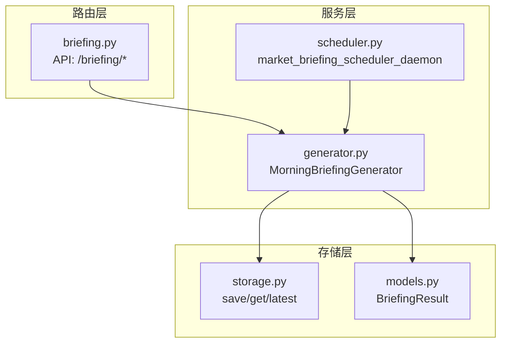
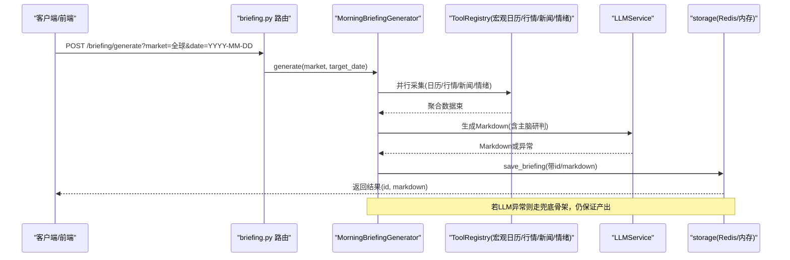
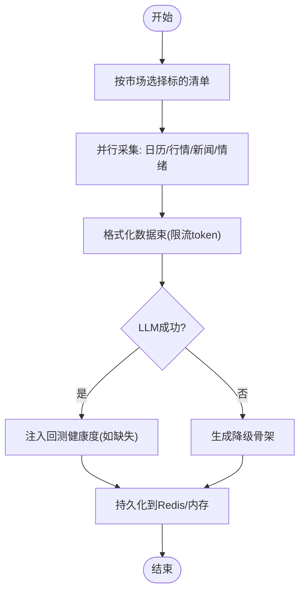
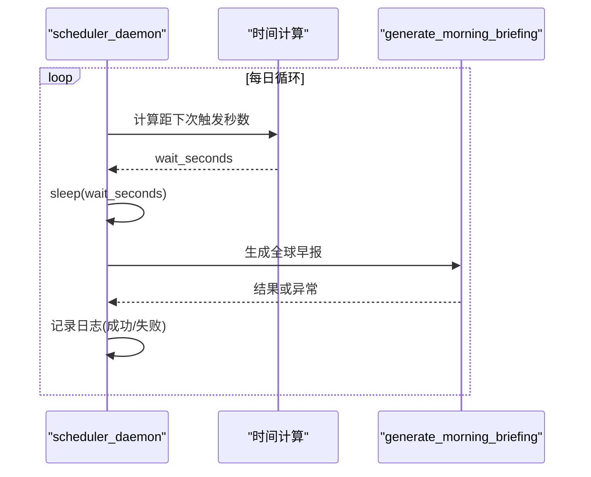
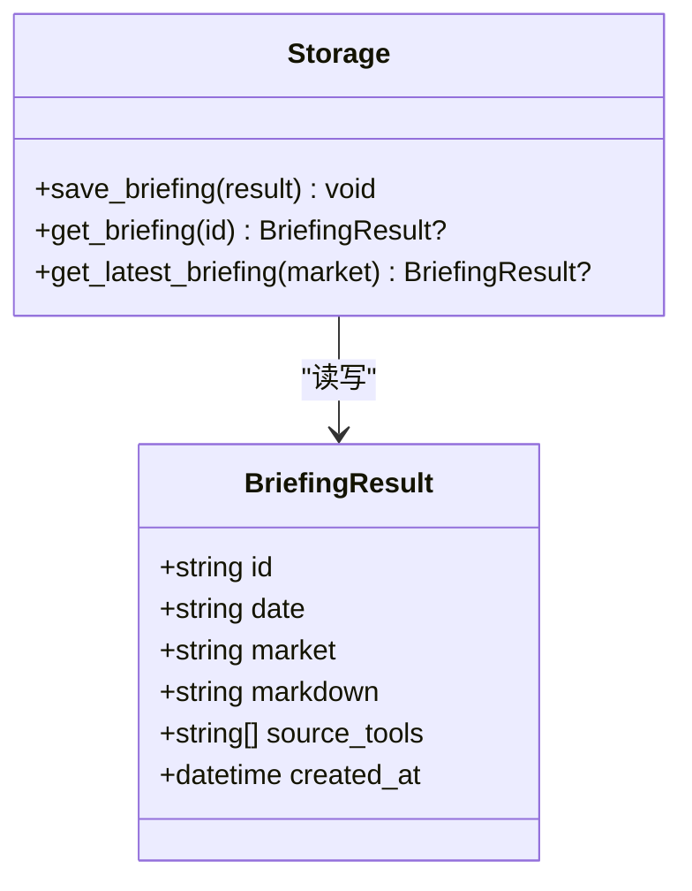
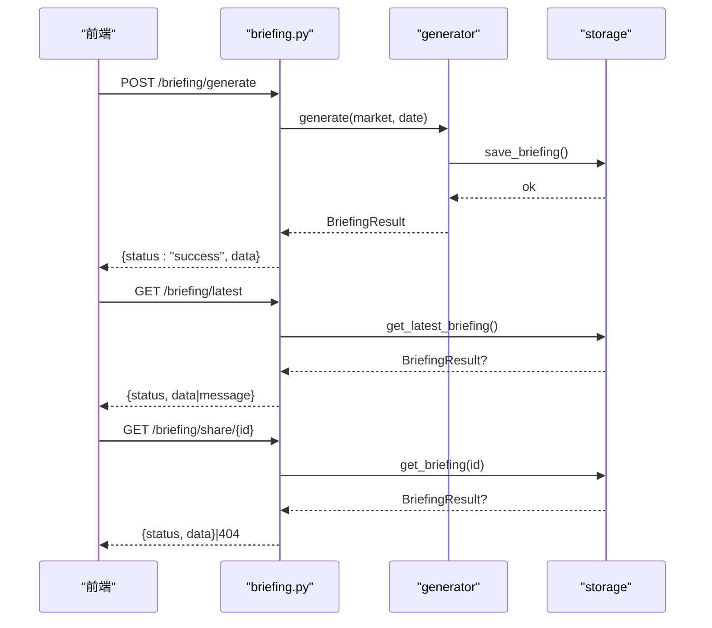
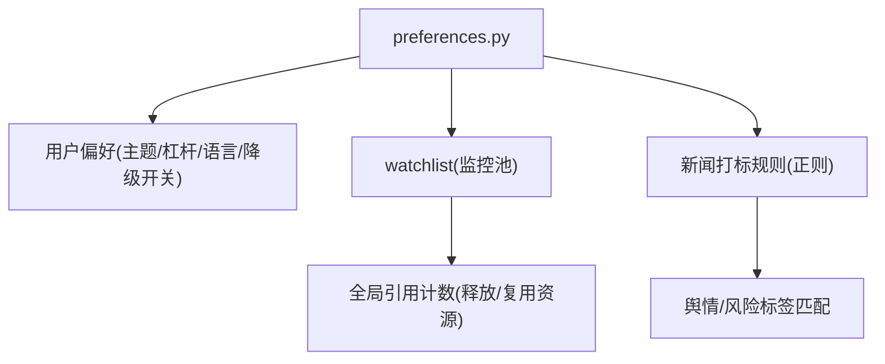
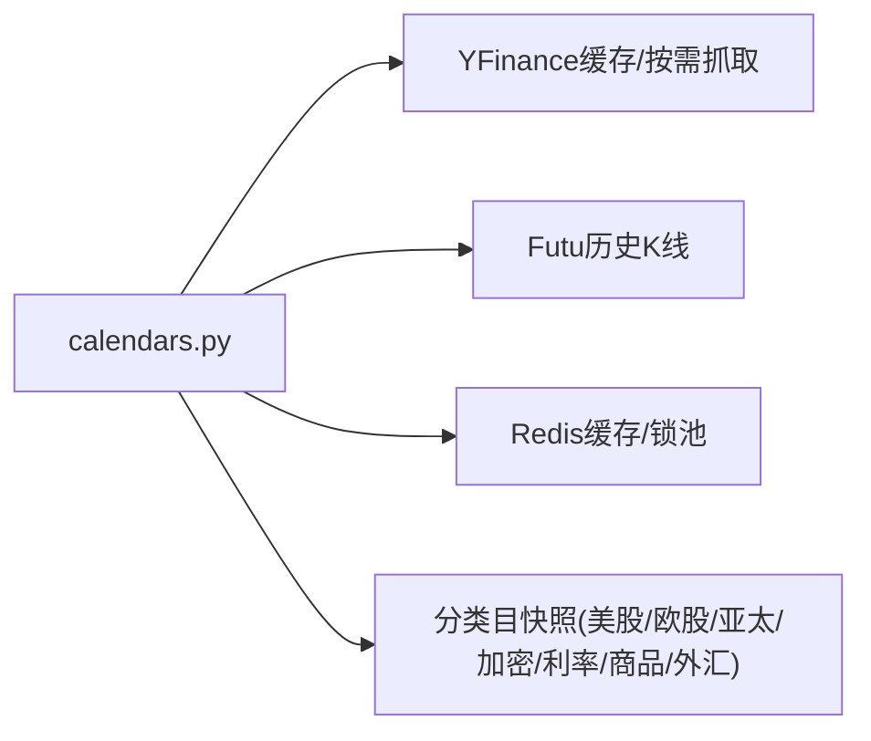
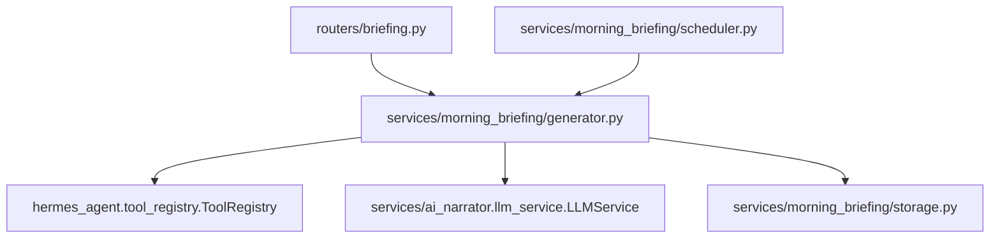

# 晨间简报系统

<cite>
**本文引用的文件**
- [backend/services/morning_briefing/__init__.py](file://backend/services/morning_briefing/__init__.py)
- [backend/services/morning_briefing/generator.py](file://backend/services/morning_briefing/generator.py)
- [backend/services/morning_briefing/models.py](file://backend/services/morning_briefing/models.py)
- [backend/services/morning_briefing/storage.py](file://backend/services/morning_briefing/storage.py)
- [backend/services/morning_briefing/scheduler.py](file://backend/services/morning_briefing/scheduler.py)
- [backend/routers/briefing.py](file://backend/routers/briefing.py)
- [backend/routers/preferences.py](file://backend/routers/preferences.py)
- [backend/routers/calendars.py](file://backend/routers/calendars.py)
- [backend/tests/test_morning_briefing_generator.py](file://backend/tests/test_morning_briefing_generator.py)
</cite>

## 目录
1. [简介](#简介)
2. [项目结构](#项目结构)
3. [核心组件](#核心组件)
4. [架构总览](#架构总览)
5. [详细组件分析](#详细组件分析)
6. [依赖关系分析](#依赖关系分析)
7. [性能考量](#性能考量)
8. [故障排查指南](#故障排查指南)
9. [结论](#结论)
10. [附录](#附录)

## 简介
本技术文档面向 Quant Agent 的“晨间简报系统”，系统性说明其自动生成机制、数据来源整合、定时调度、个性化定制、模板与渲染输出、以及移动端适配与推送通知等能力。该系统通过并行采集宏观日历、行情快照、宏观新闻与情绪指标，结合 LLM 生成可直接渲染的 Markdown 早报，并以 Redis/内存双写持久化，支持手动触发、定时生成、分享链接与 Dashboard 自动加载。

## 项目结构
晨间简报系统位于后端服务模块中，采用“路由层 + 服务层 + 存储层”的分层组织：
- 路由层：对外暴露 API（生成、获取最新、分享）
- 服务层：编排数据源工具、组装提示词、调用 LLM、兜底降级
- 存储层：Redis 持久化与内存兜底，提供按 ID 与按市场查询

**图表来源**
- [backend/routers/briefing.py:1-47](file://backend/routers/briefing.py#L1-L47)
- [backend/services/morning_briefing/generator.py:153-179](file://backend/services/morning_briefing/generator.py#L153-L179)
- [backend/services/morning_briefing/scheduler.py:29-41](file://backend/services/morning_briefing/scheduler.py#L29-L41)
- [backend/services/morning_briefing/storage.py:23-56](file://backend/services/morning_briefing/storage.py#L23-L56)
- [backend/services/morning_briefing/models.py:13-22](file://backend/services/morning_briefing/models.py#L13-L22)

**章节来源**
- [backend/routers/briefing.py:1-47](file://backend/routers/briefing.py#L1-L47)
- [backend/services/morning_briefing/__init__.py:1-26](file://backend/services/morning_briefing/__init__.py#L1-L26)

## 核心组件
- 生成器 MorningBriefingGenerator：编排四大工具（宏观日历、行情快照、宏观新闻、情绪历史），构建数据束并调用 LLM 生成 Markdown；具备回测健康度注入与 LLM 失败兜底。
- 调度器 market_briefing_scheduler_daemon：每日盘前定时触发（默认 09:15），失败仅告警不中断守护循环。
- 存储 storage：Redis 持久化（TTL 7 天）+ 进程内内存兜底，支持按 ID 与按市场取最新。
- 模型 BriefingResult：包含 id、date、market、markdown、source_tools、created_at。
- 路由 briefing：POST 生成、GET 最新、GET 分享短码。

**章节来源**
- [backend/services/morning_briefing/generator.py:153-179](file://backend/services/morning_briefing/generator.py#L153-L179)
- [backend/services/morning_briefing/scheduler.py:18-41](file://backend/services/morning_briefing/scheduler.py#L18-L41)
- [backend/services/morning_briefing/storage.py:23-56](file://backend/services/morning_briefing/storage.py#L23-L56)
- [backend/services/morning_briefing/models.py:13-22](file://backend/services/morning_briefing/models.py#L13-L22)
- [backend/routers/briefing.py:18-46](file://backend/routers/briefing.py#L18-L46)

## 架构总览
晨间简报系统以“数据采集 -> LLM 组装 -> 持久化 -> 分发”为主线，支持多市场标的切换与优雅降级。

**图表来源**
- [backend/routers/briefing.py:18-28](file://backend/routers/briefing.py#L18-L28)
- [backend/services/morning_briefing/generator.py:160-179](file://backend/services/morning_briefing/generator.py#L160-L179)
- [backend/services/morning_briefing/generator.py:182-224](file://backend/services/morning_briefing/generator.py#L182-L224)
- [backend/services/morning_briefing/generator.py:237-251](file://backend/services/morning_briefing/generator.py#L237-L251)
- [backend/services/morning_briefing/storage.py:23-32](file://backend/services/morning_briefing/storage.py#L23-L32)

## 详细组件分析

### 生成器 MorningBriefingGenerator
- 功能要点
  - 按市场选择监控标的清单（A股/港股/美股/全球），并发拉取 QUOTE。
  - 并行采集宏观日历、行情、新闻、情绪历史，统一格式化为数据束。
  - 调用 LLM 生成严格遵循模板的 Markdown；若 LLM 失败，回退到确定性骨架。
  - 安全网：当 LLM 未渲染“回测健康度速览”时，强制注入该区块。
- 关键流程
  - 数据采集：_collect_data 使用 asyncio.gather 并发执行四个工具，任一失败记录日志并继续。
  - 数据精简：_format_data_bundle 控制 token 用量，裁剪事件/新闻/行情条目。
  - Markdown 组装：_build_markdown 拼接提示词并调用 LLM；异常时进入 _fallback_markdown。
  - 持久化：生成后写入 storage，返回带分享 id 的结果。

**图表来源**
- [backend/services/morning_briefing/generator.py:160-179](file://backend/services/morning_briefing/generator.py#L160-L179)
- [backend/services/morning_briefing/generator.py:182-224](file://backend/services/morning_briefing/generator.py#L182-L224)
- [backend/services/morning_briefing/generator.py:237-251](file://backend/services/morning_briefing/generator.py#L237-L251)
- [backend/services/morning_briefing/generator.py:330-345](file://backend/services/morning_briefing/generator.py#L330-L345)

**章节来源**
- [backend/services/morning_briefing/generator.py:27-84](file://backend/services/morning_briefing/generator.py#L27-L84)
- [backend/services/morning_briefing/generator.py:119-150](file://backend/services/morning_briefing/generator.py#L119-L150)
- [backend/services/morning_briefing/generator.py:182-224](file://backend/services/morning_briefing/generator.py#L182-L224)
- [backend/services/morning_briefing/generator.py:237-251](file://backend/services/morning_briefing/generator.py#L237-L251)
- [backend/services/morning_briefing/generator.py:254-327](file://backend/services/morning_briefing/generator.py#L254-L327)
- [backend/services/morning_briefing/generator.py:330-345](file://backend/services/morning_briefing/generator.py#L330-L345)

### 调度器 market_briefing_scheduler_daemon
- 功能要点
  - 基于环境变量 BRIEFING_HOUR/BRIEFING_MINUTE 计算下次触发时间，默认 09:15。
  - 守护循环：sleep 至目标时间后调用 generate_morning_briefing(market="全球")。
  - 异常处理：捕获异常仅记录日志，不中断守护循环，避免资源耗尽。
- 节假日/非工作日逻辑
  - 当前实现为每日固定时间触发，未内置节假日判断；如需节假日调整，可在调度入口增加交易日历校验。

**图表来源**
- [backend/services/morning_briefing/scheduler.py:18-41](file://backend/services/morning_briefing/scheduler.py#L18-L41)

**章节来源**
- [backend/services/morning_briefing/scheduler.py:1-41](file://backend/services/morning_briefing/scheduler.py#L1-L41)

### 存储 storage 与模型 models
- 存储策略
  - 正常环境：写入 Redis，设置 TTL 7 天；同时维护内存字典作为本地缓存。
  - 无 Redis：自动降级为进程内 dict，保证引擎可独立运行与测试。
- 查询接口
  - get_briefing(briefing_id)：按分享短码获取完整早报。
  - get_latest_briefing(market)：按市场获取最新一份。
- 数据模型
  - BriefingResult：id、date、market、markdown、source_tools、created_at。

**图表来源**
- [backend/services/morning_briefing/models.py:13-22](file://backend/services/morning_briefing/models.py#L13-L22)
- [backend/services/morning_briefing/storage.py:23-56](file://backend/services/morning_briefing/storage.py#L23-L56)

**章节来源**
- [backend/services/morning_briefing/storage.py:1-56](file://backend/services/morning_briefing/storage.py#L1-L56)
- [backend/services/morning_briefing/models.py:1-22](file://backend/services/morning_briefing/models.py#L1-L22)

### 路由 briefing
- 端点
  - POST /briefing/generate：手动触发生成，支持 market 与 date 参数。
  - GET /briefing/latest：获取指定市场最新一份。
  - GET /briefing/share/{briefing_id}：按分享短码获取早报。
- 错误处理
  - 生成失败返回 500；分享不存在返回 404。

**图表来源**
- [backend/routers/briefing.py:18-46](file://backend/routers/briefing.py#L18-L46)
- [backend/services/morning_briefing/storage.py:34-56](file://backend/services/morning_briefing/storage.py#L34-L56)

**章节来源**
- [backend/routers/briefing.py:1-47](file://backend/routers/briefing.py#L1-L47)

### 个性化定制与偏好
- 用户偏好
  - 通过 preferences 路由管理用户级配置（主题、杠杆、语言、yfinance 降级开关等）。
  - AI 推送偏好底座支持模块级开关与阈值配置。
- 关注标的跟踪
  - watchlist 接口支持批量加入/移出监控池，联动底层 WebSocket 与新闻轮询进程的资源引用计数。
- 风险提示配置
  - 可通过新闻打标规则自定义关键词正则，辅助风险信号识别。

**图表来源**
- [backend/routers/preferences.py:94-141](file://backend/routers/preferences.py#L94-L141)
- [backend/routers/preferences.py:206-251](file://backend/routers/preferences.py#L206-L251)
- [backend/routers/preferences.py:144-193](file://backend/routers/preferences.py#L144-L193)

**章节来源**
- [backend/routers/preferences.py:1-251](file://backend/routers/preferences.py#L1-L251)

### 宏观日历与外盘表现
- 宏观日历
  - calendars 路由提供全球市场快照、交易时段矩阵、分红/IPO 日历，支持 Finnhub/YFinance/Futu 多源融合与缓存。
- 隔夜外盘表现
  - 通过行情快照与情绪序列（VIX、PCR、信用利差等）反映外盘波动与风险偏好变化，供早报“核心标的监控”与“情绪风向标”使用。

**图表来源**
- [backend/routers/calendars.py:425-445](file://backend/routers/calendars.py#L425-L445)
- [backend/routers/calendars.py:279-324](file://backend/routers/calendars.py#L279-L324)
- [backend/routers/calendars.py:327-376](file://backend/routers/calendars.py#L327-L376)

**章节来源**
- [backend/routers/calendars.py:1-638](file://backend/routers/calendars.py#L1-L638)

## 依赖关系分析
- 生成器依赖
  - ToolRegistry：执行宏观日历、行情、新闻、情绪工具。
  - LLMService：生成 Markdown。
  - storage：持久化结果。
- 路由依赖
  - generator：触发生成与获取最新。
  - storage：读取分享与最新。
- 调度器依赖
  - generator：定时生成全球早报。

**图表来源**
- [backend/routers/briefing.py:12-13](file://backend/routers/briefing.py#L12-L13)
- [backend/services/morning_briefing/generator.py:20-23](file://backend/services/morning_briefing/generator.py#L20-L23)
- [backend/services/morning_briefing/scheduler.py:13-14](file://backend/services/morning_briefing/scheduler.py#L13-L14)

**章节来源**
- [backend/routers/briefing.py:1-47](file://backend/routers/briefing.py#L1-L47)
- [backend/services/morning_briefing/generator.py:1-351](file://backend/services/morning_briefing/generator.py#L1-L351)
- [backend/services/morning_briefing/scheduler.py:1-41](file://backend/services/morning_briefing/scheduler.py#L1-L41)

## 性能考量
- 并发采集：使用 asyncio.gather 并行请求宏观日历、行情、新闻、情绪，降低端到端延迟。
- Token 控制：_format_data_bundle 限制事件/新闻/行情条目数量，避免 LLM 输入过长。
- 降级与容错：单工具失败不影响整体流程；LLM 失败回退到确定性骨架，确保有产出。
- 缓存与 TTL：Redis 存储 7 天 TTL，减少重复生成与网络开销；日历快照使用短期缓存与细粒度锁防击穿。
- 资源释放：watchlist 引用计数在移除归零时释放底层资源，避免内存泄漏。

[本节为通用性能建议，无需特定文件引用]

## 故障排查指南
- 常见问题
  - LLM 不可用：检查 LLMService 连接与配额；确认生成器已触发兜底骨架。
  - 数据源限流：观察 calendars 路由中的限流退避与降级信号；必要时等待恢复。
  - Redis 不可用：storage 自动降级为内存字典，重启后需重新生成早报。
  - 分享链接失效：检查 briefing_id 是否存在且未过期（TTL 7 天）。
- 定位方法
  - 查看日志：生成器与调度器均记录关键步骤与异常。
  - 单元测试：参考 test_morning_briefing_generator 验证 mock 场景下的行为。

**章节来源**
- [backend/services/morning_briefing/generator.py:237-251](file://backend/services/morning_briefing/generator.py#L237-L251)
- [backend/services/morning_briefing/storage.py:27-32](file://backend/services/morning_briefing/storage.py#L27-L32)
- [backend/routers/calendars.py:522-579](file://backend/routers/calendars.py#L522-L579)
- [backend/tests/test_morning_briefing_generator.py:98-111](file://backend/tests/test_morning_briefing_generator.py#L98-L111)

## 结论
晨间简报系统以高可用、可扩展为核心设计目标，通过并行数据采集、LLM 智能组装、稳健降级与持久化共享，为投资者提供每日市场概览与决策辅助。系统支持多市场标的切换、个性化偏好与关注标的跟踪，并通过定时调度保障每日自动生成。未来可在调度层引入交易日历与节假日判断，进一步增强自动化与准确性。

[本节为总结性内容，无需特定文件引用]

## 附录
- 模板与输出
  - 模板：生成器内置 Markdown 模板，要求严格遵循结构（宏观高危雷达、核心标的监控、回测健康度速览、主脑综合研判）。
  - 输出：当前产物为 Markdown 字符串，前端可预览、复制与分享；如需 HTML/PDF，可在前端或网关层进行二次转换。
- 移动端适配与推送
  - 移动端：前端可使用 Markdown 渲染组件展示早报；分享链接便于跨设备访问。
  - 推送通知：可结合 alert/notification 子系统，将最新早报摘要或关键风险提示推送到飞书/Telegram/站内信等通道。

[本节为概念性补充，无需特定文件引用]
