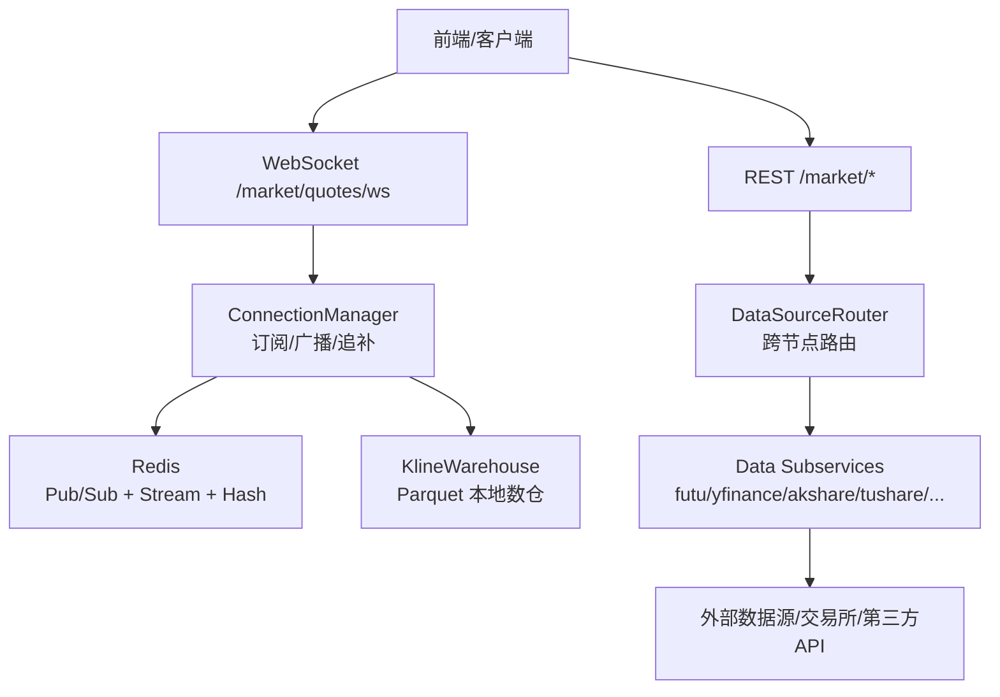
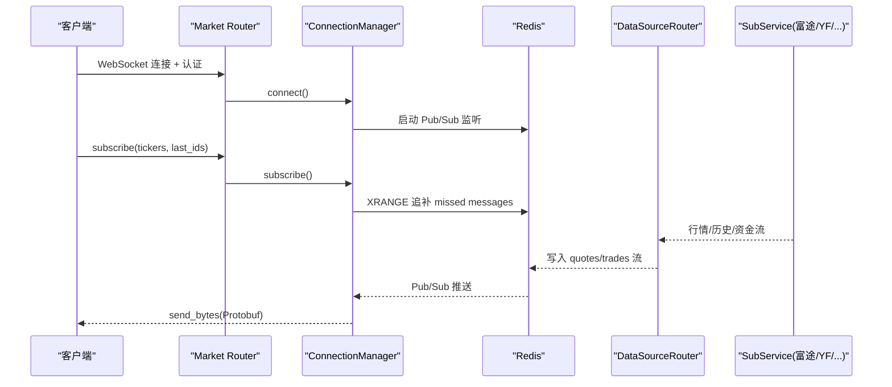
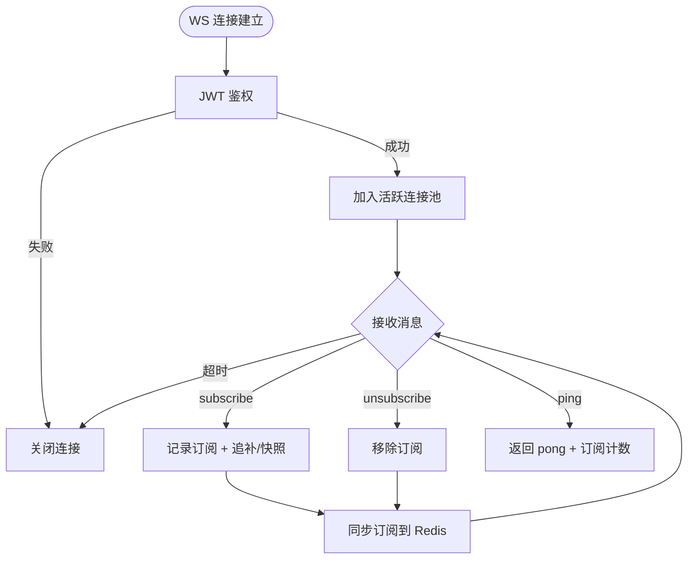
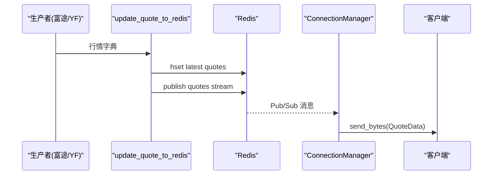
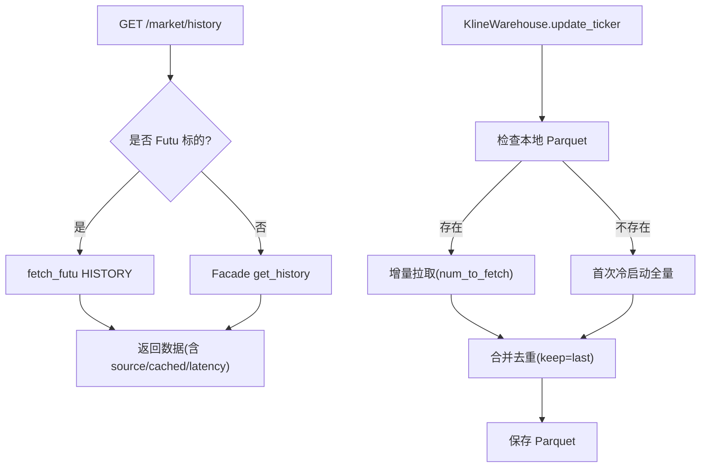
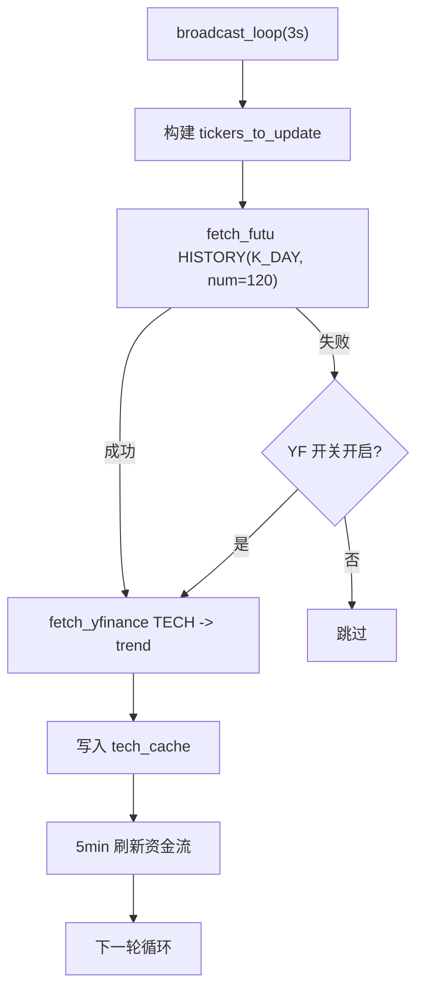
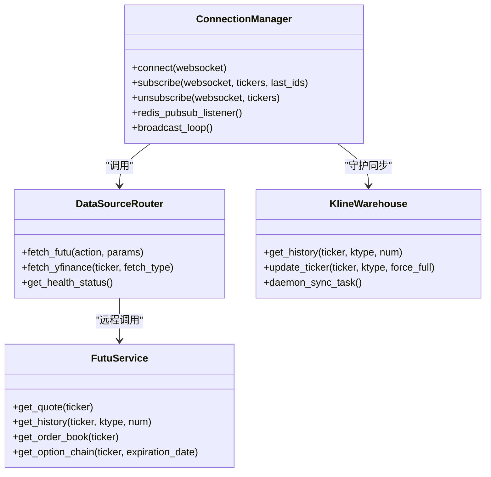

# 市场数据服务

<cite>
**本文引用的文件**
- [backend/app/market_data.py](file://backend/app/market_data.py)
- [backend/services/market_engine.py](file://backend/services/market_engine.py)
- [backend/routers/market.py](file://backend/routers/market.py)
- [data_subservice/futu_src/service.py](file://data_subservice/futu_src/service.py)
- [backend/core/cache_manager.py](file://backend/core/cache_manager.py)
- [backend/services/datasource/router.py](file://backend/services/datasource/router.py)
- [backend/services/datalake/kline_warehouse.py](file://backend/services/datalake/kline_warehouse.py)
- [backend/core/proto/market_pb2.py](file://backend/core/proto/market_pb2.py)
- [backend/services/datasource/__init__.py](file://backend/services/datasource/__init__.py)
- [backend/services/fund_flow/ticker.py](file://backend/services/fund_flow/ticker.py)
</cite>

## 目录
1. [简介](#简介)
2. [项目结构](#项目结构)
3. [核心组件](#核心组件)
4. [架构总览](#架构总览)
5. [详细组件分析](#详细组件分析)
6. [依赖关系分析](#依赖关系分析)
7. [性能考量](#性能考量)
8. [故障排查指南](#故障排查指南)
9. [结论](#结论)
10. [附录：API 使用规范与扩展指南](#附录api-使用规范与扩展指南)

## 简介
本技术文档面向市场数据开发者，系统性阐述 Quant Agent 市场数据服务的实时行情处理架构、历史数据查询、K线数仓、技术指标计算、多数据源聚合与标准化、质量校验、盘口深度/成交明细/资金流向等高级数据的获取与处理流程；并给出缓存策略、增量更新机制、版本管理、扩展新数据源与自定义指标、以及性能调优的实践指南。

## 项目结构
市场数据服务由“主服务（FastAPI）+ 数据子服务（data_subservice）”构成：
- 主服务负责 WebSocket 连接管理、订阅分发、Redis 总线广播、定时轮询兜底、指标与资金流缓存、K线数仓守护同步。
- 数据子服务承载具体数据源（富途、YFinance、Tushare、AKShare、FMP、Finnhub、宏观源等），提供统一 HTTP 接口，主服务通过 DataSourceRouter 路由到对应节点。

图表来源
- [backend/routers/market.py:73-226](file://backend/routers/market.py#L73-L226)
- [backend/services/market_engine.py:115-331](file://backend/services/market_engine.py#L115-L331)
- [backend/services/datasource/router.py:249-800](file://backend/services/datasource/router.py#L249-L800)
- [backend/services/datalake/kline_warehouse.py:16-258](file://backend/services/datalake/kline_warehouse.py#L16-L258)

章节来源
- [backend/routers/market.py:73-226](file://backend/routers/market.py#L73-L226)
- [backend/services/market_engine.py:115-331](file://backend/services/market_engine.py#L115-L331)
- [backend/services/datasource/router.py:249-800](file://backend/services/datasource/router.py#L249-L800)
- [backend/services/datalake/kline_warehouse.py:16-258](file://backend/services/datalake/kline_warehouse.py#L16-L258)

## 核心组件
- WebSocket 行情推送与订阅管理：连接鉴权、心跳保活、订阅去重、背压保护、断线追补。
- 行情数据总线：基于 Redis Pub/Sub 与 Stream，实现低延迟广播与断线恢复。
- 数据源路由：统一封装各数据源调用，支持多节点负载均衡、熔断自愈、限流退避。
- K线数仓：本地 Parquet 存储，增量追加与全量降级拉取，守护进程每日错峰同步。
- 技术指标与资金流缓存：内存缓存 + 节流水位控制，避免高频请求风暴。
- 缓存清理工具：安全清理业务缓存，保护交易态数据。

章节来源
- [backend/routers/market.py:73-226](file://backend/routers/market.py#L73-L226)
- [backend/services/market_engine.py:39-138](file://backend/services/market_engine.py#L39-L138)
- [backend/services/datasource/router.py:249-800](file://backend/services/datasource/router.py#L249-L800)
- [backend/services/datalake/kline_warehouse.py:16-258](file://backend/services/datalake/kline_warehouse.py#L16-L258)
- [backend/core/cache_manager.py:1-75](file://backend/core/cache_manager.py#L1-L75)

## 架构总览
系统采用“事件驱动 + 总线广播 + 多源路由”的架构：
- 生产者侧：富途/YFinance/AKShare/Tushare/FMP/Finnhub/宏观源等数据源经子服务统一接入，写入 Redis 行情总线与 K线数仓。
- 消费者侧：WebSocket 连接监听 Redis 频道，按订阅标的定向推送；REST 接口通过 DataSourceRouter 选择最优数据源并返回扁平化结果。
- 容错与降级：熔断器、半开探针、限流退避、离线模式、YFinance 兜底、K线数仓本地读取。

图表来源
- [backend/routers/market.py:73-226](file://backend/routers/market.py#L73-L226)
- [backend/services/market_engine.py:191-331](file://backend/services/market_engine.py#L191-L331)
- [backend/services/datasource/router.py:669-748](file://backend/services/datasource/router.py#L669-L748)

## 详细组件分析

### WebSocket 连接管理与订阅机制
- 连接鉴权：从 QueryString 提取 JWT token 校验，失败则关闭连接。
- 心跳保活：维护 last_heartbeat，超时自动断开。
- 订阅去重：重复订阅同一 ticker 不会重复注册。
- 断线追补：利用 Redis Stream XRANGE 根据 last_id 拉取错过的消息，批量压缩发送提升吞吐。
- 订阅同步：将当前所有连接的订阅集合同步至 Redis，供行情生产者 daemon 动态跟随前端自选列表推送。

图表来源
- [backend/routers/market.py:73-226](file://backend/routers/market.py#L73-L226)
- [backend/services/market_engine.py:191-267](file://backend/services/market_engine.py#L191-L267)

章节来源
- [backend/routers/market.py:73-226](file://backend/routers/market.py#L73-L226)
- [backend/services/market_engine.py:191-267](file://backend/services/market_engine.py#L191-L267)

### 实时行情数据处理与数据流分发
- Protobuf 序列化：行情数据以 QuoteData/Order 结构序列化后写入 Redis Hash 与 Pub/Sub。
- 双写逻辑：最新价写入 Hash，逐笔成交写入 Stream，同时通过 Pub/Sub 广播给在线客户端。
- 指标埋点：记录行情总量、延迟、陈旧度等指标。
- 报警检测：基于 Redis 中用户配置的价格上下限或涨跌幅阈值触发通知。

图表来源
- [backend/services/market_engine.py:39-113](file://backend/services/market_engine.py#L39-L113)
- [backend/core/proto/market_pb2.py:1-34](file://backend/core/proto/market_pb2.py#L1-L34)

章节来源
- [backend/services/market_engine.py:39-113](file://backend/services/market_engine.py#L39-L113)
- [backend/core/proto/market_pb2.py:1-34](file://backend/core/proto/market_pb2.py#L1-L34)

### 历史数据查询接口与 K 线处理
- REST 接口：/market/history 支持 Futu 优先、Facade 兜底（AkShare/YFinance）。
- K线数仓：本地 Parquet 存储，增量追加（时间差判断 + 冗余天数）、全量降级拉取（富途配额不足时切换 YFinance）。
- 守护同步：每日凌晨错峰执行全量资产增量同步，成功后发布日快照与保留策略。

图表来源
- [backend/routers/market.py:492-545](file://backend/routers/market.py#L492-L545)
- [backend/services/datalake/kline_warehouse.py:55-173](file://backend/services/datalake/kline_warehouse.py#L55-L173)

章节来源
- [backend/routers/market.py:492-545](file://backend/routers/market.py#L492-L545)
- [backend/services/datalake/kline_warehouse.py:55-173](file://backend/services/datalake/kline_warehouse.py#L55-L173)

### 技术指标计算服务与缓存策略
- 背景任务：每 3 秒循环，优先从富途获取日线历史，再调用 YFinance 计算趋势指标，缓存于内存 tech_cache。
- 防请求风暴：未缓存且非 unsupported 的标的才尝试，失败记录 last_tech_attempt 退避 600s。
- 资金流缓存：低频数据 5 分钟粒度刷新，避免打爆子服务线程池。

图表来源
- [backend/services/market_engine.py:332-460](file://backend/services/market_engine.py#L332-L460)

章节来源
- [backend/services/market_engine.py:332-460](file://backend/services/market_engine.py#L332-L460)

### 多数据源聚合、标准化与质量校验
- 统一返回结构：Result/ResultStatus/ErrorInfo/RateLimitInfo 标准化各源响应。
- 错误分类：区分普通错误与限流/配额耗尽/IP封禁/数据不可用，影响熔断与退避策略。
- 路由策略：按能力集选择健康节点，支持多活容灾与动作级熔断隔离。
- 降级信号：Facade 返回 degraded/degraded_message，前端可感知数据新鲜度。

章节来源
- [backend/services/datasource/__init__.py:23-468](file://backend/services/datasource/__init__.py#L23-L468)
- [backend/services/datasource/router.py:249-800](file://backend/services/datasource/router.py#L249-L800)
- [backend/routers/market.py:48-70](file://backend/routers/market.py#L48-L70)

### 盘口深度、成交明细、资金流向等高级数据
- 盘口深度：/market/order-book 经 Facade 获取富途 ORDER_BOOK。
- 成交明细：Redis Stream quant:trades:stream:{ticker} 持久化最近 5000 条，用于断线追补。
- 资金流向：/market/fund-flow 与 /market/capital-flow/{ticker} 经富途通道获取，后台定时刷新并缓存。
- 经纪商席位：/market/top-brokers/{ticker} 实时队列或十大净买卖兜底。

章节来源
- [backend/routers/market.py:660-757](file://backend/routers/market.py#L660-L757)
- [backend/services/market_engine.py:103-113](file://backend/services/market_engine.py#L103-L113)

### 数据缓存策略、增量更新与版本管理
- 缓存策略：
  - Redis Hash：quant:quotes:latest 存储最新行情 Protobuf。
  - Redis Stream：quant:trades:stream:{ticker} 保留最近 5000 条。
  - 内存缓存：tech_cache/flow_cache 控制刷新频率与退避。
- 增量更新：K线数仓按时间差计算 num_to_fetch，合并去重 keep='last' 保证最新复权覆盖旧数据。
- 版本管理：每日凌晨同步成功后发布日快照，支持保留策略清理过期快照。

章节来源
- [backend/services/market_engine.py:191-243](file://backend/services/market_engine.py#L191-L243)
- [backend/services/datalake/kline_warehouse.py:175-258](file://backend/services/datalake/kline_warehouse.py#L175-L258)
- [backend/core/cache_manager.py:47-75](file://backend/core/cache_manager.py#L47-L75)

## 依赖关系分析
- 主服务依赖：
  - WebSocket 路由 → ConnectionManager → Redis 总线。
  - REST 路由 → DataSourceRouter → 数据子服务。
  - K线数仓 → 本地 Parquet + 数据源路由。
- 数据子服务：
  - 富途服务：连接管理、缓存管理、各 Handler（报价、期权、筛选、交易等）。
  - 路由层：Local/Remote/Auto 三种模式，支持多节点与能力集。

图表来源
- [backend/services/market_engine.py:115-605](file://backend/services/market_engine.py#L115-L605)
- [backend/services/datasource/router.py:249-800](file://backend/services/datasource/router.py#L249-L800)
- [backend/services/datalake/kline_warehouse.py:16-258](file://backend/services/datalake/kline_warehouse.py#L16-L258)
- [data_subservice/futu_src/service.py:31-440](file://data_subservice/futu_src/service.py#L31-L440)

章节来源
- [backend/services/market_engine.py:115-605](file://backend/services/market_engine.py#L115-L605)
- [backend/services/datasource/router.py:249-800](file://backend/services/datasource/router.py#L249-L800)
- [backend/services/datalake/kline_warehouse.py:16-258](file://backend/services/datalake/kline_warehouse.py#L16-L258)
- [data_subservice/futu_src/service.py:31-440](file://data_subservice/futu_src/service.py#L31-L440)

## 性能考量
- 低延迟推送：Protobuf 序列化 + Redis Pub/Sub 广播，避免 JSON 解析开销。
- 批量压缩：超过 100 条消息组合为单一二进制帧并 zlib 压缩发送，降低网络开销。
- 防请求风暴：技术指标与资金流刷新设置退避与节流水位，避免打爆子服务线程池。
- 熔断与自愈：动作级熔断隔离 + 半开探针自动恢复，保障高可用。
- 本地极速读取：K线数仓 Parquet 列式存储，回测引擎纳秒级读取。

[本节为通用性能指导，不直接分析具体文件]

## 故障排查指南
- WebSocket 连接问题：检查 JWT 鉴权、心跳超时、订阅去重逻辑。
- 行情推送延迟：查看 Redis Pub/Sub 是否阻塞，确认 XRANGE 追补是否生效。
- 数据源不可用：通过 /market/health/services 检查各源状态，关注熔断与限流信息。
- K线同步失败：检查富途额度、YFinance 兜底、Parquet 写入权限。
- 缓存清理风险：使用 cache_manager.clear_cache 仅清理业务缓存，保护交易态数据。

章节来源
- [backend/routers/market.py:228-327](file://backend/routers/market.py#L228-L327)
- [backend/core/cache_manager.py:47-75](file://backend/core/cache_manager.py#L47-L75)

## 结论
Quant Agent 市场数据服务通过 WebSocket + Redis 总线实现低延迟实时推送，结合 DataSourceRouter 与多数据源路由保障高可用与弹性伸缩；K线数仓提供稳定、增量、不重建的本地备份，支撑回测与可视化；技术指标与资金流缓存优化了后端压力；统一的 Result/ErrorInfo 体系实现了数据标准化与质量校验。整体架构清晰、可扩展性强，适合大规模市场数据场景。

[本节为总结性内容，不直接分析具体文件]

## 附录：API 使用规范与扩展指南

### API 使用规范
- WebSocket：
  - 端点：/market/quotes/ws
  - 认证：Query String ?token=<jwt>
  - 消息：action=subscribe/unsubscribe/ping，tickers 支持逗号分隔，自动格式化为富途前缀。
- REST：
  - 行情：GET /market/quote?ticker=...
  - 历史：GET /market/history?ticker=...&ktype=K_DAY&num=60
  - 盘口：GET /market/order-book?ticker=...
  - 资金流：GET /market/fund-flow?ticker=... 与 GET /market/capital-flow/{ticker}?period_type=INTRADAY
  - 经纪商：GET /market/top-brokers/{ticker}
  - 健康：GET /market/health/services

章节来源
- [backend/routers/market.py:73-800](file://backend/routers/market.py#L73-L800)

### 扩展新数据源
- 在数据子服务中新增 worker，实现统一 action 处理。
- 在 DataSourceRouter 中注册节点与 capabilities，配置环境变量 URL。
- 在主服务路由中通过 fetch_xxx 调用新数据源，遵循 Result 标准化返回。

章节来源
- [backend/services/datasource/router.py:249-800](file://backend/services/datasource/router.py#L249-L800)

### 自定义指标计算
- 在 broadcast_loop 中增加新的指标计算逻辑，写入内存缓存。
- 遵循防请求风暴策略，设置退避与节流水位。
- 通过 REST 接口暴露指标查询。

章节来源
- [backend/services/market_engine.py:332-460](file://backend/services/market_engine.py#L332-L460)

### 性能调优建议
- 调整 Redis 缓冲区大小与连接池参数。
- 优化 Protobuf 字段以减少序列化体积。
- 合理设置 K线数仓增量拉取数量与周期。
- 监控熔断与限流指标，动态调整节点权重。

[本节为通用性能指导，不直接分析具体文件]
