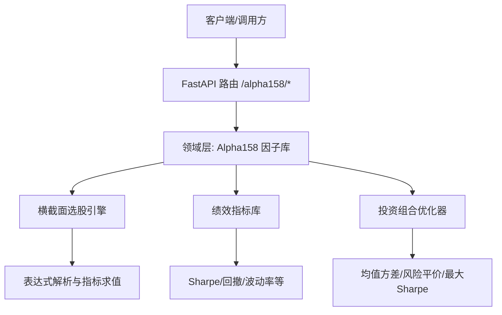
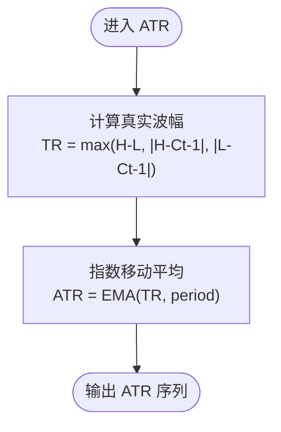
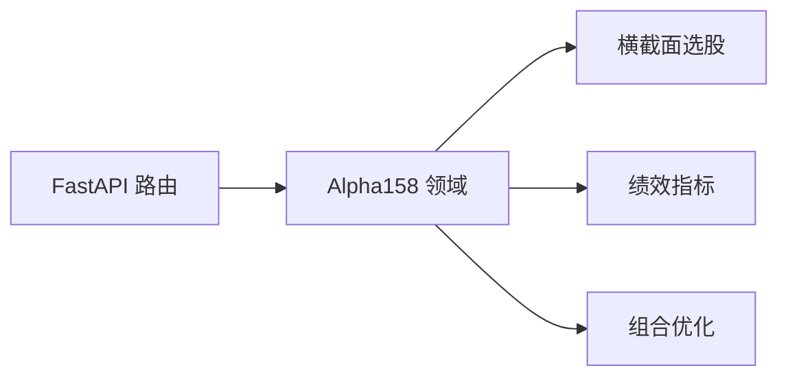

# Alpha158因子库

<cite>
**本文引用的文件**
- [backend/domain/alpha158.py](file://backend/domain/alpha158.py)
- [backend/routers/alpha158.py](file://backend/routers/alpha158.py)
- [backend/tests/test_alpha158.py](file://backend/tests/test_alpha158.py)
- [backend/domain/cross_sectional.py](file://backend/domain/cross_sectional.py)
- [backend/domain/performance.py](file://backend/domain/performance.py)
- [backend/domain/portfolio_optimizer.py](file://backend/domain/portfolio_optimizer.py)
</cite>

## 目录
1. [简介](#简介)
2. [项目结构](#项目结构)
3. [核心组件](#核心组件)
4. [架构总览](#架构总览)
5. [详细组件分析](#详细组件分析)
6. [依赖关系分析](#依赖关系分析)
7. [性能考量](#性能考量)
8. [故障排查指南](#故障排查指南)
9. [结论](#结论)
10. [附录](#附录)

## 简介
本技术文档系统化梳理Alpha158因子库的实现与使用，覆盖因子的定义、计算方法、理论基础与应用场景；对时序因子、横截面因子、波动率因子、流动性（量价）因子等进行分类说明；给出每个因子的数学公式、参数含义、数据要求、计算复杂度；并提供标准化、缺失值处理、异常值处理的实践建议；结合回测验证、相关性分析与组合构建策略，形成从因子挖掘、筛选到组合的完整工作流与最佳实践。

## 项目结构
Alpha158因子库位于后端领域层，提供纯pandas矢量化实现，并通过FastAPI路由暴露计算接口；同时配套横截面选股引擎、绩效指标与投资组合优化模块，便于端到端研究与交易闭环。



图表来源
- [backend/routers/alpha158.py:1-73](file://backend/routers/alpha158.py#L1-L73)
- [backend/domain/alpha158.py:1-385](file://backend/domain/alpha158.py#L1-L385)
- [backend/domain/cross_sectional.py:1-321](file://backend/domain/cross_sectional.py#L1-L321)
- [backend/domain/performance.py:1-177](file://backend/domain/performance.py#L1-L177)
- [backend/domain/portfolio_optimizer.py:1-355](file://backend/domain/portfolio_optimizer.py#L1-L355)

章节来源
- [backend/routers/alpha158.py:1-73](file://backend/routers/alpha158.py#L1-L73)
- [backend/domain/alpha158.py:1-385](file://backend/domain/alpha158.py#L1-L385)

## 核心组件
- Alpha158因子库：提供动量、波动率、量价、均线、统计、衍生六大类因子，统一注册表管理，支持单因子与全量计算。
- 横截面选股引擎：基于安全表达式解析，对多标的进行技术指标组合筛选。
- 绩效指标库：Sharpe、最大回撤、年化收益、波动率、跟踪误差、信号一致率等。
- 投资组合优化器：Markowitz均值-方差、风险平价、最大Sharpe、有效前沿与模型对比。

章节来源
- [backend/domain/alpha158.py:31-385](file://backend/domain/alpha158.py#L31-L385)
- [backend/domain/cross_sectional.py:105-321](file://backend/domain/cross_sectional.py#L105-L321)
- [backend/domain/performance.py:14-177](file://backend/domain/performance.py#L14-L177)
- [backend/domain/portfolio_optimizer.py:42-355](file://backend/domain/portfolio_optimizer.py#L42-L355)

## 架构总览
Alpha158因子库采用“函数式+注册表”的轻量设计，所有因子以静态方法实现，通过FACTOR_REGISTRY集中管理名称、默认参数与类别。API路由负责接收K线数据并返回因子矩阵或指定因子序列。横截面选股引擎在个股维度计算技术指标后，用安全表达式进行条件筛选。绩效与优化模块为后续回测与组合构建提供工具。

```mermaid
sequenceDiagram
participant Client as "调用方"
participant Router as "FastAPI 路由"
participant Domain as "Alpha158 领域"
participant Eval as "横截面选股"
participant Perf as "绩效指标"
participant Opt as "组合优化"
Client->>Router : POST /alpha158/compute {factor_names, kline_data}
Router->>Domain : compute_all_factors(df)
Domain-->>Router : 因子矩阵 DataFrame
Router-->>Client : {factors, index}
Note over Client,Opt : 可选：将因子用于横截面筛选、绩效评估与组合优化
```

图表来源
- [backend/routers/alpha158.py:30-73](file://backend/routers/alpha158.py#L30-L73)
- [backend/domain/alpha158.py:363-379](file://backend/domain/alpha158.py#L363-L379)

## 详细组件分析

### Alpha158因子库
- 设计要点
  - 纯pandas矢量化实现，避免显式循环，提升计算效率。
  - 统一的安全列获取函数，缺失列时返回默认Series，增强鲁棒性。
  - FACTOR_REGISTRY集中管理因子名、默认参数与类别，便于扩展与维护。
  - 提供compute_factor与compute_all_factors两种计算入口。

- 因子分类与代表性因子
  - 动量类：ROC、MOM、RSI、KDJ(K/D)、Williams %R、CCI等。
  - 波动率类：STD、ATR、Bollinger带宽、Realized Volatility、日内振幅等。
  - 量价类：VWAP、OBV、量比、MFI、AD Line等。
  - 均线类：SMA、EMA、MACD(DIF/DEA/Histogram)、DMA等。
  - 统计类：偏度、峰度、量价相关、Beta、滚动最大回撤等。
  - 衍生类：收盘价相对SMA偏离、多日收益率、换手率均值等。

- 关键数学公式与参数说明（节选）
  - ROC(period): 价格变动率 = close[t] / close[t-period] - 1
  - MOM(period): 动量 = close[t] - close[t-period]
  - RSI(period): Wilder平滑的相对强弱指数，区间[0,100]
  - KDJ(n,m1,m2): RSV平滑得到K，再平滑得到D，J=3K-2D
  - Williams %R(period): -(最高N日高 - close)/(最高N日高 - 最低N日低)*100
  - CCI(period): (TP - SMA(TP)) / (0.015 * MAD(TP))
  - STD(period): 收盘价滚动标准差
  - ATR(period): True Range的指数移动平均
  - Bollinger带宽(period,std_dev): (上轨-下轨)/中轨
  - Realized Volatility(period): log收益率滚动标准差*sqrt(252)
  - VWAP: 近N日加权均价近似
  - OBV: 涨跌方向乘以成交量累计
  - 量比(period): volume / rolling mean(volume)
  - MFI(period): 基于典型价与成交量的资金流量指数
  - AD Line: 累积分配线
  - SMA/EMA: 简单/指数移动平均
  - MACD: DIF=EMA(fast)-EMA(slow), DEA=EMA(DIF), Histogram=2*(DIF-DEA)
  - DMA(short,long): 短周期均线与长周期均线之差
  - Skewness/Kurtosis(period): 收益率滚动偏度/峰度
  - Correlation(period): 收盘价与成交量滚动相关
  - Beta(period): 自身收益率与其滞后一期的回归系数
  - Max Drawdown(period): 滚动窗口内最大回撤
  - Close/SMA ratio(period): close/SMA - 1
  - Return_5d/Return_20d: 多日收益率
  - Turn Over Rate(period): 成交量滚动均值（作为流动性代理）

- 数据要求
  - 基础列：close（必需），high/low/volume（按需）。
  - 时间索引：按交易日排序的时间戳或整数索引。
  - 缺失值：内部对除零与空值做保护，但输入应尽量干净。

- 计算复杂度
  - 多数因子为O(N)或O(N·period)，滚动窗口操作由pandas底层C实现，整体高效。
  - 复杂统计（如滚动偏度/峰度/相关）略高于线性，但仍可接受。

- 测试覆盖
  - 单元测试覆盖各因子范围、边界与正确性，包括缺失列与空DataFrame场景。

章节来源
- [backend/domain/alpha158.py:24-315](file://backend/domain/alpha158.py#L24-L315)
- [backend/domain/alpha158.py:318-385](file://backend/domain/alpha158.py#L318-L385)
- [backend/tests/test_alpha158.py:20-271](file://backend/tests/test_alpha158.py#L20-L271)

#### 因子计算流程图（示例：ATR）


图表来源
- [backend/domain/alpha158.py:109-123](file://backend/domain/alpha158.py#L109-L123)

### 横截面选股引擎
- 功能概述
  - 计算常用技术指标（RSI、KDJ、MACD、BOLL、ATR、量比、SMA/EMA系列）。
  - 提供安全表达式解析器，支持跨指标逻辑组合（如RSI(14) < 30 AND MACD.histogram > 0）。
  - 对每只标的执行表达式求值，返回最新时刻满足条件的标的快照。

- 安全机制
  - 白名单校验仅允许特定指标名、运算符与数字。
  - 用户友好名映射到实际列名，屏蔽危险字符与非法token。

- 适用场景
  - 快速筛选符合多指标共振的候选池。
  - 与Alpha158因子结合，进行多维信号过滤。

章节来源
- [backend/domain/cross_sectional.py:105-321](file://backend/domain/cross_sectional.py#L105-L321)

### 绩效指标库
- 指标清单
  - Sharpe比率、最大回撤、年化收益率、波动率、跟踪误差、超额收益序列、累计收益率、信号一致率。
- 用途
  - 对因子或策略的收益序列进行评估。
  - 与组合优化结果联动，衡量风险调整后收益。

章节来源
- [backend/domain/performance.py:14-177](file://backend/domain/performance.py#L14-L177)

### 投资组合优化器
- 能力
  - Markowitz均值-方差优化、风险平价、最大Sharpe、有效前沿、多模型对比。
  - 约束：权重和=1、非负、单只上限。
- 输出
  - 权重、预期收益、波动率、Sharpe、风险贡献、有效持仓数。

章节来源
- [backend/domain/portfolio_optimizer.py:42-355](file://backend/domain/portfolio_optimizer.py#L42-L355)

## 依赖关系分析
- 模块耦合
  - 路由层仅依赖领域层的Alpha158计算函数，保持薄封装。
  - 横截面选股独立于Alpha158，但可与因子结果联合使用。
  - 绩效与优化模块为通用工具，不直接依赖Alpha158，但可消费其输出。

- 外部依赖
  - pandas/numpy用于矢量化计算。
  - scipy.optimize用于组合优化求解。



图表来源
- [backend/routers/alpha158.py:1-73](file://backend/routers/alpha158.py#L1-L73)
- [backend/domain/alpha158.py:1-385](file://backend/domain/alpha158.py#L1-L385)
- [backend/domain/cross_sectional.py:1-321](file://backend/domain/cross_sectional.py#L1-L321)
- [backend/domain/performance.py:1-177](file://backend/domain/performance.py#L1-L177)
- [backend/domain/portfolio_optimizer.py:1-355](file://backend/domain/portfolio_optimizer.py#L1-L355)

## 性能考量
- 矢量化优先：所有因子使用pandas滚动/指数移动平均等向量化操作，避免Python级循环。
- 内存占用：批量计算全量因子时，注意DataFrame列数增长；可按需选择因子子集。
- 计算耗时：滚动窗口越大，计算越慢；建议合理设置period，并结合增量更新。
- 并行化：可在标的维度进行并行计算（例如多股票同时计算），但当前实现以单标的为主。
- 数值稳定性：对除零、NaN、无穷值做了保护；极端行情下仍建议做异常值裁剪。

## 故障排查指南
- 常见错误
  - 缺少必要列：确保传入包含close，以及所需的高低价与成交量列。
  - 无效因子名：检查FACTOR_REGISTRY中的因子名是否拼写正确。
  - 表达式非法：横截面表达式仅允许白名单token，否则抛出异常。
  - 空数据或过短序列：部分指标需要最小历史长度（如min_periods），否则结果为NaN。

- 定位方法
  - 查看compute_all_factors日志，定位失败因子。
  - 使用单元测试样例数据复现问题，逐步缩小范围。
  - 打印中间变量（如TR、RSV、DIF等）检查数值合理性。

章节来源
- [backend/tests/test_alpha158.py:257-271](file://backend/tests/test_alpha158.py#L257-L271)
- [backend/domain/cross_sectional.py:230-264](file://backend/domain/cross_sectional.py#L230-L264)

## 结论
Alpha158因子库提供了完备且高效的经典因子实现，覆盖动量、波动率、量价、均线、统计与衍生等多类因子，并通过注册表统一管理。配合横截面选股、绩效评估与组合优化，可支撑从因子研究到策略落地的全流程。建议在工程实践中重视数据质量、参数稳健性与样本外检验，持续迭代因子体系。

## 附录

### 因子分类与计算公式速查
- 动量类
  - ROC(period): close[t]/close[t-period] - 1
  - MOM(period): close[t] - close[t-period]
  - RSI(period): Wilder平滑RSI
  - KDJ.K/D: RSV平滑得K，再平滑得D
  - Williams %R(period): -(HH-N - close)/(HH-N - LL-N)*100
  - CCI(period): (TP - SMA(TP))/(0.015*MAD(TP))

- 波动率类
  - STD(period): close滚动标准差
  - ATR(period): EMA(True Range)
  - Bollinger带宽(period,std_dev): (上轨-下轨)/中轨
  - Realized Volatility(period): log回报滚动std*sqrt(252)
  - 日内振幅: (high-low)/close

- 量价类
  - VWAP: 近N日加权均价近似
  - OBV: 涨跌方向×成交量累计
  - 量比(period): volume / rolling mean(volume)
  - MFI(period): 资金流量指数
  - AD Line: 累积分配线

- 均线类
  - SMA/EMA: 简单/指数移动平均
  - MACD: DIF/DEA/Histogram
  - DMA(short,long): 双均线差

- 统计类
  - Skewness/Kurtosis(period): 收益率滚动偏度/峰度
  - Correlation(period): close与volume滚动相关
  - Beta(period): 自身收益与滞后一期回归系数
  - Max Drawdown(period): 滚动最大回撤

- 衍生类
  - Close/SMA ratio(period): close/SMA - 1
  - Return_5d/Return_20d: 多日收益率
  - Turn Over Rate(period): 成交量滚动均值

章节来源
- [backend/domain/alpha158.py:36-315](file://backend/domain/alpha158.py#L36-L315)

### 标准化、缺失值与异常值处理建议
- 标准化
  - 横截面标准化：对当日各标的因子值进行Z-score标准化，消除量纲差异。
  - 时序标准化：对单标的因子序列进行滚动标准化（如滚动均值/标准差）。
- 缺失值处理
  - 前向填充：适用于短期缺失，避免引入未来信息。
  - 剔除：若缺失比例过高，考虑剔除该标的或缩短窗口。
- 异常值处理
  - 分位数截断：对因子值进行上下分位裁剪，降低极端值影响。
  - 极值检测：基于滚动分布识别并替换为邻近合理值。

### 回测验证、相关性分析与组合构建
- 回测验证
  - 使用绩效指标库计算Sharpe、最大回撤、年化收益等。
  - 对因子信号进行分组回测（如Top/Bottom分组），观察IC与分层收益。
- 相关性分析
  - 计算因子间相关矩阵，剔除高度共线性因子。
  - 与基准指数或风格因子进行回归，提取Alpha。
- 组合构建
  - 基于因子得分排序构建等权或多因子加权组合。
  - 使用组合优化器进行权重优化（均值-方差、风险平价、最大Sharpe）。

章节来源
- [backend/domain/performance.py:14-177](file://backend/domain/performance.py#L14-L177)
- [backend/domain/portfolio_optimizer.py:54-252](file://backend/domain/portfolio_optimizer.py#L54-L252)

### API使用示例（路径参考）
- 列出可用因子：GET /alpha158/factors
- 计算因子：POST /alpha158/compute
  - 请求体包含factor_names与kline_data（OHLCV列）
  - 返回因子矩阵或指定因子序列及时间索引

章节来源
- [backend/routers/alpha158.py:24-73](file://backend/routers/alpha158.py#L24-L73)
