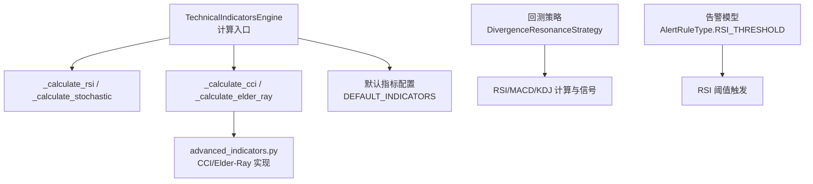
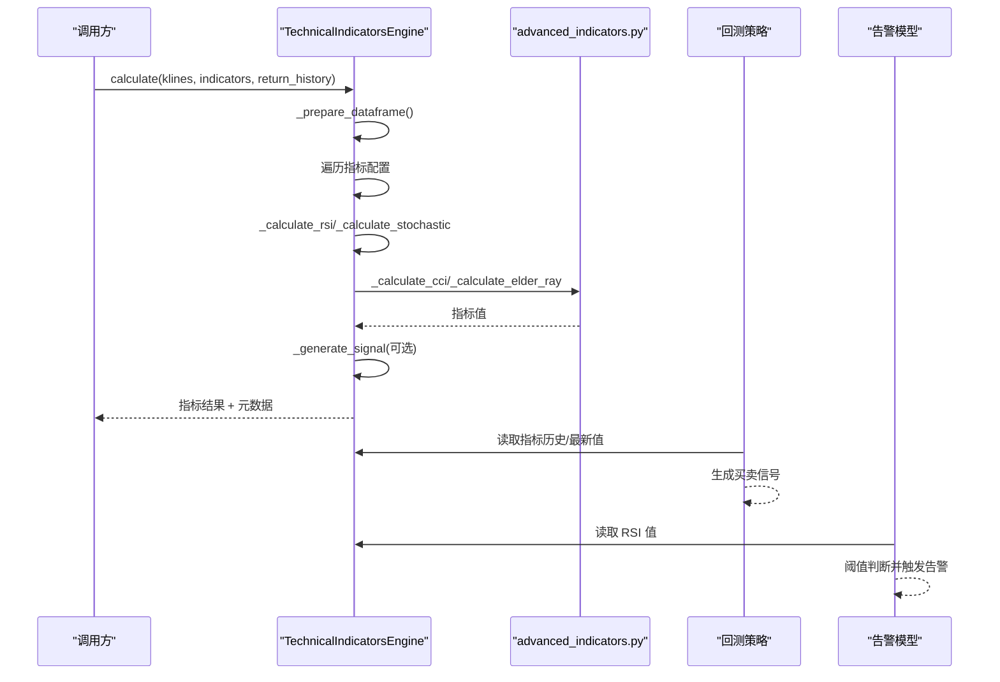
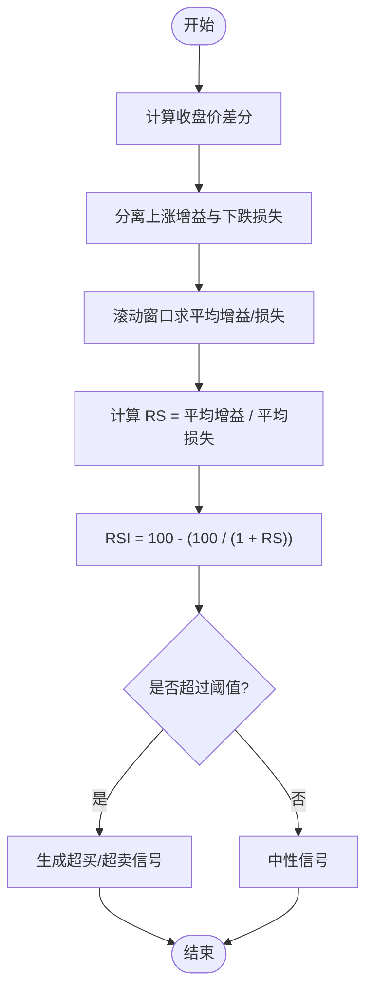
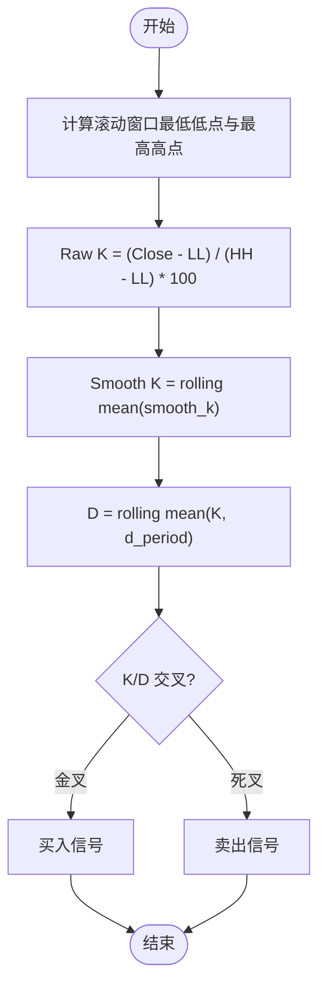
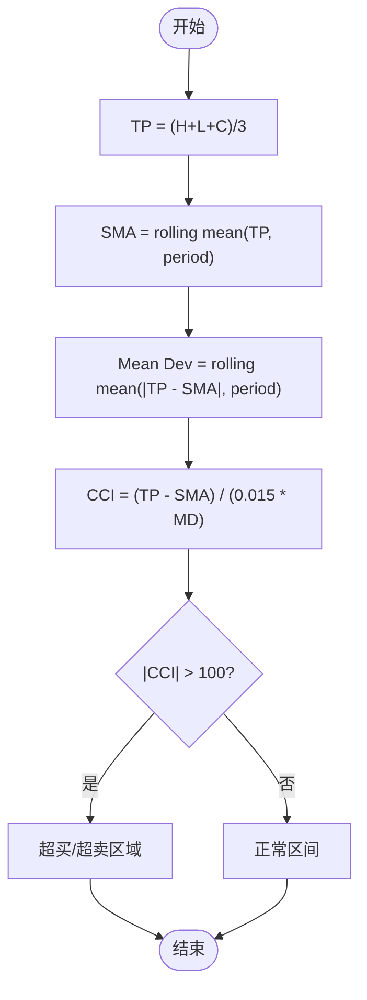
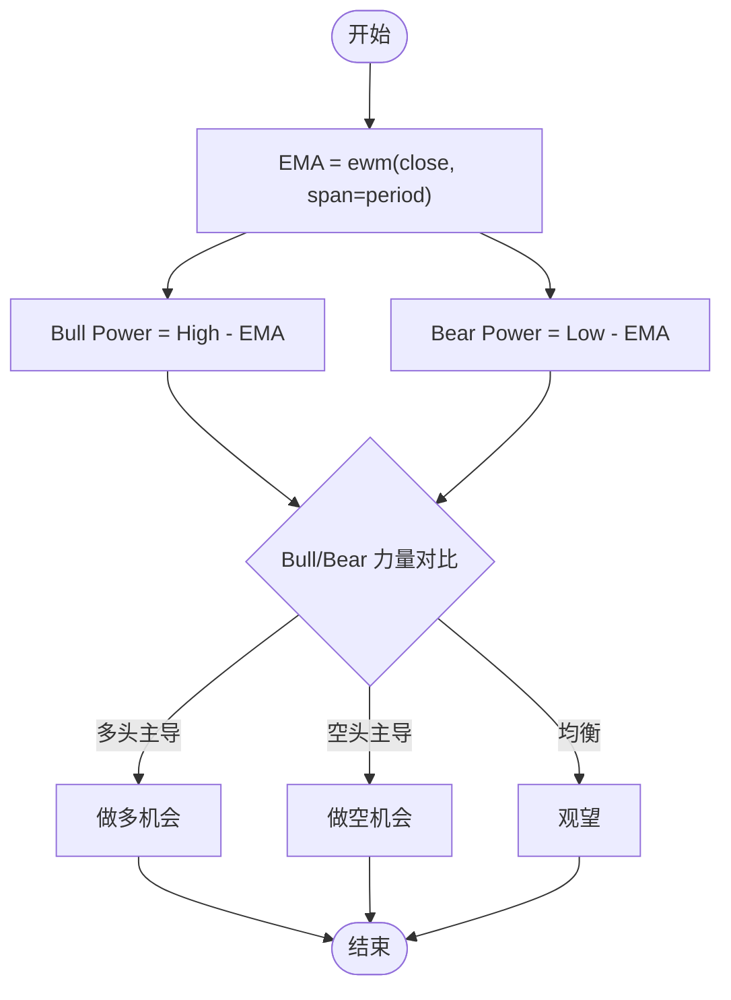
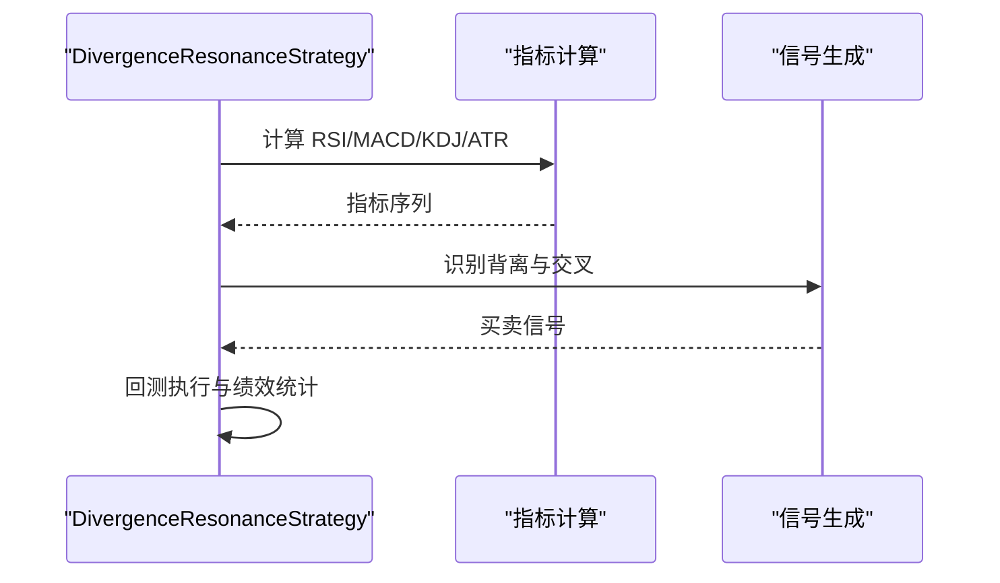
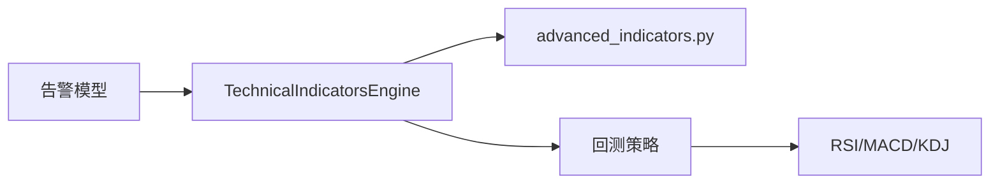

# 动量指标

<cite>
**本文引用的文件**
- [backend/utils/technical_indicators_pro.py](file://backend/utils/technical_indicators_pro.py)
- [backend/utils/advanced_indicators.py](file://backend/utils/advanced_indicators.py)
- [backend/backtest/strategies.py](file://backend/backtest/strategies.py)
- [backend/domain/alpha158.py](file://backend/domain/alpha158.py)
- [backend/domain/cross_sectional.py](file://backend/domain/cross_sectional.py)
- [backend/core/alert_models.py](file://backend/core/alert_models.py)
- [hermes_agent/tools/technical_indicators_tool.py](file://hermes_agent/tools/technical_indicators_tool.py)
- [backend/tests/test_technical_indicators_pro.py](file://backend/tests/test_technical_indicators_pro.py)
- [tests/utils/test_advanced_indicators.py](file://tests/utils/test_advanced_indicators.py)
</cite>

## 目录
1. [简介](#简介)
2. [项目结构](#项目结构)
3. [核心组件](#核心组件)
4. [架构总览](#架构总览)
5. [详细组件分析](#详细组件分析)
6. [依赖关系分析](#依赖关系分析)
7. [性能考量](#性能考量)
8. [故障排查指南](#故障排查指南)
9. [结论](#结论)
10. [附录](#附录)

## 简介
本技术文档聚焦于动量类技术指标在系统中的实现与使用，覆盖 RSI、随机指标（Stochastic）、CCI、Elder-Ray Power 等。文档从计算原理、工程实现、信号阈值配置、超买超卖识别、背离检测到组合策略与参数优化进行系统化说明，并结合 TechnicalIndicatorsEngine 的 _momentum 相关方法深入解析其内部流程。同时提供实战应用案例与风险控制建议，帮助交易员高效落地动量分析。

## 项目结构
- 指标引擎：TechnicalIndicatorsEngine 统一封装各类指标的计算与信号生成入口，支持历史序列或最新值输出，内置缓存与统计。
- 高级指标库：advanced_indicators.py 提供 ADX、CCI、VWMA、ATR%、Elder-Ray、Keltner Channels 等高级指标的独立实现。
- 回测策略：backtest/strategies.py 展示基于 RSI/MACD/KDJ 的动能背离与交叉共振的矢量化策略示例。
- 领域函数：domain/alpha158.py、domain/cross_sectional.py 提供 RSI、CCI 等领域级函数，便于跨模块复用。
- 告警模型：core/alert_models.py 定义 RSI 阈值告警规则类型与处理逻辑。
- 工具层：hermes_agent/tools/technical_indicators_tool.py 暴露统一的指标计算工具接口，供上层调用。

图表来源
- [backend/utils/technical_indicators_pro.py:175-247](file://backend/utils/technical_indicators_pro.py#L175-L247)
- [backend/utils/advanced_indicators.py:112-211](file://backend/utils/advanced_indicators.py#L112-L211)
- [backend/backtest/strategies.py:38-108](file://backend/backtest/strategies.py#L38-L108)
- [backend/core/alert_models.py:215-220](file://backend/core/alert_models.py#L215-L220)

章节来源
- [backend/utils/technical_indicators_pro.py:47-130](file://backend/utils/technical_indicators_pro.py#L47-L130)
- [backend/utils/advanced_indicators.py:1-11](file://backend/utils/advanced_indicators.py#L1-L11)

## 核心组件
- TechnicalIndicatorsEngine
  - calculate(klines, indicators, return_history)：统一计算入口，按配置动态调用各指标计算方法，并可选生成信号；返回结果包含指标值与元数据。
  - _prepare_dataframe：将 K 线列表转为 DataFrame，并对数值列做安全转换。
  - 各指标计算方法：_calculate_rsi、_calculate_stochastic、_calculate_cci、_calculate_elder_ray 等。
  - _generate_signal：当前为占位实现，预留扩展点用于阈值判断与信号生成。
- advanced_indicators.py
  - calculate_cci：商品通道指数，基于典型价格、SMA、平均绝对偏差计算。
  - calculate_elder_ray：多头/空头力量，基于 EMA 基线与最高/最低价差值。
  - 其他辅助：calculate_true_range、smooth_ema、calculate_adx、calculate_vwma、calculate_atr_percent、calculate_keltner_channels。
- backtest/strategies.py
  - DivergenceResonanceStrategy：演示 RSI 与 MACD 动能背离结合 KDJ 交叉共振的买卖信号生成与回测执行。
- domain/alpha158.py、domain/cross_sectional.py
  - 提供 RSI、CCI 等领域函数，便于在其他模块中直接复用。
- core/alert_models.py
  - AlertRuleType.RSI_THRESHOLD：定义 RSI 阈值告警规则，支持超买/超卖阈值区分。

章节来源
- [backend/utils/technical_indicators_pro.py:175-608](file://backend/utils/technical_indicators_pro.py#L175-L608)
- [backend/utils/advanced_indicators.py:17-262](file://backend/utils/advanced_indicators.py#L17-L262)
- [backend/backtest/strategies.py:13-108](file://backend/backtest/strategies.py#L13-L108)
- [backend/domain/alpha158.py:49-91](file://backend/domain/alpha158.py#L49-L91)
- [backend/domain/cross_sectional.py:25-94](file://backend/domain/cross_sectional.py#L25-L94)
- [backend/core/alert_models.py:215-220](file://backend/core/alert_models.py#L215-L220)

## 架构总览
系统采用“引擎 + 指标库 + 策略/告警”的分层架构：
- 引擎层：TechnicalIndicatorsEngine 负责调度与结果聚合，支持缓存与统计。
- 指标库层：advanced_indicators.py 提供具体算法实现，解耦于引擎。
- 策略/告警层：回测策略与告警模型消费指标结果，生成交易信号或触发通知。

图表来源
- [backend/utils/technical_indicators_pro.py:190-247](file://backend/utils/technical_indicators_pro.py#L190-L247)
- [backend/utils/advanced_indicators.py:112-211](file://backend/utils/advanced_indicators.py#L112-L211)
- [backend/backtest/strategies.py:38-108](file://backend/backtest/strategies.py#L38-L108)
- [backend/core/alert_models.py:215-220](file://backend/core/alert_models.py#L215-L220)

## 详细组件分析

### RSI（相对强弱指标）
- 计算原理
  - 基于收盘价变动，分别统计上涨幅度均值与下跌幅度均值，计算 RS = 平均上涨 / 平均下跌，RSI = 100 - (100 / (1 + RS))。
  - 工程中通过滚动窗口计算 gain/loss 的平均值，再推导 RS 与 RSI。
- 工程实现
  - TechnicalIndicatorsEngine._calculate_rsi：使用 diff、where、rolling mean 计算 gain/loss，得到 RSI 序列或最新值。
  - domain/alpha158.rsi、domain/cross_sectional._rsi：提供领域级 RSI 实现，便于跨模块复用。
- 超买超卖判断
  - 默认阈值：overbought=70，oversold=30（见 DEFAULT_INDICATORS）。
  - 告警模型：AlertRuleType.RSI_THRESHOLD 支持以 threshold<=50 表示超卖（RSI < threshold），threshold>50 表示超买（RSI > threshold）。
- 背离检测思路
  - 价格创新低但 RSI 未创新低（底背离）；价格创新高但 RSI 未创新高（顶背离）。可在策略层通过比较价格与 RSI 的极值位置实现。
- 参数优化建议
  - 周期 period 常用 14；可结合品种波动特性调整至 7/21；配合多时间框架验证稳定性。

图表来源
- [backend/utils/technical_indicators_pro.py:317-333](file://backend/utils/technical_indicators_pro.py#L317-L333)
- [backend/domain/alpha158.py:49-58](file://backend/domain/alpha158.py#L49-L58)
- [backend/domain/cross_sectional.py:25-33](file://backend/domain/cross_sectional.py#L25-L33)
- [backend/core/alert_models.py:215-220](file://backend/core/alert_models.py#L215-L220)

章节来源
- [backend/utils/technical_indicators_pro.py:317-333](file://backend/utils/technical_indicators_pro.py#L317-L333)
- [backend/domain/alpha158.py:49-58](file://backend/domain/alpha158.py#L49-L58)
- [backend/domain/cross_sectional.py:25-33](file://backend/domain/cross_sectional.py#L25-L33)
- [backend/core/alert_models.py:215-220](file://backend/core/alert_models.py#L215-L220)

### 随机指标（Stochastic Oscillator）
- 计算原理
  - %K = ((Close - Lowest Low) / (Highest High - Lowest Low)) * 100，使用 k_period 滚动窗口。
  - %K 平滑：对 raw_k 进行 smooth_k 周期移动平均。
  - %D = %K 的 d_period 周期移动平均。
- 工程实现
  - TechnicalIndicatorsEngine._calculate_stochastic：计算最低低点与最高高点，得到 raw_k，再平滑得到 K 与 D。
- 交叉信号
  - K 上穿 D（金叉）与 K 下穿 D（死叉）常用于入场/出场信号；结合超买超卖区域（如 K/D > 80 超买，< 20 超卖）提高胜率。
- 参数优化建议
  - 常用 (k_period=14, d_period=3, smooth_k=3)；趋势市可适当增大周期降低噪音；震荡市缩短周期提升灵敏度。

图表来源
- [backend/utils/technical_indicators_pro.py:377-406](file://backend/utils/technical_indicators_pro.py#L377-L406)

章节来源
- [backend/utils/technical_indicators_pro.py:377-406](file://backend/utils/technical_indicators_pro.py#L377-L406)

### CCI（商品通道指数）
- 计算原理
  - 典型价格 TP = (High + Low + Close) / 3。
  - SMA_TP = TP 的 period 周期简单移动平均。
  - Mean Deviation = |TP - SMA_TP| 的 period 周期平均值。
  - CCI = (TP - SMA_TP) / (0.015 * Mean Deviation)。
- 工程实现
  - advanced_indicators.calculate_cci：按公式计算 TP、SMA、Mean Deviation，得到 CCI 最新值。
- 超买超卖区域
  - 常见阈值：+100 以上超买，-100 以下超卖（见 DEFAULT_INDICATORS 中的 signal_thresholds）。
- 偏离度解读
  - CCI 衡量价格相对通道的偏离程度；极端值常伴随反转或加速趋势。

图表来源
- [backend/utils/advanced_indicators.py:112-134](file://backend/utils/advanced_indicators.py#L112-L134)
- [backend/utils/technical_indicators_pro.py:478-497](file://backend/utils/technical_indicators_pro.py#L478-L497)

章节来源
- [backend/utils/advanced_indicators.py:112-134](file://backend/utils/advanced_indicators.py#L112-L134)
- [backend/utils/technical_indicators_pro.py:478-497](file://backend/utils/technical_indicators_pro.py#L478-L497)

### Elder-Ray Power（多空力量指数）
- 计算原理
  - EMA Basis：收盘价的 EMA(period)。
  - Bull Power = High - EMA Basis。
  - Bear Power = Low - EMA Basis。
- 工程实现
  - advanced_indicators.calculate_elder_ray：计算 EMA 基线，得到 Bull/Bear Power 与 EMA Basis。
- 多空头力量分析
  - Bull Power > 0 且扩大：多头占优；Bear Power < 0 且扩大：空头占优；两者收敛：多空平衡。
- 实战用法
  - 结合价格突破与 EMA 基线方向过滤假信号；在趋势确认时加仓，在力量衰竭时减仓。

图表来源
- [backend/utils/advanced_indicators.py:190-211](file://backend/utils/advanced_indicators.py#L190-L211)
- [backend/utils/technical_indicators_pro.py:545-572](file://backend/utils/technical_indicators_pro.py#L545-L572)

章节来源
- [backend/utils/advanced_indicators.py:190-211](file://backend/utils/advanced_indicators.py#L190-L211)
- [backend/utils/technical_indicators_pro.py:545-572](file://backend/utils/technical_indicators_pro.py#L545-L572)

### 动量指标的信号阈值配置与背离检测
- 阈值配置
  - RSI：overbought=70，oversold=30（DEFAULT_INDICATORS）。
  - STOCHASTIC：overbought=80，oversold=20（DEFAULT_INDICATORS）。
  - CCI：overbought=100，oversold=-100（DEFAULT_INDICATORS）。
- 背离检测
  - 底背离：价格新低而 RSI 未新低；顶背离：价格新高而 RSI 未新高。
  - 可在策略层通过滑动窗口极值比较实现，例如记录最近 N 根 K 线的价格与 RSI 极值位置，当价格创新低但 RSI 未创新低则标记底背离。
- 信号生成扩展
  - 当前 _generate_signal 为占位实现；可扩展为基于阈值与交叉的组合信号，如 RSI 超卖 + K 上穿 D 作为买入条件。

章节来源
- [backend/utils/technical_indicators_pro.py:47-130](file://backend/utils/technical_indicators_pro.py#L47-L130)
- [backend/backtest/strategies.py:73-108](file://backend/backtest/strategies.py#L73-L108)

### 动量指标的组合使用策略
- RSI/MACD 动能背离 + KDJ 交叉共振
  - 策略逻辑：在价格形成新低点时，若 RSI 与 MACD 柱状图出现动能增强（底背离），且 KDJ 金叉，则买入；反之卖出。
  - 矢量化实现：通过矩阵运算批量识别形态与信号，适合大规模回测。
- 参数优化方法
  - 网格搜索：对 RSI 周期、MACD 参数、KDJ 周期进行网格扫描，评估夏普比率、最大回撤、胜率等。
  - 样本外验证：划分训练集与测试集，避免过拟合。
- 实战案例
  - 日线级别：RSI(14)、MACD(12,26,9)、KDJ(9,3,3)，结合 ATR 动态止损。
  - 分钟级别：缩短周期（如 RSI(7)、KDJ(6,3,3)），提高敏感度，需更严格过滤假信号。

图表来源
- [backend/backtest/strategies.py:38-108](file://backend/backtest/strategies.py#L38-L108)

章节来源
- [backend/backtest/strategies.py:13-108](file://backend/backtest/strategies.py#L13-L108)

## 依赖关系分析
- TechnicalIndicatorsEngine 依赖 advanced_indicators 提供的 CCI、Elder-Ray 等高级指标实现。
- 回测策略依赖 RSI/MACD/KDJ 等指标序列，并在策略内部完成信号生成与回测执行。
- 告警模型依赖 RSI 值与阈值配置，触发超买/超卖通知。

图表来源
- [backend/utils/technical_indicators_pro.py:175-247](file://backend/utils/technical_indicators_pro.py#L175-L247)
- [backend/utils/advanced_indicators.py:112-211](file://backend/utils/advanced_indicators.py#L112-L211)
- [backend/backtest/strategies.py:38-108](file://backend/backtest/strategies.py#L38-L108)
- [backend/core/alert_models.py:215-220](file://backend/core/alert_models.py#L215-L220)

章节来源
- [backend/utils/technical_indicators_pro.py:175-247](file://backend/utils/technical_indicators_pro.py#L175-L247)
- [backend/utils/advanced_indicators.py:112-211](file://backend/utils/advanced_indicators.py#L112-L211)
- [backend/backtest/strategies.py:38-108](file://backend/backtest/strategies.py#L38-L108)
- [backend/core/alert_models.py:215-220](file://backend/core/alert_models.py#L215-L220)

## 性能考量
- 向量化计算：使用 pandas/numpy 的 rolling、ewm、diff、where 等操作，避免逐行循环，提升计算效率。
- 缓存机制：engine.calculate 使用 cache_result 装饰器，基于输入参数的 MD5 哈希缓存结果，减少重复计算。
- 历史模式：return_history=True 时返回完整序列，适用于离线分析与可视化；实时场景建议使用最新值模式以降低内存占用。
- 性能基准：单元测试中对新指标集合的性能有约束（<50ms），确保在大数据量下的可用性。

章节来源
- [backend/utils/technical_indicators_pro.py:136-169](file://backend/utils/technical_indicators_pro.py#L136-L169)
- [tests/utils/test_advanced_indicators.py:203-226](file://tests/utils/test_advanced_indicators.py#L203-L226)

## 故障排查指南
- 数据不足：当 K 线数据少于阈值（如 60）时，engine.calculate 返回错误提示；请确保输入数据长度满足指标周期要求。
- NaN 值处理：部分指标在极端情况下可能产生 NaN（如 CCI 分母为零），代码已做空值保护，返回 None 或跳过计算。
- 自定义指标异常：若新增指标抛出异常，engine 会捕获并返回 {"error": str(e)}，便于定位问题。
- 信号为空：当前 _generate_signal 为占位实现，如需启用信号，请扩展该方法以实现阈值判断与交叉逻辑。

章节来源
- [backend/utils/technical_indicators_pro.py:215-237](file://backend/utils/technical_indicators_pro.py#L215-L237)
- [backend/utils/technical_indicators_pro.py:605-608](file://backend/utils/technical_indicators_pro.py#L605-L608)
- [tests/utils/test_advanced_indicators.py:323-365](file://tests/utils/test_advanced_indicators.py#L323-L365)

## 结论
本仓库提供了完善的技术指标计算引擎与高级指标实现，覆盖 RSI、Stochastic、CCI、Elder-Ray 等关键动量指标。通过清晰的架构分层、向量化计算与缓存机制，系统在性能与可维护性之间取得良好平衡。结合回测策略与告警模型，可实现从指标计算到信号生成与风险控制的闭环。建议在实际应用中根据品种特性优化参数，并结合多指标组合与背离检测提升策略稳健性。

## 附录
- 实用指南
  - 超买超卖区域识别：RSI>70/STOCH K/D>80/CCI>+100 视为超买；RSI<30/STOCH K/D<20/CCI<-100 视为超卖。
  - 背离信号检测：价格与指标极值不一致时标记背离，常用于反转预警。
  - 风险控制：结合 ATR 动态止损、仓位管理，避免单一指标误判带来的风险。
- 实战案例
  - 日线趋势跟踪：RSI(14) 过滤趋势强度，MACD 确认方向，KDJ 择时入场。
  - 短线震荡策略：缩短 RSI/KDJ 周期，利用超买超卖与交叉快速进出，严格止损。

[本节为概念性内容，不直接分析具体文件]
