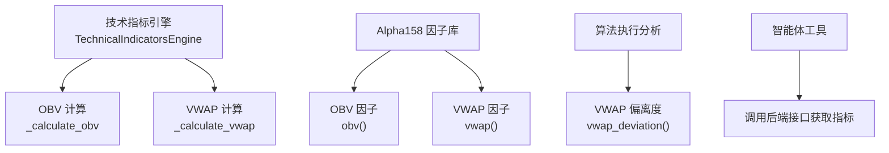
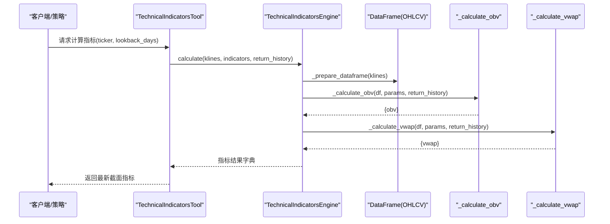
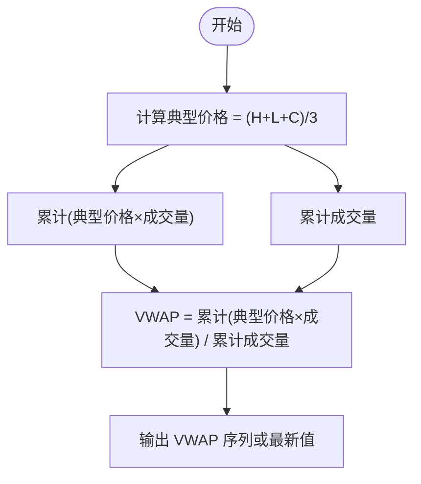
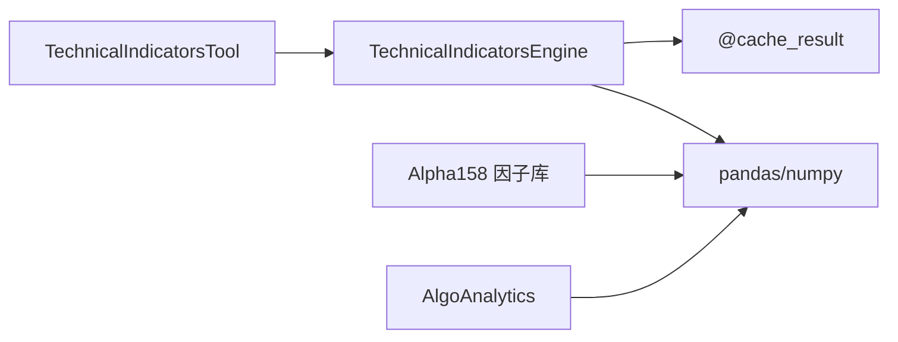

# 成交量指标

<cite>
**本文引用的文件**
- [backend/utils/technical_indicators_pro.py](file://backend/utils/technical_indicators_pro.py)
- [backend/domain/alpha158.py](file://backend/domain/alpha158.py)
- [backend/tests/test_technical_indicators_pro.py](file://backend/tests/test_technical_indicators_pro.py)
- [tests/utils/test_technical_indicators_pro.py](file://tests/utils/test_technical_indicators_pro.py)
- [hermes_agent/tools/technical_indicators_tool.py](file://hermes_agent/tools/technical_indicators_tool.py)
- [backend/domain/algo_analytics.py](file://backend/domain/algo_analytics.py)
</cite>

## 目录
1. [简介](#简介)
2. [项目结构](#项目结构)
3. [核心组件](#核心组件)
4. [架构总览](#架构总览)
5. [详细组件分析](#详细组件分析)
6. [依赖关系分析](#依赖关系分析)
7. [性能考量](#性能考量)
8. [故障排查指南](#故障排查指南)
9. [结论](#结论)
10. [附录](#附录)

## 简介
本技术文档聚焦于成交量相关技术指标，重点覆盖能量潮（OBV）与成交量加权平均价（VWAP）的计算原理、市场含义与实战用法。文档基于仓库中的生产级实现，系统梳理 TechnicalIndicatorsEngine 中 _volume 相关方法（_calculate_obv、_calculate_vwap），并结合 Alpha158 因子库的 OBV/VWAP 实现进行对比说明。同时提供量价关系分析方法、资金流向判断、市场情绪评估技巧，以及交易信号生成、突破确认与背离识别的实践指南，帮助交易者将成交量指标融入策略构建与执行评估。

## 项目结构
本项目在“后端工具层”提供了统一的技术指标计算引擎，并在“领域层”提供因子库与算法执行分析能力；在“智能体工具层”暴露统一的 API 供上层调用。关键路径如下：
- 技术指标引擎：backend/utils/technical_indicators_pro.py
- 因子库（含量价因子）：backend/domain/alpha158.py
- 算法执行分析（含 VWAP 偏离度等）：backend/domain/algo_analytics.py
- 测试用例：backend/tests/test_technical_indicators_pro.py、tests/utils/test_technical_indicators_pro.py
- 智能体工具封装：hermes_agent/tools/technical_indicators_tool.py



图表来源
- [backend/utils/technical_indicators_pro.py:175-247](file://backend/utils/technical_indicators_pro.py#L175-L247)
- [backend/domain/alpha158.py:152-170](file://backend/domain/alpha158.py#L152-L170)
- [backend/domain/algo_analytics.py:51-66](file://backend/domain/algo_analytics.py#L51-L66)
- [hermes_agent/tools/technical_indicators_tool.py:57-86](file://hermes_agent/tools/technical_indicators_tool.py#L57-L86)

章节来源
- [backend/utils/technical_indicators_pro.py:175-247](file://backend/utils/technical_indicators_pro.py#L175-L247)
- [backend/domain/alpha158.py:152-170](file://backend/domain/alpha158.py#L152-L170)
- [backend/domain/algo_analytics.py:51-66](file://backend/domain/algo_analytics.py#L51-L66)
- [hermes_agent/tools/technical_indicators_tool.py:57-86](file://hermes_agent/tools/technical_indicators_tool.py#L57-L86)

## 核心组件
- 技术指标引擎 TechnicalIndicatorsEngine
  - 负责统一接入 K 线数据，按配置批量计算指标，支持历史序列或最新值返回，内置缓存装饰器提升重复计算性能。
  - 默认包含 OBV、VWAP 等成交量类指标，并支持扩展更多指标。
- Alpha158 因子库
  - 提供纯 pandas 矢量化实现的量价因子，包括 OBV、VWAP、量比、资金流等，便于因子研究与回测。
- 算法执行分析 AlgoAnalytics
  - 提供 VWAP 偏离度、滑点、参与率等执行质量度量，用于评估算法成交相对于市场基准的表现。
- 智能体工具 TechnicalIndicatorsTool
  - 对外暴露统一接口，拉取历史 K 线并调用后端指标计算，返回最新截面特征，便于大模型工具链使用。

章节来源
- [backend/utils/technical_indicators_pro.py:175-247](file://backend/utils/technical_indicators_pro.py#L175-L247)
- [backend/domain/alpha158.py:152-170](file://backend/domain/alpha158.py#L152-L170)
- [backend/domain/algo_analytics.py:51-66](file://backend/domain/algo_analytics.py#L51-L66)
- [hermes_agent/tools/technical_indicators_tool.py:57-86](file://hermes_agent/tools/technical_indicators_tool.py#L57-L86)

## 架构总览
下图展示了从数据到指标计算的端到端流程，以及 OBV 与 VWAP 在系统中的位置。



图表来源
- [backend/utils/technical_indicators_pro.py:190-247](file://backend/utils/technical_indicators_pro.py#L190-L247)
- [backend/utils/technical_indicators_pro.py:408-444](file://backend/utils/technical_indicators_pro.py#L408-L444)
- [hermes_agent/tools/technical_indicators_tool.py:57-86](file://hermes_agent/tools/technical_indicators_tool.py#L57-L86)

## 详细组件分析

### OBV（能量潮）实现与市场含义
- 计算原理
  - 以收盘价变化方向决定当日成交量的正负符号，逐日累加得到累积成交量序列。价格上涨时累加成交量，下跌时减去成交量，持平则保持不变。
  - 工程实现采用循环遍历收盘价序列，依据相邻两日价格差更新累积值，最终输出最新值或完整历史序列。
- 市场含义
  - OBV 反映资金净流入/流出趋势。OBV 上升通常意味着买盘力量增强，下降则表明卖压增加。
  - 与价格趋势结合可识别“量价背离”：价格创新高但 OBV 未创新高，可能预示上涨动能不足；反之亦然。
- 代码要点
  - 通过比较相邻收盘价确定方向，并以成交量为权重进行累加。
  - 支持返回历史序列或最新值，便于不同场景使用。

```mermaid
flowchart TD
Start(["开始"]) --> Init["初始化累积值为0"]
Init --> Loop{"遍历第 i 天"}
Loop --> |i=1..N| Compare["比较 close[i] 与 close[i-1]"]
Compare --> |close[i] > close[i-1]| AddVol["累积值 += volume[i]"]
Compare --> |close[i] < close[i-1]| SubVol["累积值 -= volume[i]"]
Compare --> |close[i] == close[i-1]| Keep["保持累积值不变"]
AddVol --> Next["进入下一天"]
SubVol --> Next
Keep --> Next
Next --> |继续| Loop
Next --> |结束| Output["输出 OBV 序列或最新值"]
```

图表来源
- [backend/utils/technical_indicators_pro.py:408-428](file://backend/utils/technical_indicators_pro.py#L408-L428)

章节来源
- [backend/utils/technical_indicators_pro.py:408-428](file://backend/utils/technical_indicators_pro.py#L408-L428)
- [backend/tests/test_technical_indicators_pro.py:288-303](file://backend/tests/test_technical_indicators_pro.py#L288-L303)
- [tests/utils/test_technical_indicators_pro.py:151-163](file://tests/utils/test_technical_indicators_pro.py#L151-L163)

### VWAP（成交量加权平均价）实现与市场含义
- 计算原理
  - 典型价格 = (最高价 + 最低价 + 收盘价) / 3。
  - VWAP = 累计（典型价格 × 成交量）/ 累计成交量。该公式对全天或指定窗口内的成交进行加权，反映实际成交的平均成本。
  - 工程实现使用 cumsum 对典型价格与成交量进行滚动累计，得到 VWAP 序列或最新值。
- 市场含义
  - VWAP 常被用作日内基准价格。价格在 VWAP 上方通常视为多头占优，下方则空头占优。
  - 算法执行中常以 VWAP 作为基准，衡量成交质量（如 VWAP 偏离度）。
- 代码要点
  - 使用典型价格与成交量乘积的累计和除以成交量的累计和，避免极端值影响。
  - 支持历史序列或最新值返回。



图表来源
- [backend/utils/technical_indicators_pro.py:430-444](file://backend/utils/technical_indicators_pro.py#L430-L444)

章节来源
- [backend/utils/technical_indicators_pro.py:430-444](file://backend/utils/technical_indicators_pro.py#L430-L444)
- [backend/tests/test_technical_indicators_pro.py:306-322](file://backend/tests/test_technical_indicators_pro.py#L306-L322)
- [tests/utils/test_technical_indicators_pro.py:164-179](file://tests/utils/test_technical_indicators_pro.py#L164-L179)

### Alpha158 因子库中的 OBV 与 VWAP
- OBV 因子
  - 使用收盘价差分方向乘以成交量后做累计和，与引擎实现一致，强调量价方向的累积效应。
- VWAP 因子
  - 使用滚动窗口（例如 20 日）的典型价格与成交量累计比值，适用于因子研究中的短期加权均价。
- 与引擎的差异
  - 引擎默认使用全序列累计（cumsum），Alpha158 示例中使用滚动累计（rolling sum），体现不同应用场景下的参数化选择。

章节来源
- [backend/domain/alpha158.py:152-170](file://backend/domain/alpha158.py#L152-L170)

### 算法执行分析中的 VWAP 偏离度
- VWAP 偏离度
  - 衡量算法实际成交 VWAP 与市场 VWAP 的相对差异，单位为基点（bps）。正值表示优于市场基准，负值表示劣于基准。
- 应用
  - 用于评估算法拆单执行质量，辅助优化算法参数与执行策略。

章节来源
- [backend/domain/algo_analytics.py:51-66](file://backend/domain/algo_analytics.py#L51-L66)

## 依赖关系分析
- 技术指标引擎依赖 pandas/numpy 进行高效数值计算，并通过缓存装饰器减少重复计算开销。
- Alpha158 因子库完全基于 pandas 矢量化操作，便于大规模因子矩阵计算。
- 算法执行分析模块独立于指标计算，专注于执行质量度量。
- 智能体工具通过 HTTP 调用后端接口，屏蔽底层实现细节，提供统一入口。



图表来源
- [backend/utils/technical_indicators_pro.py:136-169](file://backend/utils/technical_indicators_pro.py#L136-L169)
- [backend/domain/alpha158.py:15-20](file://backend/domain/alpha158.py#L15-L20)
- [backend/domain/algo_analytics.py:11-16](file://backend/domain/algo_analytics.py#L11-L16)
- [hermes_agent/tools/technical_indicators_tool.py:57-86](file://hermes_agent/tools/technical_indicators_tool.py#L57-L86)

章节来源
- [backend/utils/technical_indicators_pro.py:136-169](file://backend/utils/technical_indicators_pro.py#L136-L169)
- [backend/domain/alpha158.py:15-20](file://backend/domain/alpha158.py#L15-L20)
- [backend/domain/algo_analytics.py:11-16](file://backend/domain/algo_analytics.py#L11-L16)
- [hermes_agent/tools/technical_indicators_tool.py:57-86](file://hermes_agent/tools/technical_indicators_tool.py#L57-L86)

## 性能考量
- 缓存机制
  - 使用 @cache_result 装饰器对 calculate 方法进行结果缓存，基于输入参数的 MD5 哈希键，TTL 默认 300 秒，显著降低重复计算成本。
- 数据准备
  - _prepare_dataframe 将 OHLCV 列转换为数值类型，确保后续计算稳定。
- 历史模式 vs 最新值
  - return_history=True 返回完整序列，适合分析与可视化；False 仅返回最新值，适合实时决策。
- 性能验证
  - 测试用例验证计算时间小于阈值（例如 <100ms），保证高频场景可用性。

章节来源
- [backend/utils/technical_indicators_pro.py:136-169](file://backend/utils/technical_indicators_pro.py#L136-L169)
- [backend/utils/technical_indicators_pro.py:249-258](file://backend/utils/technical_indicators_pro.py#L249-L258)
- [tests/utils/test_technical_indicators_pro.py:195-208](file://tests/utils/test_technical_indicators_pro.py#L195-L208)

## 故障排查指南
- 数据不足
  - 当 K 线数据少于最小要求（例如 <60 条）时，引擎返回错误信息，需检查数据源与回溯天数。
- 指标异常
  - 单个指标计算失败不会影响其他指标（异常隔离），可在结果中查看对应指标的 error 字段。
- 数值有效性
  - OBV 应为数值型；VWAP 应在合理价格区间内（最低低点到最高高点之间），若出现 NaN 或越界，检查输入数据的缺失与异常值处理。
- 性能问题
  - 若计算耗时过长，检查是否频繁调用且未利用缓存；必要时调整 TTL 或批处理策略。

章节来源
- [backend/utils/technical_indicators_pro.py:215-236](file://backend/utils/technical_indicators_pro.py#L215-L236)
- [backend/tests/test_technical_indicators_pro.py:94-98](file://backend/tests/test_technical_indicators_pro.py#L94-L98)
- [tests/utils/test_technical_indicators_pro.py:83-93](file://tests/utils/test_technical_indicators_pro.py#L83-L93)
- [tests/utils/test_technical_indicators_pro.py:164-179](file://tests/utils/test_technical_indicators_pro.py#L164-L179)

## 结论
本仓库提供了生产级的成交量指标实现，涵盖 OBV 与 VWAP 的核心计算逻辑，并通过 Alpha158 因子库与算法执行分析模块拓展了量价因子的研究与执行评估能力。借助缓存机制与历史/最新值双模式，系统在性能与灵活性上取得平衡。交易者可将 OBV 用于资金流向与背离识别，将 VWAP 作为日内基准与执行质量评估依据，结合量价配合分析形成稳健的交易信号与策略框架。

## 附录

### 量价关系分析方法
- 量价同步
  - 价格上涨伴随成交量放大，确认趋势强度；价格下跌伴随放量，提示抛压增强。
- 量价背离
  - 价格创新高但 OBV 未创新高，可能预示上涨动能衰竭；价格创新低但 OBV 未创新低，可能预示下跌动能减弱。
- 突破确认
  - 关键位突破时若成交量显著放大，提高突破有效性；缩量突破需谨慎对待。
- 资金流向判断
  - OBV 持续上升表明资金净流入，下降表明净流出；结合 VWAP 判断当前价格相对于平均成本的偏多/偏空状态。
- 市场情绪评估
  - 放量滞涨或放量滞跌往往暗示多空分歧加大；缩量整理后放量突破通常代表新趋势启动。

### 交易信号生成与策略构建
- 信号触发
  - OBV 拐头向上且价格站上 VWAP，考虑做多；OBV 拐头向下且价格跌破 VWAP，考虑做空。
- 突破确认
  - 关键阻力/支撑位突破时，要求成交量较近期均值显著放大，并观察 OBV 是否同步创出新高/新低。
- 背离识别
  - 价格与 OBV 的顶/底背离可作为反转预警；结合 VWAP 的偏多/偏空状态过滤假信号。
- 风险控制
  - 使用 ATR 或布林带宽度设定止损止盈；结合 VWAP 偏离度评估执行质量，动态调整仓位。

### 实际应用指南
- 回测与因子研究
  - 使用 Alpha158 的 OBV/VWAP 因子进行横截面排序或时序信号构建，结合回测引擎验证有效性。
- 实盘执行
  - 以 VWAP 为基准评估算法执行质量，优化拆单策略以降低滑点与偏离度。
- 监控与告警
  - 设置 OBV 与价格的背离告警；当价格远离 VWAP 且成交量异常放大时触发风险提示。

章节来源
- [backend/domain/alpha158.py:152-170](file://backend/domain/alpha158.py#L152-L170)
- [backend/domain/algo_analytics.py:51-66](file://backend/domain/algo_analytics.py#L51-L66)
- [backend/utils/technical_indicators_pro.py:408-444](file://backend/utils/technical_indicators_pro.py#L408-L444)
