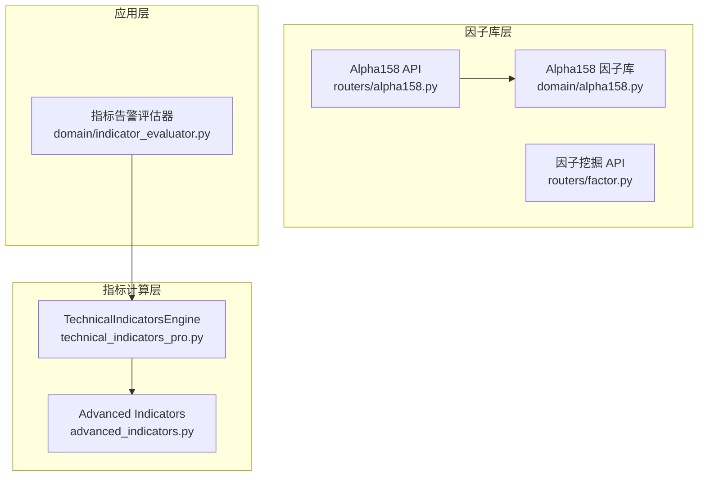
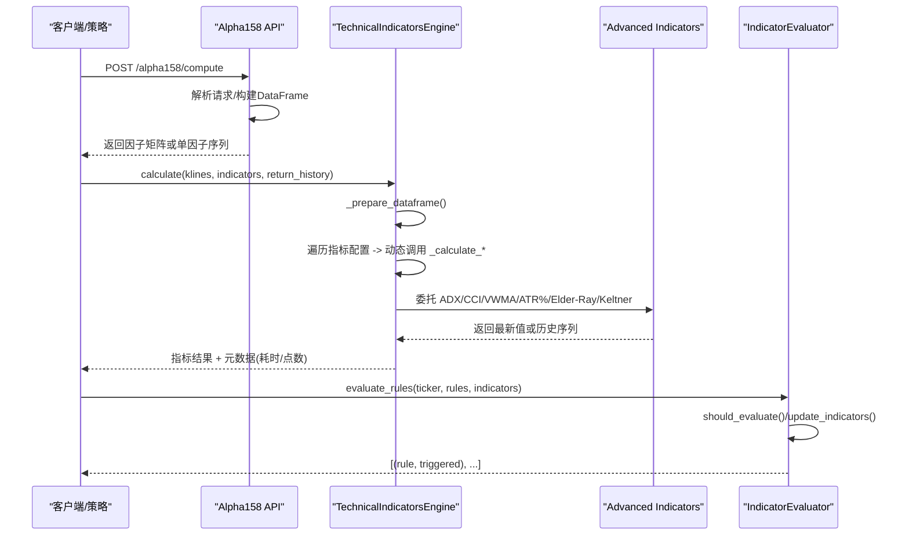
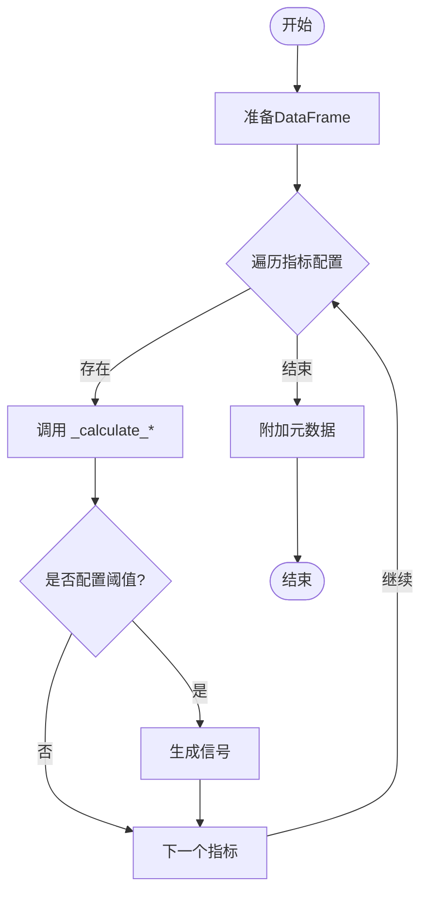
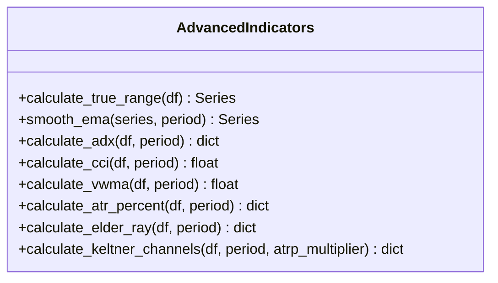
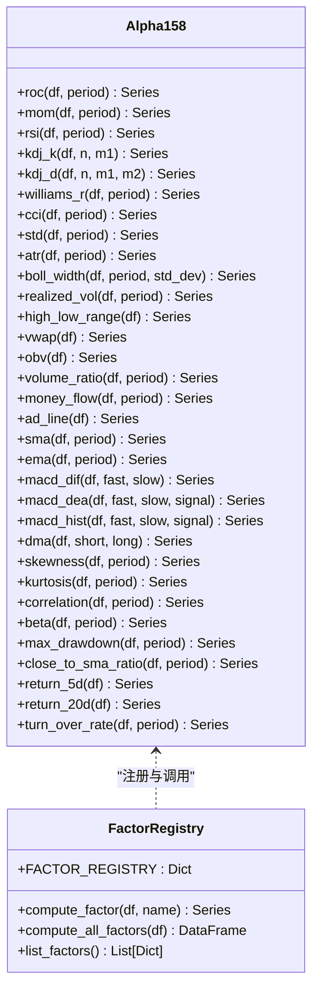
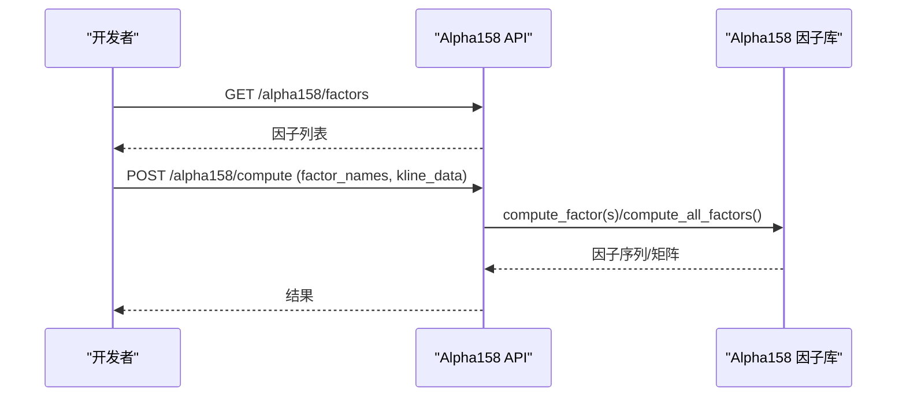
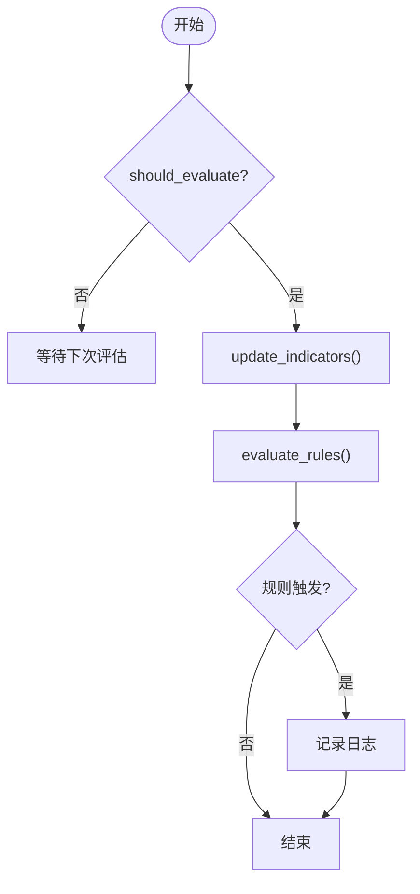
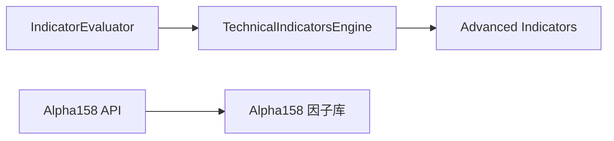

# 技术指标服务

<cite>
**本文引用的文件**
- [backend/utils/technical_indicators_pro.py](file://backend/utils/technical_indicators_pro.py)
- [backend/utils/advanced_indicators.py](file://backend/utils/advanced_indicators.py)
- [backend/domain/alpha158.py](file://backend/domain/alpha158.py)
- [backend/routers/alpha158.py](file://backend/routers/alpha158.py)
- [backend/routers/factor.py](file://backend/routers/factor.py)
- [backend/domain/indicator_evaluator.py](file://backend/domain/indicator_evaluator.py)
- [tests/utils/test_technical_indicators_pro.py](file://tests/utils/test_technical_indicators_pro.py)
- [tests/utils/test_indicator_accuracy.py](file://tests/utils/test_indicator_accuracy.py)
- [docs/OPT/TECH_INDICATORS_DECISION.md](file://docs/OPT/TECH_INDICATORS_DECISION.md)
</cite>

## 目录
1. [简介](#简介)
2. [项目结构](#项目结构)
3. [核心组件](#核心组件)
4. [架构总览](#架构总览)
5. [详细组件分析](#详细组件分析)
6. [依赖关系分析](#依赖关系分析)
7. [性能与优化](#性能与优化)
8. [故障排查指南](#故障排查指南)
9. [结论](#结论)
10. [附录](#附录)

## 简介
本技术文档面向量化策略开发者，系统化阐述 Quant Agent 的技术指标服务：从计算引擎的向量化实现、缓存与增量评估机制，到趋势/动量/波动率/成交量等指标的完整实现；并覆盖 Alpha158 因子库的定义、参数化调用与 API 暴露。同时提供自定义指标开发指南、准确性验证与基准测试方法，帮助开发者高效集成、回测与优化策略。

## 项目结构
- 技术指标计算引擎位于 backend/utils，采用“Engine + Config”模式，统一调度多种指标的计算与信号生成。
- 高级指标（ADX、CCI、VWMA、ATR%、Elder-Ray、Keltner Channels）独立封装在 advanced_indicators.py，便于复用与测试。
- Alpha158 因子库位于 backend/domain，提供纯 pandas 矢量化实现与注册表，并通过 FastAPI 路由暴露计算接口。
- 指标告警评估器位于 backend/domain，负责指标值缓存、节流与规则触发。
- 测试与准确性验证位于 tests/utils，覆盖功能、性能与数值正确性。

图表来源
- [backend/utils/technical_indicators_pro.py:175-247](file://backend/utils/technical_indicators_pro.py#L175-L247)
- [backend/utils/advanced_indicators.py:44-106](file://backend/utils/advanced_indicators.py#L44-L106)
- [backend/domain/alpha158.py:31-385](file://backend/domain/alpha158.py#L31-L385)
- [backend/routers/alpha158.py:24-73](file://backend/routers/alpha158.py#L24-L73)
- [backend/routers/factor.py:28-74](file://backend/routers/factor.py#L28-L74)
- [backend/domain/indicator_evaluator.py:36-163](file://backend/domain/indicator_evaluator.py#L36-L163)

章节来源
- [backend/utils/technical_indicators_pro.py:175-247](file://backend/utils/technical_indicators_pro.py#L175-L247)
- [backend/utils/advanced_indicators.py:44-106](file://backend/utils/advanced_indicators.py#L44-L106)
- [backend/domain/alpha158.py:31-385](file://backend/domain/alpha158.py#L31-L385)
- [backend/routers/alpha158.py:24-73](file://backend/routers/alpha158.py#L24-L73)
- [backend/routers/factor.py:28-74](file://backend/routers/factor.py#L28-L74)
- [backend/domain/indicator_evaluator.py:36-163](file://backend/domain/indicator_evaluator.py#L36-L163)

## 核心组件
- TechnicalIndicatorsEngine：统一的指标计算入口，支持配置化指标集、历史序列返回、自动信号生成与统计信息。
- Advanced Indicators：ADX、CCI、VWMA、ATR%、Elder-Ray、Keltner Channels 等高级指标的矢量化实现。
- Alpha158 因子库：158 个经典因子的矢量化实现与注册表，支持批量计算与单因子查询。
- Alpha158 API：FastAPI 路由暴露因子计算与列表能力。
- 指标告警评估器：指标值缓存、节流控制与规则评估（RSI阈值、MACD交叉、均线穿越）。

章节来源
- [backend/utils/technical_indicators_pro.py:175-247](file://backend/utils/technical_indicators_pro.py#L175-L247)
- [backend/utils/advanced_indicators.py:44-106](file://backend/utils/advanced_indicators.py#L44-L106)
- [backend/domain/alpha158.py:31-385](file://backend/domain/alpha158.py#L31-L385)
- [backend/routers/alpha158.py:24-73](file://backend/routers/alpha158.py#L24-L73)
- [backend/domain/indicator_evaluator.py:36-163](file://backend/domain/indicator_evaluator.py#L36-L163)

## 架构总览
系统以“计算引擎 + 高级指标 + 因子库 + API 路由 + 评估器”的分层架构组织，确保高内聚低耦合、可扩展与可维护。

图表来源
- [backend/routers/alpha158.py:30-73](file://backend/routers/alpha158.py#L30-L73)
- [backend/utils/technical_indicators_pro.py:190-247](file://backend/utils/technical_indicators_pro.py#L190-L247)
- [backend/utils/advanced_indicators.py:44-106](file://backend/utils/advanced_indicators.py#L44-L106)
- [backend/domain/indicator_evaluator.py:56-140](file://backend/domain/indicator_evaluator.py#L56-L140)

## 详细组件分析

### 技术指标计算引擎（TechnicalIndicatorsEngine）
- 设计要点
  - 配置驱动：通过 IndicatorConfig 定义指标名、类型、参数与信号阈值。
  - 动态调度：根据指标名反射调用对应 _calculate_* 方法，便于扩展新指标。
  - 历史/最新值双模式：return_history=True 返回完整序列，否则仅返回最新值。
  - 自动信号：当配置包含 signal_thresholds 时自动生成交易信号。
  - 缓存装饰器：@cache_result 基于输入参数 MD5 哈希进行短期缓存，减少重复计算。
  - 错误隔离：单个指标异常不影响其他指标计算。
  - 统计信息：记录总运行次数与耗时、数据点数量。

- 关键流程
  - 数据准备：将 K 线列表转为 DataFrame，并强制数值列类型转换。
  - 指标计算：按配置顺序逐一计算，支持 MA、EMA、MACD、RSI、Bollinger、ATR、Stochastic、OBV、VWAP 及高级指标。
  - 结果组装：合并各指标结果，附加元数据。

图表来源
- [backend/utils/technical_indicators_pro.py:190-247](file://backend/utils/technical_indicators_pro.py#L190-L247)
- [backend/utils/technical_indicators_pro.py:262-444](file://backend/utils/technical_indicators_pro.py#L262-L444)
- [backend/utils/technical_indicators_pro.py:448-603](file://backend/utils/technical_indicators_pro.py#L448-L603)

章节来源
- [backend/utils/technical_indicators_pro.py:175-247](file://backend/utils/technical_indicators_pro.py#L175-L247)
- [backend/utils/technical_indicators_pro.py:262-444](file://backend/utils/technical_indicators_pro.py#L262-L444)
- [backend/utils/technical_indicators_pro.py:448-603](file://backend/utils/technical_indicators_pro.py#L448-L603)

### 高级指标（Advanced Indicators）
- 实现方式
  - 全部使用 pandas/numpy 矢量化操作，避免显式循环，提升性能。
  - 典型函数：calculate_true_range、smooth_ema、where 工具函数。
  - 指标清单：ADX/DMI、CCI、VWMA、ATR%、Elder-Ray、Keltner Channels。
- 关键特性
  - ADX：基于 Wilder EMA 平滑 DI 与 DX，输出 adx、plus_di、minus_di、di_diff。
  - CCI：基于典型价格与平均绝对偏差，输出当前 CCI。
  - VWMA：成交量加权移动平均，支持周期参数。
  - ATR%：波动率百分比与相对波动率。
  - Elder-Ray：多头/空头力量与 EMA 基准。
  - Keltner Channels：EMA 中轨与 ATR 倍数通道，输出上下轨与宽度。

图表来源
- [backend/utils/advanced_indicators.py:17-38](file://backend/utils/advanced_indicators.py#L17-L38)
- [backend/utils/advanced_indicators.py:44-106](file://backend/utils/advanced_indicators.py#L44-L106)
- [backend/utils/advanced_indicators.py:112-155](file://backend/utils/advanced_indicators.py#L112-L155)
- [backend/utils/advanced_indicators.py:161-184](file://backend/utils/advanced_indicators.py#L161-L184)
- [backend/utils/advanced_indicators.py:190-211](file://backend/utils/advanced_indicators.py#L190-L211)
- [backend/utils/advanced_indicators.py:217-261](file://backend/utils/advanced_indicators.py#L217-L261)

章节来源
- [backend/utils/advanced_indicators.py:17-38](file://backend/utils/advanced_indicators.py#L17-L38)
- [backend/utils/advanced_indicators.py:44-106](file://backend/utils/advanced_indicators.py#L44-L106)
- [backend/utils/advanced_indicators.py:112-155](file://backend/utils/advanced_indicators.py#L112-L155)
- [backend/utils/advanced_indicators.py:161-184](file://backend/utils/advanced_indicators.py#L161-L184)
- [backend/utils/advanced_indicators.py:190-211](file://backend/utils/advanced_indicators.py#L190-L211)
- [backend/utils/advanced_indicators.py:217-261](file://backend/utils/advanced_indicators.py#L217-L261)

### Alpha158 因子库
- 设计要点
  - 纯 pandas 矢量化实现，涵盖动量、波动率、量价、均线、统计与衍生因子。
  - FACTOR_REGISTRY 注册表统一管理因子名称、默认参数与分类。
  - 提供 compute_factor 与 compute_all_factors 两种计算方式。
  - list_factors 列出可用因子及其类别。
- 常用因子示例
  - 动量：ROC、MOM、RSI、KDJ、Williams %R、CCI
  - 波动率：STD、ATR、Bollinger Width、Realized Volatility、High-Low Range
  - 量价：VWAP、OBV、Volume Ratio、Money Flow Index、AD Line
  - 均线：SMA、EMA、MACD(DIF/DEA/Histogram)、DMA
  - 统计：Skewness、Kurtosis、Correlation、Beta、Max Drawdown
  - 衍生：Close/SMA Ratio、Return 5d/20d、Turnover Rate

图表来源
- [backend/domain/alpha158.py:31-315](file://backend/domain/alpha158.py#L31-L315)
- [backend/domain/alpha158.py:318-385](file://backend/domain/alpha158.py#L318-L385)

章节来源
- [backend/domain/alpha158.py:31-315](file://backend/domain/alpha158.py#L31-L315)
- [backend/domain/alpha158.py:318-385](file://backend/domain/alpha158.py#L318-L385)

### Alpha158 API 与因子挖掘
- Alpha158 API
  - GET /alpha158/factors：列出所有可用因子。
  - POST /alpha158/compute：计算指定因子或全部因子，返回因子矩阵或序列。
- 因子挖掘 API
  - POST /factor/suggest：LLM 建议因子（表达式、参数范围、理由）。
  - POST /factor/search：对给定因子进行网格搜索，返回最佳参数与绩效指标。

图表来源
- [backend/routers/alpha158.py:24-73](file://backend/routers/alpha158.py#L24-L73)
- [backend/domain/alpha158.py:363-385](file://backend/domain/alpha158.py#L363-L385)
- [backend/routers/factor.py:28-74](file://backend/routers/factor.py#L28-L74)

章节来源
- [backend/routers/alpha158.py:24-73](file://backend/routers/alpha158.py#L24-L73)
- [backend/routers/factor.py:28-74](file://backend/routers/factor.py#L28-L74)
- [backend/domain/alpha158.py:363-385](file://backend/domain/alpha158.py#L363-L385)

### 指标告警评估器（IndicatorEvaluator）
- 职责
  - 缓存最近一次指标值（current/prev），用于穿越检测。
  - 盘中节流：默认每 N 分钟评估一次，降低计算频率。
  - 规则评估：RSI 阈值、MACD 金叉死叉、均线穿越。
- 关键方法
  - should_evaluate：判断是否应评估（含强制评估）。
  - update_indicators：滑动窗口更新 current → prev。
  - evaluate_rules：批量评估规则并返回触发结果。
  - clear_cache：清理缓存。

图表来源
- [backend/domain/indicator_evaluator.py:56-140](file://backend/domain/indicator_evaluator.py#L56-L140)

章节来源
- [backend/domain/indicator_evaluator.py:56-140](file://backend/domain/indicator_evaluator.py#L56-L140)

## 依赖关系分析
- 模块耦合
  - TechnicalIndicatorsEngine 依赖 advanced_indicators 中的高级指标函数。
  - Alpha158 因子库独立于引擎，但可通过 API 路由与上层系统集成。
  - IndicatorEvaluator 与引擎解耦，通过传入指标字典进行评估。
- 外部依赖
  - numpy/pandas：向量化计算的核心。
  - FastAPI：API 路由与请求处理。
- 潜在风险
  - 循环依赖：当前未见直接循环导入。
  - 性能瓶颈：大数据量下 pandas rolling/ewm 可能成为热点，需关注内存与时间复杂度。

图表来源
- [backend/utils/technical_indicators_pro.py:175-247](file://backend/utils/technical_indicators_pro.py#L175-L247)
- [backend/utils/advanced_indicators.py:44-106](file://backend/utils/advanced_indicators.py#L44-L106)
- [backend/routers/alpha158.py:24-73](file://backend/routers/alpha158.py#L24-L73)
- [backend/domain/alpha158.py:31-385](file://backend/domain/alpha158.py#L31-L385)
- [backend/domain/indicator_evaluator.py:36-163](file://backend/domain/indicator_evaluator.py#L36-L163)

章节来源
- [backend/utils/technical_indicators_pro.py:175-247](file://backend/utils/technical_indicators_pro.py#L175-L247)
- [backend/utils/advanced_indicators.py:44-106](file://backend/utils/advanced_indicators.py#L44-L106)
- [backend/routers/alpha158.py:24-73](file://backend/routers/alpha158.py#L24-L73)
- [backend/domain/alpha158.py:31-385](file://backend/domain/alpha158.py#L31-L385)
- [backend/domain/indicator_evaluator.py:36-163](file://backend/domain/indicator_evaluator.py#L36-L163)

## 性能与优化
- 向量化计算
  - 大量使用 pandas rolling/ewm/cumsum 等向量化操作，避免 Python 层循环。
  - 高级指标内部也采用 np.where、Series 运算，保证高性能。
- 缓存机制
  - @cache_result 基于输入参数 MD5 哈希进行短期缓存，适合高频重复计算场景。
  - IndicatorEvaluator 维护 current/prev 指标缓存，支持节流评估。
- 增量计算与实时更新
  - 引擎支持 return_history=False 仅返回最新值，降低传输与存储开销。
  - 告警评估器通过滑动窗口更新指标，避免全量重算。
- 性能基准
  - 决策文档显示在 10,000 条 K 线下，单次计算约 14.8ms，满足日常分析需求。
  - 单元测试要求计算耗时 < 100ms，保障响应性。

章节来源
- [docs/OPT/TECH_INDICATORS_DECISION.md:22-39](file://docs/OPT/TECH_INDICATORS_DECISION.md#L22-L39)
- [tests/utils/test_technical_indicators_pro.py:195-208](file://tests/utils/test_technical_indicators_pro.py#L195-L208)
- [backend/utils/technical_indicators_pro.py:136-169](file://backend/utils/technical_indicators_pro.py#L136-L169)
- [backend/domain/indicator_evaluator.py:46-75](file://backend/domain/indicator_evaluator.py#L46-L75)

## 故障排查指南
- 常见错误
  - 数据不足：当 K 线数据少于最小长度时，引擎返回错误提示。
  - 指标异常：单个指标计算失败会被捕获，不影响其他指标。
  - 缓存过期：@cache_result 的 TTL 到期后重新计算。
- 诊断步骤
  - 检查 DataFrame 列名与数据类型（open/high/low/close/volume）。
  - 确认指标配置参数合法（如 periods、fast/slow/signal）。
  - 查看引擎统计信息（computation_time_ms、data_points）。
  - 对于高级指标，验证输入数据范围与 NaN 处理。

章节来源
- [backend/utils/technical_indicators_pro.py:215-237](file://backend/utils/technical_indicators_pro.py#L215-L237)
- [backend/utils/technical_indicators_pro.py:190-247](file://backend/utils/technical_indicators_pro.py#L190-L247)
- [tests/utils/test_technical_indicators_pro.py:83-93](file://tests/utils/test_technical_indicators_pro.py#L83-L93)
- [tests/utils/test_technical_indicators_pro.py:210-229](file://tests/utils/test_technical_indicators_pro.py#L210-L229)

## 结论
Quant Agent 的技术指标服务以高性能、可配置、可扩展为核心目标，通过向量化计算、缓存与节流机制，满足日常分析与回测需求。Alpha158 因子库提供了丰富的研究工具，配合 API 路由便于集成与自动化。告警评估器为实盘监控提供了基础能力。整体架构清晰、易于维护，并为后续扩展（如更多指标、JIT 加速）预留空间。

## 附录

### 自定义指标开发指南
- 步骤
  - 在 technical_indicators_pro.py 中添加新的 _calculate_* 方法，遵循现有命名约定。
  - 在 DEFAULT_INDICATORS 中注册新指标的配置（name、type、params、signal_thresholds）。
  - 如需复杂逻辑，可在 advanced_indicators.py 中实现独立函数，并在引擎中调用。
  - 编写单元测试，覆盖正常路径、边界条件与错误隔离。
- 集成与回测
  - 通过 Engine.calculate 传入新指标配置，验证结果格式与数值合理性。
  - 使用 Alpha158 API 或本地脚本进行批量回测与可视化。

章节来源
- [backend/utils/technical_indicators_pro.py:47-130](file://backend/utils/technical_indicators_pro.py#L47-L130)
- [backend/utils/technical_indicators_pro.py:262-603](file://backend/utils/technical_indicators_pro.py#L262-L603)
- [tests/utils/test_technical_indicators_pro.py:94-179](file://tests/utils/test_technical_indicators_pro.py#L94-L179)

### 准确性验证与基准测试
- 准确性验证
  - 针对 ADX、CCI、VWMA、Elder-Ray、Keltner Channels 等指标，提供理论公式与边界条件测试。
  - 使用已知模式数据验证趋势检测与数值范围。
- 基准测试
  - 参考决策文档中的性能数据，确保单次计算在可接受范围内。
  - 利用 pytest 覆盖率与性能断言，持续监控质量。

章节来源
- [tests/utils/test_indicator_accuracy.py:18-358](file://tests/utils/test_indicator_accuracy.py#L18-L358)
- [docs/OPT/TECH_INDICATORS_DECISION.md:163-186](file://docs/OPT/TECH_INDICATORS_DECISION.md#L163-L186)
- [tests/utils/test_technical_indicators_pro.py:195-208](file://tests/utils/test_technical_indicators_pro.py#L195-L208)