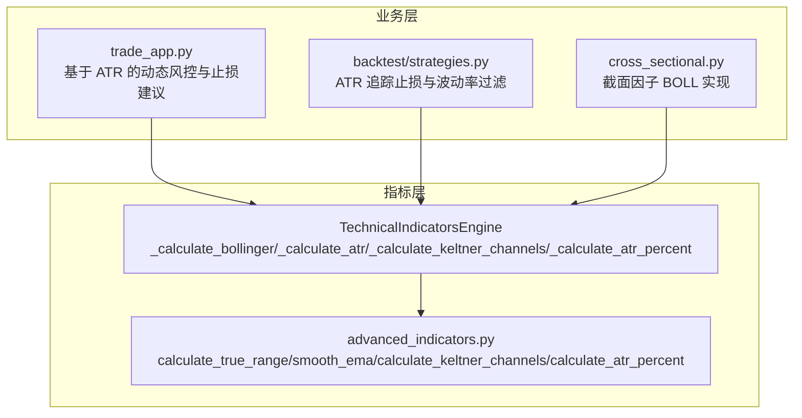
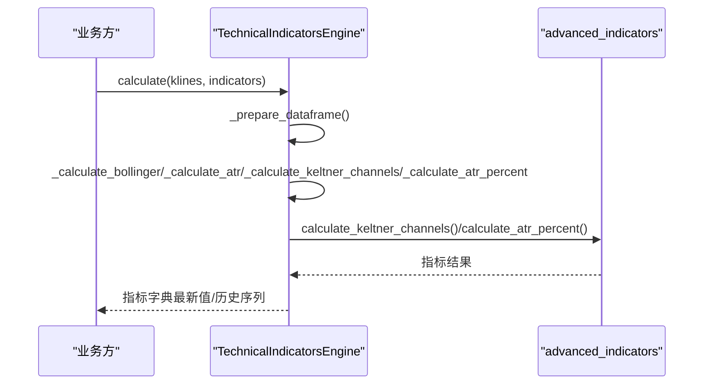
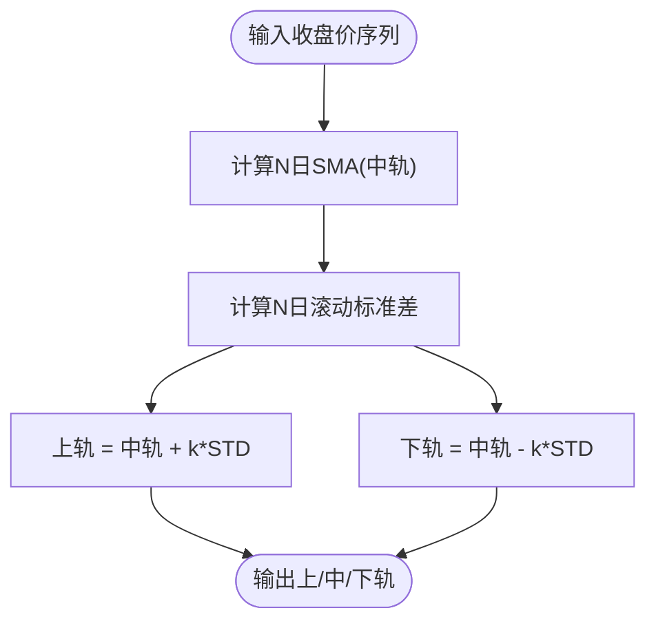
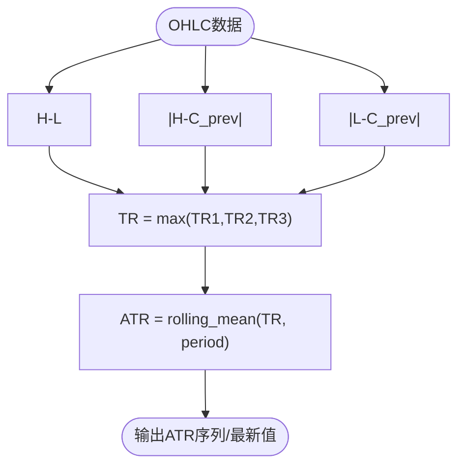
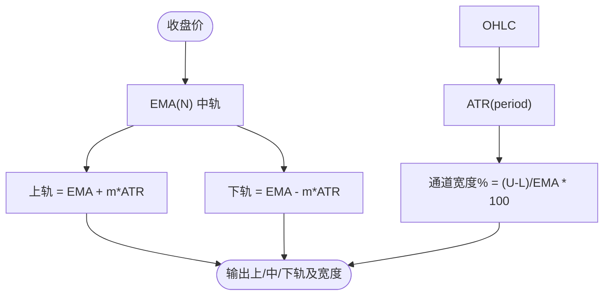
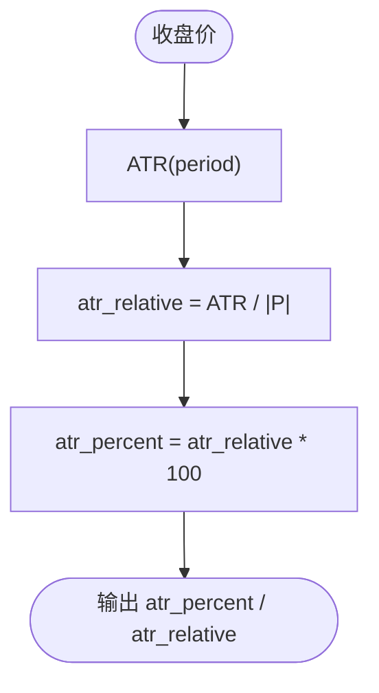
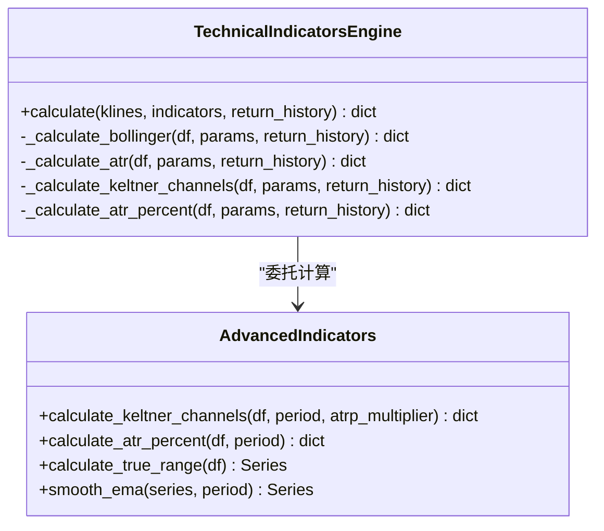
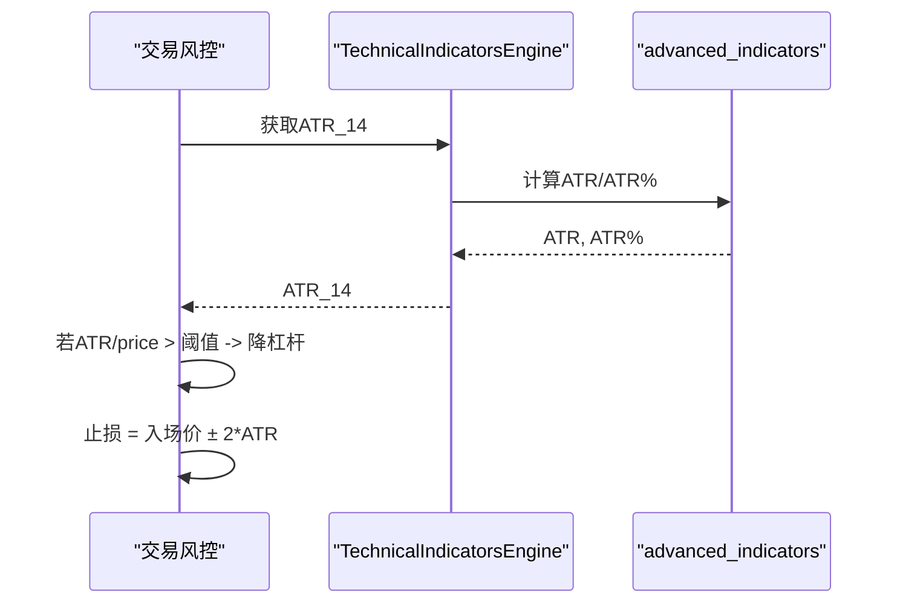
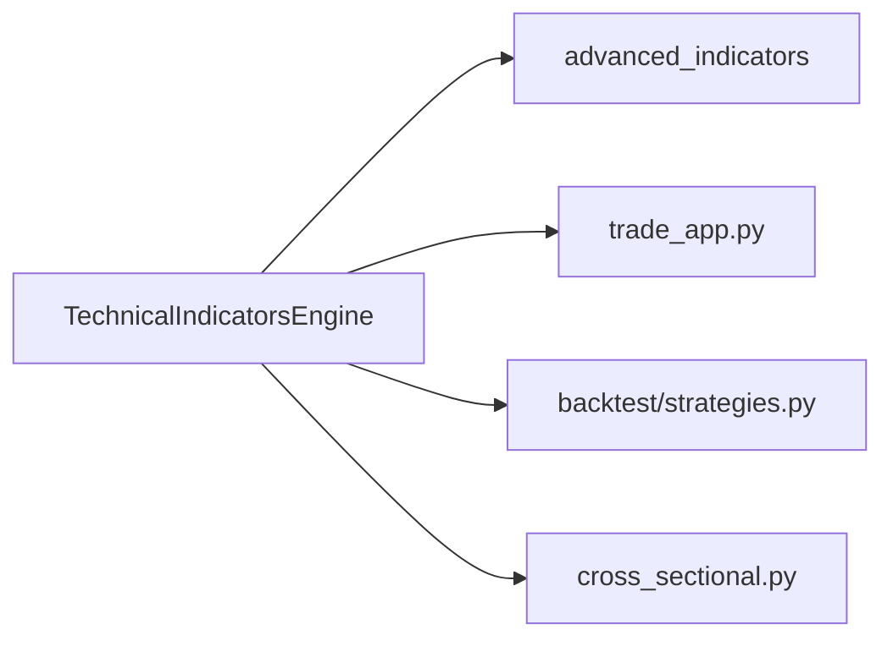

# 波动率指标

<cite>
**本文引用的文件**
- [backend/utils/technical_indicators_pro.py](file://backend/utils/technical_indicators_pro.py)
- [backend/utils/advanced_indicators.py](file://backend/utils/advanced_indicators.py)
- [backend/app/trade_app.py](file://backend/app/trade_app.py)
- [backend/backtest/strategies.py](file://backend/backtest/strategies.py)
- [backend/domain/cross_sectional.py](file://backend/domain/cross_sectional.py)
- [tests/utils/test_technical_indicators_pro.py](file://tests/utils/test_technical_indicators_pro.py)
</cite>

## 目录
1. [简介](#简介)
2. [项目结构](#项目结构)
3. [核心组件](#核心组件)
4. [架构总览](#架构总览)
5. [详细组件分析](#详细组件分析)
6. [依赖关系分析](#依赖关系分析)
7. [性能考量](#性能考量)
8. [故障排查指南](#故障排查指南)
9. [结论](#结论)
10. [附录](#附录)

## 简介
本技术文档聚焦于波动率类技术指标的实现与应用，覆盖布林带（BOLLINGER）、ATR、肯特纳通道（Keltner Channels）以及 ATR% 等指标的计算原理与工程实现。重点说明：
- 布林带的标准差通道计算与上下轨含义
- ATR 的真实波幅计算与移动平均平滑
- 肯特纳通道的 EMA 中轨与 ATR 倍数通道宽度
- ATR% 的相对波动率概念与使用方式
- TechnicalIndicatorsEngine 中与波动率相关的 _volatility 方法实现
- 市场状态判断、突破信号识别与止损设置方法
- 策略应用、参数调优技巧以及与趋势指标的结合使用

## 项目结构
本项目在 backend/utils 下提供生产级技术指标引擎，并在 advanced_indicators.py 中集中实现高级波动率指标；交易风控与回测模块则直接消费这些指标进行动态止损与仓位管理。

图表来源
- [backend/utils/technical_indicators_pro.py:175-612](file://backend/utils/technical_indicators_pro.py#L175-L612)
- [backend/utils/advanced_indicators.py:17-262](file://backend/utils/advanced_indicators.py#L17-L262)
- [backend/app/trade_app.py:78-103](file://backend/app/trade_app.py#L78-L103)
- [backend/backtest/strategies.py:65-72](file://backend/backtest/strategies.py#L65-L72)
- [backend/domain/cross_sectional.py:60-99](file://backend/domain/cross_sectional.py#L60-L99)

章节来源
- [backend/utils/technical_indicators_pro.py:175-612](file://backend/utils/technical_indicators_pro.py#L175-L612)
- [backend/utils/advanced_indicators.py:17-262](file://backend/utils/advanced_indicators.py#L17-L262)

## 核心组件
- TechnicalIndicatorsEngine：统一的技术指标计算入口，支持按配置批量计算并缓存结果，内置多种波动率指标计算方法。
- advanced_indicators：高级波动率指标的具体算法实现，包括真实波幅、EMA 平滑、ATR%、肯特纳通道等。
- trade_app：交易前风控环节，利用 ATR 动态评估波动率并给出止损建议与杠杆调整。
- backtest/strategies：回测策略中使用 ATR 作为追踪止损与波动率过滤。
- cross_sectional：截面因子中的布林带实现，用于横截面选股或排序。

章节来源
- [backend/utils/technical_indicators_pro.py:175-612](file://backend/utils/technical_indicators_pro.py#L175-L612)
- [backend/utils/advanced_indicators.py:17-262](file://backend/utils/advanced_indicators.py#L17-L262)
- [backend/app/trade_app.py:78-103](file://backend/app/trade_app.py#L78-L103)
- [backend/backtest/strategies.py:65-72](file://backend/backtest/strategies.py#L65-L72)
- [backend/domain/cross_sectional.py:60-99](file://backend/domain/cross_sectional.py#L60-L99)

## 架构总览
波动率指标在系统中的调用路径如下：
- 上层业务（交易风控、回测、截面因子）通过 TechnicalIndicatorsEngine 请求指标计算
- Engine 根据配置选择对应 _calculate_* 方法执行
- 部分高级指标委托到 advanced_indicators 完成具体数学计算
- 返回最新值或历史序列供下游使用

图表来源
- [backend/utils/technical_indicators_pro.py:190-247](file://backend/utils/technical_indicators_pro.py#L190-L247)
- [backend/utils/technical_indicators_pro.py:335-375](file://backend/utils/technical_indicators_pro.py#L335-L375)
- [backend/utils/technical_indicators_pro.py:520-603](file://backend/utils/technical_indicators_pro.py#L520-L603)
- [backend/utils/advanced_indicators.py:161-262](file://backend/utils/advanced_indicators.py#L161-L262)

## 详细组件分析

### 布林带（BOLLINGER）
- 计算原理
  - 中轨：收盘价的 N 日简单移动平均
  - 标准差：收盘价 N 日滚动标准差
  - 上轨 = 中轨 + k × 标准差
  - 下轨 = 中轨 - k × 标准差
- 工程实现
  - 使用滚动窗口计算均值与标准差，支持返回历史序列或最新值
  - 默认周期为 20，标准差倍数为 2
- 应用场景
  - 价格触及上轨可能超买，触及下轨可能超卖
  - 带宽收窄常预示即将出现方向性突破
  - 结合成交量与趋势指标过滤假突破

图表来源
- [backend/utils/technical_indicators_pro.py:335-356](file://backend/utils/technical_indicators_pro.py#L335-L356)

章节来源
- [backend/utils/technical_indicators_pro.py:335-356](file://backend/utils/technical_indicators_pro.py#L335-L356)
- [backend/domain/cross_sectional.py:60-99](file://backend/domain/cross_sectional.py#L60-L99)

### ATR（真实波幅）
- 计算原理
  - 真实波幅 TR 取以下三者最大值：当日最高-最低、|最高-昨收|、|最低-昨收|
  - ATR 为 TR 的移动平均（工程中采用滚动均值）
- 工程实现
  - 使用向量化的 pandas 操作计算 TR，再对 TR 做滚动均值得到 ATR
  - 支持返回历史序列或最新值
- 应用场景
  - 衡量市场波动程度，用于动态止损、仓位控制
  - 高 ATR 时降低杠杆或缩小头寸，低 ATR 时可适度放大

图表来源
- [backend/utils/technical_indicators_pro.py:358-375](file://backend/utils/technical_indicators_pro.py#L358-L375)
- [backend/utils/advanced_indicators.py:17-33](file://backend/utils/advanced_indicators.py#L17-L33)

章节来源
- [backend/utils/technical_indicators_pro.py:358-375](file://backend/utils/technical_indicators_pro.py#L358-L375)
- [backend/utils/advanced_indicators.py:17-33](file://backend/utils/advanced_indicators.py#L17-L33)

### 肯特纳通道（Keltner Channels）
- 计算原理
  - 中轨：收盘价的指数移动平均（EMA）
  - 通道宽度：ATR 的倍数（通常 1.5 或 2.0）
  - 上轨 = EMA + 倍数 × ATR
  - 下轨 = EMA - 倍数 × ATR
- 工程实现
  - 使用 EMA 作为中轨，ATR 采用滚动均值（与引擎内 ATR 一致）
  - 额外输出通道宽度百分比，便于比较不同标的波动
- 应用场景
  - 通道突破常用于趋势跟踪
  - 通道宽度可反映波动扩张/收缩

图表来源
- [backend/utils/technical_indicators_pro.py:574-603](file://backend/utils/technical_indicators_pro.py#L574-L603)
- [backend/utils/advanced_indicators.py:217-262](file://backend/utils/advanced_indicators.py#L217-L262)

章节来源
- [backend/utils/technical_indicators_pro.py:574-603](file://backend/utils/technical_indicators_pro.py#L574-L603)
- [backend/utils/advanced_indicators.py:217-262](file://backend/utils/advanced_indicators.py#L217-L262)

### ATR%（波动率百分比）
- 计算原理
  - ATR% = ATR / |收盘价| × 100，表示相对波动率
  - 可用于跨品种比较波动水平
- 工程实现
  - 先计算 TR 与 ATR，再除以当前收盘价得到相对波动
  - 同时输出 atr_relative（小数形式）与 atr_percent（百分比形式）
- 应用场景
  - 筛选高/低波动标的
  - 作为仓位与止损的参数依据

图表来源
- [backend/utils/advanced_indicators.py:161-184](file://backend/utils/advanced_indicators.py#L161-L184)
- [backend/utils/technical_indicators_pro.py:520-543](file://backend/utils/technical_indicators_pro.py#L520-L543)

章节来源
- [backend/utils/advanced_indicators.py:161-184](file://backend/utils/advanced_indicators.py#L161-L184)
- [backend/utils/technical_indicators_pro.py:520-543](file://backend/utils/technical_indicators_pro.py#L520-L543)

### TechnicalIndicatorsEngine 中波动率相关方法
- _calculate_bollinger：计算布林带上中下轨，支持历史序列与最新值
- _calculate_atr：计算 ATR，支持历史序列与最新值
- _calculate_keltner_channels：委托 advanced_indicators 计算肯特纳通道，返回上中下轨与通道宽度
- _calculate_atr_percent：委托 advanced_indicators 计算 ATR%，返回相对波动率与百分比

图表来源
- [backend/utils/technical_indicators_pro.py:335-603](file://backend/utils/technical_indicators_pro.py#L335-L603)
- [backend/utils/advanced_indicators.py:17-262](file://backend/utils/advanced_indicators.py#L17-L262)

章节来源
- [backend/utils/technical_indicators_pro.py:335-603](file://backend/utils/technical_indicators_pro.py#L335-L603)
- [backend/utils/advanced_indicators.py:17-262](file://backend/utils/advanced_indicators.py#L17-L262)

### 市场状态判断、突破信号识别与止损设置
- 市场状态判断
  - 布林带带宽收窄：潜在变盘区间
  - 肯特纳通道宽度扩大：趋势启动或波动加剧
  - ATR% 上升：相对波动增强，适合趋势跟踪；下降：震荡市，适合均值回归
- 突破信号识别
  - 价格有效突破布林带上轨/下轨且伴随放量，可作为趋势确认
  - 肯特纳通道上轨/下轨突破配合 ATR 放大，提高信号质量
- 止损设置
  - 交易前风控：基于 2×ATR 动态止损参考，高波动资产强制降杠杆
  - 回测策略：使用 ATR 追踪止损（sl_trail），随价格移动保护利润

图表来源
- [backend/app/trade_app.py:78-103](file://backend/app/trade_app.py#L78-L103)
- [backend/utils/technical_indicators_pro.py:358-375](file://backend/utils/technical_indicators_pro.py#L358-L375)
- [backend/utils/advanced_indicators.py:161-184](file://backend/utils/advanced_indicators.py#L161-L184)

章节来源
- [backend/app/trade_app.py:78-103](file://backend/app/trade_app.py#L78-L103)
- [backend/backtest/strategies.py:65-72](file://backend/backtest/strategies.py#L65-L72)

### 策略应用、参数调优与趋势指标结合
- 策略应用
  - 布林带+RSI/MACD：在超买/超卖区域结合动量指标过滤假突破
  - 肯特纳通道+ATR：通道突破后以 ATR 追踪止损，锁定趋势利润
  - ATR%：在高波动环境降低仓位或放宽止损，低波动环境收紧止损
- 参数调优
  - 布林带周期与标准差倍数：短周期更敏感，长周期更稳定
  - ATR 周期：常用 14，可根据品种波动特性调整
  - 肯特纳通道倍数：1.5~2.0，宽通道减少噪音，窄通道提高灵敏度
- 与趋势指标结合
  - 均线/EMA 方向过滤：仅顺趋势做多/做空
  - ADX：趋势强度高于阈值时启用波动率突破策略

章节来源
- [backend/backtest/strategies.py:65-72](file://backend/backtest/strategies.py#L65-L72)
- [backend/utils/technical_indicators_pro.py:77-129](file://backend/utils/technical_indicators_pro.py#L77-L129)

## 依赖关系分析
- TechnicalIndicatorsEngine 依赖 advanced_indicators 完成复杂波动率指标计算
- 交易风控模块依赖 Engine 提供的 ATR 进行动态止损与杠杆调整
- 回测策略使用 ATR 作为追踪止损参数
- 截面因子模块包含布林带实现，用于横截面分析

图表来源
- [backend/utils/technical_indicators_pro.py:175-612](file://backend/utils/technical_indicators_pro.py#L175-L612)
- [backend/utils/advanced_indicators.py:17-262](file://backend/utils/advanced_indicators.py#L17-L262)
- [backend/app/trade_app.py:78-103](file://backend/app/trade_app.py#L78-L103)
- [backend/backtest/strategies.py:65-72](file://backend/backtest/strategies.py#L65-L72)
- [backend/domain/cross_sectional.py:60-99](file://backend/domain/cross_sectional.py#L60-L99)

章节来源
- [backend/utils/technical_indicators_pro.py:175-612](file://backend/utils/technical_indicators_pro.py#L175-L612)
- [backend/utils/advanced_indicators.py:17-262](file://backend/utils/advanced_indicators.py#L17-L262)
- [backend/app/trade_app.py:78-103](file://backend/app/trade_app.py#L78-L103)
- [backend/backtest/strategies.py:65-72](file://backend/backtest/strategies.py#L65-L72)
- [backend/domain/cross_sectional.py:60-99](file://backend/domain/cross_sectional.py#L60-L99)

## 性能考量
- 向量化计算：使用 pandas/numpy 的滚动窗口与向量化操作，避免逐行循环
- 缓存机制：Engine 的 calculate 方法使用装饰器缓存结果，减少重复计算
- 历史模式：return_history=True 时返回完整序列，适用于可视化与回测；False 时仅返回最新值，降低内存占用
- 数据校验：不足数据点时直接返回错误，避免无效计算

章节来源
- [backend/utils/technical_indicators_pro.py:136-169](file://backend/utils/technical_indicators_pro.py#L136-L169)
- [backend/utils/technical_indicators_pro.py:190-247](file://backend/utils/technical_indicators_pro.py#L190-L247)

## 故障排查指南
- 数据不足：当 K 线数量少于阈值时，Engine 返回错误信息，需检查数据长度
- NaN 处理：指标计算过程中可能出现 NaN，代码中对最新值做了空值判断，确保返回 None 而非异常
- 依赖缺失：高级指标函数按需导入，避免启动时加载开销
- 测试验证：可通过单元测试验证各指标计算正确性与边界情况

章节来源
- [backend/utils/technical_indicators_pro.py:215-216](file://backend/utils/technical_indicators_pro.py#L215-L216)
- [tests/utils/test_technical_indicators_pro.py:83-93](file://tests/utils/test_technical_indicators_pro.py#L83-L93)

## 结论
本仓库提供了完善且生产级的波动率指标实现，涵盖布林带、ATR、肯特纳通道与 ATR% 等核心工具。通过 TechnicalIndicatorsEngine 的统一接口，交易风控与回测策略能够便捷地获取波动率信号，实现动态止损、仓位管理与趋势跟踪。建议在实际应用中结合趋势指标与成交量过滤，优化参数以适应不同市场环境与品种特性。

## 附录
- 关键方法与位置
  - 布林带：[backend/utils/technical_indicators_pro.py:335-356](file://backend/utils/technical_indicators_pro.py#L335-L356)
  - ATR：[backend/utils/technical_indicators_pro.py:358-375](file://backend/utils/technical_indicators_pro.py#L358-L375)
  - 肯特纳通道：[backend/utils/technical_indicators_pro.py:574-603](file://backend/utils/technical_indicators_pro.py#L574-L603)
  - ATR%：[backend/utils/advanced_indicators.py:161-184](file://backend/utils/advanced_indicators.py#L161-L184)
  - 交易风控止损：[backend/app/trade_app.py:78-103](file://backend/app/trade_app.py#L78-L103)
  - 回测追踪止损：[backend/backtest/strategies.py:65-72](file://backend/backtest/strategies.py#L65-L72)
  - 截面布林带：[backend/domain/cross_sectional.py:60-99](file://backend/domain/cross_sectional.py#L60-L99)
