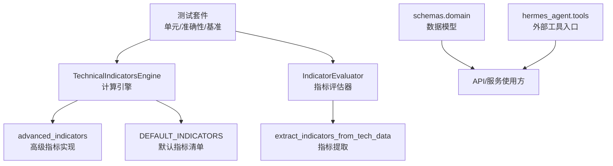
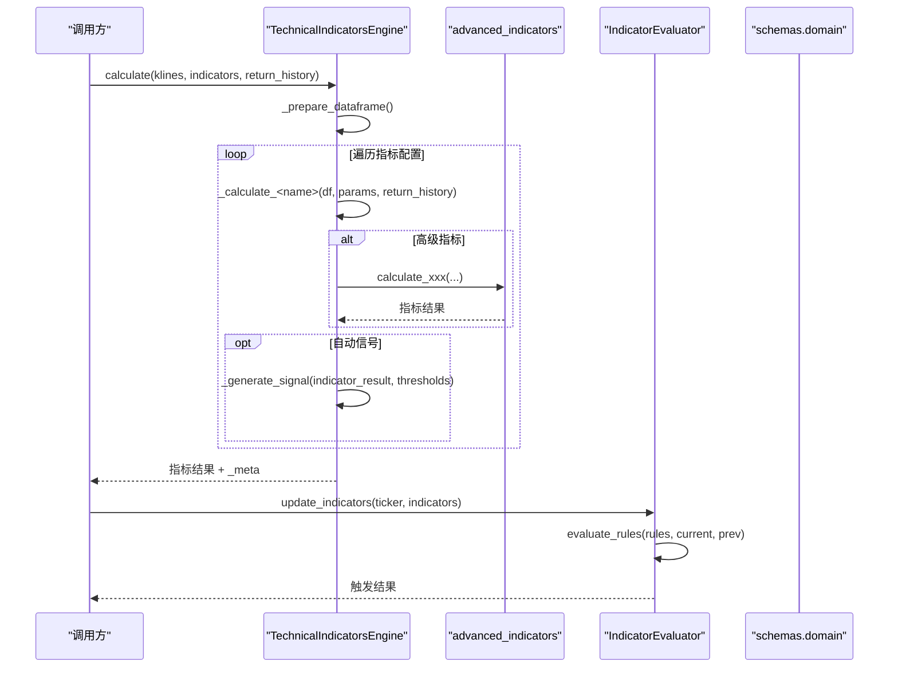
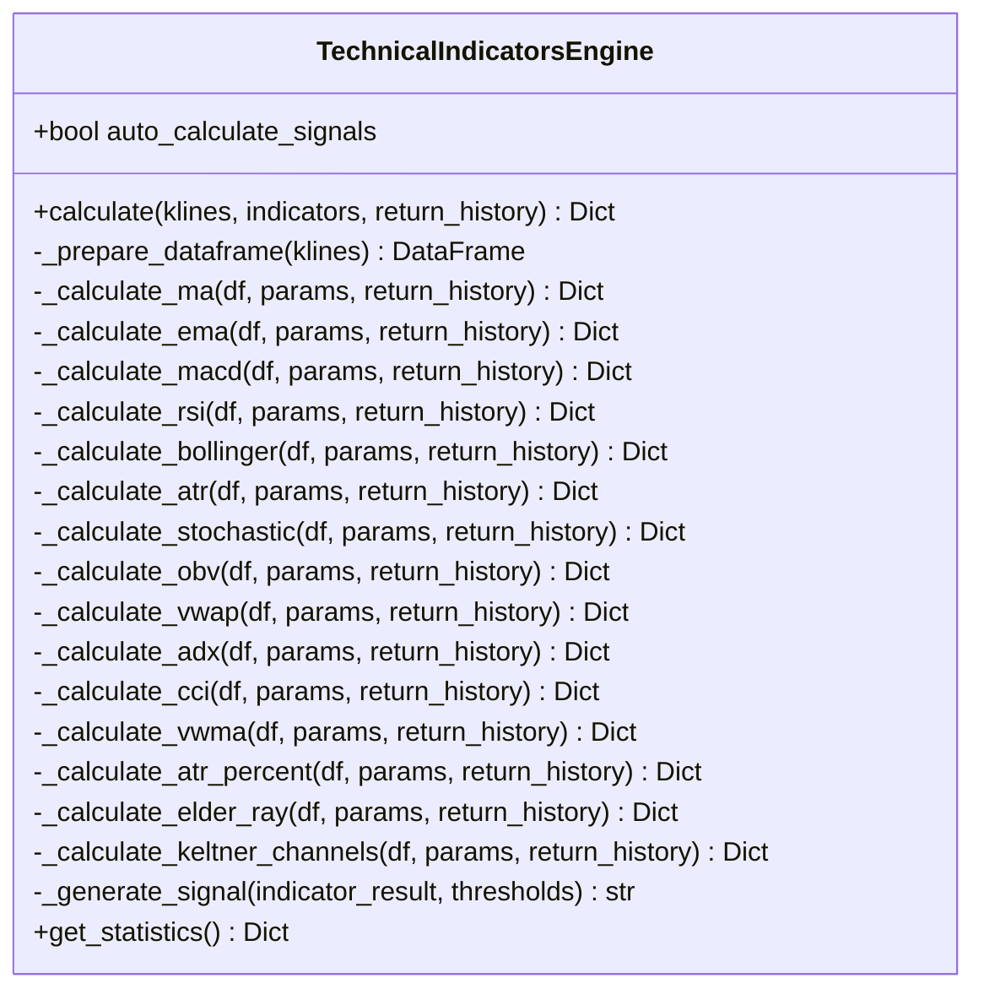
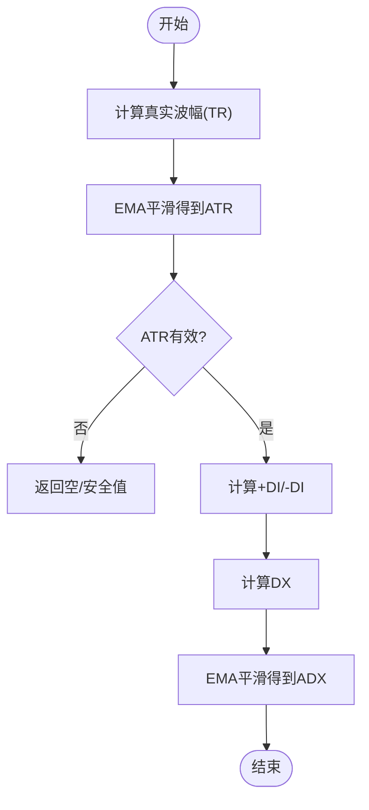
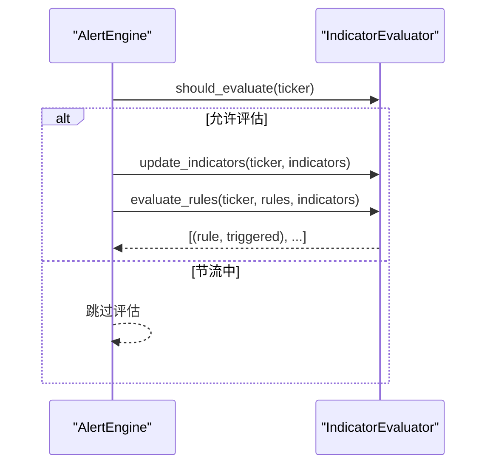
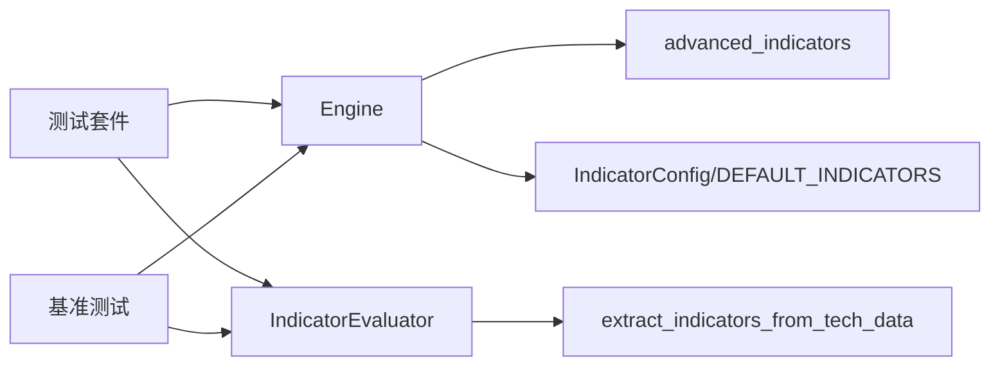

# 自定义指标开发

<cite>
**本文引用的文件**
- [backend/utils/technical_indicators_pro.py](file://backend/utils/technical_indicators_pro.py)
- [backend/utils/advanced_indicators.py](file://backend/utils/advanced_indicators.py)
- [backend/domain/indicator_evaluator.py](file://backend/domain/indicator_evaluator.py)
- [backend/schemas/domain.py](file://backend/schemas/domain.py)
- [backend/tests/test_technical_indicators_pro.py](file://backend/tests/test_technical_indicators_pro.py)
- [tests/utils/test_indicator_accuracy.py](file://tests/utils/test_indicator_accuracy.py)
- [backend/tests/test_benchmark_test04.py](file://backend/tests/test_benchmark_test04.py)
- [hermes_agent/tools/technical_indicators_tool.py](file://hermes_agent/tools/technical_indicators_tool.py)
</cite>

## 目录
1. [简介](#简介)
2. [项目结构](#项目结构)
3. [核心组件](#核心组件)
4. [架构总览](#架构总览)
5. [详细组件分析](#详细组件分析)
6. [依赖关系分析](#依赖关系分析)
7. [性能考虑](#性能考虑)
8. [故障排查指南](#故障排查指南)
9. [结论](#结论)
10. [附录：快速上手与模板](#附录快速上手与模板)

## 简介
本技术文档面向希望在现有系统中扩展技术指标能力的开发者，聚焦如何基于 TechnicalIndicatorsEngine 添加新指标、完成参数配置、信号生成、注册与缓存、性能优化、测试验证与准确性校验、错误处理与边界条件、以及 API 设计与向后兼容。文档提供从类设计到落地的完整流程与代码级图示，帮助快速集成到现有的技术指标系统中。

## 项目结构
本项目在 backend/utils 下提供生产级技术指标引擎与高级指标实现；在 domain 层提供告警评估器；在 schemas 中定义统一的数据模型；在 tests 中提供单元测试、准确性验证与基准测试；在 hermes_agent/tools 中提供对外工具入口。

图表来源
- [backend/utils/technical_indicators_pro.py:175-247](file://backend/utils/technical_indicators_pro.py#L175-L247)
- [backend/utils/advanced_indicators.py:44-262](file://backend/utils/advanced_indicators.py#L44-L262)
- [backend/domain/indicator_evaluator.py:36-163](file://backend/domain/indicator_evaluator.py#L36-L163)
- [backend/schemas/domain.py:244-268](file://backend/schemas/domain.py#L244-L268)
- [hermes_agent/tools/technical_indicators_tool.py:11-86](file://hermes_agent/tools/technical_indicators_tool.py#L11-L86)

章节来源
- [backend/utils/technical_indicators_pro.py:1-131](file://backend/utils/technical_indicators_pro.py#L1-L131)
- [backend/utils/advanced_indicators.py:1-262](file://backend/utils/advanced_indicators.py#L1-L262)
- [backend/domain/indicator_evaluator.py:1-163](file://backend/domain/indicator_evaluator.py#L1-L163)
- [backend/schemas/domain.py:244-268](file://backend/schemas/domain.py#L244-L268)
- [hermes_agent/tools/technical_indicators_tool.py:11-86](file://hermes_agent/tools/technical_indicators_tool.py#L11-L86)

## 核心组件
- TechnicalIndicatorsEngine：统一的指标计算引擎，负责数据准备、按配置调用具体指标方法、可选的信号生成、统计与缓存。
- advanced_indicators：高级指标的独立实现（ADX、CCI、VWMA、ATR%、Elder-Ray、Keltner Channels），便于复用与测试。
- IndicatorEvaluator：指标值缓存与规则评估（如 RSI 阈值、MACD 穿越、均线穿越），支持节流控制。
- schemas.domain：统一的数据模型（指标类型、参数、结果结构）。
- 测试与基准：单元测试覆盖功能正确性；准确性测试验证公式与数值范围；基准测试评估性能。

章节来源
- [backend/utils/technical_indicators_pro.py:175-247](file://backend/utils/technical_indicators_pro.py#L175-L247)
- [backend/utils/advanced_indicators.py:44-262](file://backend/utils/advanced_indicators.py#L44-L262)
- [backend/domain/indicator_evaluator.py:36-163](file://backend/domain/indicator_evaluator.py#L36-L163)
- [backend/schemas/domain.py:244-268](file://backend/schemas/domain.py#L244-L268)
- [backend/tests/test_technical_indicators_pro.py:88-129](file://backend/tests/test_technical_indicators_pro.py#L88-L129)
- [tests/utils/test_indicator_accuracy.py:18-443](file://tests/utils/test_indicator_accuracy.py#L18-L443)
- [backend/tests/test_benchmark_test04.py:171-339](file://backend/tests/test_benchmark_test04.py#L171-L339)

## 架构总览
下图展示了从输入 K 线到输出指标与信号的端到端流程，包括缓存、信号生成与评估器的交互。

图表来源
- [backend/utils/technical_indicators_pro.py:190-247](file://backend/utils/technical_indicators_pro.py#L190-L247)
- [backend/utils/advanced_indicators.py:44-262](file://backend/utils/advanced_indicators.py#L44-L262)
- [backend/domain/indicator_evaluator.py:77-140](file://backend/domain/indicator_evaluator.py#L77-L140)
- [backend/schemas/domain.py:244-268](file://backend/schemas/domain.py#L244-L268)

## 详细组件分析

### TechnicalIndicatorsEngine 组件分析
- 职责
  - 数据准备：将 K 线列表转为 DataFrame，并做数值列的类型转换。
  - 指标计算：根据 IndicatorConfig 动态调用对应 _calculate_<name> 方法。
  - 信号生成：若配置了 signal_thresholds 且开启自动信号，则生成交易信号。
  - 统计与缓存：记录运行次数，使用装饰器对 calculate 进行结果缓存。
- 关键设计
  - 通过 DEFAULT_INDICATORS 集中管理内置指标及其参数与阈值。
  - 每个指标以独立方法实现，便于扩展与维护。
  - 返回结构支持“最新值”和“历史序列”两种模式。
- 扩展点
  - 新增指标需实现 _calculate_<name> 并在 DEFAULT_INDICATORS 注册。
  - 可接入 advanced_indicators 中的复杂算法。
  - 可扩展信号生成逻辑以支持更丰富的策略。

图表来源
- [backend/utils/technical_indicators_pro.py:175-613](file://backend/utils/technical_indicators_pro.py#L175-L613)

章节来源
- [backend/utils/technical_indicators_pro.py:175-613](file://backend/utils/technical_indicators_pro.py#L175-L613)

### advanced_indicators 组件分析
- 职责：提供 ADX、CCI、VWMA、ATR%、Elder-Ray、Keltner Channels 等高级指标的计算函数。
- 特点
  - 向量化计算与滚动窗口结合，兼顾性能与可读性。
  - 对缺失值与异常值进行防护（例如 ATR 为 0 或 NaN 时返回安全值）。
  - 提供通用辅助函数（真实波幅、平滑 EMA、条件选择）。
- 与 Engine 的集成：Engine 中的 _calculate_* 方法按需调用这些函数，保持职责分离。

图表来源
- [backend/utils/advanced_indicators.py:17-106](file://backend/utils/advanced_indicators.py#L17-L106)

章节来源
- [backend/utils/advanced_indicators.py:17-262](file://backend/utils/advanced_indicators.py#L17-L262)

### IndicatorEvaluator 组件分析
- 职责：维护当前与前一次指标快照，评估指标类告警规则是否触发，支持节流以避免频繁计算。
- 关键点
  - should_evaluate/mark_evaluated：控制评估频率。
  - update_indicators/get_prev/current：滑动窗口式指标缓存。
  - evaluate_rules：对规则集合逐一评估并记录日志。
  - extract_indicators_from_tech_data：从统一数据结构中提取扁平化指标字典。

图表来源
- [backend/domain/indicator_evaluator.py:56-140](file://backend/domain/indicator_evaluator.py#L56-L140)

章节来源
- [backend/domain/indicator_evaluator.py:36-163](file://backend/domain/indicator_evaluator.py#L36-L163)

### 指标注册机制与默认清单
- 注册方式：在 DEFAULT_INDICATORS 中添加 IndicatorConfig，指定 name、indicator_type、params 与可选 signal_thresholds。
- 动态调度：Engine.calculate 通过 getattr(self, f"_calculate_{config.name.lower()}") 动态调用对应计算方法。
- 扩展建议：新增指标必须实现同名 _calculate_* 方法，否则会被捕获为 error。

章节来源
- [backend/utils/technical_indicators_pro.py:47-131](file://backend/utils/technical_indicators_pro.py#L47-L131)
- [backend/utils/technical_indicators_pro.py:221-237](file://backend/utils/technical_indicators_pro.py#L221-L237)

### 缓存策略与性能优化
- 结果缓存：@cache_result 基于输入参数的 MD5 哈希键，TTL 默认 300 秒，命中直接返回缓存结果。
- 数据准备：DataFrame 数值列强制转换，避免类型不一致导致的计算失败。
- 向量化计算：advanced_indicators 大量使用 pandas/numpy 向量化操作，减少 Python 循环开销。
- 节流控制：IndicatorEvaluator 支持按 ticker 的评估节流，降低高频场景下的计算压力。

章节来源
- [backend/utils/technical_indicators_pro.py:136-169](file://backend/utils/technical_indicators_pro.py#L136-L169)
- [backend/utils/technical_indicators_pro.py:249-258](file://backend/utils/technical_indicators_pro.py#L249-L258)
- [backend/domain/indicator_evaluator.py:46-75](file://backend/domain/indicator_evaluator.py#L46-L75)

### 信号生成与阈值
- 信号生成：_generate_signal 目前返回中性信号，可按需扩展（例如基于 RSI 超买超卖、MACD 金叉死叉、均线穿越）。
- 阈值配置：在 IndicatorConfig.signal_thresholds 中声明阈值，由 Engine 在计算后自动调用信号生成。

章节来源
- [backend/utils/technical_indicators_pro.py:605-609](file://backend/utils/technical_indicators_pro.py#L605-L609)
- [backend/utils/technical_indicators_pro.py:229-233](file://backend/utils/technical_indicators_pro.py#L229-L233)

### 数据类型转换与边界条件
- 数据类型：_prepare_dataframe 将 OHLCV 列转换为数值类型，errors="coerce" 保证容错。
- 边界条件：各指标对 NaN/零值进行处理，例如 ATR 为 0 时返回安全值；RSI 分母为零时的保护。
- 历史与最新：return_history=True 返回完整序列，False 仅返回最新值，便于不同场景使用。

章节来源
- [backend/utils/technical_indicators_pro.py:249-258](file://backend/utils/technical_indicators_pro.py#L249-L258)
- [backend/utils/advanced_indicators.py:77-106](file://backend/utils/advanced_indicators.py#L77-L106)
- [backend/utils/technical_indicators_pro.py:317-333](file://backend/utils/technical_indicators_pro.py#L317-L333)

### API 设计与向后兼容
- 旧版兼容：calculate_technical_indicators 包装 Engine，返回兼容旧结构的响应，包含 overall_signal。
- 模型规范：schemas.domain.TechIndicatorsModel 定义了 type、params、values、signal 的统一结构。
- 外部工具：hermes_agent.tools 提供便捷接口，封装后端调用与限流重试。

章节来源
- [backend/utils/technical_indicators_pro.py:618-658](file://backend/utils/technical_indicators_pro.py#L618-L658)
- [backend/schemas/domain.py:244-268](file://backend/schemas/domain.py#L244-L268)
- [hermes_agent/tools/technical_indicators_tool.py:11-86](file://hermes_agent/tools/technical_indicators_tool.py#L11-L86)

## 依赖关系分析
- Engine 依赖 advanced_indicators 的高级算法，并通过 IndicatorConfig 驱动计算。
- IndicatorEvaluator 依赖 extract_indicators_from_tech_data 将上层数据转换为扁平指标字典。
- 测试套件依赖 Engine 与 advanced_indicators 进行功能与准确性验证。
- 基准测试覆盖指标计算、规则评估、序列化等热点路径。

图表来源
- [backend/utils/technical_indicators_pro.py:175-247](file://backend/utils/technical_indicators_pro.py#L175-L247)
- [backend/utils/advanced_indicators.py:44-262](file://backend/utils/advanced_indicators.py#L44-L262)
- [backend/domain/indicator_evaluator.py:77-140](file://backend/domain/indicator_evaluator.py#L77-L140)
- [backend/tests/test_technical_indicators_pro.py:88-129](file://backend/tests/test_technical_indicators_pro.py#L88-L129)
- [backend/tests/test_benchmark_test04.py:171-339](file://backend/tests/test_benchmark_test04.py#L171-L339)

章节来源
- [backend/utils/technical_indicators_pro.py:175-247](file://backend/utils/technical_indicators_pro.py#L175-L247)
- [backend/utils/advanced_indicators.py:44-262](file://backend/utils/advanced_indicators.py#L44-L262)
- [backend/domain/indicator_evaluator.py:77-140](file://backend/domain/indicator_evaluator.py#L77-L140)
- [backend/tests/test_technical_indicators_pro.py:88-129](file://backend/tests/test_technical_indicators_pro.py#L88-L129)
- [backend/tests/test_benchmark_test04.py:171-339](file://backend/tests/test_benchmark_test04.py#L171-L339)

## 性能考虑
- 缓存命中：合理设置 TTL，避免重复计算相同参数组合的结果。
- 向量化优先：尽量使用 pandas/numpy 的向量化操作，减少 Python 层循环。
- 节流控制：在高并发场景下，利用 IndicatorEvaluator 的节流机制降低评估频率。
- 基准测试：使用 pytest-benchmark 对热点路径进行回归监控，确保新增指标不引入性能退化。

章节来源
- [backend/utils/technical_indicators_pro.py:136-169](file://backend/utils/technical_indicators_pro.py#L136-L169)
- [backend/domain/indicator_evaluator.py:46-75](file://backend/domain/indicator_evaluator.py#L46-L75)
- [backend/tests/test_benchmark_test04.py:171-339](file://backend/tests/test_benchmark_test04.py#L171-L339)

## 故障排查指南
- 数据不足：当 K 线数量过少时，Engine 返回错误信息，检查输入数据长度与质量。
- 指标不存在：若未实现 _calculate_<name>，将被捕获为 error，检查名称拼写与注册。
- 数值异常：检查 NaN/Inf 与除零情况，确保指标内部有边界保护。
- 信号误判：确认 signal_thresholds 配置与 _generate_signal 逻辑一致。
- 性能问题：启用缓存、调整 TTL、减少不必要的历史序列返回。

章节来源
- [backend/utils/technical_indicators_pro.py:215-237](file://backend/utils/technical_indicators_pro.py#L215-L237)
- [backend/utils/technical_indicators_pro.py:605-609](file://backend/utils/technical_indicators_pro.py#L605-L609)
- [backend/utils/advanced_indicators.py:77-106](file://backend/utils/advanced_indicators.py#L77-L106)

## 结论
通过 TechnicalIndicatorsEngine 与 advanced_indicators 的解耦设计，系统提供了高性能、可配置、易扩展的技术指标能力。配合 IndicatorEvaluator 的规则评估、完善的测试与基准体系，开发者可以高效地添加新指标并确保其准确性与稳定性。遵循本文档的流程与实践，能够快速集成到现有系统中，同时保持 API 的向后兼容与良好的可维护性。

## 附录：快速上手与模板

### 新增指标的标准流程
- 步骤
  1. 在 DEFAULT_INDICATORS 中添加 IndicatorConfig，指定 name、indicator_type、params、signal_thresholds。
  2. 实现 _calculate_<name>(df, params, return_history)，返回 dict（支持历史与最新两种模式）。
  3. 如需复杂算法，可在 advanced_indicators 中新增函数，并由 Engine 调用。
  4. 编写单元测试与准确性测试，覆盖边界条件与数值范围。
  5. 运行基准测试，确保性能无退化。
  6. 更新 API 文档与示例，保持向后兼容。

章节来源
- [backend/utils/technical_indicators_pro.py:47-131](file://backend/utils/technical_indicators_pro.py#L47-L131)
- [backend/utils/technical_indicators_pro.py:221-237](file://backend/utils/technical_indicators_pro.py#L221-L237)
- [backend/utils/advanced_indicators.py:44-262](file://backend/utils/advanced_indicators.py#L44-L262)
- [backend/tests/test_technical_indicators_pro.py:88-129](file://backend/tests/test_technical_indicators_pro.py#L88-L129)
- [tests/utils/test_indicator_accuracy.py:18-443](file://tests/utils/test_indicator_accuracy.py#L18-L443)
- [backend/tests/test_benchmark_test04.py:171-339](file://backend/tests/test_benchmark_test04.py#L171-L339)

### 指标类图与方法签名约定
- 约定
  - 方法名：_calculate_<name>(df: pd.DataFrame, params: dict, return_history: bool) -> dict
  - 返回值：dict，键名为指标子项（如 rsi、atr、upper/middle/lower）
  - 历史模式：返回列表；最新模式：返回 float 或 None
- 参考实现：RSI、ATR、BOLLINGER、STOCHASTIC、OBV、VWAP 等

章节来源
- [backend/utils/technical_indicators_pro.py:262-444](file://backend/utils/technical_indicators_pro.py#L262-L444)

### 测试与准确性校验
- 单元测试：覆盖默认指标、历史/最新模式、自定义指标配置、统计更新。
- 准确性测试：验证公式正确性与数值范围（如 ADX、CCI、VWMA、Elder-Ray、Keltner Channels）。
- 基准测试：对 MA、RSI、MACD、布林带等热点路径进行性能回归。

章节来源
- [backend/tests/test_technical_indicators_pro.py:88-377](file://backend/tests/test_technical_indicators_pro.py#L88-L377)
- [tests/utils/test_indicator_accuracy.py:18-443](file://tests/utils/test_indicator_accuracy.py#L18-L443)
- [backend/tests/test_benchmark_test04.py:171-339](file://backend/tests/test_benchmark_test04.py#L171-L339)

### API 与外部工具
- 旧版兼容：calculate_technical_indicators 返回兼容结构，便于老客户端无缝迁移。
- 外部工具：hermes_agent.tools 提供简洁接口，封装后端调用与限流感知重试。

章节来源
- [backend/utils/technical_indicators_pro.py:618-658](file://backend/utils/technical_indicators_pro.py#L618-L658)
- [hermes_agent/tools/technical_indicators_tool.py:11-86](file://hermes_agent/tools/technical_indicators_tool.py#L11-L86)