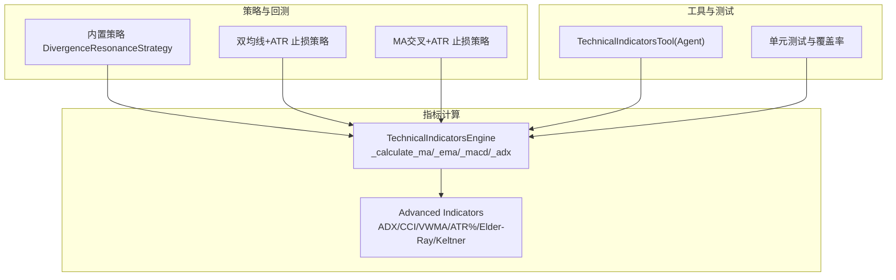
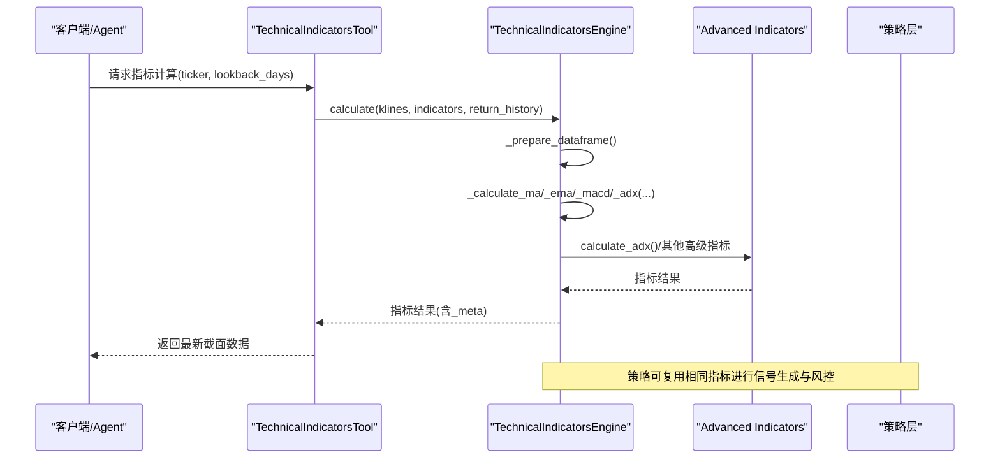
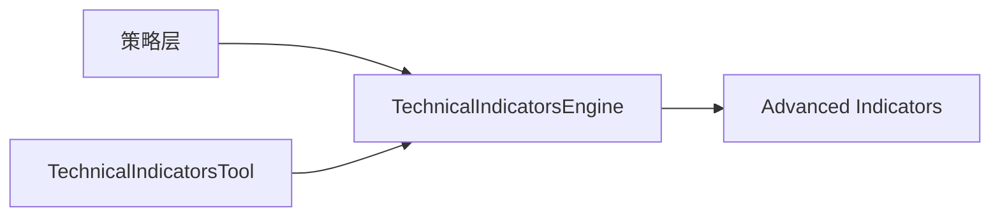

# 趋势指标

<cite>
**本文引用的文件**
- [backend/utils/technical_indicators_pro.py](file://backend/utils/technical_indicators_pro.py)
- [backend/utils/advanced_indicators.py](file://backend/utils/advanced_indicators.py)
- [backend/tests/test_technical_indicators_pro.py](file://backend/tests/test_technical_indicators_pro.py)
- [tests/utils/test_technical_indicators_pro.py](file://tests/utils/test_technical_indicators_pro.py)
- [hermes_agent/tools/technical_indicators_tool.py](file://hermes_agent/tools/technical_indicators_tool.py)
- [backend/backtest/strategies.py](file://backend/backtest/strategies.py)
- [backend/strategies/live/dualmaatrstopstrategy.py](file://backend/strategies/live/dualmaatrstopstrategy.py)
- [backend/strategies/live/macrossatrstrategy.py](file://backend/strategies/live/macrossatrstrategy.py)
</cite>

## 目录
1. [简介](#简介)
2. [项目结构](#项目结构)
3. [核心组件](#核心组件)
4. [架构总览](#架构总览)
5. [详细组件分析](#详细组件分析)
6. [依赖关系分析](#依赖关系分析)
7. [性能考量](#性能考量)
8. [故障排查指南](#故障排查指南)
9. [结论](#结论)
10. [附录](#附录)

## 简介
本技术文档聚焦于趋势类技术指标的实现与使用，覆盖移动平均线（MA）、指数移动平均线（EMA）、MACD、ADX等核心指标。文档基于仓库中的生产级实现，系统阐述各指标的数学原理、参数配置、信号生成逻辑，并重点解析 TechnicalIndicatorsEngine 中 _trend 相关方法的实现细节：多周期 MA 计算、EMA 权重分配、MACD 的快慢线与信号线差值、ADX 的趋势强度判断。同时提供使用示例、参数调优建议、与其他指标的组合策略、可视化展示方法与回测验证工具，为量化策略开发者提供趋势分析的最佳实践与性能优化建议。

## 项目结构
- 指标引擎与高级指标实现位于后端 utils 模块，提供统一的技术指标计算能力与扩展接口。
- 测试用例覆盖指标计算、缓存机制、兼容性包装函数等关键路径。
- 策略层包含内置矢量化策略与实盘风格策略，演示趋势指标在交易信号中的应用。
- Agent 工具封装了指标计算的调用入口，便于上层智能体或 API 消费。

图表来源
- [backend/utils/technical_indicators_pro.py:175-608](file://backend/utils/technical_indicators_pro.py#L175-L608)
- [backend/utils/advanced_indicators.py:44-262](file://backend/utils/advanced_indicators.py#L44-L262)
- [backend/backtest/strategies.py:13-204](file://backend/backtest/strategies.py#L13-L204)
- [backend/strategies/live/dualmaatrstopstrategy.py:9-74](file://backend/strategies/live/dualmaatrstopstrategy.py#L9-L74)
- [backend/strategies/live/macrossatrstrategy.py:8-73](file://backend/strategies/live/macrossatrstrategy.py#L8-L73)
- [hermes_agent/tools/technical_indicators_tool.py:11-86](file://hermes_agent/tools/technical_indicators_tool.py#L11-L86)

章节来源
- [backend/utils/technical_indicators_pro.py:175-608](file://backend/utils/technical_indicators_pro.py#L175-L608)
- [backend/utils/advanced_indicators.py:44-262](file://backend/utils/advanced_indicators.py#L44-L262)
- [backend/backtest/strategies.py:13-204](file://backend/backtest/strategies.py#L13-L204)
- [backend/strategies/live/dualmaatrstopstrategy.py:9-74](file://backend/strategies/live/dualmaatrstopstrategy.py#L9-L74)
- [backend/strategies/live/macrossatrstrategy.py:8-73](file://backend/strategies/live/macrossatrstrategy.py#L8-L73)
- [hermes_agent/tools/technical_indicators_tool.py:11-86](file://hermes_agent/tools/technical_indicators_tool.py#L11-L86)

## 核心组件
- TechnicalIndicatorsEngine：统一指标计算引擎，支持多指标批量计算、历史序列返回、自动信号生成与统计信息收集。
- Advanced Indicators：高级指标实现库，提供 ADX、CCI、VWMA、ATR%、Elder-Ray、Keltner Channels 等算法。
- 策略层：内置矢量化策略与实盘风格策略，演示趋势指标在信号生成与风控中的应用。
- Agent 工具：封装指标计算 API 调用，提供简洁的参数与返回格式。

章节来源
- [backend/utils/technical_indicators_pro.py:175-608](file://backend/utils/technical_indicators_pro.py#L175-L608)
- [backend/utils/advanced_indicators.py:44-262](file://backend/utils/advanced_indicators.py#L44-L262)
- [backend/backtest/strategies.py:13-204](file://backend/backtest/strategies.py#L13-L204)
- [backend/strategies/live/dualmaatrstopstrategy.py:9-74](file://backend/strategies/live/dualmaatrstopstrategy.py#L9-L74)
- [backend/strategies/live/macrossatrstrategy.py:8-73](file://backend/strategies/live/macrossatrstrategy.py#L8-L73)
- [hermes_agent/tools/technical_indicators_tool.py:11-86](file://hermes_agent/tools/technical_indicators_tool.py#L11-L86)

## 架构总览
指标计算引擎通过配置驱动的方式，动态选择并执行对应指标计算方法；高级指标由独立模块提供，保持高内聚低耦合。策略层复用这些指标进行信号生成与风险管理。Agent 工具作为外部接入点，将请求转发至后端服务以获取指标结果。

图表来源
- [hermes_agent/tools/technical_indicators_tool.py:57-86](file://hermes_agent/tools/technical_indicators_tool.py#L57-L86)
- [backend/utils/technical_indicators_pro.py:190-247](file://backend/utils/technical_indicators_pro.py#L190-L247)
- [backend/utils/advanced_indicators.py:44-106](file://backend/utils/advanced_indicators.py#L44-L106)

## 详细组件分析

### 移动平均线（MA）
- 数学公式：简单移动平均，对收盘价按窗口求均值。
- 参数配置：periods 列表（如 [5, 10, 20, 60]），支持多周期并行计算。
- 实现细节：
  - 历史模式：返回完整序列。
  - 最新值模式：取最近窗口的均值，处理 NaN 为 None。
- 复杂度：O(N·P)，N 为数据点数，P 为周期数。
- 优化建议：
  - 向量化滚动窗口计算，避免逐行循环。
  - 合理设置最小数据长度阈值，减少无效计算。

章节来源
- [backend/utils/technical_indicators_pro.py:262-276](file://backend/utils/technical_indicators_pro.py#L262-L276)
- [backend/tests/test_technical_indicators_pro.py:131-150](file://backend/tests/test_technical_indicators_pro.py#L131-L150)
- [tests/utils/test_technical_indicators_pro.py:94-108](file://tests/utils/test_technical_indicators_pro.py#L94-L108)

### 指数移动平均线（EMA）
- 数学公式：指数加权移动平均，权重随时间衰减，更重视近期价格。
- 参数配置：periods 列表（如 [10, 20]）。
- 实现细节：
  - 历史模式：返回完整序列。
  - 最新值模式：取最近 EMA 值，处理 NaN 为 None。
- 复杂度：O(N·P)。
- 优化建议：
  - 使用 ewm(span=period, adjust=False) 提升性能。
  - 结合缓存装饰器减少重复计算。

章节来源
- [backend/utils/technical_indicators_pro.py:278-292](file://backend/utils/technical_indicators_pro.py#L278-L292)
- [backend/tests/test_technical_indicators_pro.py:153-170](file://backend/tests/test_technical_indicators_pro.py#L153-L170)

### MACD（平滑异同移动平均线）
- 数学公式：
  - 快线 EMA_fast = EMA(close, fast)
  - 慢线 EMA_slow = EMA(close, slow)
  - DIF = EMA_fast - EMA_slow
  - DEA = EMA(DIF, signal)
  - Histogram = (DIF - DEA) * 2
- 参数配置：fast, slow, signal（默认 12, 26, 9）。
- 实现细节：
  - 历史模式：返回 dif/dea/histogram 完整序列。
  - 最新值模式：返回当前三个值，处理 NaN 为 None。
- 复杂度：O(N)。
- 信号生成：
  - 金叉：DIF 上穿 DEA。
  - 死叉：DIF 下穿 DEA。
  - 柱状图正负变化反映动能强弱。

章节来源
- [backend/utils/technical_indicators_pro.py:294-315](file://backend/utils/technical_indicators_pro.py#L294-L315)
- [backend/backtest/strategies.py:41-46](file://backend/backtest/strategies.py#L41-L46)
- [backend/tests/test_technical_indicators_pro.py:172-194](file://backend/tests/test_technical_indicators_pro.py#L172-L194)

### ADX（平均趋向指数）
- 数学公式：
  - 计算真实波幅 TR。
  - 计算 +DM/-DM，并进行 Wilder 平滑得到 +DI/-DI。
  - DX = 100 * |(+DI - -DI)| / (+DI + -DI)
  - ADX = EMA(DX, period)
- 参数配置：period（默认 14）。
- 实现细节：
  - 使用向量化的 diff 与 where 条件构造 +DM/-DM。
  - 通过 ATR 分母标准化 DI，避免极端波动影响。
  - 返回 adx、plus_di、minus_di、di_diff。
- 趋势强度判断：
  - ADX > 强趋势阈值（如 25）：趋势较强。
  - ADX < 弱趋势阈值（如 20）：趋势较弱或震荡。
- 复杂度：O(N)。

章节来源
- [backend/utils/advanced_indicators.py:44-106](file://backend/utils/advanced_indicators.py#L44-L106)
- [backend/utils/technical_indicators_pro.py:448-476](file://backend/utils/technical_indicators_pro.py#L448-L476)
- [backend/tests/test_technical_indicators_pro.py:325-333](file://backend/tests/test_technical_indicators_pro.py#L325-L333)

### 高级指标概览（CCI、VWMA、ATR%、Elder-Ray、Keltner Channels）
- CCI：商品通道指数，衡量价格偏离其统计平均的程度。
- VWMA：成交量加权移动平均，考虑成交量的价格加权。
- ATR%：波动率百分比，ATR 相对当前价格的比率。
- Elder-Ray：多头/空头力量，基于 EMA 基线与最高/最低价差值。
- Keltner Channels：基于 EMA 与 ATR 的通道，用于识别突破与波动。

章节来源
- [backend/utils/advanced_indicators.py:112-262](file://backend/utils/advanced_indicators.py#L112-L262)
- [backend/utils/technical_indicators_pro.py:478-603](file://backend/utils/technical_indicators_pro.py#L478-L603)

### 信号生成与组合策略
- 基础信号：
  - MA/EMA 交叉：短期均线上穿/下穿长期均线。
  - MACD 金叉/死叉：DIF 与 DEA 的交叉。
  - ADX 趋势强度：高于阈值时跟随趋势，低于阈值时谨慎操作。
- 组合策略示例：
  - RSI/MACD 动能背离 + KDJ 交叉共振：矩阵运算级形态识别，提高胜率。
  - 双均线 + ATR 动态止损：趋势跟踪与风险控制结合。
- 参数调优建议：
  - 短周期 MA/EMA 用于快速响应，长周期用于过滤噪音。
  - MACD 参数可根据品种波动性调整，信号线平滑度影响滞后性。
  - ADX 阈值需结合市场状态（趋势/震荡）动态调整。

章节来源
- [backend/backtest/strategies.py:13-204](file://backend/backtest/strategies.py#L13-L204)
- [backend/strategies/live/dualmaatrstopstrategy.py:9-74](file://backend/strategies/live/dualmaatrstopstrategy.py#L9-L74)
- [backend/strategies/live/macrossatrstrategy.py:8-73](file://backend/strategies/live/macrossatrstrategy.py#L8-L73)

## 依赖关系分析
- TechnicalIndicatorsEngine 依赖 advanced_indicators 模块提供高级指标实现。
- 策略层直接复用指标计算逻辑，或通过引擎统一调用。
- Agent 工具通过 HTTP 接口调用后端服务，间接依赖引擎。

图表来源
- [backend/utils/technical_indicators_pro.py:175-608](file://backend/utils/technical_indicators_pro.py#L175-L608)
- [backend/utils/advanced_indicators.py:44-262](file://backend/utils/advanced_indicators.py#L44-L262)
- [hermes_agent/tools/technical_indicators_tool.py:11-86](file://hermes_agent/tools/technical_indicators_tool.py#L11-L86)

章节来源
- [backend/utils/technical_indicators_pro.py:175-608](file://backend/utils/technical_indicators_pro.py#L175-L608)
- [backend/utils/advanced_indicators.py:44-262](file://backend/utils/advanced_indicators.py#L44-L262)
- [hermes_agent/tools/technical_indicators_tool.py:11-86](file://hermes_agent/tools/technical_indicators_tool.py#L11-L86)

## 性能考量
- 向量化计算：优先使用 pandas/numpy 的 rolling、ewm、diff 等操作，避免 Python 循环。
- 缓存机制：@cache_result 装饰器基于输入参数哈希缓存结果，减少重复计算。
- 数据预处理：统一转换为 DataFrame 并校验数值类型，降低后续计算开销。
- 最小数据长度：在数据不足时提前返回错误，避免无效计算。
- 历史模式与最新值模式：根据需求选择返回完整序列或仅最新值，平衡内存与性能。

章节来源
- [backend/utils/technical_indicators_pro.py:136-169](file://backend/utils/technical_indicators_pro.py#L136-L169)
- [backend/utils/technical_indicators_pro.py:215-247](file://backend/utils/technical_indicators_pro.py#L215-L247)
- [tests/utils/test_technical_indicators_pro.py:231-283](file://tests/utils/test_technical_indicators_pro.py#L231-L283)

## 故障排查指南
- 数据不足：当 K 线数据少于阈值时返回错误，检查输入数据长度与字段完整性。
- NaN 处理：部分指标在初期可能产生 NaN，代码中已处理为 None，确保下游逻辑健壮。
- 指标失败隔离：单个指标异常不影响其他指标计算，定位具体指标问题。
- 缓存过期：缓存 TTL 到期后重新计算，注意高频调用场景下的性能影响。

章节来源
- [backend/utils/technical_indicators_pro.py:215-237](file://backend/utils/technical_indicators_pro.py#L215-L237)
- [backend/utils/technical_indicators_pro.py:262-315](file://backend/utils/technical_indicators_pro.py#L262-L315)
- [tests/utils/test_technical_indicators_pro.py:83-93](file://tests/utils/test_technical_indicators_pro.py#L83-L93)

## 结论
本仓库提供了生产级的趋势指标计算引擎与高级指标实现，覆盖 MA、EMA、MACD、ADX 等核心指标，并通过策略层展示了其在交易信号与风控中的应用。通过向量化计算、缓存机制与模块化设计，系统在性能与可扩展性方面表现良好。建议在实际使用中结合市场特征调整参数，并结合多指标组合与回测验证，以提升策略稳健性与收益风险比。

## 附录

### 使用示例
- 基本调用：创建引擎实例，传入 K 线数据与指标配置，获取最新指标值或历史序列。
- 自定义指标：通过 IndicatorConfig 指定指标名称、类型、参数与信号阈值。
- 历史模式：设置 return_history=True 返回完整序列，用于可视化与深度分析。

章节来源
- [backend/utils/technical_indicators_pro.py:175-247](file://backend/utils/technical_indicators_pro.py#L175-L247)
- [backend/tests/test_technical_indicators_pro.py:99-129](file://backend/tests/test_technical_indicators_pro.py#L99-L129)

### 可视化展示方法
- 绘制价格与 MA/EMA 曲线，观察趋势方向与交叉点。
- 叠加 MACD 柱状图与信号线，识别动能变化与金叉/死叉。
- 使用 ADX 曲线判断趋势强度，配合 +DI/-DI 分析多空力量。
- 结合布林带、肯特纳通道等波动指标，识别突破与回归机会。

章节来源
- [backend/backtest/strategies.py:178-187](file://backend/backtest/strategies.py#L178-L187)
- [backend/utils/technical_indicators_pro.py:262-315](file://backend/utils/technical_indicators_pro.py#L262-L315)
- [backend/utils/advanced_indicators.py:44-106](file://backend/utils/advanced_indicators.py#L44-L106)

### 回测验证工具
- 内置矢量化策略：RSI/MACD 动能背离 + KDJ 交叉共振，提供完整回测流程与绩效统计。
- 双均线 + ATR 止损策略：趋势跟踪与动态风控结合，适用于不同市场环境。
- 回测输出：包括收益率、夏普比率、最大回撤、胜率、交易记录与资金曲线。

章节来源
- [backend/backtest/strategies.py:13-204](file://backend/backtest/strategies.py#L13-L204)
- [backend/strategies/live/dualmaatrstopstrategy.py:9-74](file://backend/strategies/live/dualmaatrstopstrategy.py#L9-L74)
- [backend/strategies/live/macrossatrstrategy.py:8-73](file://backend/strategies/live/macrossatrstrategy.py#L8-L73)

### 最佳实践与性能优化建议
- 参数调优：
  - MA/EMA：短周期用于敏感信号，长周期用于趋势过滤。
  - MACD：根据品种波动性调整快慢线与信号线，平衡滞后性与灵敏度。
  - ADX：结合市场状态动态调整阈值，避免震荡市频繁交易。
- 组合策略：
  - 趋势指标 + 动量指标（如 RSI、KDJ）提高胜率。
  - 波动指标（ATR、布林带）用于动态止损与仓位管理。
- 性能优化：
  - 使用向量化计算与缓存机制。
  - 合理设置最小数据长度与历史模式，减少内存占用。
  - 定期清理缓存与监控计算统计信息。

章节来源
- [backend/utils/technical_indicators_pro.py:136-169](file://backend/utils/technical_indicators_pro.py#L136-L169)
- [backend/utils/technical_indicators_pro.py:215-247](file://backend/utils/technical_indicators_pro.py#L215-L247)
- [backend/backtest/strategies.py:13-204](file://backend/backtest/strategies.py#L13-L204)
