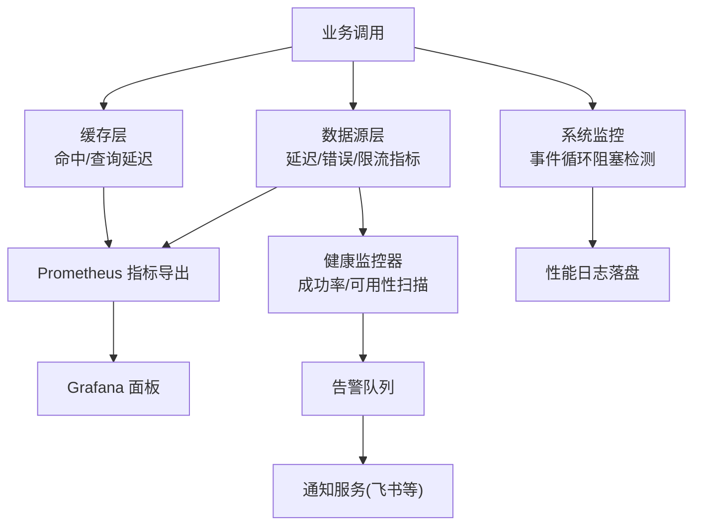
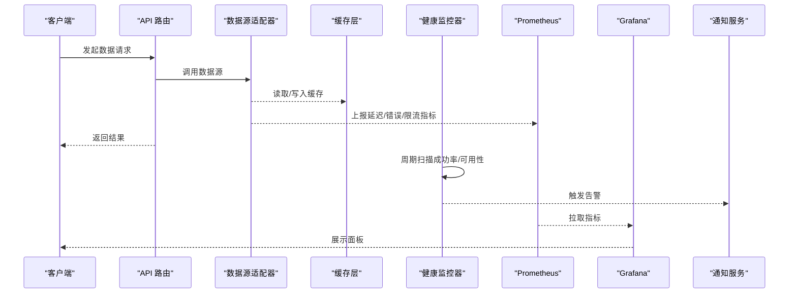
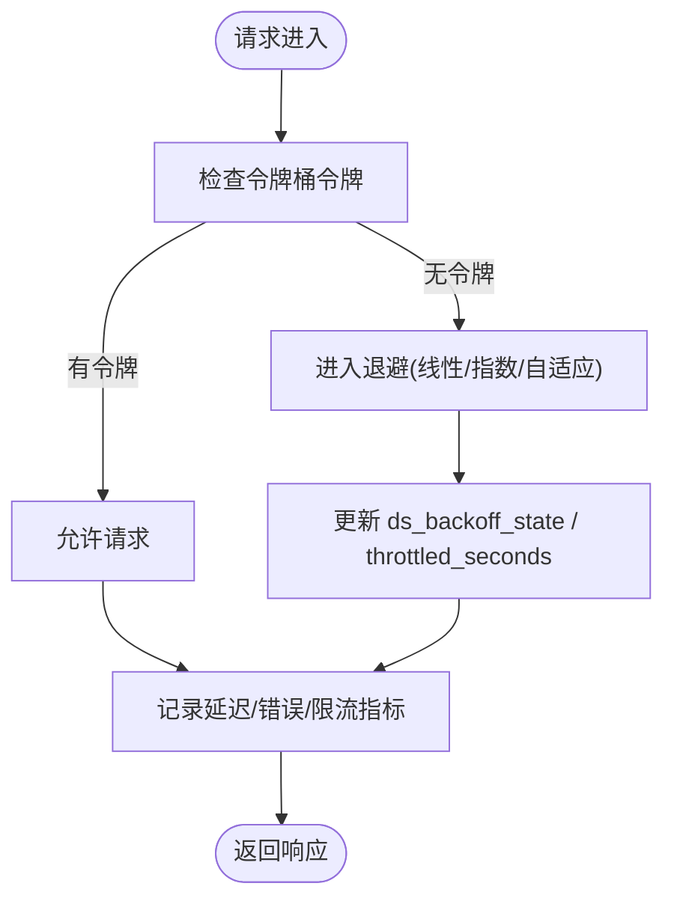
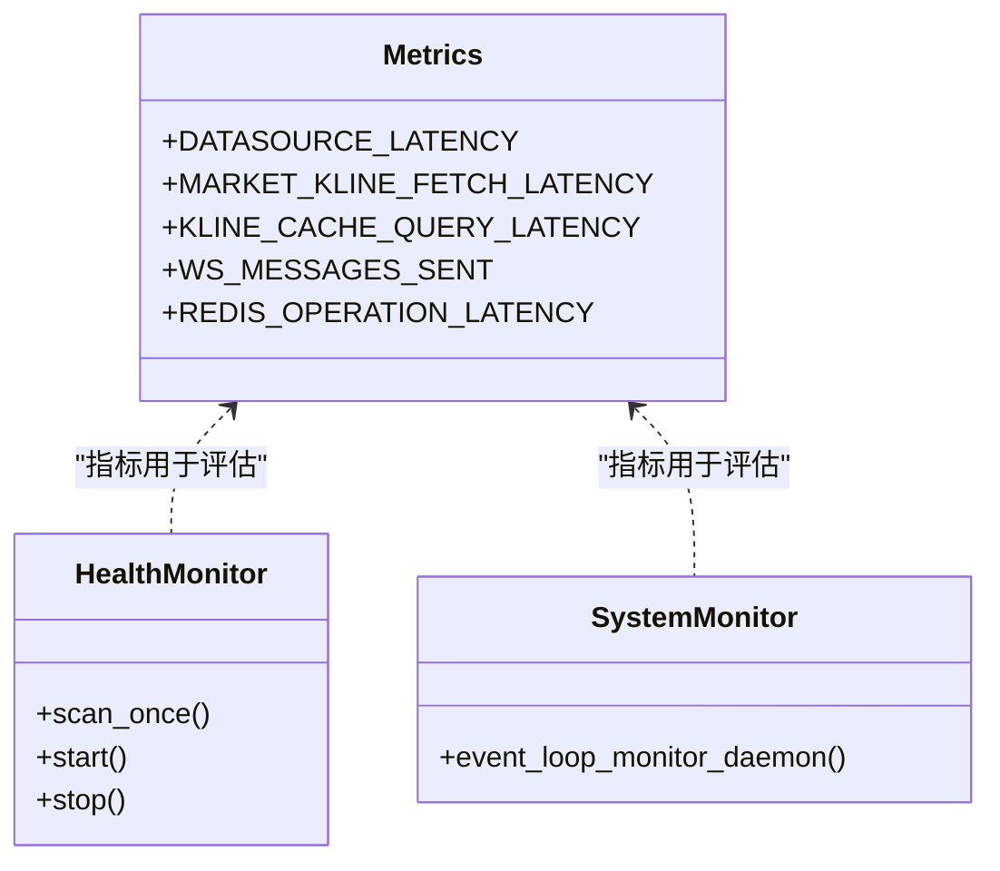
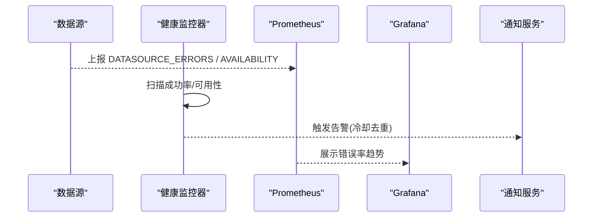
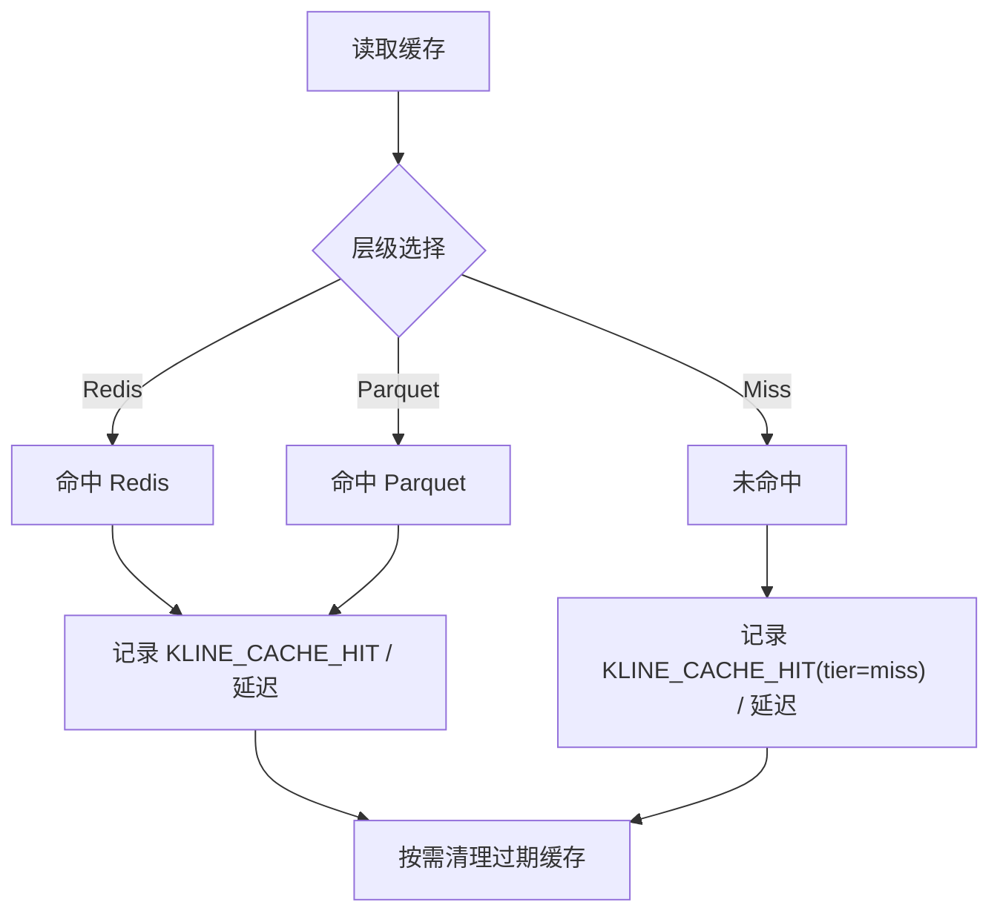
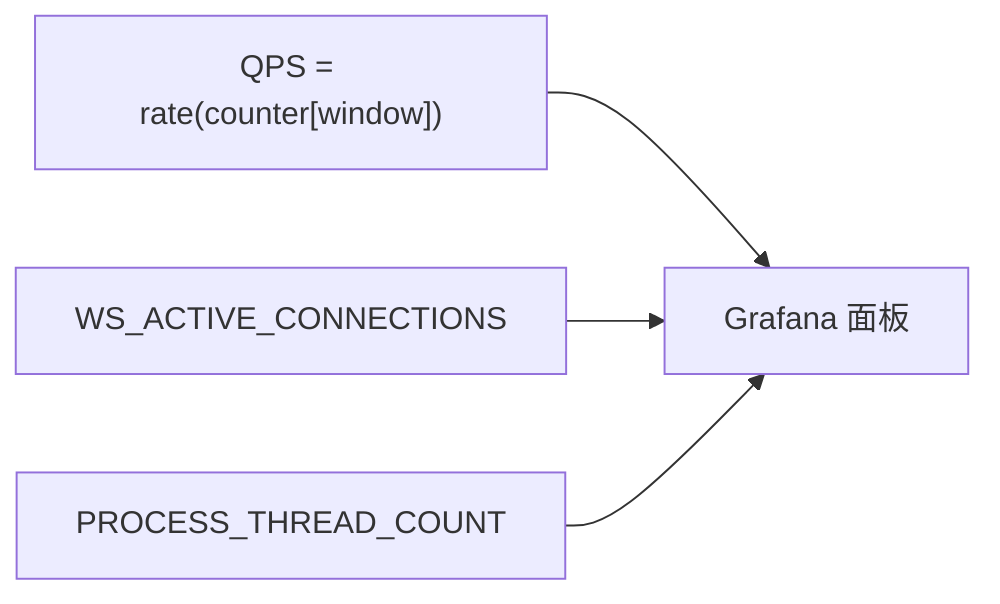
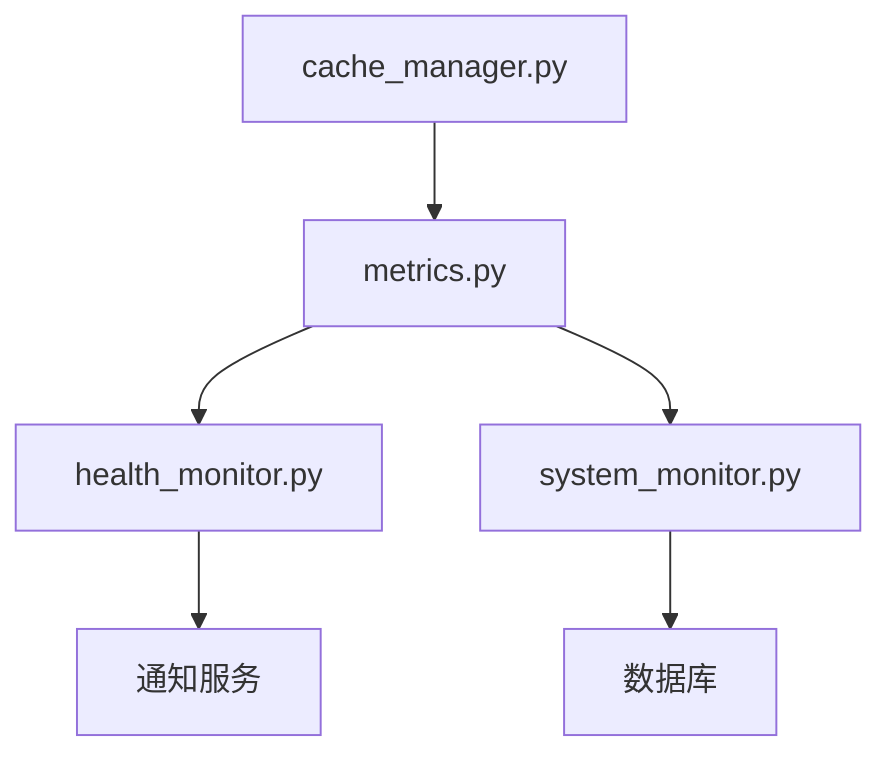

# 性能监控与优化

<cite>
**本文引用的文件**
- [metrics.py](file://backend/core/metrics.py)
- [health_monitor.py](file://backend/services/datasource/health_monitor.py)
- [system_monitor.py](file://backend/workers/monitor/system_monitor.py)
- [cache_manager.py](file://backend/core/cache_manager.py)
- [performance.py](file://backend/domain/performance.py)
</cite>

## 目录
1. [简介](#简介)
2. [项目结构](#项目结构)
3. [核心组件](#核心组件)
4. [架构总览](#架构总览)
5. [详细组件分析](#详细组件分析)
6. [依赖关系分析](#依赖关系分析)
7. [性能考量](#性能考量)
8. [故障排查指南](#故障排查指南)
9. [结论](#结论)
10. [附录](#附录)

## 简介
本技术文档面向 Quant Agent 数据源性能监控与优化系统，聚焦以下目标：
- 限流器实现：令牌桶算法、滑动窗口限流、分布式限协调（指标与状态暴露）
- 延迟统计系统：请求耗时分析、P95/P99 延迟计算、性能瓶颈识别
- 错误率监控：错误分类统计、趋势分析、告警触发
- 缓存命中率监控：Redis 缓存效果、内存使用优化、热点数据识别
- 吞吐量监控：QPS 统计、并发连接数、资源利用率分析
- 性能调优指南：数据获取优化、超时配置、缓存策略调整
- 运维诊断工具与容量规划建议

## 项目结构
围绕性能监控与优化的关键代码集中在后端 core、services、workers 等模块：
- 指标定义与采集：backend/core/metrics.py
- 数据源健康监控与告警：backend/services/datasource/health_monitor.py
- 系统级事件循环阻塞监控：backend/workers/monitor/system_monitor.py
- 缓存清理与保护：backend/core/cache_manager.py
- 共享绩效指标库（回测/风控复用）：backend/domain/performance.py

图表来源
- [metrics.py:24-182](file://backend/core/metrics.py#L24-L182)
- [health_monitor.py:101-148](file://backend/services/datasource/health_monitor.py#L101-L148)
- [system_monitor.py:40-79](file://backend/workers/monitor/system_monitor.py#L40-L79)
- [cache_manager.py:47-74](file://backend/core/cache_manager.py#L47-L74)

章节来源
- [metrics.py:24-182](file://backend/core/metrics.py#L24-L182)
- [health_monitor.py:101-148](file://backend/services/datasource/health_monitor.py#L101-L148)
- [system_monitor.py:40-79](file://backend/workers/monitor/system_monitor.py#L40-L79)
- [cache_manager.py:47-74](file://backend/core/cache_manager.py#L47-L74)

## 核心组件
- 指标体系（Prometheus）：行情延迟、K线获取延迟、WebSocket 连接与消息、Redis 操作延迟与错误、熔断器状态、数据源延迟/错误/限流/可用性、主动拨测、Facade 融合、Agent/LLM 指标、Futu 连接、K线缓存命中、数据质量、分布式节点、Finnhub WS tick 缓存、FMP collector 业务编排指标、进程线程水位、网页抓取成功率。
- 健康监控：周期性扫描各数据源成功率与可达性，低于阈值或失联时触发告警，具备冷却去重。
- 系统监控：高频探测事件循环阻塞，超过阈值即告警并落盘性能日志。
- 缓存管理：按前缀安全清理业务缓存，保护交易态 key。
- 绩效指标库：Sharpe、最大回撤、年化收益、波动率、跟踪误差、胜率、信号一致率等纯函数。

章节来源
- [metrics.py:24-641](file://backend/core/metrics.py#L24-L641)
- [health_monitor.py:55-148](file://backend/services/datasource/health_monitor.py#L55-L148)
- [system_monitor.py:10-79](file://backend/workers/monitor/system_monitor.py#L10-L79)
- [cache_manager.py:19-74](file://backend/core/cache_manager.py#L19-L74)
- [performance.py:14-177](file://backend/domain/performance.py#L14-L177)

## 架构总览
系统通过“数据采集—指标聚合—可视化—告警”的链路实现端到端可观测性：
- 数据采集：在各数据源调用路径埋点，记录延迟、错误、限流、可用性、缓存命中等指标。
- 指标聚合：统一在 Prometheus 暴露，供 Grafana 拉取展示。
- 告警：健康监控器周期扫描，结合阈值与冷却机制，推送告警到通知服务。
- 系统监控：独立守护任务检测事件循环阻塞，避免主线程被同步代码卡死。

图表来源
- [metrics.py:156-182](file://backend/core/metrics.py#L156-L182)
- [health_monitor.py:101-148](file://backend/services/datasource/health_monitor.py#L101-L148)
- [system_monitor.py:40-79](file://backend/workers/monitor/system_monitor.py#L40-L79)

## 详细组件分析

### 限流器实现（令牌桶、滑动窗口、分布式协调）
- 令牌桶与滑动窗口：通过数据源限流计数器与退避状态指标暴露当前限流情况与估计 RPM，支持线性/指数/自适应退避策略。
- 分布式限协调：通过 Redis 队列深度、节点心跳、YF/AKShare 降级计数等指标反映跨节点限流与降级行为。
- 关键指标：
  - 限流触发次数：ds_rate_limit_total
  - 当前退避剩余秒数：ds_rate_limit_throttled_seconds
  - 估计/有效 RPM：ds_rate_limit_estimated_rpm / ds_rate_limit_effective_rpm
  - 退避策略状态：ds_backoff_state
  - 队列深度：quant_redis_queue_depth
  - 节点存活与心跳：quant_dist_node_alive_count / quant_dist_node_heartbeat_timestamp

图表来源
- [metrics.py:326-354](file://backend/core/metrics.py#L326-L354)
- [metrics.py:78-88](file://backend/core/metrics.py#L78-L88)

章节来源
- [metrics.py:326-354](file://backend/core/metrics.py#L326-L354)
- [metrics.py:78-88](file://backend/core/metrics.py#L78-L88)

### 延迟统计系统（请求耗时、P95/P99、瓶颈识别）
- 延迟分布：使用 Summary/Histogram 记录不同维度（数据源、动作、缓存层级）的延迟分布，便于计算 P95/P99。
- 关键指标：
  - 数据源延迟：quant_datasource_latency_milliseconds
  - K线获取延迟：quant_market_kline_fetch_seconds
  - K线查询延迟：quant_kline_cache_query_seconds
  - WebSocket 消息发送/丢弃：quant_ws_messages_sent_total / quant_ws_messages_dropped_total
  - Redis 操作延迟：quant_redis_operation_latency_seconds
- 瓶颈识别：结合队列深度、连接数、错误率、缓存命中率进行综合定位。

图表来源
- [metrics.py:42-88](file://backend/core/metrics.py#L42-L88)
- [metrics.py:156-182](file://backend/core/metrics.py#L156-L182)
- [health_monitor.py:101-148](file://backend/services/datasource/health_monitor.py#L101-L148)
- [system_monitor.py:40-79](file://backend/workers/monitor/system_monitor.py#L40-L79)

章节来源
- [metrics.py:42-88](file://backend/core/metrics.py#L42-L88)
- [metrics.py:156-182](file://backend/core/metrics.py#L156-L182)
- [health_monitor.py:101-148](file://backend/services/datasource/health_monitor.py#L101-L148)
- [system_monitor.py:40-79](file://backend/workers/monitor/system_monitor.py#L40-L79)

### 错误率监控系统（分类统计、趋势分析、告警触发）
- 错误分类：按数据源与错误类型（rate_limit、timeout、network、circuit_open 等）计数。
- 趋势分析：通过 increase(rate(...)) 观察错误率变化趋势，结合可用性 Gauge 判断整体健康度。
- 告警触发：健康监控器在成功率低于阈值且样本足够时触发告警，具备冷却去重。

图表来源
- [metrics.py:164-182](file://backend/core/metrics.py#L164-L182)
- [health_monitor.py:101-148](file://backend/services/datasource/health_monitor.py#L101-L148)

章节来源
- [metrics.py:164-182](file://backend/core/metrics.py#L164-L182)
- [health_monitor.py:101-148](file://backend/services/datasource/health_monitor.py#L101-L148)

### 缓存命中率监控（Redis 效果、内存优化、热点识别）
- 命中率与延迟：K线缓存命中次数与查询延迟，区分 Redis/Parquet/未命中层级。
- 内存优化：通过缓存清理工具按前缀安全删除业务缓存，保护交易态 key。
- 热点识别：结合高 QPS 与低延迟的 key 识别热点，优先保障其缓存命中。

图表来源
- [metrics.py:290-301](file://backend/core/metrics.py#L290-L301)
- [cache_manager.py:47-74](file://backend/core/cache_manager.py#L47-L74)

章节来源
- [metrics.py:290-301](file://backend/core/metrics.py#L290-L301)
- [cache_manager.py:47-74](file://backend/core/cache_manager.py#L47-L74)

### 吞吐量监控（QPS、并发连接、资源利用率）
- QPS：通过 Counter 累计请求量，结合时间窗口计算 QPS。
- 并发连接：WebSocket 活跃连接数 Gauge。
- 资源利用率：进程线程数 Gauge，配合阈值告警。

图表来源
- [metrics.py:53-72](file://backend/core/metrics.py#L53-L72)
- [metrics.py:601-619](file://backend/core/metrics.py#L601-L619)

章节来源
- [metrics.py:53-72](file://backend/core/metrics.py#L53-L72)
- [metrics.py:601-619](file://backend/core/metrics.py#L601-L619)

### 性能调优指南
- 数据获取优化：
  - 优先命中缓存（Redis/Parquet），减少远端调用。
  - 合理设置超时参数，避免长尾请求拖慢整体吞吐。
- 缓存策略调整：
  - 针对热点数据提高 TTL 或预热。
  - 定期清理过期缓存，释放内存。
- 限流与退避：
  - 根据 ds_rate_limit_estimated_rpm 动态调整并发与重试间隔。
  - 启用自适应退避，降低 429/配额耗尽影响。
- 资源利用：
  - 监控进程线程数，避免线程耗尽导致服务不可用。
  - 关注 WebSocket 连接数与消息丢弃，必要时扩容或限速。

章节来源
- [metrics.py:326-354](file://backend/core/metrics.py#L326-L354)
- [metrics.py:601-619](file://backend/core/metrics.py#L601-L619)
- [cache_manager.py:47-74](file://backend/core/cache_manager.py#L47-L74)

### 运维诊断工具与容量规划建议
- 诊断工具：
  - 健康监控器：成功率与可用性扫描，冷却去重，避免告警风暴。
  - 系统监控：事件循环阻塞检测，及时告警并落盘性能日志。
- 容量规划：
  - 基于 QPS、延迟分布、错误率趋势预估资源需求。
  - 关注 Redis 队列深度与 WebSocket 连接数，提前扩容。
  - 结合进程线程数与节点存活情况，评估多副本并行能力。

章节来源
- [health_monitor.py:101-148](file://backend/services/datasource/health_monitor.py#L101-L148)
- [system_monitor.py:40-79](file://backend/workers/monitor/system_monitor.py#L40-L79)
- [metrics.py:78-88](file://backend/core/metrics.py#L78-L88)
- [metrics.py:450-478](file://backend/core/metrics.py#L450-L478)

## 依赖关系分析
- 指标与监控：
  - metrics.py 提供统一的指标定义，被数据源、缓存、WebSocket、系统监控等模块引用。
  - health_monitor.py 依赖 call_metrics_store 与 datasource_registry 进行健康扫描。
  - system_monitor.py 依赖数据库会话与通知服务进行性能日志与告警。
- 缓存与清理：
  - cache_manager.py 依赖 redis_client 进行安全清理，保护交易态 key。

图表来源
- [metrics.py:24-641](file://backend/core/metrics.py#L24-L641)
- [health_monitor.py:101-148](file://backend/services/datasource/health_monitor.py#L101-L148)
- [system_monitor.py:40-79](file://backend/workers/monitor/system_monitor.py#L40-L79)
- [cache_manager.py:47-74](file://backend/core/cache_manager.py#L47-L74)

章节来源
- [metrics.py:24-641](file://backend/core/metrics.py#L24-L641)
- [health_monitor.py:101-148](file://backend/services/datasource/health_monitor.py#L101-L148)
- [system_monitor.py:40-79](file://backend/workers/monitor/system_monitor.py#L40-L79)
- [cache_manager.py:47-74](file://backend/core/cache_manager.py#L47-L74)

## 性能考量
- 延迟分位数：使用 Histogram/Summary 记录延迟分布，便于计算 P95/P99。
- 错误率趋势：通过 Counter 累计错误，结合时间窗口观察趋势。
- 缓存命中率：区分层级命中，优化热点数据缓存策略。
- 资源利用：监控线程数与连接数，避免资源耗尽。
- 限流与退避：根据估计 RPM 与实际 RPM 调整并发与重试策略。

## 故障排查指南
- 数据源不可用：
  - 检查 DATASOURCE_AVAILABILITY 与 DATASOURCE_PROBE_SUCCESS。
  - 查看健康监控器是否触发告警。
- 高延迟：
  - 分析 DATASOURCE_LATENCY 与 KLINE_CACHE_QUERY_LATENCY。
  - 检查 Redis 队列深度与 WebSocket 消息丢弃。
- 限流频繁：
  - 查看 ds_rate_limit_total 与 ds_backoff_state。
  - 调整并发与重试间隔，启用自适应退避。
- 事件循环阻塞：
  - 关注 system_monitor 的阻塞检测与告警。
  - 检查是否有同步代码阻塞主事件循环。

章节来源
- [metrics.py:156-182](file://backend/core/metrics.py#L156-L182)
- [metrics.py:78-88](file://backend/core/metrics.py#L78-L88)
- [metrics.py:326-354](file://backend/core/metrics.py#L326-L354)
- [system_monitor.py:40-79](file://backend/workers/monitor/system_monitor.py#L40-L79)

## 结论
Quant Agent 数据源性能监控与优化系统通过统一的指标体系、健康监控、系统监控与缓存管理，实现了端到端的可观测性与稳定性保障。结合限流、延迟统计、错误率监控、缓存命中率与吞吐量监控，为性能调优与容量规划提供了坚实基础。

## 附录
- 共享绩效指标库：提供 Sharpe、最大回撤、年化收益、波动率、跟踪误差、胜率、信号一致率等纯函数，供回测与风控模块复用。

章节来源
- [performance.py:14-177](file://backend/domain/performance.py#L14-L177)
