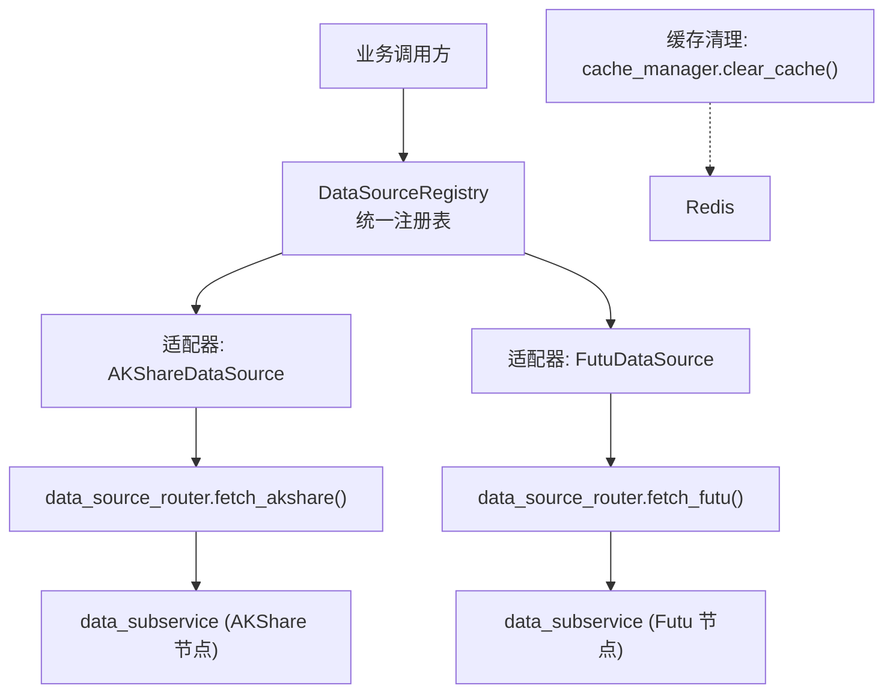
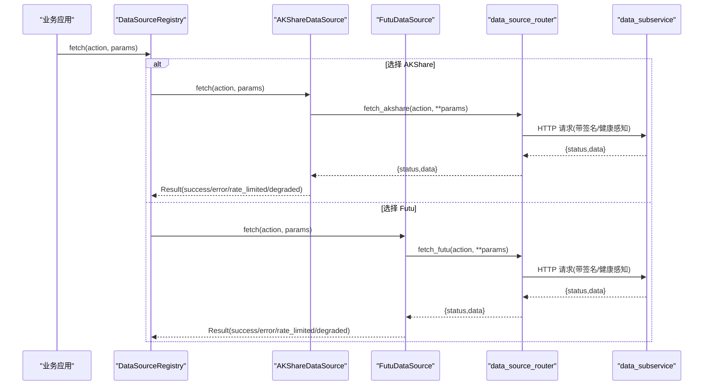
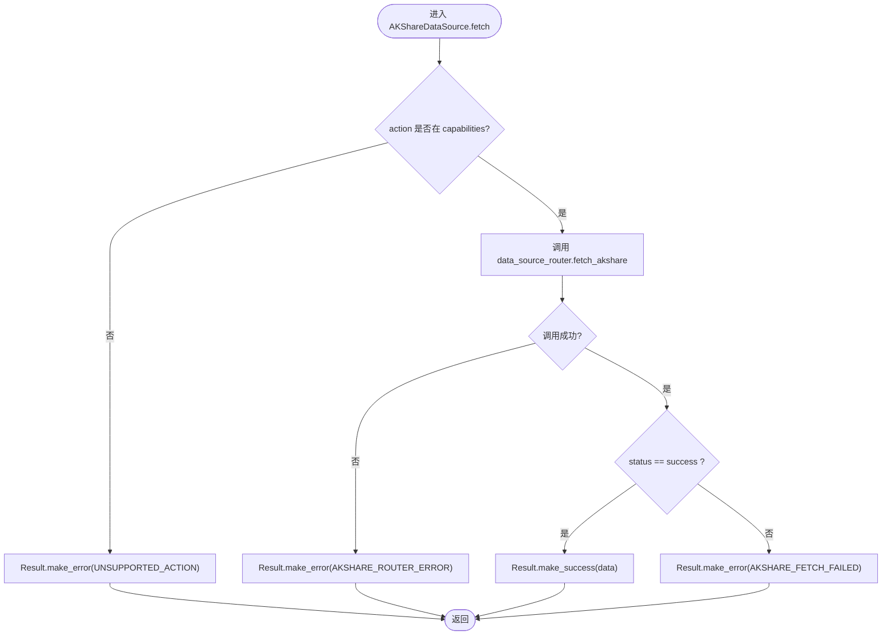
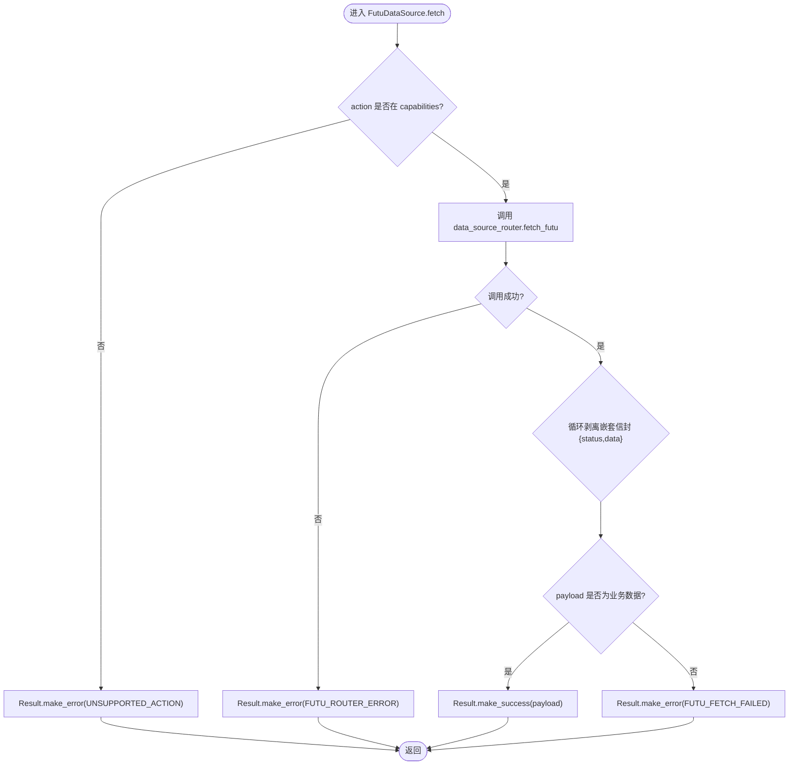
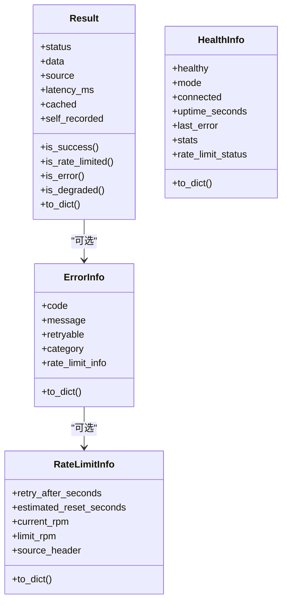
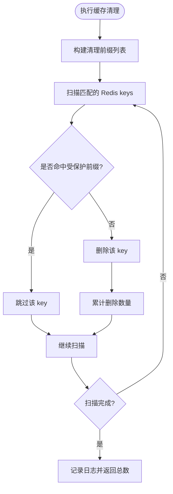
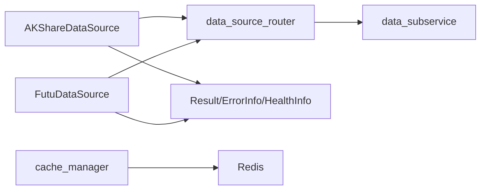

# 数据标准化处理

<cite>
**本文引用的文件**
- [backend/services/datasource/protocol.py](file://backend/services/datasource/protocol.py)
- [backend/services/datasource/__init__.py](file://backend/services/datasource/__init__.py)
- [backend/services/datasource/adapters/akshare.py](file://backend/services/datasource/adapters/akshare.py)
- [backend/services/datasource/adapters/futu.py](file://backend/services/datasource/adapters/futu.py)
- [backend/core/cache_manager.py](file://backend/core/cache_manager.py)
</cite>

## 目录
1. [简介](#简介)
2. [项目结构](#项目结构)
3. [核心组件](#核心组件)
4. [架构总览](#架构总览)
5. [详细组件分析](#详细组件分析)
6. [依赖关系分析](#依赖关系分析)
7. [性能考量](#性能考量)
8. [故障排查指南](#故障排查指南)
9. [结论](#结论)
10. [附录](#附录)

## 简介
本技术文档面向 Quant Agent 的数据标准化处理系统，聚焦多数据源（AKShare、Futu 等）的统一接入、字段映射与类型转换、时间戳标准化、数据质量校验、响应归一化、缓存策略、版本兼容与迁移、以及数据源适配器开发指南。文档以代码级事实为依据，提供可操作的流程图、时序图与架构图，帮助数据工程师快速理解并扩展系统能力。

## 项目结构
本项目采用“统一协议 + 适配器 + 路由”的分层设计：
- 统一协议：DataSourceInterface 定义所有数据源必须实现的接口，确保上层调用一致。
- 适配器：各数据源通过适配器实现 DataSourceInterface，将外部差异转换为内部统一 Result/ErrorInfo/HealthInfo。
- 路由与注册：通过 DataSourceRegistry 管理数据源实例；Router 负责远程节点发现与健康感知。
- 缓存与清理：统一的 Redis 缓存清理工具，保护交易态数据不被误删。

图表来源
- [backend/services/datasource/protocol.py:12-46](file://backend/services/datasource/protocol.py#L12-L46)
- [backend/services/datasource/adapters/akshare.py:25-143](file://backend/services/datasource/adapters/akshare.py#L25-L143)
- [backend/services/datasource/adapters/futu.py:34-199](file://backend/services/datasource/adapters/futu.py#L34-L199)
- [backend/core/cache_manager.py:47-74](file://backend/core/cache_manager.py#L47-L74)

章节来源
- [backend/services/datasource/protocol.py:12-46](file://backend/services/datasource/protocol.py#L12-L46)
- [backend/services/datasource/adapters/akshare.py:25-143](file://backend/services/datasource/adapters/akshare.py#L25-L143)
- [backend/services/datasource/adapters/futu.py:34-199](file://backend/services/datasource/adapters/futu.py#L34-L199)
- [backend/core/cache_manager.py:47-74](file://backend/core/cache_manager.py#L47-L74)

## 核心组件
- 统一协议 DataSourceInterface：强制所有数据源暴露 name/version/capabilities/mode/is_available/health/fetch 等能力，屏蔽底层差异。
- 统一返回模型 Result/ErrorInfo/RateLimitInfo/HealthInfo：规范成功、错误、限流、降级状态及错误分类，便于上层统一处理。
- 适配器 AKShareDataSource/FutuDataSource：将远端服务封装为统一接口，负责 action 校验、远程调用、信封剥离、错误分类与限流识别。
- 缓存清理 cache_manager：集中清理业务缓存，保护交易态 key，避免误删导致的状态丢失。

章节来源
- [backend/services/datasource/protocol.py:12-46](file://backend/services/datasource/protocol.py#L12-L46)
- [backend/services/datasource/__init__.py:23-411](file://backend/services/datasource/__init__.py#L23-L411)
- [backend/services/datasource/adapters/akshare.py:25-143](file://backend/services/datasource/adapters/akshare.py#L25-L143)
- [backend/services/datasource/adapters/futu.py:34-199](file://backend/services/datasource/adapters/futu.py#L34-L199)
- [backend/core/cache_manager.py:47-74](file://backend/core/cache_manager.py#L47-L74)

## 架构总览
下图展示从业务调用到数据源适配器的完整链路，包括统一协议、适配器、路由与子服务交互，以及健康检查与限流处理。

图表来源
- [backend/services/datasource/adapters/akshare.py:98-129](file://backend/services/datasource/adapters/akshare.py#L98-L129)
- [backend/services/datasource/adapters/futu.py:130-180](file://backend/services/datasource/adapters/futu.py#L130-L180)
- [backend/services/datasource/protocol.py:12-46](file://backend/services/datasource/protocol.py#L12-L46)

## 详细组件分析

### 数据源适配器：AKShare
- 职责：声明 capabilities（行情、历史、资金流、新闻、宏观日历等），仅远程模式，不持有本地 SDK；通过 router 调用 data_subservice。
- 流程要点：
  - action 白名单校验，不支持直接返回错误。
  - 调用 router.fetch_akshare，捕获异常并包装为 Result.make_error。
  - 解析子服务返回信封，成功时提取 data 构造 Result.make_success。
  - 失败时根据 message 判断是否限流或普通错误。
- 健康信息：返回 mode=remote、connected、uptime_seconds、error_count 等诊断信息。

图表来源
- [backend/services/datasource/adapters/akshare.py:98-129](file://backend/services/datasource/adapters/akshare.py#L98-L129)

章节来源
- [backend/services/datasource/adapters/akshare.py:25-143](file://backend/services/datasource/adapters/akshare.py#L25-L143)

### 数据源适配器：Futu
- 职责：声明 capabilities（行情、历史、期权链、基本面、卖空、板块资金流等），仅远程模式；通过 router 调用 data_subservice。
- 流程要点：
  - action 白名单校验，不支持直接返回错误。
  - 调用 router.fetch_futu，捕获异常并包装为 Result.make_error。
  - 循环剥离嵌套信封 {status,data}，直到 payload 不再是该结构，再构造 Result.make_success。
  - 识别限流关键词（如 429、限流、Too Many 等），返回 Result.make_rate_limited；否则返回普通错误。
- 健康信息：返回 mode=remote、connected、uptime_seconds、error_count 等诊断信息。

图表来源
- [backend/services/datasource/adapters/futu.py:130-180](file://backend/services/datasource/adapters/futu.py#L130-L180)

章节来源
- [backend/services/datasource/adapters/futu.py:34-199](file://backend/services/datasource/adapters/futu.py#L34-L199)

### 统一返回结构与错误分类
- Result：统一封装 status(data/success/error/rate_limited/degraded)、data、source、latency_ms、cached、self_recorded、error。
- ErrorInfo：包含 code、message、retryable、category（normal/rate_limit/quota_exhausted/ip_blocked/data_unavailable）、rate_limit_info。
- RateLimitInfo：记录 retry_after_seconds、estimated_reset_seconds、current_rpm、limit_rpm、source_header。
- HealthInfo：healthy、mode、connected、uptime_seconds、last_error、stats、rate_limit_status。
- classify_http_error：根据 HTTP 状态码与响应头推断错误分类（429→rate_limit 或 quota_exhausted；403+特定头→ip_blocked）。

图表来源
- [backend/services/datasource/__init__.py:23-411](file://backend/services/datasource/__init__.py#L23-L411)

章节来源
- [backend/services/datasource/__init__.py:23-411](file://backend/services/datasource/__init__.py#L23-L411)

### 数据质量校验机制
- 完整性检查：在适配器层对 action 进行白名单校验，缺失或不支持的 action 直接返回错误，避免下游处理不完整数据。
- 一致性验证：通过统一 Result/ErrorInfo 结构保证不同数据源的返回格式一致；适配器在返回前对信封进行解包，确保上层拿到的是业务数据而非嵌套结构。
- 异常值检测：结合 classify_http_error 与限流关键词识别，区分限流、配额耗尽、IP 封禁与普通错误，触发相应退避或熔断策略。

章节来源
- [backend/services/datasource/adapters/akshare.py:98-129](file://backend/services/datasource/adapters/akshare.py#L98-L129)
- [backend/services/datasource/adapters/futu.py:130-180](file://backend/services/datasource/adapters/futu.py#L130-L180)
- [backend/services/datasource/__init__.py:379-411](file://backend/services/datasource/__init__.py#L379-L411)

### 响应归一化处理
- 统一数据结构：所有适配器返回 Result，包含 status、data、source、latency_ms、cached、error 等字段，便于上层统一消费。
- 错误信息标准化：ErrorInfo.code/message/retryable/category 明确错误性质与重试策略；RateLimitInfo 提供限流细节。
- 状态码映射：classify_http_error 将 HTTP 状态码映射为 ErrorCategory，限流类错误不计入熔断器失败计数，避免误杀节点。

章节来源
- [backend/services/datasource/__init__.py:218-411](file://backend/services/datasource/__init__.py#L218-L411)

### 数据缓存策略
- 热点数据缓存：通过 Redis 存储行情、K线、新闻、宏观、insider 等业务缓存，提升读取性能。
- 失效时间管理：由上游写入时设置 TTL；清理时使用 scan 模式匹配前缀批量删除。
- 内存优化：受保护前缀（OMS 相关）绝对跳过，防止误删交易态数据；默认清理前缀限定业务缓存范围。

图表来源
- [backend/core/cache_manager.py:47-74](file://backend/core/cache_manager.py#L47-L74)

章节来源
- [backend/core/cache_manager.py:19-74](file://backend/core/cache_manager.py#L19-L74)

### 数据版本兼容性与迁移
- 版本标识：适配器暴露 version 属性，便于上层按版本路由或灰度发布。
- 向后兼容：适配器注册函数 ensure_*_registered 幂等注册，避免重复初始化；旧版调用路径仍可正常工作。
- 迁移工具：可通过统一清理工具 clear_cache 安全刷新缓存，配合版本升级逐步迁移数据格式。

章节来源
- [backend/services/datasource/adapters/akshare.py:132-143](file://backend/services/datasource/adapters/akshare.py#L132-L143)
- [backend/services/datasource/adapters/futu.py:183-199](file://backend/services/datasource/adapters/futu.py#L183-L199)
- [backend/core/cache_manager.py:47-74](file://backend/core/cache_manager.py#L47-L74)

### 数据源适配器开发指南
- 实现步骤：
  - 实现 DataSourceInterface：提供 name、version、capabilities、mode、is_available、health、fetch。
  - 声明 capabilities：列出支持的动作（如 QUOTE、HISTORY、FUND_FLOW 等），用于 action 白名单校验。
  - 实现 fetch：校验 action、调用远端服务、解析信封、构造 Result（success/error/rate_limited/degraded）。
  - 注册适配器：使用 ensure_*_registered 幂等注册到 DataSourceRegistry。
- 数据契约：
  - 输入：action（字符串）、params（键值对）。
  - 输出：Result（统一结构），包含 status、data、source、latency_ms、cached、error。
- 格式转换逻辑：
  - 信封剥离：循环去除 {status,data} 结构，直到得到业务数据。
  - 错误分类：根据 HTTP 状态码与响应头推断 ErrorCategory，区分限流与普通错误。
  - 限流识别：识别关键词（如 429、限流、Too Many 等），返回 rate_limited 状态。

章节来源
- [backend/services/datasource/protocol.py:12-46](file://backend/services/datasource/protocol.py#L12-L46)
- [backend/services/datasource/adapters/akshare.py:25-143](file://backend/services/datasource/adapters/akshare.py#L25-L143)
- [backend/services/datasource/adapters/futu.py:34-199](file://backend/services/datasource/adapters/futu.py#L34-L199)
- [backend/services/datasource/__init__.py:379-411](file://backend/services/datasource/__init__.py#L379-L411)

## 依赖关系分析
- 适配器依赖 Router：AKShareDataSource/FutuDataSource 通过 data_source_router 调用 data_subservice，解耦本地 SDK 与远端服务。
- 统一模型依赖：Result/ErrorInfo/HealthInfo 被所有适配器复用，确保返回结构一致。
- 缓存依赖：cache_manager 依赖 Redis 客户端，提供安全的缓存清理能力。

图表来源
- [backend/services/datasource/adapters/akshare.py:98-129](file://backend/services/datasource/adapters/akshare.py#L98-L129)
- [backend/services/datasource/adapters/futu.py:130-180](file://backend/services/datasource/adapters/futu.py#L130-L180)
- [backend/core/cache_manager.py:47-74](file://backend/core/cache_manager.py#L47-L74)

章节来源
- [backend/services/datasource/adapters/akshare.py:98-129](file://backend/services/datasource/adapters/akshare.py#L98-L129)
- [backend/services/datasource/adapters/futu.py:130-180](file://backend/services/datasource/adapters/futu.py#L130-L180)
- [backend/core/cache_manager.py:47-74](file://backend/core/cache_manager.py#L47-L74)

## 性能考量
- 仅远程模式：适配器不持有本地 SDK，减少进程内资源占用，依赖 Router 的健康感知与熔断机制。
- 信封剥离优化：Futu 适配器循环剥离嵌套信封，避免上层解析崩溃，提升稳定性。
- 缓存清理安全：受保护前缀机制避免误删交易态数据，保障实盘稳定性。
- 限流识别：准确识别限流类错误，触发独立退避机制，避免误伤熔断器。

[本节为通用性能建议，无需具体文件引用]

## 故障排查指南
- 常见错误：
  - UNSUPPORTED_ACTION：action 不在 capabilities 白名单中，需检查适配器声明。
  - ROUTER_ERROR：调用 data_source_router 失败，检查远端节点健康与网络连通性。
  - FETCH_FAILED：远端返回非 success 状态，检查 message 与限流关键词。
- 健康检查：
  - 使用 health() 获取 mode、connected、uptime_seconds、error_count 等诊断信息。
  - 关注 rate_limit_status 中的 is_throttled、consecutive_rate_limits、total_rate_limits_1h 等指标。
- 缓存问题：
  - 使用 clear_cache() 清理业务缓存，注意受保护前缀不会被删除。
  - 若出现数据不一致，检查上游写入 TTL 与清理策略。

章节来源
- [backend/services/datasource/adapters/akshare.py:98-129](file://backend/services/datasource/adapters/akshare.py#L98-L129)
- [backend/services/datasource/adapters/futu.py:130-180](file://backend/services/datasource/adapters/futu.py#L130-L180)
- [backend/core/cache_manager.py:47-74](file://backend/core/cache_manager.py#L47-L74)

## 结论
Quant Agent 的数据标准化处理系统通过统一协议、适配器与路由实现了多数据源的无缝接入与归一化输出。Result/ErrorInfo/HealthInfo 提供了标准化的响应与错误处理机制，结合缓存清理与限流识别，保障了系统的稳定性与可扩展性。数据源适配器开发指南为新增数据源提供了清晰的实现路径，便于持续扩展生态。

[本节为总结性内容，无需具体文件引用]

## 附录
- 术语表：
  - 适配器：将外部数据源封装为统一接口的组件。
  - 信封：{status,data} 结构的响应包裹。
  - 限流：服务端限制请求频率的机制。
  - 熔断：当错误率过高时暂时停止调用的保护机制。
- 参考路径：
  - 统一协议：[backend/services/datasource/protocol.py](file://backend/services/datasource/protocol.py)
  - 统一模型：[backend/services/datasource/__init__.py](file://backend/services/datasource/__init__.py)
  - AKShare 适配器：[backend/services/datasource/adapters/akshare.py](file://backend/services/datasource/adapters/akshare.py)
  - Futu 适配器：[backend/services/datasource/adapters/futu.py](file://backend/services/datasource/adapters/futu.py)
  - 缓存清理：[backend/core/cache_manager.py](file://backend/core/cache_manager.py)

[本节为补充信息，无需具体文件引用]