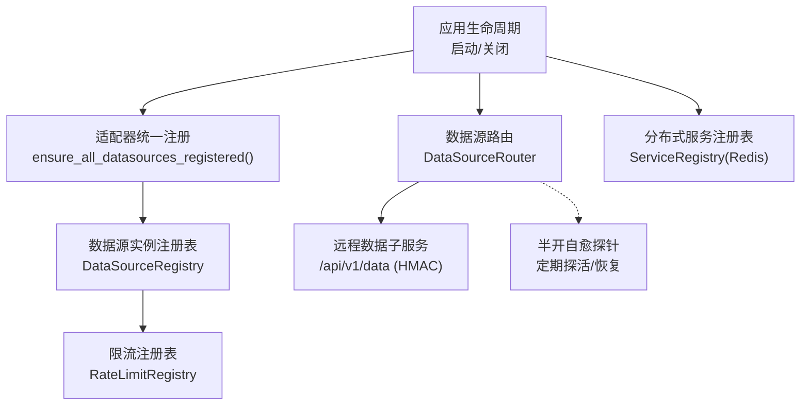
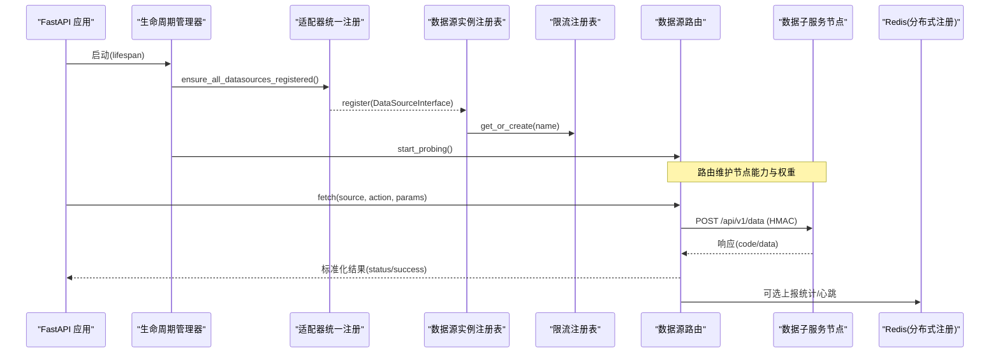
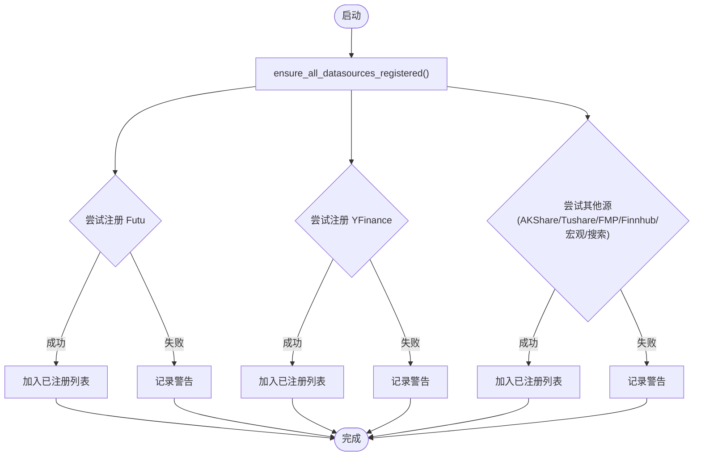
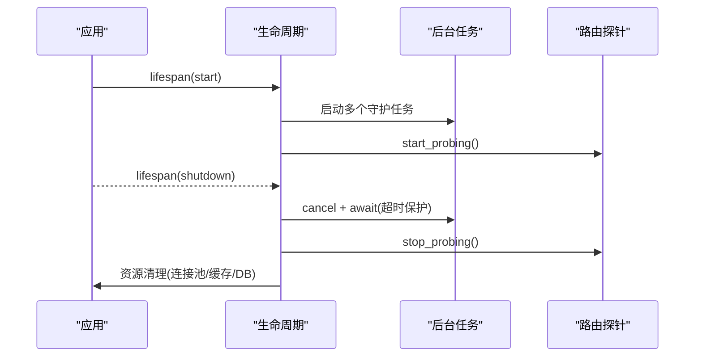
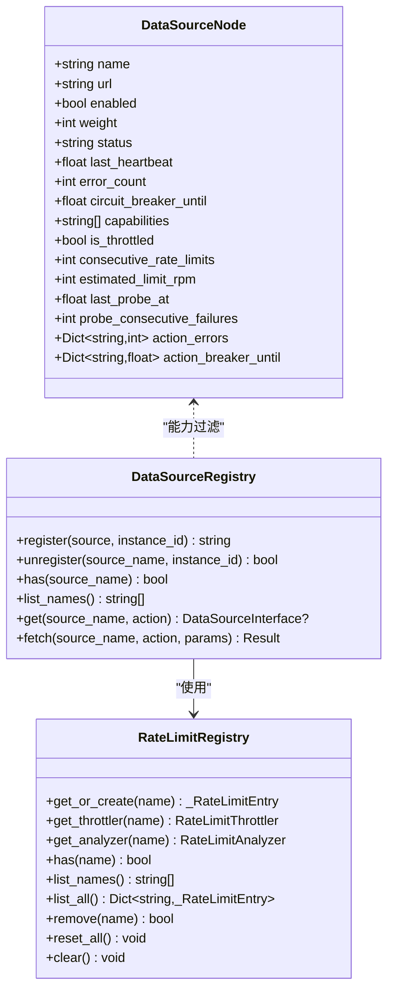
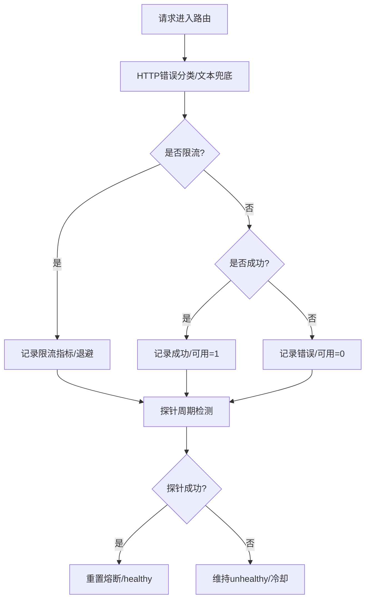
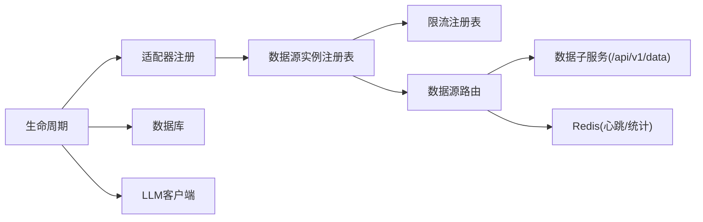

# 数据源注册管理

<cite>
**本文引用的文件**
- [backend/bootstrap/lifecycle.py](file://backend/bootstrap/lifecycle.py)
- [backend/services/datasource/adapters/__init__.py](file://backend/services/datasource/adapters/__init__.py)
- [backend/services/datasource/source_registry.py](file://backend/services/datasource/source_registry.py)
- [backend/services/datasource/registry.py](file://backend/services/datasource/registry.py)
- [backend/services/datasource/router.py](file://backend/services/datasource/router.py)
- [backend/core/service_registry.py](file://backend/core/service_registry.py)
</cite>

## 目录
1. [简介](#简介)
2. [项目结构](#项目结构)
3. [核心组件](#核心组件)
4. [架构总览](#架构总览)
5. [详细组件分析](#详细组件分析)
6. [依赖关系分析](#依赖关系分析)
7. [性能与可用性](#性能与可用性)
8. [故障排查指南](#故障排查指南)
9. [结论](#结论)
10. [附录：扩展开发指南](#附录：扩展开发指南)

## 简介
本技术文档面向 Quant Agent 的数据源注册管理系统，系统性阐述数据源的自动发现与动态加载、能力声明与版本兼容、生命周期管理（启动初始化、运行时更新、优雅关闭）、配置管理（环境变量与热重载）、能力注册表（功能声明、依赖关系、兼容性检查），以及健康监控（健康检查、性能指标、错误统计）。同时提供扩展开发指南与系统集成规范，帮助开发者快速接入新数据源并遵循最佳实践。

## 项目结构
系统采用“主服务 + 数据子服务”的分布式架构：
- 主服务负责编排、路由、限流、熔断、监控与告警；
- 数据子服务承载具体第三方连接层（如 yfinance、futu、finnhub、fmp、宏观源等）；
- 通过统一 HTTP 契约与 HMAC 签名进行节点间通信；
- 使用 Redis 实现分布式服务注册与心跳；
- 通过全局注册表完成数据源实例与限流状态的集中管理。

**图表来源**
- [backend/bootstrap/lifecycle.py:67-75](file://backend/bootstrap/lifecycle.py#L67-L75)
- [backend/services/datasource/adapters/__init__.py:14-101](file://backend/services/datasource/adapters/__init__.py#L14-L101)
- [backend/services/datasource/source_registry.py:41-73](file://backend/services/datasource/source_registry.py#L41-L73)
- [backend/services/datasource/registry.py:29-100](file://backend/services/datasource/registry.py#L29-L100)
- [backend/services/datasource/router.py:249-289](file://backend/services/datasource/router.py#L249-L289)
- [backend/core/service_registry.py:69-82](file://backend/core/service_registry.py#L69-L82)

**章节来源**
- [backend/bootstrap/lifecycle.py:42-151](file://backend/bootstrap/lifecycle.py#L42-L151)
- [backend/services/datasource/adapters/__init__.py:1-102](file://backend/services/datasource/adapters/__init__.py#L1-L102)
- [backend/services/datasource/router.py:1-30](file://backend/services/datasource/router.py#L1-L30)

## 核心组件
- 应用生命周期管理器：负责启动阶段的数据源适配器统一注册、后台任务拉起与关闭阶段的优雅停止。
- 数据源实例注册表：维护 DataSourceInterface 实例，支持按名称与能力检索，封装 fetch 路径（限流→熔断→调用→指标记录）。
- 限流注册表：为每个数据源维护 Throttler 与 Analyzer，统一管理退避与频率分析。
- 数据源路由：维护多节点拓扑，基于能力与权重选择节点，执行 HMAC 签名请求，处理错误分类、熔断隔离与半开自愈。
- 分布式服务注册表：基于 Redis 的节点注册、心跳、发现、优雅下线与集群总览。

**章节来源**
- [backend/bootstrap/lifecycle.py:67-151](file://backend/bootstrap/lifecycle.py#L67-L151)
- [backend/services/datasource/source_registry.py:41-259](file://backend/services/datasource/source_registry.py#L41-L259)
- [backend/services/datasource/registry.py:29-100](file://backend/services/datasource/registry.py#L29-L100)
- [backend/services/datasource/router.py:249-800](file://backend/services/datasource/router.py#L249-L800)
- [backend/core/service_registry.py:69-417](file://backend/core/service_registry.py#L69-L417)

## 架构总览
下图展示从启动到请求处理的完整链路，包括适配器注册、实例注册、路由选择、限流与熔断、远程调用与健康探测。

**图表来源**
- [backend/bootstrap/lifecycle.py:67-75](file://backend/bootstrap/lifecycle.py#L67-L75)
- [backend/services/datasource/adapters/__init__.py:14-101](file://backend/services/datasource/adapters/__init__.py#L14-L101)
- [backend/services/datasource/source_registry.py:140-259](file://backend/services/datasource/source_registry.py#L140-L259)
- [backend/services/datasource/router.py:669-748](file://backend/services/datasource/router.py#L669-L748)
- [backend/core/service_registry.py:145-182](file://backend/core/service_registry.py#L145-L182)

## 详细组件分析

### 数据源发现与动态加载
- 自动注册：应用启动时调用统一入口确保所有适配器注册，幂等安全，失败仅告警不阻断启动。
- 动态加载：各适配器按需导入并注册，支持条件启用与远程模式（如 Tushare/AKShare 走远程节点）。
- 能力声明：每个节点声明 capabilities，路由根据 capability 过滤候选节点，严格匹配 action 语义。

**图表来源**
- [backend/services/datasource/adapters/__init__.py:14-101](file://backend/services/datasource/adapters/__init__.py#L14-L101)

**章节来源**
- [backend/services/datasource/adapters/__init__.py:14-101](file://backend/services/datasource/adapters/__init__.py#L14-L101)

### 数据源生命周期管理
- 启动初始化：
  - 线程池限制与外部服务连通性预检；
  - 数据源适配器统一注册；
  - 启动后台任务（NAV 快照、OMS 持仓同步、MarketEngine 广播、WS tick 回灌、FMP 盘后采集、限流告警消费器、数据源健康告警、配额成本监控、可用性拨测、熔断自愈探针）。
- 运行时更新：
  - 路由节点能力与权重由环境变量驱动；
  - 半开自愈探针周期性探活，恢复 healthy；
  - 限流与熔断状态在运行中动态调整。
- 优雅关闭：
  - 取消后台任务并等待完成（带超时保护）；
  - 关闭 LLM 客户端、Redis 批量队列、临时缓存、数据库连接池；
  - 停止数据源路由探针。

**图表来源**
- [backend/bootstrap/lifecycle.py:146-320](file://backend/bootstrap/lifecycle.py#L146-L320)
- [backend/bootstrap/lifecycle.py:324-492](file://backend/bootstrap/lifecycle.py#L324-L492)
- [backend/services/datasource/router.py:310-341](file://backend/services/datasource/router.py#L310-L341)

**章节来源**
- [backend/bootstrap/lifecycle.py:42-320](file://backend/bootstrap/lifecycle.py#L42-L320)
- [backend/bootstrap/lifecycle.py:324-492](file://backend/bootstrap/lifecycle.py#L324-L492)

### 配置管理系统
- 环境变量配置：
  - 路由开关与密钥：DATA_SOURCE_ROUTER_ENABLED、DATA_SOURCE_HMAC_SECRET；
  - 节点 URL：YF_PRIMARY_NODE_URL、YF_BACKUP_NODE_URL、AKSHARE_REMOTE_URL、TUSHARE_REMOTE_URL、FUTU_REMOTE_URL、FMP_REMOTE_URL、FINNHUB_REMOTE_URL、FRED_REMOTE_URL、DBNOMICS_REMOTE_URL、RBI_REMOTE_URL、SEARCH_REMOTE_URL；
  - 行为控制：DATASOURCE_ACTION_MAX_FAILURES、DATASOURCE_ACTION_NODE_MIN_THRESHOLD、DATASOURCE_ACTION_NODE_RATIO、DATASOURCE_PROBE_INTERVAL、DATASOURCE_LOOSE_CAPABILITY；
  - 缓存与过期：AKSHARE_STALE_TTL、AKSHARE_CACHE_TTL。
- 配置文件管理：当前仓库未包含集中式 YAML/JSON 配置加载逻辑，主要依赖环境变量注入；可通过部署脚本或容器编排注入。
- 热重载支持：
  - 路由节点能力与权重由环境变量驱动，重启生效；
  - 探针间隔、熔断阈值等参数可在运行时通过环境变量切换（需进程重启或模块级热更新机制，当前以重启为主）；
  - 业务编排（如 watchlist 热重载）在主服务侧实现，数据源连接层下沉至子服务。

**章节来源**
- [backend/services/datasource/router.py:17-30](file://backend/services/datasource/router.py#L17-L30)
- [backend/services/datasource/router.py:150-159](file://backend/services/datasource/router.py#L150-L159)
- [backend/services/datasource/router.py:446-579](file://backend/services/datasource/router.py#L446-L579)
- [backend/bootstrap/lifecycle.py:260-271](file://backend/bootstrap/lifecycle.py#L260-L271)

### 能力注册表与兼容性检查
- 功能声明：
  - 每个 DataSourceNode 声明 capabilities（如 yfinance、quote、history、akshare、tushare、futu、finnhub、macro_series 等）；
  - 适配器注册时将对应能力注入注册表。
- 依赖关系：
  - 路由依赖子服务提供的 action 映射（_YF_ACTION_MAP、_TS_ACTION_MAP、_FUTU_ACTION_MAP、_FINNHUB_ACTION_MAP）；
  - 某些 action 被豁免于熔断（如 CAPITAL_DISTRIBUTION、HEAT_MAP 等），避免误杀核心通道。
- 版本兼容性检查：
  - 通过 DATASOURCE_LOOSE_CAPABILITY 控制是否放宽能力匹配（过渡期兼容旧行为）；
  - 严格模式下，若 action 不在 capabilities 中则返回 None，生成明确 SOURCE_NOT_FOUND 错误。

**图表来源**
- [backend/services/datasource/router.py:222-247](file://backend/services/datasource/router.py#L222-L247)
- [backend/services/datasource/source_registry.py:41-139](file://backend/services/datasource/source_registry.py#L41-L139)
- [backend/services/datasource/registry.py:29-100](file://backend/services/datasource/registry.py#L29-L100)

**章节来源**
- [backend/services/datasource/router.py:61-159](file://backend/services/datasource/router.py#L61-L159)
- [backend/services/datasource/source_registry.py:98-133](file://backend/services/datasource/source_registry.py#L98-L133)
- [backend/services/datasource/registry.py:29-100](file://backend/services/datasource/registry.py#L29-L100)

### 数据源健康监控
- 健康检查：
  - 路由半开自愈探针周期调用子服务 /health 或轻量 PING，恢复 healthy；
  - 分布式服务注册表维护节点心跳与存活状态。
- 性能指标：
  - 延迟指标：DATASOURCE_LATENCY（按 source/action 维度）；
  - 可用性与错误：DATASOURCE_AVAILABILITY、DATASOURCE_ERRORS（含 rate_limit/network/circuit_open）；
  - 限流计数：DATASOURCE_RATE_LIMITS（按 category）。
- 错误统计：
  - 错误分类：RATE_LIMIT、QUOTA_EXHAUSTED、IP_BLOCKED、NORMAL；
  - 文本兜底识别限流关键词与数据不可用特征，避免误判。

**图表来源**
- [backend/services/datasource/router.py:177-219](file://backend/services/datasource/router.py#L177-L219)
- [backend/services/datasource/router.py:343-387](file://backend/services/datasource/router.py#L343-L387)
- [backend/services/datasource/source_registry.py:205-253](file://backend/services/datasource/source_registry.py#L205-L253)
- [backend/core/service_registry.py:145-182](file://backend/core/service_registry.py#L145-L182)

**章节来源**
- [backend/services/datasource/router.py:177-219](file://backend/services/datasource/router.py#L177-L219)
- [backend/services/datasource/router.py:343-387](file://backend/services/datasource/router.py#L343-L387)
- [backend/services/datasource/source_registry.py:205-253](file://backend/services/datasource/source_registry.py#L205-L253)
- [backend/core/service_registry.py:145-182](file://backend/core/service_registry.py#L145-L182)

## 依赖关系分析
- 耦合与内聚：
  - 生命周期与适配器注册强耦合，确保启动即就绪；
  - 路由与子服务通过 HTTP 契约解耦，便于横向扩展；
  - 注册表与限流器职责清晰分离，避免状态混淆。
- 直接/间接依赖：
  - 路由依赖 httpx、hmac、json；
  - 注册表依赖 Redis（分布式注册）与内存字典（实例与限流）；
  - 生命周期依赖数据库、Redis、LLM 客户端、通知服务。
- 循环依赖：未发现明显循环导入；模块导入采用延迟导入以避免启动期副作用。
- 外部集成点：
  - 子服务 /api/v1/data 统一接口；
  - Redis 作为共享状态存储；
  - Prometheus/Grafana 指标导出（通过 metrics 模块）。

**图表来源**
- [backend/bootstrap/lifecycle.py:67-151](file://backend/bootstrap/lifecycle.py#L67-L151)
- [backend/services/datasource/adapters/__init__.py:14-101](file://backend/services/datasource/adapters/__init__.py#L14-L101)
- [backend/services/datasource/source_registry.py:41-259](file://backend/services/datasource/source_registry.py#L41-L259)
- [backend/services/datasource/router.py:669-748](file://backend/services/datasource/router.py#L669-L748)
- [backend/core/service_registry.py:69-417](file://backend/core/service_registry.py#L69-L417)

**章节来源**
- [backend/bootstrap/lifecycle.py:67-151](file://backend/bootstrap/lifecycle.py#L67-L151)
- [backend/services/datasource/router.py:669-748](file://backend/services/datasource/router.py#L669-L748)
- [backend/core/service_registry.py:69-417](file://backend/core/service_registry.py#L69-L417)

## 性能与可用性
- 限流与退避：
  - 每源独立 Throttler，避免全局瓶颈；
  - 文本兜底识别限流，防止误判普通失败。
- 熔断与隔离：
  - action 级熔断隔离，避免单 action 失败影响同节点其它能力；
  - 节点级兜底阈值动态计算，适配不同规模节点。
- 半开自愈：
  - 周期探活恢复 healthy，减少人工干预；
  - 探针失败累计计数，维持 unhealthy 直至冷却到期。
- 指标与可观测性：
  - 延迟、可用性与错误分类指标；
  - 限流类别统计，便于容量规划与调优。

[本节为通用指导，无需特定文件引用]

## 故障排查指南
- 启动失败：
  - 检查 DATA_SOURCE_ROUTER_ENABLED 与 DATA_SOURCE_HMAC_SECRET 是否一致；
  - 确认 *_REMOTE_URL 端口指向子服务（默认 8001），而非主服务自身（8000）。
- 请求 403：
  - HMAC 签名不一致（时间戳/序列化差异）；
  - 密钥前缀诊断日志定位注入时序问题。
- 频繁限流：
  - 查看 DATASOURCE_RATE_LIMITS 指标；
  - 调整子服务配额或增加备用节点。
- 熔断误杀：
  - 检查 action 级熔断阈值与节点级兜底比例；
  - 豁免 action 列表是否覆盖关键能力。
- 探针无效：
  - 确认子服务 /health 端点可达；
  - 调整 DATASOURCE_PROBE_INTERVAL。

**章节来源**
- [backend/services/datasource/router.py:250-284](file://backend/services/datasource/router.py#L250-L284)
- [backend/services/datasource/router.py:411-445](file://backend/services/datasource/router.py#L411-L445)
- [backend/services/datasource/router.py:681-748](file://backend/services/datasource/router.py#L681-L748)

## 结论
Quant Agent 的数据源注册管理系统通过“适配器统一注册 + 实例注册表 + 限流注册表 + 路由 + 分布式注册表”的分层设计，实现了高内聚、低耦合的可扩展架构。结合环境变量配置、半开自愈探针与完善的指标体系，系统在稳定性、可观测性与可运维性方面具备良好基础。建议在生产环境中严格遵循能力声明与动作映射规范，合理设置熔断阈值与探针间隔，持续优化限流策略与节点权重。

[本节为总结，无需特定文件引用]

## 附录：扩展开发指南
- 注册新数据源：
  - 在 adapters 目录下新增适配器模块，实现 DataSourceInterface；
  - 在 __init__.py 的 ensure_all_datasources_registered() 中添加注册逻辑；
  - 在路由中声明 capabilities 与 action 映射。
- 实现自定义适配器：
  - 遵循能力声明原则，确保 is_available() 正确反映可用性；
  - 在 fetch 中返回标准 Result（status/success/error_category/latency_ms）。
- 集成第三方服务：
  - 将连接层下沉至 data_subservice，主服务通过 /api/v1/data 调用；
  - 配置 *_REMOTE_URL 与 HMAC 密钥，确保签名一致；
  - 在路由中配置节点权重与能力，必要时添加豁免 action。
- 接入规范与最佳实践：
  - 严格能力匹配，避免静默回退导致语义失效；
  - 合理使用限流与熔断，避免雪崩；
  - 完善健康检查与指标上报，便于监控与告警。

**章节来源**
- [backend/services/datasource/adapters/__init__.py:14-101](file://backend/services/datasource/adapters/__init__.py#L14-L101)
- [backend/services/datasource/router.py:61-159](file://backend/services/datasource/router.py#L61-L159)
- [backend/services/datasource/source_registry.py:140-259](file://backend/services/datasource/source_registry.py#L140-L259)
