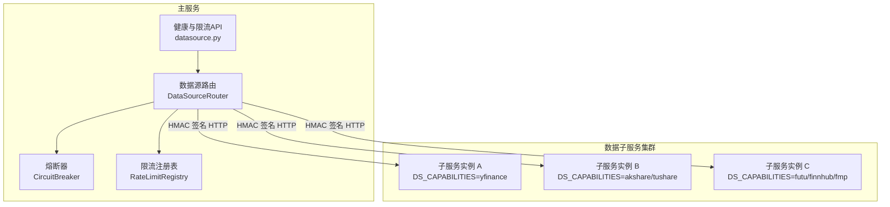
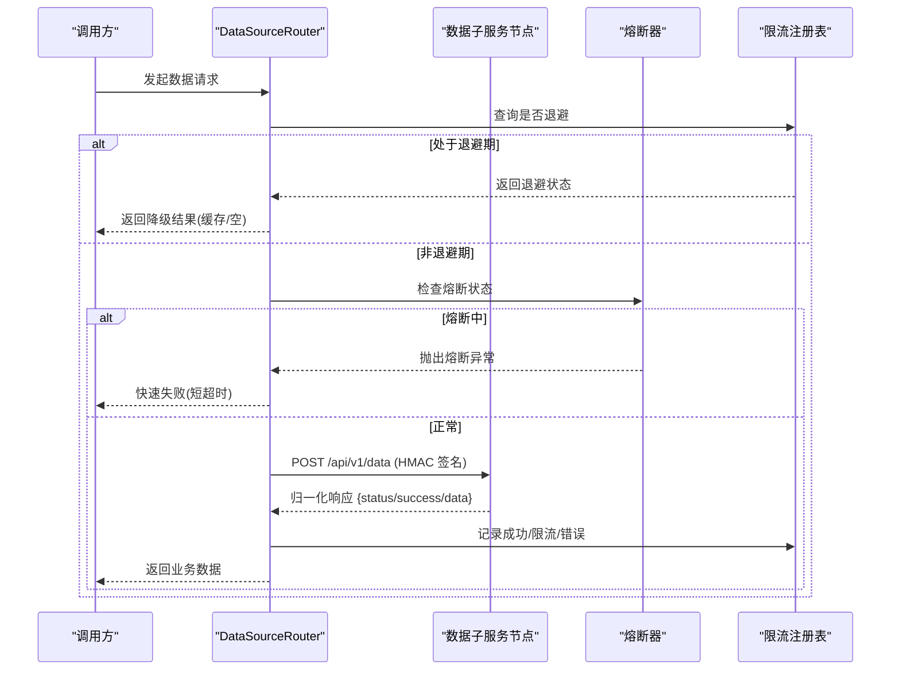
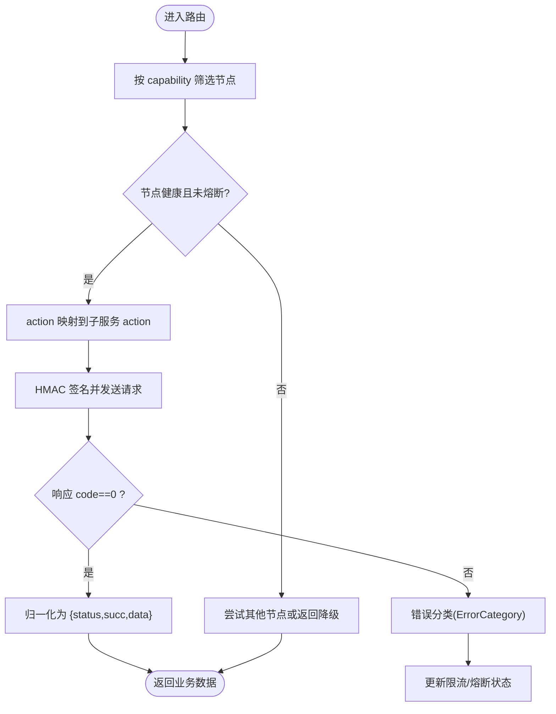
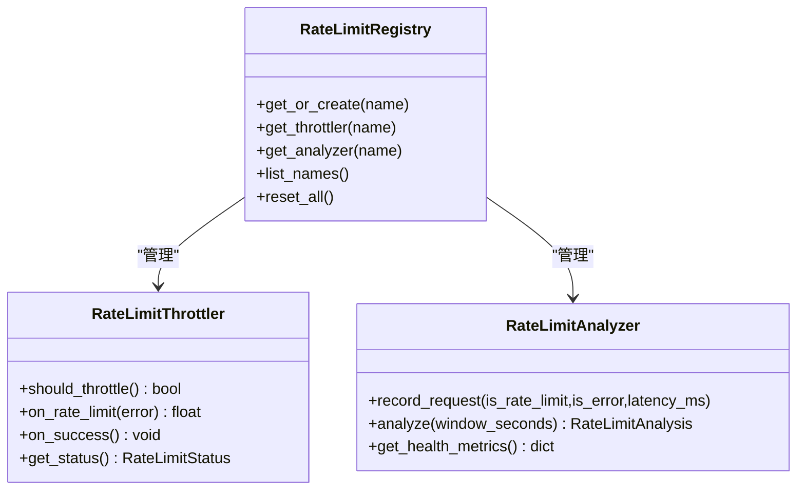
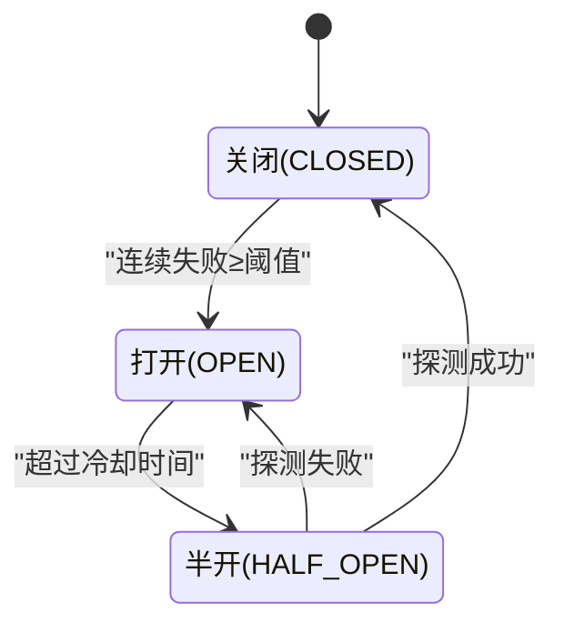
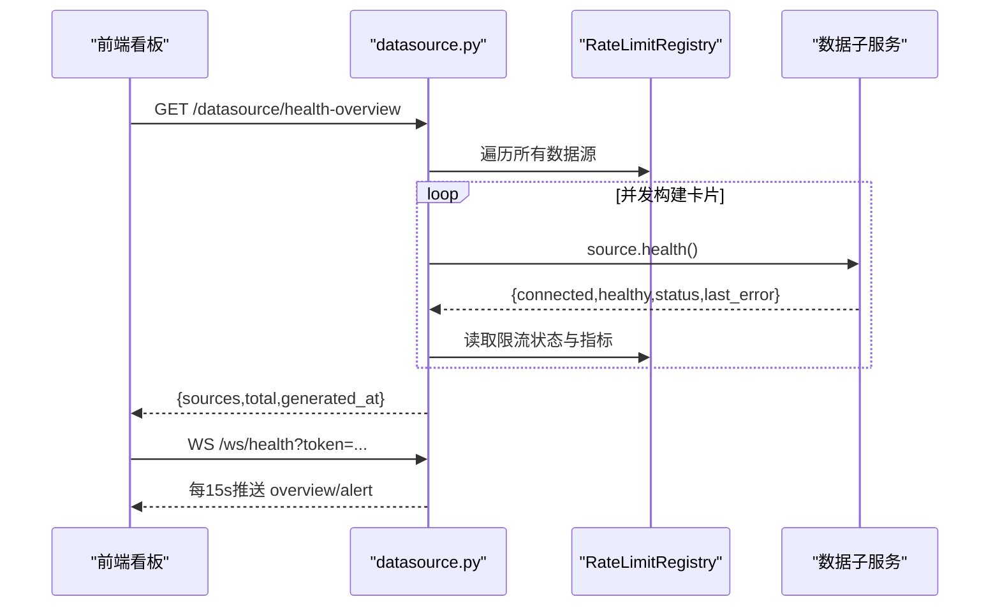
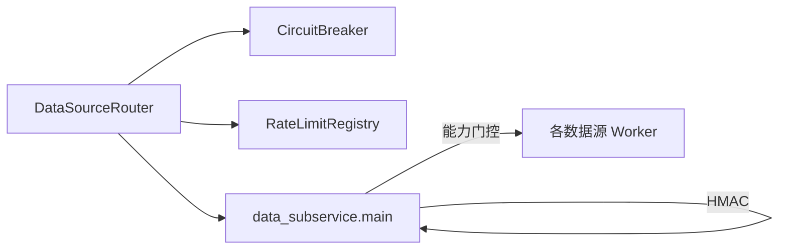

# 数据源聚合

<cite>
**本文引用的文件**
- [backend/routers/datasource.py](file://backend/routers/datasource.py)
- [backend/services/datasource/router.py](file://backend/services/datasource/router.py)
- [backend/services/datasource/registry.py](file://backend/services/datasource/registry.py)
- [backend/services/datasource/analyzer.py](file://backend/services/datasource/analyzer.py)
- [backend/services/datasource/throttler.py](file://backend/services/datasource/throttler.py)
- [backend/core/circuit_breaker.py](file://backend/core/circuit_breaker.py)
- [data_subservice/main.py](file://data_subservice/main.py)
</cite>

## 目录
1. [简介](#简介)
2. [项目结构](#项目结构)
3. [核心组件](#核心组件)
4. [架构总览](#架构总览)
5. [详细组件分析](#详细组件分析)
6. [依赖关系分析](#依赖关系分析)
7. [性能与可观测性](#性能与可观测性)
8. [故障排查指南](#故障排查指南)
9. [结论](#结论)
10. [附录：扩展与集成指南](#附录：扩展与集成指南)

## 简介
本技术文档面向 Quant Agent 的数据源聚合服务，系统性阐述多数据源路由、负载均衡、故障检测、降级与熔断保护、限流退避、数据标准化处理、健康检查与监控告警等能力。同时提供接入新数据提供商、实现自定义适配器、优化获取性能的实践建议，以及面向系统集成商的部署方案要点。

## 项目结构
数据源聚合由“主服务路由层 + 子服务节点”构成：
- 主服务后端暴露统一路由与健康看板接口，负责发现、选择、调用数据子服务，并实施限流、熔断、指标采集。
- 数据子服务作为独立进程运行，仅承载具体数据源能力（yfinance、akshare、tushare、futu、finnhub、fmp、宏观源、搜索抓取等），通过 HMAC 签名认证与主服务通信。

**图表来源**
- [backend/services/datasource/router.py:446-579](file://backend/services/datasource/router.py#L446-L579)
- [data_subservice/main.py:189-234](file://data_subservice/main.py#L189-L234)
- [backend/routers/datasource.py:287-351](file://backend/routers/datasource.py#L287-L351)

**章节来源**
- [backend/services/datasource/router.py:1-30](file://backend/services/datasource/router.py#L1-L30)
- [data_subservice/main.py:1-67](file://data_subservice/main.py#L1-L67)

## 核心组件
- 数据源路由（DataSourceRouter）：维护节点拓扑、能力声明、权重与状态；将主服务内部 action 映射为子服务 action；对请求进行 HMAC 签名与响应归一化；执行节点级与 action 级熔断、半开自愈探针、限流压力感知与降级。
- 限流与退避（RateLimitThrottler + RateLimitAnalyzer + RateLimitRegistry）：按数据源维度记录请求事件、识别限流模式、动态推测 RPM、计算推荐间隔、控制退避策略（线性/指数/自适应）。
- 熔断器（CircuitBreaker）：支持 OPEN/HALF_OPEN/CLOSED 状态机，区分限流类错误与普通失败，支持装饰器与手动记录成功/失败。
- 健康与监控 API：提供健康总览、单源详情、延迟分布、错误率趋势、可用性时间线、限流热力图、WebSocket 实时推送等。
- 数据子服务：统一 /api/v1/data 端点，基于 DS_CAPABILITIES 门控能力，延迟加载重型 SDK，暴露 /health、/metrics 等运维端点。

**章节来源**
- [backend/services/datasource/router.py:249-800](file://backend/services/datasource/router.py#L249-L800)
- [backend/services/datasource/throttler.py:124-466](file://backend/services/datasource/throttler.py#L124-L466)
- [backend/services/datasource/analyzer.py:136-609](file://backend/services/datasource/analyzer.py#L136-L609)
- [backend/services/datasource/registry.py:29-100](file://backend/services/datasource/registry.py#L29-L100)
- [backend/core/circuit_breaker.py:64-379](file://backend/core/circuit_breaker.py#L64-L379)
- [backend/routers/datasource.py:65-455](file://backend/routers/datasource.py#L65-L455)
- [data_subservice/main.py:189-234](file://data_subservice/main.py#L189-L234)

## 架构总览
数据源聚合采用“主服务路由 + 子服务节点”的物理解耦架构。主服务不直接持有外部 SDK，所有数据获取经 data_subservice 统一入口完成，具备以下特性：
- 能力门控：子服务通过 DS_CAPABILITIES 声明能力，未声明则拒绝对应请求。
- 安全通信：主服务与子服务间使用 HMAC-SHA256 签名校验，防篡改与重放。
- 路由与容灾：支持逗号分隔的多活 URL，按能力筛选健康节点，结合权重与限流压力感知做负载均衡。
- 熔断与自愈：节点级与 action 级熔断隔离，后台半开探针周期性探活恢复。
- 限流与退避：按数据源维度统计与推断限流模式，动态调整请求节奏。
- 可观测性：延迟分布、错误率趋势、可用性时间线、限流热力图、WebSocket 实时推送。

**图表来源**
- [backend/services/datasource/router.py:669-748](file://backend/services/datasource/router.py#L669-L748)
- [backend/core/circuit_breaker.py:147-218](file://backend/core/circuit_breaker.py#L147-L218)
- [backend/services/datasource/throttler.py:205-297](file://backend/services/datasource/throttler.py#L205-L297)
- [data_subservice/main.py:189-234](file://data_subservice/main.py#L189-L234)

## 详细组件分析

### 数据源路由与负载均衡
- 节点初始化：从环境变量读取各数据源的远程 URL（支持逗号分隔多活），构建 DataSourceNode 列表，包含 name/url/enabled/weight/status/capabilities 等字段。
- 能力匹配：根据 capability 过滤候选节点，确保只向具备该能力的节点发送请求。
- 权重与压力感知：在健康节点中选择时，考虑节点权重与限流压力（estimated_limit_rpm、consecutive_rate_limits），优先选择压力较低的节点。
- 请求封装：将主服务内部 fetch_type/action 映射为子服务 action（如 yfinance/quote→QUOTE），构造 payload 并通过 httpx 异步发送。
- 响应归一化：将子服务的 {code,data} 信封转换为内部 {status,success,data}，并透传 error_category 供上层限流与熔断分流。
- 错误分类：HTTP 状态码与响应头解析出 ErrorCategory（RATE_LIMIT/QUOTA_EXHAUSTED/IP_BLOCKED/NORMAL），并附带 retry_after。

**图表来源**
- [backend/services/datasource/router.py:446-579](file://backend/services/datasource/router.py#L446-L579)
- [backend/services/datasource/router.py:603-660](file://backend/services/datasource/router.py#L603-L660)
- [backend/services/datasource/router.py:669-748](file://backend/services/datasource/router.py#L669-L748)

**章节来源**
- [backend/services/datasource/router.py:222-247](file://backend/services/datasource/router.py#L222-L247)
- [backend/services/datasource/router.py:786-800](file://backend/services/datasource/router.py#L786-L800)

### 限流与退避机制
- 事件记录：每次请求后记录 is_rate_limit/is_error/latency_ms，用于后续分析与健康看板。
- 动态分析：基于滑动窗口统计分钟级成功请求数，估算限流阈值 RPM（P75），识别高峰时段，计算平均恢复时间与推荐安全间隔。
- 退避策略：支持 none/linear/exponential/adaptive，结合服务端 Retry-After 与历史 request_interval 计算等待时间，IP 封禁/配额耗尽采用固定抑制窗口避免无限放大。
- 注册表管理：每个数据源名称对应一个 Throttler + Analyzer，线程安全，支持重置与清理。

**图表来源**
- [backend/services/datasource/registry.py:29-100](file://backend/services/datasource/registry.py#L29-L100)
- [backend/services/datasource/throttler.py:124-466](file://backend/services/datasource/throttler.py#L124-L466)
- [backend/services/datasource/analyzer.py:136-609](file://backend/services/datasource/analyzer.py#L136-L609)

**章节来源**
- [backend/services/datasource/analyzer.py:250-315](file://backend/services/datasource/analyzer.py#L250-L315)
- [backend/services/datasource/throttler.py:222-312](file://backend/services/datasource/throttler.py#L222-L312)

### 熔断与自愈
- 状态机：CLOSED → OPEN（连续失败≥阈值）→ HALF_OPEN（超过冷却时间）→ CLOSED（探测成功）或 OPEN（探测失败）。
- 限流类错误不计入失败计数，避免误杀；支持 per-call error_classifier 覆盖默认判定。
- 节点级与 action 级熔断隔离：小节点（如 search_master）需全部 action 熔断才整节点熔断，避免误伤其它能力。
- 半开自愈探针：后台任务周期探测 unhealthy 或熔断中的节点，成功则复位 healthy。

**图表来源**
- [backend/core/circuit_breaker.py:45-97](file://backend/core/circuit_breaker.py#L45-L97)
- [backend/core/circuit_breaker.py:147-218](file://backend/core/circuit_breaker.py#L147-L218)
- [backend/services/datasource/router.py:310-409](file://backend/services/datasource/router.py#L310-L409)

**章节来源**
- [backend/core/circuit_breaker.py:64-379](file://backend/core/circuit_breaker.py#L64-L379)
- [backend/services/datasource/router.py:150-175](file://backend/services/datasource/router.py#L150-L175)

### 健康检查与监控
- 健康总览：聚合每个数据源的 connected/healthy/latency/成功率/限流次数等，区分 idle/stale/error/throttled/quota_exhausted/blocked。
- 延迟分布：从 Redis 读取延迟样本，按桶统计直方图，展示 avg/p50/p95。
- 错误率趋势：过去 N 小时错误率时间序列。
- 可用性时间线：过去 N 小时的可用性状态序列。
- WebSocket 实时推送：每 15s 推送 overview，当某源由非 STALE 转为 STALE 时推送 alert。
- 子服务健康：/health 暴露线程水位与 Futu 连接状态，/metrics 输出 Prometheus 指标。

**图表来源**
- [backend/routers/datasource.py:196-300](file://backend/routers/datasource.py#L196-L300)
- [backend/routers/datasource.py:645-707](file://backend/routers/datasource.py#L645-L707)
- [data_subservice/main.py:91-111](file://data_subservice/main.py#L91-L111)

**章节来源**
- [backend/routers/datasource.py:354-455](file://backend/routers/datasource.py#L354-L455)
- [data_subservice/main.py:237-256](file://data_subservice/main.py#L237-L256)

### 数据标准化与质量校验
- 动作映射：主服务内部 fetch_type/action 与子服务 action 严格映射（如 yfinance/quote→QUOTE、futu/order_book→ORDER_BOOK），避免大小写不一致导致 UNSUPPORTED_ACTION。
- 响应归一化：子服务返回 {code,data}，路由层转换为 {status,success,data}，并剥除双重信封（如 fred/finnhub/fmp/dbnomics/rbi/search 的 service 层已返回主服务风格信封）。
- 错误类别透传：子服务 worker 可能返回 {error,"status":"error",error_category:...}，路由层识别为失败并透传 error_category，供 throttler 与熔断分流。
- 质量校验：通过 analyzer 记录 is_error/is_rate_limit，健康看板基于今日统计计算成功率；链接测试仅对真实上游探测成功的样本计入延迟统计，避免 health() 耗时污染。

**章节来源**
- [backend/services/datasource/router.py:61-140](file://backend/services/datasource/router.py#L61-L140)
- [backend/services/datasource/router.py:603-660](file://backend/services/datasource/router.py#L603-L660)
- [backend/routers/datasource.py:555-616](file://backend/routers/datasource.py#L555-L616)

## 依赖关系分析
- 路由依赖：
  - 熔断器：用于快速失败与保护下游。
  - 限流注册表：按数据源维度管理 Throttler/Analyzer。
  - 子服务：通过 httpx 异步客户端发送 HMAC 签名请求。
- 子服务依赖：
  - 能力门控：DS_CAPABILITIES 决定响应的能力集合。
  - 延迟导入：重型 SDK（akshare/tushare/futu 等）仅在请求时导入，缺失时返回 503。
  - 心跳与注册：可选 Redis 心跳注册，TTL 远大于心跳间隔，保证节点存活判断准确。

**图表来源**
- [backend/services/datasource/router.py:446-579](file://backend/services/datasource/router.py#L446-L579)
- [data_subservice/main.py:32-47](file://data_subservice/main.py#L32-L47)
- [data_subservice/main.py:175-234](file://data_subservice/main.py#L175-L234)

**章节来源**
- [backend/services/datasource/router.py:249-289](file://backend/services/datasource/router.py#L249-L289)
- [data_subservice/main.py:259-315](file://data_subservice/main.py#L259-L315)

## 性能与可观测性
- 延迟统计：analyzer 维护近期延迟样本环形缓冲，计算 avg/p95/min/max；健康看板通过 Redis 持久化今日调用量与成功率，重启不丢。
- 错误率趋势：call_metrics 提供过去 N 小时错误率时间序列，便于定位抖动与回归。
- 可用性时间线：call_metrics 提供可用性状态序列，辅助 SLA 评估。
- 限流热力图：call_metrics 提供多数据源限流情况，便于容量规划。
- 子服务指标：/metrics 输出 Prometheus 指标，包含线程水位、熔断状态等。

**章节来源**
- [backend/routers/datasource.py:354-455](file://backend/routers/datasource.py#L354-L455)
- [backend/services/datasource/analyzer.py:468-532](file://backend/services/datasource/analyzer.py#L468-L532)
- [data_subservice/main.py:237-256](file://data_subservice/main.py#L237-L256)

## 故障排查指南
- 启动期配置校验：
  - 若启用路由但未配置 HMAC 密钥，将抛出运行时错误，避免运行时 403 难以排查。
  - 启动期诊断打印密钥前缀与长度，帮助定位注入时序问题。
  - 校验远程 URL 端口是否指向主服务自身而非子服务 8001，防止静默 404 或连接拒绝。
- 常见错误与处理：
  - 限流类错误（429/403/IP 封禁/配额耗尽）：不计入熔断失败计数，进入退避；看板显示 throttled/blocked/quota_exhausted。
  - 数据不可用（标的层面无数据）：识别为 DATA_UNAVAILABLE，避免误判普通失败。
  - 子服务能力未启用：返回 503，提示 DS_CAPABILITIES 未包含该 source。
- 健康看板与探针：
  - 健康总览区分 idle/stale/error/throttled/quota_exhausted/blocked，connected 必须已挂载且真实可用。
  - 半开自愈探针周期探活 unhealthy 或熔断中的节点，成功则复位 healthy。

**章节来源**
- [backend/services/datasource/router.py:249-289](file://backend/services/datasource/router.py#L249-L289)
- [backend/services/datasource/router.py:411-445](file://backend/services/datasource/router.py#L411-L445)
- [backend/routers/datasource.py:196-300](file://backend/routers/datasource.py#L196-L300)
- [backend/services/datasource/router.py:310-409](file://backend/services/datasource/router.py#L310-L409)

## 结论
Quant Agent 数据源聚合服务通过“主服务路由 + 子服务节点”的解耦架构，实现了多数据源的路由、负载均衡、故障检测、降级与熔断保护，并提供完善的限流退避、健康检查与监控能力。该设计在保证高可用的同时，降低了主服务对外部 SDK 的耦合度，提升了系统的可维护性与可扩展性。

## 附录：扩展与集成指南
- 接入新数据提供商：
  - 在子服务中新增 worker（如 handle_newsource），并在 _WORKER_IMPORTS 中注册延迟导入。
  - 在主服务路由中添加 action 映射（_NEW_SOURCE_ACTION_MAP），确保 fetch_type 与子服务 action 一致。
  - 在节点初始化中新增 DataSourceNode，声明 capabilities（如 "newsource","quote","history"）。
  - 若子服务返回双重信封，确保路由层 normalize_response 能正确剥除内层。
- 自定义数据适配器：
  - 遵循主服务内部约定：返回 {status,success,data} 或 {code,data}；错误体携带 error_category。
  - 在 adapter 中声明 capabilities，便于路由层能力匹配。
  - 使用 throttler 记录成功/限流/错误，analyzer 自动统计与分析。
- 性能优化：
  - 合理设置 DS_CAPABILITIES，避免未声明能力被请求。
  - 利用 AKShare 热点缓存与 STALE 缓存配置，降低重复请求。
  - 调整 backoff 策略与参数（BASE_DELAY/MAX_DELAY/JITTER），平衡吞吐与稳定性。
- 部署建议：
  - 主服务与子服务分离部署，子服务默认端口 8001，主服务端口 QUANT_PORT。
  - 配置 DATA_SOURCE_HMAC_SECRET，确保主/子服务一致。
  - 启用 Redis 心跳注册（ENABLE_REDIS_HEARTBEAT=true），TTL 远大于心跳间隔。
  - 通过 Grafana/Prometheus 监控延迟分布、错误率趋势、可用性时间线与限流热力图。

**章节来源**
- [data_subservice/main.py:32-47](file://data_subservice/main.py#L32-L47)
- [data_subservice/main.py:175-234](file://data_subservice/main.py#L175-L234)
- [backend/services/datasource/router.py:61-140](file://backend/services/datasource/router.py#L61-L140)
- [backend/services/datasource/router.py:446-579](file://backend/services/datasource/router.py#L446-L579)
- [backend/routers/datasource.py:354-455](file://backend/routers/datasource.py#L354-L455)
