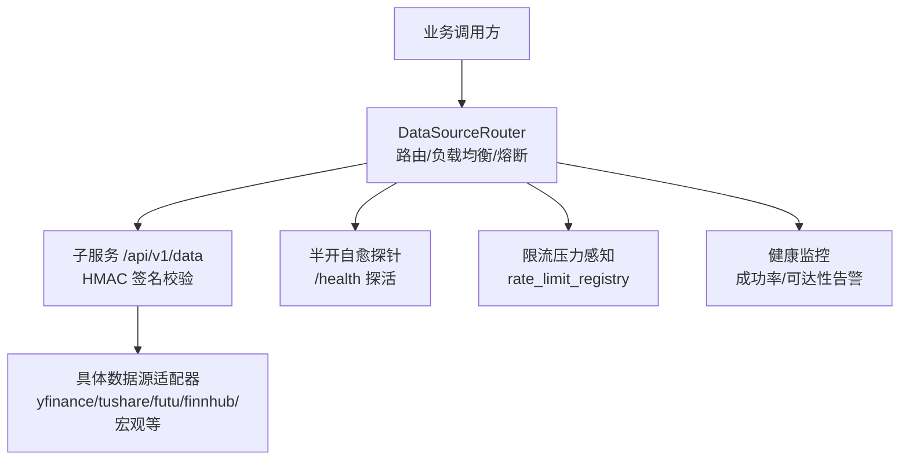
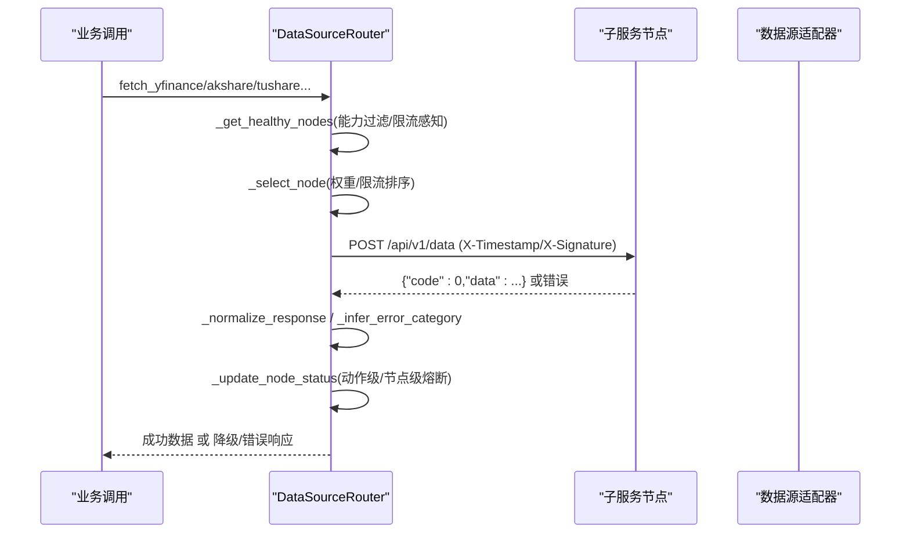
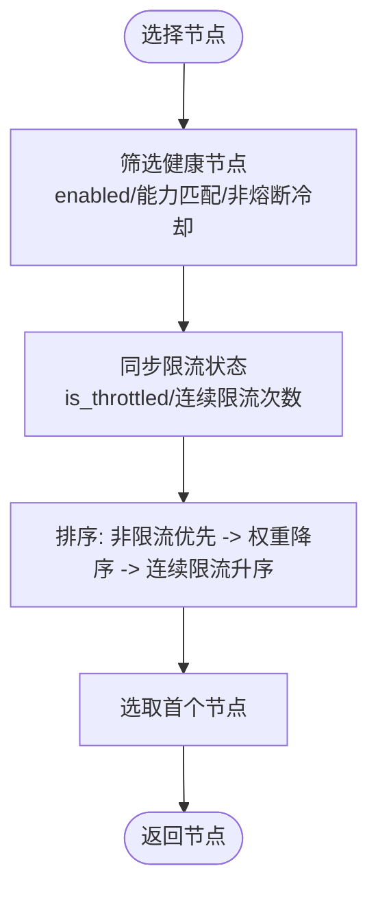
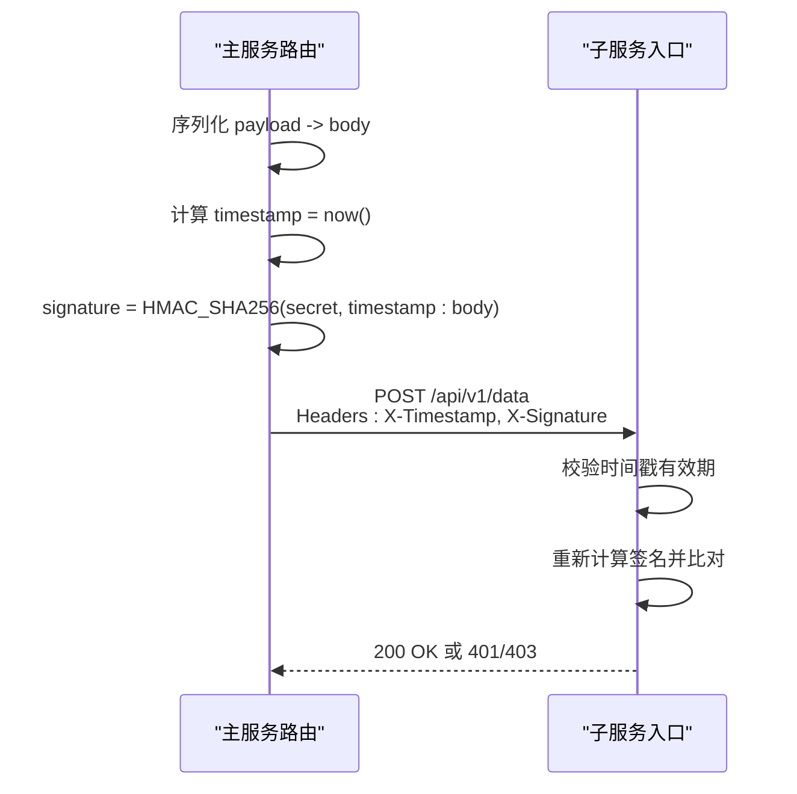
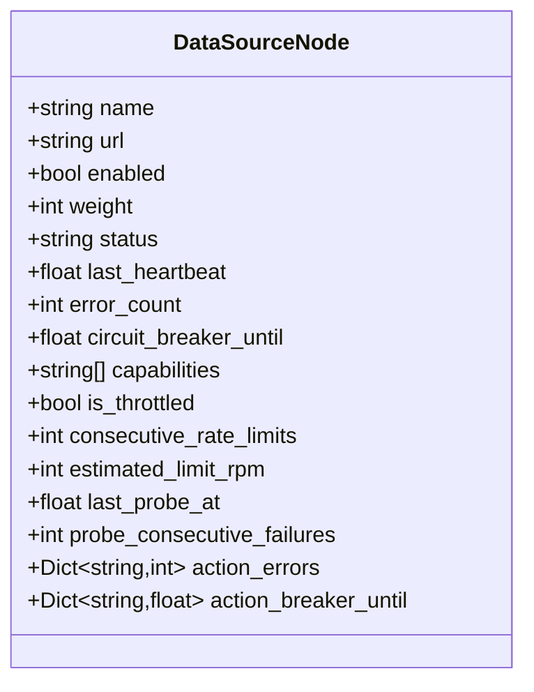
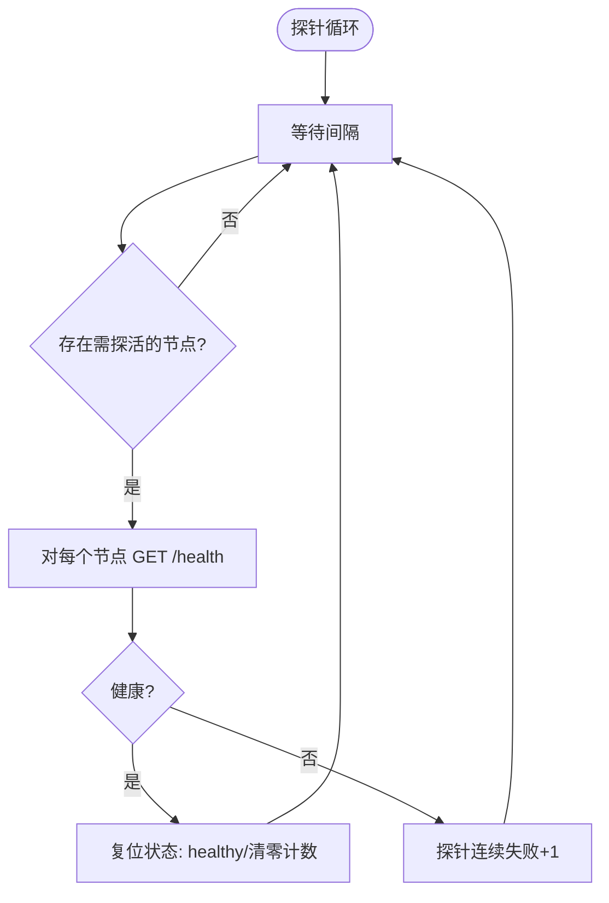
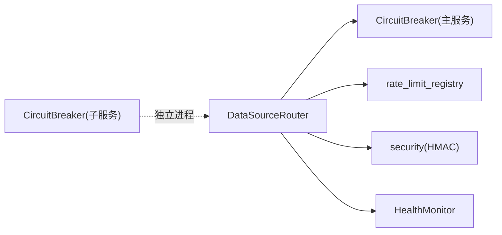

# 数据源路由机制

<cite>
**本文引用的文件**
- [backend/services/datasource/router.py](file://backend/services/datasource/router.py)
- [backend/core/circuit_breaker.py](file://backend/core/circuit_breaker.py)
- [data_subservice/_internal/circuit_breaker.py](file://data_subservice/_internal/circuit_breaker.py)
- [backend/core/security.py](file://backend/core/security.py)
- [backend/services/datasource/health_monitor.py](file://backend/services/datasource/health_monitor.py)
</cite>

## 目录
1. [简介](#简介)
2. [项目结构](#项目结构)
3. [核心组件](#核心组件)
4. [架构总览](#架构总览)
5. [详细组件分析](#详细组件分析)
6. [依赖关系分析](#依赖关系分析)
7. [性能与限流](#性能与限流)
8. [故障排查指南](#故障排查指南)
9. [结论](#结论)
10. [附录：配置与运维](#附录配置与运维)

## 简介
本技术文档聚焦 Quant Agent 的“数据源路由机制”，系统性说明多节点路由、负载均衡、故障转移、HMAC-SHA256 签名验证、熔断保护（action 级隔离与节点级兜底）、半开自愈探针、限流压力感知与动态权重调整、健康检查与心跳监控、错误分类与重试策略，以及运维配置与排障要点。目标是帮助研发与运维人员理解并稳定运行跨节点数据源路由。

## 项目结构
- 路由核心位于后端服务的数据源路由模块，负责节点发现、请求转发、错误分类、熔断与自愈。
- 子服务侧提供统一数据端点，主服务通过 HTTP 调用，携带 HMAC 签名头进行鉴权。
- 熔断器在前后端均有实现：主服务使用通用熔断器；子服务使用内部轻量版以解耦依赖。
- 健康监控模块周期性扫描成功率与可达性，触发告警推送。

图表来源
- [backend/services/datasource/router.py:446-579](file://backend/services/datasource/router.py#L446-L579)
- [backend/services/datasource/router.py:669-748](file://backend/services/datasource/router.py#L669-L748)
- [backend/services/datasource/health_monitor.py:101-148](file://backend/services/datasource/health_monitor.py#L101-L148)

章节来源
- [backend/services/datasource/router.py:1-30](file://backend/services/datasource/router.py#L1-L30)
- [backend/services/datasource/router.py:446-579](file://backend/services/datasource/router.py#L446-L579)

## 核心组件
- DataSourceNode：描述单个数据源节点（名称、URL、权重、能力集、健康状态、心跳、熔断时间戳、action 级熔断计数等）。
- DataSourceRouter：路由中枢，负责节点注册、选择、请求发送、错误分类、熔断更新、半开探测、离线模式拦截。
- CircuitBreaker（主服务）：通用熔断器，支持 OPEN/HALF_OPEN/CLOSED 状态机，限流类错误不计入失败计数。
- CircuitBreaker（子服务）：内部轻量版，无 Prometheus 指标输出，语义与主服务一致。
- Security（HMAC）：生成与验证内部通信签名，确保节点间通信安全。
- HealthMonitor：周期扫描各数据源成功率与可达性，触发告警。

章节来源
- [backend/services/datasource/router.py:222-247](file://backend/services/datasource/router.py#L222-L247)
- [backend/core/circuit_breaker.py:45-103](file://backend/core/circuit_breaker.py#L45-L103)
- [data_subservice/_internal/circuit_breaker.py:45-91](file://data_subservice/_internal/circuit_breaker.py#L45-L91)
- [backend/core/security.py:37-118](file://backend/core/security.py#L37-L118)
- [backend/services/datasource/health_monitor.py:55-148](file://backend/services/datasource/health_monitor.py#L55-L148)

## 架构总览
数据源路由采用“主服务集中调度 + 子服务承载连接”的分层架构：
- 主服务不直接持有外部 SDK 长连接，所有数据源流量经 data_subservice 远程调用。
- 路由层维护节点拓扑（YF 主备、AKShare/Tushare 北京单节点、Futu/FMP/Finnhub/宏观/搜索等），按能力集筛选候选节点。
- 请求体统一为 {source, action, params}，通过 /api/v1/data 提交，附带 X-Timestamp 与 X-Signature 头。
- 子服务对 body 字节做 HMAC-SHA256 验签，防止篡改与重放。
- 路由层内置 action 级熔断与节点级兜底，结合半开自愈探针自动恢复。
- 限流压力感知将节点被限流信息同步到路由，影响选择优先级。

图表来源
- [backend/services/datasource/router.py:786-808](file://backend/services/datasource/router.py#L786-L808)
- [backend/services/datasource/router.py:894-909](file://backend/services/datasource/router.py#L894-L909)
- [backend/services/datasource/router.py:669-748](file://backend/services/datasource/router.py#L669-L748)
- [backend/services/datasource/router.py:603-660](file://backend/services/datasource/router.py#L603-L660)

## 详细组件分析

### 节点发现与拓扑管理
- 节点初始化：根据环境变量注入各数据源的远程 URL，构建节点对象并声明 capabilities（能力集）。
- 多活与容灾：YFinance 支持主备逗号分隔多活；其他源多为单节点 pin（如 AKShare/Tushare/Futu/FMP/Finnhub/宏观/搜索）。
- 启动期校验：检测 URL 端口是否误指向主服务自身，避免静默 404。

章节来源
- [backend/services/datasource/router.py:446-579](file://backend/services/datasource/router.py#L446-L579)
- [backend/services/datasource/router.py:411-444](file://backend/services/datasource/router.py#L411-L444)

### 负载均衡策略
- 健康节点筛选：仅返回 enabled、具备 capability、status 为 healthy 且未处于熔断冷却期的节点。
- 限流压力感知：从 rate_limit_registry 同步节点 is_throttled、consecutive_rate_limits、estimated_limit_rpm。
- 选择规则：优先未被限流的节点；同状态下按 weight 降序；weight 相同则连续限流次数少的优先。

图表来源
- [backend/services/datasource/router.py:786-808](file://backend/services/datasource/router.py#L786-L808)
- [backend/services/datasource/router.py:894-909](file://backend/services/datasource/router.py#L894-L909)

章节来源
- [backend/services/datasource/router.py:786-808](file://backend/services/datasource/router.py#L786-L808)
- [backend/services/datasource/router.py:894-909](file://backend/services/datasource/router.py#L894-L909)

### 故障转移机制
- YFinance 多节点 failover：逐个尝试备份节点，退避期内跳过该节点，直至成功或全部退避。
- 单节点 pin 源半开探测：当唯一节点进入熔断冷却后，允许半开探测（冷却到期即放行一次试探），成功则恢复 healthy，失败续冷却。
- 远程不支持/数据不可用：明确返回 UNSUPPORTED 或 data_unavailable，由上层决定降级或回退策略。

章节来源
- [backend/services/datasource/router.py:953-1095](file://backend/services/datasource/router.py#L953-L1095)
- [backend/services/datasource/router.py:911-941](file://backend/services/datasource/router.py#L911-L941)

### HMAC-SHA256 签名验证流程
- 主服务侧：对最终发送的 body 字符串计算 HMAC-SHA256，附加 X-Timestamp 与 X-Signature 头。
- 子服务侧：解析头部，校验时间戳有效期，重新计算签名并与接收签名比较，防时序攻击。
- 密钥一致性：若主服务未配置 DATA_SOURCE_HMAC_SECRET，启动时报错，避免运行时 403 难以排查。

图表来源
- [backend/services/datasource/router.py:586-600](file://backend/services/datasource/router.py#L586-L600)
- [backend/services/datasource/router.py:699-708](file://backend/services/datasource/router.py#L699-L708)
- [backend/core/security.py:37-118](file://backend/core/security.py#L37-L118)

章节来源
- [backend/services/datasource/router.py:586-600](file://backend/services/datasource/router.py#L586-L600)
- [backend/services/datasource/router.py:699-708](file://backend/services/datasource/router.py#L699-L708)
- [backend/core/security.py:37-118](file://backend/core/security.py#L37-L118)

### 熔断保护机制（action 级隔离与节点级兜底）
- Action 级熔断：每个 action 独立计数连续普通失败，达到阈值后仅熔断该 action（不影响同节点其它 action）。
- 节点级兜底：统计当前处于熔断态的不同 action 数，超过动态阈值（基于节点 capabilities 规模 × 比例，且有下限）时整节点熔断。
- 限流类错误不计入任何熔断计数，走独立退避机制。
- 部署重置：进程启动时清空所有节点的熔断残留，避免历史状态污染新进程。

图表来源
- [backend/services/datasource/router.py:222-247](file://backend/services/datasource/router.py#L222-L247)

章节来源
- [backend/services/datasource/router.py:150-175](file://backend/services/datasource/router.py#L150-L175)
- [backend/services/datasource/router.py:810-893](file://backend/services/datasource/router.py#L810-L893)
- [backend/core/circuit_breaker.py:45-103](file://backend/core/circuit_breaker.py#L45-L103)
- [data_subservice/_internal/circuit_breaker.py:45-91](file://data_subservice/_internal/circuit_breaker.py#L45-L91)

### 半开自愈探针
- 后台任务周期性对 unhealthy 或熔断冷却中的节点发起 /health 探活。
- 成功则复位 error_count、circuit_breaker_until、status=healthy，并清零探针连续失败计数。
- 失败则增加探针连续失败计数，维持 unhealthy，但不续期冷却，保证冷却到期后可重试。

图表来源
- [backend/services/datasource/router.py:310-387](file://backend/services/datasource/router.py#L310-L387)

章节来源
- [backend/services/datasource/router.py:310-387](file://backend/services/datasource/router.py#L310-L387)

### 限流压力感知系统
- 速率限制检测：从 rate_limit_registry 获取节点 throttler 状态，同步 is_throttled、consecutive_rate_limits、estimated_limit_rpm。
- 动态权重调整：选择节点时优先非限流节点；同状态下按权重降序；权重相同则连续限流次数少的优先。
- 降级策略：YFinance 节点退避期内跳过该节点，转向备份节点；全节点退避时整源暂不可用，返回可重试错误。

章节来源
- [backend/services/datasource/router.py:786-808](file://backend/services/datasource/router.py#L786-L808)
- [backend/services/datasource/router.py:894-909](file://backend/services/datasource/router.py#L894-L909)
- [backend/services/datasource/router.py:992-1095](file://backend/services/datasource/router.py#L992-L1095)

### 健康检查、心跳监控、错误分类与重试
- 心跳监控：每次请求成功/失败均刷新 last_heartbeat。
- 错误分类：HTTP 状态码映射至 ErrorCategory（RATE_LIMIT/QUOTA_EXHAUSTED/IP_BLOCKED/NORMAL），并对文本消息兜底识别限流与数据不可用。
- 重试机制：限流类错误不计入熔断，走独立退避；普通错误计入熔断与退避；YFinance 多节点 failover。

章节来源
- [backend/services/datasource/router.py:810-893](file://backend/services/datasource/router.py#L810-L893)
- [backend/services/datasource/router.py:190-219](file://backend/services/datasource/router.py#L190-L219)
- [backend/services/datasource/router.py:750-784](file://backend/services/datasource/router.py#L750-L784)

## 依赖关系分析
- 路由模块依赖：
  - 熔断器：用于全局冷却时间与状态机（主服务）。
  - 限流注册表：用于节点限流状态同步。
  - 安全模块：用于 HMAC 签名生成与验证。
  - 健康监控：用于成功率与可达性告警。
- 子服务熔断器：内部轻量版，避免对外部指标库的强依赖。

图表来源
- [backend/services/datasource/router.py:44-56](file://backend/services/datasource/router.py#L44-L56)
- [backend/core/circuit_breaker.py:356-379](file://backend/core/circuit_breaker.py#L356-L379)
- [data_subservice/_internal/circuit_breaker.py:278-296](file://data_subservice/_internal/circuit_breaker.py#L278-L296)
- [backend/core/security.py:37-118](file://backend/core/security.py#L37-L118)
- [backend/services/datasource/health_monitor.py:55-148](file://backend/services/datasource/health_monitor.py#L55-L148)

章节来源
- [backend/services/datasource/router.py:44-56](file://backend/services/datasource/router.py#L44-L56)
- [backend/core/circuit_breaker.py:356-379](file://backend/core/circuit_breaker.py#L356-L379)
- [data_subservice/_internal/circuit_breaker.py:278-296](file://data_subservice/_internal/circuit_breaker.py#L278-L296)
- [backend/core/security.py:37-118](file://backend/core/security.py#L37-L118)
- [backend/services/datasource/health_monitor.py:55-148](file://backend/services/datasource/health_monitor.py#L55-L148)

## 性能与限流
- 并发与超时：httpx.AsyncClient 设置连接与读取超时，限制最大连接数，避免资源耗尽。
- 采样诊断：每 300 个请求采样一次完整调用栈，定位高频请求来源，便于压测与优化。
- 限流退避：YFinance 节点级退避，避免雪崩；全节点退避时整源暂不可用，快速失败。
- 缓存与降级：AKShare 远程失败时可回退 STALE 缓存，标记 degraded/stale_source，供监控识别。

章节来源
- [backend/services/datasource/router.py:662-667](file://backend/services/datasource/router.py#L662-L667)
- [backend/services/datasource/router.py:681-697](file://backend/services/datasource/router.py#L681-L697)
- [backend/services/datasource/router.py:1097-1165](file://backend/services/datasource/router.py#L1097-L1165)

## 故障排查指南
- 启动期诊断：打印 HMAC 密钥前缀与长度，确认密钥注入正确；校验 REMOTE_URL 端口是否误指向主服务自身。
- 常见错误：
  - 403 签名失败：检查 DATA_SOURCE_HMAC_SECRET 是否与子服务一致；确认 body 序列化与签名时机一致。
  - 404/连接拒绝：检查 *_REMOTE_URL 是否指向子服务 8001 端口。
  - 持续熔断：确认部署重置已生效；检查半开探针是否运行；查看 action 级熔断与节点级兜底阈值。
- 监控与告警：
  - 健康监控：成功率低于阈值或失联时推送飞书告警；冷却去重避免风暴。
  - 指标与日志：关注路由层错误日志、熔断状态变化、探针结果。

章节来源
- [backend/services/datasource/router.py:257-284](file://backend/services/datasource/router.py#L257-L284)
- [backend/services/datasource/router.py:411-444](file://backend/services/datasource/router.py#L411-L444)
- [backend/services/datasource/health_monitor.py:101-148](file://backend/services/datasource/health_monitor.py#L101-L148)

## 结论
Quant Agent 的数据源路由机制通过“集中调度 + 子服务承载”的架构，实现了高可用、可扩展、可观测的多节点数据访问。其核心优势包括：
- 精确的错误分类与限流隔离，避免误杀与雪崩。
- 细粒度的 action 级熔断与节点级兜底，兼顾小/大节点差异。
- 半开自愈探针保障单节点 pin 源的自动恢复。
- HMAC-SHA256 签名确保节点间通信安全。
- 限流压力感知与动态权重调整提升整体吞吐与稳定性。

## 附录：配置与运维

### 添加新数据源节点
- 在路由初始化中新增节点定义，声明 capabilities 与 URL（支持逗号分隔多活）。
- 如需新 action 映射，补充对应的 action 映射表。
- 确保子服务提供对应 source/action 处理逻辑，并支持 /health 探活。

章节来源
- [backend/services/datasource/router.py:446-579](file://backend/services/datasource/router.py#L446-L579)

### 配置优先级与权重
- 通过节点 weight 控制优先级；限流状态下优先选择非限流节点。
- 可通过 rate_limit_registry 动态调整节点限流状态，间接影响选择。

章节来源
- [backend/services/datasource/router.py:786-808](file://backend/services/datasource/router.py#L786-L808)
- [backend/services/datasource/router.py:894-909](file://backend/services/datasource/router.py#L894-L909)

### 熔断参数配置
- 环境变量：
  - DATASOURCE_ACTION_MAX_FAILURES：action 级熔断阈值。
  - DATASOURCE_ACTION_NODE_MIN_THRESHOLD：节点级兜底阈值下限。
  - DATASOURCE_ACTION_NODE_RATIO：节点级兜底阈值比例。
  - CIRCUIT_BREAKER_COOLDOWN_S：熔断冷却时间。
- 部署重置：进程启动时自动清空熔断残留。

章节来源
- [backend/services/datasource/router.py:150-175](file://backend/services/datasource/router.py#L150-L175)
- [backend/core/circuit_breaker.py:40-43](file://backend/core/circuit_breaker.py#L40-L43)
- [backend/services/datasource/router.py:293-309](file://backend/services/datasource/router.py#L293-L309)

### 监控指标与工具
- 健康监控：成功率、可达性、告警冷却键。
- 路由层日志：错误分类、熔断状态、探针结果。
- 子服务健康：/health 端点返回 status 字段，探针据此判断健康。

章节来源
- [backend/services/datasource/health_monitor.py:238-248](file://backend/services/datasource/health_monitor.py#L238-L248)
- [backend/services/datasource/router.py:388-409](file://backend/services/datasource/router.py#L388-L409)
