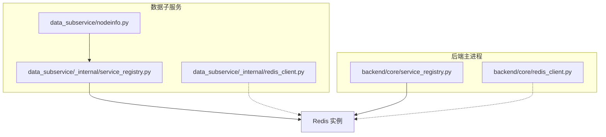
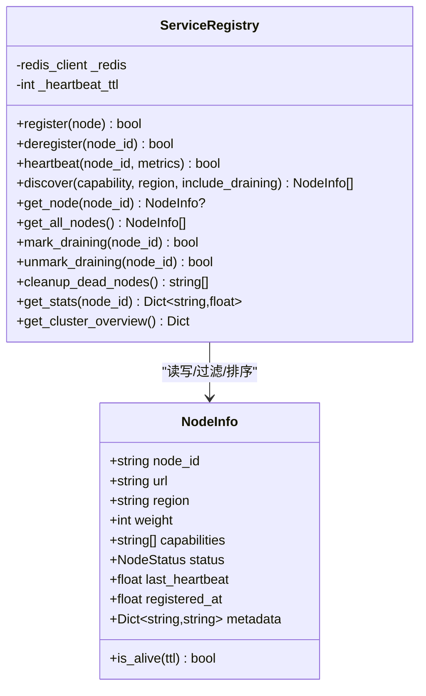
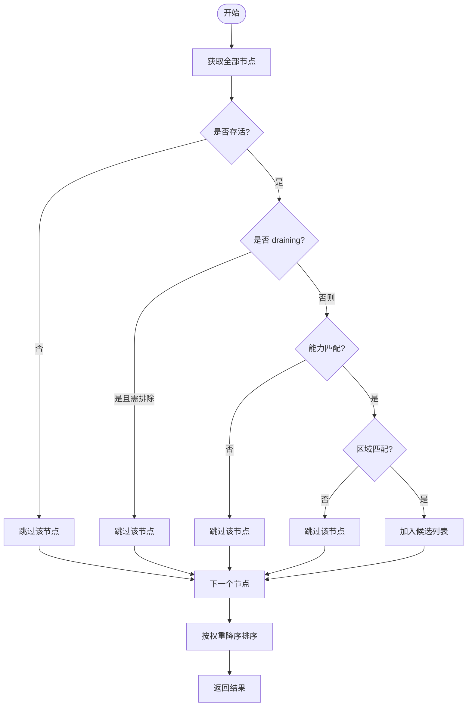
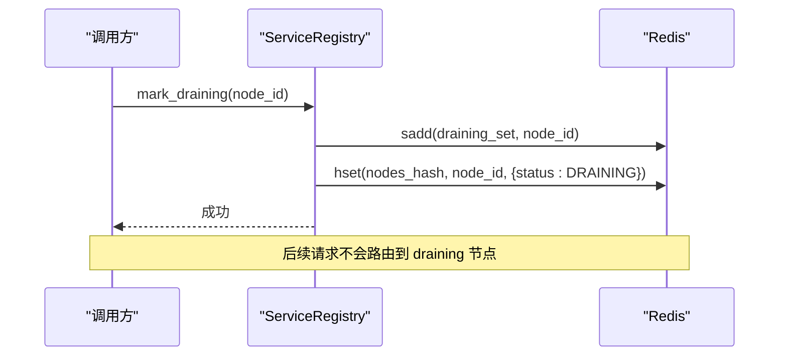
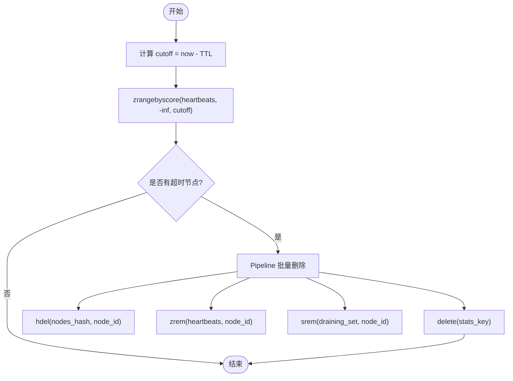
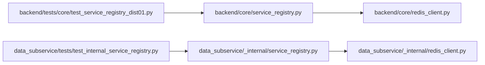

# 服务注册中心

<cite>
**本文引用的文件**
- [backend/core/service_registry.py](file://backend/core/service_registry.py)
- [data_subservice/_internal/service_registry.py](file://data_subservice/_internal/service_registry.py)
- [data_subservice/nodeinfo.py](file://data_subservice/nodeinfo.py)
- [backend/core/redis_client.py](file://backend/core/redis_client.py)
- [data_subservice/_internal/redis_client.py](file://data_subservice/_internal/redis_client.py)
- [backend/tests/core/test_service_registry_dist01.py](file://backend/tests/core/test_service_registry_dist01.py)
- [data_subservice/tests/test_internal_service_registry.py](file://data_subservice/tests/test_internal_service_registry.py)
</cite>

## 目录
1. [简介](#简介)
2. [项目结构](#项目结构)
3. [核心组件](#核心组件)
4. [架构总览](#架构总览)
5. [详细组件分析](#详细组件分析)
6. [依赖关系分析](#依赖关系分析)
7. [性能考量](#性能考量)
8. [故障排查指南](#故障排查指南)
9. [结论](#结论)
10. [附录](#附录)

## 简介
本技术文档围绕 Quant Agent 的分布式节点服务注册中心展开，重点说明基于 Redis Hash + Sorted Set + Set 三结构协同实现的跨 VPS 节点服务注册与发现机制。文档涵盖 NodeInfo 模型设计、节点状态管理（ACTIVE、DRAINING、DEAD）、心跳检测与 TTL 超时处理、服务发现算法、权重路由策略、区域过滤能力、优雅下线流程、死节点清理机制、集群总览统计的实现细节，并提供扩展开发指南、Redis 键空间设计、原子操作保证与性能优化策略，帮助分布式服务开发者遵循统一的注册发现规范与最佳实践。

## 项目结构
服务注册中心在两个物理位置实现：
- backend 侧：面向主服务进程使用，提供完整的注册表能力。
- data_subservice 侧：物理解耦的子服务内部实现，不依赖 backend，便于独立部署与运行。

图表来源
- [backend/core/service_registry.py:1-417](file://backend/core/service_registry.py#L1-L417)
- [data_subservice/_internal/service_registry.py:1-320](file://data_subservice/_internal/service_registry.py#L1-L320)
- [data_subservice/nodeinfo.py:1-46](file://data_subservice/nodeinfo.py#L1-L46)
- [backend/core/redis_client.py:1-252](file://backend/core/redis_client.py#L1-L252)
- [data_subservice/_internal/redis_client.py:1-258](file://data_subservice/_internal/redis_client.py#L1-L258)

章节来源
- [backend/core/service_registry.py:1-417](file://backend/core/service_registry.py#L1-L417)
- [data_subservice/_internal/service_registry.py:1-320](file://data_subservice/_internal/service_registry.py#L1-L320)
- [data_subservice/nodeinfo.py:1-46](file://data_subservice/nodeinfo.py#L1-L46)

## 核心组件
- NodeInfo 模型：描述节点唯一标识、API 地址、地理区域、路由权重、能力列表、状态、心跳时间戳、注册时间与扩展元数据；提供存活判断方法。
- ServiceRegistry：封装注册、注销、心跳、发现、优雅下线、死节点清理、统计指标与集群总览等异步接口，所有写操作通过 Redis Pipeline 保证原子性。
- Redis 客户端：提供连接池、批量写入队列与本地 L1 缓存，降低高频写入的网络开销并提升读取性能。

章节来源
- [backend/core/service_registry.py:51-67](file://backend/core/service_registry.py#L51-L67)
- [backend/core/service_registry.py:69-417](file://backend/core/service_registry.py#L69-L417)
- [data_subservice/_internal/service_registry.py:51-320](file://data_subservice/_internal/service_registry.py#L51-L320)
- [backend/core/redis_client.py:1-252](file://backend/core/redis_client.py#L1-L252)
- [data_subservice/_internal/redis_client.py:1-258](file://data_subservice/_internal/redis_client.py#L1-L258)

## 架构总览
服务注册中心以 Redis 为共享状态存储，采用以下键空间设计：
- Hash quant:registry:nodes：存储每个节点的 NodeInfo JSON 序列化结果。
- ZSet quant:registry:heartbeats：按 last_heartbeat 时间戳排序，用于快速定位超时节点。
- Set quant:registry:draining：记录处于优雅下线中的节点 ID。
- Hash quant:registry:stats:{node_id}：存储节点级统计指标（如成功次数、错误次数、平均延迟），带 1 小时过期。

图表来源
- [backend/core/service_registry.py:51-67](file://backend/core/service_registry.py#L51-L67)
- [backend/core/service_registry.py:69-417](file://backend/core/service_registry.py#L69-L417)
- [data_subservice/_internal/service_registry.py:51-320](file://data_subservice/_internal/service_registry.py#L51-L320)

## 详细组件分析

### NodeInfo 模型与状态管理
- 字段与约束：
  - node_id：唯一标识。
  - url：节点 API 地址。
  - region：地理区域，支持 us-west、cn-north 等。
  - weight：路由权重，范围 1-100。
  - capabilities：能力列表，用于按能力过滤。
  - status：节点状态枚举 ACTIVE、DRAINING、DEAD。
  - last_heartbeat：最后心跳时间戳。
  - registered_at：首次注册时间戳。
  - metadata：扩展元数据。
- 存活判断：
  - is_alive(ttl)：比较当前时间与 last_heartbeat，若差值小于 TTL 则视为存活。

章节来源
- [backend/core/service_registry.py:43-67](file://backend/core/service_registry.py#L43-L67)
- [data_subservice/_internal/service_registry.py:43-67](file://data_subservice/_internal/service_registry.py#L43-L67)

### 注册与注销
- 注册 register：
  - 写入 Hash quant:registry:nodes（节点信息）。
  - 写入 ZSet quant:registry:heartbeats（心跳时间戳）。
  - 使用 Pipeline 保证原子性。
- 注销 deregister：
  - 从 Hash、ZSet、Set（draining）与 stats 中删除对应节点信息。
  - 幂等：对不存在节点返回成功。

章节来源
- [backend/core/service_registry.py:92-139](file://backend/core/service_registry.py#L92-L139)
- [data_subservice/_internal/service_registry.py:91-124](file://data_subservice/_internal/service_registry.py#L91-L124)

### 心跳与 TTL 超时
- 心跳 heartbeat：
  - 校验节点是否存在。
  - 更新 ZSet score 与 Hash 中的 last_heartbeat。
  - 可选附带 metrics 更新统计指标。
- TTL 超时：
  - 默认心跳 TTL 为 30 秒，超过未心跳视为 DEAD。
  - discover 时排除 dead 节点；get_all_nodes 将超时的节点标记为 DEAD。

章节来源
- [backend/core/service_registry.py:145-182](file://backend/core/service_registry.py#L145-L182)
- [backend/core/service_registry.py:242-263](file://backend/core/service_registry.py#L242-L263)
- [data_subservice/_internal/service_registry.py:129-152](file://data_subservice/_internal/service_registry.py#L129-L152)
- [data_subservice/_internal/service_registry.py:190-208](file://data_subservice/_internal/service_registry.py#L190-L208)

### 服务发现与权重路由
- 发现 discover：
  - 获取全部节点，过滤 dead、draining（除非显式包含）、按 capability 与 region 过滤。
  - 按 weight 降序排序，实现权重路由策略。
- 权重路由策略：
  - 高权重节点优先被选择，适合多节点负载均衡与流量倾斜。

图表来源
- [backend/core/service_registry.py:188-229](file://backend/core/service_registry.py#L188-L229)
- [data_subservice/_internal/service_registry.py:157-178](file://data_subservice/_internal/service_registry.py#L157-L178)

章节来源
- [backend/core/service_registry.py:188-229](file://backend/core/service_registry.py#L188-L229)
- [data_subservice/_internal/service_registry.py:157-178](file://data_subservice/_internal/service_registry.py#L157-L178)

### 优雅下线流程
- 标记 draining mark_draining：
  - 将节点 ID 加入 Set quant:registry:draining。
  - 更新节点状态为 DRAINING。
- 取消 draining unmark_draining：
  - 从 Set 移除节点 ID。
  - 恢复节点状态为 ACTIVE。
- 行为特性：
  - draining 节点仍会发心跳，不会被 cleanup 清除。
  - discover 默认不包含 draining 节点，除非 include_draining=True。

图表来源
- [backend/core/service_registry.py:269-294](file://backend/core/service_registry.py#L269-L294)
- [data_subservice/_internal/service_registry.py:213-229](file://data_subservice/_internal/service_registry.py#L213-L229)

章节来源
- [backend/core/service_registry.py:269-314](file://backend/core/service_registry.py#L269-L314)
- [data_subservice/_internal/service_registry.py:213-247](file://data_subservice/_internal/service_registry.py#L213-L247)

### 死节点清理机制
- 清理逻辑 cleanup_dead_nodes：
  - 通过 ZSet 查询所有 score <= (now - TTL) 的节点 ID。
  - 批量从 Hash、ZSet、Set（draining）与 stats 中删除。
- 建议由后台守护任务定期执行（例如每 30 秒）。

图表来源
- [backend/core/service_registry.py:320-353](file://backend/core/service_registry.py#L320-L353)
- [data_subservice/_internal/service_registry.py:252-273](file://data_subservice/_internal/service_registry.py#L252-L273)

章节来源
- [backend/core/service_registry.py:320-353](file://backend/core/service_registry.py#L320-L353)
- [data_subservice/_internal/service_registry.py:252-273](file://data_subservice/_internal/service_registry.py#L252-L273)

### 集群总览统计
- get_cluster_overview：
  - 统计 total_nodes、active_nodes、draining_nodes、dead_nodes。
  - 汇总 regions 分布（仅 active 节点）。
  - 返回 nodes 列表与 regions 计数。

章节来源
- [backend/core/service_registry.py:385-417](file://backend/core/service_registry.py#L385-L417)
- [data_subservice/_internal/service_registry.py:301-320](file://data_subservice/_internal/service_registry.py#L301-L320)

### 节点信息构建（子服务）
- get_node_info：
  - 从环境变量或默认值构建 NodeInfo，包括 NODE_ID、DATASOURCE_PORT、NODE_WEIGHT、DS_CAPABILITIES/NODE_CAPABILITIES。
  - 自动探测本地 IP，构造 URL。

章节来源
- [data_subservice/nodeinfo.py:10-34](file://data_subservice/nodeinfo.py#L10-L34)

## 依赖关系分析
- ServiceRegistry 依赖 Redis 客户端进行状态存取。
- backend 与 data_subservice 各自维护独立的 Redis 客户端实现，确保解耦与可移植性。
- 测试用例通过 Mock/Fake Redis 验证注册、心跳、发现、下线、清理与统计等行为。

图表来源
- [backend/core/service_registry.py:1-417](file://backend/core/service_registry.py#L1-L417)
- [backend/core/redis_client.py:1-252](file://backend/core/redis_client.py#L1-L252)
- [data_subservice/_internal/service_registry.py:1-320](file://data_subservice/_internal/service_registry.py#L1-L320)
- [data_subservice/_internal/redis_client.py:1-258](file://data_subservice/_internal/redis_client.py#L1-L258)
- [backend/tests/core/test_service_registry_dist01.py:1-622](file://backend/tests/core/test_service_registry_dist01.py#L1-L622)
- [data_subservice/tests/test_internal_service_registry.py:1-301](file://data_subservice/tests/test_internal_service_registry.py#L1-L301)

章节来源
- [backend/core/service_registry.py:1-417](file://backend/core/service_registry.py#L1-L417)
- [data_subservice/_internal/service_registry.py:1-320](file://data_subservice/_internal/service_registry.py#L1-L320)
- [backend/core/redis_client.py:1-252](file://backend/core/redis_client.py#L1-L252)
- [data_subservice/_internal/redis_client.py:1-258](file://data_subservice/_internal/redis_client.py#L1-L258)
- [backend/tests/core/test_service_registry_dist01.py:1-622](file://backend/tests/core/test_service_registry_dist01.py#L1-L622)
- [data_subservice/tests/test_internal_service_registry.py:1-301](file://data_subservice/tests/test_internal_service_registry.py#L1-L301)

## 性能考量
- 原子操作与 Pipeline：
  - 注册、注销、心跳、清理、统计更新均使用 Redis Pipeline，减少网络往返，保证一致性。
- 心跳 TTL 与清理频率：
  - 默认 TTL 30 秒，建议后台任务每 30 秒执行一次清理，避免脏数据堆积。
- 批量写入与 L1 缓存：
  - RedisAsyncBatchWriter 聚合高频 set 操作，降低 RTT 与带宽占用。
  - LocalL1Cache 提供进程内短效缓存，减少极高频读取的 Redis 访问。
- 权重路由：
  - 按 weight 降序排序，简单高效，适用于静态权重分配与动态调优。

章节来源
- [backend/core/service_registry.py:92-139](file://backend/core/service_registry.py#L92-L139)
- [backend/core/service_registry.py:145-182](file://backend/core/service_registry.py#L145-L182)
- [backend/core/service_registry.py:320-353](file://backend/core/service_registry.py#L320-L353)
- [backend/core/redis_client.py:46-177](file://backend/core/redis_client.py#L46-L177)
- [backend/core/redis_client.py:184-252](file://backend/core/redis_client.py#L184-L252)
- [data_subservice/_internal/redis_client.py:52-183](file://data_subservice/_internal/redis_client.py#L52-L183)
- [data_subservice/_internal/redis_client.py:190-258](file://data_subservice/_internal/redis_client.py#L190-L258)

## 故障排查指南
- 常见异常与降级：
  - Redis 异常：register/deregister/heartbeat/get_node 等方法捕获异常并返回 False/None，避免崩溃。
  - 解析错误：get_all_nodes 遇到损坏 JSON 会跳过并记录警告。
- 排查步骤：
  - 检查 Redis 连接与权限。
  - 确认节点已正确注册并在 heartbeats 中有有效 score。
  - 检查 draining 集合是否误包含目标节点。
  - 查看统计指标 key 是否设置过期（1 小时）。
- 日志定位：
  - ServiceRegistry 输出注册、心跳、清理等关键事件日志，便于问题定位。

章节来源
- [backend/core/service_registry.py:117-119](file://backend/core/service_registry.py#L117-L119)
- [backend/core/service_registry.py:137-139](file://backend/core/service_registry.py#L137-L139)
- [backend/core/service_registry.py:180-182](file://backend/core/service_registry.py#L180-L182)
- [backend/core/service_registry.py:258-263](file://backend/core/service_registry.py#L258-L263)
- [backend/core/service_registry.py:351-353](file://backend/core/service_registry.py#L351-L353)
- [backend/tests/core/test_service_registry_dist01.py:591-622](file://backend/tests/core/test_service_registry_dist01.py#L591-L622)

## 结论
本服务注册中心通过 Redis 三结构协同实现了稳定可靠的分布式节点注册与发现，具备清晰的状态管理、健壮的心跳与 TTL 机制、灵活的服务发现与权重路由、优雅的上下线流程以及完善的统计与总览能力。配合 Redis 客户端的批量写入与本地缓存优化，整体性能与可用性满足生产环境需求。建议在部署中启用定期清理任务，合理配置 TTL 与权重，并结合监控与日志进行健康观测与故障定位。

## 附录

### Redis 键空间设计
- quant:registry:nodes：Hash，键为 node_id，值为 NodeInfo JSON。
- quant:registry:heartbeats：ZSet，成员为 node_id，分数为 last_heartbeat。
- quant:registry:draining：Set，成员为 node_id。
- quant:registry:stats:{node_id}：Hash，键为指标名，值为浮点数，TTL 1 小时。

章节来源
- [backend/core/service_registry.py:7-15](file://backend/core/service_registry.py#L7-L15)
- [data_subservice/_internal/service_registry.py:10-15](file://data_subservice/_internal/service_registry.py#L10-L15)

### 服务扩展开发指南
- 添加新数据源能力：
  - 在 NodeInfo.capabilities 中声明新能力（如 "new_source"）。
  - 在子服务启动时通过 DS_CAPABILITIES 或 NODE_CAPABILITIES 注入能力列表。
- 配置节点权重：
  - 通过 NODE_WEIGHT 环境变量设置权重（1-100），影响 discover 排序。
- 监控节点健康状态：
  - 定期调用 heartbeat 并附带 metrics（如 success_count、avg_latency_ms）。
  - 使用 get_stats 获取指标，结合监控系统展示趋势。
- 优雅下线：
  - 在计划停机前调用 mark_draining，等待现有请求完成后再 deregister。

章节来源
- [data_subservice/nodeinfo.py:10-34](file://data_subservice/nodeinfo.py#L10-L34)
- [backend/core/service_registry.py:145-182](file://backend/core/service_registry.py#L145-L182)
- [backend/core/service_registry.py:269-314](file://backend/core/service_registry.py#L269-L314)
- [backend/core/service_registry.py:359-379](file://backend/core/service_registry.py#L359-L379)

### 单元测试要点
- 覆盖注册/注销、心跳（含指标）、发现（能力/区域/权重/ draining/dead）、下线/恢复、清理、统计与总览。
- 模拟 Redis 异常与损坏数据，验证降级与容错。

章节来源
- [backend/tests/core/test_service_registry_dist01.py:1-622](file://backend/tests/core/test_service_registry_dist01.py#L1-L622)
- [data_subservice/tests/test_internal_service_registry.py:1-301](file://data_subservice/tests/test_internal_service_registry.py#L1-L301)