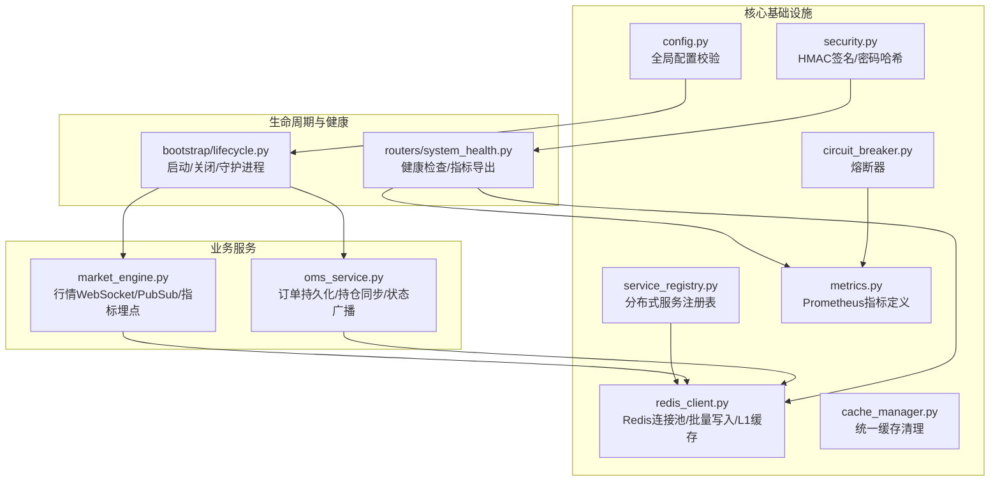
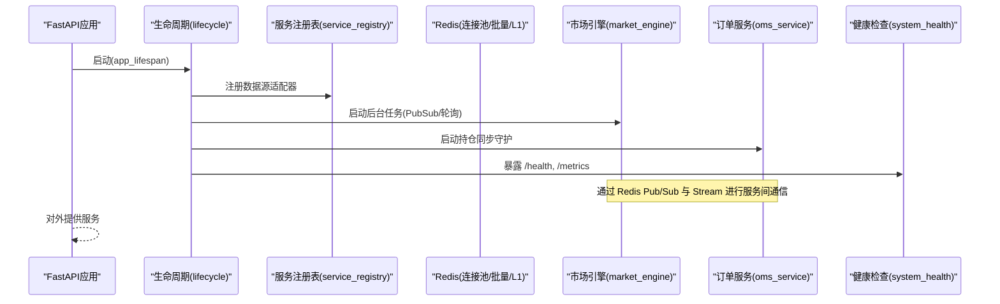
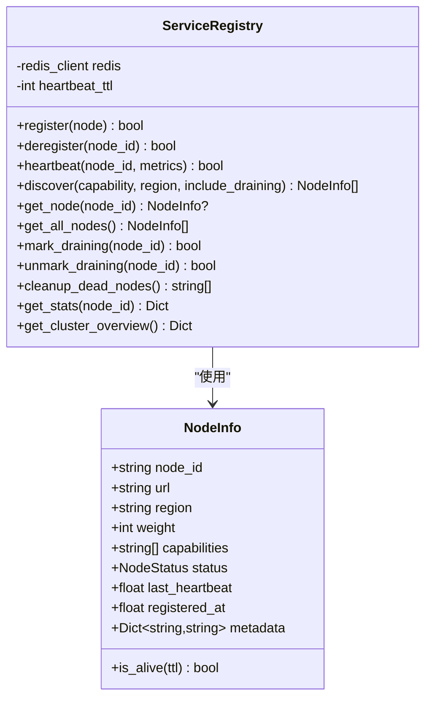
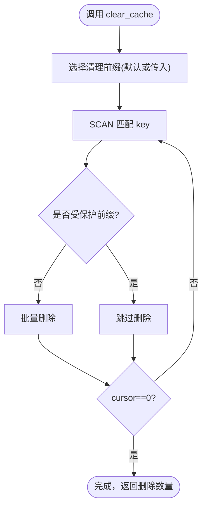
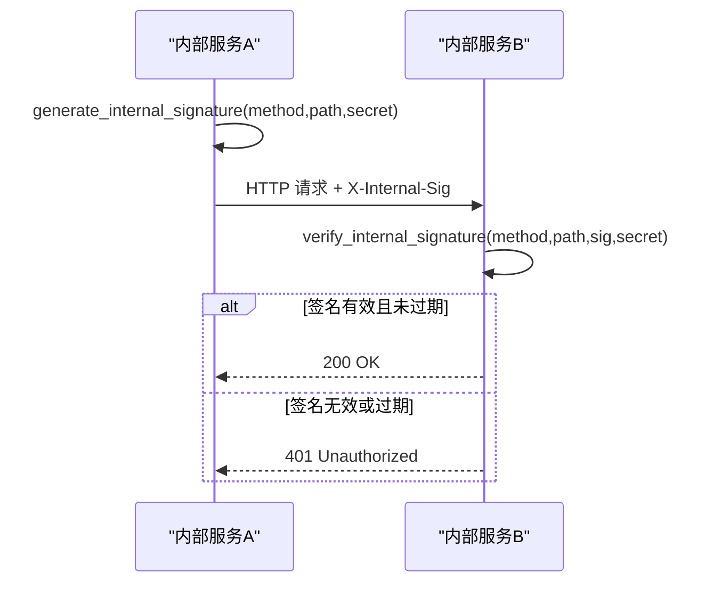
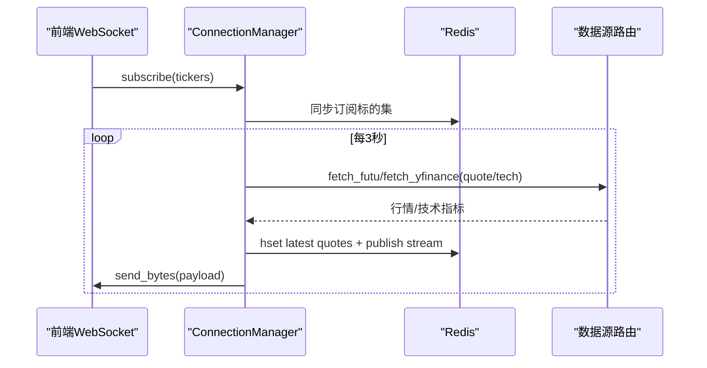
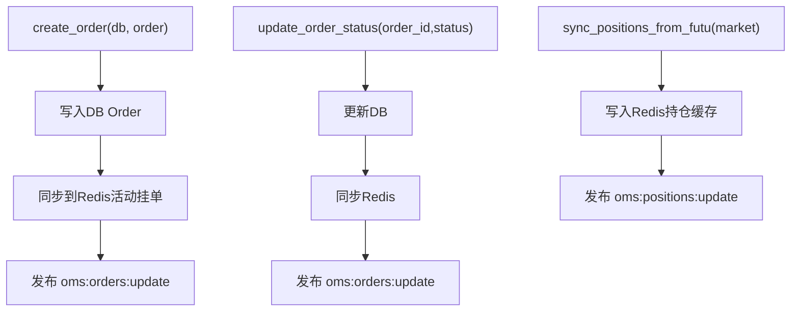
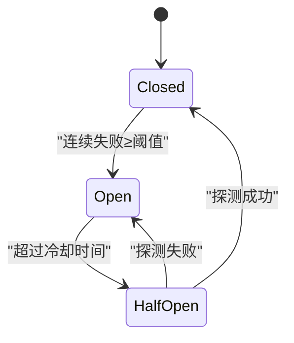
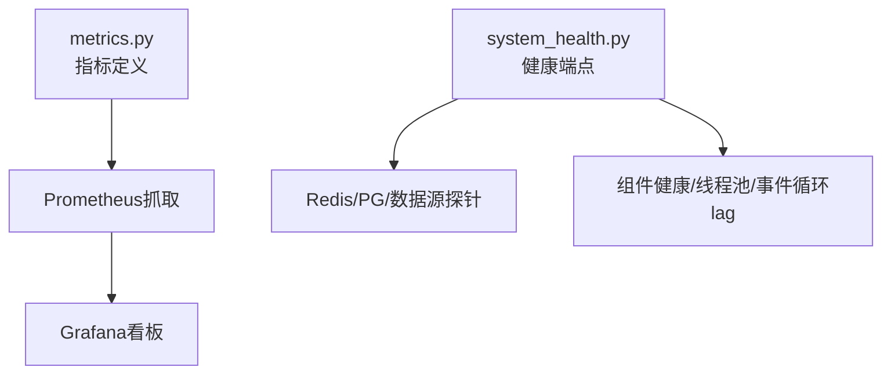
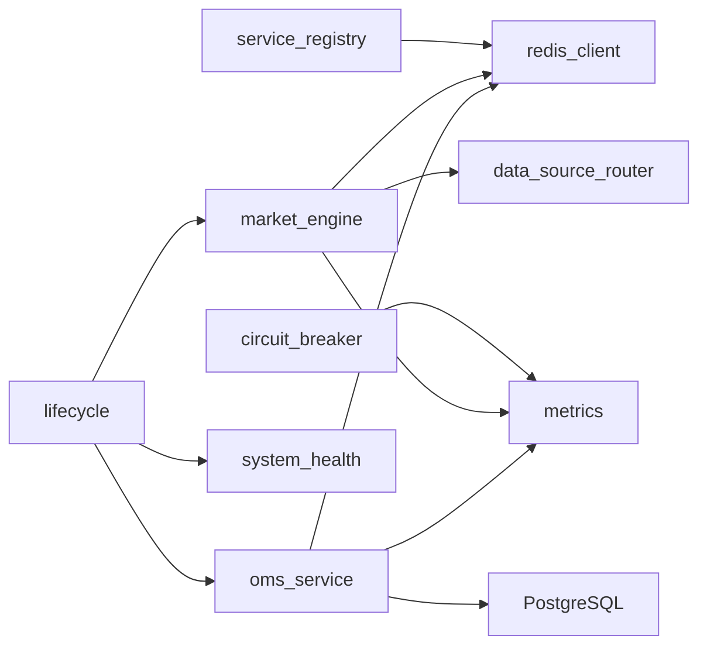

# 核心服务模块

<cite>
**本文引用的文件**
- [backend/core/service_registry.py](file://backend/core/service_registry.py)
- [backend/core/cache_manager.py](file://backend/core/cache_manager.py)
- [backend/core/redis_client.py](file://backend/core/redis_client.py)
- [backend/core/security.py](file://backend/core/security.py)
- [backend/services/market_engine.py](file://backend/services/market_engine.py)
- [backend/services/oms_service.py](file://backend/services/oms_service.py)
- [backend/core/metrics.py](file://backend/core/metrics.py)
- [backend/routers/system_health.py](file://backend/routers/system_health.py)
- [backend/core/config.py](file://backend/core/config.py)
- [backend/bootstrap/lifecycle.py](file://backend/bootstrap/lifecycle.py)
- [backend/core/circuit_breaker.py](file://backend/core/circuit_breaker.py)
</cite>

## 目录
1. [简介](#简介)
2. [项目结构](#项目结构)
3. [核心组件](#核心组件)
4. [架构总览](#架构总览)
5. [详细组件分析](#详细组件分析)
6. [依赖关系分析](#依赖关系分析)
7. [性能考量](#性能考量)
8. [故障排查指南](#故障排查指南)
9. [结论](#结论)
10. [附录：扩展开发规范与最佳实践](#附录：扩展开发规范与最佳实践)

## 简介
本技术文档聚焦 Quant Agent 后端核心服务模块，围绕以下目标展开：
- 服务注册中心的设计模式、节点发现与心跳机制
- 依赖注入与服务生命周期管理（启动/关闭）
- 服务间通信协议（Redis Pub/Sub、Stream、Protobuf）
- 缓存管理器实现、Redis 集成与缓存策略配置
- 安全认证模块（HMAC 内部签名、密码哈希）、权限控制要点
- 市场数据服务、策略引擎服务、订单管理服务的具体实现
- 服务扩展开发指南（新增业务服务、接口实现、故障处理）
- 服务监控、健康检查、性能指标收集方法
- 面向服务开发者的规范与最佳实践

## 项目结构
后端核心能力集中在 backend/core 与 backend/services，辅以 bootstrap 生命周期管理、routers 暴露健康与指标端点。关键目录与职责：
- backend/core：基础设施（Redis、缓存、熔断器、指标、配置、安全、服务注册表）
- backend/services：业务服务（行情推送 OMS、OMS 订单管理等）
- backend/bootstrap：应用生命周期（启动时注册数据源、拉起后台任务；关闭时优雅回收资源）
- backend/routers：系统健康检查、Prometheus 指标导出等

图表来源
- [backend/core/service_registry.py:1-417](file://backend/core/service_registry.py#L1-L417)
- [backend/core/redis_client.py:1-252](file://backend/core/redis_client.py#L1-L252)
- [backend/core/cache_manager.py:1-75](file://backend/core/cache_manager.py#L1-L75)
- [backend/core/circuit_breaker.py:1-379](file://backend/core/circuit_breaker.py#L1-L379)
- [backend/core/metrics.py:1-641](file://backend/core/metrics.py#L1-L641)
- [backend/core/security.py:1-160](file://backend/core/security.py#L1-L160)
- [backend/core/config.py:1-134](file://backend/core/config.py#L1-L134)
- [backend/services/market_engine.py:1-605](file://backend/services/market_engine.py#L1-L605)
- [backend/services/oms_service.py:1-276](file://backend/services/oms_service.py#L1-L276)
- [backend/bootstrap/lifecycle.py:1-492](file://backend/bootstrap/lifecycle.py#L1-L492)
- [backend/routers/system_health.py:1-421](file://backend/routers/system_health.py#L1-L421)

章节来源
- [backend/bootstrap/lifecycle.py:1-492](file://backend/bootstrap/lifecycle.py#L1-L492)
- [backend/routers/system_health.py:1-421](file://backend/routers/system_health.py#L1-L421)

## 核心组件
- 服务注册中心：基于 Redis Hash/ZSet/Set 的分布式节点注册、心跳、优雅下线与统计
- 缓存管理器：统一按前缀清理业务缓存，保护交易态键空间
- Redis 客户端：连接池、异步批量写入队列、进程内 L1 缓存
- 熔断器：CLOSED/OPEN/HALF_OPEN 状态机，限流错误可排除，指标上报
- 指标体系：Prometheus 指标定义（行情、WS、Redis、熔断、数据源、质量、线程水位等）
- 安全模块：HMAC 内部签名生成与验证、bcrypt 密码哈希
- 配置中心：Pydantic Settings 强校验，关键配置缺失 fail-fast
- 市场引擎：WebSocket 订阅、Redis Pub/Sub 广播、Protobuf 序列化、告警与兜底轮询
- OMS 服务：订单持久化、活动挂单缓存、成交记录、持仓同步与广播
- 生命周期：启动时注册数据源、初始化默认管理员、拉起各类守护进程；关闭时优雅回收

章节来源
- [backend/core/service_registry.py:1-417](file://backend/core/service_registry.py#L1-L417)
- [backend/core/cache_manager.py:1-75](file://backend/core/cache_manager.py#L1-L75)
- [backend/core/redis_client.py:1-252](file://backend/core/redis_client.py#L1-L252)
- [backend/core/circuit_breaker.py:1-379](file://backend/core/circuit_breaker.py#L1-L379)
- [backend/core/metrics.py:1-641](file://backend/core/metrics.py#L1-L641)
- [backend/core/security.py:1-160](file://backend/core/security.py#L1-L160)
- [backend/core/config.py:1-134](file://backend/core/config.py#L1-L134)
- [backend/services/market_engine.py:1-605](file://backend/services/market_engine.py#L1-L605)
- [backend/services/oms_service.py:1-276](file://backend/services/oms_service.py#L1-L276)
- [backend/bootstrap/lifecycle.py:1-492](file://backend/bootstrap/lifecycle.py#L1-L492)

## 架构总览
Quant Agent 采用“核心基础设施 + 业务服务 + 生命周期编排”的分层架构：
- 基础设施层提供 Redis、缓存、熔断、指标、安全、配置、服务注册等通用能力
- 业务服务层封装市场数据、OMS 等具体领域逻辑，复用基础设施
- 生命周期层负责启动时装配、拉起后台任务，以及关闭时的优雅回收

图表来源
- [backend/bootstrap/lifecycle.py:42-150](file://backend/bootstrap/lifecycle.py#L42-L150)
- [backend/core/service_registry.py:69-229](file://backend/core/service_registry.py#L69-L229)
- [backend/services/market_engine.py:115-199](file://backend/services/market_engine.py#L115-L199)
- [backend/services/oms_service.py:29-143](file://backend/services/oms_service.py#L29-L143)
- [backend/routers/system_health.py:173-246](file://backend/routers/system_health.py#L173-L246)

## 详细组件分析

### 服务注册中心（ServiceRegistry）
- 设计模式：基于 Redis 三结构协同（Hash 存储节点信息、ZSet 维护心跳时间、Set 标记优雅下线），实现跨节点的服务注册与发现
- 关键能力：
  - 注册/注销：原子 pipeline 写入节点信息与心跳
  - 心跳：更新 ZSet score 与节点 last_heartbeat，支持附带 metrics
  - 发现：按 capability/region 过滤，排除 dead/drain 节点，按权重排序
  - 优雅下线：mark/unmark draining，discover 默认不返回 draining
  - 死节点清理：定时扫描 ZSet 超时节点并批量清理
  - 统计：原子递增节点指标，设置 TTL
  - 集群总览：汇总 active/draining/dead 节点数与区域分布

图表来源
- [backend/core/service_registry.py:51-67](file://backend/core/service_registry.py#L51-L67)
- [backend/core/service_registry.py:69-417](file://backend/core/service_registry.py#L69-L417)

章节来源
- [backend/core/service_registry.py:1-417](file://backend/core/service_registry.py#L1-L417)

### 缓存管理器与 Redis 集成
- 缓存管理器：集中清理业务缓存，受保护前缀（OMS 活动订单/状态/持仓）绝不触碰，避免误删交易态数据
- Redis 客户端：
  - 连接池：统一 host/port/password，限制最大连接数
  - 异步批量写入队列：减少高频 set 的网络 RTT 与带宽占用，支持优雅关闭
  - 进程内 L1 缓存：短 TTL 本地字典，自动清理过期键，容量超限熔断清空

图表来源
- [backend/core/cache_manager.py:47-75](file://backend/core/cache_manager.py#L47-L75)
- [backend/core/redis_client.py:46-177](file://backend/core/redis_client.py#L46-L177)
- [backend/core/redis_client.py:184-252](file://backend/core/redis_client.py#L184-L252)

章节来源
- [backend/core/cache_manager.py:1-75](file://backend/core/cache_manager.py#L1-L75)
- [backend/core/redis_client.py:1-252](file://backend/core/redis_client.py#L1-L252)

### 安全认证模块
- HMAC 内部签名：用于内网服务间调用防横向渗透，包含时间戳与过期校验
- 密码哈希：bcrypt 生成与验证，支持 rounds 配置
- FastAPI 依赖：verify_internal_request 作为依赖装饰内部接口

图表来源
- [backend/core/security.py:37-119](file://backend/core/security.py#L37-L119)
- [backend/core/security.py:121-160](file://backend/core/security.py#L121-L160)

章节来源
- [backend/core/security.py:1-160](file://backend/core/security.py#L1-L160)

### 市场数据服务（Market Engine）
- WebSocket 管理：连接/断开、订阅/反订阅、追补历史消息（Redis Stream XRANGE）
- 数据总线：Protobuf 序列化的 QuoteData 写入 Redis Hash 与 Pub/Sub 广播
- 背景任务：
  - 技术指标缓存刷新（优先 Futu，失败回退 YFinance，串行防封）
  - 资金流向与席位低频拉取（5 分钟粒度）
  - 账户快照与宏观风控预警（分布式锁防抖）
- 指标埋点：行情延迟、总量、WS 连接数、消息发送量等

图表来源
- [backend/services/market_engine.py:39-113](file://backend/services/market_engine.py#L39-L113)
- [backend/services/market_engine.py:115-199](file://backend/services/market_engine.py#L115-L199)
- [backend/services/market_engine.py:296-331](file://backend/services/market_engine.py#L296-L331)
- [backend/services/market_engine.py:332-605](file://backend/services/market_engine.py#L332-L605)

章节来源
- [backend/services/market_engine.py:1-605](file://backend/services/market_engine.py#L1-L605)

### 订单管理服务（OMS Service）
- 订单持久化：创建订单到 PostgreSQL，并同步到 Redis 活动挂单缓存
- 状态同步：更新订单状态后广播变更事件（Pub/Sub）
- 历史成交：从 trade_logs 读取真实成交记录
- 持仓同步：从 Futu 拉取持仓写入 Redis，并广播更新
- Kill Switch：熔断时将活动订单批量标记为 CANCELLED

图表来源
- [backend/services/oms_service.py:34-143](file://backend/services/oms_service.py#L34-L143)
- [backend/services/oms_service.py:155-193](file://backend/services/oms_service.py#L155-L193)
- [backend/services/oms_service.py:197-244](file://backend/services/oms_service.py#L197-L244)

章节来源
- [backend/services/oms_service.py:1-276](file://backend/services/oms_service.py#L1-L276)

### 熔断器（Circuit Breaker）
- 状态机：CLOSED → OPEN（连续失败阈值）→ HALF_OPEN（冷却后探测）→ CLOSED（成功）/ OPEN（失败）
- 限流错误排除：可通过 error_classifier 或 is_rate_limit_error 钩子将限流类错误排除在失败计数之外
- 指标上报：状态切换次数、当前状态等

图表来源
- [backend/core/circuit_breaker.py:45-97](file://backend/core/circuit_breaker.py#L45-L97)
- [backend/core/circuit_breaker.py:147-218](file://backend/core/circuit_breaker.py#L147-L218)

章节来源
- [backend/core/circuit_breaker.py:1-379](file://backend/core/circuit_breaker.py#L1-L379)

### 指标与监控
- Prometheus 指标：行情延迟/总量/陈旧度、WS 连接/消息、Redis 队列深度/操作延迟、熔断器状态、数据源可用性/拨测、数据质量、线程水位等
- 健康检查：/health（liveness）、/health/ready（readiness，含 Redis/PG/数据源）、/health/deep（全链路诊断）
- 指标导出：/metrics（Basic Auth 保护）

图表来源
- [backend/core/metrics.py:1-641](file://backend/core/metrics.py#L1-L641)
- [backend/routers/system_health.py:51-56](file://backend/routers/system_health.py#L51-L56)
- [backend/routers/system_health.py:173-355](file://backend/routers/system_health.py#L173-L355)

章节来源
- [backend/core/metrics.py:1-641](file://backend/core/metrics.py#L1-L641)
- [backend/routers/system_health.py:1-421](file://backend/routers/system_health.py#L1-L421)

## 依赖关系分析
- 服务注册中心依赖 Redis 三结构，提供节点发现与统计
- 市场引擎依赖 Redis Pub/Sub、Stream、L1 缓存与数据源路由
- OMS 服务依赖 PostgreSQL 与 Redis（活动挂单、持仓缓存、Pub/Sub）
- 生命周期管理协调各服务启动与关闭，确保资源有序释放
- 熔断器与指标模块被多服务复用，形成横切关注点

图表来源
- [backend/core/service_registry.py:69-229](file://backend/core/service_registry.py#L69-L229)
- [backend/services/market_engine.py:115-199](file://backend/services/market_engine.py#L115-L199)
- [backend/services/oms_service.py:29-143](file://backend/services/oms_service.py#L29-L143)
- [backend/bootstrap/lifecycle.py:42-150](file://backend/bootstrap/lifecycle.py#L42-L150)
- [backend/core/circuit_breaker.py:64-97](file://backend/core/circuit_breaker.py#L64-L97)
- [backend/core/metrics.py:1-641](file://backend/core/metrics.py#L1-L641)

章节来源
- [backend/core/service_registry.py:1-417](file://backend/core/service_registry.py#L1-L417)
- [backend/services/market_engine.py:1-605](file://backend/services/market_engine.py#L1-L605)
- [backend/services/oms_service.py:1-276](file://backend/services/oms_service.py#L1-L276)
- [backend/bootstrap/lifecycle.py:1-492](file://backend/bootstrap/lifecycle.py#L1-L492)
- [backend/core/circuit_breaker.py:1-379](file://backend/core/circuit_breaker.py#L1-L379)
- [backend/core/metrics.py:1-641](file://backend/core/metrics.py#L1-L641)

## 性能考量
- Redis 批量写入：通过异步队列聚合 set 操作，降低网络往返与带宽压力
- L1 缓存：进程内短效缓存，消除极高频读取的 Redis 开销，具备容量熔断与过期清理
- 行情推送优化：
  - Protobuf 二进制传输，减少序列化体积
  - 批量压缩帧（zlib）发送，降低 WebSocket 带宽
  - 技术指标串行拉取与退避，防止外部 API 封禁
- 熔断器：快速失败与半开探测，避免雪崩
- 线程池限制：全局 asyncio/AnyIO 线程池上限，防止 OOM
- 指标观测：延迟、队列深度、连接数、错误率等指标用于定位瓶颈

[本节为通用性能讨论，无需特定文件引用]

## 故障排查指南
- 健康检查
  - /health：进程存活即 200，适合 livenessProbe
  - /health/ready：Redis/PG/至少一个数据源连通才就绪，否则 503
  - /health/deep：组件健康、数据源就绪、采集器心跳、WS 连接数、线程池、事件循环 lag、熔断器状态
- 指标导出
  - /metrics：Basic Auth 保护，输出 Prometheus 格式指标
- 常见问题定位
  - Redis 不可用：检查 /health/ready 中 redis 字段
  - 数据源不可用：查看 data_sources_ready 与各 source 健康状态
  - 事件循环拥塞：观察 event_loop_lag_seconds
  - 线程耗尽：观察 PROCESS_THREAD_COUNT 与告警阈值
  - 熔断器频繁打开：检查对应服务的错误类型与限流策略

章节来源
- [backend/routers/system_health.py:173-355](file://backend/routers/system_health.py#L173-L355)
- [backend/core/metrics.py:596-619](file://backend/core/metrics.py#L596-L619)

## 结论
Quant Agent 核心服务模块以 Redis 为数据总线，结合服务注册中心、熔断器、指标与安全能力，构建了高可用、可扩展、可观测的后端基础。市场引擎与 OMS 服务通过 Pub/Sub 与 Stream 实现低延迟实时通信，生命周期管理确保服务启动与关闭的健壮性。通过完善的健康检查与指标体系，运维与开发者能够快速定位问题并进行容量规划与优化。

[本节为总结性内容，无需特定文件引用]

## 附录：扩展开发规范与最佳实践
- 新增业务服务
  - 在 backend/services 下创建独立模块，遵循单一职责原则
  - 通过 Redis Pub/Sub 或 Stream 与其他服务解耦通信
  - 使用熔断器保护外部依赖，避免级联故障
  - 接入指标埋点（延迟、错误、吞吐等）
- 实现服务接口
  - 明确输入输出契约，使用 Pydantic 模型校验
  - 对异常进行分类与上报，区分限流/超时/网络错误
  - 使用服务注册中心进行节点发现与负载均衡
- 处理服务故障
  - 启用熔断器与重试策略，合理设置退避时间
  - 通过健康检查与指标告警及时发现异常
  - 使用缓存降级与兜底数据保证基本可用性
- 监控与可观测性
  - 暴露 /metrics 端点，接入 Prometheus 与 Grafana
  - 实现 /health 系列端点，便于容器编排与健康探测
  - 记录关键路径日志，配合结构化日志工具
- 安全与权限
  - 内部服务调用使用 HMAC 签名，防止越权访问
  - 敏感配置通过环境变量注入，禁止硬编码
  - 密码使用 bcrypt 哈希存储，定期轮换密钥

[本节为通用规范与实践建议，无需特定文件引用]
