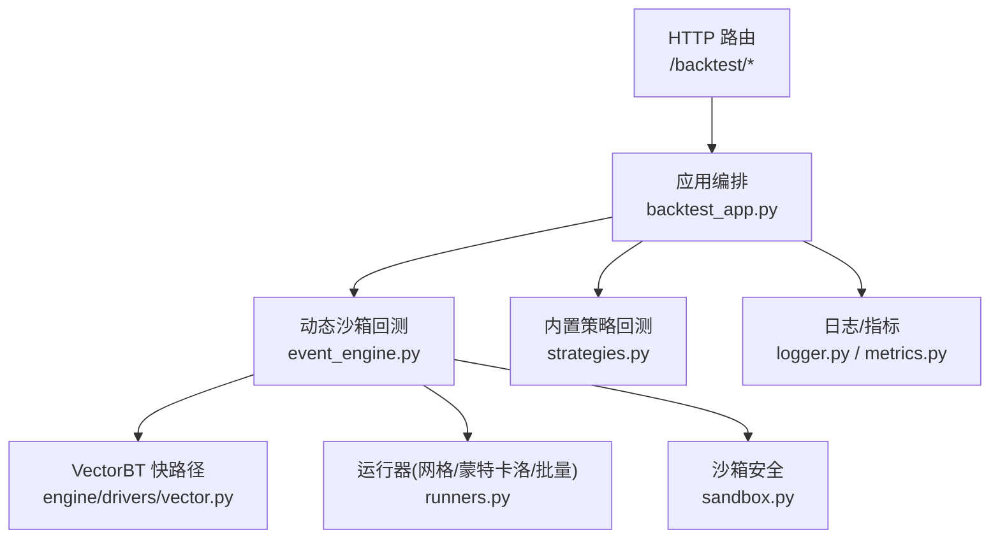
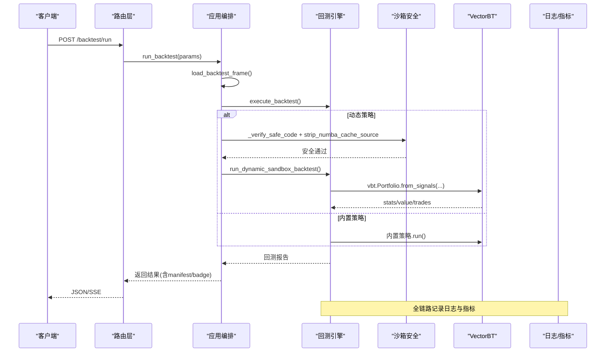
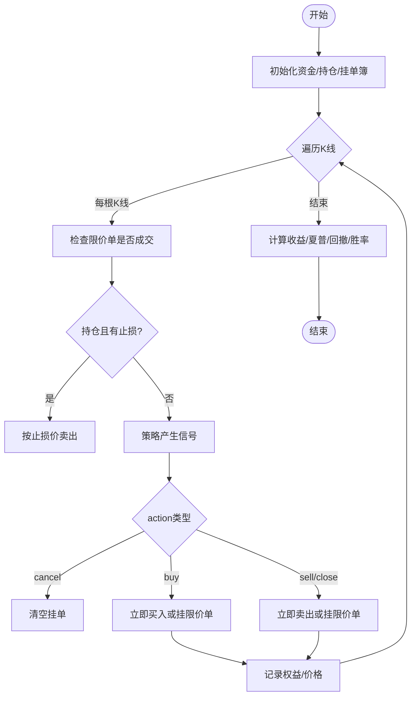
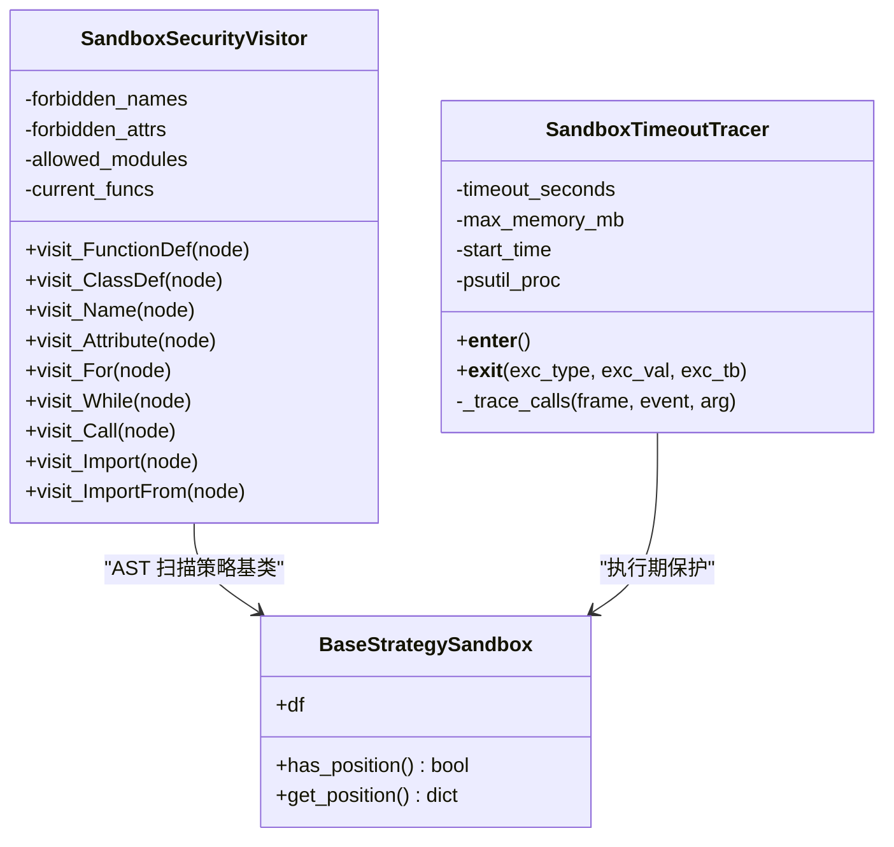
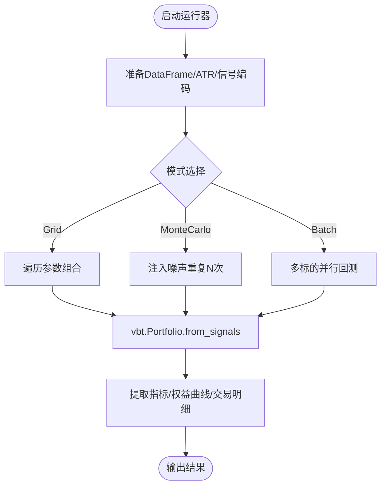
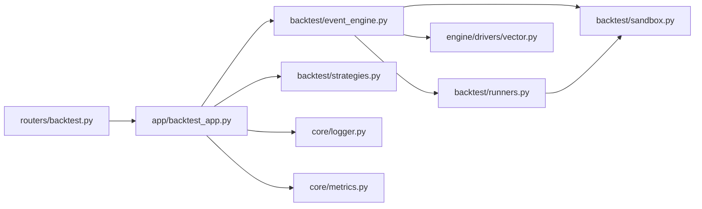

# 回测引擎

<cite>
**本文引用的文件**
- [event_engine.py](file://backend/backtest/event_engine.py)
- [runners.py](file://backend/backtest/runners.py)
- [sandbox.py](file://backend/backtest/sandbox.py)
- [strategies.py](file://backend/backtest/strategies.py)
- [vector.py](file://backend/engine/drivers/vector.py)
- [backtest_app.py](file://backend/app/backtest_app.py)
- [backtest.py](file://backend/routers/backtest.py)
- [logger.py](file://backend/core/logger.py)
- [metrics.py](file://backend/core/metrics.py)
</cite>

## 目录
1. [简介](#简介)
2. [项目结构](#项目结构)
3. [核心组件](#核心组件)
4. [架构总览](#架构总览)
5. [详细组件分析](#详细组件分析)
6. [依赖关系分析](#依赖关系分析)
7. [性能与内存优化](#性能与内存优化)
8. [故障排查指南](#故障排查指南)
9. [结论](#结论)
10. [附录：配置项与结果指标](#附录配置项与结果指标)

## 简介
本技术文档面向“回测引擎”模块，系统性阐述基于 VectorBT 的高性能回测框架实现，包括向量化计算、内存优化、并行处理、事件驱动撮合、沙箱隔离与安全策略、回测参数配置、结果分析与调试方法。目标是帮助读者在不深入源码的情况下也能理解系统如何工作、如何扩展以及如何排障。

## 项目结构
回测相关代码主要分布在以下路径：
- 事件驱动与动态沙箱回测入口：backend/backtest/event_engine.py
- 运行器（网格搜索、蒙特卡洛、批量回测）：backend/backtest/runners.py
- 沙箱安全与基础设施：backend/backtest/sandbox.py
- 内置矢量化策略示例：backend/backtest/strategies.py
- VectorBT 快路径执行器（统一接口）：backend/engine/drivers/vector.py
- HTTP 路由与应用编排：backend/routers/backtest.py、backend/app/backtest_app.py
- 日志与可观测性：backend/core/logger.py、backend/core/metrics.py

图表来源
- [backtest.py:145-218](file://backend/routers/backtest.py#L145-L218)
- [backtest_app.py:166-221](file://backend/app/backtest_app.py#L166-L221)
- [event_engine.py:274-461](file://backend/backtest/event_engine.py#L274-L461)
- [runners.py:148-569](file://backend/backtest/runners.py#L148-L569)
- [sandbox.py:147-345](file://backend/backtest/sandbox.py#L147-L345)
- [vector.py:45-133](file://backend/engine/drivers/vector.py#L45-L133)

章节来源
- [backtest.py:145-218](file://backend/routers/backtest.py#L145-L218)
- [backtest_app.py:166-221](file://backend/app/backtest_app.py#L166-L221)

## 核心组件
- 事件驱动回测引擎：逐 K 线推进，支持限价单挂单簿、动态止损、滑点与手续费磨损、逐 K 线调试日志。
- 动态沙箱回测：对大模型生成的策略源码进行 AST 级安全扫描、白名单导入、超时/内存熔断，再选择 VectorBT 或事件驱动引擎执行。
- 运行器：提供网格搜索、蒙特卡洛压力测试、多标的横截面批量回测等能力，全部基于 Numba/VectorBT 向量化加速。
- 内置策略：RSI/MACD/KDJ 共振的完全矢量化策略，演示信号生成与 Portfolio.from_signals 用法。
- VectorBT 快路径执行器：统一策略接口 signals()，输出信号后直接交给 VectorBT 计算绩效与曲线。
- 路由与应用编排：将 HTTP 请求转换为回测任务，支持同步与流式 SSE 进度推送，附加可复现性 manifest。

章节来源
- [event_engine.py:37-271](file://backend/backtest/event_engine.py#L37-L271)
- [event_engine.py:274-461](file://backend/backtest/event_engine.py#L274-L461)
- [runners.py:99-145](file://backend/backtest/runners.py#L99-L145)
- [runners.py:148-569](file://backend/backtest/runners.py#L148-L569)
- [strategies.py:13-204](file://backend/backtest/strategies.py#L13-L204)
- [vector.py:25-133](file://backend/engine/drivers/vector.py#L25-L133)
- [backtest_app.py:54-70](file://backend/app/backtest_app.py#L54-L70)
- [backtest.py:46-61](file://backend/routers/backtest.py#L46-L61)

## 架构总览
整体流程：
- 客户端通过 /backtest/run 或 /backtest/run/stream 发起回测请求。
- 路由层解析参数并调用应用编排层加载数据（快照/Futu/YFinance）。
- 若传入 source_code/class_name，则进入动态沙箱回测；否则使用内置策略。
- 动态沙箱先做 AST 安全校验与装饰器剥离，再尝试 VectorBT 快路径；不兼容时降级为事件驱动引擎。
- 所有耗时计算通过 CPU 进程池执行，避免阻塞主线程。
- 结果附带可复现性 manifest（代码哈希、数据快照 ID、随机种子等）。

图表来源
- [backtest.py:145-218](file://backend/routers/backtest.py#L145-L218)
- [backtest_app.py:166-221](file://backend/app/backtest_app.py#L166-L221)
- [event_engine.py:274-461](file://backend/backtest/event_engine.py#L274-L461)
- [strategies.py:110-204](file://backend/backtest/strategies.py#L110-L204)
- [vector.py:54-133](file://backend/engine/drivers/vector.py#L54-L133)

## 详细组件分析

### 事件驱动回测引擎（Event-Driven Backtester）
- 逐 K 线推进：从第 10 根 K 线开始，维护现金、持仓、权益曲线、交易明细与挂单簿。
- 订单执行：买入/卖出均考虑滑点与手续费，支持限价单挂单簿与动态止损触发。
- 信号处理：兼容 on_bar/on_tick 两种策略接口；支持 cancel、buy、sell/close 动作。
- 指标计算：在结束时计算总收益、夏普比率、最大回撤、胜率、摩擦成本等。
- 调试模式：开启后强制走事件驱动引擎，输出逐 K 线日志便于定位问题。

图表来源
- [event_engine.py:129-271](file://backend/backtest/event_engine.py#L129-L271)

章节来源
- [event_engine.py:37-271](file://backend/backtest/event_engine.py#L37-L271)

### 动态沙箱与安全性
- AST 级静态扫描：禁止 eval/exec/open/compile/globals/locals 等高危内建；限制 import 白名单；拦截危险魔术属性访问；禁止 while 循环与递归；限制 range 规模以防 OOM。
- 装饰器白名单：仅允许 numba 的 njit/jit/vectorize/guvectorize/cfunc/stencil 等纯性能优化装饰器。
- 源码预处理：剥离 Numba cache 参数，避免临时 exec 无法定位缓存导致的异常。
- 执行保护：SandboxTimeoutTracer 基于 sys.settrace 监控执行时间与内存增量，超限时抛出异常中断。
- 文件 I/O 保护：open 被替换为受限版本，强制路径位于隔离目录，防止目录穿越。

图表来源
- [sandbox.py:147-345](file://backend/backtest/sandbox.py#L147-L345)
- [sandbox.py:352-415](file://backend/backtest/sandbox.py#L352-L415)
- [sandbox.py:417-432](file://backend/backtest/sandbox.py#L417-L432)

章节来源
- [sandbox.py:147-345](file://backend/backtest/sandbox.py#L147-L345)
- [sandbox.py:352-415](file://backend/backtest/sandbox.py#L352-L415)

### 运行器（网格搜索、蒙特卡洛、批量回测）
- 网格搜索：遍历参数组合笛卡尔积，按目标指标排序返回 Top N 结果。
- 蒙特卡洛压力测试：对历史价格注入噪声（高斯/拉普拉斯/t分布），评估策略鲁棒性，统计均值/中位数/最差/最好收益、胜率、夏普、最大回撤等。
- 批量回测：对选股器产出的备选池进行统一并行回测，合并投资组合绩效指标。
- 信号驱动：统一适配两类策略契约（类方法或 generate_signals），自动转换为 entries/exits 序列供 VectorBT 使用。

图表来源
- [runners.py:99-145](file://backend/backtest/runners.py#L99-L145)
- [runners.py:148-279](file://backend/backtest/runners.py#L148-L279)
- [runners.py:282-435](file://backend/backtest/runners.py#L282-L435)
- [runners.py:438-569](file://backend/backtest/runners.py#L438-L569)

章节来源
- [runners.py:99-145](file://backend/backtest/runners.py#L99-L145)
- [runners.py:148-569](file://backend/backtest/runners.py#L148-L569)

### 内置矢量化策略（RSI/MACD/KDJ 共振）
- 指标计算：MACD、RSI(14)、KDJ(9,3,3)、ATR(14)，全部向量化。
- 信号生成：结合量价形态与指标背离/交叉，生成 signal 列（1=多，-1=空，0=平）。
- 回测执行：通过 VectorBT 构建投资组合，输出收益、年化收益、夏普、最大回撤、胜率、交易次数、摩擦成本等。

章节来源
- [strategies.py:13-204](file://backend/backtest/strategies.py#L13-L204)

### VectorBT 快路径执行器
- 统一接口：要求策略实现 is_vectorizable() 与 signals(df, params)。
- 数据处理：对齐信号与数据索引，填充缺失值，构造 entries/exits/short_entries/short_exits。
- 结果提取：提取 metrics、equity_curve、trades，并在无 VectorBT 时回退到简单模拟执行。

章节来源
- [vector.py:25-133](file://backend/engine/drivers/vector.py#L25-L133)
- [vector.py:135-289](file://backend/engine/drivers/vector.py#L135-L289)

### 应用编排与路由
- 数据加载：优先读取数据湖快照，其次 Futu OpenD，最后 YFinance，失败抛 BacktestDataError。
- 执行策略：动态策略走沙箱；内置策略直接实例化运行。
- 可复现性：附加 RunManifest（代码哈希、数据快照 ID、随机种子、数据模式），生成 badge。
- 流式进度：SSE 推送阶段进度（编译、匹配、统计、完成）。

章节来源
- [backtest_app.py:72-142](file://backend/app/backtest_app.py#L72-L142)
- [backtest_app.py:166-221](file://backend/app/backtest_app.py#L166-L221)
- [backtest_app.py:224-296](file://backend/app/backtest_app.py#L224-L296)
- [backtest_app.py:299-357](file://backend/app/backtest_app.py#L299-L357)
- [backtest.py:145-218](file://backend/routers/backtest.py#L145-L218)

## 依赖关系分析
- 外部依赖：pandas、numpy、vectorbt、numba（可选）、psutil（可选，用于内存监控）。
- 内部依赖：
  - backtest.event_engine 依赖 runners.sandbox 提供的安全与工具函数。
  - backtest.runners 依赖 sandbox 的安全校验与全局命名空间构建。
  - engine.drivers.vector 依赖 backtest.sandbox._safe_stat 提取指标。
  - app.backtest_app 依赖 routers.backtest 的请求模型与业务编排。
  - core.logger/metrics 提供日志与 Prometheus 指标。

图表来源
- [backtest.py:145-218](file://backend/routers/backtest.py#L145-L218)
- [backtest_app.py:166-221](file://backend/app/backtest_app.py#L166-L221)
- [event_engine.py:274-461](file://backend/backtest/event_engine.py#L274-L461)
- [runners.py:148-569](file://backend/backtest/runners.py#L148-L569)
- [sandbox.py:147-345](file://backend/backtest/sandbox.py#L147-L345)
- [vector.py:45-133](file://backend/engine/drivers/vector.py#L45-L133)
- [logger.py:129-212](file://backend/core/logger.py#L129-L212)
- [metrics.py:1-641](file://backend/core/metrics.py#L1-L641)

章节来源
- [backtest.py:145-218](file://backend/routers/backtest.py#L145-L218)
- [backtest_app.py:166-221](file://backend/app/backtest_app.py#L166-L221)
- [event_engine.py:274-461](file://backend/backtest/event_engine.py#L274-L461)
- [runners.py:148-569](file://backend/backtest/runners.py#L148-L569)
- [sandbox.py:147-345](file://backend/backtest/sandbox.py#L147-L345)
- [vector.py:45-133](file://backend/engine/drivers/vector.py#L45-L133)
- [logger.py:129-212](file://backend/core/logger.py#L129-L212)
- [metrics.py:1-641](file://backend/core/metrics.py#L1-L641)

## 性能与内存优化
- 向量化计算：
  - 策略信号生成尽量使用 Pandas/Numpy 矩阵运算，避免行级迭代（如 iterrows/itertuples 在沙箱中被禁用）。
  - 使用 VectorBT 的 from_signals 一次性构建投资组合，减少 Python 层循环开销。
- 内存优化：
  - 沙箱执行期通过 psutil 抽样检查 RSS 内存增量，超过阈值即熔断，防止 OOM。
  - 数据预处理去重列、统一小写列名、dropna，减少后续计算负担。
- 并行处理：
  - 网格搜索与蒙特卡洛循环通过进程池执行（CPU 密集），避免阻塞主线程。
  - 批量回测对多标的并行计算，聚合结果。
- 资源保护：
  - 超时控制：SandboxTimeoutTracer 限制单次执行时间，防止死循环。
  - 装饰器白名单：仅允许 numba JIT 装饰器，避免自定义装饰器带来的不可控行为。

章节来源
- [sandbox.py:352-415](file://backend/backtest/sandbox.py#L352-L415)
- [runners.py:148-569](file://backend/backtest/runners.py#L148-L569)
- [event_engine.py:129-271](file://backend/backtest/event_engine.py#L129-L271)

## 故障排查指南
- 断点调试：
  - 启用 debug_mode 强制走事件驱动引擎，输出逐 K 线日志，便于定位信号与订单执行问题。
  - 使用 Python 调试器在关键函数处设置断点（注意沙箱可能禁用部分 trace 功能，需留意 SandboxTimeoutTracer 的行为）。
- 日志分析：
  - 查看 logs/debug.log、logs/info.log、logs/warning.log、logs/error.log，按级别分类存储，便于快速定位错误。
  - 关注 Webhook 报警（若配置 ALERT_WEBHOOK_URL），及时捕获严重异常。
- 性能瓶颈定位：
  - 通过 Prometheus 指标观察 K 线查询延迟、数据源延迟、WebSocket 连接数等，识别数据链路瓶颈。
  - 检查沙箱内存与超时异常，必要时调整 noise_level、iterations、param_grid 规模。
- 常见问题：
  - 数据长度不足：清洗 NaN 后少于 10 根 K 线会报错，需检查数据质量。
  - 策略未实现必要接口：必须实现 _calculate_indicators/_generate_signals 或 generate_signals，否则会抛出 ValueError。
  - 非白名单模块导入：AST 扫描会拒绝非法 import，需改用允许的库。

章节来源
- [event_engine.py:129-271](file://backend/backtest/event_engine.py#L129-L271)
- [runners.py:99-145](file://backend/backtest/runners.py#L99-L145)
- [sandbox.py:147-345](file://backend/backtest/sandbox.py#L147-L345)
- [logger.py:129-212](file://backend/core/logger.py#L129-L212)
- [metrics.py:1-641](file://backend/core/metrics.py#L1-L641)

## 结论
该回测引擎以 VectorBT 为核心，结合事件驱动与动态沙箱，实现了高性能、安全可控的回测环境。通过向量化计算、内存与超时保护、并行处理与流式进度推送，满足大规模策略研发与验证需求。建议在实际使用中：
- 优先采用向量化策略实现，充分利用 Numba/VectorBT 加速。
- 合理使用沙箱安全机制，避免引入高风险代码。
- 利用网格搜索与蒙特卡洛评估策略稳健性与过拟合风险。
- 借助日志与指标体系持续优化性能与稳定性。

## 附录：配置项与结果指标

### 回测配置选项
- 初始资金：initial_capital（默认 100000.0）
- 手续费：commission_pct（默认 0.0005）
- 滑点：slippage_pct（默认 0.001）
- ATR 倍数：atr_multiplier（默认 2.0，用于动态止损）
- 数据源：data_source（auto/futu/yfinance）
- 调试模式：debug_mode（布尔）
- 数据快照：data_snapshot_id（字符串或 live）
- 随机种子：random_seed（整数）
- 动态策略：source_code/class_name/params（字符串/字符串/字典）

章节来源
- [backtest_app.py:54-70](file://backend/app/backtest_app.py#L54-L70)
- [backtest.py:46-61](file://backend/routers/backtest.py#L46-L61)

### 回测结果分析方法
- 绩效指标：
  - 总收益：total_return（百分比）
  - 夏普比率：sharpe_ratio
  - 最大回撤：max_drawdown（百分比）
  - 胜率：win_rate（百分比）
  - 摩擦成本：total_friction_cost（货币单位）
  - 交易次数：total_trades
  - 利润因子：profit_factor（部分场景）
- 收益曲线：equity_curve（日期/权益/基准）
- 交易明细：trades（日期/动作/价格/数量/盈亏）
- 风险度量：
  - 最大回撤、夏普比率、胜率、利润因子综合评估策略风险收益特征。
  - 蒙特卡洛结果提供均值/中位数/最差/最好收益、胜率分布、夏普分布等。

章节来源
- [event_engine.py:259-271](file://backend/backtest/event_engine.py#L259-L271)
- [event_engine.py:448-461](file://backend/backtest/event_engine.py#L448-L461)
- [runners.py:228-279](file://backend/backtest/runners.py#L228-L279)
- [runners.py:421-435](file://backend/backtest/runners.py#L421-L435)
- [strategies.py:189-204](file://backend/backtest/strategies.py#L189-L204)