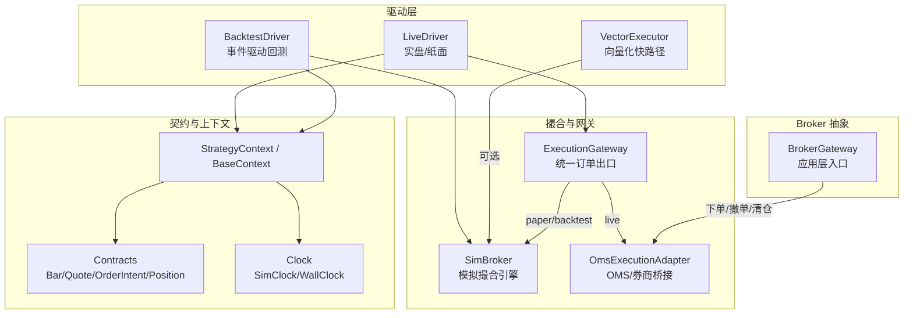
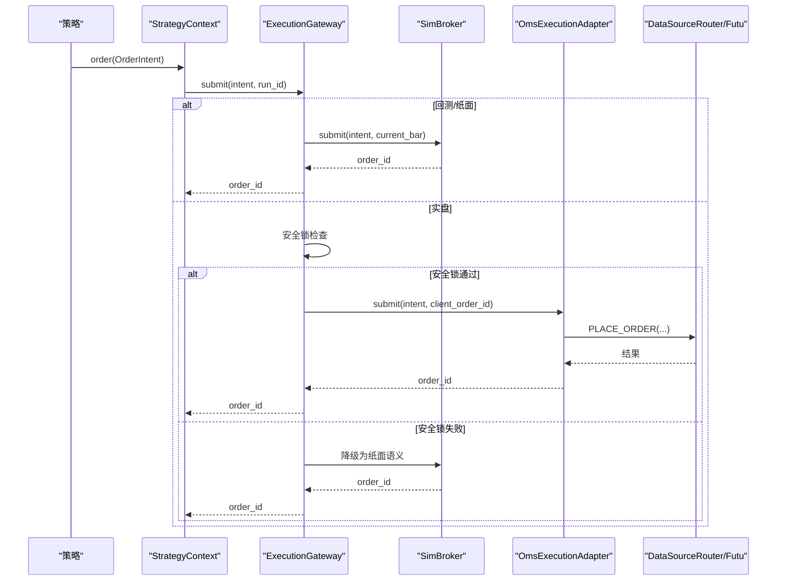
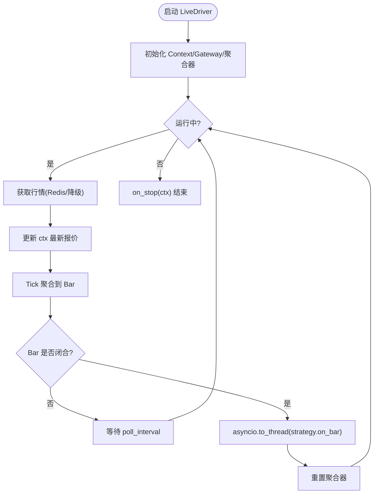
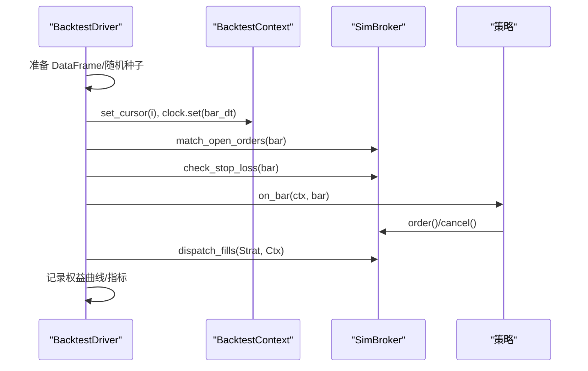
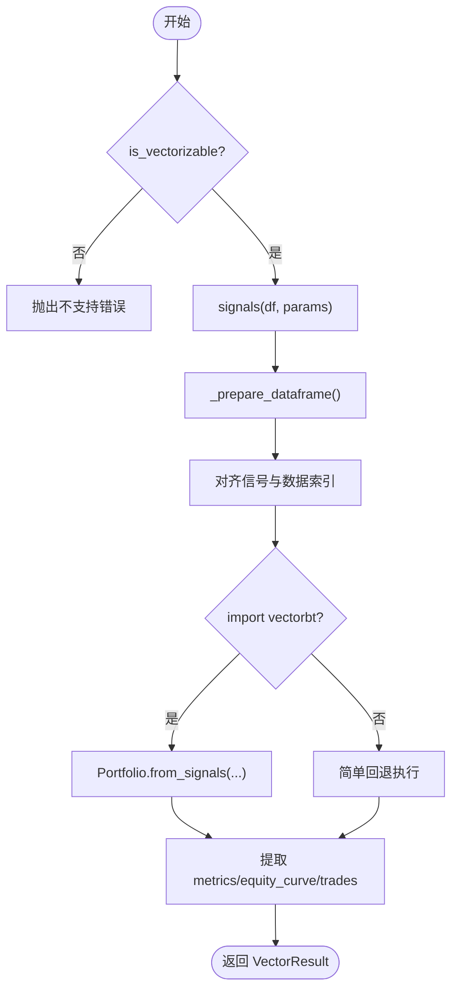
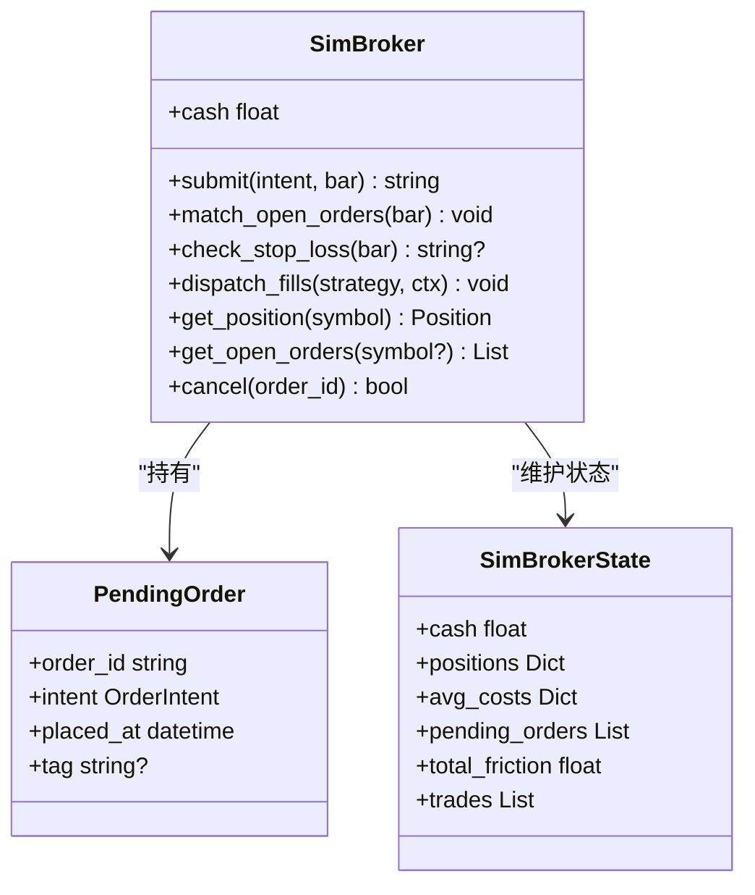
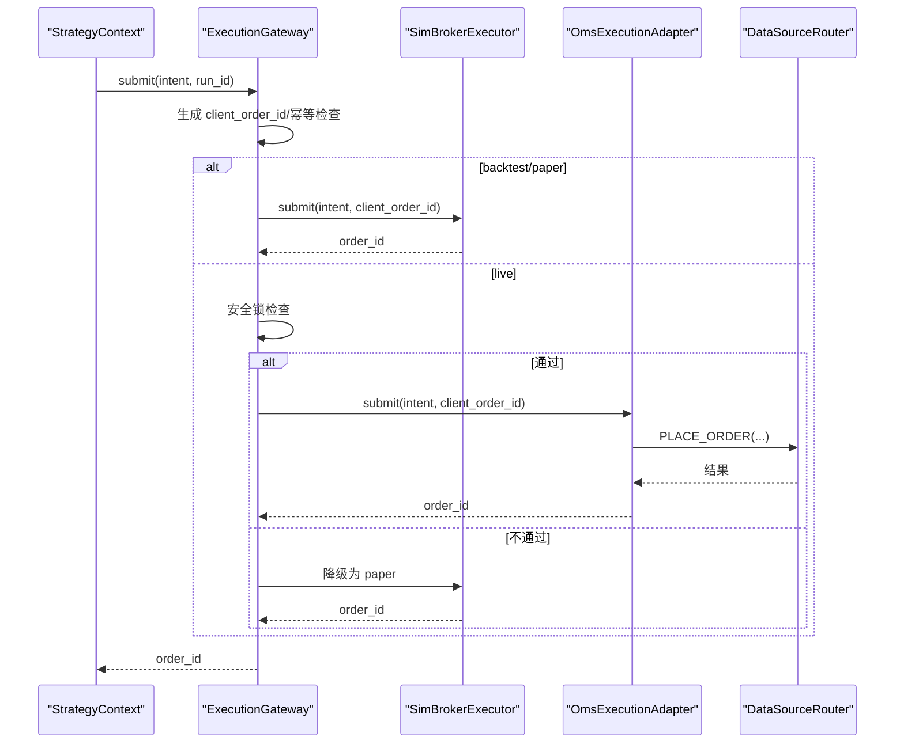
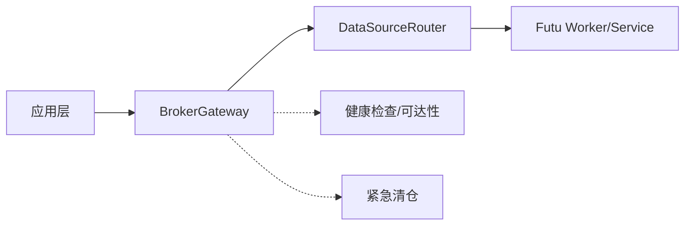
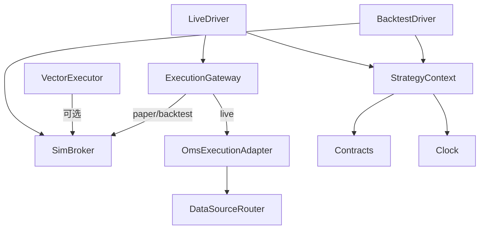

# 执行适配器

<cite>
**本文引用的文件**
- [live.py](file://backend/engine/drivers/live.py)
- [backtest.py](file://backend/engine/drivers/backtest.py)
- [vector.py](file://backend/engine/drivers/vector.py)
- [sim_broker.py](file://backend/engine/drivers/sim_broker.py)
- [gateway.py](file://backend/engine/gateway.py)
- [contracts.py](file://backend/engine/contracts.py)
- [context.py](file://backend/engine/context.py)
- [clock.py](file://backend/engine/clock.py)
- [strategy.py](file://backend/engine/strategy.py)
- [broker.py](file://backend/app/broker.py)
- [legacy_broker.py](file://backend/services/adapters/legacy_broker.py)
</cite>

## 目录
1. [简介](#简介)
2. [项目结构](#项目结构)
3. [核心组件](#核心组件)
4. [架构总览](#架构总览)
5. [详细组件分析](#详细组件分析)
6. [依赖关系分析](#依赖关系分析)
7. [性能考量](#性能考量)
8. [故障排查指南](#故障排查指南)
9. [结论](#结论)
10. [附录](#附录)

## 简介
本技术文档聚焦于“执行适配器”体系，围绕多模式执行架构（回测、纸面、实盘）的统一接口设计展开，深入解析：
- LiveDriver 实盘执行器：行情订阅与降级、tick→bar 聚合、策略隔离执行、订单路由与回报处理。
- BacktestDriver 回测执行器：历史数据回放、SimClock 时间推进、撮合顺序、状态同步与指标计算。
- VectorDriver 向量化执行器：信号快路径、批量计算、内存与性能优化、fallback 机制。
- Broker 抽象层：统一接入多种券商接口，安全锁与降级保障。
- 监控与可靠性：心跳检测、自动重连、异常处理等工程化实践建议。
- 配置与调优：面向不同场景的配置要点与性能优化建议。

## 项目结构
执行适配器的核心位于 backend/engine/drivers 与 backend/engine 下的网关、契约、上下文与时钟模块；Broker 抽象在 services/adapters 中提供统一入口。

图表来源
- [live.py:220-384](file://backend/engine/drivers/live.py#L220-L384)
- [backtest.py:180-399](file://backend/engine/drivers/backtest.py#L180-L399)
- [vector.py:45-289](file://backend/engine/drivers/vector.py#L45-L289)
- [sim_broker.py:59-338](file://backend/engine/drivers/sim_broker.py#L59-L338)
- [gateway.py:98-359](file://backend/engine/gateway.py#L98-L359)
- [context.py:129-172](file://backend/engine/context.py#L129-L172)
- [contracts.py:29-162](file://backend/engine/contracts.py#L29-L162)
- [clock.py:27-57](file://backend/engine/clock.py#L27-L57)
- [legacy_broker.py:17-109](file://backend/services/adapters/legacy_broker.py#L17-L109)

章节来源
- [live.py:220-384](file://backend/engine/drivers/live.py#L220-L384)
- [backtest.py:180-399](file://backend/engine/drivers/backtest.py#L180-L399)
- [vector.py:45-289](file://backend/engine/drivers/vector.py#L45-L289)
- [gateway.py:98-359](file://backend/engine/gateway.py#L98-L359)
- [sim_broker.py:59-338](file://backend/engine/drivers/sim_broker.py#L59-L338)
- [context.py:129-172](file://backend/engine/context.py#L129-L172)
- [contracts.py:29-162](file://backend/engine/contracts.py#L29-L162)
- [clock.py:27-57](file://backend/engine/clock.py#L27-L57)
- [strategy.py:24-90](file://backend/engine/strategy.py#L24-L90)
- [legacy_broker.py:17-109](file://backend/services/adapters/legacy_broker.py#L17-L109)

## 核心组件
- 统一上下文 StrategyContext 与 BaseContext：为策略屏蔽运行环境差异，提供 history/quote/financial/universe、position/cash/equity、order/cancel/open_orders、subscribe/log 等能力。
- 时钟抽象 Clock：SimClock（回测）与 WallClock（实盘/纸面），确保时间一致性，避免前视偏差。
- 契约 Contracts：Bar、QuoteSnapshot、OrderIntent、OrderUpdate、Position、RunManifest，定义跨模式一致的数据模型。
- 执行网关 ExecutionGateway：统一订单出口，按模式路由到 SimBroker 或 OMS 适配器，内置幂等去重与安全锁降级。
- 撮合引擎 SimBroker：限价单挂单/成交、止损触发、滑点与手续费、持仓现金管理、成交回报分发。
- 驱动层：
  - LiveDriver：实时/纸面驱动，Redis 行情流 + 降级轮询，tick→bar 聚合，策略异步隔离执行。
  - BacktestDriver：历史 K 线回放，SimClock 逐 bar 推进，先撮合后策略再回报。
  - VectorExecutor：向量化快路径，基于 signals() 生成信号并调用 VectorBT 或 fallback。
- Broker 抽象：BrokerGateway 作为应用层入口，封装下单、撤单、查询、紧急清仓等能力，通过 DataSourceRouter 路由至券商服务。

章节来源
- [context.py:25-172](file://backend/engine/context.py#L25-L172)
- [clock.py:18-57](file://backend/engine/clock.py#L18-L57)
- [contracts.py:29-162](file://backend/engine/contracts.py#L29-L162)
- [gateway.py:35-208](file://backend/engine/gateway.py#L35-L208)
- [sim_broker.py:28-338](file://backend/engine/drivers/sim_broker.py#L28-L338)
- [live.py:118-384](file://backend/engine/drivers/live.py#L118-L384)
- [backtest.py:59-399](file://backend/engine/drivers/backtest.py#L59-L399)
- [vector.py:25-289](file://backend/engine/drivers/vector.py#L25-L289)
- [strategy.py:24-90](file://backend/engine/strategy.py#L24-L90)
- [legacy_broker.py:17-109](file://backend/services/adapters/legacy_broker.py#L17-L109)

## 架构总览
多模式执行架构以 StrategyContext 为唯一策略 API，通过 ExecutionGateway 将 OrderIntent 路由到对应执行后端。LiveDriver 负责实时/纸面行情与聚合，BacktestDriver 负责历史回放，VectorExecutor 提供向量化快路径。BrokerGateway 提供统一的券商接入能力。

图表来源
- [gateway.py:116-186](file://backend/engine/gateway.py#L116-L186)
- [sim_broker.py:81-113](file://backend/engine/drivers/sim_broker.py#L81-L113)
- [gateway.py:215-359](file://backend/engine/gateway.py#L215-L359)
- [legacy_broker.py:37-109](file://backend/services/adapters/legacy_broker.py#L37-L109)

## 详细组件分析

### LiveDriver 实盘执行器
- 职责：订阅 Redis 行情流，降级轮询，tick→bar 聚合，策略 on_bar 异步隔离执行，订单回报处理。
- 关键实现：
  - TickAccumulator：按 ktype 聚合 tick 为 bar，支持闭合判断与重置。
  - LiveContext：注入 gateway、symbol、最新报价、资金与持仓，history 走 KlineCacheEngine。
  - _run_loop：获取行情 → 更新 ctx → 聚合 bar → 若闭合则调用 strategy.on_bar(ctx, bar) → 重置聚合器。
  - _fetch_quote：优先从 Redis 缓存读取，超时则返回 stale 标记的快照。
  - paper/live 模式：构造 ExecutionGateway 时选择 PAPER/LIVE，paper 模式使用 SimBrokerExecutor。

图表来源
- [live.py:44-111](file://backend/engine/drivers/live.py#L44-L111)
- [live.py:118-203](file://backend/engine/drivers/live.py#L118-L203)
- [live.py:220-384](file://backend/engine/drivers/live.py#L220-L384)

章节来源
- [live.py:44-111](file://backend/engine/drivers/live.py#L44-L111)
- [live.py:118-203](file://backend/engine/drivers/live.py#L118-L203)
- [live.py:220-384](file://backend/engine/drivers/live.py#L220-L384)

### BacktestDriver 回测执行器
- 职责：历史 K 线回放、SimClock 逐 bar 推进、先撮合后策略、分发成交回报、记录权益曲线与指标。
- 关键实现：
  - BacktestContext：history 返回截至当前 bar 的窗口视图；quote 返回当前 bar 收盘价；financial 通过 PIT 查询；universe 通过幸存者偏差追踪器。
  - 主循环：set_cursor → clock.set(bar_dt) → match_open_orders/check_stop_loss → strategy.on_bar → dispatch_fills → 记录权益。
  - 指标计算：总收益、夏普比率、最大回撤、胜率、摩擦成本。

图表来源
- [backtest.py:59-178](file://backend/engine/drivers/backtest.py#L59-L178)
- [backtest.py:180-399](file://backend/engine/drivers/backtest.py#L180-L399)
- [sim_broker.py:115-172](file://backend/engine/drivers/sim_broker.py#L115-L172)

章节来源
- [backtest.py:59-178](file://backend/engine/drivers/backtest.py#L59-L178)
- [backtest.py:180-399](file://backend/engine/drivers/backtest.py#L180-L399)
- [sim_broker.py:115-172](file://backend/engine/drivers/sim_broker.py#L115-L172)

### VectorExecutor 向量化执行器
- 职责：消费策略 signals() 生成信号列，直接构建 VectorBT Portfolio 进行批量计算，输出指标、权益曲线与交易明细。
- 关键实现：
  - is_vectorizable/signals：策略声明矢量化能力与信号函数。
  - 数据准备：对齐信号与数据索引，填充缺失值。
  - 执行路径：优先使用 vectorbt.Portfolio.from_signals，提取 stats/value/trades；若无依赖则 fallback 到简单模拟。
  - 指标提取：总收益、夏普、最大回撤、胜率、费用。

图表来源
- [vector.py:45-289](file://backend/engine/drivers/vector.py#L45-L289)
- [strategy.py:68-90](file://backend/engine/strategy.py#L68-L90)

章节来源
- [vector.py:45-289](file://backend/engine/drivers/vector.py#L45-L289)
- [strategy.py:68-90](file://backend/engine/strategy.py#L68-L90)

### SimBroker 模拟撮合引擎
- 职责：限价单挂单/成交、止损触发、滑点与手续费、持仓现金管理、成交回报分发。
- 关键实现：
  - submit：市价单立即撮合，限价单加入 pending_orders。
  - match_open_orders：用 bar 高低价检查限价单是否可成交。
  - check_stop_loss：多头止损触发卖出。
  - _fill_buy/_fill_sell：更新现金、持仓、均价、记录 trades，生成交割回报。
  - paper_mode：stale 行情拒单、非交易时段拒单。

图表来源
- [sim_broker.py:28-338](file://backend/engine/drivers/sim_broker.py#L28-L338)

章节来源
- [sim_broker.py:28-338](file://backend/engine/drivers/sim_broker.py#L28-L338)

### ExecutionGateway 统一订单出口
- 职责：订单路由（backtest/paper → SimBroker，live → OMS）、三级安全锁、幂等去重、降级路径。
- 关键实现：
  - GatewayMode：BACKTEST/PAPER/LIVE。
  - SafetyLockStatus：REAL_TRADE_EXECUTE、trading_mode_live、kill_switch_inactive。
  - submit：生成 client_order_id，幂等检查，按模式路由；live 模式未通过安全锁则降级为 paper。
  - cancel：按模式转发到对应执行器。
  - OmsExecutionAdapter：订单持久化、模拟盘跳过券商调用、真实下单经 DataSourceRouter.fetch_futu。

图表来源
- [gateway.py:35-208](file://backend/engine/gateway.py#L35-L208)
- [gateway.py:215-359](file://backend/engine/gateway.py#L215-L359)

章节来源
- [gateway.py:35-208](file://backend/engine/gateway.py#L35-L208)
- [gateway.py:215-359](file://backend/engine/gateway.py#L215-L359)

### Broker 抽象层
- 职责：统一接入多种券商接口，封装下单、撤单、查询、紧急清仓等能力。
- 关键实现：
  - BrokerGateway：resolve_market 推断市场，place_order/cancel_order/query_order/get_account_info 通过 data_source_router.fetch_futu。
  - has_trade_ctx：远程可达性检查。
  - execute_emergency_liquidation：远程清仓，返回 ok/reason。
  - app/broker.py：暴露 broker_gateway 供上层使用。

图表来源
- [legacy_broker.py:17-109](file://backend/services/adapters/legacy_broker.py#L17-L109)
- [broker.py:5-10](file://backend/app/broker.py#L5-L10)

章节来源
- [legacy_broker.py:17-109](file://backend/services/adapters/legacy_broker.py#L17-L109)
- [broker.py:5-10](file://backend/app/broker.py#L5-L10)

### 时序与上下文
- 时钟抽象：SimClock 由 Driver 推进，WallClock 返回 UTC 墙钟时间，确保策略无前视。
- 上下文协议：StrategyContext 定义 now/mode/run_id、数据面/账户面/执行面/日志/订阅接口；BaseContext 提供公共实现。
- 契约：Bar/QuoteSnapshot/OrderIntent/OrderUpdate/Position/RunManifest 保证跨模式数据一致性。

章节来源
- [clock.py:18-57](file://backend/engine/clock.py#L18-L57)
- [context.py:25-172](file://backend/engine/context.py#L25-L172)
- [contracts.py:29-162](file://backend/engine/contracts.py#L29-L162)

## 依赖关系分析
- 驱动层依赖上下文与时钟，通过网关提交订单意图。
- 网关根据模式路由到 SimBroker 或 OMS 适配器。
- SimBroker 维护内部状态，驱动撮合与回报分发。
- OMS 适配器依赖 OMS 服务与 DataSourceRouter 完成订单持久化与券商下单。
- BrokerGateway 作为应用层入口，统一封装券商交互。

图表来源
- [live.py:220-384](file://backend/engine/drivers/live.py#L220-L384)
- [backtest.py:180-399](file://backend/engine/drivers/backtest.py#L180-L399)
- [vector.py:45-289](file://backend/engine/drivers/vector.py#L45-L289)
- [gateway.py:98-359](file://backend/engine/gateway.py#L98-L359)
- [sim_broker.py:59-338](file://backend/engine/drivers/sim_broker.py#L59-L338)
- [context.py:129-172](file://backend/engine/context.py#L129-L172)
- [contracts.py:29-162](file://backend/engine/contracts.py#L29-L162)
- [clock.py:27-57](file://backend/engine/clock.py#L27-L57)

章节来源
- [live.py:220-384](file://backend/engine/drivers/live.py#L220-L384)
- [backtest.py:180-399](file://backend/engine/drivers/backtest.py#L180-L399)
- [vector.py:45-289](file://backend/engine/drivers/vector.py#L45-L289)
- [gateway.py:98-359](file://backend/engine/gateway.py#L98-L359)
- [sim_broker.py:59-338](file://backend/engine/drivers/sim_broker.py#L59-L338)
- [context.py:129-172](file://backend/engine/context.py#L129-L172)
- [contracts.py:29-162](file://backend/engine/contracts.py#L29-L162)
- [clock.py:27-57](file://backend/engine/clock.py#L27-L57)

## 性能考量
- 回测模式：
  - 使用 SimClock 与 DataFrame 切片，避免全量复制；合理设置 n 与 ktype 控制历史窗口大小。
  - 指标计算采用向量化操作（pandas/numpy），减少 Python 循环开销。
- 纸面/实盘模式：
  - LiveDriver 使用 asyncio.to_thread 隔离策略执行，避免阻塞事件循环。
  - tick→bar 聚合仅维护最小状态，降低内存占用；poll_interval_seconds 控制轮询频率。
  - 降级路径：stale_timeout_seconds 控制行情新鲜度阈值，避免长时间无消息导致决策滞后。
- 向量化模式：
  - 优先使用 VectorBT 批量计算，利用其底层优化；fallback 路径用于无依赖环境。
  - 信号对齐与填充缺失值，确保输入完整性。
- 撮合与订单：
  - SimBroker 使用列表维护挂单簿，注意大单簿时的性能；可按 symbol 过滤减少遍历。
  - ExecutionGateway 幂等去重避免重复下单；安全锁失败降级保障系统稳定性。

[本节为通用指导，无需特定文件引用]

## 故障排查指南
- 行情降级与 stale：
  - LiveDriver._fetch_quote 在 Redis 不可用或超时返回 stale=True 的 QuoteSnapshot；策略应据此规避下单或采取保守风控。
  - 检查 Redis 连接与缓存键 quant:cache:quote:{symbol} 是否存在。
- 订单被拒：
  - paper_mode 下 stale 行情或非交易时段会拒绝订单；确认 MarketSession 与当前时间。
  - 安全锁失败时 live 订单降级为 paper；检查 REAL_TRADE_EXECUTE、trading_mode、kill_switch 状态。
- 撮合异常：
  - 限价单未成交：检查 bar 高低价与 limit_price 关系；确认 match_open_orders 调用时机。
  - 止损未触发：确认 stop_loss 设置与 bar.low 比较逻辑。
- 资源与性能：
  - 高频 tick 聚合可能导致 CPU 压力；调整 ktype 与 poll_interval_seconds。
  - 大 DataFrame 回测时注意内存占用，必要时分片或减少列数。
- 券商接入：
  - OMS 适配器下单失败：检查 OMS 落库与 DataSourceRouter.fetch_futu 返回；确认 market 推断正确。
  - 紧急清仓：BrokerGateway.execute_emergency_liquidation 返回 ok/reason，记录日志定位问题。

章节来源
- [live.py:346-384](file://backend/engine/drivers/live.py#L346-L384)
- [sim_broker.py:81-113](file://backend/engine/drivers/sim_broker.py#L81-L113)
- [gateway.py:161-186](file://backend/engine/gateway.py#L161-L186)
- [gateway.py:215-359](file://backend/engine/gateway.py#L215-L359)
- [legacy_broker.py:76-109](file://backend/services/adapters/legacy_broker.py#L76-L109)

## 结论
执行适配器体系通过 StrategyContext 统一策略接口，结合 ExecutionGateway 的模式路由与安全锁机制，实现了回测、纸面、实盘的无缝切换与可靠执行。LiveDriver 提供实时行情与聚合能力，BacktestDriver 保证回测的可复现性与准确性，VectorExecutor 提供高性能向量化快路径。Broker 抽象层屏蔽券商差异，支持统一接入与紧急处置。整体架构兼顾可扩展性、可观测性与鲁棒性，适合复杂交易系统的工程化落地。

[本节为总结性内容，无需特定文件引用]

## 附录
- 配置要点（示例说明）：
  - LiveDriverConfig：mode(paper/live)、ktype(K_DAY/K_1M 等)、stale_timeout_seconds、poll_interval_seconds、initial_capital。
  - BacktestConfig：initial_capital、commission_pct、slippage_pct、random_seed、data_snapshot_id、manifest_hash、data_mode。
  - VectorConfig：initial_capital、commission_pct、slippage_pct、freq。
  - SimBrokerConfig：commission_pct、slippage_pct、paper_mode。
- 最佳实践：
  - 策略内禁止直接访问外部服务，全部通过 ctx 获取数据与执行。
  - 使用 RunManifest 绑定代码与数据指纹，确保可复现。
  - 在 live 模式下启用安全锁与 kill switch，防止误操作。
  - 对高频策略考虑向量化快路径，提升迭代效率。

[本节为通用指导，无需特定文件引用]
