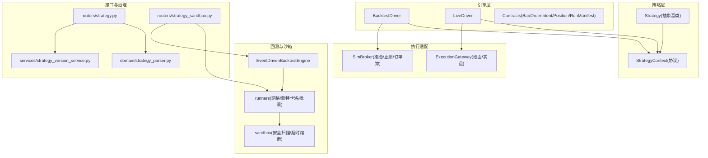
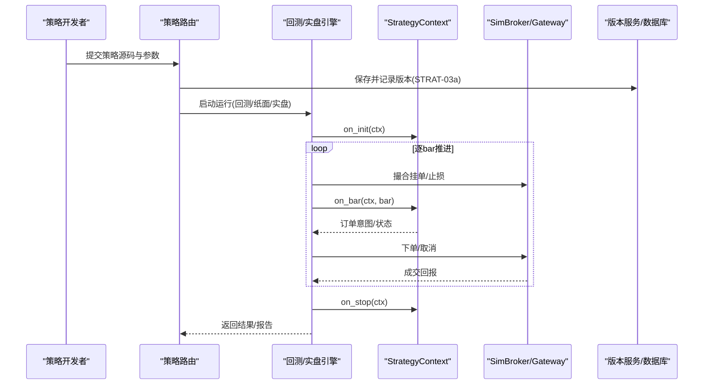
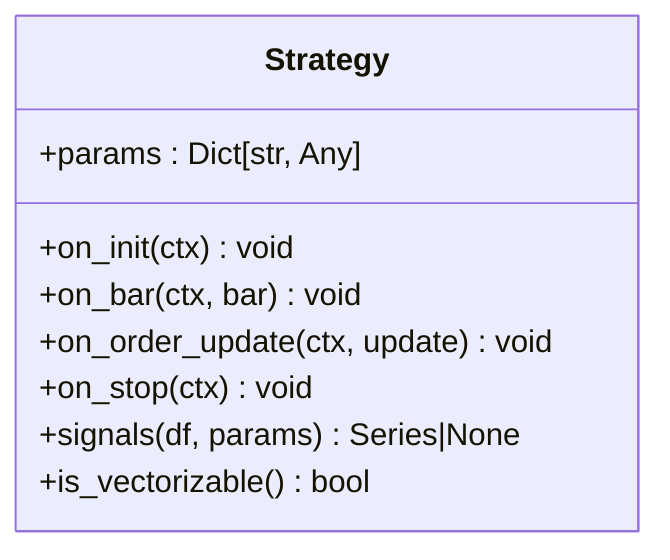
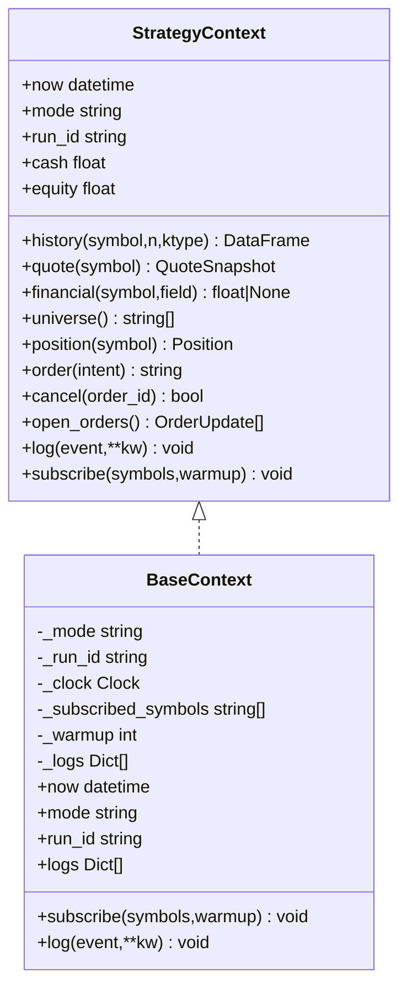
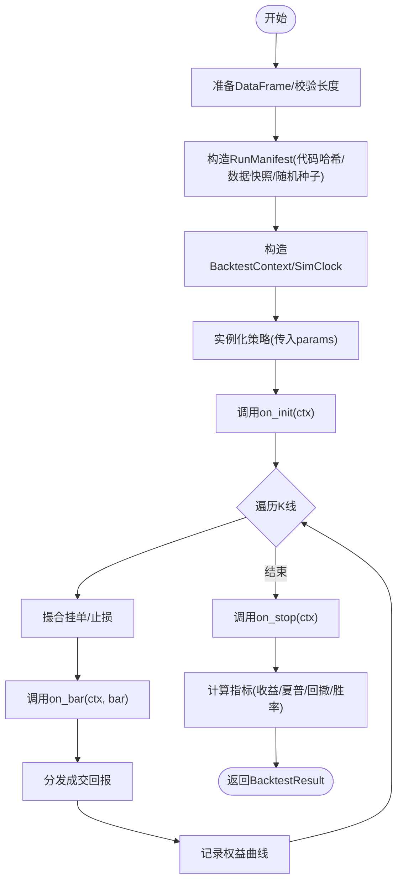
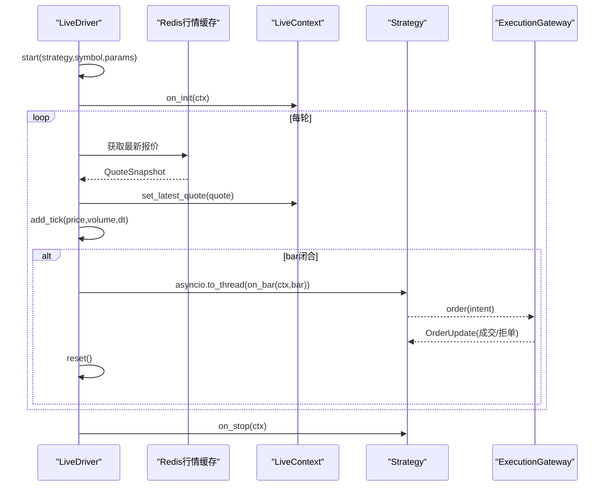
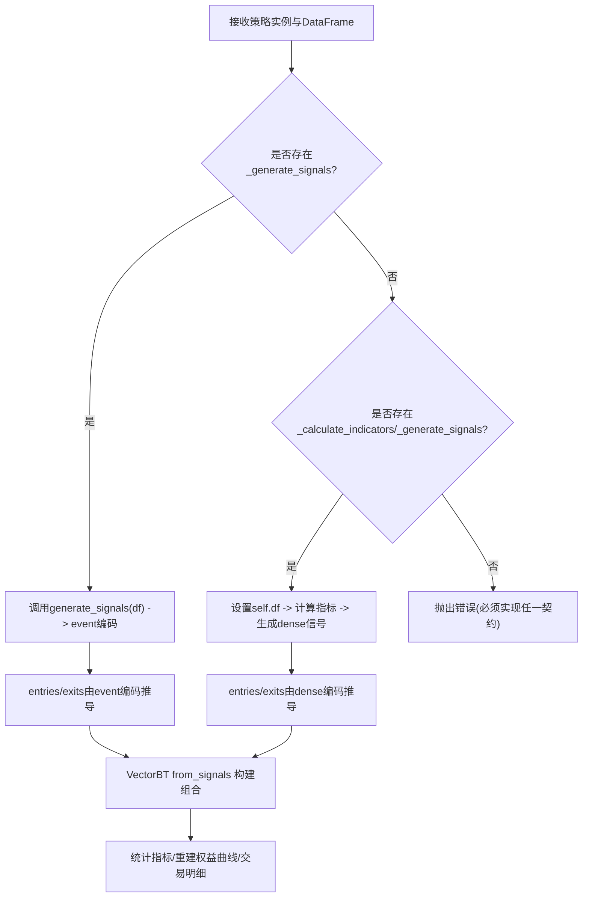
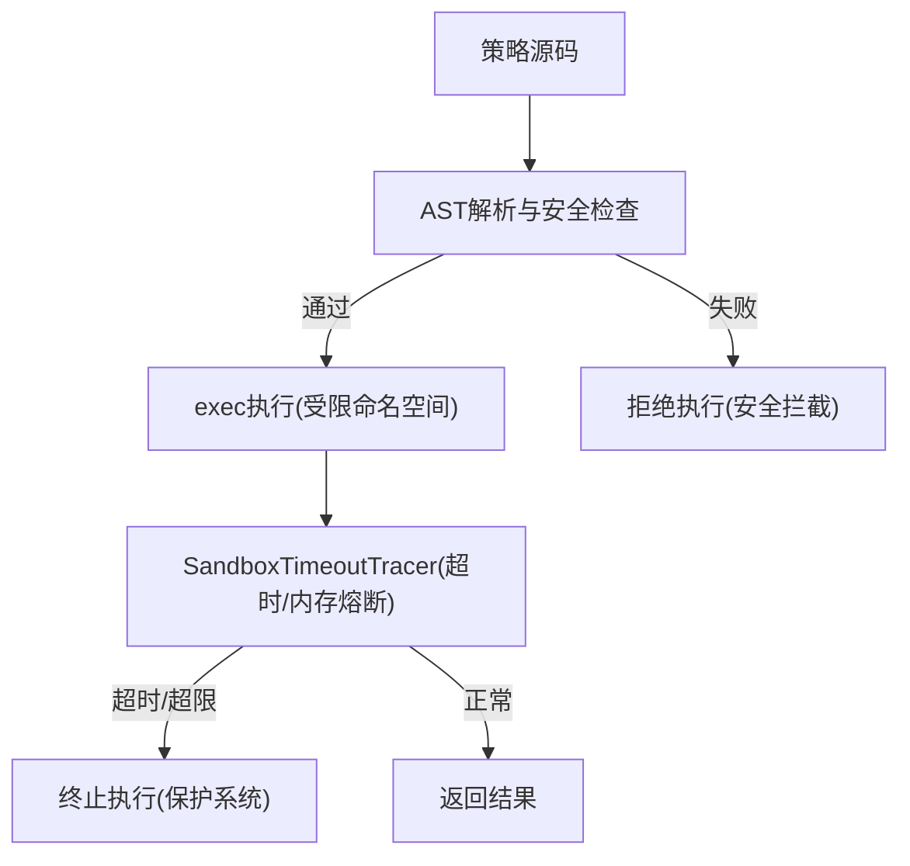
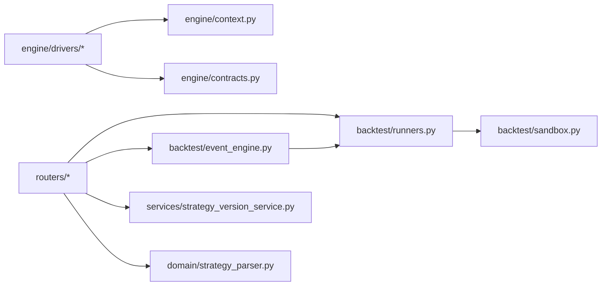

# 策略引擎服务

<cite>
**本文引用的文件**
- [backend/engine/strategy.py](file://backend/engine/strategy.py)
- [backend/engine/context.py](file://backend/engine/context.py)
- [backend/engine/contracts.py](file://backend/engine/contracts.py)
- [backend/engine/drivers/backtest.py](file://backend/engine/drivers/backtest.py)
- [backend/engine/drivers/live.py](file://backend/engine/drivers/live.py)
- [backend/backtest/event_engine.py](file://backend/backtest/event_engine.py)
- [backend/backtest/runners.py](file://backend/backtest/runners.py)
- [backend/backtest/sandbox.py](file://backend/backtest/sandbox.py)
- [backend/domain/strategy_parser.py](file://backend/domain/strategy_parser.py)
- [backend/services/strategy_version_service.py](file://backend/services/strategy_version_service.py)
- [backend/routers/strategy.py](file://backend/routers/strategy.py)
- [backend/routers/strategy_sandbox.py](file://backend/routers/strategy_sandbox.py)
</cite>

## 目录
1. [简介](#简介)
2. [项目结构](#项目结构)
3. [核心组件](#核心组件)
4. [架构总览](#架构总览)
5. [详细组件分析](#详细组件分析)
6. [依赖关系分析](#依赖关系分析)
7. [性能考量](#性能考量)
8. [故障排查指南](#故障排查指南)
9. [结论](#结论)
10. [附录：开发规范与部署指南](#附录：开发规范与部署指南)

## 简介
本技术文档面向 Quant Agent 的策略引擎服务，系统性阐述策略执行框架设计、事件驱动架构、信号生成机制、回测引擎实现、实盘/纸面执行适配、策略解析与参数验证、版本管理、A/B 测试与性能监控、沙箱安全隔离与资源限制保护机制，以及策略开发指南（自定义策略编写、技术指标集成、执行效率优化）和调试与部署流程。目标是让策略开发者在不了解底层细节的情况下，也能高效、安全地开发与交付策略。

## 项目结构
后端围绕“同构引擎”理念组织代码：策略只依赖统一抽象（Strategy + StrategyContext），通过不同 Driver 在回测、纸面、实盘三种模式下运行；数据与执行被解耦为 Context 与 Broker/Gateway；沙箱与安全校验保障动态策略的安全执行；路由层提供策略解析、保存、版本管理、沙箱回测、寻优、蒙特卡洛压力测试与部署等能力。

图表来源
- [backend/engine/strategy.py:24-90](file://backend/engine/strategy.py#L24-L90)
- [backend/engine/context.py:25-172](file://backend/engine/context.py#L25-L172)
- [backend/engine/drivers/backtest.py:180-399](file://backend/engine/drivers/backtest.py#L180-L399)
- [backend/engine/drivers/live.py:220-384](file://backend/engine/drivers/live.py#L220-L384)
- [backend/backtest/event_engine.py:37-461](file://backend/backtest/event_engine.py#L37-L461)
- [backend/backtest/runners.py:99-146](file://backend/backtest/runners.py#L99-L146)
- [backend/backtest/sandbox.py:147-345](file://backend/backtest/sandbox.py#L147-L345)
- [backend/routers/strategy.py:317-585](file://backend/routers/strategy.py#L317-L585)
- [backend/routers/strategy_sandbox.py:495-852](file://backend/routers/strategy_sandbox.py#L495-L852)

章节来源
- [backend/engine/strategy.py:24-90](file://backend/engine/strategy.py#L24-L90)
- [backend/engine/context.py:25-172](file://backend/engine/context.py#L25-L172)
- [backend/engine/drivers/backtest.py:180-399](file://backend/engine/drivers/backtest.py#L180-L399)
- [backend/engine/drivers/live.py:220-384](file://backend/engine/drivers/live.py#L220-L384)
- [backend/backtest/event_engine.py:37-461](file://backend/backtest/event_engine.py#L37-L461)
- [backend/backtest/runners.py:99-146](file://backend/backtest/runners.py#L99-L146)
- [backend/backtest/sandbox.py:147-345](file://backend/backtest/sandbox.py#L147-L345)
- [backend/routers/strategy.py:317-585](file://backend/routers/strategy.py#L317-L585)
- [backend/routers/strategy_sandbox.py:495-852](file://backend/routers/strategy_sandbox.py#L495-L852)

## 核心组件
- 策略抽象与上下文：Strategy 定义生命周期钩子与可选矢量化信号接口；StrategyContext 提供数据、账户、执行、日志的统一 API，屏蔽运行模式差异。
- 契约模型：Bar、QuoteSnapshot、OrderIntent、OrderUpdate、Position、RunManifest 定义跨模块的数据契约与可复现性指纹。
- 驱动层：BacktestDriver 负责历史回放、逐 bar 推进、撮合顺序与指标计算；LiveDriver 负责行情订阅、tick→bar 聚合、异步执行与降级轮询。
- 回测与沙箱：EventDrivenBacktestEngine 提供高保真事件驱动回测；runners 提供网格搜索、蒙特卡洛、批量横截面回测；sandbox 提供 AST 静态扫描、危险模块拦截、超时/内存熔断。
- 解析与版本：strategy_parser 从源码提取参数用于前端表单；strategy_version_service 提供版本创建、查询、恢复与导入。
- 路由层：strategy 路由提供解析、保存、列表、版本管理；strategy_sandbox 路由提供流式/非流式沙箱回测、寻优、批量、蒙特卡洛与部署。

章节来源
- [backend/engine/strategy.py:24-90](file://backend/engine/strategy.py#L24-L90)
- [backend/engine/context.py:25-172](file://backend/engine/context.py#L25-L172)
- [backend/engine/contracts.py:29-162](file://backend/engine/contracts.py#L29-L162)
- [backend/engine/drivers/backtest.py:180-399](file://backend/engine/drivers/backtest.py#L180-L399)
- [backend/engine/drivers/live.py:220-384](file://backend/engine/drivers/live.py#L220-L384)
- [backend/backtest/event_engine.py:37-461](file://backend/backtest/event_engine.py#L37-L461)
- [backend/backtest/runners.py:99-146](file://backend/backtest/runners.py#L99-L146)
- [backend/backtest/sandbox.py:147-345](file://backend/backtest/sandbox.py#L147-L345)
- [backend/domain/strategy_parser.py:6-115](file://backend/domain/strategy_parser.py#L6-L115)
- [backend/services/strategy_version_service.py:18-243](file://backend/services/strategy_version_service.py#L18-L243)
- [backend/routers/strategy.py:317-585](file://backend/routers/strategy.py#L317-L585)
- [backend/routers/strategy_sandbox.py:495-852](file://backend/routers/strategy_sandbox.py#L495-L852)

## 架构总览
策略引擎采用“同构引擎”设计：同一份策略代码可在回测、纸面、实盘三种模式下运行，仅通过不同的 Driver 与 Context 注入数据与执行后端。事件驱动架构保证逐 bar 的确定性推进，撮合顺序先处理挂单与止损，再驱动策略逻辑，最后分发成交回报。

图表来源
- [backend/routers/strategy.py:431-585](file://backend/routers/strategy.py#L431-L585)
- [backend/routers/strategy_sandbox.py:495-852](file://backend/routers/strategy_sandbox.py#L495-L852)
- [backend/engine/drivers/backtest.py:203-344](file://backend/engine/drivers/backtest.py#L203-L344)
- [backend/engine/drivers/live.py:239-344](file://backend/engine/drivers/live.py#L239-L344)
- [backend/engine/context.py:25-172](file://backend/engine/context.py#L25-L172)
- [backend/services/strategy_version_service.py:23-120](file://backend/services/strategy_version_service.py#L23-L120)

## 详细组件分析

### 策略抽象与生命周期
- 生命周期：on_init → on_bar（循环）→ on_order_update（可选）→ on_stop。
- 矢量化快路径：可选 signals(df, params) 返回信号列，is_vectorizable() 判断是否支持。
- 约束：禁止在策略内直接 import service/redis/futu，所有能力通过 ctx 获取。

图表来源
- [backend/engine/strategy.py:24-90](file://backend/engine/strategy.py#L24-L90)

章节来源
- [backend/engine/strategy.py:24-90](file://backend/engine/strategy.py#L24-L90)

### 上下文与契约
- StrategyContext：提供 now/mode/run_id、history/quote/financial/universe、position/cash/equity、order/cancel/open_orders、log、subscribe。
- BaseContext：公共基类实现，注入 clock、订阅与日志。
- Contracts：Bar、QuoteSnapshot、OrderIntent、OrderUpdate、Position、RunManifest 定义数据契约与可复现性指纹。

图表来源
- [backend/engine/context.py:25-172](file://backend/engine/context.py#L25-L172)
- [backend/engine/contracts.py:29-162](file://backend/engine/contracts.py#L29-L162)

章节来源
- [backend/engine/context.py:25-172](file://backend/engine/context.py#L25-L172)
- [backend/engine/contracts.py:29-162](file://backend/engine/contracts.py#L29-L162)

### 回测驱动（BacktestDriver）
- 职责：历史 K 线回放主循环、SimClock 逐 bar 推进、撮合顺序（挂单/止损→策略→回报）、RunManifest 填充、history 窗口视图。
- 关键流程：准备数据 → 构造 Manifest → 固定随机种子 → 构造 Context → 实例化策略 → on_init → 主循环 → on_stop → 计算指标。

图表来源
- [backend/engine/drivers/backtest.py:203-399](file://backend/engine/drivers/backtest.py#L203-L399)

章节来源
- [backend/engine/drivers/backtest.py:203-399](file://backend/engine/drivers/backtest.py#L203-L399)

### 实盘/纸面驱动（LiveDriver）
- 职责：行情总线订阅（Redis Pub/Sub）、降级轮询（30s 无消息则 fallback）、tick→bar 聚合、asyncio.to_thread 隔离策略执行、paper 模式使用 SimBroker。
- 关键流程：start → 构造 Context/Gateway → 初始化聚合器 → on_init → 主循环（fetch_quote → add_tick → is_complete → to_bar → strategy.on_bar → reset）→ stop → on_stop。

图表来源
- [backend/engine/drivers/live.py:239-384](file://backend/engine/drivers/live.py#L239-L384)

章节来源
- [backend/engine/drivers/live.py:239-384](file://backend/engine/drivers/live.py#L239-L384)

### 事件驱动回测引擎与信号生成
- EventDrivenBacktestEngine：逐根 K 线推演，支持限价单穿透、动态止损、滑点与手续费磨损计算；进度推送；调试日志。
- runners._drive_strategy：统一驱动策略，兼容两种契约：
  - 类方法契约：_calculate_indicators()/_generate_signals()，输出 dense 信号列（1=多，0=空仓，-1=空）。
  - 模块级 Numba 契约：generate_signals(df)，返回 event 信号（1=买入，-1=卖出平多，0=无操作）。
- _signal_entries_exits：根据编码生成 VectorBT 所需的 entries/exits 序列。

图表来源
- [backend/backtest/event_engine.py:274-461](file://backend/backtest/event_engine.py#L274-L461)
- [backend/backtest/runners.py:99-146](file://backend/backtest/runners.py#L99-L146)

章节来源
- [backend/backtest/event_engine.py:274-461](file://backend/backtest/event_engine.py#L274-L461)
- [backend/backtest/runners.py:99-146](file://backend/backtest/runners.py#L99-L146)

### 沙箱安全与资源限制
- AST 静态扫描：禁用高危函数/属性/装饰器，限制 import 白名单，检测 range(len(...))、超大常数、while 循环、递归等风险。
- 运行时保护：SandboxTimeoutTracer 基于 sys.settrace 进行超时与内存增量熔断；SAFE_BUILTINS 剥离 eval/exec/open/compile/globals/locals；_safe_open 防目录穿越。
- 装饰器白名单：仅允许 Numba JIT 相关装饰器（njit/jit/vectorize/guvectorize/cfunc/stencil）。

图表来源
- [backend/backtest/sandbox.py:147-345](file://backend/backtest/sandbox.py#L147-L345)
- [backend/backtest/sandbox.py:352-415](file://backend/backtest/sandbox.py#L352-L415)

章节来源
- [backend/backtest/sandbox.py:147-345](file://backend/backtest/sandbox.py#L147-L345)
- [backend/backtest/sandbox.py:352-415](file://backend/backtest/sandbox.py#L352-L415)

### 策略解析与参数验证
- parse_strategy_parameters：使用 AST 解析源码，提取 __init__ 参数、类型注解、默认值与 Docstring 描述，生成前端动态表单配置。
- 规则：仅遍历顶层节点，过滤辅助类；支持 Sphinx/Google 风格参数说明；智能推导类型（int/float/bool）。

章节来源
- [backend/domain/strategy_parser.py:6-115](file://backend/domain/strategy_parser.py#L6-L115)

### 版本管理（STRAT-03a）
- save_version：幂等保存（同 hash 不重复）、自动递增 seq、更新 head_version_id、异常并发处理。
- get_versions/get_version：按 seq 倒序查询版本时间线，支持包含/不包含 code。
- restore_version：以旧版本内容创建新 restore 版本，parent_id 指向源版本。
- import_drafts：一次性将 drafts/*.py 导入为各策略 v1。

章节来源
- [backend/services/strategy_version_service.py:18-243](file://backend/services/strategy_version_service.py#L18-L243)

### A/B 测试与性能监控
- A/B 测试：通过 run_grid_search_backtest 对参数网格进行笛卡尔积遍历，按目标指标排序 Top N；run_monte_carlo_stress_test 注入噪声评估鲁棒性；run_batch_sandbox_backtest 对选股池并行回测。
- 性能监控：runners 与 event_engine 提供进度推送（progress_queue）；可结合系统指标（Prometheus/Grafana）观测 CPU/内存/延迟；沙箱超时与内存熔断避免资源耗尽。

章节来源
- [backend/backtest/runners.py:148-569](file://backend/backtest/runners.py#L148-L569)
- [backend/backtest/event_engine.py:27-35](file://backend/backtest/event_engine.py#L27-L35)

### 策略沙箱环境、安全隔离与资源限制
- 安全隔离：AST 扫描 + 受限 builtins + 白名单 import + 装饰器白名单 + 目录穿越防护。
- 资源限制：SandboxTimeoutTracer 控制执行时间与内存增量；range/while/递归等高风险模式被拦截。
- 工作区隔离：SANDBOX_DIR 限定文件读写范围，防止越权访问。

章节来源
- [backend/backtest/sandbox.py:108-145](file://backend/backtest/sandbox.py#L108-L145)
- [backend/backtest/sandbox.py:147-345](file://backend/backtest/sandbox.py#L147-L345)

## 依赖关系分析
- 策略与引擎松耦合：Strategy 仅依赖 StrategyContext；Driver 注入具体 Context 与 Broker/Gateway。
- 回测与实盘共享契约：Contracts 确保 Bar/OrderIntent/Position/RunManifest 一致。
- 路由与业务解耦：routers 负责请求/响应与限流，业务逻辑下沉至 backtest/runners/services。
- 沙箱与执行分离：sandbox 提供安全与资源保护，runners/event_engine 专注回测逻辑。

图表来源
- [backend/routers/strategy.py:317-585](file://backend/routers/strategy.py#L317-L585)
- [backend/routers/strategy_sandbox.py:495-852](file://backend/routers/strategy_sandbox.py#L495-L852)
- [backend/backtest/runners.py:99-146](file://backend/backtest/runners.py#L99-L146)
- [backend/backtest/event_engine.py:37-461](file://backend/backtest/event_engine.py#L37-L461)
- [backend/backtest/sandbox.py:147-345](file://backend/backtest/sandbox.py#L147-L345)
- [backend/engine/drivers/backtest.py:180-399](file://backend/engine/drivers/backtest.py#L180-L399)
- [backend/engine/drivers/live.py:220-384](file://backend/engine/drivers/live.py#L220-L384)
- [backend/engine/context.py:25-172](file://backend/engine/context.py#L25-L172)
- [backend/engine/contracts.py:29-162](file://backend/engine/contracts.py#L29-L162)
- [backend/services/strategy_version_service.py:18-243](file://backend/services/strategy_version_service.py#L18-L243)
- [backend/domain/strategy_parser.py:6-115](file://backend/domain/strategy_parser.py#L6-L115)

章节来源
- [backend/routers/strategy.py:317-585](file://backend/routers/strategy.py#L317-L585)
- [backend/routers/strategy_sandbox.py:495-852](file://backend/routers/strategy_sandbox.py#L495-L852)
- [backend/backtest/runners.py:99-146](file://backend/backtest/runners.py#L99-L146)
- [backend/backtest/event_engine.py:37-461](file://backend/backtest/event_engine.py#L37-L461)
- [backend/backtest/sandbox.py:147-345](file://backend/backtest/sandbox.py#L147-L345)
- [backend/engine/drivers/backtest.py:180-399](file://backend/engine/drivers/backtest.py#L180-L399)
- [backend/engine/drivers/live.py:220-384](file://backend/engine/drivers/live.py#L220-L384)
- [backend/engine/context.py:25-172](file://backend/engine/context.py#L25-L172)
- [backend/engine/contracts.py:29-162](file://backend/engine/contracts.py#L29-L162)
- [backend/services/strategy_version_service.py:18-243](file://backend/services/strategy_version_service.py#L18-L243)
- [backend/domain/strategy_parser.py:6-115](file://backend/domain/strategy_parser.py#L6-L115)

## 性能考量
- 矢量化优先：runners 优先采用 Numba/VectorBT 矢量化路径，避免 Python 循环与行级迭代。
- 进度与可观测性：progress_queue 推送阶段进度；可结合系统指标监控 CPU/内存/延迟。
- 资源保护：沙箱超时与内存熔断防止死循环/OOM；AST 静态检查拦截低效/危险模式。
- 数据源优先级：沙箱路由优先 SnapshotReader，其次本地数仓、Futu/AKShare/Finnhub/yfinance，减少外部依赖延迟。

[本节为通用指导，不直接分析具体文件]

## 故障排查指南
- 策略源码错误：parse_strategy_parameters 会返回语法/缩进错误信息；沙箱执行前进行 AST 校验。
- 沙箱运行崩溃：strategy_sandbox 路由捕获异常并返回 error_code、exc_type、traceback、lineno 等诊断信息。
- 数据加载失败：_fetch_backtest_data 返回失败原因（如 DATA_SNAPSHOT_MISSING、LOCAL_DATA_MISSING、Futu 接口失败等）。
- 版本恢复失败：restore_version 若源版本不存在返回错误提示。
- 限流与风控：RateLimiter 基于 Redis 实现 IP/用户维度限流与黑名单封禁，触发 429/403。

章节来源
- [backend/domain/strategy_parser.py:6-115](file://backend/domain/strategy_parser.py#L6-L115)
- [backend/routers/strategy_sandbox.py:564-612](file://backend/routers/strategy_sandbox.py#L564-L612)
- [backend/routers/strategy_sandbox.py:156-358](file://backend/routers/strategy_sandbox.py#L156-L358)
- [backend/services/strategy_version_service.py:179-203](file://backend/services/strategy_version_service.py#L179-L203)
- [backend/routers/strategy.py:97-177](file://backend/routers/strategy.py#L97-L177)

## 结论
Quant Agent 策略引擎服务通过同构引擎、事件驱动与沙箱安全机制，实现了策略在回测、纸面、实盘三场景的一致性与安全性。策略抽象与上下文解耦了业务与执行，契约模型保障了跨模块一致性。路由层提供完整的策略开发、解析、版本管理、沙箱回测、寻优、压力测试与部署能力。开发者可遵循开发规范，利用调试工具与监控手段，高效完成策略研发与上线。

[本节为总结，不直接分析具体文件]

## 附录：开发规范与部署指南

### 策略开发规范
- 继承与入口：策略需继承 BaseStrategySandbox（沙箱）或实现 Strategy 抽象（同构引擎），并在 __init__ 中声明可调参数（类型注解+默认值）。
- 信号生成：
  - 推荐实现 _calculate_indicators()/_generate_signals()，输出 dense 信号列（1/0/-1）。
  - 或实现 generate_signals(df)，输出 event 信号（1=-1/0）。
- 禁止事项：
  - 禁止 in-strategy 直接 import service/redis/futu。
  - 禁止使用 for/iterrows/apply(axis=1)、while、递归、range(len(...))、超大常数。
  - 禁止修改原始 OHLCV 列；禁止跨 K 线实例状态变量。
- 技术指标：使用 pandas/numpy 向量化实现；ATR 等风控指标需在信号生成时产出。

章节来源
- [backend/backtest/sandbox.py:147-345](file://backend/backtest/sandbox.py#L147-L345)
- [backend/backtest/runners.py:99-146](file://backend/backtest/runners.py#L99-L146)
- [backend/engine/strategy.py:24-90](file://backend/engine/strategy.py#L24-L90)

### 集成技术指标
- 在 _calculate_indicators() 中计算必要特征列（如 ATR、均线、波动率等）。
- 在 _generate_signals() 中使用向量化布尔掩码生成 signal 列。
- 确保 ATR 列存在，以便引擎层动态止损（sl_trail）生效。

章节来源
- [backend/backtest/runners.py:195-226](file://backend/backtest/runners.py#L195-L226)
- [backend/backtest/event_engine.py:367-391](file://backend/backtest/event_engine.py#L367-L391)

### 优化执行效率
- 优先矢量化：使用 numpy/pandas 矩阵运算，避免 Python 循环。
- 合理使用 Numba：对热点函数使用 @njit/@jit（沙箱已放行）。
- 控制数据规模：避免超大 range/while；合理切片与索引。
- 利用进度与监控：通过 progress_queue 观察阶段耗时；结合系统指标定位瓶颈。

章节来源
- [backend/backtest/runners.py:148-279](file://backend/backtest/runners.py#L148-L279)
- [backend/backtest/event_engine.py:27-35](file://backend/backtest/event_engine.py#L27-L35)

### 调试工具
- 调试模式：EventDrivenBacktestEngine 支持 debug_mode 输出逐 K 线日志。
- 异常诊断：strategy_sandbox 路由返回 exc_type、exc_message、lineno、traceback。
- 版本回溯：通过 version 时间线查看历史代码与备注，支持恢复。

章节来源
- [backend/backtest/event_engine.py:129-271](file://backend/backtest/event_engine.py#L129-L271)
- [backend/routers/strategy_sandbox.py:564-612](file://backend/routers/strategy_sandbox.py#L564-L612)
- [backend/services/strategy_version_service.py:123-176](file://backend/services/strategy_version_service.py#L123-L176)

### 部署指南
- 草稿保存：POST /strategy/save 写入 drafts 目录并创建版本记录。
- 沙箱回测：POST /strategy/run-sandbox 或 /strategy/run-sandbox/stream（SSE 流式）。
- 参数寻优：POST /strategy/optimize-sandbox（网格搜索）。
- 批量回测：POST /strategy/run-batch-sandbox（选股池并行）。
- 压力测试：POST /strategy/monte-carlo-sandbox（加噪模拟）。
- 部署到 OMS：POST /strategy/deploy-to-oms；REAL_TRADE_EXECUTE=false 为纸面部署，true 为真实部署并启动 Bot。

章节来源
- [backend/routers/strategy.py:431-585](file://backend/routers/strategy.py#L431-L585)
- [backend/routers/strategy_sandbox.py:495-852](file://backend/routers/strategy_sandbox.py#L495-L852)