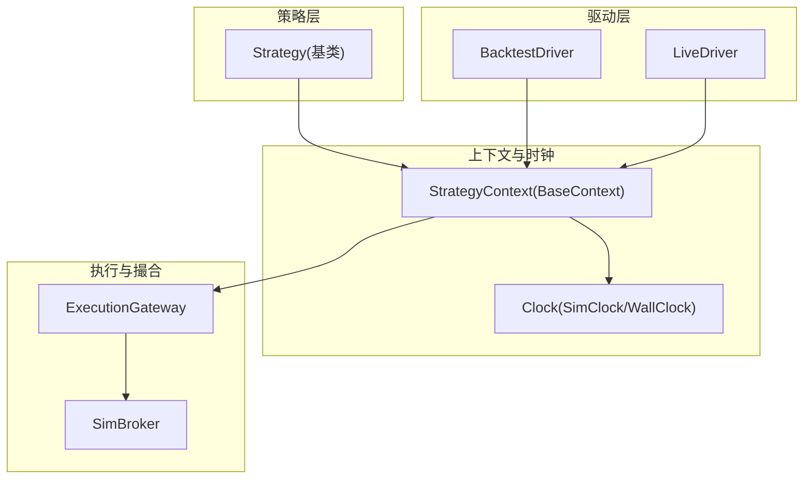
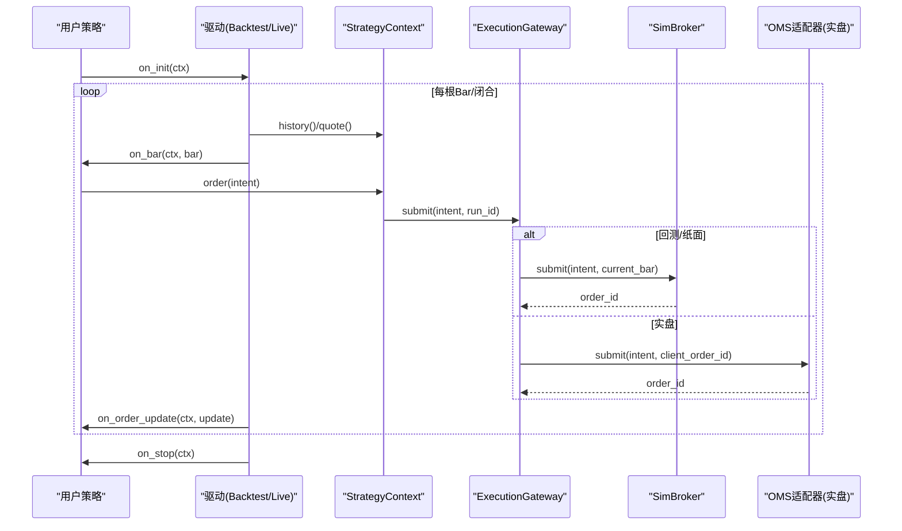
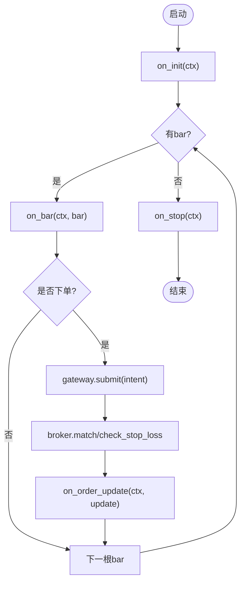
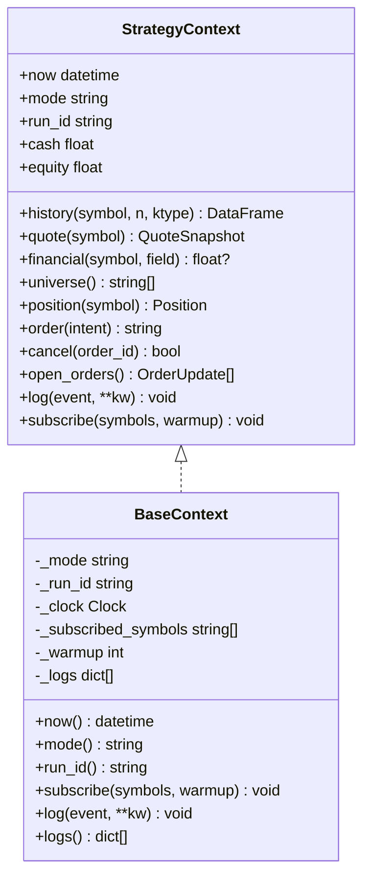
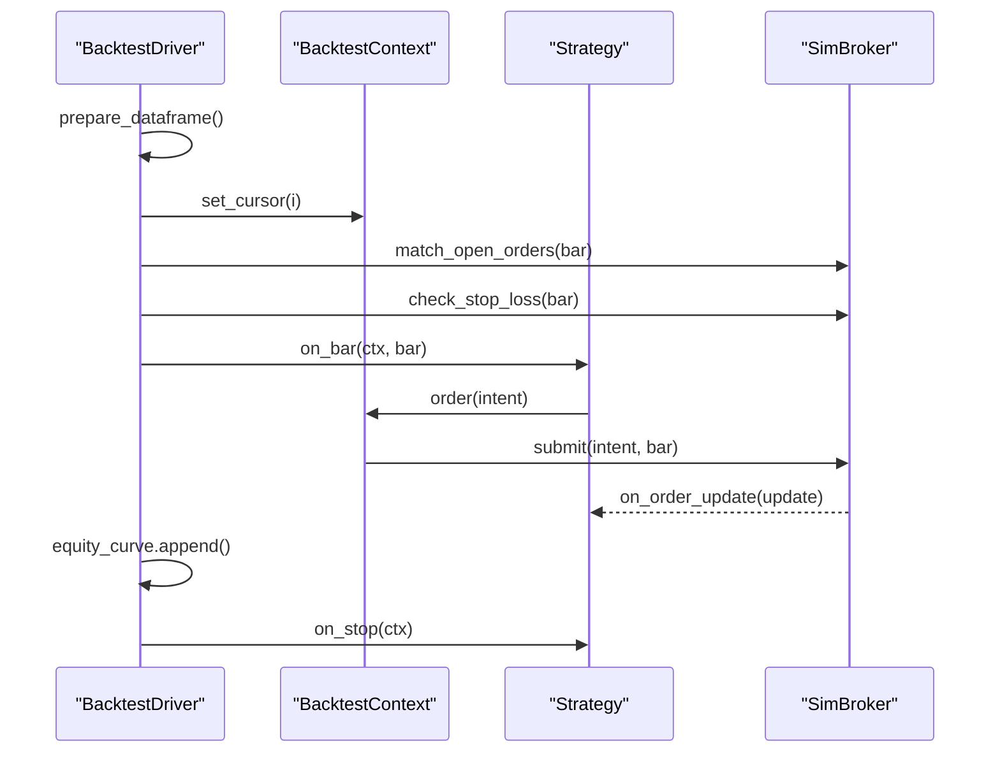
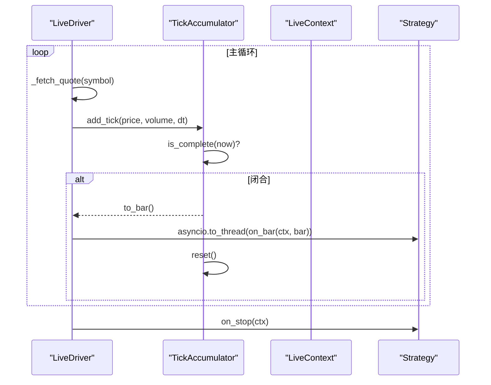
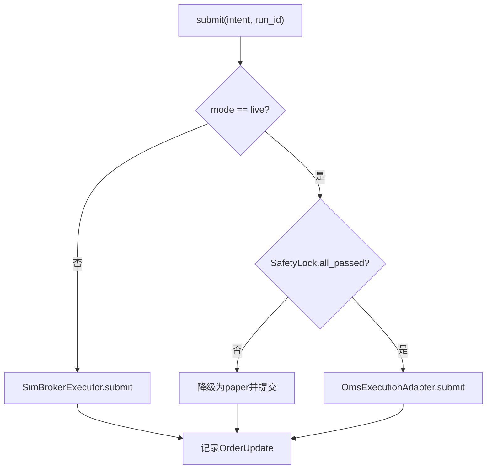
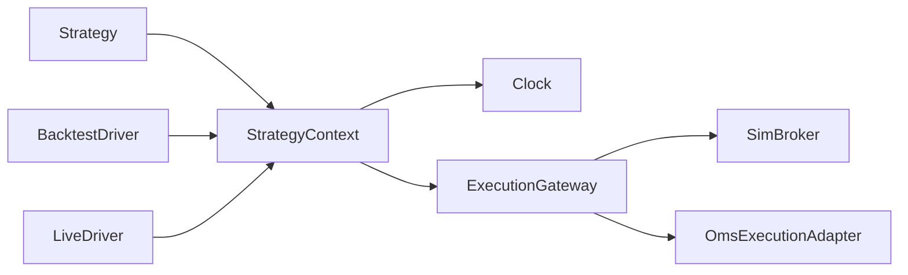

# 策略生命周期管理

<cite>
**本文引用的文件**
- [backend/engine/strategy.py](file://backend/engine/strategy.py)
- [backend/engine/context.py](file://backend/engine/context.py)
- [backend/engine/clock.py](file://backend/engine/clock.py)
- [backend/engine/contracts.py](file://backend/engine/contracts.py)
- [backend/engine/drivers/backtest.py](file://backend/engine/drivers/backtest.py)
- [backend/engine/drivers/live.py](file://backend/engine/drivers/live.py)
- [backend/engine/gateway.py](file://backend/engine/gateway.py)
- [backend/engine/drivers/sim_broker.py](file://backend/engine/drivers/sim_broker.py)
</cite>

## 目录
1. [简介](#简介)
2. [项目结构](#项目结构)
3. [核心组件](#核心组件)
4. [架构总览](#架构总览)
5. [详细组件分析](#详细组件分析)
6. [依赖关系分析](#依赖关系分析)
7. [性能考量](#性能考量)
8. [故障排查指南](#故障排查指南)
9. [结论](#结论)
10. [附录](#附录)

## 简介
本技术文档聚焦于“策略生命周期管理”，围绕 Strategy 基类与 StrategyContext 上下文对象，系统阐述回测与实盘同构引擎的事件驱动设计。内容涵盖：
- 策略生命周期：on_init → on_bar（逐根）→ on_order_update（订单回调）→ on_stop（清理钩子）
- 上下文对象的作用域与能力：数据订阅、历史与快照查询、账户状态、订单执行、日志
- 事件驱动架构实现原理：时钟抽象、撮合顺序、回报分发、安全锁与降级
- 策略实例化、参数注入与依赖注入机制
- 最佳实践：避免前视偏差、性能陷阱与资源泄漏

## 项目结构
策略生命周期由“策略基类 + 上下文协议 + 双驱动（回测/实盘）+ 统一网关 + 模拟撮合”构成。关键模块职责如下：
- strategy.py：定义 Strategy 抽象基类与生命周期方法
- context.py：定义 StrategyContext 协议与 BaseContext 公共实现
- clock.py：时间抽象 SimClock/WallClock，保证回测与实盘时间一致性
- contracts.py：Bar/QuoteSnapshot/OrderIntent/OrderUpdate/Position/RunManifest 等契约
- drivers/backtest.py：BacktestDriver 与 BacktestContext，历史回放主循环
- drivers/live.py：LiveDriver 与 LiveContext，tick→bar 聚合与异步执行
- gateway.py：ExecutionGateway 统一订单出口与安全锁
- drivers/sim_broker.py：SimBroker 模拟撮合引擎（限价单、止损、滑点与手续费）

图表来源
- [backend/engine/strategy.py:24-90](file://backend/engine/strategy.py#L24-L90)
- [backend/engine/context.py:25-172](file://backend/engine/context.py#L25-L172)
- [backend/engine/clock.py:18-57](file://backend/engine/clock.py#L18-L57)
- [backend/engine/drivers/backtest.py:59-344](file://backend/engine/drivers/backtest.py#L59-L344)
- [backend/engine/drivers/live.py:118-344](file://backend/engine/drivers/live.py#L118-L344)
- [backend/engine/gateway.py:98-207](file://backend/engine/gateway.py#L98-L207)
- [backend/engine/drivers/sim_broker.py:59-172](file://backend/engine/drivers/sim_broker.py#L59-L172)

章节来源
- [backend/engine/strategy.py:24-90](file://backend/engine/strategy.py#L24-L90)
- [backend/engine/context.py:25-172](file://backend/engine/context.py#L25-L172)
- [backend/engine/clock.py:18-57](file://backend/engine/clock.py#L18-L57)
- [backend/engine/contracts.py:29-162](file://backend/engine/contracts.py#L29-L162)
- [backend/engine/drivers/backtest.py:59-344](file://backend/engine/drivers/backtest.py#L59-L344)
- [backend/engine/drivers/live.py:118-344](file://backend/engine/drivers/live.py#L118-L344)
- [backend/engine/gateway.py:98-207](file://backend/engine/gateway.py#L98-L207)
- [backend/engine/drivers/sim_broker.py:59-172](file://backend/engine/drivers/sim_broker.py#L59-L172)

## 核心组件
- Strategy 基类：定义生命周期钩子与可选矢量化快路径 signals()
- StrategyContext 协议：策略唯一 API 面，提供 now/mode/run_id、history/quote/financial/universe、position/cash/equity、order/cancel/open_orders、log、subscribe
- Clock 抽象：SimClock（回测）与 WallClock（实盘/纸面），所有时间经此获取，杜绝前视偏差
- 契约模型：Bar、QuoteSnapshot、OrderIntent、OrderUpdate、Position、RunManifest
- 驱动：BacktestDriver（历史回放）、LiveDriver（实时 tick→bar 聚合）
- 网关：ExecutionGateway（路由到 SimBroker 或 OMS，含安全锁与幂等去重）
- 撮合：SimBroker（限价单、止损、滑点、手续费、持仓现金管理）

章节来源
- [backend/engine/strategy.py:24-90](file://backend/engine/strategy.py#L24-L90)
- [backend/engine/context.py:25-172](file://backend/engine/context.py#L25-L172)
- [backend/engine/clock.py:18-57](file://backend/engine/clock.py#L18-L57)
- [backend/engine/contracts.py:29-162](file://backend/engine/contracts.py#L29-L162)
- [backend/engine/drivers/backtest.py:59-344](file://backend/engine/drivers/backtest.py#L59-L344)
- [backend/engine/drivers/live.py:118-344](file://backend/engine/drivers/live.py#L118-L344)
- [backend/engine/gateway.py:98-207](file://backend/engine/gateway.py#L98-L207)
- [backend/engine/drivers/sim_broker.py:59-172](file://backend/engine/drivers/sim_broker.py#L59-L172)

## 架构总览
策略通过 StrategyContext 与引擎交互，不感知运行环境；驱动负责将事件（历史 bar 或实时 tick）转换为统一的 Bar，并调用策略的 on_bar。订单统一经 ExecutionGateway 路由，回测/纸面走 SimBroker，实盘走 OMS 适配器。

图表来源
- [backend/engine/drivers/backtest.py:288-333](file://backend/engine/drivers/backtest.py#L288-L333)
- [backend/engine/drivers/live.py:302-344](file://backend/engine/drivers/live.py#L302-L344)
- [backend/engine/gateway.py:116-186](file://backend/engine/gateway.py#L116-L186)
- [backend/engine/drivers/sim_broker.py:81-172](file://backend/engine/drivers/sim_broker.py#L81-L172)

## 详细组件分析

### Strategy 基类与生命周期
- on_init(ctx)：声明订阅标的与预热窗口长度，仅在此阶段调用 subscribe
- on_bar(ctx, bar)：必须实现，逐根处理逻辑；回测与实盘语义一致
- on_order_update(ctx, update)：可选，接收成交/拒单/部分成交回报
- on_stop(ctx)：可选，清理资源（如关闭连接、落库统计）
- signals(df, params)：可选矢量化快路径，返回信号列或 None

图表来源
- [backend/engine/strategy.py:34-66](file://backend/engine/strategy.py#L34-L66)
- [backend/engine/drivers/backtest.py:288-333](file://backend/engine/drivers/backtest.py#L288-L333)
- [backend/engine/drivers/live.py:302-344](file://backend/engine/drivers/live.py#L302-L344)
- [backend/engine/drivers/sim_broker.py:115-172](file://backend/engine/drivers/sim_broker.py#L115-L172)

章节来源
- [backend/engine/strategy.py:24-90](file://backend/engine/strategy.py#L24-L90)

### StrategyContext 上下文与作用域
- 元信息：now（唯一合法时间源）、mode（backtest/paper/live）、run_id
- 数据面：history(symbol, n, ktype)、quote(symbol)、financial(symbol, field)、universe()
- 账户面：position(symbol)、cash、equity
- 执行面：order(intent)、cancel(order_id)、open_orders()
- 日志：log(event, **kw)
- 订阅：subscribe(symbols, warmup)（仅在 on_init 调用）

图表来源
- [backend/engine/context.py:25-172](file://backend/engine/context.py#L25-L172)

章节来源
- [backend/engine/context.py:25-172](file://backend/engine/context.py#L25-L172)

### 时钟抽象与防前视
- SimClock：回测模式由 Driver 逐 bar set()，禁止回退
- WallClock：实盘/纸面模式返回 UTC 墙钟时间
- 所有 ctx.now 均经 Clock，杜绝直接调用 datetime.now()

章节来源
- [backend/engine/clock.py:18-57](file://backend/engine/clock.py#L18-L57)

### 契约模型
- Bar：单根 K 线（dt 需带时区）
- QuoteSnapshot：最新行情快照（含 stale 标识）
- OrderIntent：下单意图（MARKET/LIMIT，支持止损与标签）
- OrderUpdate：订单回报（统一状态枚举）
- Position：持仓快照（数量、均价、市值、未实现盈亏）
- RunManifest：运行指纹（code_hash、data_snapshot_id、manifest_hash、random_seed、reproducible）

章节来源
- [backend/engine/contracts.py:29-162](file://backend/engine/contracts.py#L29-L162)

### 回测驱动（BacktestDriver）
- 主循环：构造 RunManifest → 准备数据 → 逐 bar 推进时钟 → 先撮合挂单/止损 → 再 on_bar → 分发成交回报 → 记录权益曲线 → on_stop
- BacktestContext：基于当前索引切片 history()，quote() 取当前行，PIT 财务查询，幸存者偏差 universe
- 指标计算：夏普、最大回撤、胜率、摩擦成本

图表来源
- [backend/engine/drivers/backtest.py:288-333](file://backend/engine/drivers/backtest.py#L288-L333)
- [backend/engine/drivers/backtest.py:89-177](file://backend/engine/drivers/backtest.py#L89-L177)
- [backend/engine/drivers/sim_broker.py:115-172](file://backend/engine/drivers/sim_broker.py#L115-L172)

章节来源
- [backend/engine/drivers/backtest.py:59-344](file://backend/engine/drivers/backtest.py#L59-L344)

### 实盘驱动（LiveDriver）
- tick→bar 聚合：TickAccumulator 维护 open/high/low/close/volume，按周期闭合触发 on_bar
- 行情获取：优先 Redis 缓存，超时降级为 stale 报价
- 策略执行：asyncio.to_thread 隔离 on_bar，避免阻塞事件循环
- 停止流程：finally 中调用 on_stop 确保清理

图表来源
- [backend/engine/drivers/live.py:44-111](file://backend/engine/drivers/live.py#L44-L111)
- [backend/engine/drivers/live.py:302-344](file://backend/engine/drivers/live.py#L302-L344)

章节来源
- [backend/engine/drivers/live.py:118-344](file://backend/engine/drivers/live.py#L118-L344)

### 统一订单网关与安全锁
- 幂等去重：client_order_id = hash(run_id:symbol:side:tag)
- 路由：backtest/paper → SimBrokerExecutor；live → OmsExecutionAdapter
- 安全锁：REAL_TRADE_EXECUTE、trading_mode=LIVE、kill_switch 未触发；任一失败则降级为 paper 语义
- 降级计数：degraded_count 用于监控

图表来源
- [backend/engine/gateway.py:116-186](file://backend/engine/gateway.py#L116-L186)

章节来源
- [backend/engine/gateway.py:98-207](file://backend/engine/gateway.py#L98-L207)

### 模拟撮合引擎（SimBroker）
- 市价单：以 bar.close ± 滑点立即成交
- 限价单：挂入 pending_orders，后续 bar 用 high/low 检查触发
- 止损单：在 on_bar 前检查，满足条件即触发卖出
- 资金与持仓：考虑手续费与滑点，不足时自动折算可买数量
- 回报分发：dispatch_fills 将成交回报推送至策略 on_order_update

章节来源
- [backend/engine/drivers/sim_broker.py:59-172](file://backend/engine/drivers/sim_broker.py#L59-L172)
- [backend/engine/drivers/sim_broker.py:194-338](file://backend/engine/drivers/sim_broker.py#L194-L338)

## 依赖关系分析
- Strategy 仅依赖 StrategyContext，不感知后端实现
- Context 通过 Clock 抽象时间，屏蔽回测/实盘差异
- Drivers 组合 Context 与 Broker/Gateway，封装运行细节
- Gateway 解耦执行后端，支持安全锁与降级
- Contracts 作为跨进程/模块的稳定契约

图表来源
- [backend/engine/strategy.py:24-90](file://backend/engine/strategy.py#L24-L90)
- [backend/engine/context.py:25-172](file://backend/engine/context.py#L25-L172)
- [backend/engine/clock.py:18-57](file://backend/engine/clock.py#L18-L57)
- [backend/engine/drivers/backtest.py:59-344](file://backend/engine/drivers/backtest.py#L59-L344)
- [backend/engine/drivers/live.py:118-344](file://backend/engine/drivers/live.py#L118-L344)
- [backend/engine/gateway.py:98-207](file://backend/engine/gateway.py#L98-L207)
- [backend/engine/drivers/sim_broker.py:59-172](file://backend/engine/drivers/sim_broker.py#L59-L172)

章节来源
- [backend/engine/strategy.py:24-90](file://backend/engine/strategy.py#L24-L90)
- [backend/engine/context.py:25-172](file://backend/engine/context.py#L25-L172)
- [backend/engine/clock.py:18-57](file://backend/engine/clock.py#L18-L57)
- [backend/engine/drivers/backtest.py:59-344](file://backend/engine/drivers/backtest.py#L59-L344)
- [backend/engine/drivers/live.py:118-344](file://backend/engine/drivers/live.py#L118-L344)
- [backend/engine/gateway.py:98-207](file://backend/engine/gateway.py#L98-L207)
- [backend/engine/drivers/sim_broker.py:59-172](file://backend/engine/drivers/sim_broker.py#L59-L172)

## 性能考量
- 矢量化快路径：Strategy.signals 若实现，可绕过事件驱动进行向量化计算（需与 on_bar 语义等价并由校验器验证）
- 回测效率：BacktestDriver 使用 DataFrame 切片与 NumPy/Pandas 高效计算指标
- 实盘隔离：LiveDriver 使用 asyncio.to_thread 执行策略，避免阻塞事件循环
- 撮合优化：SimBroker 在 on_bar 前批量处理挂单与止损，减少重复计算
- 日志与观测：BaseContext.log 结构化输出，便于追踪与调试

[本节为通用指导，不直接分析具体文件]

## 故障排查指南
- 前视偏差：确保所有数据查询通过 ctx.history/quote/financial，且 ctx.now 来自 Clock，禁止直接使用 datetime.now()
- 订单被拒：检查 Gateway 安全锁状态（环境变量、交易模式、熔断开关），必要时查看降级计数
- 行情降级：LiveDriver 在 Redis 无消息超过阈值会返回 stale 报价，策略应据此拒绝下单
- 止损未触发：确认 SimBroker.check_stop_loss 在 on_bar 之前调用，且止损价格设置合理
- 资源泄漏：务必在 on_stop 中释放外部资源（数据库连接、网络客户端、定时任务）

章节来源
- [backend/engine/clock.py:18-57](file://backend/engine/clock.py#L18-L57)
- [backend/engine/gateway.py:43-65](file://backend/engine/gateway.py#L43-L65)
- [backend/engine/drivers/live.py:346-379](file://backend/engine/drivers/live.py#L346-L379)
- [backend/engine/drivers/sim_broker.py:145-172](file://backend/engine/drivers/sim_broker.py#L145-L172)
- [backend/engine/context.py:164-172](file://backend/engine/context.py#L164-L172)

## 结论
该策略生命周期管理通过 Strategy + StrategyContext + Clock 的抽象与同构设计，实现了回测与实盘的无缝切换。事件驱动架构保证了策略逻辑的一致性与可复现性，统一网关与安全锁提升了实盘安全性。遵循本文的最佳实践，可有效避免前视偏差、性能瓶颈与资源泄漏问题。

[本节为总结性内容，不直接分析具体文件]

## 附录

### 策略开发最佳实践
- 在 on_init 中完成 subscribe，不要在其他生命周期中动态变更订阅
- 所有数据访问通过 ctx.history/quote/financial，严格使用 ctx.now
- 订单通过 ctx.order(OrderIntent(...)) 提交，避免绕过网关
- 在 on_order_update 中处理部分成交与拒单，保持幂等
- 在 on_stop 中释放外部资源，确保可重启与可恢复
- 如需高性能回测，实现 Strategy.signals 并提供与 on_bar 等价的向量化逻辑

章节来源
- [backend/engine/strategy.py:34-90](file://backend/engine/strategy.py#L34-L90)
- [backend/engine/context.py:51-121](file://backend/engine/context.py#L51-L121)
- [backend/engine/gateway.py:116-186](file://backend/engine/gateway.py#L116-L186)
- [backend/engine/drivers/sim_broker.py:81-172](file://backend/engine/drivers/sim_broker.py#L81-L172)
