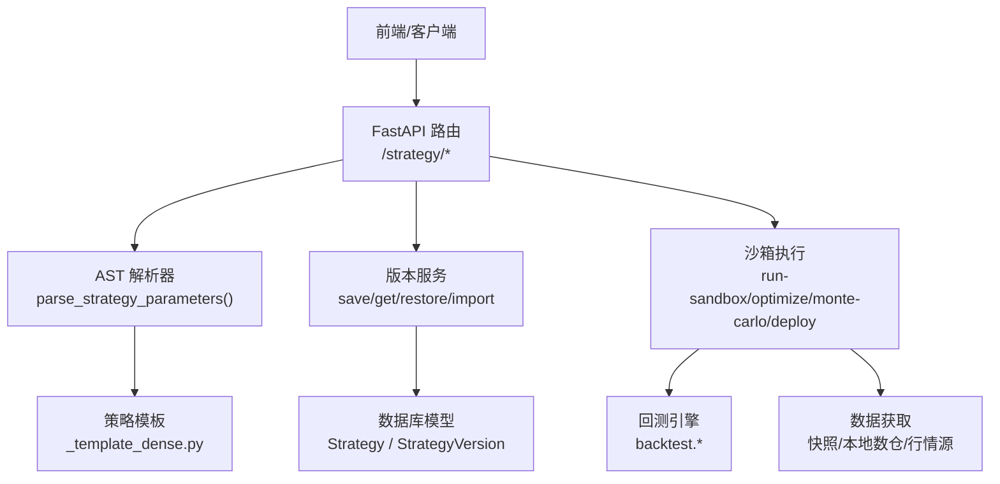
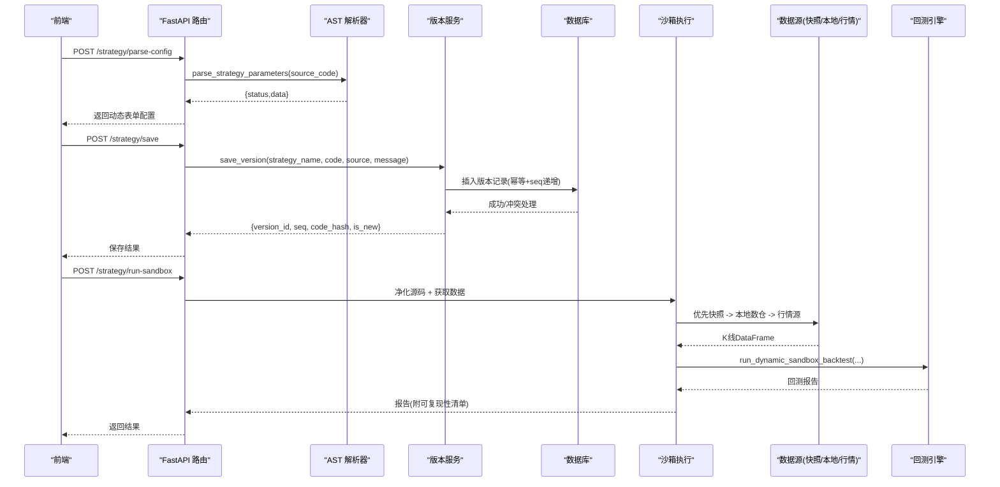
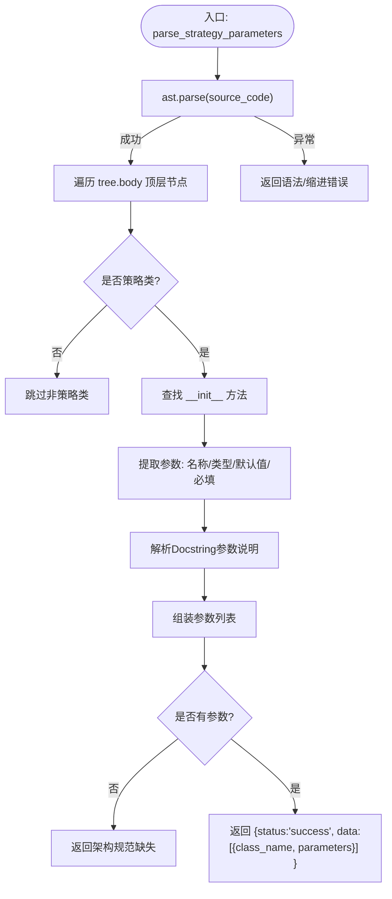
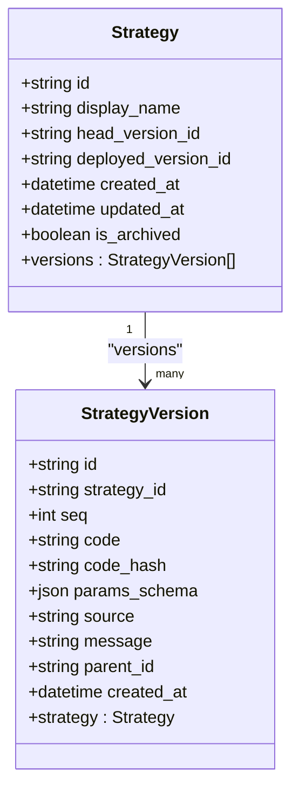
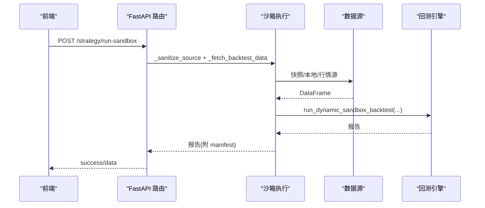
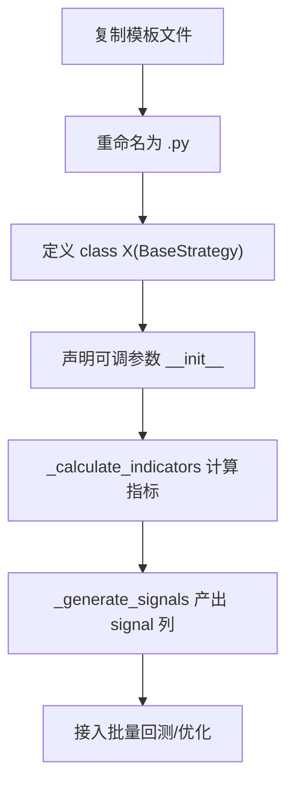
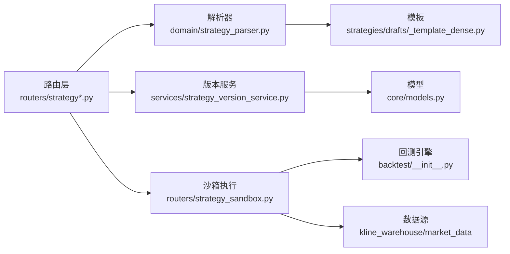

# 策略解析器

<cite>
**本文引用的文件**
- [backend/domain/strategy_parser.py](file://backend/domain/strategy_parser.py)
- [backend/services/strategy_version_service.py](file://backend/services/strategy_version_service.py)
- [backend/core/models.py](file://backend/core/models.py)
- [backend/routers/strategy.py](file://backend/routers/strategy.py)
- [backend/routers/strategy_sandbox.py](file://backend/routers/strategy_sandbox.py)
- [backend/backtest/__init__.py](file://backend/backtest/__init__.py)
- [strategies/drafts/_template_dense.py](file://strategies/drafts/_template_dense.py)
</cite>

## 目录
1. [简介](#简介)
2. [项目结构](#项目结构)
3. [核心组件](#核心组件)
4. [架构总览](#架构总览)
5. [详细组件分析](#详细组件分析)
6. [依赖关系分析](#依赖关系分析)
7. [性能考量](#性能考量)
8. [故障排查指南](#故障排查指南)
9. [结论](#结论)
10. [附录](#附录)

## 简介
本技术文档围绕“策略解析器”展开，系统性阐述 Python 策略文件的动态加载与安全解析、策略版本管理、参数验证框架、模板系统以及从代码提交到生产部署的自动化流水线。重点覆盖：
- AST 静态解析与语法检查、依赖白名单校验等安全保护
- 策略版本控制、变更追踪与回滚机制
- 参数类型推断、范围校验与依赖关系校验
- 标准化策略模板与快速创建流程
- 沙箱化执行、回测、寻优、蒙特卡洛压力测试与 OMS 部署
- 质量门禁（格式化、规范检查、安全扫描）与最佳实践

## 项目结构
策略解析与版本管理涉及以下关键模块：
- 解析层：AST 解析策略源码并提取参数定义，用于前端动态表单渲染
- 服务层：版本保存、查询、恢复与导入草稿
- 路由层：提供解析、生成、保存、列表、版本管理等 API
- 沙箱层：安全执行策略代码，进行回测、寻优、批量推演与部署
- 模型层：策略与版本表的 ORM 定义及约束
- 模板层：标准策略模板，约定指标计算与信号生成方法

**图表来源**
- [backend/routers/strategy.py:317-475](file://backend/routers/strategy.py#L317-L475)
- [backend/domain/strategy_parser.py:6-114](file://backend/domain/strategy_parser.py#L6-L114)
- [backend/services/strategy_version_service.py:18-243](file://backend/services/strategy_version_service.py#L18-L243)
- [backend/core/models.py:351-393](file://backend/core/models.py#L351-L393)
- [backend/backtest/__init__.py:1-47](file://backend/backtest/__init__.py#L1-L47)
- [strategies/drafts/_template_dense.py:1-113](file://strategies/drafts/_template_dense.py#L1-L113)

**章节来源**
- [backend/routers/strategy.py:317-585](file://backend/routers/strategy.py#L317-L585)
- [backend/domain/strategy_parser.py:6-114](file://backend/domain/strategy_parser.py#L6-L114)
- [backend/services/strategy_version_service.py:18-243](file://backend/services/strategy_version_service.py#L18-L243)
- [backend/core/models.py:351-393](file://backend/core/models.py#L351-L393)
- [backend/backtest/__init__.py:1-47](file://backend/backtest/__init__.py#L1-L47)
- [strategies/drafts/_template_dense.py:1-113](file://strategies/drafts/_template_dense.py#L1-L113)

## 核心组件
- 策略参数解析器：基于 AST 静态解析 Python 源码，识别策略类与 __init__ 参数，自动推断类型与默认值，并从 Docstring 抽取参数说明，输出前端可渲染的动态表单配置
- 版本管理服务：幂等保存策略版本（同 hash 不重复）、递增 seq、维护 head 指针、支持恢复与导入草稿
- 路由接口：提供解析、生成、格式化、保存、列表、版本查询与恢复、草稿读取与删除等能力
- 沙箱执行：对策略源码进行净化与安全检查，注入全局环境，执行回测、寻优、批量推演、蒙特卡洛压力测试，并支持部署至 OMS
- 数据模型：策略主表与版本表，含唯一约束与索引，保障版本一致性与查询效率
- 模板系统：标准策略模板，约定指标计算与信号生成方法，便于批量回测与优化

**章节来源**
- [backend/domain/strategy_parser.py:6-114](file://backend/domain/strategy_parser.py#L6-L114)
- [backend/services/strategy_version_service.py:18-243](file://backend/services/strategy_version_service.py#L18-L243)
- [backend/routers/strategy.py:317-585](file://backend/routers/strategy.py#L317-L585)
- [backend/routers/strategy_sandbox.py:363-800](file://backend/routers/strategy_sandbox.py#L363-L800)
- [backend/core/models.py:351-393](file://backend/core/models.py#L351-L393)
- [strategies/drafts/_template_dense.py:1-113](file://strategies/drafts/_template_dense.py#L1-L113)

## 架构总览
下图展示从前端请求到后端解析、版本管理与沙箱执行的完整链路，包括数据源选择与报告持久化。

**图表来源**
- [backend/routers/strategy.py:317-475](file://backend/routers/strategy.py#L317-L475)
- [backend/domain/strategy_parser.py:6-114](file://backend/domain/strategy_parser.py#L6-L114)
- [backend/services/strategy_version_service.py:18-243](file://backend/services/strategy_version_service.py#L18-L243)
- [backend/routers/strategy_sandbox.py:449-562](file://backend/routers/strategy_sandbox.py#L449-L562)
- [backend/backtest/__init__.py:1-47](file://backend/backtest/__init__.py#L1-L47)

## 详细组件分析

### 策略参数解析器（AST 解析与表单生成）
- 使用 ast.parse 将源码转为抽象语法树，仅遍历顶层节点以屏蔽内部函数或嵌套类中的临时类
- 启发式过滤策略类：类名包含 “Strategy” 或 “Bot”，或继承基类名包含 “Strategy”
- 提取 __init__ 参数：排除保留字（self、args、kwargs、context），推断类型与默认值，兼容 ast.Constant
- 从 Docstring 解析 Sphinx/Google 风格参数说明，生成前端表单字段描述
- 错误处理：捕获 IndentationError/SyntaxError，返回结构化错误信息；未检测到策略类时返回架构规范缺失提示

**图表来源**
- [backend/domain/strategy_parser.py:6-114](file://backend/domain/strategy_parser.py#L6-L114)

**章节来源**
- [backend/domain/strategy_parser.py:6-114](file://backend/domain/strategy_parser.py#L6-L114)

### 策略版本管理系统
- 幂等保存：按策略名与代码 SHA256 哈希去重，避免重复版本
- 序列号递增：查询最大 seq 后 +1，保证版本时间线有序
- Head 指针：更新策略主表的 head_version_id，指向最新版本
- 并发安全：捕获 IntegrityError 后回滚并返回已存在版本
- 查询与恢复：支持按策略名获取版本时间线（可选包含代码）、按版本 ID 获取详情、恢复旧版本为新的 restore 版本并记录 parent_id

**图表来源**
- [backend/core/models.py:351-393](file://backend/core/models.py#L351-L393)

**章节来源**
- [backend/services/strategy_version_service.py:18-243](file://backend/services/strategy_version_service.py#L18-L243)
- [backend/core/models.py:351-393](file://backend/core/models.py#L351-L393)

### 路由与沙箱执行（解析、保存、运行、部署）
- 解析配置：/strategy/parse-config 调用 AST 解析器，返回动态表单配置
- 保存策略：/strategy/save 写入 drafts 目录，并调用版本服务创建新版本
- 列表与草稿：/strategy/list 列出草稿状态（draft/backtested/deployed），/strategy/draft/{name} 读取源码
- 版本管理：/strategy/{name}/versions、/strategy/versions/{version_id}、/strategy/{name}/restore
- 沙箱运行：/strategy/run-sandbox 与 /strategy/run-sandbox/stream 支持同步与 SSE 流式进度推送
- 寻优与压力测试：/strategy/optimize-sandbox、/strategy/monte-carlo-sandbox
- 部署：/strategy/deploy-to-oms 根据环境变量决定是否启动真实 Bot 节点，并标记状态

**图表来源**
- [backend/routers/strategy.py:317-585](file://backend/routers/strategy.py#L317-L585)
- [backend/routers/strategy_sandbox.py:449-562](file://backend/routers/strategy_sandbox.py#L449-L562)
- [backend/backtest/__init__.py:1-47](file://backend/backtest/__init__.py#L1-L47)

**章节来源**
- [backend/routers/strategy.py:317-585](file://backend/routers/strategy.py#L317-L585)
- [backend/routers/strategy_sandbox.py:363-800](file://backend/routers/strategy_sandbox.py#L363-L800)

### 策略模板系统（标准化结构）
- 模板文件位于 strategies/drafts/_template_dense.py，约定类名与 BaseStrategy 继承关系
- 要求实现 _calculate_indicators 与 _generate_signals 方法，产出稠密 signal 列（1/0/-1）
- 指标计算与信号生成需使用向量化运算，禁止 for 循环遍历 DataFrame
- 模板作为批量回测与优化的契约，确保不同策略在统一接口下运行

**图表来源**
- [strategies/drafts/_template_dense.py:1-113](file://strategies/drafts/_template_dense.py#L1-L113)

**章节来源**
- [strategies/drafts/_template_dense.py:1-113](file://strategies/drafts/_template_dense.py#L1-L113)

### 策略参数验证框架（类型、范围、依赖）
- 类型推断：AST 解析阶段从 Type Hint 与默认值推导参数类型（int/float/bool/string）
- 必填判断：根据默认值偏移量确定 required 字段
- 描述生成：从 Docstring 解析 Sphinx/Google 风格参数说明，辅助前端校验提示
- 范围与依赖校验：可在前端表单层结合类型与默认值进行范围限制；后端可通过 Pydantic 模型扩展校验逻辑（当前解析器聚焦类型与必填）

**章节来源**
- [backend/domain/strategy_parser.py:6-114](file://backend/domain/strategy_parser.py#L6-L114)

### 安全保护措施（AST 解析、依赖白名单、沙箱隔离）
- AST 解析：仅静态分析，不执行用户代码，避免注入风险
- 依赖白名单：沙箱执行前剥离被禁止的 import（如 talib、BaseStrategy），并在运行时注入受限全局环境
- 执行隔离：通过 backtest.sandbox 提供的安全访问器与超时/内存异常处理，防止恶意或异常代码影响宿主进程
- 限流与风控：路由层实现细粒度限流与黑名单机制，防止滥用与攻击

**章节来源**
- [backend/routers/strategy_sandbox.py:363-374](file://backend/routers/strategy_sandbox.py#L363-L374)
- [backend/backtest/__init__.py:1-47](file://backend/backtest/__init__.py#L1-L47)
- [backend/routers/strategy.py:97-177](file://backend/routers/strategy.py#L97-L177)

## 依赖关系分析
- 路由层依赖解析器与服务层，服务层依赖数据库模型
- 沙箱执行依赖回测引擎与数据源，数据源支持快照、本地数仓与外部行情
- 模板系统为策略开发提供统一契约，便于批量回测与优化

**图表来源**
- [backend/routers/strategy.py:317-585](file://backend/routers/strategy.py#L317-L585)
- [backend/domain/strategy_parser.py:6-114](file://backend/domain/strategy_parser.py#L6-L114)
- [backend/services/strategy_version_service.py:18-243](file://backend/services/strategy_version_service.py#L18-L243)
- [backend/core/models.py:351-393](file://backend/core/models.py#L351-L393)
- [backend/backtest/__init__.py:1-47](file://backend/backtest/__init__.py#L1-L47)
- [strategies/drafts/_template_dense.py:1-113](file://strategies/drafts/_template_dense.py#L1-L113)

**章节来源**
- [backend/routers/strategy.py:317-585](file://backend/routers/strategy.py#L317-L585)
- [backend/domain/strategy_parser.py:6-114](file://backend/domain/strategy_parser.py#L6-L114)
- [backend/services/strategy_version_service.py:18-243](file://backend/services/strategy_version_service.py#L18-L243)
- [backend/core/models.py:351-393](file://backend/core/models.py#L351-L393)
- [backend/backtest/__init__.py:1-47](file://backend/backtest/__init__.py#L1-L47)
- [strategies/drafts/_template_dense.py:1-113](file://strategies/drafts/_template_dense.py#L1-L113)

## 性能考量
- AST 解析仅在顶层节点遍历，减少开销
- 版本查询默认不包含 code 字段，节省带宽
- 数据源优先使用快照，降低延迟与网络抖动
- 沙箱执行使用 CPU 绑定任务与进度推送，提升交互体验
- 限流与黑名单机制保护系统稳定性

[本节为通用性能建议，无需特定文件引用]

## 故障排查指南
- 解析失败：检查缩进与语法错误，确认策略类继承与 __init__ 参数定义符合规范
- 版本冲突：同一策略相同代码哈希不会重复创建，若并发冲突将返回已存在版本
- 数据缺失：快照不可用或本地数仓数据不足时，检查数据源配置与环境变量
- 沙箱崩溃：查看错误码 SANDBOX_RUNTIME_ERROR 与堆栈尾部，定位策略代码问题
- 部署失败：确认 REAL_TRADE_EXECUTE 环境变量与 OMS 服务可用性

**章节来源**
- [backend/domain/strategy_parser.py:10-21](file://backend/domain/strategy_parser.py#L10-L21)
- [backend/services/strategy_version_service.py:92-113](file://backend/services/strategy_version_service.py#L92-L113)
- [backend/routers/strategy_sandbox.py:564-612](file://backend/routers/strategy_sandbox.py#L564-L612)
- [backend/routers/strategy_sandbox.py:743-790](file://backend/routers/strategy_sandbox.py#L743-L790)

## 结论
本系统通过 AST 静态解析、沙箱安全执行与完善的版本管理机制，实现了策略从编写、验证、回测到部署的全流程自动化。配合模板系统与质量门禁，开发者可高效迭代策略并确保生产环境的安全与稳定。

[本节为总结性内容，无需特定文件引用]

## 附录
- 开发工作流建议：
  - 使用模板快速创建策略，遵循指标与信号生成契约
  - 通过 /strategy/parse-config 验证参数与表单渲染
  - 使用 /strategy/run-sandbox 进行单标的回测，必要时使用 optimize-sandbox 与 monte-carlo-sandbox
  - 保存策略并创建版本，利用版本时间线与恢复功能进行变更管理
  - 部署前进行格式化和规范检查，确保代码质量
  - 根据环境变量控制纸面或实盘部署，逐步推进至生产环境

[本节为通用指导，无需特定文件引用]