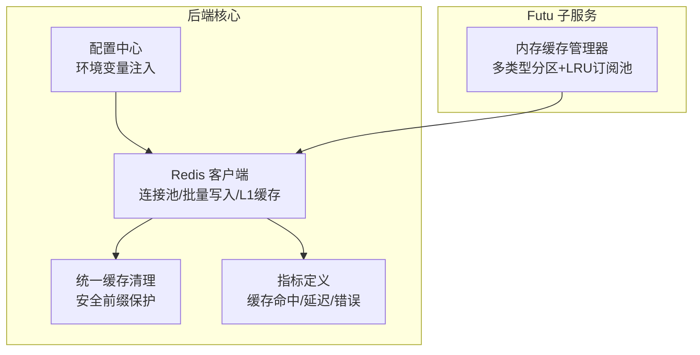
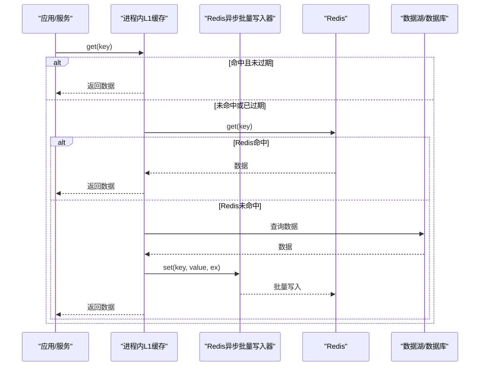
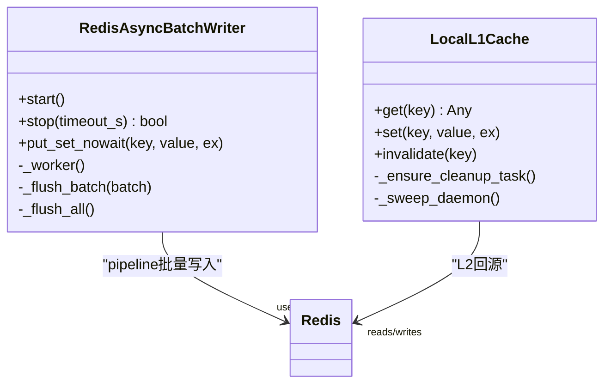
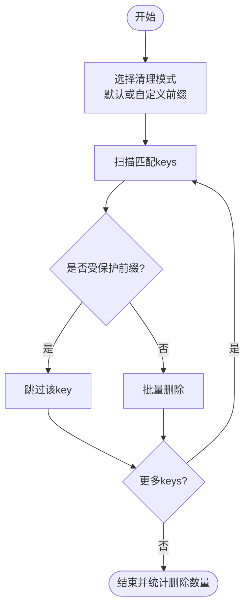
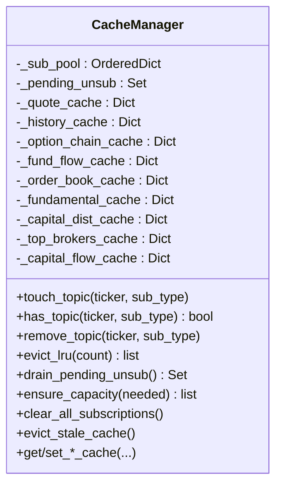
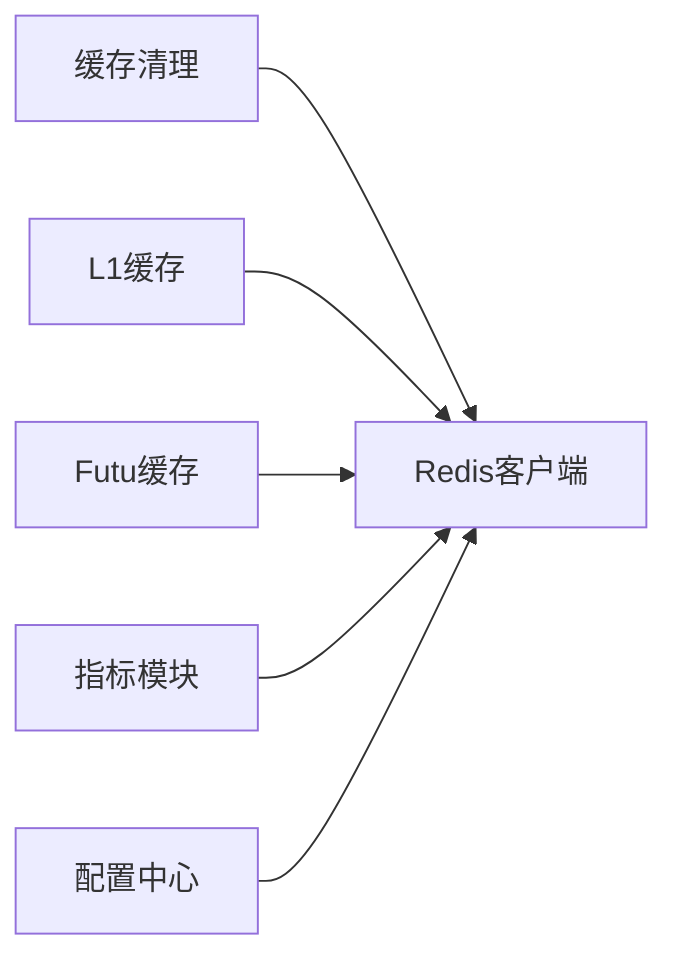

# 缓存管理器

<cite>
**本文引用的文件**
- [backend/core/cache_manager.py](file://backend/core/cache_manager.py)
- [backend/core/redis_client.py](file://backend/core/redis_client.py)
- [data_subservice/futu_src/cache_manager.py](file://data_subservice/futu_src/cache_manager.py)
- [backend/tests/test_cache_manager.py](file://backend/tests/test_cache_manager.py)
- [data_subservice/tests/test_cache_manager.py](file://data_subservice/tests/test_cache_manager.py)
- [backend/core/metrics.py](file://backend/core/metrics.py)
- [backend/core/config.py](file://backend/core/config.py)
</cite>

## 目录
1. [简介](#简介)
2. [项目结构](#项目结构)
3. [核心组件](#核心组件)
4. [架构总览](#架构总览)
5. [详细组件分析](#详细组件分析)
6. [依赖关系分析](#依赖关系分析)
7. [性能考量与调优](#性能考量与调优)
8. [故障排查指南](#故障排查指南)
9. [结论](#结论)
10. [附录：配置规范与最佳实践](#附录：配置规范与最佳实践)

## 简介
本技术文档聚焦 Quant Agent 的缓存管理体系，围绕多级缓存（进程内 L1、Redis 共享缓存、持久化数据层）进行系统化说明。内容涵盖缓存层次与数据流向、策略与过期管理、穿透与雪崩防护、键生成与序列化、并发控制、热点识别与预热、一致性保障、监控指标与性能调优，以及面向开发者的配置规范与排障手册。

## 项目结构
Quant Agent 的缓存相关能力分布在以下模块：
- 后端通用缓存基础设施：Redis 连接池、异步批量写入器、进程内 L1 缓存、统一缓存清理工具
- Futu 子服务内存缓存：按数据类型分区的本地缓存、LRU 订阅池、压缩工具
- 指标与配置：Prometheus 指标定义、全局配置校验与环境变量注入

**图表来源**
- [backend/core/redis_client.py:11-34](file://backend/core/redis_client.py#L11-L34)
- [backend/core/cache_manager.py:19-74](file://backend/core/cache_manager.py#L19-L74)
- [backend/core/metrics.py:75-104](file://backend/core/metrics.py#L75-L104)
- [backend/core/config.py:37-41](file://backend/core/config.py#L37-L41)
- [data_subservice/futu_src/cache_manager.py:30-57](file://data_subservice/futu_src/cache_manager.py#L30-L57)

**章节来源**
- [backend/core/redis_client.py:11-34](file://backend/core/redis_client.py#L11-L34)
- [backend/core/cache_manager.py:19-74](file://backend/core/cache_manager.py#L19-L74)
- [backend/core/metrics.py:75-104](file://backend/core/metrics.py#L75-L104)
- [backend/core/config.py:37-41](file://backend/core/config.py#L37-L41)
- [data_subservice/futu_src/cache_manager.py:30-57](file://data_subservice/futu_src/cache_manager.py#L30-L57)

## 核心组件
- Redis 客户端与连接池：集中管理连接池上限、协议版本、密码容错；提供异步批量写入队列，降低高频 set 的网络开销
- 进程内 L1 缓存：短 TTL 字典缓存，自动清理过期项，容量超限熔断清空，避免极端热点导致的网络抖动
- 统一缓存清理：基于模式扫描并删除业务缓存 key，严格保护交易态前缀，防止误删导致状态丢失
- Futu 内存缓存：按数据类型分区存储，带 TTL 与容量熔断；LRU 订阅池用于控制订阅数量与淘汰
- 指标体系：覆盖 K 线缓存命中、Redis 操作延迟、错误计数等关键可观测性指标

**章节来源**
- [backend/core/redis_client.py:11-34](file://backend/core/redis_client.py#L11-L34)
- [backend/core/redis_client.py:46-177](file://backend/core/redis_client.py#L46-L177)
- [backend/core/redis_client.py:180-251](file://backend/core/redis_client.py#L180-L251)
- [backend/core/cache_manager.py:19-74](file://backend/core/cache_manager.py#L19-L74)
- [data_subservice/futu_src/cache_manager.py:30-57](file://data_subservice/futu_src/cache_manager.py#L30-L57)
- [backend/core/metrics.py:286-301](file://backend/core/metrics.py#L286-L301)

## 架构总览
Quant Agent 采用“进程内 L1 + Redis 共享缓存 + 数据湖/数据库”的多级缓存架构。读路径优先命中 L1，未命中则回源 Redis；写路径通过异步批量写入器聚合后落盘 Redis，确保高吞吐与低延迟。Futu 子服务在进程内维护细粒度内存缓存，配合 LRU 订阅池控制资源占用。统一清理工具对业务缓存进行安全清理，保护交易态数据。

**图表来源**
- [backend/core/redis_client.py:180-251](file://backend/core/redis_client.py#L180-L251)
- [backend/core/redis_client.py:46-177](file://backend/core/redis_client.py#L46-L177)

**章节来源**
- [backend/core/redis_client.py:180-251](file://backend/core/redis_client.py#L180-L251)
- [backend/core/redis_client.py:46-177](file://backend/core/redis_client.py#L46-L177)

## 详细组件分析

### Redis 客户端与连接池
- 连接池配置：从环境变量读取主机、端口、密码、最大连接数；使用 RESP2 协议兼容旧版 redis-py
- 异步批量写入器：后台协程定时拉取队列数据，使用 Pipeline 批量执行 set，支持优雅停机与超时等待
- 进程内 L1 缓存：默认 TTL 10s，容量上限可配置；get 时惰性清理过期项，set 时先写 Redis 再更新本地缓存，保证一致性与快速回读

**图表来源**
- [backend/core/redis_client.py:46-177](file://backend/core/redis_client.py#L46-L177)
- [backend/core/redis_client.py:180-251](file://backend/core/redis_client.py#L180-L251)

**章节来源**
- [backend/core/redis_client.py:11-34](file://backend/core/redis_client.py#L11-L34)
- [backend/core/redis_client.py:46-177](file://backend/core/redis_client.py#L46-L177)
- [backend/core/redis_client.py:180-251](file://backend/core/redis_client.py#L180-L251)

### 统一缓存清理工具
- 受保护前缀：交易态数据（如 OMS 活动订单、状态、持仓）绝对不删除
- 默认业务前缀：K 线、通用缓存、新闻、宏观、内幕信息、部分宏观缓存
- 清理流程：按模式扫描 Redis keys，过滤受保护前缀后批量删除，异常时记录日志并中断当前模式

**图表来源**
- [backend/core/cache_manager.py:19-74](file://backend/core/cache_manager.py#L19-L74)

**章节来源**
- [backend/core/cache_manager.py:19-74](file://backend/core/cache_manager.py#L19-L74)
- [backend/tests/test_cache_manager.py:33-91](file://backend/tests/test_cache_manager.py#L33-L91)

### Futu 内存缓存与 LRU 订阅池
- 多类型缓存：行情快照、历史K线、期权链、资金流向、盘口、基本面、筹码分布、经纪商、个股资金流等，各自独立 TTL
- 容量保护：单类缓存最大条目数限制，超过阈值时清理最旧一半，防止无界增长
- LRU 订阅池：按 (ticker, sub_type) 维度管理订阅，支持触摸提升、检查存在、移除、容量不足时淘汰并加入待退订队列

**图表来源**
- [data_subservice/futu_src/cache_manager.py:30-57](file://data_subservice/futu_src/cache_manager.py#L30-L57)
- [data_subservice/futu_src/cache_manager.py:58-149](file://data_subservice/futu_src/cache_manager.py#L58-L149)
- [data_subservice/futu_src/cache_manager.py:150-220](file://data_subservice/futu_src/cache_manager.py#L150-L220)

**章节来源**
- [data_subservice/futu_src/cache_manager.py:30-57](file://data_subservice/futu_src/cache_manager.py#L30-L57)
- [data_subservice/futu_src/cache_manager.py:58-149](file://data_subservice/futu_src/cache_manager.py#L58-L149)
- [data_subservice/futu_src/cache_manager.py:150-220](file://data_subservice/futu_src/cache_manager.py#L150-L220)
- [data_subservice/tests/test_cache_manager.py:22-95](file://data_subservice/tests/test_cache_manager.py#L22-L95)

### 指标与监控
- K 线缓存命中与查询延迟：区分层级（redis/parquet/miss），评估命中率与端到端延迟
- Redis 操作延迟与错误：覆盖 get/pipeline/hset/publish/xadd 等操作，便于定位瓶颈
- 实时价 tick 缓存命中/降级：衡量 WS 实时价路径的健康度
- 数据源可用性、限流、拨测成功率：辅助判断缓存失效原因与外部依赖健康度

**章节来源**
- [backend/core/metrics.py:286-301](file://backend/core/metrics.py#L286-L301)
- [backend/core/metrics.py:75-104](file://backend/core/metrics.py#L75-L104)
- [backend/core/metrics.py:496-509](file://backend/core/metrics.py#L496-L509)
- [backend/core/metrics.py:155-217](file://backend/core/metrics.py#L155-L217)

## 依赖关系分析
- 后端缓存清理依赖 Redis 客户端，并通过安全前缀机制规避交易态数据风险
- L1 缓存依赖 Redis 作为 L2 回源，同时具备容量与过期保护
- Futu 内存缓存独立于后端 Redis，但可通过批量写入器将结果同步到共享缓存
- 指标模块为各组件提供可观测性支撑，便于定位缓存命中率与延迟问题

**图表来源**
- [backend/core/cache_manager.py:19-74](file://backend/core/cache_manager.py#L19-L74)
- [backend/core/redis_client.py:11-34](file://backend/core/redis_client.py#L11-L34)
- [backend/core/metrics.py:75-104](file://backend/core/metrics.py#L75-L104)
- [backend/core/config.py:37-41](file://backend/core/config.py#L37-L41)

**章节来源**
- [backend/core/cache_manager.py:19-74](file://backend/core/cache_manager.py#L19-L74)
- [backend/core/redis_client.py:11-34](file://backend/core/redis_client.py#L11-L34)
- [backend/core/metrics.py:75-104](file://backend/core/metrics.py#L75-L104)
- [backend/core/config.py:37-41](file://backend/core/config.py#L37-L41)

## 性能考量与调优
- 网络延迟降低
  - 使用异步批量写入器聚合 set 操作，减少 RTT 与带宽占用
  - 合理设置批量大小与刷新间隔，平衡延迟与吞吐
- 命中率提升
  - 调整 L1 默认 TTL 与容量上限，适配热点数据的访问特征
  - 利用 K 线缓存命中指标与查询延迟直方图，识别瓶颈层级
- 内存使用优化
  - L1 缓存容量触顶时触发安全熔断清空，避免内存泄漏
  - Futu 内存缓存按类型分区并设置 TTL，定期清理过期与超量条目
- 并发访问控制
  - 通过 Redis 连接池上限限制并发连接，防止资源耗尽
  - Futu 订阅池使用 LRU 淘汰策略，控制订阅规模

[本节为通用指导，无需特定文件引用]

## 故障排查指南
- 缓存清理失败
  - 现象：scan 抛异常，清理中断
  - 处理：记录日志并终止当前模式，检查 Redis 连通性与权限
  - 参考：[backend/core/cache_manager.py:57-71](file://backend/core/cache_manager.py#L57-L71)
- 交易态数据被误删
  - 现象：OMS 活动订单/状态/持仓 key 被删除
  - 处理：确认清理前缀是否包含受保护前缀；测试用例验证保护逻辑
  - 参考：[backend/tests/test_cache_manager.py:72-80](file://backend/tests/test_cache_manager.py#L72-L80)
- L1 缓存未生效或频繁重建
  - 现象：大量 Redis 回源，延迟升高
  - 处理：检查 L1 TTL 与容量上限；观察是否因容量超限触发熔断清空
  - 参考：[backend/core/redis_client.py:232-244](file://backend/core/redis_client.py#L232-L244)
- 批量写入积压
  - 现象：Redis 队列深度上升，写入延迟增加
  - 处理：调整批量大小与刷新间隔；监控 Redis 队列深度指标
  - 参考：[backend/core/metrics.py:78-88](file://backend/core/metrics.py#L78-L88)

**章节来源**
- [backend/core/cache_manager.py:57-71](file://backend/core/cache_manager.py#L57-L71)
- [backend/tests/test_cache_manager.py:72-80](file://backend/tests/test_cache_manager.py#L72-L80)
- [backend/core/redis_client.py:232-244](file://backend/core/redis_client.py#L232-L244)
- [backend/core/metrics.py:78-88](file://backend/core/metrics.py#L78-L88)

## 结论
Quant Agent 的缓存体系以“进程内 L1 + Redis 共享缓存”为核心，辅以 Futu 子服务的细粒度内存缓存与统一清理工具，形成高可用、高性能、可观测的多级缓存架构。通过合理的 TTL、容量保护、批量写入与指标监控，系统能够在高并发场景下保持低延迟与高命中率，同时保障交易态数据安全。

[本节为总结性内容，无需特定文件引用]

## 附录：配置规范与最佳实践
- 环境变量与配置
  - Redis 主机、端口、密码、最大连接数：通过环境变量注入，空密码容错处理
  - L1 缓存容量上限：通过环境变量控制，避免内存溢出
  - Futu 最大订阅数：通过环境变量控制，结合 LRU 淘汰策略
- 缓存键生成规则
  - 业务缓存前缀：quant:kline:*、quant:cache:*、quant:news:*、quant:macro:*、quant:insider*、yf_macro_cache_*
  - 受保护前缀：quant:oms:active_orders、quant:oms:status、quant:oms:positions
- 序列化格式选择
  - 使用字符串值存储，便于跨语言与调试；复杂对象建议采用 JSON 或 Protobuf 序列化后再存入 Redis
- 过期时间管理
  - L1 默认 TTL 10s，可根据热点数据调整
  - Futu 各类型缓存 TTL 不同，遵循数据新鲜度要求
- 缓存穿透防护
  - 对不存在的数据也可设置短 TTL 的空值缓存，避免重复回源
- 缓存雪崩预防
  - 为热点 key 设置随机 TTL 偏移，避免集中过期
  - 使用 L1 容量熔断与 Futu 内存缓存 TTL 分散压力
- 热点数据识别与预热
  - 基于 K 线缓存命中指标与查询延迟直方图识别热点
  - 启动时预加载常用标的的 K 线与报价数据至 L1 与 Redis
- 一致性保证与同步策略
  - L1 写路径先写 Redis 再更新本地缓存，保证强一致
  - Futu 内存缓存通过 evict_stale_cache 定期清理过期与超量条目
- 监控指标收集
  - 关注 K 线缓存命中、Redis 操作延迟、错误计数、tick 缓存命中率
  - 结合数据源可用性、限流与拨测指标，综合判断缓存健康度

**章节来源**
- [backend/core/config.py:37-41](file://backend/core/config.py#L37-L41)
- [backend/core/cache_manager.py:19-34](file://backend/core/cache_manager.py#L19-L34)
- [backend/core/redis_client.py:42-43](file://backend/core/redis_client.py#L42-L43)
- [data_subservice/futu_src/cache_manager.py:12-20](file://data_subservice/futu_src/cache_manager.py#L12-L20)
- [backend/core/metrics.py:286-301](file://backend/core/metrics.py#L286-L301)
- [backend/core/metrics.py:496-509](file://backend/core/metrics.py#L496-L509)
