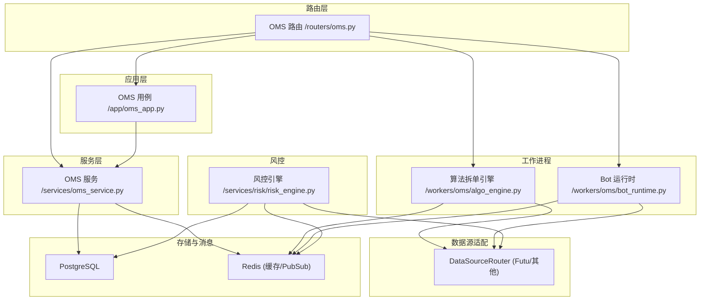
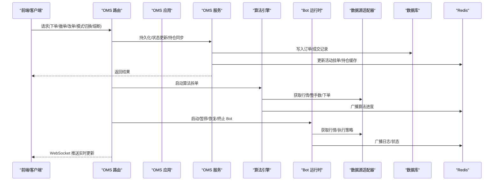
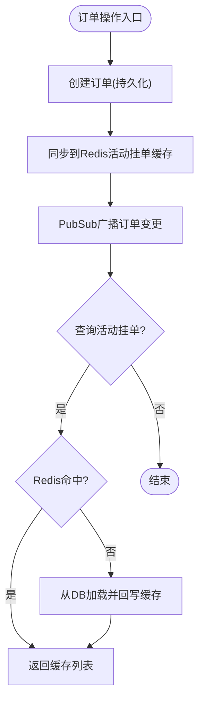
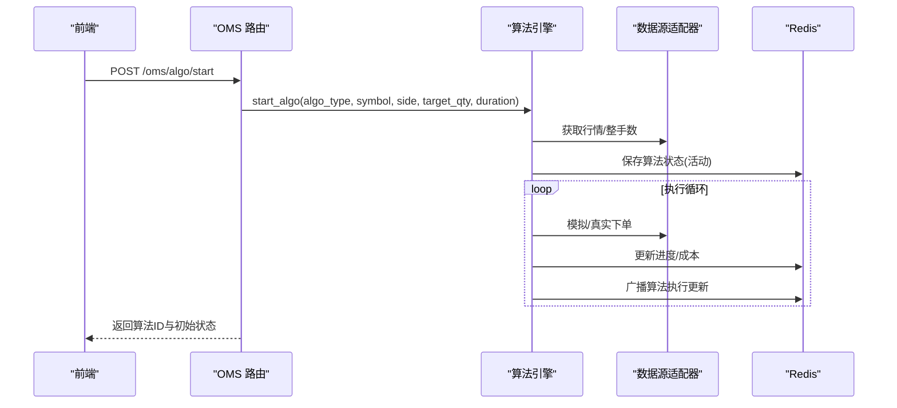
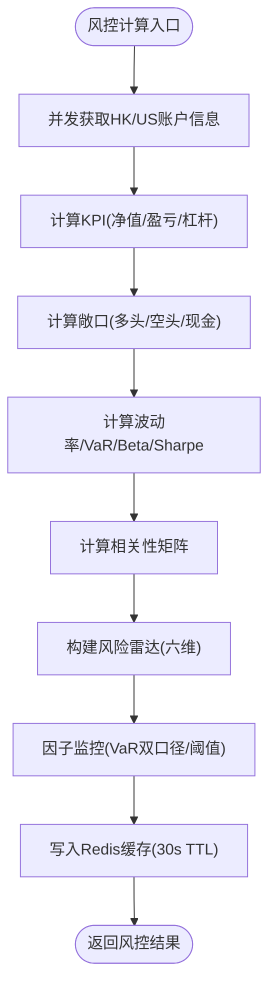
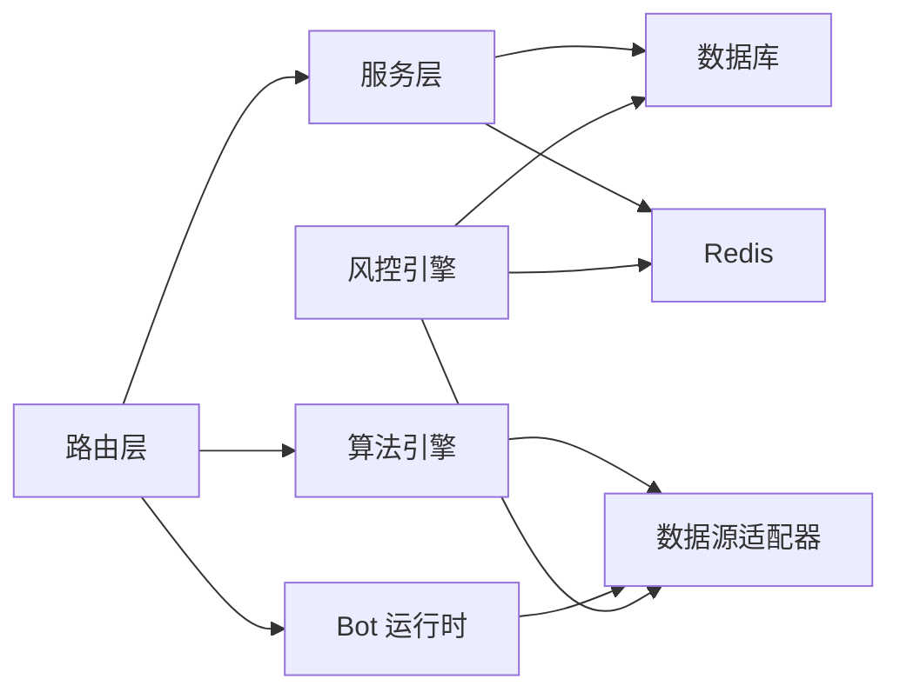

# 订单管理服务

<cite>
**本文引用的文件**
- [backend/app/oms_app.py](file://backend/app/oms_app.py)
- [backend/services/oms_service.py](file://backend/services/oms_service.py)
- [backend/routers/oms.py](file://backend/routers/oms.py)
- [backend/workers/oms/algo_engine.py](file://backend/workers/oms/algo_engine.py)
- [backend/workers/oms/bot_runtime.py](file://backend/workers/oms/bot_runtime.py)
- [backend/app/broker.py](file://backend/app/broker.py)
- [backend/services/risk/risk_engine.py](file://backend/services/risk/risk_engine.py)
</cite>

## 目录
1. [简介](#简介)
2. [项目结构](#项目结构)
3. [核心组件](#核心组件)
4. [架构总览](#架构总览)
5. [详细组件分析](#详细组件分析)
6. [依赖关系分析](#依赖关系分析)
7. [性能考量](#性能考量)
8. [故障排查指南](#故障排查指南)
9. [结论](#结论)
10. [附录：扩展与集成规范](#附录：扩展与集成规范)

## 简介
本技术文档面向 Quant Agent 的订单管理服务（OMS），系统性阐述 OMS 的架构设计、订单生命周期管理、仓位跟踪、风险控制机制、订单路由与执行算法、成交回报处理、多券商接口适配、订单状态同步、异常处理流程，以及风险检查、额度控制、止损止盈策略。同时提供订单簿管理、成交分析与绩效归因的计算逻辑说明，并给出 OMS 扩展指南，帮助开发者接入新券商接口、实现自定义风控规则、优化订单执行效率，并提供完整的集成规范与故障排查手册。

## 项目结构
OMS 采用分层与职责分离的设计：
- 路由层：对外暴露 REST/WebSocket 接口，负责鉴权、参数校验、审计日志与后台任务调度。
- 应用层：编排用例（如熔断清仓、模式切换）。
- 服务层：订单持久化、状态同步、持仓同步、历史成交查询等。
- 工作进程：算法拆单引擎、Bot 运行时管理。
- 风控引擎：组合级风控指标计算与缓存。
- 数据源适配：通过统一路由器访问券商与行情数据。

**图表来源**
- [backend/routers/oms.py:1-464](file://backend/routers/oms.py#L1-L464)
- [backend/app/oms_app.py:1-54](file://backend/app/oms_app.py#L1-L54)
- [backend/services/oms_service.py:1-276](file://backend/services/oms_service.py#L1-L276)
- [backend/workers/oms/algo_engine.py:1-785](file://backend/workers/oms/algo_engine.py#L1-L785)
- [backend/workers/oms/bot_runtime.py:1-446](file://backend/workers/oms/bot_runtime.py#L1-L446)
- [backend/services/risk/risk_engine.py:1-515](file://backend/services/risk/risk_engine.py#L1-L515)

**章节来源**
- [backend/routers/oms.py:1-464](file://backend/routers/oms.py#L1-L464)
- [backend/app/oms_app.py:1-54](file://backend/app/oms_app.py#L1-L54)
- [backend/services/oms_service.py:1-276](file://backend/services/oms_service.py#L1-L276)
- [backend/workers/oms/algo_engine.py:1-785](file://backend/workers/oms/algo_engine.py#L1-L785)
- [backend/workers/oms/bot_runtime.py:1-446](file://backend/workers/oms/bot_runtime.py#L1-L446)
- [backend/services/risk/risk_engine.py:1-515](file://backend/services/risk/risk_engine.py#L1-L515)

## 核心组件
- OMS 路由：提供订单/算法/Bot/模式切换/熔断等接口，WebSocket 实时推送。
- OMS 服务：订单持久化、活动挂单缓存、历史成交读取、持仓同步、熔断标记。
- 算法拆单引擎：TWAP/VWAP/ICEBERG/POV/IS 等算法执行，整手对齐、模拟/真实下单、进度持久化与广播。
- Bot 运行时：策略运行生命周期管理、资源监控、日志持久化与广播。
- 风控引擎：组合 KPI、敞口、波动率、VaR、Beta、Sharpe、相关性矩阵、最大回撤等指标计算与缓存。
- 数据源适配：统一通过 DataSourceRouter 调用 Futu 等数据源（账户信息、行情、历史K线、下单等）。

**章节来源**
- [backend/routers/oms.py:1-464](file://backend/routers/oms.py#L1-L464)
- [backend/services/oms_service.py:1-276](file://backend/services/oms_service.py#L1-L276)
- [backend/workers/oms/algo_engine.py:1-785](file://backend/workers/oms/algo_engine.py#L1-L785)
- [backend/workers/oms/bot_runtime.py:1-446](file://backend/workers/oms/bot_runtime.py#L1-L446)
- [backend/services/risk/risk_engine.py:1-515](file://backend/services/risk/risk_engine.py#L1-L515)

## 架构总览
OMS 以“路由-应用-服务-工作进程”的分层架构组织，结合 Redis PubSub 进行实时状态同步，PostgreSQL 作为持久化存储，DataSourceRouter 屏蔽多券商差异。

**图表来源**
- [backend/routers/oms.py:1-464](file://backend/routers/oms.py#L1-L464)
- [backend/services/oms_service.py:1-276](file://backend/services/oms_service.py#L1-L276)
- [backend/workers/oms/algo_engine.py:1-785](file://backend/workers/oms/algo_engine.py#L1-L785)
- [backend/workers/oms/bot_runtime.py:1-446](file://backend/workers/oms/bot_runtime.py#L1-L446)

## 详细组件分析

### 订单生命周期管理与状态同步
- 创建订单：服务层将订单写入数据库，同步到 Redis 活动挂单缓存，并通过 PubSub 广播变更。
- 状态更新：支持 SUBMITTED → PARTIALLY_FILLED → FILLED/CANCELLED 的状态流转，更新后同步缓存与广播。
- 活动挂单查询：优先从 Redis 缓存读取，未命中则回源 DB 并写回缓存（TTL 5 分钟）。
- 历史成交：从 trade_logs 表读取最近成交记录。
- 持仓同步：定时从 Futu 拉取账户持仓，写入 Redis 并按市场分键缓存，同时广播持仓变更。
- 熔断标记：将所有活动订单批量标记为 CANCELLED，清空活动挂单缓存并广播。

**图表来源**
- [backend/services/oms_service.py:34-143](file://backend/services/oms_service.py#L34-L143)
- [backend/services/oms_service.py:145-193](file://backend/services/oms_service.py#L145-L193)
- [backend/services/oms_service.py:197-244](file://backend/services/oms_service.py#L197-L244)

**章节来源**
- [backend/services/oms_service.py:34-143](file://backend/services/oms_service.py#L34-L143)
- [backend/services/oms_service.py:145-193](file://backend/services/oms_service.py#L145-L193)
- [backend/services/oms_service.py:197-244](file://backend/services/oms_service.py#L197-L244)

### 订单路由与执行算法
- 路由能力：
  - 撤单：带幂等性锁（基于 Redis NX），发布撤单指令，更新订单状态并审计。
  - 改单：发布改单指令，更新 DB 价格字段，同步缓存与广播。
  - 算法拆单：启动 TWAP/VWAP/ICEBERG/POV/IS 等算法，支持暂停/恢复/取消。
  - 交易模式切换：热切换 SANDBOX/PAPER/LIVE，写入 Redis 并广播。
  - 全局熔断：触发 Kill Switch，广播信号并异步执行物理清仓。
- 算法执行：
  - 整手对齐：港股按 lot_size 对齐，美股默认 1。
  - 模拟/真实下单：SANDBOX 模式使用最新行情 ± 滑点模拟；LIVE 模式通过数据源适配器下单。
  - 进度持久化：活动算法写入 Redis Hash，完成/取消/错误归档至 Redis List（保留最近 100 条，7 天 TTL）。
  - 广播：通过 PubSub 推送算法执行更新。

**图表来源**
- [backend/routers/oms.py:217-318](file://backend/routers/oms.py#L217-L318)
- [backend/workers/oms/algo_engine.py:263-399](file://backend/workers/oms/algo_engine.py#L263-L399)
- [backend/workers/oms/algo_engine.py:617-702](file://backend/workers/oms/algo_engine.py#L617-L702)
- [backend/workers/oms/algo_engine.py:706-741](file://backend/workers/oms/algo_engine.py#L706-L741)

**章节来源**
- [backend/routers/oms.py:120-177](file://backend/routers/oms.py#L120-L177)
- [backend/routers/oms.py:217-318](file://backend/routers/oms.py#L217-L318)
- [backend/workers/oms/algo_engine.py:263-399](file://backend/workers/oms/algo_engine.py#L263-L399)
- [backend/workers/oms/algo_engine.py:617-702](file://backend/workers/oms/algo_engine.py#L617-L702)
- [backend/workers/oms/algo_engine.py:706-741](file://backend/workers/oms/algo_engine.py#L706-L741)

### 成交回报处理与订单状态同步
- 成交回报：历史成交从 trade_logs 表读取，转换为 API 格式返回。
- 状态同步：订单状态变更后同步 Redis 活动挂单缓存，并通过 PubSub 广播 oms:orders:update。
- 持仓同步：定时从 Futu 拉取持仓，写入 Redis 并按市场分键缓存，广播 oms:positions:update。

**章节来源**
- [backend/services/oms_service.py:145-193](file://backend/services/oms_service.py#L145-L193)
- [backend/services/oms_service.py:218-244](file://backend/services/oms_service.py#L218-L244)

### 多券商接口适配与订单状态同步
- 统一适配：通过 DataSourceRouter 调用 Futu 等数据源，屏蔽底层差异。
- 订单状态同步：订单状态更新后同步缓存与广播；持仓同步通过数据源适配器获取账户信息并缓存。
- 模式切换：交易模式（SANDBOX/PAPER/LIVE）存储在 Redis，影响算法执行路径（模拟或真实下单）。

**章节来源**
- [backend/workers/oms/algo_engine.py:617-702](file://backend/workers/oms/algo_engine.py#L617-L702)
- [backend/services/oms_service.py:155-193](file://backend/services/oms_service.py#L155-L193)
- [backend/routers/oms.py:321-371](file://backend/routers/oms.py#L321-L371)

### 风险控制机制与策略
- 组合风控：计算 KPI（净值、今日盈亏、杠杆）、敞口分布（多头/空头/现金）、波动率、VaR、Beta、Sharpe、相关性矩阵、最大回撤。
- 缓存策略：风控结果按天数维度缓存于 Redis（30s TTL），减少重复计算。
- 因子监控：VaR 双口径（百分比与金额）、Beta、Sharpe、最大回撤阈值判断与安全/警告/危急状态。
- 止损止盈与额度控制：当前代码未直接实现止损止盈与额度控制逻辑；可在路由或服务层增加前置风控检查，拦截超限订单或触发自动平仓。

**图表来源**
- [backend/services/risk/risk_engine.py:32-135](file://backend/services/risk/risk_engine.py#L32-L135)
- [backend/services/risk/risk_engine.py:137-193](file://backend/services/risk/risk_engine.py#L137-L193)
- [backend/services/risk/risk_engine.py:195-283](file://backend/services/risk/risk_engine.py#L195-L283)
- [backend/services/risk/risk_engine.py:348-426](file://backend/services/risk/risk_engine.py#L348-L426)
- [backend/services/risk/risk_engine.py:428-481](file://backend/services/risk/risk_engine.py#L428-L481)

**章节来源**
- [backend/services/risk/risk_engine.py:32-135](file://backend/services/risk/risk_engine.py#L32-L135)
- [backend/services/risk/risk_engine.py:137-193](file://backend/services/risk/risk_engine.py#L137-L193)
- [backend/services/risk/risk_engine.py:195-283](file://backend/services/risk/risk_engine.py#L195-L283)
- [backend/services/risk/risk_engine.py:348-426](file://backend/services/risk/risk_engine.py#L348-L426)
- [backend/services/risk/risk_engine.py:428-481](file://backend/services/risk/risk_engine.py#L428-L481)

### 订单簿管理与成交分析
- 订单簿：当前代码未实现传统订单簿（买一/卖一等）维护；活动挂单通过 Redis 缓存与 PubSub 广播。
- 成交分析：历史成交从 trade_logs 读取；算法执行报告包含滑点、VWAP 偏离、参与率、Implementation Shortfall 等指标。

**章节来源**
- [backend/services/oms_service.py:145-193](file://backend/services/oms_service.py#L145-L193)
- [backend/routers/oms.py:285-318](file://backend/routers/oms.py#L285-L318)

### 绩效归因计算逻辑
- 组合收益：按市值加权计算组合收益率。
- 风险指标：波动率、VaR、Beta（OLS vs 基准指数）、Sharpe。
- 相关性：持仓间 60 日收益率相关系数矩阵，高相关性预警。
- 最大回撤：从 NAV 快照序列计算。

**章节来源**
- [backend/services/risk/risk_engine.py:195-283](file://backend/services/risk/risk_engine.py#L195-L283)
- [backend/services/risk/risk_engine.py:285-346](file://backend/services/risk/risk_engine.py#L285-L346)
- [backend/services/risk/risk_engine.py:348-426](file://backend/services/risk/risk_engine.py#L348-L426)

## 依赖关系分析
- 路由层依赖服务层与工作进程，服务层依赖数据库与 Redis，工作进程依赖数据源适配器与 Redis。
- 风控引擎依赖数据源适配器与数据库，结果缓存于 Redis。
- 算法引擎与 Bot 运行时均通过数据源适配器获取行情与下单，避免直接耦合具体券商 SDK。

**图表来源**
- [backend/routers/oms.py:1-464](file://backend/routers/oms.py#L1-L464)
- [backend/services/oms_service.py:1-276](file://backend/services/oms_service.py#L1-L276)
- [backend/workers/oms/algo_engine.py:1-785](file://backend/workers/oms/algo_engine.py#L1-L785)
- [backend/workers/oms/bot_runtime.py:1-446](file://backend/workers/oms/bot_runtime.py#L1-L446)
- [backend/services/risk/risk_engine.py:1-515](file://backend/services/risk/risk_engine.py#L1-L515)

**章节来源**
- [backend/routers/oms.py:1-464](file://backend/routers/oms.py#L1-L464)
- [backend/services/oms_service.py:1-276](file://backend/services/oms_service.py#L1-L276)
- [backend/workers/oms/algo_engine.py:1-785](file://backend/workers/oms/algo_engine.py#L1-L785)
- [backend/workers/oms/bot_runtime.py:1-446](file://backend/workers/oms/bot_runtime.py#L1-L446)
- [backend/services/risk/risk_engine.py:1-515](file://backend/services/risk/risk_engine.py#L1-L515)

## 性能考量
- 缓存策略：活动挂单与持仓使用 Redis 缓存，降低 DB 压力；风控结果按天数维度缓存（30s TTL）。
- 并发获取：风控引擎并发获取 HK/US 账户信息，提升响应速度。
- 批处理：熔断时批量标记订单状态，减少多次 DB 更新。
- 限流与降级：数据源适配器失败时记录日志并返回空态或降级数据，避免系统雪崩。

[本节为通用性能建议，不直接分析具体文件]

## 故障排查指南
- 订单持久化失败：检查数据库连接与事务提交，查看服务层日志中的错误信息。
- 活动挂单缓存不一致：确认 Redis 键空间与 TTL，必要时清空缓存并重新加载。
- 算法执行异常：检查算法类型、整手数对齐、行情获取与下单结果，查看算法引擎日志。
- Bot 运行异常：检查策略文件是否存在、动态导入是否成功，查看 Bot 运行时日志与资源监控。
- 风控计算失败：检查数据源适配器返回格式与可用性，查看风控引擎日志与缓存状态。

**章节来源**
- [backend/services/oms_service.py:74-77](file://backend/services/oms_service.py#L74-L77)
- [backend/services/oms_service.py:111-114](file://backend/services/oms_service.py#L111-L114)
- [backend/workers/oms/algo_engine.py:385-391](file://backend/workers/oms/algo_engine.py#L385-L391)
- [backend/workers/oms/bot_runtime.py:240-253](file://backend/workers/oms/bot_runtime.py#L240-L253)
- [backend/services/risk/risk_engine.py:56-62](file://backend/services/risk/risk_engine.py#L56-L62)

## 结论
OMS 通过清晰的分层架构与 Redis PubSub 实时同步机制，实现了订单生命周期管理、算法拆单执行、Bot 运行时管理与组合风控计算的完整闭环。系统具备良好的可扩展性与容错能力，适合接入多券商接口与定制风控策略。建议在路由或服务层增加前置风控检查与止损止盈逻辑，进一步完善额度控制与自动化平仓能力。

[本节为总结性内容，不直接分析具体文件]

## 附录：扩展与集成规范

### 接入新券商接口
- 在数据源适配器中新增券商实现，遵循统一接口契约（账户信息、行情、历史K线、下单等）。
- 通过 DataSourceRouter 注册新券商，确保路由层与服务层无需修改即可切换数据源。
- 在算法引擎与 Bot 运行时中复用数据源适配器，避免直接耦合具体券商 SDK。

**章节来源**
- [backend/workers/oms/algo_engine.py:617-702](file://backend/workers/oms/algo_engine.py#L617-L702)
- [backend/workers/oms/bot_runtime.py:260-268](file://backend/workers/oms/bot_runtime.py#L260-L268)

### 实现自定义风控规则
- 在路由层或订单创建前增加风控检查，拦截超限订单或触发自动平仓。
- 利用风控引擎的指标（VaR、Beta、Sharpe、最大回撤）设定阈值与告警。
- 将风控结果缓存于 Redis，供前端展示与决策。

**章节来源**
- [backend/services/risk/risk_engine.py:428-481](file://backend/services/risk/risk_engine.py#L428-L481)

### 优化订单执行效率
- 调整算法拆单的切片间隔与数量，平衡冲击成本与执行速度。
- 使用整手对齐与限价单策略，减少滑点与失败率。
- 利用 Redis 缓存与 PubSub 提升状态同步效率，降低 DB 压力。

**章节来源**
- [backend/workers/oms/algo_engine.py:400-615](file://backend/workers/oms/algo_engine.py#L400-L615)
- [backend/services/oms_service.py:118-143](file://backend/services/oms_service.py#L118-L143)

### 集成规范
- 路由层仅负责鉴权、参数校验、审计日志与后台任务调度，业务逻辑下沉至服务层与工作进程。
- 服务层负责订单持久化、状态同步与持仓同步，确保数据一致性与可追溯性。
- 工作进程负责算法执行与 Bot 管理，通过 Redis PubSub 广播状态变更。
- 风控引擎独立计算组合指标，结果缓存于 Redis，供前端与下游系统消费。

**章节来源**
- [backend/routers/oms.py:1-464](file://backend/routers/oms.py#L1-L464)
- [backend/services/oms_service.py:1-276](file://backend/services/oms_service.py#L1-L276)
- [backend/workers/oms/algo_engine.py:1-785](file://backend/workers/oms/algo_engine.py#L1-L785)
- [backend/workers/oms/bot_runtime.py:1-446](file://backend/workers/oms/bot_runtime.py#L1-L446)
- [backend/services/risk/risk_engine.py:1-515](file://backend/services/risk/risk_engine.py#L1-L515)