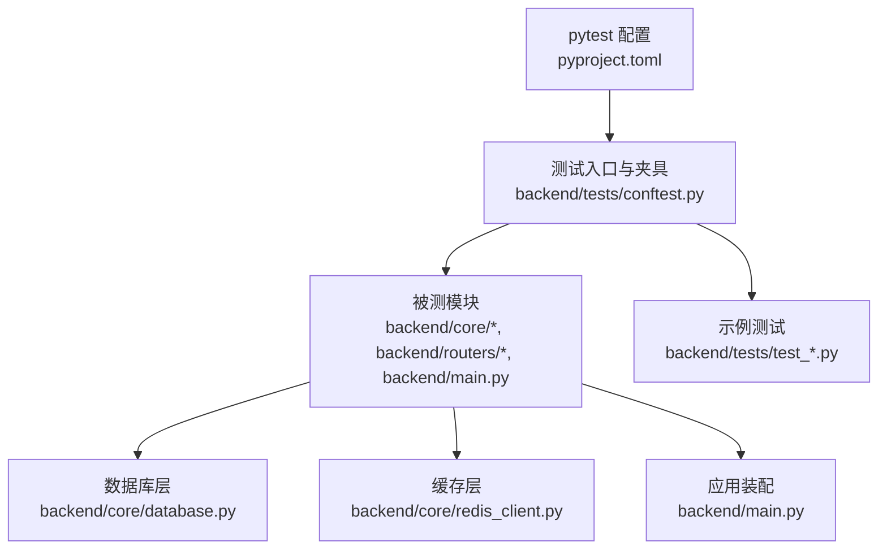
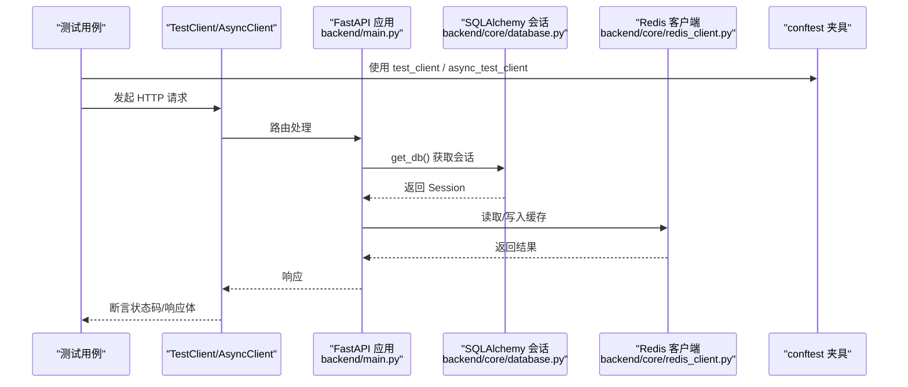
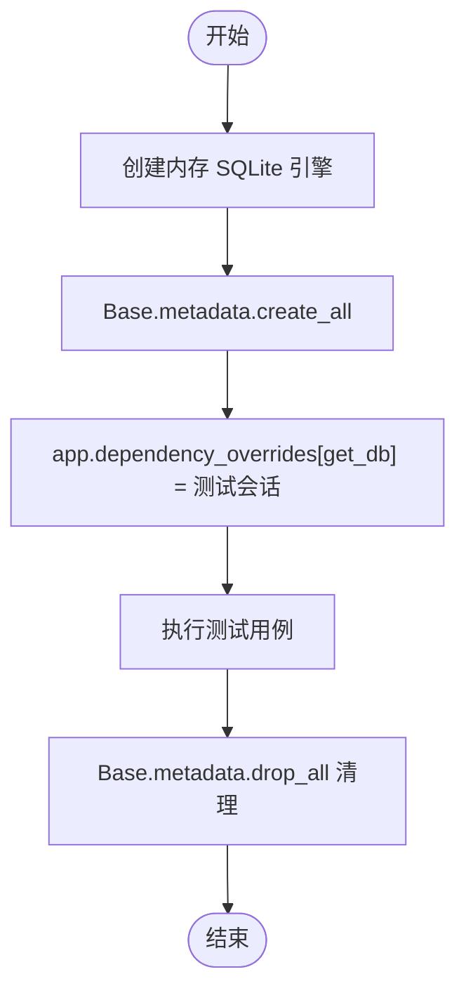
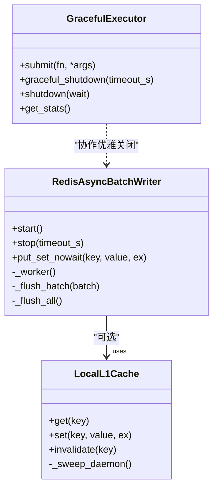
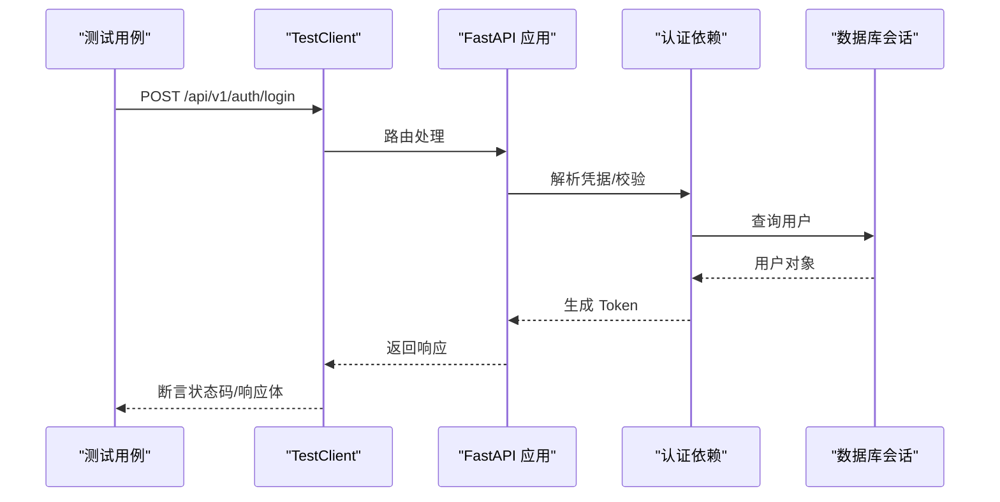
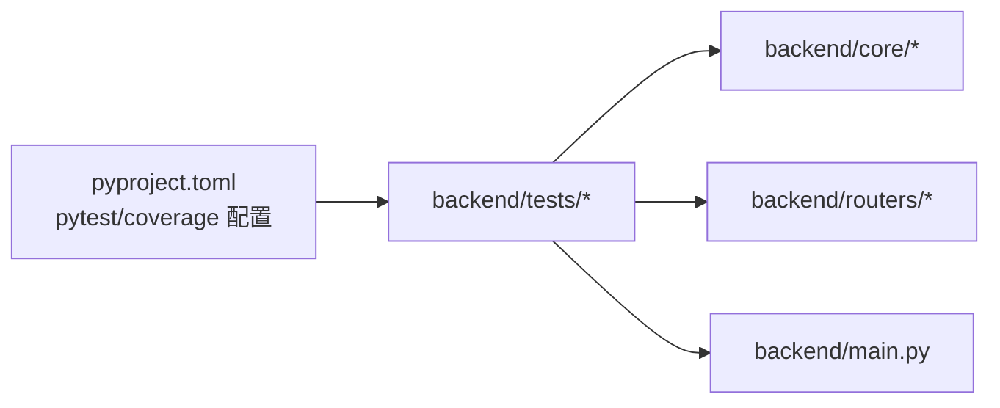

# 单元测试指南

<cite>
**本文引用的文件**
- [backend/tests/conftest.py](file://backend/tests/conftest.py)
- [pyproject.toml](file://pyproject.toml)
- [backend/core/database.py](file://backend/core/database.py)
- [backend/core/redis_client.py](file://backend/core/redis_client.py)
- [backend/main.py](file://backend/main.py)
- [backend/tests/test_database.py](file://backend/tests/test_database.py)
- [backend/tests/test_redis_client.py](file://backend/tests/test_redis_client.py)
- [backend/tests/test_auth.py](file://backend/tests/test_auth.py)
</cite>

## 目录
1. [简介](#简介)
2. [项目结构](#项目结构)
3. [核心组件](#核心组件)
4. [架构总览](#架构总览)
5. [详细组件分析](#详细组件分析)
6. [依赖关系分析](#依赖关系分析)
7. [性能考量](#性能考量)
8. [故障排查指南](#故障排查指南)
9. [结论](#结论)
10. [附录](#附录)

## 简介
本指南面向 Quant Agent 后端，系统讲解如何使用 pytest 编写高质量单元测试。内容涵盖：测试用例组织、Mock 策略、断言最佳实践；conftest.py 提供的 fixtures（如 mock_db、mock_redis、test_client）用法；异步测试的 asyncio 事件循环与协程技巧；测试数据工厂 TestDataFactory 的使用；数据库操作测试、Redis 缓存测试、HTTP API 测试的具体实现方法；以及测试隔离、测试环境配置、覆盖率收集等关键实践。

## 项目结构
后端单测集中在 backend/tests，配合根级 pyproject.toml 中的 pytest 配置统一运行与覆盖统计。conftest.py 提供全局 fixture、环境变量注入、外部服务 Mock、认证旁路等基础设施，确保测试稳定、可重复且无需真实依赖。

图表来源
- [pyproject.toml:125-165](file://pyproject.toml#L125-L165)
- [backend/tests/conftest.py:1-175](file://backend/tests/conftest.py#L1-L175)

章节来源
- [pyproject.toml:125-165](file://pyproject.toml#L125-L165)
- [backend/tests/conftest.py:1-175](file://backend/tests/conftest.py#L1-L175)

## 核心组件
- conftest.py 全局夹具与环境
  - 自动重置熔断器、释放 SQLAlchemy 引擎、Mock Redis 全局实例、Mock 外部服务、为新增鉴权前缀提供假用户旁路。
  - 提供常用 fixtures：mock_db、mock_async_db、mock_redis、mock_httpx、test_client、async_test_client、auth_headers、sample_* 数据、factory（TestDataFactory）。
- 测试配置
  - testpaths、markers、asyncio_mode、env、filterwarnings、coverage 设置集中管理。
- 被测基础设施
  - database.py：同步/异步引擎与会话、URL 转换、连接池参数。
  - redis_client.py：Redis 客户端、批量写入器、L1 本地缓存。
  - main.py：FastAPI 应用装配与路由挂载。

章节来源
- [backend/tests/conftest.py:24-175](file://backend/tests/conftest.py#L24-L175)
- [backend/tests/conftest.py:297-582](file://backend/tests/conftest.py#L297-L582)
- [backend/tests/conftest.py:585-679](file://backend/tests/conftest.py#L585-L679)
- [pyproject.toml:125-199](file://pyproject.toml#L125-L199)
- [backend/core/database.py:1-67](file://backend/core/database.py#L1-L67)
- [backend/core/redis_client.py:1-252](file://backend/core/redis_client.py#L1-L252)
- [backend/main.py:125-200](file://backend/main.py#L125-L200)

## 架构总览
下图展示测试执行时，请求如何经过 FastAPI 应用、中间件、路由，并访问数据库与 Redis 缓存；同时体现 conftest 对依赖的替换与隔离。

图表来源
- [backend/main.py:125-200](file://backend/main.py#L125-L200)
- [backend/core/database.py:32-67](file://backend/core/database.py#L32-L67)
- [backend/core/redis_client.py:25-35](file://backend/core/redis_client.py#L25-L35)
- [backend/tests/conftest.py:356-375](file://backend/tests/conftest.py#L356-L375)

## 详细组件分析

### conftest.py 夹具与策略
- 全局隔离与资源清理
  - 自动重置熔断器，避免跨测试污染。
  - 包装 create_engine/create_async_engine，统一登记并在会话结束时 dispose，消除未关闭连接警告。
  - 在导入任何模块之前 patch redis.asyncio.Redis，防止测试启动阶段建立真实连接。
- 环境变量与外部服务 Mock
  - 强制 SQLite 内存库、降低 bcrypt 成本、注入 JWT/Embedding 等密钥，加速并稳定测试。
  - 自动 Mock Futu/yfinance 等外部服务，可通过标记 no_mock_external 跳过。
- 认证旁路
  - 针对新增鉴权的前缀路由，自动注入假用户，避免大量既有路由单测因缺少 Token 失败。
- 常用 fixtures
  - mock_db、mock_async_db：模拟数据库会话。
  - mock_redis：模拟 Redis 客户端（含 pipeline、pubsub）。
  - test_client、async_test_client：同步/异步 FastAPI 测试客户端。
  - auth_headers、sample_*：认证头与示例数据。
  - factory：TestDataFactory 测试数据工厂。

章节来源
- [backend/tests/conftest.py:24-175](file://backend/tests/conftest.py#L24-L175)
- [backend/tests/conftest.py:177-295](file://backend/tests/conftest.py#L177-L295)
- [backend/tests/conftest.py:297-582](file://backend/tests/conftest.py#L297-L582)
- [backend/tests/conftest.py:585-679](file://backend/tests/conftest.py#L585-L679)

### 数据库操作测试
- 目标
  - 验证 URL 检测、异步 URL 转换、sessionmaker 配置、get_db/get_async_db 行为、连接池参数默认值。
- 推荐做法
  - 使用内存 SQLite 与 StaticPool 保证多线程共享同一内存库。
  - 通过 app.dependency_overrides[get_db] 注入测试会话。
  - 在 setup_method 中创建表，teardown_method 中清理表并恢复依赖。
- 参考实现路径
  - 数据库逻辑与配置验证：[backend/tests/test_database.py](file://backend/tests/test_database.py)
  - 会话生成器与异步会话验证：[backend/tests/test_database.py](file://backend/tests/test_database.py)
  - 连接池参数与环境变量读取：[backend/tests/test_database.py](file://backend/tests/test_database.py)

图表来源
- [backend/tests/test_database.py:33-77](file://backend/tests/test_database.py#L33-L77)
- [backend/tests/test_database.py:93-128](file://backend/tests/test_database.py#L93-L128)
- [backend/tests/test_database.py:141-172](file://backend/tests/test_database.py#L141-L172)

章节来源
- [backend/tests/test_database.py:15-172](file://backend/tests/test_database.py#L15-L172)

### Redis 缓存测试
- 目标
  - 验证 RedisAsyncBatchWriter 的启动/停止、批量刷新、超时刷新、取消后清空队列；LocalL1Cache 的命中/未命中/过期/容量保护；全局实例初始化。
- 推荐做法
  - 使用 AsyncMock 模拟 Redis 客户端与 pipeline。
  - 在 fixture 中启动 writer，并在 teardown 中 cancel 任务，避免跨测试泄漏。
  - 通过 capsys 捕获日志输出，验证异常与告警路径。
- 参考实现路径
  - 批量写入器与 L1 缓存测试：[backend/tests/test_redis_client.py](file://backend/tests/test_redis_client.py)

图表来源
- [backend/core/redis_client.py:46-177](file://backend/core/redis_client.py#L46-L177)
- [backend/core/redis_client.py:184-252](file://backend/core/redis_client.py#L184-L252)
- [backend/tests/test_redis_client.py:31-249](file://backend/tests/test_redis_client.py#L31-L249)
- [backend/tests/test_redis_client.py:251-409](file://backend/tests/test_redis_client.py#L251-L409)
- [backend/tests/test_redis_client.py:434-495](file://backend/tests/test_redis_client.py#L434-L495)

章节来源
- [backend/tests/test_redis_client.py:31-575](file://backend/tests/test_redis_client.py#L31-L575)

### HTTP API 测试
- 目标
  - 验证健康检查、登录流程、Token 刷新、当前用户接口、限流响应头等。
- 推荐做法
  - 使用 TestClient 进行同步请求；或使用 httpx.AsyncClient 进行异步请求。
  - 通过 dependency_overrides 注入测试数据库会话。
  - 利用 conftest 的 _auth_bypass_for_tests 对特定前缀绕过鉴权，简化测试。
- 参考实现路径
  - 认证路由与 JWT 测试：[backend/tests/test_auth.py](file://backend/tests/test_auth.py)
  - 应用装配与路由挂载：[backend/main.py](file://backend/main.py)

图表来源
- [backend/tests/test_auth.py:33-77](file://backend/tests/test_auth.py#L33-L77)
- [backend/tests/test_auth.py:79-179](file://backend/tests/test_auth.py#L79-L179)
- [backend/main.py:125-200](file://backend/main.py#L125-L200)

章节来源
- [backend/tests/test_auth.py:1-179](file://backend/tests/test_auth.py#L1-L179)
- [backend/main.py:125-200](file://backend/main.py#L125-L200)

### 测试数据工厂 TestDataFactory
- 作用
  - 快速生成行情、K 线、订单、持仓、用户等测试数据，支持字段覆盖。
- 使用方式
  - 通过 fixture factory 获取实例，调用 make_quote/make_kline/make_order/make_position/make_user 等方法生成数据。
- 参考实现路径
  - 工厂类与 fixture：[backend/tests/conftest.py](file://backend/tests/conftest.py)

章节来源
- [backend/tests/conftest.py:499-582](file://backend/tests/conftest.py#L499-L582)

### 异步测试与事件循环
- 模式
  - 使用 @pytest.mark.asyncio 或 pytest-asyncio 的 auto 模式编写协程测试。
  - 对于旧式显式事件循环，conftest 提供 event_loop fixture 供兼容。
- 技巧
  - 对需要后台任务的组件（如 RedisAsyncBatchWriter），在 fixture 中启动任务并在 teardown 中 cancel/wait，避免泄漏。
  - 使用 AsyncMock 模拟异步依赖，确保协程正确 await。
- 参考实现路径
  - 事件循环 fixture：[backend/tests/conftest.py](file://backend/tests/conftest.py)
  - 异步测试示例：[backend/tests/test_redis_client.py](file://backend/tests/test_redis_client.py)

章节来源
- [backend/tests/conftest.py:140-150](file://backend/tests/conftest.py#L140-L150)
- [backend/tests/test_redis_client.py:75-249](file://backend/tests/test_redis_client.py#L75-L249)

## 依赖关系分析
- 测试框架与插件
  - pytest、pytest-asyncio、pytest-cov、pytest-xdist、pytest-env 等由 pyproject.toml 统一管理。
- 测试路径与过滤
  - testpaths 指向 backend/tests，python_files/classes/functions 命名规范约束。
- 覆盖率
  - source 指向 backend，omit 排除迁移、PB 生成、主入口等；parallel=true 启用 xdist 合并。
- 环境变量
  - NUMBA_CACHE_DIR 指向 /tmp，避免 IDE safe-delete 冲突；其他密钥与开关在 conftest 中注入。

图表来源
- [pyproject.toml:125-199](file://pyproject.toml#L125-L199)

章节来源
- [pyproject.toml:125-199](file://pyproject.toml#L125-L199)

## 性能考量
- 使用内存数据库与 StaticPool，减少 I/O 开销。
- 降低 bcrypt 成本因子，提升认证相关测试速度。
- 批量写入与管道化操作（Redis pipeline）减少网络往返。
- 合理设置 flush_interval 与 batch_size，平衡延迟与吞吐。
- 使用 AsyncMock 避免真实网络调用，缩短测试时间。

## 故障排查指南
- 常见错误
  - 未关闭数据库连接导致 ResourceWarning：通过 conftest 包装引擎并在会话结束时 dispose。
  - Redis 连接超时：确保在导入前 patch redis.asyncio.Redis，并使用 mock_redis fixture。
  - 权限问题（Futu 日志）：patch TimedRotatingFileHandler 降级为 StreamHandler。
  - 并行测试目录竞态：patch os.makedirs 忽略已存在目录。
- 定位步骤
  - 查看 capsys 捕获的日志输出，确认异常路径。
  - 使用断言验证依赖调用次数与参数，定位 Mock 是否生效。
  - 逐步缩小范围，先验证依赖注入是否正确，再验证业务逻辑。

章节来源
- [backend/tests/conftest.py:36-137](file://backend/tests/conftest.py#L36-L137)
- [backend/tests/test_redis_client.py:145-156](file://backend/tests/test_redis_client.py#L145-L156)

## 结论
通过统一的 conftest 夹具、严格的测试配置与完善的 Mock 策略，Quant Agent 后端实现了高内聚、低耦合的单元测试体系。结合数据库、Redis、HTTP API 的专项测试，以及异步测试与覆盖率收集，能够有效保障代码质量与稳定性。建议在新功能开发中遵循本指南的最佳实践，持续补充用例与维护夹具。

## 附录
- 运行命令
  - 单测：pytest -v
  - 并发：pytest -n auto
  - 覆盖率：pytest --cov=backend --cov-report=html
- 标记与筛选
  - slow/integration/e2e/no_mock_external/asyncio 等标记用于分类与选择性运行。
- 环境变量
  - DATABASE_URL、REDIS_HOST/PORT/PASSWORD、JWT_SECRET_KEY、EMBEDDING_* 等可在 conftest 中覆盖或按需注入。