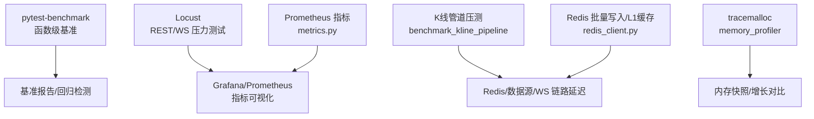
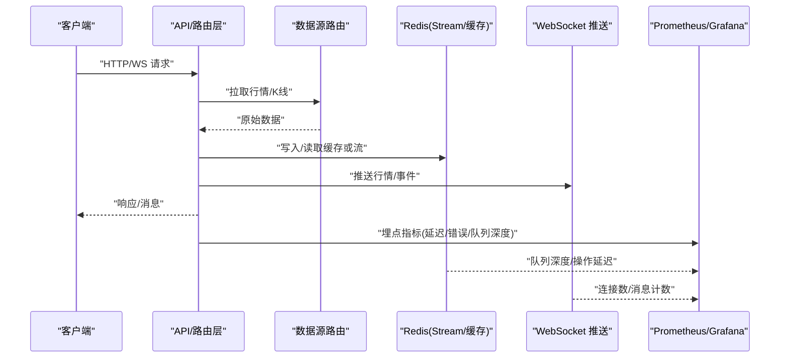
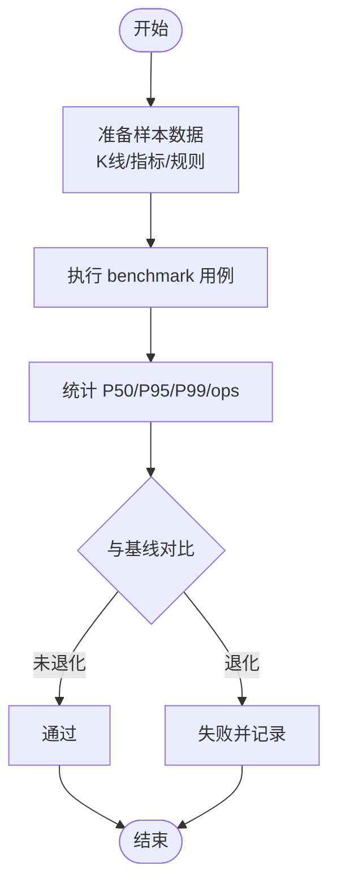
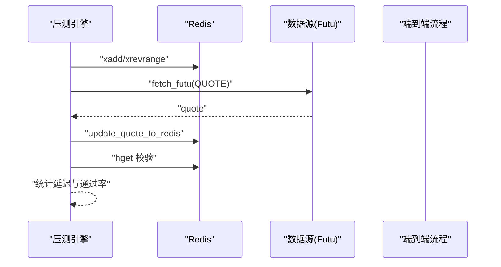
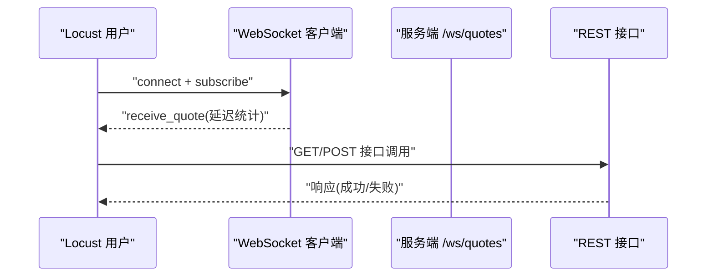
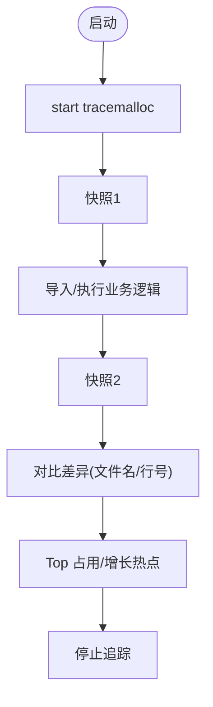
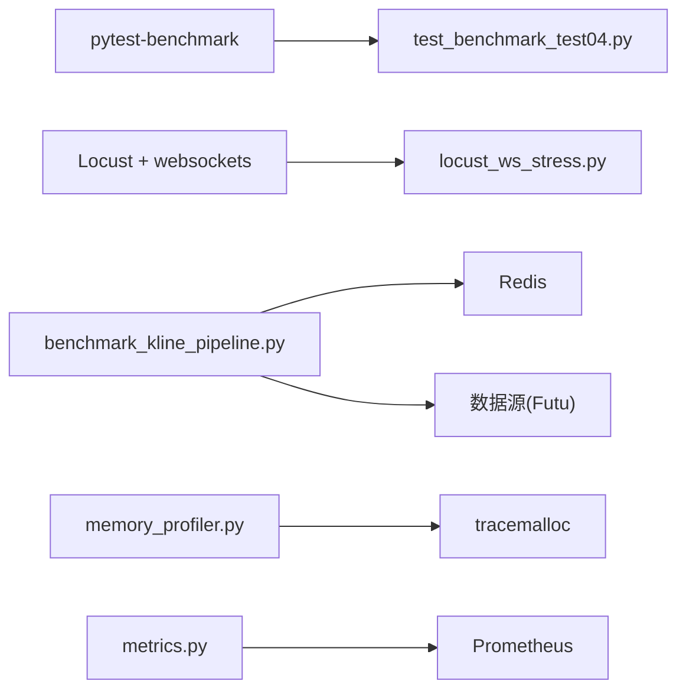

# 性能测试与基准测试

<cite>
**本文引用的文件**
- [backend/tests/test_benchmark_test04.py](file://backend/tests/test_benchmark_test04.py)
- [scripts/memory_profiler.py](file://scripts/memory_profiler.py)
- [scripts/locust_ws_stress.py](file://scripts/locust_ws_stress.py)
- [backend/scripts/benchmark_kline_pipeline.py](file://backend/scripts/benchmark_kline_pipeline.py)
- [backend/core/metrics.py](file://backend/core/metrics.py)
- [backend/core/cache_manager.py](file://backend/core/cache_manager.py)
- [backend/core/redis_client.py](file://backend/core/redis_client.py)
- [docs/09. 性能测试规范.md](file://docs/09. 性能测试规范.md)
</cite>

## 目录
1. [简介](#简介)
2. [项目结构](#项目结构)
3. [核心组件](#核心组件)
4. [架构总览](#架构总览)
5. [详细组件分析](#详细组件分析)
6. [依赖关系分析](#依赖关系分析)
7. [性能注意事项](#性能注意事项)
8. [故障排查指南](#故障排查指南)
9. [结论](#结论)
10. [附录](#附录)

## 简介
本指南面向 Quant Agent 后端，系统化说明如何开展函数级性能测试、内存泄漏检测、负载与压力测试、数据库/缓存/I/O 性能测试，以及如何建立并维护性能基准、进行趋势分析与优化评估，并给出生产环境监控与排障实践。文档基于仓库内现有实现（pytest-benchmark、Locust、tracemalloc、Prometheus 指标等）提供可操作的方法论与落地步骤。

## 项目结构
围绕性能测试与基准测试，仓库提供了以下关键能力：
- 函数级基准测试：使用 pytest-benchmark 对技术指标计算、告警规则评估、K线序列化等进行回归检测。
- 端到端压测：K线管道（Futu → Redis Stream → WebSocket → 客户端）分阶段压测与统计。
- 分布式压力测试：Locust 脚本覆盖 REST 与 WebSocket 场景，支持主从分布式运行。
- 内存分析：tracemalloc 快照与对比，定位导入与运行期热点。
- 可观测性：Prometheus 指标定义，覆盖行情延迟、WebSocket、Redis、数据源、熔断器、数据质量等。
- 缓存与队列：Redis 异步批量写入与进程内 L1 缓存，降低网络开销与提升吞吐。

图表来源
- [backend/tests/test_benchmark_test04.py:1-339](file://backend/tests/test_benchmark_test04.py#L1-L339)
- [scripts/locust_ws_stress.py:1-262](file://scripts/locust_ws_stress.py#L1-L262)
- [backend/scripts/benchmark_kline_pipeline.py:1-368](file://backend/scripts/benchmark_kline_pipeline.py#L1-L368)
- [scripts/memory_profiler.py:1-154](file://scripts/memory_profiler.py#L1-L154)
- [backend/core/metrics.py:1-641](file://backend/core/metrics.py#L1-L641)
- [backend/core/redis_client.py:1-252](file://backend/core/redis_client.py#L1-L252)

章节来源
- [docs/09. 性能测试规范.md:1-294](file://docs/09. 性能测试规范.md#L1-L294)

## 核心组件
- 函数级基准测试套件：覆盖技术指标计算、告警规则评估、指标提取与 K线序列化，提供 P50/P95/P99 目标与回归对比。
- K线管道压测工具：分阶段测量 Redis Stream、数据源获取、写入与端到端延迟，输出统计与通过判定。
- Locust 压力测试：模拟 WebSocket 订阅与 REST 接口并发访问，支持无头模式与 CSV/HTML 报告。
- 内存分析工具：启动 tracemalloc、拍摄快照、模块导入内存分析、前后快照差异对比。
- Prometheus 指标体系：统一暴露行情、WS、Redis、数据源、熔断器、数据质量、分布式节点等指标。
- Redis 高性能写入与缓存：异步批量写入、Pipeline 聚合、进程内 L1 缓存与自动清理。

章节来源
- [backend/tests/test_benchmark_test04.py:1-339](file://backend/tests/test_benchmark_test04.py#L1-L339)
- [backend/scripts/benchmark_kline_pipeline.py:1-368](file://backend/scripts/benchmark_kline_pipeline.py#L1-L368)
- [scripts/locust_ws_stress.py:1-262](file://scripts/locust_ws_stress.py#L1-L262)
- [scripts/memory_profiler.py:1-154](file://scripts/memory_profiler.py#L1-L154)
- [backend/core/metrics.py:1-641](file://backend/core/metrics.py#L1-L641)
- [backend/core/redis_client.py:1-252](file://backend/core/redis_client.py#L1-L252)

## 架构总览
下图展示从请求到落库/缓存的完整路径，以及各阶段的性能观测点与压测入口。

图表来源
- [backend/scripts/benchmark_kline_pipeline.py:59-220](file://backend/scripts/benchmark_kline_pipeline.py#L59-L220)
- [backend/core/metrics.py:20-100](file://backend/core/metrics.py#L20-L100)
- [backend/core/redis_client.py:46-177](file://backend/core/redis_client.py#L46-L177)

## 详细组件分析

### 函数级基准测试（pytest-benchmark）
- 覆盖范围：MA/RSI/MACD/布林带等技术指标计算；价格与指标类告警规则评估；IndicatorEvaluator 批量评估；K线 JSON/Parquet 序列化与读写。
- 使用方法：安装 pytest-benchmark 后，运行指定测试文件并生成 JSON 报告；在 CI 中可与基线对比，超过阈值则失败。
- 回归检测：通过 --benchmark-compare 与阈值策略（如退化 >20%）阻断合并。
- 结果分析：关注 P50/P95/P99 与 ops/sec，结合业务 SLO 判断是否达标。

图表来源
- [backend/tests/test_benchmark_test04.py:168-339](file://backend/tests/test_benchmark_test04.py#L168-L339)
- [docs/09. 性能测试规范.md:45-79](file://docs/09. 性能测试规范.md#L45-L79)

章节来源
- [backend/tests/test_benchmark_test04.py:1-339](file://backend/tests/test_benchmark_test04.py#L1-L339)
- [docs/09. 性能测试规范.md:45-79](file://docs/09. 性能测试规范.md#L45-L79)

### K线管道端到端压测
- 阶段划分：Redis Stream 写入/读取、数据源行情获取、写入 Redis、端到端全链路。
- 指标输出：count/min/max/mean/median/p50/p90/p95/p99/stdev，以及 pass/fail 判定（P99 < 50ms）。
- 使用方式：命令行参数控制标的、迭代次数与阶段；支持仅跑某阶段快速验证。

图表来源
- [backend/scripts/benchmark_kline_pipeline.py:98-220](file://backend/scripts/benchmark_kline_pipeline.py#L98-L220)

章节来源
- [backend/scripts/benchmark_kline_pipeline.py:1-368](file://backend/scripts/benchmark_kline_pipeline.py#L1-L368)

### 分布式压力测试（Locust）
- 场景：WebSocket /ws/quotes 订阅与接收；REST 健康检查、报价查询、K线历史、选股器。
- 运行模式：单机、master/worker 分布式、无头模式（CI），支持 CSV/HTML 报告。
- 行为模拟：随机标的订阅、周期性重连、超时处理与请求事件上报。

图表来源
- [scripts/locust_ws_stress.py:34-199](file://scripts/locust_ws_stress.py#L34-L199)
- [scripts/locust_ws_stress.py:201-262](file://scripts/locust_ws_stress.py#L201-L262)

章节来源
- [scripts/locust_ws_stress.py:1-262](file://scripts/locust_ws_stress.py#L1-L262)

### 内存泄漏检测与分析（tracemalloc）
- 功能：启动追踪、拍摄快照、过滤系统导入噪声、打印 Top 占用、对比两次快照差异、分析模块导入内存增量。
- 使用建议：在关键业务流程前后拍摄快照，定位增长热点；结合代码行号定位具体分配位置。

图表来源
- [scripts/memory_profiler.py:17-80](file://scripts/memory_profiler.py#L17-L80)
- [scripts/memory_profiler.py:82-149](file://scripts/memory_profiler.py#L82-L149)

章节来源
- [scripts/memory_profiler.py:1-154](file://scripts/memory_profiler.py#L1-L154)

### 数据库查询优化测试
- 方法：以 Redis Stream/List 作为“数据库”抽象，分别压测写入与读取延迟；端到端包含数据源→写入→读取校验。
- 指标：P50/P95/P99、标准差、通过率；可结合 Prometheus 的 REDIS_OPERATION_LATENCY 与 REDIS_QUEUE_DEPTH 观察队列积压与操作延迟。
- 优化方向：批量写入、Pipeline、合理 TTL、避免大对象频繁写盘。

章节来源
- [backend/scripts/benchmark_kline_pipeline.py:98-220](file://backend/scripts/benchmark_kline_pipeline.py#L98-L220)
- [backend/core/metrics.py:74-94](file://backend/core/metrics.py#L74-L94)

### 缓存性能测试
- 本地 L1 缓存：进程内字典缓存短效键，后台定时清理过期项，容量超限安全熔断清空，减少 Redis 往返。
- 批量写入：异步队列 + Pipeline 聚合，降低 RTT 与带宽占用；优雅停机确保数据不丢失。
- 测试要点：命中/未命中比例、延迟分布、内存占用与清理效果；可通过 metrics 中的 KLINE_CACHE_* 指标观察。

章节来源
- [backend/core/redis_client.py:180-252](file://backend/core/redis_client.py#L180-L252)
- [backend/core/redis_client.py:46-177](file://backend/core/redis_client.py#L46-L177)
- [backend/core/metrics.py:286-301](file://backend/core/metrics.py#L286-L301)

### 网络 I/O 性能测试
- 数据源 I/O：针对 Futu/其他数据源的 fetch 延迟进行压测，统计 P99 并判断是否达标。
- WebSocket I/O：Locust 模拟高并发订阅与消息接收，记录连接建立与消息接收延迟。
- 指标：DATASOURCE_LATENCY、WS_ACTIVE_CONNECTIONS、WS_MESSAGES_SENT/DROPPED。

章节来源
- [backend/scripts/benchmark_kline_pipeline.py:129-155](file://backend/scripts/benchmark_kline_pipeline.py#L129-L155)
- [scripts/locust_ws_stress.py:119-199](file://scripts/locust_ws_stress.py#L119-L199)
- [backend/core/metrics.py:49-72](file://backend/core/metrics.py#L49-L72)
- [backend/core/metrics.py:152-182](file://backend/core/metrics.py#L152-L182)

### 性能基准的建立与维护
- 基线采集：定期运行基准测试并保存 JSON 报告；记录测试环境与数据规模。
- 回归检测：CI 中比较当前与基线，超过阈值（如 20%）即失败；保留直方图与排序便于定位。
- 趋势分析：将多次基准结果入库，绘制 P95/P99 趋势，识别缓慢退化。
- 优化评估：每次优化后重新运行基准，量化收益并更新基线与报告。

章节来源
- [docs/09. 性能测试规范.md:215-284](file://docs/09. 性能测试规范.md#L215-L284)

### 生产环境性能监控与故障排查
- 监控指标：行情延迟 Summary、WebSocket 连接数/消息计数、Redis 队列深度/操作延迟、数据源延迟/错误/限流、熔断器状态、数据质量等级等。
- 告警策略：队列深度突增、延迟 P99 超标、数据源不可用、线程数超阈值等。
- 排查路径：从 Grafana 面板定位瓶颈层（数据源/Redis/WS/服务），结合日志与指标下钻；必要时使用内存分析工具定位泄漏。

章节来源
- [backend/core/metrics.py:20-100](file://backend/core/metrics.py#L20-L100)
- [backend/core/metrics.py:152-217](file://backend/core/metrics.py#L152-L217)
- [backend/core/metrics.py:594-619](file://backend/core/metrics.py#L594-L619)

## 依赖关系分析
- 基准测试依赖 pytest-benchmark 插件；若不可用则跳过模块。
- K线管道压测依赖 Redis 与数据源 SDK；缺失时阶段跳过并记录原因。
- Locust 依赖 websockets；用于 WebSocket 压测。
- 内存分析依赖 Python 内置 tracemalloc。
- 指标导出依赖 prometheus_client。

图表来源
- [backend/tests/test_benchmark_test04.py:32-39](file://backend/tests/test_benchmark_test04.py#L32-L39)
- [scripts/locust_ws_stress.py:25-31](file://scripts/locust_ws_stress.py#L25-L31)
- [backend/scripts/benchmark_kline_pipeline.py:129-155](file://backend/scripts/benchmark_kline_pipeline.py#L129-L155)
- [scripts/memory_profiler.py:7-10](file://scripts/memory_profiler.py#L7-L10)
- [backend/core/metrics.py:18-28](file://backend/core/metrics.py#L18-L28)

章节来源
- [backend/tests/test_benchmark_test04.py:32-39](file://backend/tests/test_benchmark_test04.py#L32-L39)
- [scripts/locust_ws_stress.py:25-31](file://scripts/locust_ws_stress.py#L25-L31)
- [backend/scripts/benchmark_kline_pipeline.py:129-155](file://backend/scripts/benchmark_kline_pipeline.py#L129-L155)
- [scripts/memory_profiler.py:7-10](file://scripts/memory_profiler.py#L7-L10)
- [backend/core/metrics.py:18-28](file://backend/core/metrics.py#L18-L28)

## 性能注意事项
- 基准测试需固定数据规模与环境，避免噪声；多次运行取稳定值。
- 压测前预热缓存与连接，避免冷启动影响结果。
- 关注尾部延迟（P95/P99）而非仅平均值；结合错误率综合评估。
- 合理使用批量写入与缓存，避免过度放大内存占用。
- 对第三方数据源设置超时与重试策略，防止雪崩。

## 故障排查指南
- 基准退化：查看具体用例的 P95/P99 变化，定位最近变更；必要时回滚或优化。
- 队列积压：检查 REDIS_QUEUE_DEPTH 与 REDIS_OPERATION_LATENCY，确认消费者是否阻塞。
- WebSocket 断连：观察 WS_ACTIVE_CONNECTIONS 与 WS_MESSAGES_DROPPED，排查慢客户端与背压。
- 数据源异常：关注 DATASOURCE_ERRORS、DATASOURCE_RATE_LIMITS、CIRCUIT_BREAKER_STATE，启用熔断与降级。
- 内存泄漏：使用 memory_profiler 对比快照，聚焦增长热点；结合 LocalL1Cache 清理任务是否生效。

章节来源
- [backend/core/metrics.py:74-100](file://backend/core/metrics.py#L74-L100)
- [backend/core/metrics.py:152-217](file://backend/core/metrics.py#L152-L217)
- [backend/core/redis_client.py:200-212](file://backend/core/redis_client.py#L200-L212)
- [scripts/memory_profiler.py:57-80](file://scripts/memory_profiler.py#L57-L80)

## 结论
通过 pytest-benchmark、Locust、tracemalloc 与 Prometheus 指标体系，Quant Agent 后端形成了完整的性能测试与基准测试闭环：从函数级回归到端到端压测，从内存分析到生产监控。建议持续维护基线、自动化回归、结合业务 SLO 设定告警，并在每次优化后量化收益，确保系统在高并发与低延迟场景下的稳定性与可演进性。

## 附录
- 常用命令参考：
  - 运行基准：pytest backend/tests/test_benchmark_test04.py --benchmark-only --benchmark-json=benchmark.json
  - 对比基线：pytest-benchmark compare baseline.json current.json
  - Locust 无头压测：locust -f scripts/locust_ws_stress.py --host ws://localhost:8000 --headless -u 1000 -r 10 -t 60s --csv=locust_report
  - K线管道压测：python -m backend.scripts.benchmark_kline_pipeline --symbols US.AAPL,HK.00700 --iterations 100
  - 内存分析：python scripts/memory_profiler.py

章节来源
- [docs/09. 性能测试规范.md:72-79](file://docs/09. 性能测试规范.md#L72-L79)
- [scripts/locust_ws_stress.py:7-23](file://scripts/locust_ws_stress.py#L7-L23)
- [backend/scripts/benchmark_kline_pipeline.py:18-27](file://backend/scripts/benchmark_kline_pipeline.py#L18-L27)
- [scripts/memory_profiler.py:120-149](file://scripts/memory_profiler.py#L120-L149)
