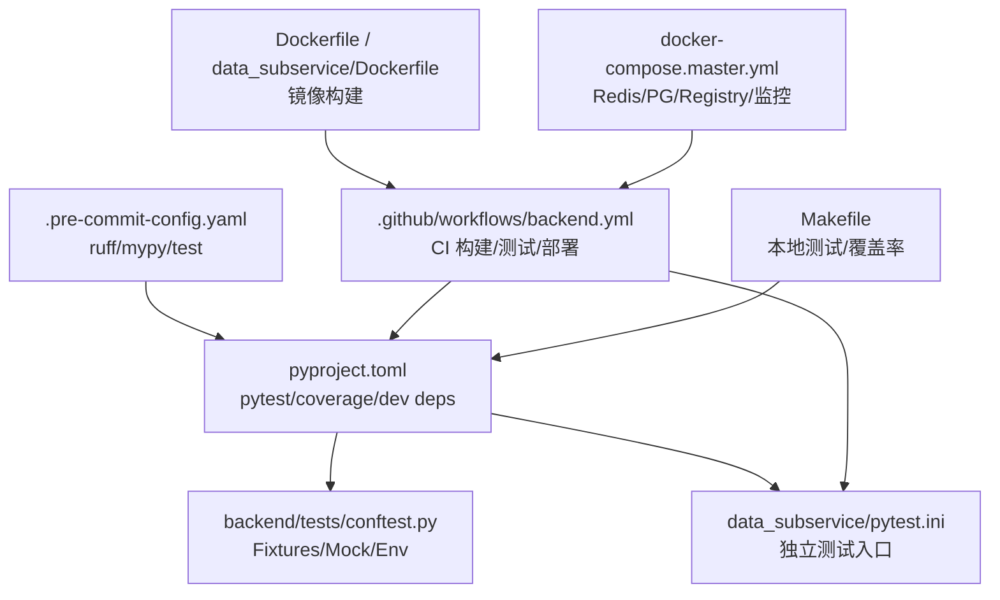
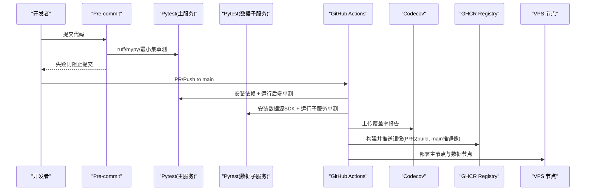
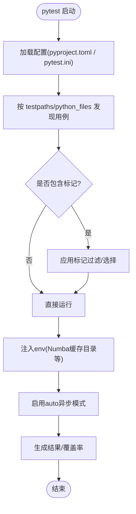
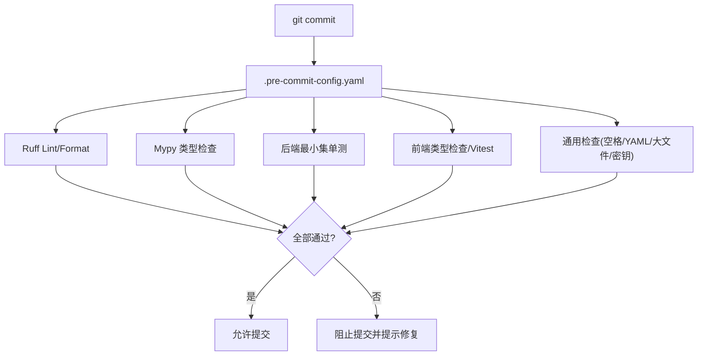
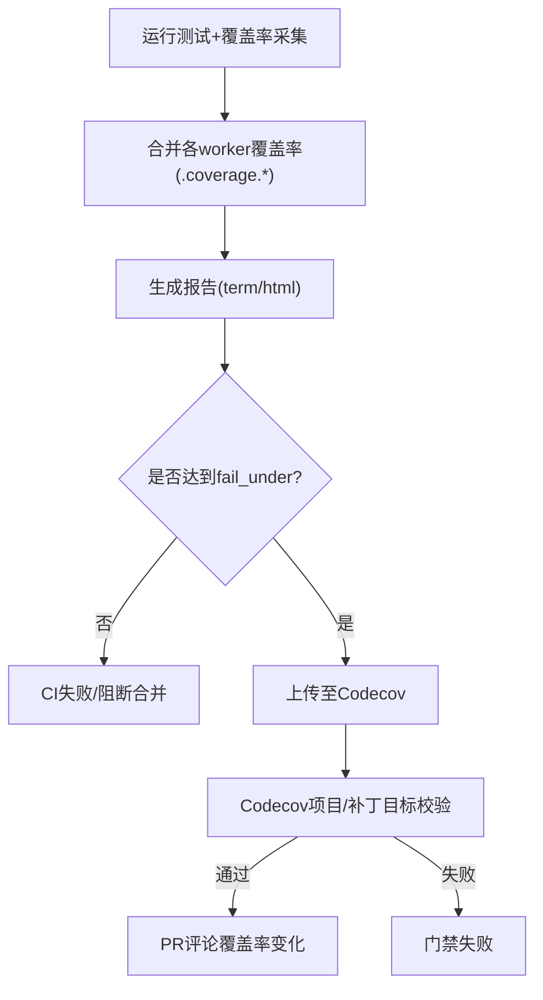
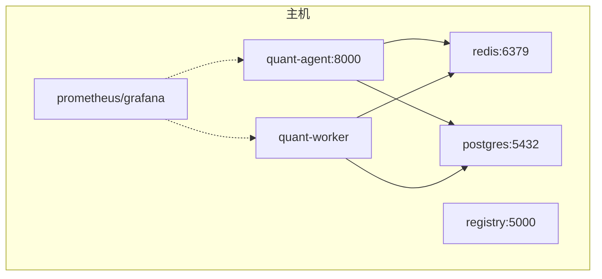
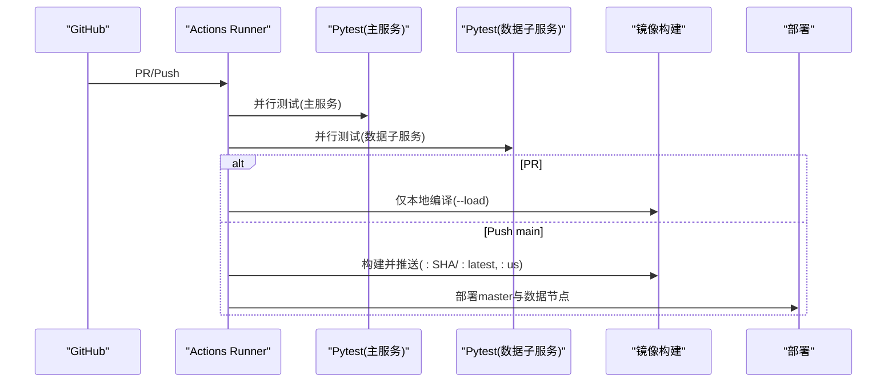
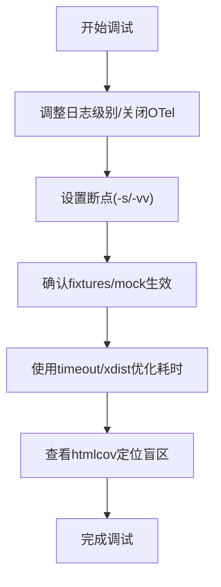
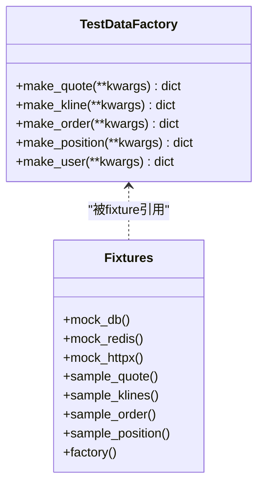
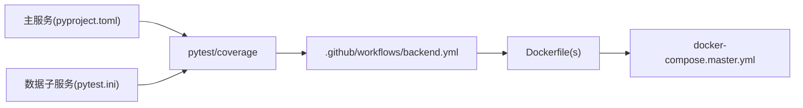

# 测试基础设施与工具链

<cite>
**本文引用的文件**
- [pyproject.toml](file://pyproject.toml)
- [.pre-commit-config.yaml](file://.pre-commit-config.yaml)
- [codecov.yml](file://codecov.yml)
- [backend/tests/conftest.py](file://backend/tests/conftest.py)
- [data_subservice/pytest.ini](file://data_subservice/pytest.ini)
- [.github/workflows/backend.yml](file://.github/workflows/backend.yml)
- [Dockerfile](file://Dockerfile)
- [data_subservice/Dockerfile](file://data_subservice/Dockerfile)
- [docker-compose.master.yml](file://docker-compose.master.yml)
- [Makefile](file://Makefile)
</cite>

## 目录
1. [简介](#简介)
2. [项目结构](#项目结构)
3. [核心组件](#核心组件)
4. [架构总览](#架构总览)
5. [详细组件分析](#详细组件分析)
6. [依赖关系分析](#依赖关系分析)
7. [性能考量](#性能考量)
8. [故障排查指南](#故障排查指南)
9. [结论](#结论)
10. [附录](#附录)

## 简介
本文件系统化梳理 Quant Agent 后端的测试基础设施与工具链，覆盖 pytest 配置、预提交钩子、代码覆盖率门禁、容器化部署与 CI/CD 集成、并行测试策略、调试技巧以及测试数据与环境隔离的最佳实践。目标是让开发者在本地与 CI 中都能稳定、快速、可观测地运行测试，并通过质量门禁保障代码质量。

## 项目结构
后端测试相关的关键位置与职责：
- 根级 pyproject.toml：定义主服务 pytest 配置、覆盖率收集、开发依赖组（含 pytest、pytest-cov、pytest-xdist、pytest-asyncio、pytest-env 等）。
- backend/tests/conftest.py：集中提供测试夹具、全局 mock、环境变量注入、数据库引擎释放、认证旁路等。
- data_subservice/pytest.ini：数据子服务的独立 pytest 入口，避免重型 SDK 污染主环境。
- .pre-commit-config.yaml：提交前执行 ruff/mypy、前后端单测与通用检查。
- codecov.yml：覆盖率目标、补丁覆盖率门禁、忽略规则。
- .github/workflows/backend.yml：CI 中的构建、测试、镜像推送与部署流水线。
- Dockerfile / data_subservice/Dockerfile：后端与数据子服务的多阶段镜像构建。
- docker-compose.master.yml：本地/CI 部署 Redis、PostgreSQL、应用、监控与私有 registry。
- Makefile：常用开发与测试命令封装。

**图示来源**
- [pyproject.toml:125-165](file://pyproject.toml#L125-L165)
- [backend/tests/conftest.py:24-33](file://backend/tests/conftest.py#L24-L33)
- [data_subservice/pytest.ini:17-36](file://data_subservice/pytest.ini#L17-L36)
- [.pre-commit-config.yaml:1-72](file://.pre-commit-config.yaml#L1-L72)
- [.github/workflows/backend.yml:119-192](file://.github/workflows/backend.yml#L119-L192)
- [Dockerfile:1-60](file://Dockerfile#L1-L60)
- [data_subservice/Dockerfile:1-72](file://data_subservice/Dockerfile#L1-L72)
- [docker-compose.master.yml:16-196](file://docker-compose.master.yml#L16-L196)
- [Makefile:46-64](file://Makefile#L46-L64)

**章节来源**
- [pyproject.toml:125-165](file://pyproject.toml#L125-L165)
- [backend/tests/conftest.py:24-33](file://backend/tests/conftest.py#L24-L33)
- [data_subservice/pytest.ini:17-36](file://data_subservice/pytest.ini#L17-L36)
- [.pre-commit-config.yaml:1-72](file://.pre-commit-config.yaml#L1-L72)
- [.github/workflows/backend.yml:119-192](file://.github/workflows/backend.yml#L119-L192)
- [Dockerfile:1-60](file://Dockerfile#L1-L60)
- [data_subservice/Dockerfile:1-72](file://data_subservice/Dockerfile#L1-L72)
- [docker-compose.master.yml:16-196](file://docker-compose.master.yml#L16-L196)
- [Makefile:46-64](file://Makefile#L46-L64)

## 核心组件
- pytest 配置（主服务）：通过 pyproject.toml 的 [tool.pytest.ini_options] 统一 testpaths、发现规则、标记、异步模式、警告过滤与插件禁用；配合 pytest-env 注入 NUMBA_CACHE_DIR 以避免 IDE safe-delete 干扰缓存写入。
- pytest 配置（数据子服务）：data_subservice/pytest.ini 独立管理测试路径、标记、异步模式与环境变量，确保重型 SDK 不污染主工程。
- 预提交钩子：ruff lint/format、mypy 类型检查、后端最小集单测、前端类型检查与 Vitest 单测、通用文件检查与安全扫描。
- 覆盖率门禁：codecov.yml 定义项目与补丁覆盖率目标、阈值与忽略规则；pyproject.toml 中 coverage.run.source/omit/parallel 与 coverage.report.fail_under=80。
- CI/CD：backend.yml 将测试作为构建与部署的前置门禁，PR 阶段仅编译验证，合入 main 才推送镜像并部署；数据子服务单独安装依赖并运行其 pytest。
- 容器化：Dockerfile 与 data_subservice/Dockerfile 采用多阶段构建，生产镜像不含 dev 依赖；docker-compose.master.yml 提供 Redis、PostgreSQL、应用、监控与内网 registry。
- 本地工具：Makefile 封装测试、覆盖率、开发环境启动等常用命令。

**章节来源**
- [pyproject.toml:125-165](file://pyproject.toml#L125-L165)
- [pyproject.toml:167-210](file://pyproject.toml#L167-L210)
- [data_subservice/pytest.ini:17-36](file://data_subservice/pytest.ini#L17-L36)
- [.pre-commit-config.yaml:1-72](file://.pre-commit-config.yaml#L1-L72)
- [codecov.yml:18-64](file://codecov.yml#L18-L64)
- [.github/workflows/backend.yml:119-192](file://.github/workflows/backend.yml#L119-L192)
- [Dockerfile:1-60](file://Dockerfile#L1-L60)
- [data_subservice/Dockerfile:1-72](file://data_subservice/Dockerfile#L1-L72)
- [docker-compose.master.yml:16-196](file://docker-compose.master.yml#L16-L196)
- [Makefile:46-64](file://Makefile#L46-L64)

## 架构总览
下图展示从提交到 CI 构建、测试、覆盖率上报与部署的整体流程，以及本地开发时的测试与覆盖率生成路径。

**图示来源**
- [.pre-commit-config.yaml:1-72](file://.pre-commit-config.yaml#L1-L72)
- [.github/workflows/backend.yml:119-192](file://.github/workflows/backend.yml#L119-L192)
- [.github/workflows/backend.yml:203-275](file://.github/workflows/backend.yml#L203-L275)
- [codecov.yml:18-64](file://codecov.yml#L18-L64)
- [Dockerfile:1-60](file://Dockerfile#L1-L60)
- [data_subservice/Dockerfile:1-72](file://data_subservice/Dockerfile#L1-L72)

## 详细组件分析

### pytest 配置与测试发现
- 主服务（pyproject.toml）：
  - testpaths 指向 backend/tests，python_files/classes/functions 规范命名约定。
  - addopts 启用严格标记、短堆栈、禁用 unraisableexception 插件以规避 Python 3.13 下 unittest.mock 内部协程未等待导致的误报。
  - markers 定义 slow/integration/e2e/no_mock_external/asyncio。
  - asyncio_mode=auto 自动处理异步测试。
  - env 注入 NUMBA_CACHE_DIR=/tmp/numba_cache，避免 workspace 安全删除拦截导致 import 崩溃。
  - filterwarnings 忽略常见告警，保持输出整洁。
- 数据子服务（data_subservice/pytest.ini）：
  - 独立 testpaths=tests，复用相同标记与异步模式，确保重型 SDK 隔离。
  - 通过 conftest 将仓库根与 data_subservice 加入 sys.path，保证跨模块导入。

**图示来源**
- [pyproject.toml:125-165](file://pyproject.toml#L125-L165)
- [data_subservice/pytest.ini:17-36](file://data_subservice/pytest.ini#L17-L36)

**章节来源**
- [pyproject.toml:125-165](file://pyproject.toml#L125-L165)
- [data_subservice/pytest.ini:17-36](file://data_subservice/pytest.ini#L17-L36)

### 预提交钩子（代码质量、格式化、安全扫描）
- Ruff：对 backend/*.py 进行 lint 与 format，支持 --fix。
- Mypy：优先使用 .venv 内 mypy，减少 uv run 解析开销；针对 backend/core 与 backend/routers 做类型检查。
- 后端最小集单测：提交时快速校验关键用例，缩短反馈周期。
- 前端：类型检查与 Vitest 单测。
- 通用检查：尾随空格、文件结尾、YAML 校验、大文件检测、合并冲突、私钥检测。

**图示来源**
- [.pre-commit-config.yaml:1-72](file://.pre-commit-config.yaml#L1-L72)

**章节来源**
- [.pre-commit-config.yaml:1-72](file://.pre-commit-config.yaml#L1-L72)

### 代码覆盖率配置（收集、报告、门禁）
- 覆盖率收集：
  - source 限定 backend，omit 排除测试、脚本、迁移、pb 生成、调度器与生命周期入口等低价值单测区域。
  - parallel=true 兼容 xdist 并行合并覆盖率数据。
  - report.fail_under=80 作为本地与 CI 的质量门槛。
- Codecov 门禁：
  - 项目级：后端 target 40%（爬坡计划），前端 target 15%，均带 threshold 与 if_ci_failed: error。
  - 补丁级：新增代码至少 60% 覆盖率，threshold 5%。
  - ignore：测试文件、生成代码、迁移与 pb 文件。
- 趋势与评论：comment 布局与行为默认，require_head=true 确保头分支存在。

**图示来源**
- [pyproject.toml:167-210](file://pyproject.toml#L167-L210)
- [codecov.yml:18-64](file://codecov.yml#L18-L64)

**章节来源**
- [pyproject.toml:167-210](file://pyproject.toml#L167-L210)
- [codecov.yml:18-64](file://codecov.yml#L18-L64)

### 测试环境的容器化部署
- 后端镜像：多阶段构建，builder 阶段安装依赖，运行阶段仅复制 .venv 与必要源码，暴露 8000 端口。
- 数据子服务镜像：全量 datasource-all SDK，运行时通过 DS_CAPABILITIES 隔离能力，暴露 8001 端口。
- 本地/CI 编排：docker-compose.master.yml 提供 Redis、PostgreSQL、应用、Worker、Prometheus/Grafana 与内网 registry（绑定 loopback 与 Tailscale IP，不暴露公网）。

**图示来源**
- [Dockerfile:1-60](file://Dockerfile#L1-L60)
- [data_subservice/Dockerfile:1-72](file://data_subservice/Dockerfile#L1-L72)
- [docker-compose.master.yml:16-196](file://docker-compose.master.yml#L16-L196)

**章节来源**
- [Dockerfile:1-60](file://Dockerfile#L1-L60)
- [data_subservice/Dockerfile:1-72](file://data_subservice/Dockerfile#L1-L72)
- [docker-compose.master.yml:16-196](file://docker-compose.master.yml#L16-L196)

### CI/CD 流水线集成与并行测试执行策略
- 触发策略：PR 到 main 仅本地编译验证（--load），push main 真实 build + push 镜像并部署。
- 测试门禁：
  - 后端单测：uv sync --all-extras，禁用 OTel 导出，运行 backend/tests。
  - 数据子服务单测：安装 requirements.txt 与测试依赖，运行 data_subservice/pytest.ini。
- 构建与部署：
  - 主服务镜像：打 :DEPLOY_SHA 与 :latest。
  - 数据子服务镜像：全量 datasource-all，打 :DEPLOY_SHA 与 :us。
  - 部署 master 与 4 个数据节点矩阵，内网 registry 中转加速北京节点拉取。
- 并行策略：
  - 使用 pytest-xdist 并行执行（coverage.parallel=true 合并数据）。
  - CI 中 jobs 并行执行 compose-hygiene、test-backend、test-data-subservice、build、deploy-*。

**图示来源**
- [.github/workflows/backend.yml:119-192](file://.github/workflows/backend.yml#L119-L192)
- [.github/workflows/backend.yml:203-275](file://.github/workflows/backend.yml#L203-L275)
- [.github/workflows/backend.yml:280-532](file://.github/workflows/backend.yml#L280-L532)
- [.github/workflows/backend.yml:538-800](file://.github/workflows/backend.yml#L538-L800)

**章节来源**
- [.github/workflows/backend.yml:119-192](file://.github/workflows/backend.yml#L119-L192)
- [.github/workflows/backend.yml:203-275](file://.github/workflows/backend.yml#L203-L275)
- [.github/workflows/backend.yml:280-532](file://.github/workflows/backend.yml#L280-L532)
- [.github/workflows/backend.yml:538-800](file://.github/workflows/backend.yml#L538-L800)

### 测试调试工具与技巧
- 日志输出：
  - CI 中设置 OTEL_SDK_DISABLED=true 避免 trace 导出重试拖垮 job。
  - pytest 添加 --log-cli-level=WARNING 控制日志级别。
- 断点调试：
  - 使用 pytest 的 -s 或 -vv 结合 pdb/IDE 断点；conftest 已提供 event_loop fixture 兼容旧式事件循环调用。
- 性能分析：
  - 使用 pytest-timeout 防止慢测试卡住；pytest-xdist 并行加速。
  - 覆盖率报告 htmlcov 定位未覆盖行，结合 coverage.omit 聚焦业务逻辑。
- 外部依赖隔离：
  - conftest 自动 mock Redis、Futu/yfinance、HTTP 客户端与数据库会话，避免真实网络/DB 依赖。
  - 通过 no_mock_external 标记跳过外部服务 mock，用于需要真实网络的集成测试。

**图示来源**
- [backend/tests/conftest.py:140-149](file://backend/tests/conftest.py#L140-L149)
- [backend/tests/conftest.py:177-268](file://backend/tests/conftest.py#L177-L268)
- [backend/tests/conftest.py:271-295](file://backend/tests/conftest.py#L271-L295)
- [backend/tests/conftest.py:320-352](file://backend/tests/conftest.py#L320-L352)
- [.github/workflows/backend.yml:144-149](file://.github/workflows/backend.yml#L144-L149)

**章节来源**
- [backend/tests/conftest.py:140-149](file://backend/tests/conftest.py#L140-L149)
- [backend/tests/conftest.py:177-268](file://backend/tests/conftest.py#L177-L268)
- [backend/tests/conftest.py:271-295](file://backend/tests/conftest.py#L271-L295)
- [backend/tests/conftest.py:320-352](file://backend/tests/conftest.py#L320-L352)
- [.github/workflows/backend.yml:144-149](file://.github/workflows/backend.yml#L144-L149)

### 测试数据管理、环境隔离与依赖管理最佳实践
- 测试数据：
  - 使用 TestDataFactory 快速生成行情、K线、订单、持仓、用户等样例数据，避免硬编码散落。
  - 示例数据通过 fixtures 暴露，便于复用与扩展。
- 环境隔离：
  - 强制 SQLite 内存库与测试密码，避免 CI 中 PostgreSQL 类型编译失败。
  - 环境变量集中注入（JWT、嵌入模型、加密密钥、bcrypt 成本因子等），确保测试一致性。
  - 数据子服务独立 pytest.ini 与 requirements.txt，重型 SDK 不污染主环境。
- 依赖管理：
  - 开发依赖收口于 dependency-groups.dev，pre-commit 与测试工具链版本锁定，避免漂移。
  - 覆盖率 omits 排除低价值代码，focus 业务逻辑；parallel 合并 xdist 数据。
  - CI 中区分主服务与数据子服务依赖安装，确保最小化构建与最快反馈。

**图示来源**
- [backend/tests/conftest.py:499-582](file://backend/tests/conftest.py#L499-L582)

**章节来源**
- [backend/tests/conftest.py:499-582](file://backend/tests/conftest.py#L499-L582)
- [pyproject.toml:212-231](file://pyproject.toml#L212-L231)
- [data_subservice/pytest.ini:1-15](file://data_subservice/pytest.ini#L1-L15)

## 依赖关系分析
- 主服务与数据子服务解耦：主服务通过 HTTP 路由转发到数据子服务，避免在主环境安装 tushare/futu-api 等重型 SDK。
- 测试与覆盖率：pytest 与 pytest-cov/xdist/asyncio/env 组合，配合 conftest 的全局 mock 与环境注入，确保稳定与快速。
- CI 与部署：backend.yml 串联测试、构建、镜像推送与部署，compose-hygiene 前置校验 compose 文件健康度。
- 容器编排：master compose 提供 Redis/PG/应用/监控/registry，确保本地与 CI 一致的环境。

**图示来源**
- [pyproject.toml:125-165](file://pyproject.toml#L125-L165)
- [data_subservice/pytest.ini:17-36](file://data_subservice/pytest.ini#L17-L36)
- [.github/workflows/backend.yml:119-192](file://.github/workflows/backend.yml#L119-L192)
- [Dockerfile:1-60](file://Dockerfile#L1-L60)
- [docker-compose.master.yml:16-196](file://docker-compose.master.yml#L16-L196)

**章节来源**
- [pyproject.toml:125-165](file://pyproject.toml#L125-L165)
- [data_subservice/pytest.ini:17-36](file://data_subservice/pytest.ini#L17-L36)
- [.github/workflows/backend.yml:119-192](file://.github/workflows/backend.yml#L119-L192)
- [Dockerfile:1-60](file://Dockerfile#L1-L60)
- [docker-compose.master.yml:16-196](file://docker-compose.master.yml#L16-L196)

## 性能考量
- 并行测试：pytest-xdist 并行执行，coverage.parallel=true 合并数据，显著缩短 CI 时间。
- 异步测试：asyncio_mode=auto 简化异步用例编写与执行。
- 资源限制：compose 中为 Redis/PG/App/Worker 设置 CPU/内存限制，避免资源争用。
- 缓存与IO：NUMBA_CACHE_DIR 指向 /tmp，避免 IDE safe-delete 拦截；CI 中禁用 OTel 导出避免网络重试阻塞。
- 构建优化：多阶段镜像、国内镜像源、BuildKit 缓存，减少构建时间与体积。

[本节为通用指导，无需特定文件来源]

## 故障排查指南
- 常见问题：
  - 导入失败：确认数据子服务在独立环境运行（requirements.txt + pytest.ini），避免重型 SDK 污染主环境。
  - 连接超时：CI 中设置 OTEL_SDK_DISABLED=true；本地确保 Redis/PG 就绪（docker-compose up）。
  - 权限问题：conftest 已兜底 futu 日志目录创建与写入权限异常，必要时检查 macOS TCC/sandbox。
  - 覆盖率偏低：检查 coverage.omit 是否误排业务代码；补充单元测试提升 fail_under 达标。
- 定位步骤：
  - 使用 pytest -v -s 查看详细输出；结合 --tb=short 快速定位错误。
  - 通过 htmlcov 查看未覆盖行，针对性补充用例。
  - 在 CI 中查看 job 日志，关注 test-backend 与 test-data-subservice 的输出。

**章节来源**
- [backend/tests/conftest.py:106-137](file://backend/tests/conftest.py#L106-L137)
- [.github/workflows/backend.yml:144-149](file://.github/workflows/backend.yml#L144-L149)
- [docker-compose.master.yml:16-196](file://docker-compose.master.yml#L16-L196)

## 结论
本项目建立了完善的测试基础设施与工具链：统一的 pytest 配置、严格的预提交钩子、明确的覆盖率门禁、容器化的测试环境与高效的 CI/CD 流水线。通过数据子服务隔离、全局 mock 与环境注入，确保了测试的稳定性和可重复性。建议持续遵循质量门禁，逐步提升覆盖率目标，并在本地与 CI 中保持一致的执行体验。

[本节为总结，无需特定文件来源]

## 附录
- 常用命令：
  - 安装依赖与初始化 pre-commit：make install
  - 运行后端单测：make test
  - 生成覆盖率报告：make coverage
  - 启动基础设施：make dev-infra
  - 启动后端 API：make dev-api
  - 启动 Worker：make dev-worker
  - 启动前端：make dev-frontend
  - 一键全栈开发：make dev

**章节来源**
- [Makefile:31-64](file://Makefile#L31-L64)