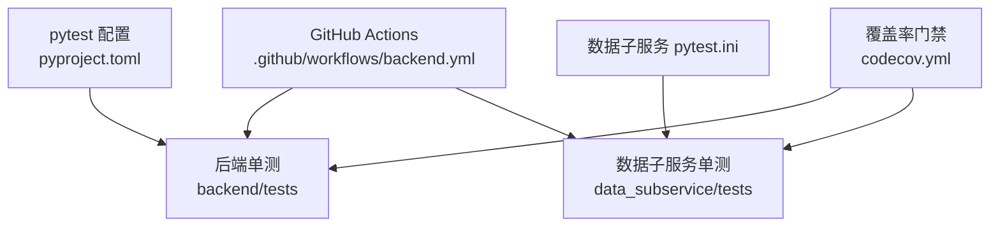
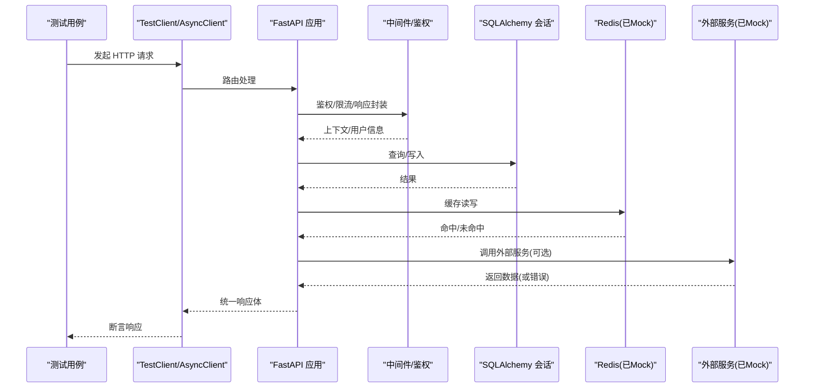
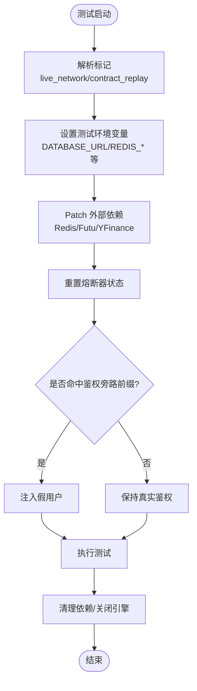
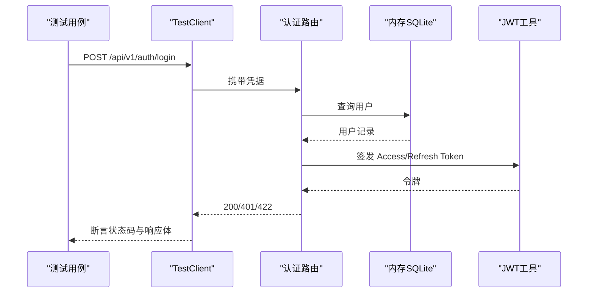
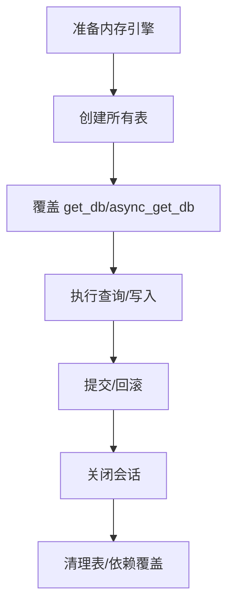
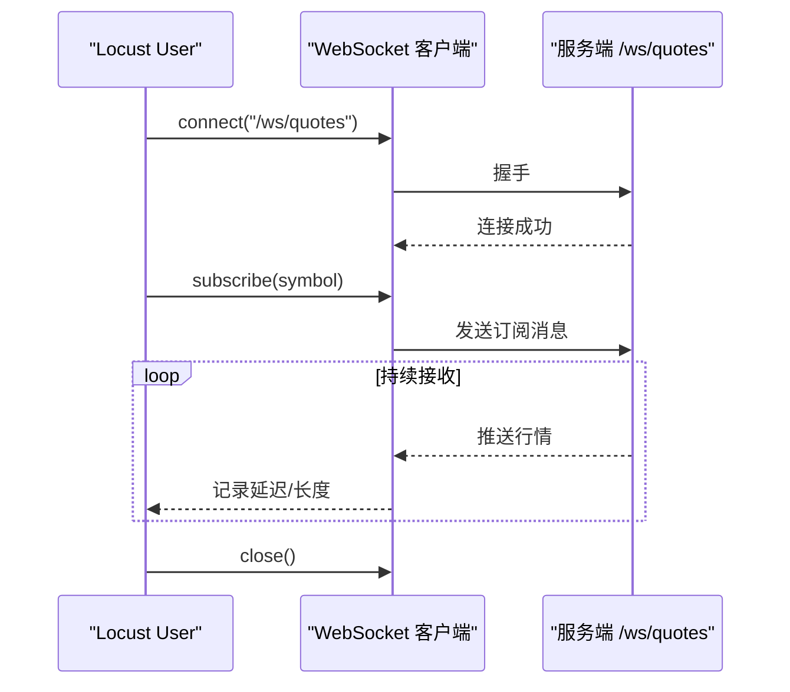
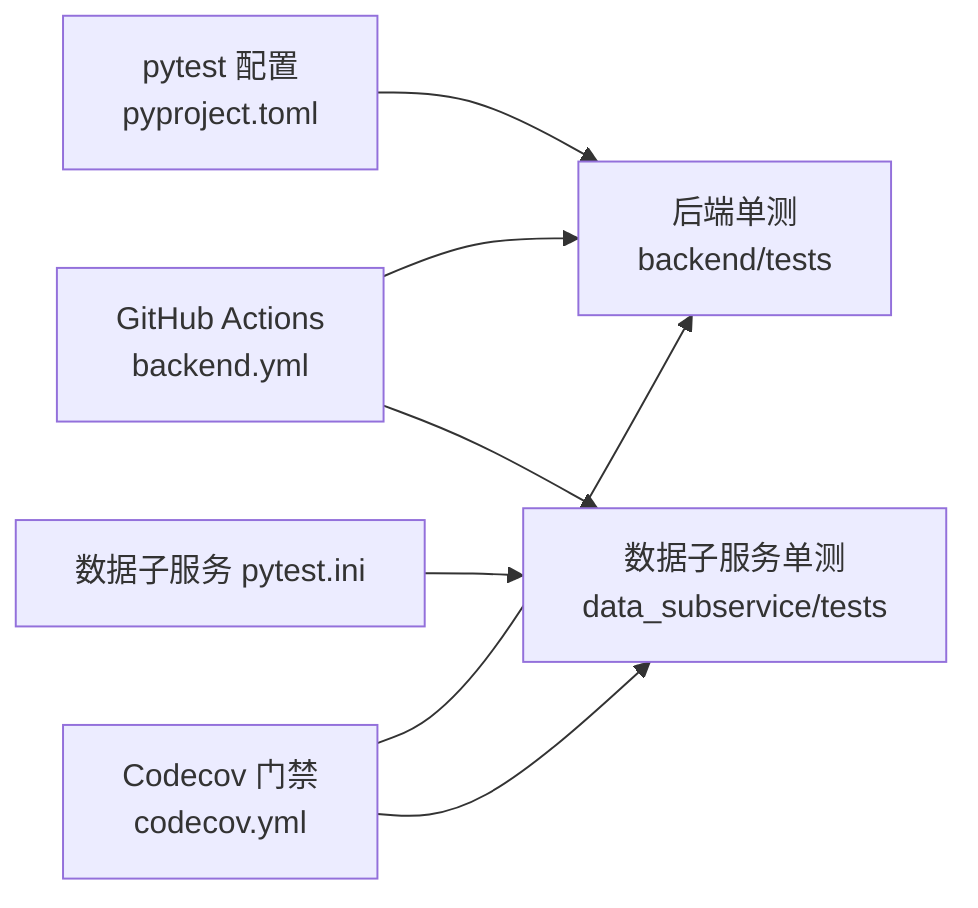

# 测试策略与实践

<cite>
**本文引用的文件**
- [backend/tests/conftest.py](file://backend/tests/conftest.py)
- [backend/tests/test_main.py](file://backend/tests/test_main.py)
- [backend/tests/test_database.py](file://backend/tests/test_database.py)
- [backend/tests/test_auth.py](file://backend/tests/test_auth.py)
- [pyproject.toml](file://pyproject.toml)
- [data_subservice/pytest.ini](file://data_subservice/pytest.ini)
- [.github/workflows/backend.yml](file://.github/workflows/backend.yml)
- [codecov.yml](file://codecov.yml)
- [scripts/locust_ws_stress.py](file://scripts/locust_ws_stress.py)
</cite>

## 目录
1. [简介](#简介)
2. [项目结构](#项目结构)
3. [核心组件](#核心组件)
4. [架构总览](#架构总览)
5. [详细组件分析](#详细组件分析)
6. [依赖关系分析](#依赖关系分析)
7. [性能考虑](#性能考虑)
8. [故障排查指南](#故障排查指南)
9. [结论](#结论)
10. [附录](#附录)

## 简介
本指南面向 Quant Agent 后端测试开发者，系统化阐述单元测试、集成测试与端到端测试的编写规范与最佳实践；覆盖测试环境搭建、Mock 数据生成、测试数据库配置；文档化异步测试、并发测试、性能测试的实现方法；提供 API 接口测试、数据库操作测试、服务间通信测试的具体示例；明确测试覆盖率要求、持续集成配置与自动化流程；并给出调试技巧、常见问题排查与性能瓶颈分析方法。目标是帮助团队建立稳定、可维护、高覆盖率的测试体系，保障代码质量与交付效率。

## 项目结构
后端测试以 pytest 为核心，采用集中式 fixtures（conftest）统一注入测试环境与外部依赖 Mock；主工程与数据子服务各自拥有独立的测试入口与运行配置，避免重型 SDK 污染主环境；CI 通过 GitHub Actions 串联构建、单测、镜像推送与部署。

**图示来源**
- [pyproject.toml:125-165](file://pyproject.toml#L125-L165)
- [data_subservice/pytest.ini:17-36](file://data_subservice/pytest.ini#L17-L36)
- [.github/workflows/backend.yml:119-192](file://.github/workflows/backend.yml#L119-L192)
- [codecov.yml:18-45](file://codecov.yml#L18-L45)

**章节来源**
- [pyproject.toml:125-165](file://pyproject.toml#L125-L165)
- [data_subservice/pytest.ini:17-36](file://data_subservice/pytest.ini#L17-L36)
- [.github/workflows/backend.yml:119-192](file://.github/workflows/backend.yml#L119-L192)
- [codecov.yml:18-45](file://codecov.yml#L18-L45)

## 核心组件
- 测试夹具与全局隔离：conftest 提供统一的数据库、Redis、HTTP 客户端、认证、行情数据等 fixture，并通过 autouse 机制确保测试隔离与环境一致性。
- 外部依赖 Mock：自动 patch Redis、Futu/YFinance 等外部服务，避免真实网络请求；支持通过标记或环境变量切换为真实调用。
- 测试客户端：FastAPI TestClient 与 httpx.AsyncClient 分别用于同步与异步 API 测试。
- 数据库测试：内存 SQLite + SQLAlchemy 会话工厂，配合迁移与模型注册，保证测试独立性与可重复性。
- 覆盖率与门禁：coverage 配置与 Codecov 门槛，结合 CI 流水线形成质量门禁。

**章节来源**
- [backend/tests/conftest.py:24-33](file://backend/tests/conftest.py#L24-L33)
- [backend/tests/conftest.py:100-268](file://backend/tests/conftest.py#L100-L268)
- [backend/tests/conftest.py:298-375](file://backend/tests/conftest.py#L298-L375)
- [backend/tests/test_database.py:69-127](file://backend/tests/test_database.py#L69-L127)
- [pyproject.toml:167-199](file://pyproject.toml#L167-L199)
- [codecov.yml:18-45](file://codecov.yml#L18-L45)

## 架构总览
下图展示从测试执行到被测系统的关键交互路径，包括 FastAPI 应用、中间件、路由、数据库与缓存等。

**图示来源**
- [backend/tests/test_main.py:81-115](file://backend/tests/test_main.py#L81-L115)
- [backend/tests/test_auth.py:30-77](file://backend/tests/test_auth.py#L30-L77)
- [backend/tests/conftest.py:355-375](file://backend/tests/conftest.py#L355-L375)
- [backend/tests/conftest.py:177-268](file://backend/tests/conftest.py#L177-L268)

## 详细组件分析

### 测试夹具与隔离（conftest）
- 自定义标记：live_network、contract_replay 用于控制集成测试与契约回放。
- 引擎释放：包装 create_engine/create_async_engine，统一登记并在会话结束时 dispose，消除资源警告。
- 熔断器隔离：每个测试前后重置 circuit_breaker，避免状态污染。
- 外部服务 Mock：自动 patch Redis、Futu/YFinance，支持 DISABLE_EXTERNAL_MOCK/no_mock_external 开关。
- 鉴权旁路：对特定前缀路由在测试中注入假用户，避免大量 401 失败。

**图示来源**
- [backend/tests/conftest.py:24-33](file://backend/tests/conftest.py#L24-L33)
- [backend/tests/conftest.py:36-98](file://backend/tests/conftest.py#L36-L98)
- [backend/tests/conftest.py:100-268](file://backend/tests/conftest.py#L100-L268)
- [backend/tests/conftest.py:585-678](file://backend/tests/conftest.py#L585-L678)

**章节来源**
- [backend/tests/conftest.py:24-33](file://backend/tests/conftest.py#L24-L33)
- [backend/tests/conftest.py:36-98](file://backend/tests/conftest.py#L36-L98)
- [backend/tests/conftest.py:100-268](file://backend/tests/conftest.py#L100-L268)
- [backend/tests/conftest.py:585-678](file://backend/tests/conftest.py#L585-L678)

### API 接口测试（主入口与认证）
- 主入口：验证全局异常处理器、响应封装中间件、安全中间件与系统端点鉴权行为。
- 认证路由：使用内存数据库与静态连接池，覆盖登录、刷新、当前用户、登出等场景；JWT 创建与解码、密码哈希校验。

**图示来源**
- [backend/tests/test_main.py:22-79](file://backend/tests/test_main.py#L22-L79)
- [backend/tests/test_auth.py:30-77](file://backend/tests/test_auth.py#L30-L77)
- [backend/tests/test_auth.py:121-168](file://backend/tests/test_auth.py#L121-L168)

**章节来源**
- [backend/tests/test_main.py:22-79](file://backend/tests/test_main.py#L22-L79)
- [backend/tests/test_auth.py:30-77](file://backend/tests/test_auth.py#L30-L77)
- [backend/tests/test_auth.py:121-168](file://backend/tests/test_auth.py#L121-L168)

### 数据库操作测试
- URL 转换与引擎参数：验证 SQLite/PostgreSQL 的异步 URL 转换与连接参数。
- 会话工厂：sessionmaker 与 async_sessionmaker 的配置验证。
- get_db/get_async_db：通过 mock 替换 SessionLocal/AsyncSessionLocal，验证会话生命周期。
- Base 元数据：确保声明式基类具备 metadata。

**图示来源**
- [backend/tests/test_database.py:15-66](file://backend/tests/test_database.py#L15-L66)
- [backend/tests/test_database.py:69-127](file://backend/tests/test_database.py#L69-L127)
- [backend/tests/test_database.py:130-172](file://backend/tests/test_database.py#L130-L172)

**章节来源**
- [backend/tests/test_database.py:15-66](file://backend/tests/test_database.py#L15-L66)
- [backend/tests/test_database.py:69-127](file://backend/tests/test_database.py#L69-L127)
- [backend/tests/test_database.py:130-172](file://backend/tests/test_database.py#L130-L172)

### 服务间通信测试（WebSocket 压力）
- 使用 Locust 模拟 WebSocket 客户端，连接 /ws/quotes，订阅标的并接收行情消息，记录延迟与吞吐。
- 支持单机与分布式模式，适合 CI 无头模式压测。

**图示来源**
- [scripts/locust_ws_stress.py:34-117](file://scripts/locust_ws_stress.py#L34-L117)
- [scripts/locust_ws_stress.py:119-200](file://scripts/locust_ws_stress.py#L119-L200)

**章节来源**
- [scripts/locust_ws_stress.py:34-117](file://scripts/locust_ws_stress.py#L34-L117)
- [scripts/locust_ws_stress.py:119-200](file://scripts/locust_ws_stress.py#L119-L200)

### 异步与并发测试
- 异步模式：pytest-asyncio 的 auto 模式自动管理事件循环；conftest 提供 event_loop fixture 兼容旧测试。
- 并发测试：pytest-xdist 并行执行，coverage 开启 parallel 合并各 worker 覆盖率；注意 xdist 下不要设置 concurrency=multiprocessing。
- 资源隔离：autouse fixture 重置熔断器、patch 外部依赖，避免跨测试污染。

**章节来源**
- [pyproject.toml:125-165](file://pyproject.toml#L125-L165)
- [pyproject.toml:191-199](file://pyproject.toml#L191-L199)
- [backend/tests/conftest.py:140-149](file://backend/tests/conftest.py#L140-L149)
- [backend/tests/conftest.py:75-79](file://backend/tests/conftest.py#L75-L79)

### 测试环境搭建与 Mock 数据
- 环境变量：强制 SQLite、Redis 地址与密码、JWT Secret、嵌入模型 Key/BaseURL/Model、加密密钥、聊天延迟等。
- Mock 数据：内置 sample_quote/sample_klines/sample_order/sample_position 及 TestDataFactory 快速构造。
- 外部服务：默认禁用真实网络，可通过 no_mock_external 或环境变量切换。

**章节来源**
- [backend/tests/conftest.py:155-174](file://backend/tests/conftest.py#L155-L174)
- [backend/tests/conftest.py:407-496](file://backend/tests/conftest.py#L407-L496)
- [backend/tests/conftest.py:271-295](file://backend/tests/conftest.py#L271-L295)

### 测试数据库配置
- 内存 SQLite：StaticPool 保证多线程共享同一内存库；create_all/drop_all 管理表结构。
- 异步引擎：sqlite+aiosqlite 与 postgresql+asyncpg 的 URL 转换逻辑验证。
- 连接池参数：DB_POOL_SIZE/DB_MAX_OVERFLOW/DB_POOL_TIMEOUT 的环境变量读取与默认值。

**章节来源**
- [backend/tests/test_database.py:15-66](file://backend/tests/test_database.py#L15-L66)
- [backend/tests/test_database.py:69-127](file://backend/tests/test_database.py#L69-L127)
- [backend/tests/test_database.py:141-172](file://backend/tests/test_database.py#L141-L172)

### API 接口测试示例
- 主入口：验证全局异常处理器将业务异常转换为统一格式；Pydantic 校验失败返回 422；兜底异常返回 500。
- 响应封装：旧式响应被自动包装为新格式；已有 code 字段直接放行。
- 安全中间件：CORS 预检返回允许的头；内部健康检查需认证。

**章节来源**
- [backend/tests/test_main.py:22-79](file://backend/tests/test_main.py#L22-L79)
- [backend/tests/test_main.py:81-115](file://backend/tests/test_main.py#L81-L115)
- [backend/tests/test_main.py:117-138](file://backend/tests/test_main.py#L117-L138)

### 服务间通信测试示例
- WebSocket 压测：连接、订阅、接收消息、重连；记录响应时间与负载大小；支持分布式 master/worker。
- 指标上报：通过 locust events.request.fire 上报 WS 连接与消息接收指标。

**章节来源**
- [scripts/locust_ws_stress.py:34-117](file://scripts/locust_ws_stress.py#L34-L117)
- [scripts/locust_ws_stress.py:119-200](file://scripts/locust_ws_stress.py#L119-L200)

## 依赖关系分析
- 测试框架与插件：pytest、pytest-asyncio、pytest-cov、pytest-xdist、pytest-env。
- 外部依赖隔离：主服务不安装重型数据源 SDK；数据子服务独立 pytest.ini 与 requirements。
- CI 流水线：test-backend 与 test-data-subservice 作为构建门禁；覆盖率门禁由 Codecov 执行。

**图示来源**
- [pyproject.toml:125-165](file://pyproject.toml#L125-L165)
- [data_subservice/pytest.ini:17-36](file://data_subservice/pytest.ini#L17-L36)
- [.github/workflows/backend.yml:119-192](file://.github/workflows/backend.yml#L119-L192)
- [codecov.yml:18-45](file://codecov.yml#L18-L45)

**章节来源**
- [pyproject.toml:125-165](file://pyproject.toml#L125-L165)
- [data_subservice/pytest.ini:17-36](file://data_subservice/pytest.ini#L17-L36)
- [.github/workflows/backend.yml:119-192](file://.github/workflows/backend.yml#L119-L192)
- [codecov.yml:18-45](file://codecov.yml#L18-L45)

## 性能考虑
- 异步优化：使用 asyncio_mode=auto 与 AsyncMock，减少阻塞；避免在 import 阶段创建真实连接。
- 并发执行：pytest-xdist 并行测试，coverage.parallel=true 合并覆盖率；避免 concurrency=multiprocessing 导致合并失败。
- 压测脚本：Locust WebSocket 压测关注 P95 延迟与吞吐；支持无头模式与 CSV 报告输出。
- 资源管理：统一 dispose 引擎，避免连接泄漏；autouse fixture 重置熔断器与外部依赖。

**章节来源**
- [pyproject.toml:191-199](file://pyproject.toml#L191-L199)
- [scripts/locust_ws_stress.py:34-117](file://scripts/locust_ws_stress.py#L34-L117)
- [backend/tests/conftest.py:36-98](file://backend/tests/conftest.py#L36-L98)

## 故障排查指南
- 资源警告：Python 3.13 下 MagicMock 内部可能产生未等待协程警告；已在 conftest 顶部过滤，不影响测试结果。
- 数据库连接泄漏：通过包装 create_engine/create_async_engine 并统一 dispose，消除 ResourceWarning。
- 外部服务超时：默认 Mock Redis/Futu/YFinance；如需真实调用，设置 DISABLE_EXTERNAL_MOCK=1 或使用 live_network 标记。
- 鉴权失败：测试中对特定前缀路由注入假用户；若仍 401，检查依赖覆盖是否正确生效。
- 覆盖率偏低：确认 coverage.parallel=true 且未设置 concurrency=multiprocessing；检查忽略路径与 source 配置。

**章节来源**
- [backend/tests/conftest.py:6-12](file://backend/tests/conftest.py#L6-L12)
- [backend/tests/conftest.py:36-98](file://backend/tests/conftest.py#L36-L98)
- [backend/tests/conftest.py:177-268](file://backend/tests/conftest.py#L177-L268)
- [backend/tests/conftest.py:585-678](file://backend/tests/conftest.py#L585-L678)
- [pyproject.toml:191-199](file://pyproject.toml#L191-L199)

## 结论
Quant Agent 后端的测试体系以 pytest 为核心，通过集中式 fixtures 与严格的外部依赖隔离，实现了高内聚、低耦合的可重复测试环境；结合 CI 流水线与覆盖率门禁，形成从开发到部署的质量保障闭环。建议团队遵循本指南的规范与最佳实践，持续补充关键路径的单元与集成测试，逐步提升覆盖率与稳定性。

## 附录
- 运行命令参考：
  - 后端单测：uv run pytest backend/tests -p no:cacheprovider --tb=short -q
  - 数据子服务单测：cd data_subservice && python -m pytest -c pytest.ini --tb=short -q
  - WebSocket 压测：locust -f scripts/locust_ws_stress.py --host ws://localhost:8000 --headless -u 1000 -r 10 -t 60s
- 覆盖率目标：后端爬坡至 70%，新增代码至少 60% 覆盖率；CI 失败时阻断合并。

**章节来源**
- [.github/workflows/backend.yml:144-149](file://.github/workflows/backend.yml#L144-L149)
- [.github/workflows/backend.yml:186-192](file://.github/workflows/backend.yml#L186-L192)
- [codecov.yml:18-45](file://codecov.yml#L18-L45)
