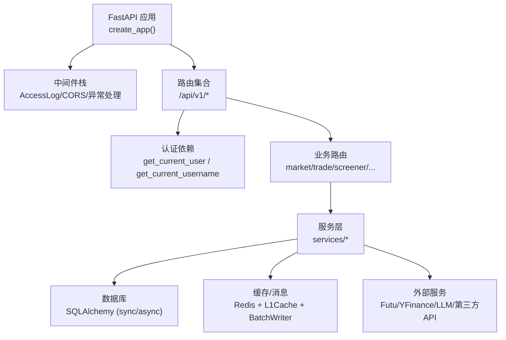
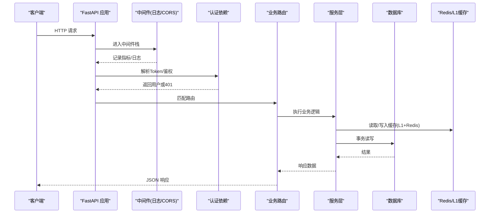
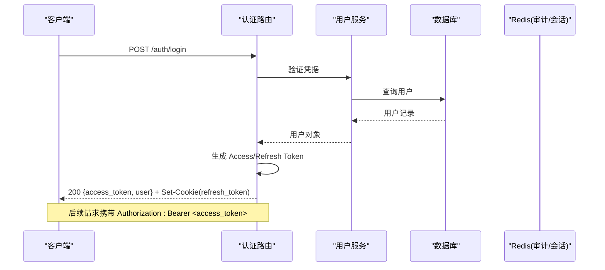
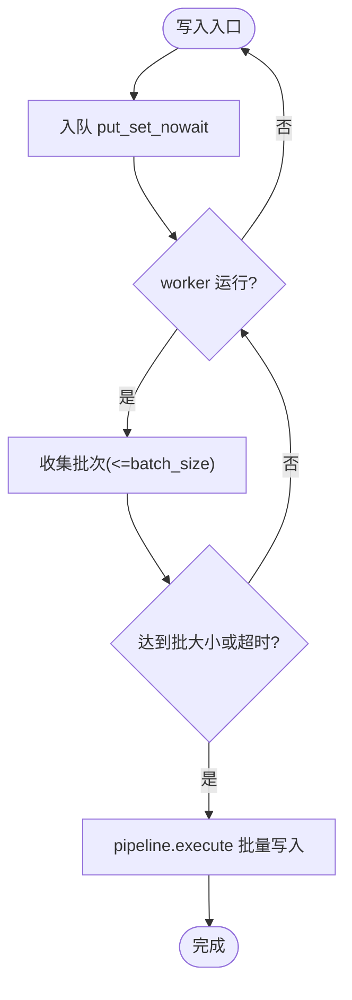
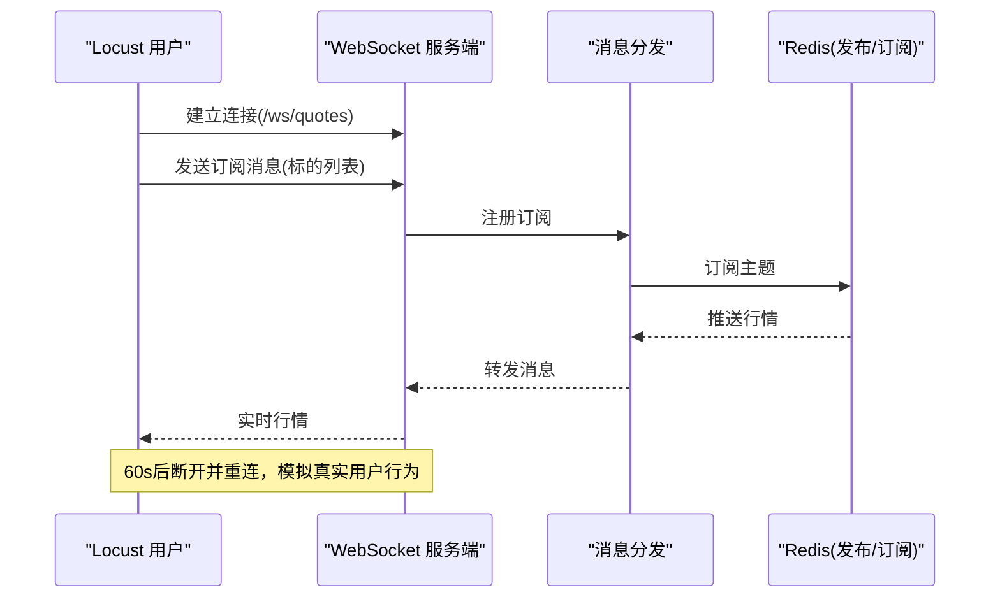
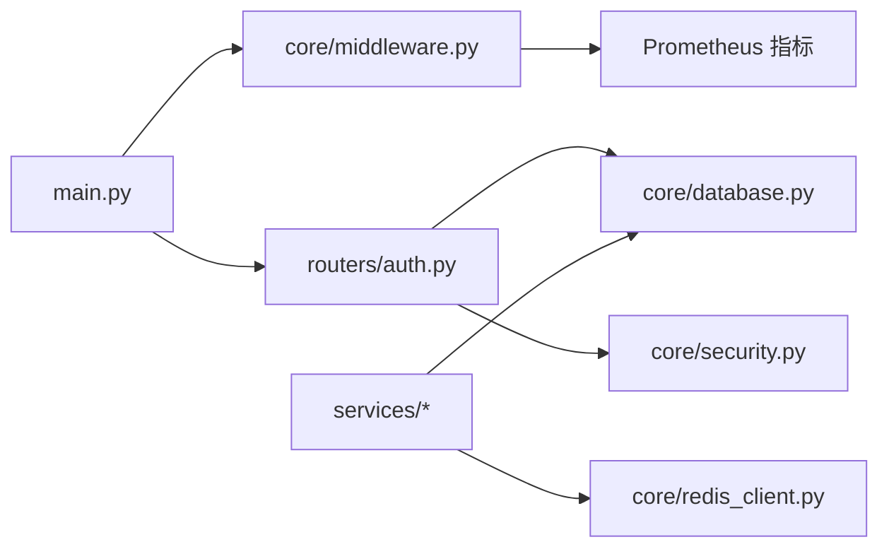
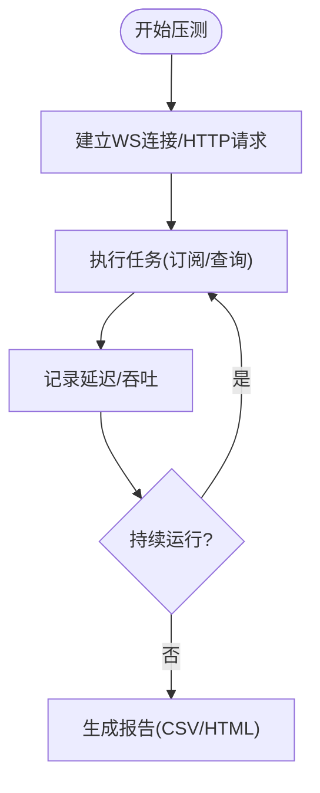

# 集成测试策略

<cite>
**本文引用的文件**
- [backend/main.py](file://backend/main.py)
- [backend/core/config.py](file://backend/core/config.py)
- [backend/core/database.py](file://backend/core/database.py)
- [backend/core/redis_client.py](file://backend/core/redis_client.py)
- [backend/core/middleware.py](file://backend/core/middleware.py)
- [backend/core/security.py](file://backend/core/security.py)
- [backend/routers/auth.py](file://backend/routers/auth.py)
- [backend/tests/conftest.py](file://backend/tests/conftest.py)
- [backend/tests/test_auth.py](file://backend/tests/test_auth.py)
- [backend/tests/test_redis_client.py](file://backend/tests/test_redis_client.py)
- [scripts/locust_ws_stress.py](file://scripts/locust_ws_stress.py)
- [scripts/benchmark_dsl_parser.py](file://scripts/benchmark_dsl_parser.py)
</cite>

## 目录
1. [简介](#简介)
2. [项目结构](#项目结构)
3. [核心组件](#核心组件)
4. [架构总览](#架构总览)
5. [详细组件分析](#详细组件分析)
6. [依赖关系分析](#依赖关系分析)
7. [性能与压力测试](#性能与压力测试)
8. [故障排查指南](#故障排查指南)
9. [结论](#结论)
10. [附录](#附录)

## 简介
本策略面向 Quant Agent 后端，聚焦服务层与路由层的集成测试：以真实数据库连接、外部服务模拟、消息队列（Redis）测试为核心，覆盖 FastAPI 完整请求链路（认证中间件、数据库事务、缓存操作），并给出异步服务（WebSocket、并发、错误恢复）的测试方法。同时提供 API 接口测试最佳实践、测试数据与环境准备、执行策略，以及性能基准与压力测试的实现方法与工具使用。

## 项目结构
后端采用 FastAPI 应用工厂模式，集中挂载路由、中间件、异常处理与可观测性；配置通过 Pydantic Settings 校验；数据库使用 SQLAlchemy（同步/异步双引擎）；缓存与消息总线基于 Redis（含 L1 本地缓存与异步批量写入器）。测试框架基于 pytest，conftest 提供全局 Mock、环境注入、数据库与 Redis 隔离、鉴权旁路等能力。

图表来源
- [backend/main.py:125-218](file://backend/main.py#L125-L218)
- [backend/core/middleware.py:90-133](file://backend/core/middleware.py#L90-L133)
- [backend/routers/auth.py:65-98](file://backend/routers/auth.py#L65-L98)
- [backend/core/database.py:1-67](file://backend/core/database.py#L1-L67)
- [backend/core/redis_client.py:1-252](file://backend/core/redis_client.py#L1-L252)

章节来源
- [backend/main.py:125-218](file://backend/main.py#L125-L218)
- [backend/core/config.py:20-134](file://backend/core/config.py#L20-L134)

## 核心组件
- 应用装配与路由挂载：应用工厂创建 FastAPI 实例，注册中间件、异常处理器、OpenAPI、OTel、Structlog，并按前缀挂载所有业务路由。
- 配置管理：Pydantic Settings 强制关键环境变量存在，支持开发/生产/测试环境切换，并对数据库 URL、嵌入模型 Key 等进行校验。
- 数据库：同步/异步双引擎，SQLite 用于测试，PostgreSQL/MySQL 用于生产；提供 get_db/get_async_db 依赖注入。
- 缓存与消息：Redis 连接池、异步批量写入器（Pipeline 聚合）、进程内 L1 缓存（带 TTL 清理与容量保护）。
- 安全与认证：JWT Access/Refresh Token、Cookie SameSite/Secure 策略、内部通信 HMAC-SHA256 签名验证。
- 监控与日志：访问日志中间件记录请求耗时、状态码、外部 API 调用指标；Prometheus 指标暴露。

章节来源
- [backend/main.py:125-218](file://backend/main.py#L125-L218)
- [backend/core/config.py:20-134](file://backend/core/config.py#L20-L134)
- [backend/core/database.py:1-67](file://backend/core/database.py#L1-L67)
- [backend/core/redis_client.py:1-252](file://backend/core/redis_client.py#L1-L252)
- [backend/core/security.py:20-160](file://backend/core/security.py#L20-L160)
- [backend/core/middleware.py:10-133](file://backend/core/middleware.py#L10-L133)

## 架构总览
下图展示一次受保护的 API 请求从进入应用到落库、读写的完整路径，包含认证、中间件、服务层、数据库与 Redis 交互。

图表来源
- [backend/main.py:140-218](file://backend/main.py#L140-L218)
- [backend/routers/auth.py:65-98](file://backend/routers/auth.py#L65-L98)
- [backend/core/database.py:32-67](file://backend/core/database.py#L32-L67)
- [backend/core/redis_client.py:176-252](file://backend/core/redis_client.py#L176-L252)
- [backend/core/middleware.py:90-133](file://backend/core/middleware.py#L90-L133)

## 详细组件分析

### 服务层集成测试策略
- 目标：验证服务层在真实数据库连接下的正确性与健壮性，同时隔离外部依赖。
- 数据源：
  - 单元测试：内存 SQLite（StaticPool）+ 覆盖 get_db 依赖，保证每个用例独立事务与表结构。
  - 集成测试：可选切换到真实 PostgreSQL（需开启 live_network 标记），确保迁移、索引、向量扩展可用。
- 外部服务模拟：
  - 自动 Mock：conftest 中通过 patch redis.asyncio.Redis、外部数据服务（如 Futu/YFinance），避免网络 IO。
  - 按需放开：设置 DISABLE_EXTERNAL_MOCK=1 或 no_mock_external 标记启用真实调用。
- 事务与一致性：
  - 使用 sessionmaker 包裹请求生命周期，确保 commit/rollback 行为符合预期。
  - 对写操作断言提交次数、回滚分支、异常路径。
- 缓存与消息：
  - conftest 提供全局 Redis Mock（AsyncMock），实现 get/set/delete/exists/incr/pipeline/pubsub 等行为，便于断言缓存命中与失效。
  - 针对 RedisAsyncBatchWriter，测试批量合并、超时刷新、优雅停止、高负载场景。

章节来源
- [backend/tests/conftest.py:155-268](file://backend/tests/conftest.py#L155-L268)
- [backend/tests/test_auth.py:33-77](file://backend/tests/test_auth.py#L33-L77)
- [backend/tests/test_redis_client.py:31-249](file://backend/tests/test_redis_client.py#L31-L249)

### 路由层集成测试策略
- 目标：端到端验证 FastAPI 路由在完整中间件链中的行为，包括认证、CORS、限流、审计、异常处理。
- 测试客户端：
  - 同步：fastapi.testclient.TestClient 用于常规路由测试。
  - 异步：httpx.AsyncClient(app=app) 用于异步路由与 SSE/WebSocket 相关场景。
- 鉴权旁路：
  - 为特定前缀（trade/oms/alert/audit/screener/strategy/chat/suggestions）注入假用户，避免大量路由因缺少 Token 失败，同时保留未认证应返回 401 的用例。
- 请求验证与响应断言：
  - 参数校验：利用 Pydantic 模型，断言 422 错误路径。
  - 响应结构：断言关键字段、状态码范围（如健康检查允许 200/503）。
  - 头信息：检查限流、追踪、跨域等响应头。
- 中间件验证：
  - 访问日志与 Prometheus 指标：确认计数与直方图更新。
  - CORS：OPTIONS 预检是否被 CORSMiddleware 正确处理。

章节来源
- [backend/tests/conftest.py:355-375](file://backend/tests/conftest.py#L355-L375)
- [backend/tests/conftest.py:585-679](file://backend/tests/conftest.py#L585-L679)
- [backend/core/middleware.py:90-133](file://backend/core/middleware.py#L90-L133)
- [backend/tests/test_auth.py:79-118](file://backend/tests/test_auth.py#L79-L118)

### 认证中间件与 JWT 流程测试
- 登录与令牌签发：
  - 密码登录：校验用户名/密码，签发 Access/Refresh Token，设置 Cookie（SameSite/Secure 根据环境）。
  - Google OAuth：验证前端 ID Token，自动注册用户，签发系统 Token 并设置 Cookie。
- 鉴权依赖：
  - get_current_user：解析 Bearer Token，查询用户，缺失或过期返回 401。
  - get_current_user_optional：可选鉴权，无 Token 返回 None。
- 刷新与登出：
  - refresh：基于 Refresh Token 签发新 Access Token，滑动续期 Refresh Token。
  - logout：清理 Cookie，记录审计日志。
- 测试要点：
  - 正常登录、错误凭据、无 Cookie 刷新、未认证访问受限资源、Token 解码/编码、密码哈希验证。

图表来源
- [backend/routers/auth.py:117-162](file://backend/routers/auth.py#L117-L162)
- [backend/routers/auth.py:204-289](file://backend/routers/auth.py#L204-L289)
- [backend/routers/auth.py:305-346](file://backend/routers/auth.py#L305-L346)
- [backend/routers/auth.py:349-386](file://backend/routers/auth.py#L349-L386)

章节来源
- [backend/routers/auth.py:65-98](file://backend/routers/auth.py#L65-L98)
- [backend/routers/auth.py:117-162](file://backend/routers/auth.py#L117-L162)
- [backend/routers/auth.py:204-289](file://backend/routers/auth.py#L204-L289)
- [backend/routers/auth.py:305-346](file://backend/routers/auth.py#L305-L346)
- [backend/routers/auth.py:349-386](file://backend/routers/auth.py#L349-L386)
- [backend/tests/test_auth.py:85-118](file://backend/tests/test_auth.py#L85-L118)
- [backend/tests/test_auth.py:121-179](file://backend/tests/test_auth.py#L121-L179)

### Redis 操作与消息队列测试
- 连接与池化：
  - 连接池上限 REDIS_MAX_CONNECTIONS 可配置，测试需验证模块级 redis_pool 的 max_connections。
- 异步批量写入：
  - RedisAsyncBatchWriter：测试启动/停止、队列满触发刷新、超时刷新、优雅关闭、高负载下清空积压。
- L1 缓存：
  - LocalL1Cache：命中/未命中/过期/容量保护/后台清理任务。
- 全局 Mock：
  - conftest 自动 patch redis.asyncio.Redis，并提供 pipeline、pubsub、l1_cached_redis、redis_batch_writer 的 AsyncMock 行为，确保测试不依赖真实 Redis。

图表来源
- [backend/core/redis_client.py:46-177](file://backend/core/redis_client.py#L46-L177)
- [backend/tests/test_redis_client.py:31-249](file://backend/tests/test_redis_client.py#L31-L249)

章节来源
- [backend/core/redis_client.py:1-252](file://backend/core/redis_client.py#L1-L252)
- [backend/tests/test_redis_client.py:31-249](file://backend/tests/test_redis_client.py#L31-L249)
- [backend/tests/test_redis_client.py:497-575](file://backend/tests/test_redis_client.py#L497-L575)

### 异步服务集成测试（WebSocket、并发、错误恢复）
- WebSocket 压力测试：
  - Locust 脚本模拟行情订阅，建立连接、订阅标的、接收消息、定时重连，统计延迟与吞吐。
  - 目标：/ws/quotes 在高并发下保持低延迟与稳定连接。
- 并发与事件循环：
  - 测试中为旧式代码提供 event_loop fixture，确保 asyncio.get_event_loop() 兼容。
  - 对异步任务取消、超时、重试进行断言。
- 错误恢复：
  - 外部 API 慢调用与熔断：结合 circuit_breaker 单例重置，避免测试间污染。
  - Redis 优雅关闭：确保队列清空后再断开连接。

图表来源
- [scripts/locust_ws_stress.py:34-199](file://scripts/locust_ws_stress.py#L34-L199)

章节来源
- [scripts/locust_ws_stress.py:34-199](file://scripts/locust_ws_stress.py#L34-L199)
- [backend/tests/conftest.py:140-149](file://backend/tests/conftest.py#L140-L149)
- [backend/tests/test_redis_client.py:497-575](file://backend/tests/test_redis_client.py#L497-L575)

### API 接口测试最佳实践
- 请求验证：
  - 使用 Pydantic 模型校验输入，断言 422 错误结构与字段。
  - 对必填字段、枚举值、数值范围进行边界测试。
- 响应断言：
  - 断言状态码范围（如健康检查允许 200/503）。
  - 断言响应体关键字段、分页结构、时间戳格式。
- 状态码检查：
  - 成功 2xx、参数错误 422、未认证 401、权限不足 403、服务器错误 5xx。
- 中间件与可观测性：
  - 检查 CORS 头、限流头、追踪头。
  - 验证 Prometheus 指标计数器与直方图更新。

章节来源
- [backend/tests/test_auth.py:79-118](file://backend/tests/test_auth.py#L79-L118)
- [backend/core/middleware.py:10-133](file://backend/core/middleware.py#L10-L133)

### 测试数据准备与环境搭建
- 环境变量：
  - 强制 SQLite 测试数据库、Redis 地址与密码、内部密钥、嵌入模型 Key、JWT Secret、加密主键、BCRYPT 成本因子降低加速测试。
- 数据库：
  - 内存 SQLite（StaticPool）保证多线程共享同一内存库；测试前后创建/销毁表结构。
  - 集成测试可切换至 PostgreSQL，确保 pgvector/pg_trgm 扩展与索引就绪。
- 外部服务：
  - 默认 Mock 外部数据源（Futu/YFinance），可通过环境变量或标记禁用 Mock 进行真实网络测试。
- 测试夹具：
  - test_client/async_test_client、mock_db/mock_async_db、mock_redis、mock_httpx、样本数据工厂。

章节来源
- [backend/tests/conftest.py:155-268](file://backend/tests/conftest.py#L155-L268)
- [backend/tests/test_auth.py:33-77](file://backend/tests/test_auth.py#L33-L77)
- [backend/core/config.py:20-134](file://backend/core/config.py#L20-L134)

### 测试执行策略
- 单测与集成分离：
  - 单测：快速、隔离、Mock 外部依赖，关注单元逻辑。
  - 集成：真实数据库、可选真实外部服务，关注端到端流程。
- 并行与隔离：
  - 使用 pytest-xdist 并行执行；conftest 确保 Redis/DB/熔断单例隔离。
- 覆盖率与门禁：
  - 核心路径（行情管道、认证、OMS）覆盖率目标 ≥ 70%。
- 标记与过滤：
  - live_network：需要真实网络的集成测试，默认跳过。
  - contract_replay：三方数据源契约录制/回放测试。

章节来源
- [backend/tests/conftest.py:24-33](file://backend/tests/conftest.py#L24-L33)
- [backend/tests/test_auth.py:3](file://backend/tests/test_auth.py#L3-L3)

## 依赖关系分析
- 应用与路由：main.py 集中挂载路由，依赖 core 中间件与安全模块。
- 认证与数据库：auth.py 依赖 get_db 与 models，使用 JWT 与 Cookie 策略。
- 缓存与消息：services 层通过 redis_client 获取 L1/L2 缓存与批量写入能力。
- 监控与日志：middleware 记录请求指标与外部 API 调用，供 Prometheus 采集。

图表来源
- [backend/main.py:125-218](file://backend/main.py#L125-L218)
- [backend/routers/auth.py:65-98](file://backend/routers/auth.py#L65-L98)
- [backend/core/database.py:1-67](file://backend/core/database.py#L1-L67)
- [backend/core/redis_client.py:1-252](file://backend/core/redis_client.py#L1-L252)
- [backend/core/middleware.py:10-133](file://backend/core/middleware.py#L10-L133)

章节来源
- [backend/main.py:125-218](file://backend/main.py#L125-L218)
- [backend/routers/auth.py:65-98](file://backend/routers/auth.py#L65-L98)
- [backend/core/database.py:1-67](file://backend/core/database.py#L1-L67)
- [backend/core/redis_client.py:1-252](file://backend/core/redis_client.py#L1-L252)
- [backend/core/middleware.py:10-133](file://backend/core/middleware.py#L10-L133)

## 性能与压力测试
- 基准测试：
  - DSL 解析引擎：benchmark_dsl_parser.py 对复杂 DSL 进行高频解析，统计 OPS 与单次耗时，评估 Pydantic 模型静态化效果。
- 压力测试：
  - Locust WebSocket 压力：模拟 1000 并发行情订阅，验证连接建立、消息接收延迟与重连稳定性。
  - REST API 压测：健康检查、行情查询、K线、筛选器等核心端点，统计吞吐与 P95/P99 延迟。
- 指标与监控：
  - 中间件记录 fastapi_requests_total、fastapi_request_duration_seconds、external_api_* 指标，便于定位瓶颈。

图表来源
- [scripts/locust_ws_stress.py:119-262](file://scripts/locust_ws_stress.py#L119-L262)
- [scripts/benchmark_dsl_parser.py:12-61](file://scripts/benchmark_dsl_parser.py#L12-L61)
- [backend/core/middleware.py:10-133](file://backend/core/middleware.py#L10-L133)

章节来源
- [scripts/locust_ws_stress.py:119-262](file://scripts/locust_ws_stress.py#L119-L262)
- [scripts/benchmark_dsl_parser.py:12-61](file://scripts/benchmark_dsl_parser.py#L12-L61)
- [backend/core/middleware.py:10-133](file://backend/core/middleware.py#L10-L133)

## 故障排查指南
- 数据库连接问题：
  - 确认 DATABASE_URL 有效且驱动可用；SQLite 测试使用 StaticPool 避免线程问题。
  - PostgreSQL 集成需启用 pgvector/pg_trgm 扩展与索引。
- Redis 连接与 Mock：
  - 若测试偶发失败，检查 conftest 的 _REDIS_PATCH_MODULES 是否覆盖到对应模块的全局引用。
  - 验证 redis_pool.max_connections 配置生效。
- 认证失败：
  - 检查 SECRET_KEY/JWT_SECRET_KEY 配置；确认 Cookie SameSite/Secure 策略与跨域设置。
  - 鉴权旁路仅对指定前缀生效，其他路由应保持真实鉴权。
- 外部服务超时：
  - 默认 Mock 外部服务；如需真实调用，设置 DISABLE_EXTERNAL_MOCK=1 或使用 live_network 标记。
  - 关注慢外部 API 告警与熔断机制。

章节来源
- [backend/tests/conftest.py:155-268](file://backend/tests/conftest.py#L155-L268)
- [backend/tests/test_redis_client.py:551-575](file://backend/tests/test_redis_client.py#L551-L575)
- [backend/routers/auth.py:28-41](file://backend/routers/auth.py#L28-L41)
- [backend/core/middleware.py:44-88](file://backend/core/middleware.py#L44-L88)

## 结论
本策略围绕 FastAPI 应用的完整请求链路，构建了覆盖服务层与路由层的集成测试体系：以真实数据库连接为基础，借助强大的 conftest 夹具与 Mock 机制隔离外部依赖，全面验证认证、缓存、消息队列与中间件行为。同时提供 WebSocket 并发与错误恢复的测试方案，以及性能基准与压力测试工具链，确保系统在开发与生产环境中的稳定性与可观测性。

## 附录
- 常用命令：
  - 运行单测：pytest backend/tests -v
  - 运行集成测试（真实网络）：pytest backend/tests -m live_network -v
  - 启动 Locust 压测：locust -f scripts/locust_ws_stress.py --host ws://localhost:8000 --headless -u 1000 -r 10 -t 60s
- 关键环境变量：
  - DATABASE_URL、REDIS_HOST/PORT/PASSWORD、INTERNAL_API_SECRET、EMBEDDING_API_KEY/BASE_URL/MODEL、JWT_SECRET_KEY、ENCRYPTION_MASTER_KEY、BCRYPT_ROUNDS、QUANT_ENV。
