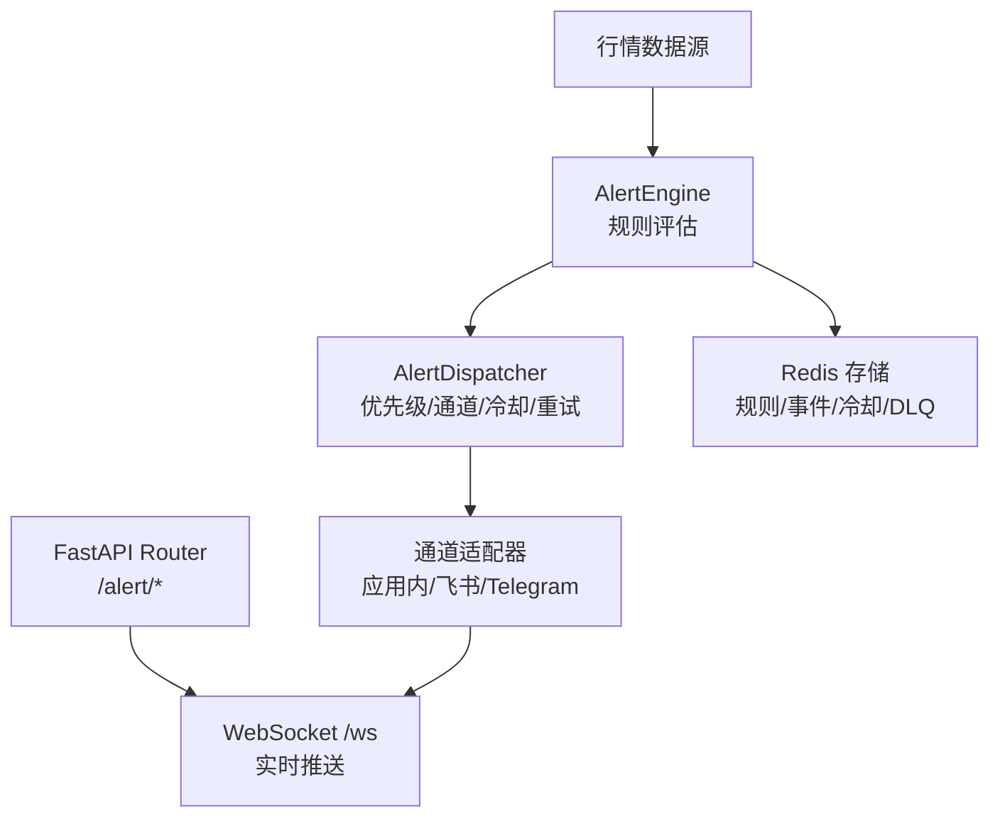
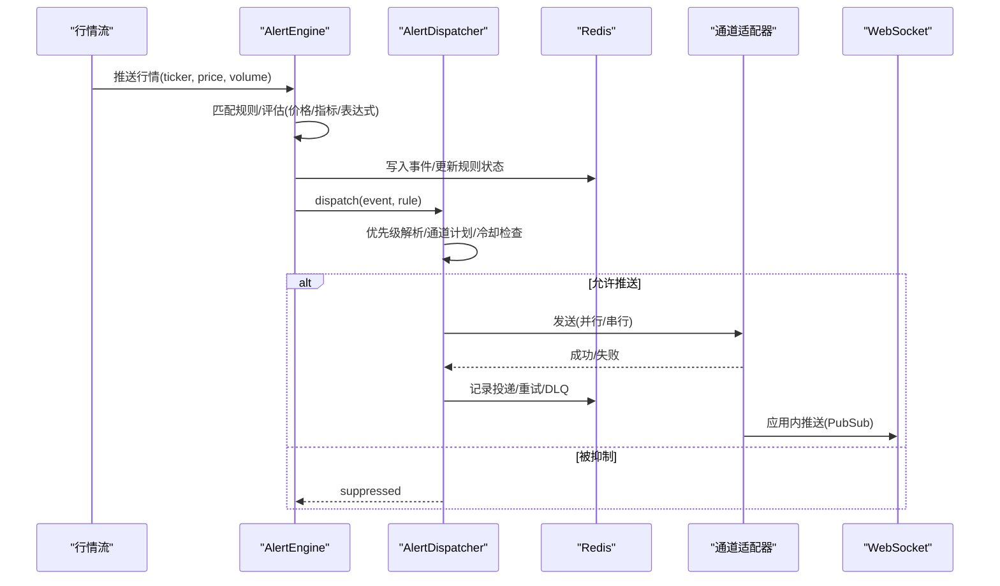
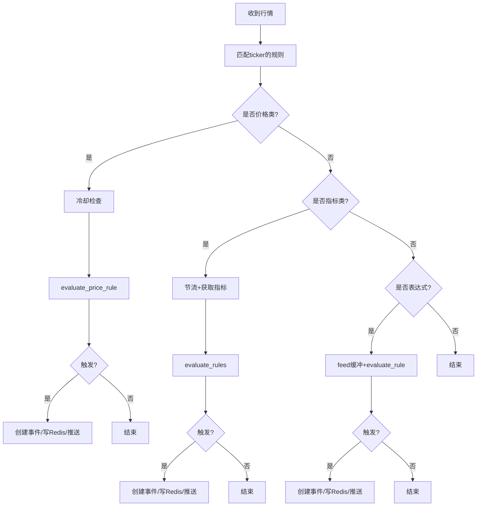
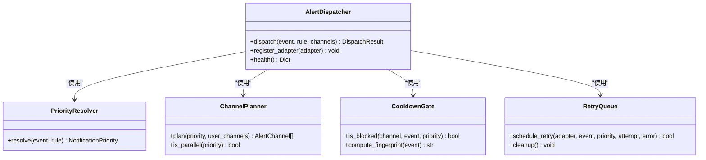
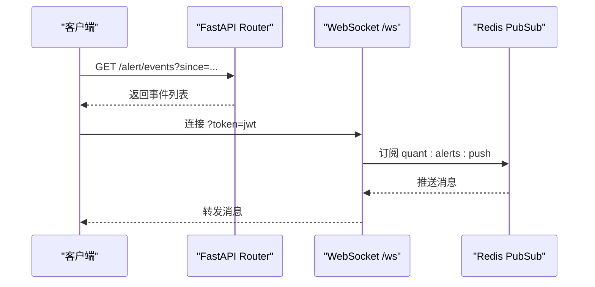
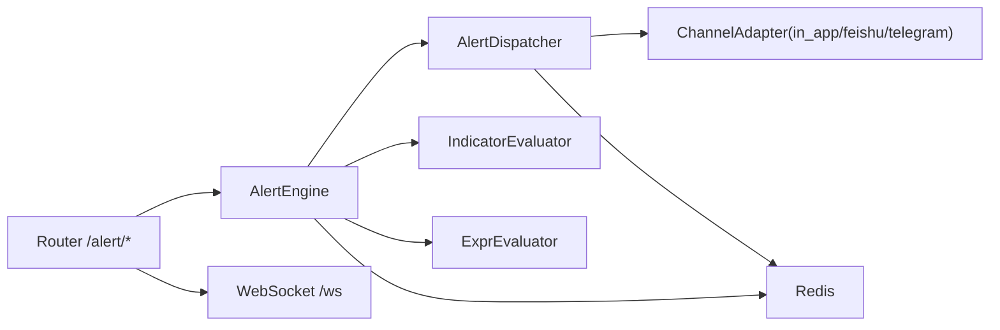

# 告警管理策略

<cite>
**本文引用的文件**
- [backend/core/alert_models.py](file://backend/core/alert_models.py)
- [backend/routers/alert.py](file://backend/routers/alert.py)
- [backend/workers/alert_engine.py](file://backend/workers/alert_engine.py)
- [backend/services/alert/dispatcher.py](file://backend/services/alert/dispatcher.py)
- [backend/services/alert/notification.py](file://backend/services/alert/notification.py)
- [backend/services/alert/expr_evaluator.py](file://backend/services/alert/expr_evaluator.py)
- [backend/core/config.py](file://backend/core/config.py)
</cite>

## 目录
1. [简介](#简介)
2. [项目结构](#项目结构)
3. [核心组件](#核心组件)
4. [架构总览](#架构总览)
5. [详细组件分析](#详细组件分析)
6. [依赖关系分析](#依赖关系分析)
7. [性能考虑](#性能考虑)
8. [故障排查指南](#故障排查指南)
9. [结论](#结论)
10. [附录](#附录)

## 简介
本文件面向运维与研发，系统化说明 Quant Agent 的告警管理策略，覆盖以下主题：
- 告警升级策略：基于时间的自动升级、基于严重程度的手动升级机制
- 告警抑制规则：避免告警风暴与重复通知的设计原理与实践
- 静默规则：维护期或已知问题期间的临时禁用方法
- 告警分组最佳实践：按业务模块、服务层级、影响范围组织告警
- 告警状态管理：未确认、已确认、已解决等状态流转逻辑
- 效果验证与调试：快速定位与分析告警问题的方法
- 性能优化建议：评估间隔、复杂查询规避、记录规则预计算等

## 项目结构
后端告警子系统由“规则模型 + 引擎评估 + 统一调度推送 + 路由与实时推送”构成，关键路径如下：
- 规则与事件模型：定义规则类型、严重程度、通道、冷却期等
- 引擎 Worker：订阅行情流，评估价格/指标/表达式规则，生成事件并持久化
- 统一调度器：优先级解析、通道计划、冷却门控、重试与死信队列
- 路由层：HTTP API 与 WebSocket 实时推送
- 配置：外部通道凭据与环境开关

图表来源
- [backend/workers/alert_engine.py:137-247](file://backend/workers/alert_engine.py#L137-L247)
- [backend/services/alert/dispatcher.py:396-461](file://backend/services/alert/dispatcher.py#L396-L461)
- [backend/routers/alert.py:148-211](file://backend/routers/alert.py#L148-L211)

章节来源
- [backend/core/alert_models.py:28-141](file://backend/core/alert_models.py#L28-L141)
- [backend/workers/alert_engine.py:46-84](file://backend/workers/alert_engine.py#L46-L84)
- [backend/services/alert/dispatcher.py:66-157](file://backend/services/alert/dispatcher.py#L66-L157)
- [backend/routers/alert.py:51-132](file://backend/routers/alert.py#L51-L132)

## 核心组件
- 规则与事件模型：支持价格类、技术指标类、自由布尔表达式三类规则；定义严重程度、通道、冷却期、元数据等
- 告警引擎：从 Redis 加载活跃规则，订阅行情流，评估并触发事件，写入最近事件列表，调用统一调度器推送
- 统一调度器：优先级解析（P0-P3）、通道计划、通道级冷却、重试与死信队列、投递记录
- 路由与推送：HTTP 接口管理规则与事件，WebSocket 实时推送告警
- 表达式求值：与前端对齐的自由表达式引擎，提供滚动缓冲与规则评估

章节来源
- [backend/core/alert_models.py:28-141](file://backend/core/alert_models.py#L28-L141)
- [backend/workers/alert_engine.py:137-247](file://backend/workers/alert_engine.py#L137-L247)
- [backend/services/alert/dispatcher.py:66-157](file://backend/services/alert/dispatcher.py#L66-L157)
- [backend/services/alert/expr_evaluator.py:659-733](file://backend/services/alert/expr_evaluator.py#L659-L733)
- [backend/routers/alert.py:57-132](file://backend/routers/alert.py#L57-L132)

## 架构总览
告警系统采用“评估-调度-推送”分层设计：
- 评估层：AlertEngine 负责规则匹配与事件生成
- 调度层：AlertDispatcher 负责优先级、通道选择、冷却抑制、重试与可观测性
- 推送层：多通道适配器（应用内、飞书、Telegram）通过统一入口发送
- 存储层：Redis 承载规则、事件、冷却键、DLQ 等
- 接入层：FastAPI 暴露 REST 与 WebSocket 接口

图表来源
- [backend/workers/alert_engine.py:137-247](file://backend/workers/alert_engine.py#L137-L247)
- [backend/services/alert/dispatcher.py:396-461](file://backend/services/alert/dispatcher.py#L396-L461)
- [backend/routers/alert.py:148-211](file://backend/routers/alert.py#L148-L211)

## 详细组件分析

### 告警规则与事件模型
- 规则类型：价格穿越/高于/低于、涨跌幅、成交量突增、RSI阈值、MACD金叉/死叉、均线穿越、纸面组合漂移、自由布尔表达式
- 严重程度：info、warning、critical
- 通知优先级：p0-p3（用于通道路由与冷却策略）
- 推送通道：in_app、feishu、telegram
- 冷却期：规则级 cooldown_seconds，防止频繁触发
- 事件字段：包含来源、优先级、UI提示等扩展信息

章节来源
- [backend/core/alert_models.py:28-141](file://backend/core/alert_models.py#L28-L141)

### 告警引擎（评估与触发）
- 规则加载：从 Redis Hash 加载活跃规则
- 行情评估：分离价格类、指标类、表达式类规则分别处理
- 冷却控制：基于 last_triggered_at 与 cooldown_seconds 去重
- 事件持久化：写入最近 1000 条事件列表
- 指标获取：可选 market_data_service 拉取技术指标
- 表达式求值：将行情喂入 ExprEvaluator 滚动缓冲，对 EXPR 规则求值

图表来源
- [backend/workers/alert_engine.py:137-247](file://backend/workers/alert_engine.py#L137-L247)
- [backend/services/alert/expr_evaluator.py:659-733](file://backend/services/alert/expr_evaluator.py#L659-L733)

章节来源
- [backend/workers/alert_engine.py:89-123](file://backend/workers/alert_engine.py#L89-L123)
- [backend/workers/alert_engine.py:137-247](file://backend/workers/alert_engine.py#L137-L247)
- [backend/workers/alert_engine.py:249-318](file://backend/workers/alert_engine.py#L249-L318)

### 统一调度器（优先级/通道/冷却/重试）
- 优先级解析：根据 severity 与 source 映射到 P0-P3
- 通道计划：P0 强制全开；其他优先级默认不同通道组合，用户可指定
- 冷却门控：按 channel+fingerprint+priority 设置 TTL，in_app 不冷却
- 重试与 DLQ：按优先级退避重试，超限进入死信队列
- 投递记录：记录每个通道的状态、延迟、错误

图表来源
- [backend/services/alert/dispatcher.py:66-157](file://backend/services/alert/dispatcher.py#L66-L157)
- [backend/services/alert/dispatcher.py:173-219](file://backend/services/alert/dispatcher.py#L173-L219)
- [backend/services/alert/dispatcher.py:279-349](file://backend/services/alert/dispatcher.py#L279-L349)
- [backend/services/alert/dispatcher.py:396-461](file://backend/services/alert/dispatcher.py#L396-L461)

章节来源
- [backend/services/alert/dispatcher.py:66-157](file://backend/services/alert/dispatcher.py#L66-L157)
- [backend/services/alert/dispatcher.py:173-219](file://backend/services/alert/dispatcher.py#L173-L219)
- [backend/services/alert/dispatcher.py:279-349](file://backend/services/alert/dispatcher.py#L279-L349)
- [backend/services/alert/dispatcher.py:396-461](file://backend/services/alert/dispatcher.py#L396-L461)

### 路由与实时推送
- HTTP 接口：创建/查询/更新/删除规则，查询事件历史，确认事件，查看引擎状态与投递记录
- WebSocket：鉴权后订阅 Redis PubSub，实时推送告警；断连后可用 since 参数补拉

图表来源
- [backend/routers/alert.py:57-132](file://backend/routers/alert.py#L57-L132)
- [backend/routers/alert.py:148-211](file://backend/routers/alert.py#L148-L211)

章节来源
- [backend/routers/alert.py:57-132](file://backend/routers/alert.py#L57-L132)
- [backend/routers/alert.py:148-211](file://backend/routers/alert.py#L148-L211)

### 自由表达式求值（EXPR 规则）
- 词法/语法分析：与前端 TS 引擎语义一致
- 指标原语：MA/SMA/EMA/RSI/MACD/KDJ/BOLL 等
- 滚动缓冲：维护 K 线序列，供表达式求值
- 规则评估：末根为真即视为命中，附带收盘价作为触发值

章节来源
- [backend/services/alert/expr_evaluator.py:55-122](file://backend/services/alert/expr_evaluator.py#L55-L122)
- [backend/services/alert/expr_evaluator.py:262-428](file://backend/services/alert/expr_evaluator.py#L262-L428)
- [backend/services/alert/expr_evaluator.py:436-651](file://backend/services/alert/expr_evaluator.py#L436-L651)
- [backend/services/alert/expr_evaluator.py:659-733](file://backend/services/alert/expr_evaluator.py#L659-L733)

### 系统通知服务（向后兼容）
- 薄包装：将系统通知转为 AlertEvent 经统一调度器派发
- 优先级映射：P0/P1→CRITICAL，P2→WARNING，P3→INFO

章节来源
- [backend/services/alert/notification.py:19-73](file://backend/services/alert/notification.py#L19-L73)

## 依赖关系分析
- AlertEngine 依赖：
  - Redis：规则、事件、冷却、DLQ
  - IndicatorEvaluator：指标规则评估
  - ExprEvaluator：表达式规则评估
  - AlertDispatcher：统一推送
- AlertDispatcher 依赖：
  - 通道适配器协议：in_app、feishu、telegram
  - Redis：冷却键、DLQ
- 路由层依赖：
  - FastAPI：HTTP/WebSocket
  - JWT：WebSocket 鉴权
- 配置依赖：
  - Telegram/飞书凭据等通过环境变量注入

图表来源
- [backend/workers/alert_engine.py:64-84](file://backend/workers/alert_engine.py#L64-L84)
- [backend/services/alert/dispatcher.py:370-384](file://backend/services/alert/dispatcher.py#L370-L384)
- [backend/routers/alert.py:51-132](file://backend/routers/alert.py#L51-L132)

章节来源
- [backend/workers/alert_engine.py:64-84](file://backend/workers/alert_engine.py#L64-L84)
- [backend/services/alert/dispatcher.py:370-384](file://backend/services/alert/dispatcher.py#L370-L384)
- [backend/routers/alert.py:51-132](file://backend/routers/alert.py#L51-L132)

## 性能考虑
- 评估间隔与节流
  - 指标类规则通过 IndicatorEvaluator 节流，盘中周期性评估，降低高频指标计算开销
  - 价格类规则通过规则级 cooldown_seconds 控制触发频率
- 复杂查询规避
  - 表达式求值尽量使用内置函数与矢量化实现，避免在 Python 层遍历 K 线
  - 指标获取通过 market_data_service 批量拉取，减少多次网络请求
- 记录规则预计算
  - 将常用指标结果缓存至市场数据服务，供引擎复用
  - 使用 Redis 保留最近 1000 条事件，限制内存占用
- 通道并行与降级
  - P0-P2 并行推送提升时效；P3 串行并在 in_app 成功后跳过外部通道
  - in_app 无适配器时直接记录成功，保证零成本推送
- 重试与死信
  - 按优先级退避重试，超限进入 DLQ，便于后续分析与补偿

[本节为通用性能指导，无需特定文件引用]

## 故障排查指南
- 规则未触发
  - 检查规则是否启用、ticker 是否匹配、cooldown 是否生效
  - 查看 Redis 中规则与事件列表，确认 evaluate_quote 是否执行
- 通道未送达
  - 检查通道适配器是否注册且 enabled
  - 查看投递记录与 DLQ，确认是否被冷却抑制或重试失败
- WebSocket 推送异常
  - 校验 token 是否有效，确认 Redis PubSub 订阅是否成功
  - 若订阅失败，前端可通过 since 参数补拉事件
- 指标规则无效
  - 确认 market_data_service 可用，指标获取是否成功
  - 检查 IndicatorEvaluator 节流是否导致未评估

章节来源
- [backend/workers/alert_engine.py:137-247](file://backend/workers/alert_engine.py#L137-L247)
- [backend/services/alert/dispatcher.py:463-527](file://backend/services/alert/dispatcher.py#L463-L527)
- [backend/routers/alert.py:148-211](file://backend/routers/alert.py#L148-L211)

## 结论
Quant Agent 的告警系统以“规则-评估-调度-推送”为核心，具备灵活的规则类型、严格的冷却抑制、统一的优先级路由与可靠的重试机制。通过 Redis 支撑的高吞吐事件流与多通道适配，既能满足实时性要求，又能避免告警风暴。结合表达式引擎与指标节流，可在保证精度的同时控制资源消耗。运维团队可据此制定升级、抑制、静默与分组策略，并通过路由与投递记录进行效果验证与问题定位。

[本节为总结性内容，无需特定文件引用]

## 附录

### 告警升级策略配置
- 基于时间的自动升级
  - 利用规则级 cooldown_seconds 控制触发频率，配合通道级冷却 TTL 实现时间维度的抑制与升级
  - 优先级 P0 冷却最短（60s），P3 最长（900s），自然形成时间维度的升级节奏
- 基于严重程度的手动升级
  - 调整规则的 severity 或事件的 source，使 PriorityResolver 映射到更高优先级（如 CRITICAL→P1/P0）
  - 通过 API 更新规则或事件优先级，触发更激进的通道计划（如强制全开）

章节来源
- [backend/services/alert/dispatcher.py:66-108](file://backend/services/alert/dispatcher.py#L66-L108)
- [backend/services/alert/dispatcher.py:116-157](file://backend/services/alert/dispatcher.py#L116-L157)
- [backend/services/alert/dispatcher.py:164-219](file://backend/services/alert/dispatcher.py#L164-L219)

### 告警抑制规则设计原理
- 通道级冷却：基于 fingerprint（source+rule_id+ticker+severity）与优先级 TTL 抑制重复通知
- 优先级路由：P0 安全例外强制全开；P3 串行并在 in_app 成功后跳过外部通道
- 重试与 DLQ：失败重试有限次数，超限进入死信队列，避免无限重试造成风暴

章节来源
- [backend/services/alert/dispatcher.py:173-219](file://backend/services/alert/dispatcher.py#L173-L219)
- [backend/services/alert/dispatcher.py:279-349](file://backend/services/alert/dispatcher.py#L279-L349)
- [backend/services/alert/dispatcher.py:432-454](file://backend/services/alert/dispatcher.py#L432-L454)

### 静默规则配置方法
- 暂停规则：将规则 enabled 置为 false，或通过 toggle 接口启停
- 临时屏蔽：在维护期间，可将相关 ticker 的规则全部暂停，或提高冷却期至维护时长
- 通道级抑制：通过优先级与冷却 TTL 间接抑制非紧急通道

章节来源
- [backend/core/alert_models.py:81-110](file://backend/core/alert_models.py#L81-L110)
- [backend/routers/alert.py:93-96](file://backend/routers/alert.py#L93-L96)

### 告警分组最佳实践
- 按业务模块：以 ticker 或规则名称区分（如期权、股票、宏观）
- 按服务层级：以 source 区分（user_rule、system、rate_limit、paper_drift、trade_fill、kill_switch、agent）
- 按影响范围：以 severity 与 priority 区分（P0 全局熔断、P1 策略信号、P2 交易成交、P3 信息）
- 通道策略：P0 全通道，P1 应用内+即时通讯，P2 应用内+工作群，P3 仅应用内

章节来源
- [backend/core/alert_models.py:47-79](file://backend/core/alert_models.py#L47-L79)
- [backend/services/alert/dispatcher.py:66-157](file://backend/services/alert/dispatcher.py#L66-L157)

### 告警状态管理机制
- 规则状态：active（活跃）、paused（暂停）、triggered（冷却中）、expired（过期）
- 事件状态：acknowledged（已确认），通过 API 确认事件
- 流转逻辑：规则触发后更新 last_triggered_at 与 trigger_count；事件确认后前端可标记已读

章节来源
- [backend/core/alert_models.py:55-62](file://backend/core/alert_models.py#L55-L62)
- [backend/core/alert_models.py:112-141](file://backend/core/alert_models.py#L112-L141)
- [backend/routers/alert.py:117-120](file://backend/routers/alert.py#L117-L120)

### 效果验证与调试方法
- 查看引擎状态：GET /alert/engine/status 获取运行状态与统计
- 查看事件历史：GET /alert/events 支持 ticker、severity、since 过滤
- 查看投递记录：GET /alert/events/{event_id}/deliveries 分析各通道状态与延迟
- WebSocket 调试：使用 token 连接 /ws，观察实时推送；断连后用 since 补拉

章节来源
- [backend/routers/alert.py:123-132](file://backend/routers/alert.py#L123-L132)
- [backend/routers/alert.py:148-211](file://backend/routers/alert.py#L148-L211)

### 性能优化建议
- 合理设置评估间隔：指标类规则通过节流控制评估频率
- 避免复杂查询：表达式求值优先使用内置函数，减少自定义循环
- 使用记录规则预计算：将常用指标结果缓存于市场数据服务，供引擎复用
- 通道并行与降级：P0-P2 并行，P3 串行并在 in_app 成功后跳过外部通道
- 冷却与抑制：充分利用通道级冷却与优先级路由，避免风暴

[本节为通用优化建议，无需特定文件引用]

### 配置项与环境变量
- 告警通道凭据：TELEGRAM_BOT_TOKEN、TELEGRAM_CHAT_ID、FEISHU_WEBHOOK_URL、SERVERCHAN_SENDKEY
- 环境标识：QUANT_ENV（development/production/testing）
- 数据库与 Redis：DATABASE_URL、REDIS_HOST、REDIS_PORT、REDIS_PASSWORD

章节来源
- [backend/core/config.py:75-80](file://backend/core/config.py#L75-L80)
- [backend/core/config.py:28-40](file://backend/core/config.py#L28-L40)