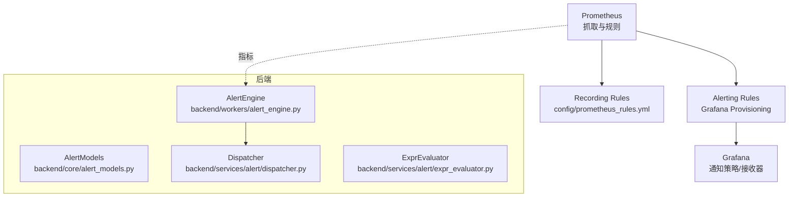
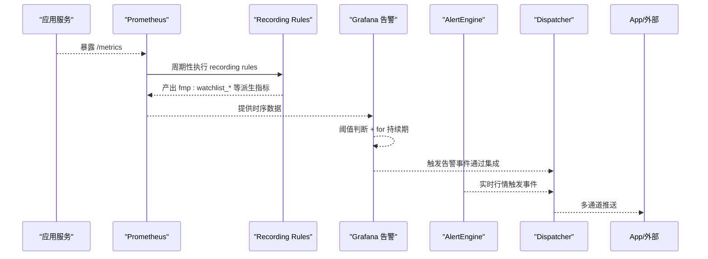
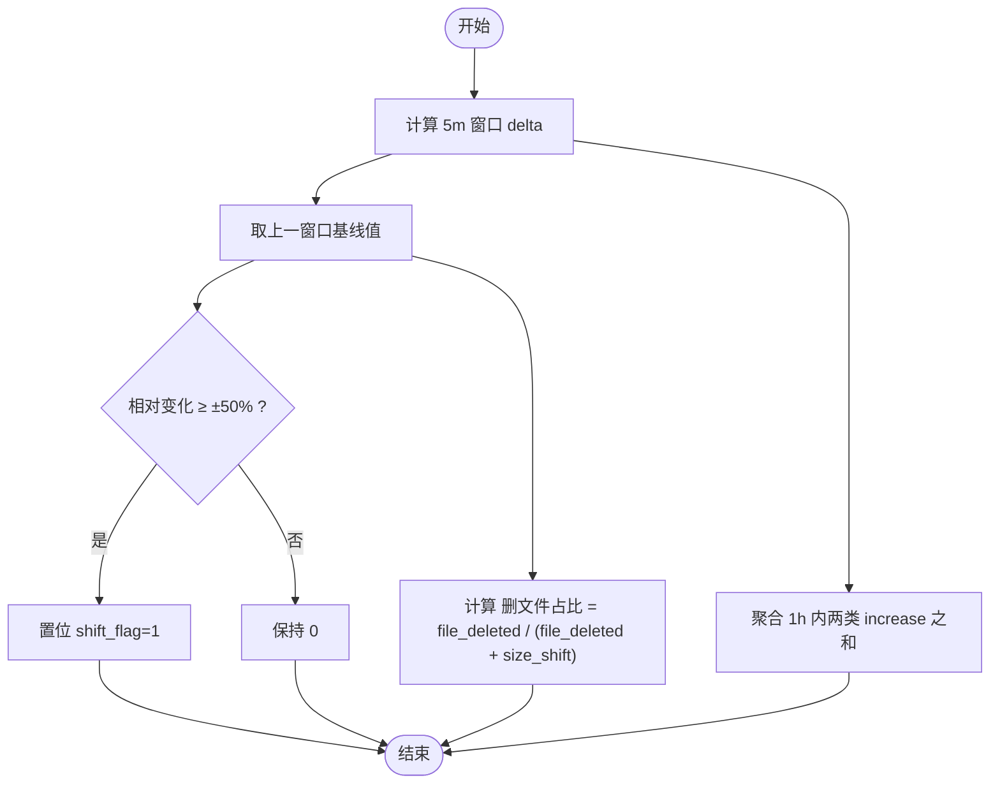
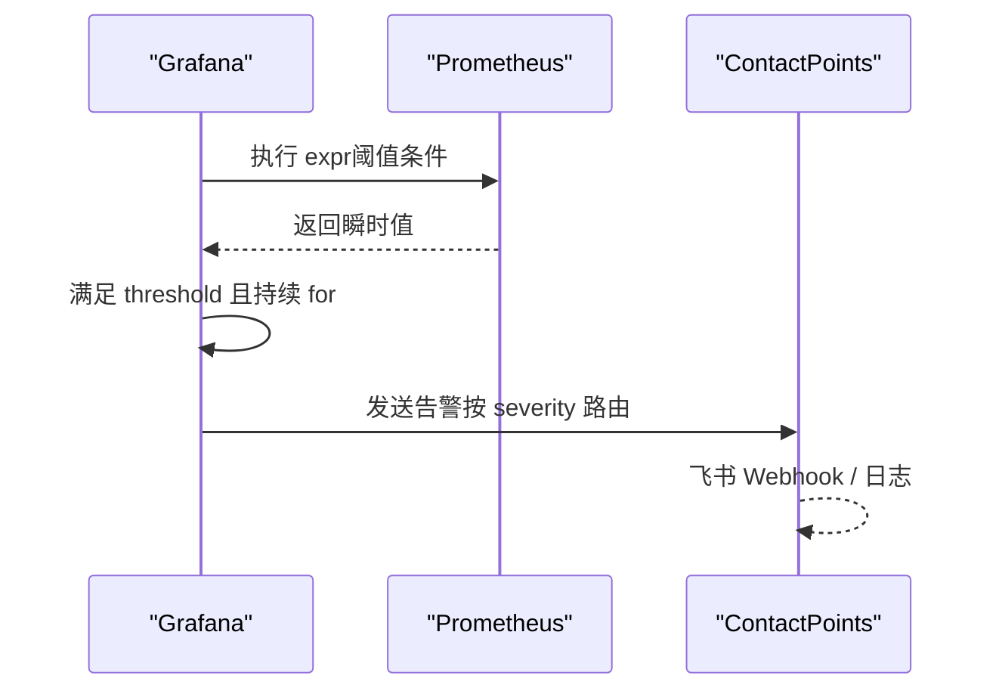
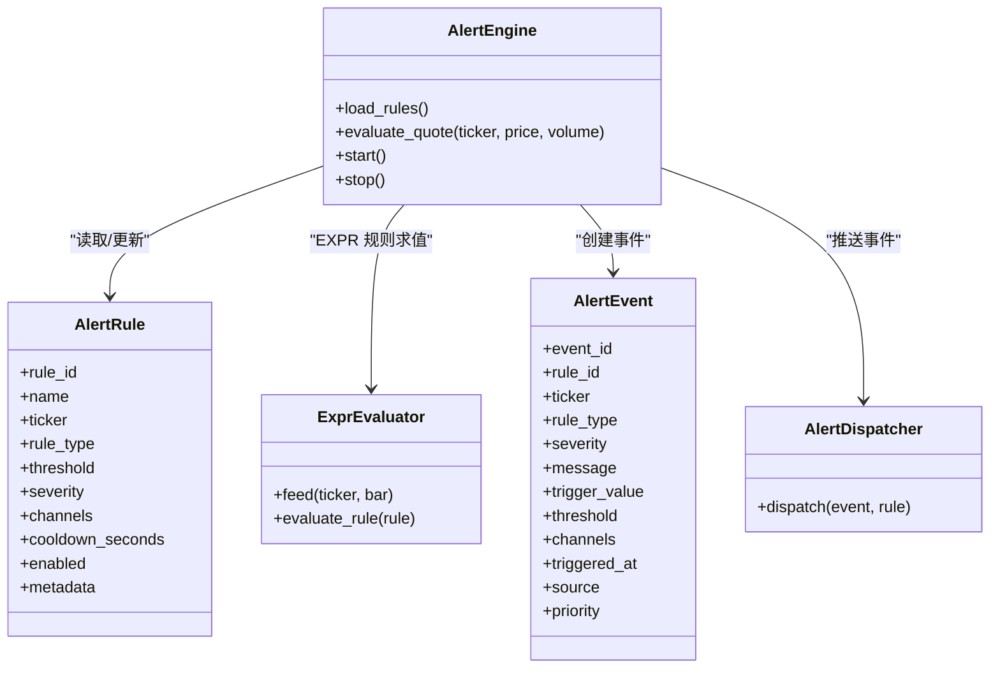
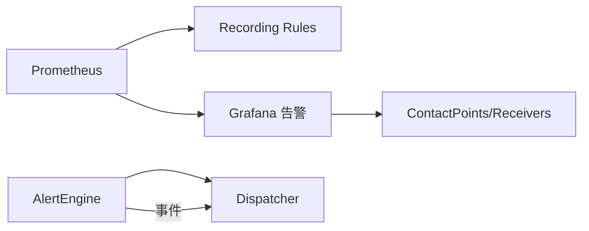

# 告警规则定义

<cite>
**本文引用的文件**
- [prometheus.yml](file://prometheus.yml)
- [config/prometheus_rules.yml](file://config/prometheus_rules.yml)
- [grafana/provisioning/alerting/alerting.yml](file://grafana/provisioning/alerting/alerting.yml)
- [backend/core/alert_models.py](file://backend/core/alert_models.py)
- [backend/services/alert/expr_evaluator.py](file://backend/services/alert/expr_evaluator.py)
- [backend/workers/alert_engine.py](file://backend/workers/alert_engine.py)
- [backend/services/alert/dispatcher.py](file://backend/services/alert/dispatcher.py)
</cite>

## 目录
1. [简介](#简介)
2. [项目结构](#项目结构)
3. [核心组件](#核心组件)
4. [架构总览](#架构总览)
5. [详细组件分析](#详细组件分析)
6. [依赖关系分析](#依赖关系分析)
7. [性能考量](#性能考量)
8. [故障排查指南](#故障排查指南)
9. [结论](#结论)
10. [附录：PromQL 与阈值最佳实践](#附录promql-与阈值最佳实践)

## 简介
本文件面向 Quant Agent 的告警规则定义，聚焦 Prometheus 侧的 Recording Rules（记录规则）与 Alerting Rules（告警规则），并结合 Grafana 内置告警能力，给出系统健康检查、业务异常检测、性能瓶颈预警等常见场景的规则编写范式。文档同时覆盖 PromQL 常用函数与聚合操作、动态阈值与相对变化率阈值的配置方法、评估周期（interval）设置原则，以及避免复杂表达式导致 Prometheus 负载过高的优化建议。

## 项目结构
本项目在 Prometheus/Grafana 侧的告警相关资产主要分布在以下位置：
- Prometheus 抓取与规则挂载点：prometheus.yml
- Recording Rules（服务端统一计算 watchlist 突变指标）：config/prometheus_rules.yml
- Grafana 内置告警规则（通过 provisioning 下发）：grafana/provisioning/alerting/alerting.yml
- 后端告警模型与引擎：backend/core/alert_models.py、backend/workers/alert_engine.py、backend/services/alert/*

图表来源
- [prometheus.yml:1-43](file://prometheus.yml#L1-L43)
- [config/prometheus_rules.yml:53-95](file://config/prometheus_rules.yml#L53-L95)
- [grafana/provisioning/alerting/alerting.yml:60-463](file://grafana/provisioning/alerting/alerting.yml#L60-L463)
- [backend/workers/alert_engine.py:53-84](file://backend/workers/alert_engine.py#L53-L84)
- [backend/core/alert_models.py:28-44](file://backend/core/alert_models.py#L28-L44)
- [backend/services/alert/dispatcher.py:357-461](file://backend/services/alert/dispatcher.py#L357-L461)

章节来源
- [prometheus.yml:1-43](file://prometheus.yml#L1-L43)
- [config/prometheus_rules.yml:1-95](file://config/prometheus_rules.yml#L1-L95)
- [grafana/provisioning/alerting/alerting.yml:1-463](file://grafana/provisioning/alerting/alerting.yml#L1-L463)

## 核心组件
- Prometheus 抓取与规则挂载：定义 scrape_interval、job targets，并预留 rule_files 挂载点用于启用 Recording Rules。
- Recording Rules：在服务端预计算派生指标（如 watchlist 5m delta、基线值、突变标志、1h 聚合计数与比率），降低查询复杂度与多副本计数放大风险。
- Grafana 内置告警：以 groups/rules 形式声明阈值条件、for 持续时间、标签与注解，并通过 policies/contactPoints 控制路由与重复频率。
- 后端告警引擎：订阅行情流，评估价格类、技术指标类与自由布尔表达式类规则，生成事件并通过统一调度器推送。

章节来源
- [prometheus.yml:1-43](file://prometheus.yml#L1-L43)
- [config/prometheus_rules.yml:53-95](file://config/prometheus_rules.yml#L53-L95)
- [grafana/provisioning/alerting/alerting.yml:60-463](file://grafana/provisioning/alerting/alerting.yml#L60-L463)
- [backend/workers/alert_engine.py:53-84](file://backend/workers/alert_engine.py#L53-L84)

## 架构总览
Prometheus 负责采集与应用指标；Recording Rules 将高频或复杂计算下沉为稳定指标；Grafana 基于这些指标定义告警规则，按 severity 与策略进行分组与降噪；后端 AlertEngine 对实时行情进行规则评估，触发的事件经 Dispatcher 统一路由到应用内、飞书、Telegram 等通道。

图表来源
- [prometheus.yml:16-43](file://prometheus.yml#L16-L43)
- [config/prometheus_rules.yml:53-95](file://config/prometheus_rules.yml#L53-L95)
- [grafana/provisioning/alerting/alerting.yml:60-463](file://grafana/provisioning/alerting/alerting.yml#L60-L463)
- [backend/workers/alert_engine.py:137-247](file://backend/workers/alert_engine.py#L137-L247)
- [backend/services/alert/dispatcher.py:396-461](file://backend/services/alert/dispatcher.py#L396-L461)

## 详细组件分析

### Recording Rules（记录规则）
- 目标：将“增量/比率/突变标志”等复杂计算提前在 Prometheus 中完成，形成稳定指标供面板与告警直接引用，减少查询时延与多副本基数放大问题。
- 关键指标：
  - fmp:watchlist_size_delta5m：5 分钟窗口内的标的池规模变化（正值扩池，负值缩池）。
  - fmp:watchlist_size_prev5m：上一窗口的基线值，用作比率分母防除零。
  - fmp:watchlist_size_shift_flag：相对变化率阈值判定（≥±50%）。
  - fmp:watchlist_shift_total_1h：近 1 小时突变事件总数（合并两类 Counter 的 increase）。
  - fmp:watchlist_file_deleted_ratio_1h：近 1 小时删文件占突变总数的比例。
- 评估间隔：group interval 设为 5 分钟，与 delta 窗口对齐，确保指标一致性。

图表来源
- [config/prometheus_rules.yml:53-95](file://config/prometheus_rules.yml#L53-L95)

章节来源
- [config/prometheus_rules.yml:1-95](file://config/prometheus_rules.yml#L1-L95)

### Grafana 内置告警规则（Alerting Rules）
- 组织方式：通过 provisioning 的 groups 定义规则组，包含 condition、data 查询、threshold 条件、for 持续时间、labels（severity）、annotations（摘要与描述）。
- 典型规则示例（来自仓库）：
  - Futu 连接断开：当连接状态为 0 且持续超过 30s，标记 critical。
  - API P95 延迟过高：P95 延迟 > 2s 持续 1m，标记 critical。
  - Redis 内存使用率过高：使用率 > 80% 持续 2m，标记 warning。
  - 熔断器已打开：state=open 持续 10s，标记 critical。
  - 数据源限流飙升：5 分钟内限流次数 > 10，标记 critical。
  - 长时间退避：退避剩余时间 > 120s，标记 warning。
  - 配额耗尽/IP 封禁：对应 category 的 increase 大于 0，标记 critical。
  - 脏数据率过高：dirty_rate > 5% 持续 2m，标记 warning。
  - 分布式节点心跳超时/存活不足/降级频率过高：依据节点心跳与降级 rate 判定。
- 通知策略：contactPoints 配置 Webhook（飞书）与日志接收器；policies 按 severity 分组等待时间与重复频率。

图表来源
- [grafana/provisioning/alerting/alerting.yml:10-58](file://grafana/provisioning/alerting/alerting.yml#L10-L58)
- [grafana/provisioning/alerting/alerting.yml:60-463](file://grafana/provisioning/alerting/alerting.yml#L60-L463)

章节来源
- [grafana/provisioning/alerting/alerting.yml:1-463](file://grafana/provisioning/alerting/alerting.yml#L1-L463)

### 后端告警引擎与表达式求值
- AlertEngine：从 Redis 加载活跃规则，订阅行情流，逐条评估价格类、指标类与自由表达式类规则；触发后写入事件并调用 Dispatcher 推送。
- ExprEvaluator：解析并求值自由布尔表达式（与前端 TS 引擎语义一致），支持 MA/SMA/EMA/RSI/REF/CROSS/HHV/LLV/ABS/SQRT/MAX/MIN 等函数与运算符，结果序列用 NaN 表示未定义，布尔真值为 1.0。
- AlertModels：定义规则类型（价格穿越、涨跌幅、成交量突增、RSI/MACD/MA 穿越、自由表达式等）、严重程度、通知优先级与通道。

图表来源
- [backend/core/alert_models.py:28-141](file://backend/core/alert_models.py#L28-L141)
- [backend/workers/alert_engine.py:53-84](file://backend/workers/alert_engine.py#L53-L84)
- [backend/services/alert/expr_evaluator.py:436-651](file://backend/services/alert/expr_evaluator.py#L436-L651)
- [backend/services/alert/dispatcher.py:357-461](file://backend/services/alert/dispatcher.py#L357-L461)

章节来源
- [backend/core/alert_models.py:1-278](file://backend/core/alert_models.py#L1-L278)
- [backend/services/alert/expr_evaluator.py:1-733](file://backend/services/alert/expr_evaluator.py#L1-L733)
- [backend/workers/alert_engine.py:1-502](file://backend/workers/alert_engine.py#L1-L502)
- [backend/services/alert/dispatcher.py:1-580](file://backend/services/alert/dispatcher.py#L1-L580)

## 依赖关系分析
- Prometheus 与 Recording Rules：通过 rule_files 挂载（当前注释未启用），启用后将把复杂计算下沉至 server 端，解耦多副本计数。
- Grafana 与 Prometheus：Grafana 通过 data source 查询 Prometheus 指标，定义阈值与持续期，按策略路由到 contactPoints。
- 后端与 Dispatcher：AlertEngine 触发事件后统一走 Dispatcher，实现冷却、重试、DLQ、并行/串行投递等机制。

图表来源
- [prometheus.yml:1-43](file://prometheus.yml#L1-L43)
- [config/prometheus_rules.yml:53-95](file://config/prometheus_rules.yml#L53-L95)
- [grafana/provisioning/alerting/alerting.yml:10-58](file://grafana/provisioning/alerting/alerting.yml#L10-L58)
- [backend/workers/alert_engine.py:414-432](file://backend/workers/alert_engine.py#L414-L432)
- [backend/services/alert/dispatcher.py:357-461](file://backend/services/alert/dispatcher.py#L357-L461)

章节来源
- [prometheus.yml:1-43](file://prometheus.yml#L1-L43)
- [config/prometheus_rules.yml:53-95](file://config/prometheus_rules.yml#L53-L95)
- [grafana/provisioning/alerting/alerting.yml:10-58](file://grafana/provisioning/alerting/alerting.yml#L10-L58)
- [backend/workers/alert_engine.py:414-432](file://backend/workers/alert_engine.py#L414-L432)
- [backend/services/alert/dispatcher.py:357-461](file://backend/services/alert/dispatcher.py#L357-L461)

## 性能考量
- 优先使用 Recording Rules 预计算复杂表达式，减少 Grafana/Prometheus 查询时的聚合与函数开销。
- 合理设置 scrape_interval 与 group interval：
  - 主服务 FastAPI 抓取间隔为 5s，子服务为 15s；Recording Rules 组间隔为 5m，与 delta 窗口对齐。
- 限制告警规则的 for 持续时间，避免频繁抖动导致的误报与资源消耗。
- 使用 clamp_min 等函数保护分母，防止除零与 NaN 传播。
- 对高基数指标（如按 ticker/source 聚合）谨慎使用 rate/increase，必要时先过滤再聚合。

章节来源
- [prometheus.yml:1-43](file://prometheus.yml#L1-L43)
- [config/prometheus_rules.yml:53-95](file://config/prometheus_rules.yml#L53-L95)
- [grafana/provisioning/alerting/alerting.yml:60-463](file://grafana/provisioning/alerting/alerting.yml#L60-L463)

## 故障排查指南
- Recording Rules 未生效：确认 prometheus.yml 中的 rule_files 是否取消注释并正确挂载 config/prometheus_rules.yml。
- 告警不触发：检查 Grafana 规则组的 expr 是否正确、relativeTimeRange 与 instant 设置是否符合预期；确认 for 持续时间与阈值条件。
- 指标缺失：核对 scrape_configs 的 job_name、metrics_path、targets 是否可达；验证后端 /metrics 暴露路径。
- 通知失败：查看 Dispatcher 的重试队列与 DLQ；检查 contactPoints 的 Webhook URL 与签名校验配置。

章节来源
- [prometheus.yml:16-43](file://prometheus.yml#L16-L43)
- [grafana/provisioning/alerting/alerting.yml:10-58](file://grafana/provisioning/alerting/alerting.yml#L10-L58)
- [backend/services/alert/dispatcher.py:279-350](file://backend/services/alert/dispatcher.py#L279-L350)

## 结论
本项目通过 Recording Rules 将复杂计算下沉至 Prometheus 服务端，结合 Grafana 内置告警的后端化规则管理，实现了可维护、可扩展的监控与告警体系。后端 AlertEngine 与 Dispatcher 提供了实时行情驱动的告警能力与统一推送路由。遵循本文的阈值设置、评估周期与 PromQL 最佳实践，可在保证准确性的同时有效控制系统负载。

## 附录：PromQL 与阈值最佳实践
- 常用函数与聚合
  - increase()：适用于 Counter 类型的增量统计，常用于速率与事件计数。
  - rate()：适用于 Counter 类型的每秒速率，适合短期波动检测。
  - abs()：取绝对值，便于对称阈值判定（如相对变化率）。
  - clamp_min()：保护分母，避免除零与 NaN。
  - histogram_quantile()：计算直方图分位数，用于延迟/吞吐等分布型指标。
- 动态阈值与相对变化率
  - 相对变化率：abs(delta / prev) >= 阈值（如 ±50%），参考 fmp:watchlist_size_shift_flag 的实现思路。
  - 动态基线：使用 offset 获取历史基线（如 5m 前值），避免固定阈值在不同时段失效。
- 评估周期（interval）设置原则
  - 与数据特性匹配：tick 级行情可用较短 interval；日频/批处理指标适用较长 interval。
  - 与窗口对齐：recording rule 的 group interval 应与所用时间窗口（如 5m）一致，保证指标稳定性。
- 性能优化建议
  - 尽量在 recording rules 中完成复杂计算，Grafana 仅做阈值判断与展示。
  - 控制 relativeTimeRange 与查询范围，避免全量扫描。
  - 对高基数指标先过滤再聚合，减少笛卡尔积与内存占用。
  - 合理使用 for 持续时间，抑制短时抖动造成的告警风暴。

章节来源
- [config/prometheus_rules.yml:53-95](file://config/prometheus_rules.yml#L53-L95)
- [grafana/provisioning/alerting/alerting.yml:60-463](file://grafana/provisioning/alerting/alerting.yml#L60-L463)
- [prometheus.yml:1-43](file://prometheus.yml#L1-L43)