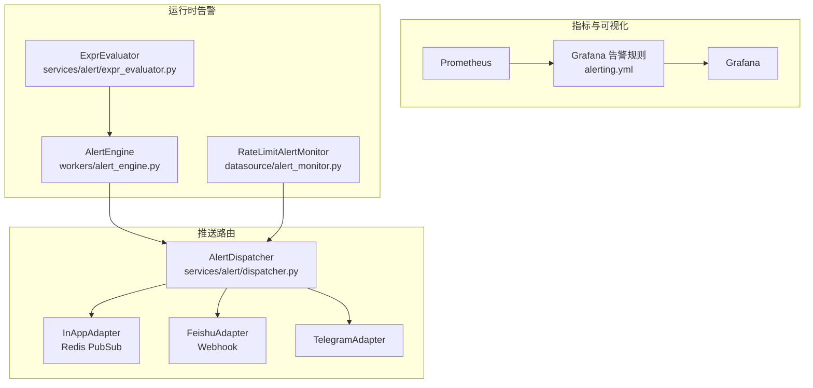
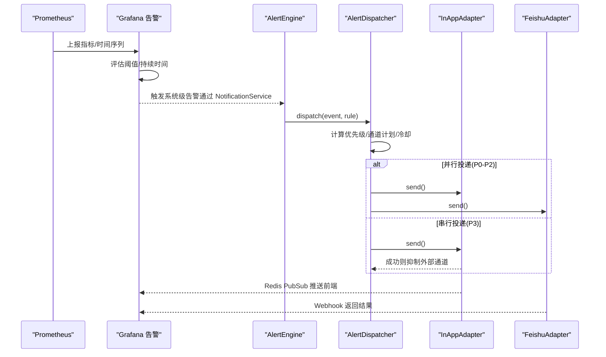
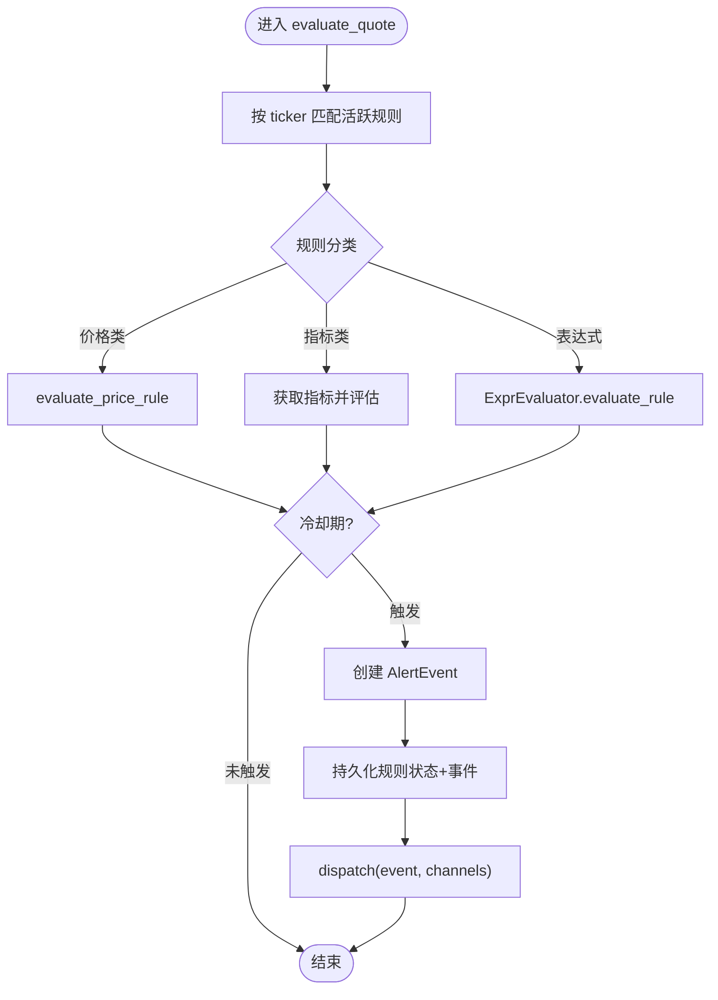
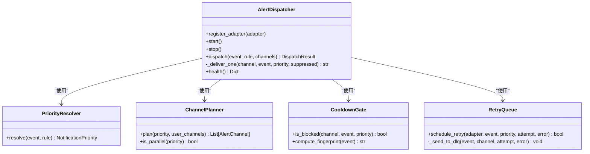
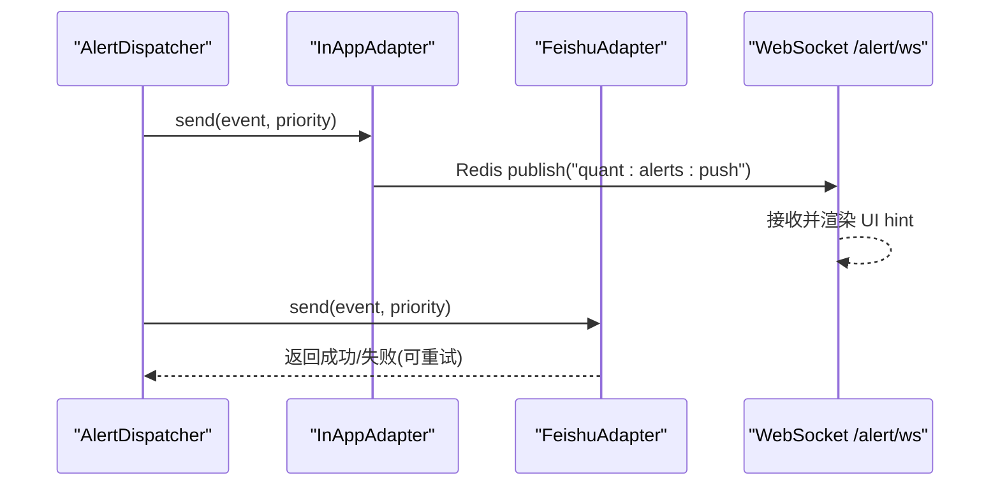
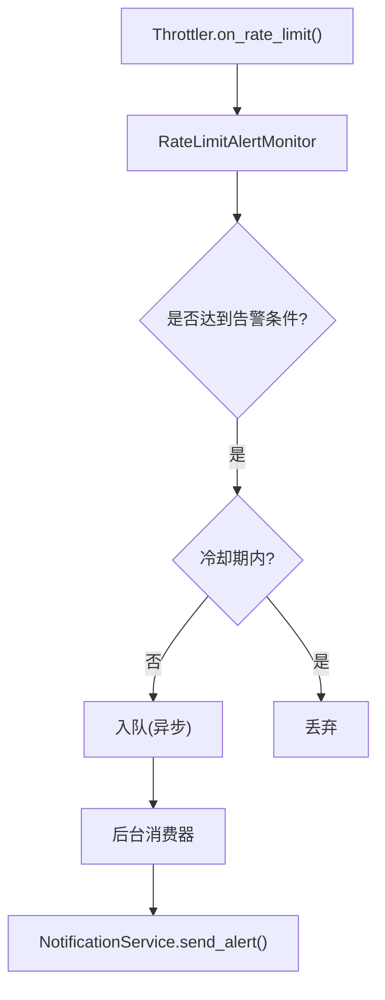
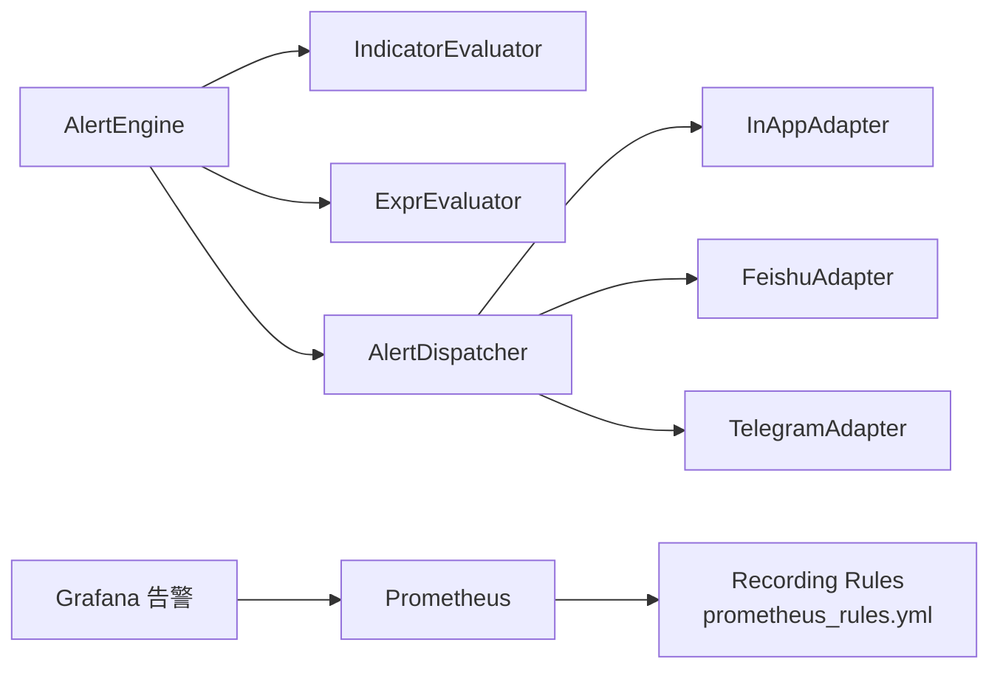

# 告警规则配置

<cite>
**本文引用的文件**
- [backend/core/alert_models.py](file://backend/core/alert_models.py)
- [backend/workers/alert_engine.py](file://backend/workers/alert_engine.py)
- [backend/services/alert/dispatcher.py](file://backend/services/alert/dispatcher.py)
- [backend/services/alert/expr_evaluator.py](file://backend/services/alert/expr_evaluator.py)
- [backend/services/alert/notification.py](file://backend/services/alert/notification.py)
- [backend/services/alert_adapters/feishu.py](file://backend/services/alert_adapters/feishu.py)
- [backend/services/alert_adapters/in_app.py](file://backend/services/alert_adapters/in_app.py)
- [backend/routers/alert.py](file://backend/routers/alert.py)
- [config/prometheus_rules.yml](file://config/prometheus_rules.yml)
- [grafana/provisioning/alerting/alerting.yml](file://grafana/provisioning/alerting/alerting.yml)
- [backend/services/datasource/alert_monitor.py](file://backend/services/datasource/alert_monitor.py)
</cite>

## 目录
1. [简介](#简介)
2. [项目结构](#项目结构)
3. [核心组件](#核心组件)
4. [架构总览](#架构总览)
5. [详细组件分析](#详细组件分析)
6. [依赖关系分析](#依赖关系分析)
7. [性能与稳定性](#性能与稳定性)
8. [故障排查指南](#故障排查指南)
9. [结论](#结论)
10. [附录：常见告警规则示例与配置清单](#附录：常见告警规则示例与配置清单)

## 简介
本文件面向 Quant Agent 的告警规则配置，覆盖以下目标：
- Prometheus/Grafana 侧的监控告警规则编写规范（阈值、评估周期、抑制与升级策略）
- 系统健康检查、业务异常检测、性能瓶颈预警等场景的规则设计方法
- 具体告警规则示例：行情延迟、数据源可用性、资源使用率等
- 告警通知渠道集成：应用内推送、飞书 Webhook、Telegram（代码已实现），并说明如何扩展至钉钉、企业微信、Slack
- 告警升级策略与静默规则：避免告警风暴与误报
- 告警效果验证与调试方法：帮助运维快速定位问题

## 项目结构
Quant Agent 的告警体系由三层构成：
- 指标采集与记录：Prometheus 规则与 Grafana 告警
- 运行时告警引擎：基于 Redis 行情的实时规则评估与事件生成
- 统一推送路由：多通道适配器与冷却/重试/降级机制

图表来源
- [grafana/provisioning/alerting/alerting.yml:60-463](file://grafana/provisioning/alerting/alerting.yml#L60-L463)
- [backend/workers/alert_engine.py:53-83](file://backend/workers/alert_engine.py#L53-L83)
- [backend/services/alert/dispatcher.py:357-461](file://backend/services/alert/dispatcher.py#L357-L461)
- [backend/services/alert/expr_evaluator.py:659-733](file://backend/services/alert/expr_evaluator.py#L659-L733)
- [backend/services/datasource/alert_monitor.py:42-153](file://backend/services/datasource/alert_monitor.py#L42-L153)

章节来源
- [backend/workers/alert_engine.py:53-83](file://backend/workers/alert_engine.py#L53-L83)
- [backend/services/alert/dispatcher.py:357-461](file://backend/services/alert/dispatcher.py#L357-L461)
- [grafana/provisioning/alerting/alerting.yml:60-463](file://grafana/provisioning/alerting/alerting.yml#L60-L463)

## 核心组件
- 规则模型与评估
  - 规则类型：价格穿越/高于/低于、涨跌幅、成交量突增、技术指标（RSI/MACD/MA交叉）、自由布尔表达式（EXPR）
  - 严重程度：info/warning/critical
  - 冷却期：按规则维度控制触发频率
- 告警引擎
  - 从 Redis 加载活跃规则，订阅行情流，逐条评估并生成事件
  - 支持指标类规则节流与自由表达式求值
- 统一推送调度器
  - 优先级解析、通道计划、冷却门控、重试队列、投递记录
  - 内置 InApp（Redis PubSub）、飞书 Webhook、Telegram 适配器
- 限流告警监控
  - 针对数据源限流飙升、长时间退避、配额耗尽、IP封禁等场景进行去重冷却后推送

章节来源
- [backend/core/alert_models.py:28-141](file://backend/core/alert_models.py#L28-L141)
- [backend/workers/alert_engine.py:137-247](file://backend/workers/alert_engine.py#L137-L247)
- [backend/services/alert/dispatcher.py:66-157](file://backend/services/alert/dispatcher.py#L66-L157)
- [backend/services/datasource/alert_monitor.py:42-153](file://backend/services/datasource/alert_monitor.py#L42-L153)

## 架构总览
下图展示从指标到告警事件的端到端流程，以及通知分发路径。

图表来源
- [backend/services/alert/notification.py:37-69](file://backend/services/alert/notification.py#L37-L69)
- [backend/services/alert/dispatcher.py:396-461](file://backend/services/alert/dispatcher.py#L396-L461)
- [backend/services/alert_adapters/in_app.py:41-66](file://backend/services/alert_adapters/in_app.py#L41-L66)
- [backend/services/alert_adapters/feishu.py:46-96](file://backend/services/alert_adapters/feishu.py#L46-L96)

## 详细组件分析

### 告警规则模型与评估
- 规则定义包含：rule_id、ticker、rule_type、threshold、severity、channels、cooldown_seconds、enabled、metadata
- 价格类规则评估：上穿/下穿、高于/低于、涨跌幅、成交量突增（需均量）
- 指标类规则评估：RSI 超买/超卖、MACD 金叉/死叉、均线交叉（短长周期）
- 自由表达式评估：与前端 TS 引擎语义一致，支持 MA/EMA/RSI/MACD/KDJ/BOLL 等函数与比较逻辑

图表来源
- [backend/workers/alert_engine.py:137-247](file://backend/workers/alert_engine.py#L137-L247)
- [backend/core/alert_models.py:149-278](file://backend/core/alert_models.py#L149-L278)
- [backend/services/alert/expr_evaluator.py:698-733](file://backend/services/alert/expr_evaluator.py#L698-L733)

章节来源
- [backend/core/alert_models.py:28-141](file://backend/core/alert_models.py#L28-L141)
- [backend/core/alert_models.py:149-278](file://backend/core/alert_models.py#L149-L278)
- [backend/workers/alert_engine.py:137-247](file://backend/workers/alert_engine.py#L137-L247)
- [backend/services/alert/expr_evaluator.py:659-733](file://backend/services/alert/expr_evaluator.py#L659-L733)

### 统一推送调度器（AlertDispatcher）
- 优先级解析：根据 severity + source 映射到 P0~P3
- 通道计划：不同优先级默认通道组合；P0 强制全开；P3 串行且 in_app 成功后抑制外部
- 冷却门控：按 channel + fingerprint 去重，in_app 不冷却
- 重试队列：按优先级退避重试，失败入 DLQ
- 投递记录：每次投递的状态、耗时、错误信息可追溯

图表来源
- [backend/services/alert/dispatcher.py:66-157](file://backend/services/alert/dispatcher.py#L66-L157)
- [backend/services/alert/dispatcher.py:173-219](file://backend/services/alert/dispatcher.py#L173-L219)
- [backend/services/alert/dispatcher.py:279-350](file://backend/services/alert/dispatcher.py#L279-L350)
- [backend/services/alert/dispatcher.py:357-461](file://backend/services/alert/dispatcher.py#L357-L461)

章节来源
- [backend/services/alert/dispatcher.py:66-157](file://backend/services/alert/dispatcher.py#L66-L157)
- [backend/services/alert/dispatcher.py:173-219](file://backend/services/alert/dispatcher.py#L173-L219)
- [backend/services/alert/dispatcher.py:279-350](file://backend/services/alert/dispatcher.py#L279-L350)
- [backend/services/alert/dispatcher.py:357-461](file://backend/services/alert/dispatcher.py#L357-L461)

### 通知渠道适配器
- InApp：通过 Redis PubSub 推送到 quant:alerts:push，前端 WebSocket /alert/ws 订阅
- 飞书：支持卡片消息（P0/P1）与纯文本（P2/P3），签名校验可选
- Telegram：代码中已注册通道枚举，可按相同模式实现适配器

图表来源
- [backend/services/alert_adapters/in_app.py:41-66](file://backend/services/alert_adapters/in_app.py#L41-L66)
- [backend/routers/alert.py:148-211](file://backend/routers/alert.py#L148-L211)
- [backend/services/alert_adapters/feishu.py:46-96](file://backend/services/alert_adapters/feishu.py#L46-L96)

章节来源
- [backend/services/alert_adapters/in_app.py:27-78](file://backend/services/alert_adapters/in_app.py#L27-L78)
- [backend/services/alert_adapters/feishu.py:27-133](file://backend/services/alert_adapters/feishu.py#L27-L133)
- [backend/routers/alert.py:148-211](file://backend/routers/alert.py#L148-L211)

### 限流告警监控（数据源可用性）
- 检测场景：限流飙升、长时间退避、配额耗尽、IP 封禁
- 去重冷却：同数据源+同类型 15 分钟内不重复告警
- 异步队列：非阻塞入队，后台消费器推送通知，避免阻塞限流回调热路径

图表来源
- [backend/services/datasource/alert_monitor.py:42-153](file://backend/services/datasource/alert_monitor.py#L42-L153)
- [backend/services/datasource/alert_monitor.py:185-236](file://backend/services/datasource/alert_monitor.py#L185-L236)
- [backend/services/alert/notification.py:37-69](file://backend/services/alert/notification.py#L37-L69)

章节来源
- [backend/services/datasource/alert_monitor.py:42-153](file://backend/services/datasource/alert_monitor.py#L42-L153)
- [backend/services/datasource/alert_monitor.py:185-236](file://backend/services/datasource/alert_monitor.py#L185-L236)
- [backend/services/alert/notification.py:37-69](file://backend/services/alert/notification.py#L37-L69)

## 依赖关系分析
- AlertEngine 依赖：
  - Redis（规则存储、事件列表、行情流）
  - IndicatorEvaluator（指标获取与评估）
  - ExprEvaluator（自由表达式求值）
  - AlertDispatcher（统一推送）
- AlertDispatcher 依赖：
  - ChannelAdapters（InApp、Feishu、Telegram）
  - Redis（冷却键、DLQ）
- Grafana/Prometheus：
  - alerting.yml 定义联系人、路由、分组与规则
  - prometheus_rules.yml 提供 Recording Rules（如 FMP watchlist 突变检测）

图表来源
- [backend/workers/alert_engine.py:53-83](file://backend/workers/alert_engine.py#L53-L83)
- [backend/services/alert/dispatcher.py:357-461](file://backend/services/alert/dispatcher.py#L357-L461)
- [config/prometheus_rules.yml:53-95](file://config/prometheus_rules.yml#L53-L95)
- [grafana/provisioning/alerting/alerting.yml:60-463](file://grafana/provisioning/alerting/alerting.yml#L60-L463)

章节来源
- [backend/workers/alert_engine.py:53-83](file://backend/workers/alert_engine.py#L53-L83)
- [backend/services/alert/dispatcher.py:357-461](file://backend/services/alert/dispatcher.py#L357-L461)
- [config/prometheus_rules.yml:53-95](file://config/prometheus_rules.yml#L53-L95)
- [grafana/provisioning/alerting/alerting.yml:60-463](file://grafana/provisioning/alerting/alerting.yml#L60-L463)

## 性能与稳定性
- 评估节流：指标类规则按 ticker 节流评估，避免高频计算
- 冷却抑制：通道级冷却（fingerprint）降低重复告警；P3 串行抑制外部通道
- 重试与 DLQ：按优先级退避重试，失败入 DLQ 便于后续处理
- 降级策略：无 Redis 时 InApp 仍视为成功；无适配器时记录失败但不阻断主流程
- 内存与队列：重试任务定期清理；告警队列满时丢弃并记录

章节来源
- [backend/workers/alert_engine.py:259-302](file://backend/workers/alert_engine.py#L259-L302)
- [backend/services/alert/dispatcher.py:164-219](file://backend/services/alert/dispatcher.py#L164-L219)
- [backend/services/alert/dispatcher.py:267-350](file://backend/services/alert/dispatcher.py#L267-L350)
- [backend/services/alert_adapters/in_app.py:41-66](file://backend/services/alert_adapters/in_app.py#L41-L66)

## 故障排查指南
- 告警未触发
  - 检查规则是否启用、ticker 匹配、冷却期是否命中
  - 查看 AlertEngine 统计（eval_count、trigger_count）
- 通知未送达
  - 检查适配器 enabled 状态与配置（如飞书 Webhook URL）
  - 查看投递记录（event deliveries）确认 status 与 error
- 告警风暴
  - 调整冷却 TTL 与优先级默认通道
  - 利用 P3 串行抑制外部通道
- 限流告警
  - 查看 RateLimitAlertMonitor 状态与队列消费情况
  - 关注 IP 封禁、配额耗尽等高危场景

章节来源
- [backend/workers/alert_engine.py:491-502](file://backend/workers/alert_engine.py#L491-L502)
- [backend/services/alert/dispatcher.py:529-564](file://backend/services/alert/dispatcher.py#L529-L564)
- [backend/services/datasource/alert_monitor.py:238-282](file://backend/services/datasource/alert_monitor.py#L238-L282)

## 结论
Quant Agent 的告警体系将“指标层（Prometheus/Grafana）”与“运行时代码层（AlertEngine/Dispatcher）”解耦，既支持系统级基础设施告警，也支持业务规则与自由表达式告警。通过优先级、通道计划、冷却与重试机制，有效避免告警风暴与误报，并提供完整的投递可观测性。结合限流告警监控，可快速发现数据源异常并自动升级处理。

## 附录：常见告警规则示例与配置清单

### Prometheus/Grafana 规则编写规范
- 阈值设置
  - 使用阈值比较（gt/lt）并结合相对时间窗口（如 5m、1h）
  - 对比率型指标使用 clamp_min 避免除零
- 评估周期
  - for 持续时间用于稳定判定，避免瞬时抖动
  - 不同严重级别采用不同 group_wait/repeat_interval
- 抑制与升级
  - 通过 routes 匹配 severity 分流到不同 receiver
  - 使用 group_by 聚合告警，减少重复
- 示例参考
  - API P95 延迟过高、Redis 内存使用率、熔断器打开、数据源限流飙升、节点心跳超时等

章节来源
- [grafana/provisioning/alerting/alerting.yml:94-149](file://grafana/provisioning/alerting/alerting.yml#L94-L149)
- [grafana/provisioning/alerting/alerting.yml:150-291](file://grafana/provisioning/alerting/alerting.yml#L150-L291)
- [grafana/provisioning/alerting/alerting.yml:324-463](file://grafana/provisioning/alerting/alerting.yml#L324-L463)

### 系统健康检查
- Futu OpenD 连接断开：futu_connected < 1 持续 30s
- 分布式节点心跳超时：time() - heartbeat_timestamp > 60
- YF 存活节点不足：quant_dist_node_alive_count{capability="yfinance"} < 2

章节来源
- [grafana/provisioning/alerting/alerting.yml:66-93](file://grafana/provisioning/alerting/alerting.yml#L66-L93)
- [grafana/provisioning/alerting/alerting.yml:324-351](file://grafana/provisioning/alerting/alerting.yml#L324-L351)
- [grafana/provisioning/alerting/alerting.yml:352-379](file://grafana/provisioning/alerting/alerting.yml#L352-L379)

### 业务异常检测
- 数据源限流飙升：rate(ds_rate_limit_total[5m]) * 300 > 10
- 配额耗尽：increase(ds_rate_limit_total{category="quota_exhausted"}[5m]) > 0
- IP 封禁：increase(ds_rate_limit_total{category="ip_blocked"}[5m]) > 0

章节来源
- [grafana/provisioning/alerting/alerting.yml:178-291](file://grafana/provisioning/alerting/alerting.yml#L178-L291)
- [backend/services/datasource/alert_monitor.py:109-147](file://backend/services/datasource/alert_monitor.py#L109-L147)

### 性能瓶颈预警
- API P95 延迟：histogram_quantile(0.95, sum(rate(fastapi_request_duration_seconds_bucket[5m])) by (le)) > 2
- Redis 内存使用率：redis_memory_used_bytes / redis_memory_max_bytes * 100 > 80

章节来源
- [grafana/provisioning/alerting/alerting.yml:94-149](file://grafana/provisioning/alerting/alerting.yml#L94-L149)

### 通知渠道集成
- 应用内推送：InAppAdapter 通过 Redis PubSub 推送，前端 /alert/ws 订阅
- 飞书：FeishuAdapter 支持卡片消息与签名校验
- 钉钉/企业微信/Slack：按 ChannelAdapter 协议新增适配器，并在 AlertDispatcher 注册

章节来源
- [backend/services/alert_adapters/in_app.py:27-78](file://backend/services/alert_adapters/in_app.py#L27-L78)
- [backend/services/alert_adapters/feishu.py:27-133](file://backend/services/alert_adapters/feishu.py#L27-L133)
- [backend/services/alert/dispatcher.py:380-384](file://backend/services/alert/dispatcher.py#L380-L384)

### 告警升级策略与静默规则
- 升级策略：P0 强制全通道；P1 用户通道或默认；P2 默认 in_app + feishu；P3 仅 in_app
- 静默规则：通道级冷却（fingerprint），in_app 不受限；P3 串行抑制外部通道
- 重复抑制：group_by + repeat_interval 控制 Grafana 侧重复推送

章节来源
- [backend/services/alert/dispatcher.py:116-157](file://backend/services/alert/dispatcher.py#L116-L157)
- [backend/services/alert/dispatcher.py:164-219](file://backend/services/alert/dispatcher.py#L164-L219)
- [grafana/provisioning/alerting/alerting.yml:37-59](file://grafana/provisioning/alerting/alerting.yml#L37-L59)

### 告警效果验证与调试
- 查看引擎统计：running、active_rules、eval_count、trigger_count
- 查看事件投递记录：event deliveries 中的 status、attempt、latency_ms、error
- 限流告警状态：active_spike_sources、recent_rate_counts、cooldown_keys

章节来源
- [backend/workers/alert_engine.py:491-502](file://backend/workers/alert_engine.py#L491-L502)
- [backend/services/alert/dispatcher.py:554-564](file://backend/services/alert/dispatcher.py#L554-L564)
- [backend/services/datasource/alert_monitor.py:273-282](file://backend/services/datasource/alert_monitor.py#L273-L282)
