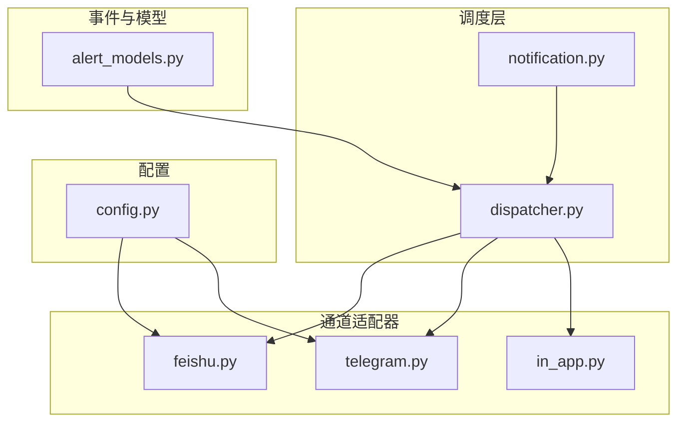
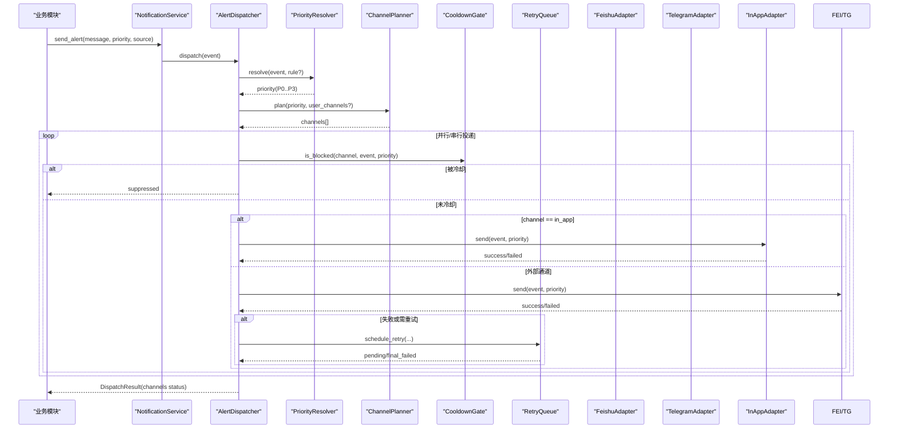
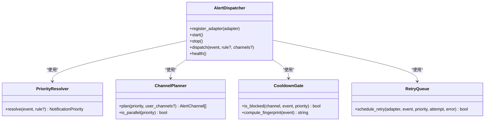
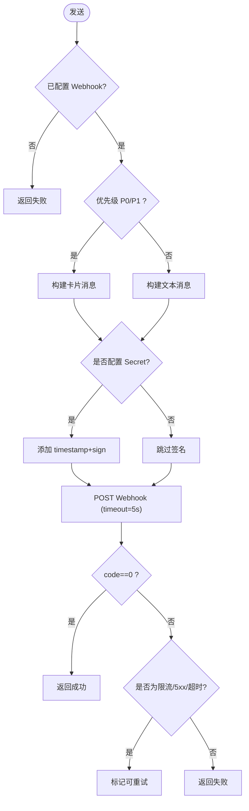
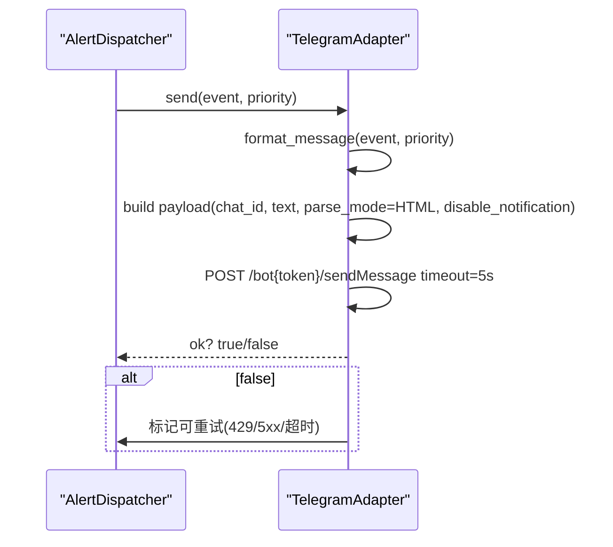
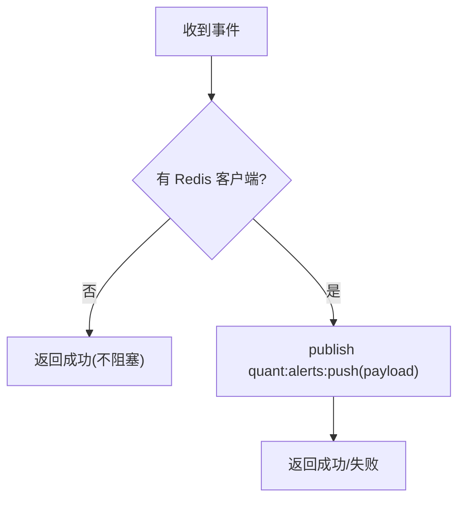
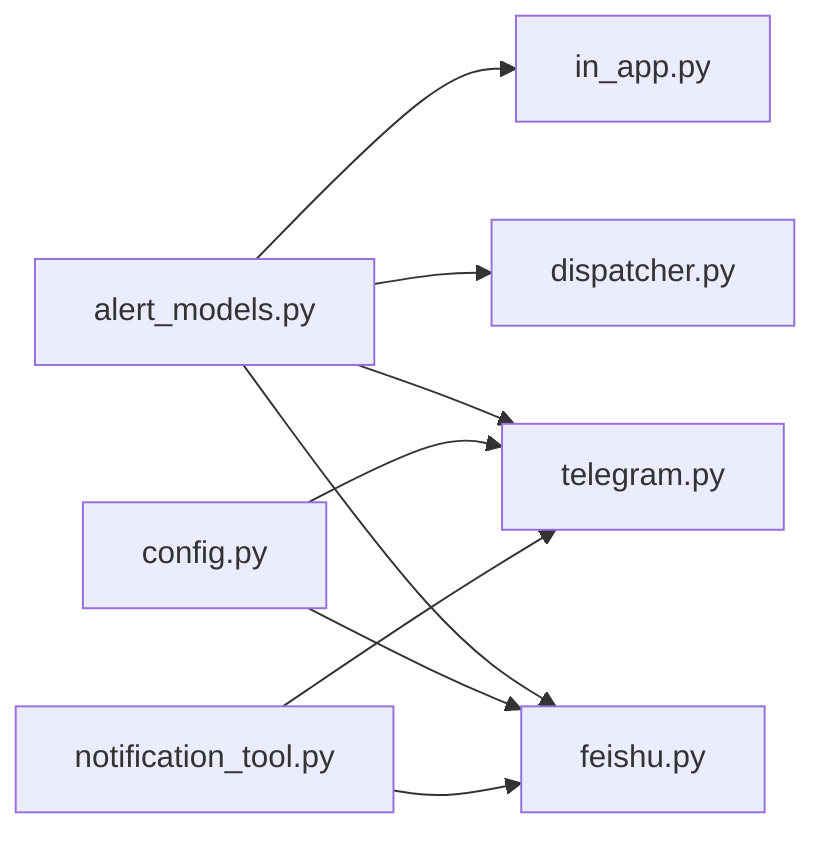

# 通知渠道配置

<cite>
**本文引用的文件**
- [backend/services/alert/dispatcher.py](file://backend/services/alert/dispatcher.py)
- [backend/services/alert/notification.py](file://backend/services/alert/notification.py)
- [backend/core/alert_models.py](file://backend/core/alert_models.py)
- [backend/services/alert_adapters/feishu.py](file://backend/services/alert_adapters/feishu.py)
- [backend/services/alert_adapters/telegram.py](file://backend/services/alert_adapters/telegram.py)
- [backend/services/alert_adapters/in_app.py](file://backend/services/alert_adapters/in_app.py)
- [backend/core/config.py](file://backend/core/config.py)
- [hermes_agent/tools/notification_tool.py](file://hermes_agent/tools/notification_tool.py)
</cite>

## 目录
1. [简介](#简介)
2. [项目结构](#项目结构)
3. [核心组件](#核心组件)
4. [架构总览](#架构总览)
5. [详细组件分析](#详细组件分析)
6. [依赖关系分析](#依赖关系分析)
7. [性能与限流](#性能与限流)
8. [故障转移机制](#故障转移机制)
9. [测试与验证](#测试与验证)
10. [常见问题排查](#常见问题排查)
11. [结论](#结论)
12. [附录：配置清单与示例](#附录：配置清单与示例)

## 简介
本文件面向 Quant Agent 的通知渠道配置，覆盖飞书、Telegram、应用内（In-App）等通道的集成步骤、认证方式、消息格式、限流策略、模板自定义、故障转移、测试验证与常见问题排查。系统通过统一的告警调度器进行路由与投递，确保高可靠、可观测、可扩展的通知能力。

## 项目结构
通知子系统由“事件模型 + 统一调度器 + 通道适配器”构成：
- 事件模型：定义告警规则、事件、优先级、通道枚举等
- 调度器：负责优先级解析、通道规划、冷却去重、重试与投递记录
- 适配器：各渠道的具体实现（飞书、Telegram、应用内）
- 配置：环境变量注入各渠道所需凭据

图表来源
- [backend/core/alert_models.py:64-79](file://backend/core/alert_models.py#L64-L79)
- [backend/services/alert/dispatcher.py:357-461](file://backend/services/alert/dispatcher.py#L357-L461)
- [backend/services/alert/notification.py:19-72](file://backend/services/alert/notification.py#L19-L72)
- [backend/services/alert_adapters/feishu.py:27-133](file://backend/services/alert_adapters/feishu.py#L27-L133)
- [backend/services/alert_adapters/telegram.py:25-101](file://backend/services/alert_adapters/telegram.py#L25-L101)
- [backend/services/alert_adapters/in_app.py:27-78](file://backend/services/alert_adapters/in_app.py#L27-L78)
- [backend/core/config.py:75-80](file://backend/core/config.py#L75-L80)

章节来源
- [backend/core/alert_models.py:64-79](file://backend/core/alert_models.py#L64-L79)
- [backend/services/alert/dispatcher.py:357-461](file://backend/services/alert/dispatcher.py#L357-L461)
- [backend/services/alert/notification.py:19-72](file://backend/services/alert/notification.py#L19-L72)
- [backend/services/alert_adapters/feishu.py:27-133](file://backend/services/alert_adapters/feishu.py#L27-L133)
- [backend/services/alert_adapters/telegram.py:25-101](file://backend/services/alert_adapters/telegram.py#L25-L101)
- [backend/services/alert_adapters/in_app.py:27-78](file://backend/services/alert_adapters/in_app.py#L27-L78)
- [backend/core/config.py:75-80](file://backend/core/config.py#L75-L80)

## 核心组件
- 事件与通道模型：定义 AlertChannel（IN_APP、FEISHU、TELEGRAM）、NotificationPriority（P0~P3）、AlertEvent 等
- 统一调度器 AlertDispatcher：优先级解析、通道计划、冷却门控、重试队列、投递记录与健康检查
- 通知服务 NotificationService：向后兼容的 send_alert 入口，内部转为 AlertEvent 经调度器派发
- 通道适配器：
  - 飞书适配器：Webhook 卡片/文本消息，支持签名
  - Telegram 适配器：Bot API sendMessage，HTML 格式，P3 静默
  - 应用内适配器：Redis PubSub 推送至前端 WebSocket

章节来源
- [backend/core/alert_models.py:64-79](file://backend/core/alert_models.py#L64-L79)
- [backend/core/alert_models.py:112-142](file://backend/core/alert_models.py#L112-L142)
- [backend/services/alert/dispatcher.py:66-157](file://backend/services/alert/dispatcher.py#L66-L157)
- [backend/services/alert/dispatcher.py:173-219](file://backend/services/alert/dispatcher.py#L173-L219)
- [backend/services/alert/dispatcher.py:279-350](file://backend/services/alert/dispatcher.py#L279-L350)
- [backend/services/alert/dispatcher.py:357-564](file://backend/services/alert/dispatcher.py#L357-L564)
- [backend/services/alert/notification.py:19-72](file://backend/services/alert/notification.py#L19-L72)
- [backend/services/alert_adapters/feishu.py:27-133](file://backend/services/alert_adapters/feishu.py#L27-L133)
- [backend/services/alert_adapters/telegram.py:25-101](file://backend/services/alert_adapters/telegram.py#L25-L101)
- [backend/services/alert_adapters/in_app.py:27-78](file://backend/services/alert_adapters/in_app.py#L27-L78)

## 架构总览
下图展示从业务侧到各通知渠道的完整调用链，包括优先级解析、通道计划、冷却与重试、以及最终投递。

图表来源
- [backend/services/alert/notification.py:37-58](file://backend/services/alert/notification.py#L37-L58)
- [backend/services/alert/dispatcher.py:66-157](file://backend/services/alert/dispatcher.py#L66-L157)
- [backend/services/alert/dispatcher.py:173-219](file://backend/services/alert/dispatcher.py#L173-L219)
- [backend/services/alert/dispatcher.py:279-350](file://backend/services/alert/dispatcher.py#L279-L350)
- [backend/services/alert/dispatcher.py:396-461](file://backend/services/alert/dispatcher.py#L396-L461)
- [backend/services/alert/adapters/feishu.py:46-96](file://backend/services/alert_adapters/feishu.py#L46-L96)
- [backend/services/alert/adapters/telegram.py:44-83](file://backend/services/alert_adapters/telegram.py#L44-L83)
- [backend/services/alert/adapters/in_app.py:41-66](file://backend/services/alert_adapters/in_app.py#L41-L66)

## 详细组件分析

### 统一调度器（AlertDispatcher）
- 职责：解析优先级、规划通道、冷却去重、重试与 DLQ、投递记录与健康检查
- 关键特性：
  - 优先级解析：根据 severity/source/rule 映射 P0~P3
  - 通道计划：按优先级默认通道组合，P0 强制全开，P3 串行且 in_app 成功则抑制外部
  - 冷却门控：基于 fingerprint 与 TTL，in_app 不冷却
  - 重试队列：指数退避，达到上限进入 DLQ
  - 健康检查：返回适配器状态与待重试任务数

图表来源
- [backend/services/alert/dispatcher.py:66-157](file://backend/services/alert/dispatcher.py#L66-L157)
- [backend/services/alert/dispatcher.py:173-219](file://backend/services/alert/dispatcher.py#L173-L219)
- [backend/services/alert/dispatcher.py:279-350](file://backend/services/alert/dispatcher.py#L279-L350)
- [backend/services/alert/dispatcher.py:357-564](file://backend/services/alert/dispatcher.py#L357-L564)

章节来源
- [backend/services/alert/dispatcher.py:66-157](file://backend/services/alert/dispatcher.py#L66-L157)
- [backend/services/alert/dispatcher.py:173-219](file://backend/services/alert/dispatcher.py#L173-L219)
- [backend/services/alert/dispatcher.py:279-350](file://backend/services/alert/dispatcher.py#L279-L350)
- [backend/services/alert/dispatcher.py:357-564](file://backend/services/alert/dispatcher.py#L357-L564)

### 飞书适配器（FeishuAdapter）
- 认证：可选签名（timestamp + secret），通过 HMAC-SHA256 + Base64 生成 sign
- 消息格式：
  - P0/P1：交互式卡片消息（interactive），含标题与内容
  - P2/P3：纯文本消息（text）
- 限流与错误：
  - 识别频率限制码并标记为可重试
  - HTTP 5xx/超时视为可重试
- 配置项：
  - FEISHU_WEBHOOK_URL：必填
  - FEISHU_SECRET：可选，启用签名校验

图表来源
- [backend/services/alert_adapters/feishu.py:46-96](file://backend/services/alert_adapters/feishu.py#L46-L96)
- [backend/services/alert_adapters/feishu.py:98-132](file://backend/services/alert_adapters/feishu.py#L98-L132)

章节来源
- [backend/services/alert_adapters/feishu.py:27-133](file://backend/services/alert_adapters/feishu.py#L27-L133)

### Telegram 适配器（TelegramAdapter）
- 认证：Bot Token + Chat ID
- 消息格式：HTML 富文本，P3 静默推送（disable_notification=True）
- 限流与错误：
  - 429 频率限制、5xx 网络错误、超时均视为可重试
- 配置项：
  - TELEGRAM_BOT_TOKEN：必填
  - TELEGRAM_CHAT_ID：必填

图表来源
- [backend/services/alert_adapters/telegram.py:44-83](file://backend/services/alert_adapters/telegram.py#L44-L83)
- [backend/services/alert_adapters/telegram.py:85-101](file://backend/services/alert_adapters/telegram.py#L85-L101)

章节来源
- [backend/services/alert_adapters/telegram.py:25-101](file://backend/services/alert_adapters/telegram.py#L25-L101)

### 应用内适配器（InAppAdapter）
- 机制：通过 Redis PubSub 发布到专用频道，前端 WebSocket 订阅接收实时告警
- 行为：无 Redis 客户端时直接返回成功（不阻塞流程）；P0 要求确认（ack_required）
- 配置项：无需额外凭据（依赖全局 Redis 客户端）

图表来源
- [backend/services/alert_adapters/in_app.py:41-66](file://backend/services/alert_adapters/in_app.py#L41-L66)

章节来源
- [backend/services/alert_adapters/in_app.py:27-78](file://backend/services/alert_adapters/in_app.py#L27-L78)

### 通知服务（NotificationService）
- 作用：向后兼容的 send_alert 接口，内部构造 AlertEvent 并通过 AlertDispatcher 派发
- 优先级映射：将 NotificationPriority 映射为 AlertSeverity 用于调度

章节来源
- [backend/services/alert/notification.py:19-72](file://backend/services/alert/notification.py#L19-L72)

## 依赖关系分析
- 模型依赖：所有适配器与调度器共享 alert_models 中的枚举与数据类
- 配置依赖：
  - 飞书：FEISHU_WEBHOOK_URL、FEISHU_SECRET
  - Telegram：TELEGRAM_BOT_TOKEN、TELEGRAM_CHAT_ID
  - 应用内：依赖全局 Redis（由框架提供）
- 工具层：Hermes Agent 的 NotificationTool 可直接调用外部渠道（独立于调度器）

图表来源
- [backend/core/alert_models.py:64-79](file://backend/core/alert_models.py#L64-L79)
- [backend/core/config.py:75-80](file://backend/core/config.py#L75-L80)
- [hermes_agent/tools/notification_tool.py:25-81](file://hermes_agent/tools/notification_tool.py#L25-L81)

章节来源
- [backend/core/alert_models.py:64-79](file://backend/core/alert_models.py#L64-L79)
- [backend/core/config.py:75-80](file://backend/core/config.py#L75-L80)
- [hermes_agent/tools/notification_tool.py:25-81](file://hermes_agent/tools/notification_tool.py#L25-L81)

## 性能与限流
- 并发投递：P0~P2 并行投递，P3 串行投递并在 in_app 成功后抑制外部通道
- 冷却去重：基于 fingerprint 与 TTL 的通道级冷却，in_app 不受限
- 重试策略：指数退避，达到最大尝试次数进入 DLQ
- 外部限流：
  - 飞书：识别特定频率限制码并标记可重试
  - Telegram：429 频率限制、5xx 错误、超时均标记可重试

章节来源
- [backend/services/alert/dispatcher.py:116-157](file://backend/services/alert/dispatcher.py#L116-L157)
- [backend/services/alert/dispatcher.py:164-219](file://backend/services/alert/dispatcher.py#L164-L219)
- [backend/services/alert/dispatcher.py:267-350](file://backend/services/alert/dispatcher.py#L267-L350)
- [backend/services/alert_adapters/feishu.py:73-96](file://backend/services/alert_adapters/feishu.py#L73-L96)
- [backend/services/alert_adapters/telegram.py:61-83](file://backend/services/alert_adapters/telegram.py#L61-L83)

## 故障转移机制
- 多通道冗余：同一事件可同时投递到多个通道（如 in_app + feishu + telegram），任一通道失败不影响其他通道
- 自动抑制：P3 在 in_app 成功后抑制外部通道，降低噪声
- 重试与 DLQ：外部通道失败会进入重试队列，最终失败写入 DLQ 便于后续人工处理
- 健康检查：可通过 health 接口查看各适配器状态与待重试任务数

章节来源
- [backend/services/alert/dispatcher.py:116-157](file://backend/services/alert/dispatcher.py#L116-L157)
- [backend/services/alert/dispatcher.py:396-461](file://backend/services/alert/dispatcher.py#L396-L461)
- [backend/services/alert/dispatcher.py:279-350](file://backend/services/alert/dispatcher.py#L279-L350)
- [backend/services/alert/dispatcher.py:558-564](file://backend/services/alert/dispatcher.py#L558-L564)

## 测试与验证
- 快速验证配置：
  - 设置对应环境变量后，触发一条低优先级事件，观察 In-App 是否收到
  - 同时检查飞书/Telegram 是否收到消息
- 使用 Hermes Agent 工具：
  - 调用 send_notification 工具向 Telegram/飞书发送测试消息，验证连通性
- 健康检查：
  - 调用调度器的 health 接口，查看各通道 enabled 状态与待重试任务数

章节来源
- [hermes_agent/tools/notification_tool.py:25-81](file://hermes_agent/tools/notification_tool.py#L25-L81)
- [backend/services/alert/dispatcher.py:558-564](file://backend/services/alert/dispatcher.py#L558-L564)

## 常见问题排查
- 网络超时：
  - 现象：HTTP 请求超时
  - 处理：适配器将超时标记为可重试；检查网络与目标服务可达性
- 认证失败：
  - 飞书：缺少 Webhook URL 或签名不匹配
  - Telegram：缺少 Bot Token 或 Chat ID
  - 处理：核对环境变量与平台配置
- 消息发送失败：
  - 飞书：非 200 响应或业务 code 非 0
  - Telegram：API 返回错误或 429/5xx
  - 处理：查看日志与重试/DLQ；必要时调整阈值或限流策略
- 频繁告警：
  - 现象：相同事件重复推送
  - 处理：检查冷却门控是否生效；确认 fingerprint 计算字段是否正确

章节来源
- [backend/services/alert_adapters/feishu.py:73-96](file://backend/services/alert_adapters/feishu.py#L73-L96)
- [backend/services/alert_adapters/telegram.py:61-83](file://backend/services/alert_adapters/telegram.py#L61-L83)
- [backend/services/alert/dispatcher.py:173-219](file://backend/services/alert/dispatcher.py#L173-L219)
- [backend/services/alert/dispatcher.py:279-350](file://backend/services/alert/dispatcher.py#L279-L350)

## 结论
Quant Agent 的通知子系统通过统一调度器实现了多通道、高可靠、可观测的通知能力。借助优先级解析、通道计划、冷却与重试机制，系统在保障及时性的同时有效抑制噪声与风暴。配合清晰的配置与环境变量管理，开发者可以快速集成与验证各通知渠道。

## 附录：配置清单与示例
- 环境变量
  - 飞书：
    - FEISHU_WEBHOOK_URL：Webhook 地址（http/https）
    - FEISHU_SECRET：可选，启用签名校验
  - Telegram：
    - TELEGRAM_BOT_TOKEN：Bot Token
    - TELEGRAM_CHAT_ID：聊天 ID
  - 应用内：
    - 依赖全局 Redis（由框架提供）
- 消息模板与富文本
  - 飞书：
    - P0/P1：卡片消息（interactive），包含标题与内容
    - P2/P3：纯文本消息（text）
  - Telegram：
    - HTML 富文本，P3 静默推送
  - 应用内：
    - 结构化 payload，包含类型、优先级、严重级别、消息、标的、时间、UI 提示等
- 限流策略
  - 通道级冷却：基于 fingerprint 与 TTL，in_app 不冷却
  - 重试队列：指数退避，达到上限进入 DLQ
  - 外部限流：飞书/Telegram 的频率限制与错误码识别
- 故障转移
  - 多通道并行投递，任一失败不影响其他通道
  - P3 在 in_app 成功后抑制外部通道
  - 健康检查与 DLQ 便于问题定位与恢复

章节来源
- [backend/core/config.py:75-80](file://backend/core/config.py#L75-L80)
- [backend/services/alert_adapters/feishu.py:98-132](file://backend/services/alert_adapters/feishu.py#L98-L132)
- [backend/services/alert_adapters/telegram.py:85-101](file://backend/services/alert_adapters/telegram.py#L85-L101)
- [backend/services/alert_adapters/in_app.py:41-78](file://backend/services/alert_adapters/in_app.py#L41-L78)
- [backend/services/alert/dispatcher.py:116-157](file://backend/services/alert/dispatcher.py#L116-L157)
- [backend/services/alert/dispatcher.py:164-219](file://backend/services/alert/dispatcher.py#L164-L219)
- [backend/services/alert/dispatcher.py:267-350](file://backend/services/alert/dispatcher.py#L267-L350)
