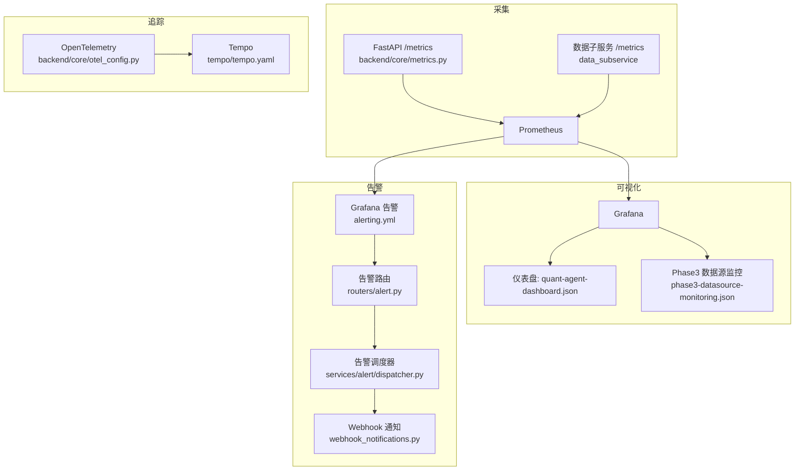
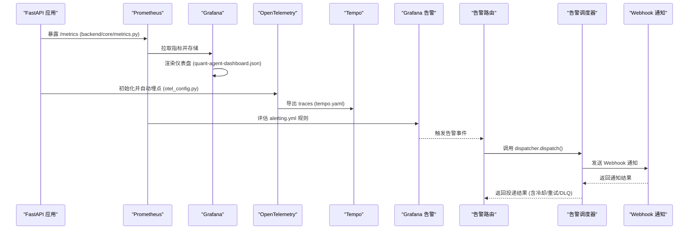
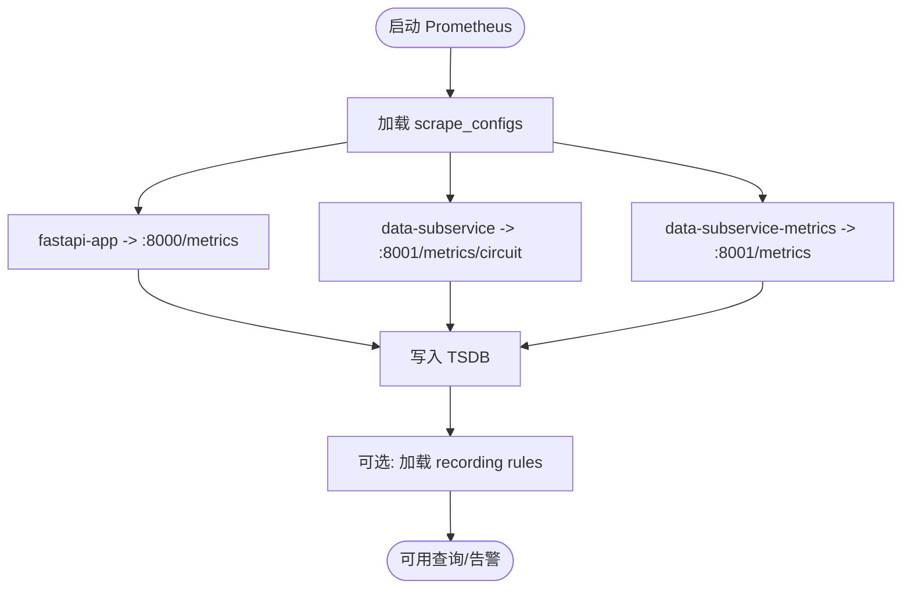
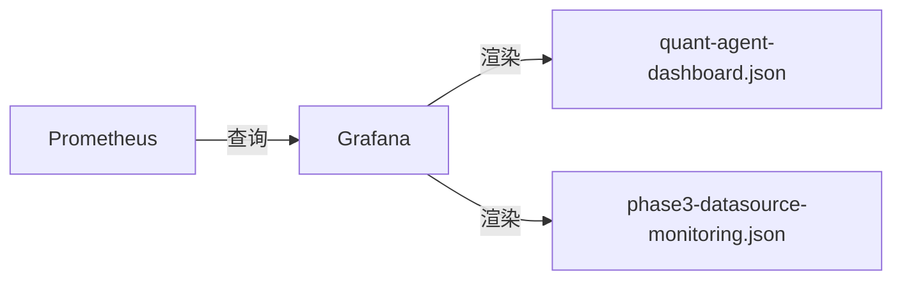
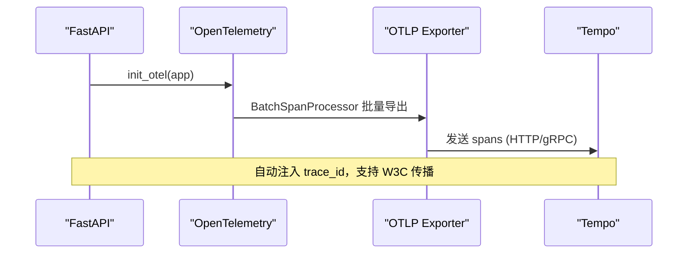
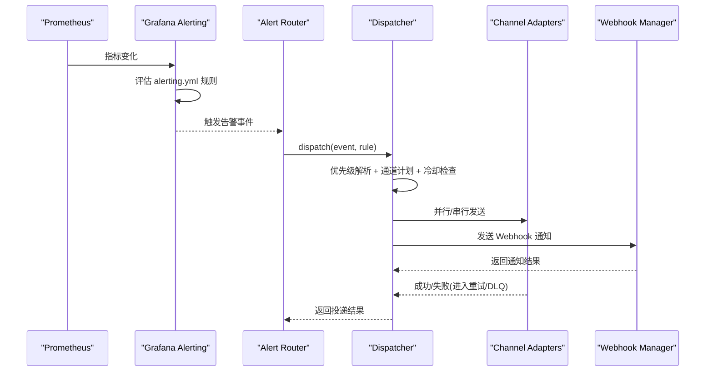
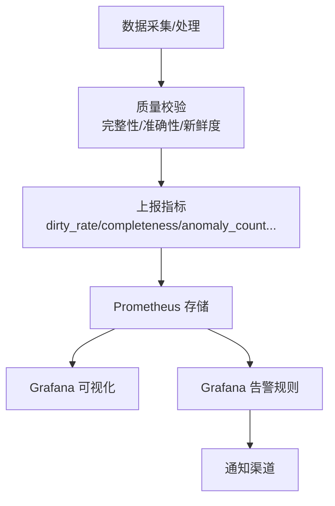
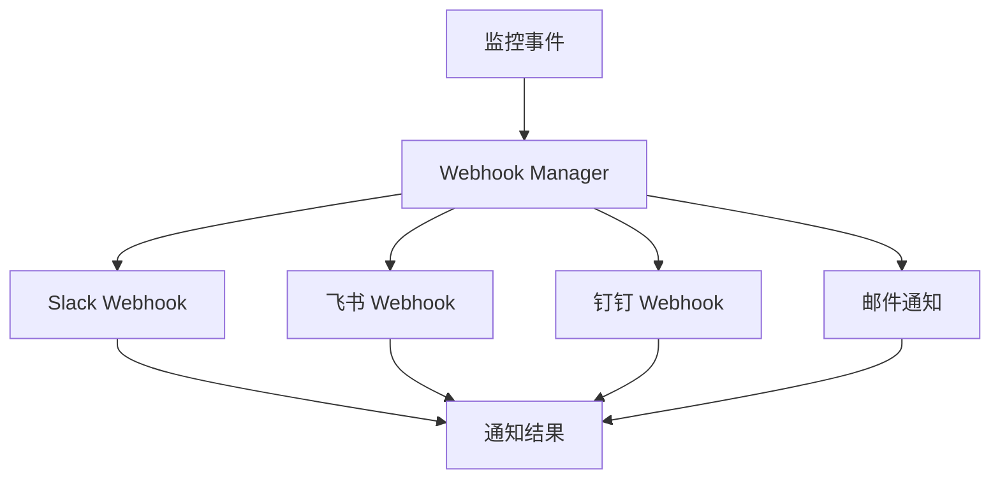
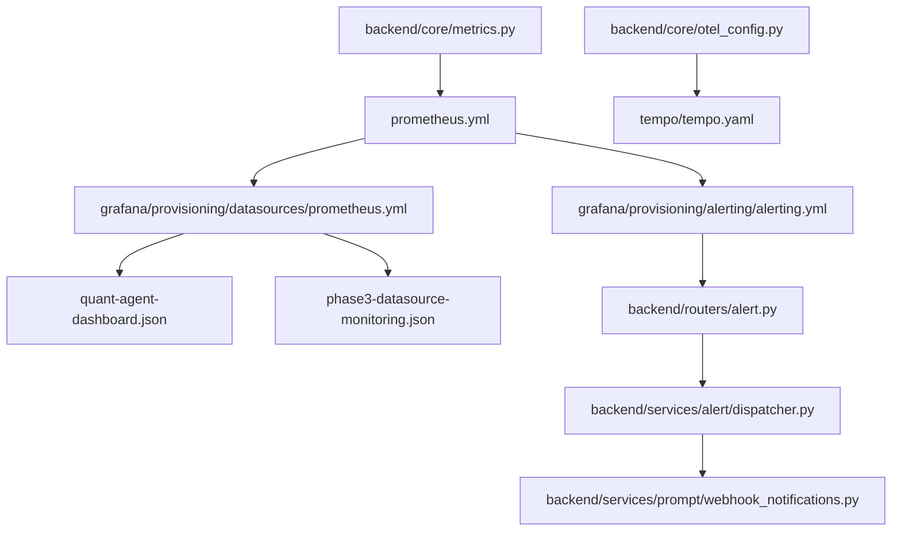

# 实时监控与告警

<cite>
**本文引用的文件**
- [prometheus.yml](file://prometheus.yml)
- [config/prometheus_rules.yml](file://config/prometheus_rules.yml)
- [backend/core/metrics.py](file://backend/core/metrics.py)
- [backend/core/otel_config.py](file://backend/core/otel_config.py)
- [grafana/provisioning/datasources/prometheus.yml](file://grafana/provisioning/datasources/prometheus.yml)
- [grafana/provisioning/alerting/alerting.yml](file://grafana/provisioning/alerting/alerting.yml)
- [tempo/tempo.yaml](file://tempo/tempo.yaml)
- [grafana/provisioning/dashboards/quant-agent-dashboard.json](file://grafana/provisioning/dashboards/quant-agent-dashboard.json)
- [grafana/provisioning/dashboards/phase3-datasource-monitoring.json](file://grafana/provisioning/dashboards/phase3-datasource-monitoring.json)
- [backend/routers/alert.py](file://backend/routers/alert.py)
- [backend/services/alert/dispatcher.py](file://backend/services/alert/dispatcher.py)
- [backend/services/prompt/webhook_notifications.py](file://backend/services/prompt/webhook_notifications.py)
- [scripts/test_phase3_monitoring.py](file://scripts/test_phase3_monitoring.py)
- [backend/tests/services/test_call_metrics_store.py](file://backend/tests/services/test_call_metrics_store.py)
</cite>

## 更新摘要
**变更内容**
- 新增 Webhook 通知系统，支持审批请求、部署事件和质量告警的可配置端点推送
- 扩展 Prometheus 指标导出器，包含质量评分、反馈统计、A/B 测试结果和性能计时测量
- 增强数据源监控能力，提供延迟分布、错误率趋势、限流热力图和可用性时间线
- 完善告警规则，支持更细粒度的数据质量和性能监控

## 目录
1. [简介](#简介)
2. [项目结构](#项目结构)
3. [核心组件](#核心组件)
4. [架构总览](#架构总览)
5. [详细组件分析](#详细组件分析)
6. [依赖关系分析](#依赖关系分析)
7. [性能考虑](#性能考虑)
8. [故障排查指南](#故障排查指南)
9. [结论](#结论)
10. [附录：配置示例与最佳实践](#附录：配置示例与最佳实践)

## 简介
本文件为 Quant Agent 的监控与告警系统提供完整可观测性方案说明，覆盖指标采集（Prometheus）、可视化（Grafana）、链路追踪（OpenTelemetry + Tempo），以及告警规则、数据质量监控、性能监控策略和运维最佳实践。目标是帮助运维团队快速搭建并稳定运行一套端到端的可观测性体系。

**更新** 新增了 Webhook 通知系统和增强的数据源监控能力，提供更全面的监控覆盖。

## 项目结构
Quant Agent 的可观测性由以下关键部分组成：
- 指标采集层：应用内通过 Prometheus Client 暴露 /metrics；Prometheus 按 job 抓取主服务与数据子服务指标。
- 可视化层：Grafana 预置数据源与仪表盘，展示 API 吞吐、延迟、客户端 APM、数据源健康等。
- 链路追踪层：OpenTelemetry 初始化 FastAPI/Redis/HTTP/SQLAlchemy 自动埋点，导出到 OTLP（Tempo）。
- 告警层：Grafana 内置告警规则，结合通知渠道（如飞书 Webhook）实现分级推送；内部告警引擎通过 WebSocket 实时推送事件。
- **新增** Webhook 通知系统：支持多平台通知（Slack、飞书、钉钉、邮件），用于审批请求、部署事件和质量告警。

**图表来源**
- [prometheus.yml:16-43](file://prometheus.yml#L16-L43)
- [backend/core/metrics.py:18-150](file://backend/core/metrics.py#L18-L150)
- [grafana/provisioning/datasources/prometheus.yml:1-10](file://grafana/provisioning/datasources/prometheus.yml#L1-L10)
- [grafana/provisioning/dashboards/quant-agent-dashboard.json:89-195](file://grafana/provisioning/dashboards/quant-agent-dashboard.json#L89-L195)
- [grafana/provisioning/dashboards/phase3-datasource-monitoring.json:1-200](file://grafana/provisioning/dashboards/phase3-datasource-monitoring.json#L1-L200)
- [backend/core/otel_config.py:220-302](file://backend/core/otel_config.py#L220-L302)
- [tempo/tempo.yaml:1-25](file://tempo/tempo.yaml#L1-L25)
- [grafana/provisioning/alerting/alerting.yml:60-120](file://grafana/provisioning/alerting/alerting.yml#L60-L120)
- [backend/routers/alert.py:51-132](file://backend/routers/alert.py#L51-L132)
- [backend/services/alert/dispatcher.py:357-461](file://backend/services/alert/dispatcher.py#L357-L461)
- [backend/services/prompt/webhook_notifications.py:253-366](file://backend/services/prompt/webhook_notifications.py#L253-L366)

**章节来源**
- [prometheus.yml:16-43](file://prometheus.yml#L16-L43)
- [grafana/provisioning/datasources/prometheus.yml:1-10](file://grafana/provisioning/datasources/prometheus.yml#L1-L10)
- [backend/core/metrics.py:18-150](file://backend/core/metrics.py#L18-L150)
- [backend/core/otel_config.py:220-302](file://backend/core/otel_config.py#L220-L302)
- [tempo/tempo.yaml:1-25](file://tempo/tempo.yaml#L1-L25)
- [grafana/provisioning/alerting/alerting.yml:60-120](file://grafana/provisioning/alerting/alerting.yml#L60-L120)
- [backend/routers/alert.py:51-132](file://backend/routers/alert.py#L51-L132)
- [backend/services/alert/dispatcher.py:357-461](file://backend/services/alert/dispatcher.py#L357-L461)
- [backend/services/prompt/webhook_notifications.py:253-366](file://backend/services/prompt/webhook_notifications.py#L253-L366)

## 核心组件
- 指标定义与采集：在 backend/core/metrics.py 中集中定义业务与系统指标（行情延迟、WebSocket 连接、Redis 队列深度、熔断器状态、客户端 APM、数据源探针、数据质量、分布式节点等），并通过 /metrics 暴露给 Prometheus。
- 抓取配置：prometheus.yml 定义 fastapi-app、data-subservice、data-subservice-metrics 三个 job，分别抓取主服务与子服务的不同指标路径。
- 可视化：Grafana 通过 provisioned datasources 指向 Prometheus，使用 quant-agent-dashboard.json 展示 QPS、P99/P95/P50 延迟、第三方 API 吞吐与延迟、客户端 Web Vitals 等。
- 链路追踪：backend/core/otel_config.py 初始化 TracerProvider，自动注入 trace_id，支持 OTLP 导出至 Tempo（tempo/tempo.yaml）。
- 告警规则：grafana/provisioning/alerting/alerting.yml 定义了 Futu 连接、API 延迟、Redis 内存、熔断器、数据源限流、数据质量、分布式节点等多类告警。
- 告警路由与推送：backend/routers/alert.py 提供 REST 与 WebSocket 接口；backend/services/alert/dispatcher.py 实现优先级解析、通道规划、冷却、重试与投递记录。
- **新增** Webhook 通知系统：支持 Slack、飞书、钉钉和邮件通知，用于新版本创建、低质量预警、用户反馈警告和周报推送。

**章节来源**
- [backend/core/metrics.py:18-150](file://backend/core/metrics.py#L18-L150)
- [prometheus.yml:16-43](file://prometheus.yml#L16-L43)
- [grafana/provisioning/dashboards/quant-agent-dashboard.json:89-195](file://grafana/provisioning/dashboards/quant-agent-dashboard.json#L89-L195)
- [backend/core/otel_config.py:220-302](file://backend/core/otel_config.py#L220-L302)
- [tempo/tempo.yaml:1-25](file://tempo/tempo.yaml#L1-L25)
- [grafana/provisioning/alerting/alerting.yml:60-120](file://grafana/provisioning/alerting/alerting.yml#L60-L120)
- [backend/routers/alert.py:51-132](file://backend/routers/alert.py#L51-L132)
- [backend/services/alert/dispatcher.py:357-461](file://backend/services/alert/dispatcher.py#L357-L461)
- [backend/services/prompt/webhook_notifications.py:253-366](file://backend/services/prompt/webhook_notifications.py#L253-L366)

## 架构总览
下图展示了从指标采集到可视化、告警与追踪的整体流程。

**图表来源**
- [backend/core/metrics.py:18-150](file://backend/core/metrics.py#L18-L150)
- [prometheus.yml:16-43](file://prometheus.yml#L16-L43)
- [grafana/provisioning/dashboards/quant-agent-dashboard.json:89-195](file://grafana/provisioning/dashboards/quant-agent-dashboard.json#L89-L195)
- [backend/core/otel_config.py:220-302](file://backend/core/otel_config.py#L220-L302)
- [tempo/tempo.yaml:1-25](file://tempo/tempo.yaml#L1-L25)
- [grafana/provisioning/alerting/alerting.yml:60-120](file://grafana/provisioning/alerting/alerting.yml#L60-L120)
- [backend/routers/alert.py:51-132](file://backend/routers/alert.py#L51-L132)
- [backend/services/alert/dispatcher.py:357-461](file://backend/services/alert/dispatcher.py#L357-L461)
- [backend/services/prompt/webhook_notifications.py:253-366](file://backend/services/prompt/webhook_notifications.py#L253-L366)

## 详细组件分析

### Prometheus 指标采集与抓取
- 指标定义：backend/core/metrics.py 集中定义行情、WebSocket、Redis、熔断器、客户端 APM、数据源探针、数据质量、分布式节点等指标类型（Counter/Gauge/Histogram/Summary）。
- 抓取目标：prometheus.yml 配置了 fastapi-app（主服务 8000）、data-subservice（子服务 8001，熔断面板 /metrics/circuit）、data-subservice-metrics（子服务业务指标 /metrics）。
- Recording Rules：config/prometheus_rules.yml 提供 FMP watchlist 突变检测的 server 端聚合规则（多副本场景下避免 Counter 放大），包括 delta、shift_flag、shift_total_1h、file_deleted_ratio_1h。

**图表来源**
- [prometheus.yml:16-43](file://prometheus.yml#L16-L43)
- [config/prometheus_rules.yml:53-95](file://config/prometheus_rules.yml#L53-L95)

**章节来源**
- [backend/core/metrics.py:18-150](file://backend/core/metrics.py#L18-L150)
- [prometheus.yml:16-43](file://prometheus.yml#L16-L43)
- [config/prometheus_rules.yml:53-95](file://config/prometheus_rules.yml#L53-L95)

### Grafana 可视化与仪表盘
- 数据源：grafana/provisioning/datasources/prometheus.yml 将 Prometheus 作为默认数据源。
- 仪表盘：quant-agent-dashboard.json 包含 API QPS、P99/P95/P50 延迟、第三方 API 吞吐与延迟、客户端心跳与 Web Vitals 等面板；phase3-datasource-monitoring.json 提供数据源专用监控面板。

**图表来源**
- [grafana/provisioning/datasources/prometheus.yml:1-10](file://grafana/provisioning/datasources/prometheus.yml#L1-L10)
- [grafana/provisioning/dashboards/quant-agent-dashboard.json:89-195](file://grafana/provisioning/dashboards/quant-agent-dashboard.json#L89-L195)
- [grafana/provisioning/dashboards/phase3-datasource-monitoring.json:1-200](file://grafana/provisioning/dashboards/phase3-datasource-monitoring.json#L1-L200)

**章节来源**
- [grafana/provisioning/datasources/prometheus.yml:1-10](file://grafana/provisioning/datasources/prometheus.yml#L1-L10)
- [grafana/provisioning/dashboards/quant-agent-dashboard.json:89-195](file://grafana/provisioning/dashboards/quant-agent-dashboard.json#L89-L195)
- [grafana/provisioning/dashboards/phase3-datasource-monitoring.json:1-200](file://grafana/provisioning/dashboards/phase3-datasource-monitoring.json#L1-L200)

### OpenTelemetry 链路追踪
- 初始化：backend/core/otel_config.py 根据环境变量启用/关闭 OTEL，设置采样率，创建 TracerProvider，并自动 instrument FastAPI、Logging、Redis、Requests、HTTPX、SQLAlchemy。
- 导出：可通过 OTLP HTTP/GRPC 导出到 Tempo（tempo/tempo.yaml），本地 WAL 与块存储用于 traces 持久化。

**图表来源**
- [backend/core/otel_config.py:220-302](file://backend/core/otel_config.py#L220-L302)
- [tempo/tempo.yaml:1-25](file://tempo/tempo.yaml#L1-L25)

**章节来源**
- [backend/core/otel_config.py:220-302](file://backend/core/otel_config.py#L220-L302)
- [tempo/tempo.yaml:1-25](file://tempo/tempo.yaml#L1-L25)

### 告警规则与通知
- 规则定义：grafana/provisioning/alerting/alerting.yml 定义了 Futu 连接断开、API P95 延迟过高、Redis 内存使用率、熔断器打开、数据源限流飙升/退避/配额耗尽/IP 封禁、数据质量脏数据率、分布式节点心跳超时/存活不足/断连/STALE 降级频率过高等规则。
- 通知渠道：contactPoints 配置飞书 Webhook，policies 按 severity 分组与重复间隔控制。
- 内部告警路由：backend/routers/alert.py 提供规则管理、事件查询、确认与 WebSocket 实时推送；backend/services/alert/dispatcher.py 实现优先级解析、通道计划、冷却门控、重试队列与投递记录。
- **新增** Webhook 通知系统：支持多平台通知（Slack、飞书、钉钉、邮件），用于新版本创建、低质量预警、用户反馈警告和周报推送。

**图表来源**
- [grafana/provisioning/alerting/alerting.yml:60-120](file://grafana/provisioning/alerting/alerting.yml#L60-L120)
- [backend/routers/alert.py:51-132](file://backend/routers/alert.py#L51-L132)
- [backend/services/alert/dispatcher.py:357-461](file://backend/services/alert/dispatcher.py#L357-L461)
- [backend/services/prompt/webhook_notifications.py:253-366](file://backend/services/prompt/webhook_notifications.py#L253-L366)

**章节来源**
- [grafana/provisioning/alerting/alerting.yml:60-120](file://grafana/provisioning/alerting/alerting.yml#L60-L120)
- [backend/routers/alert.py:51-132](file://backend/routers/alert.py#L51-L132)
- [backend/services/alert/dispatcher.py:357-461](file://backend/services/alert/dispatcher.py#L357-L461)
- [backend/services/prompt/webhook_notifications.py:253-366](file://backend/services/prompt/webhook_notifications.py#L253-L366)

### 数据质量监控方案
- 指标定义：backend/core/metrics.py 提供脏数据率、字段完整率、累计校验记录数、异常计数、缺失字段、价格异常、时间戳过期、平均延迟、质量等级、校验次数等指标。
- 告警规则：alerting.yml 中的"数据质量脏数据率过高"基于 quant_data_quality_dirty_rate 阈值触发。
- 看板：Grafana 仪表盘可接入上述指标进行可视化（例如 Data Quality DQ-04 相关面板）。
- **新增** 数据源监控：phase3-datasource-monitoring.json 提供延迟分布、错误率趋势、限流热力图和可用性时间线等高级监控面板。

**图表来源**
- [backend/core/metrics.py:386-444](file://backend/core/metrics.py#L386-L444)
- [grafana/provisioning/alerting/alerting.yml:292-319](file://grafana/provisioning/alerting/alerting.yml#L292-319)
- [grafana/provisioning/dashboards/phase3-datasource-monitoring.json:1-200](file://grafana/provisioning/dashboards/phase3-datasource-monitoring.json#L1-L200)

**章节来源**
- [backend/core/metrics.py:386-444](file://backend/core/metrics.py#L386-L444)
- [grafana/provisioning/alerting/alerting.yml:292-319](file://grafana/provisioning/alerting/alerting.yml#L292-319)
- [grafana/provisioning/dashboards/phase3-datasource-monitoring.json:1-200](file://grafana/provisioning/dashboards/phase3-datasource-monitoring.json#L1-L200)

### 性能监控策略
- API 响应时间：dashboard 展示 P99/P95/P50 延迟，alerting.yml 对 P95 > 2s 触发 critical。
- 数据库查询性能：通过 SQLAlchemyInstrumentor 自动埋点 SQL 执行 span，可在 Tempo 中查看慢查询链路。
- 内存使用情况：alerting.yml 对 Redis 内存使用率 > 80% 触发 warning。
- 数据源性能：dashboard 展示第三方 API 吞吐与 P95 延迟；metrics 中 DATASOURCE_LATENCY、DATASOURCE_PROBE_LATENCY 等指标可用于细粒度分析。
- **新增** 数据源监控：提供延迟分布直方图、错误率趋势图、限流热力图和可用性时间线等高级监控能力。

**章节来源**
- [grafana/provisioning/dashboards/quant-agent-dashboard.json:181-379](file://grafana/provisioning/dashboards/quant-agent-dashboard.json#L181-L379)
- [grafana/provisioning/alerting/alerting.yml:94-149](file://grafana/provisioning/alerting/alerting.yml#L94-L149)
- [backend/core/otel_config.py:288-295](file://backend/core/otel_config.py#L288-L295)
- [backend/core/metrics.py:156-203](file://backend/core/metrics.py#L156-L203)
- [grafana/provisioning/dashboards/phase3-datasource-monitoring.json:1-200](file://grafana/provisioning/dashboards/phase3-datasource-monitoring.json#L1-L200)

### Webhook 通知系统
- **新增** 统一 Webhook 管理器：支持 Slack、飞书、钉钉和邮件通知，提供版本创建、低质量预警、用户反馈警告和周报推送功能。
- 配置管理：通过环境变量配置各平台的 Webhook URL 和认证信息。
- 消息格式：针对不同平台定制消息格式，确保最佳显示效果。
- 错误处理：内置重试机制和错误日志，确保通知可靠性。

**图表来源**
- [backend/services/prompt/webhook_notifications.py:253-366](file://backend/services/prompt/webhook_notifications.py#L253-L366)

**章节来源**
- [backend/services/prompt/webhook_notifications.py:253-366](file://backend/services/prompt/webhook_notifications.py#L253-L366)

## 依赖关系分析
- 采集依赖：应用依赖 prometheus_client 暴露指标；Prometheus 依赖 scrape_configs 正确配置 targets 与 metrics_path。
- 可视化依赖：Grafana 依赖 Prometheus 数据源与 dashboard JSON。
- 追踪依赖：应用依赖 opentelemetry SDK 与 instrumentors；Tempo 依赖 OTLP 接收器与本地存储。
- 告警依赖：Grafana 依赖 alerting.yml 规则与 contactPoints；内部告警依赖 Redis PubSub 与适配器注册。
- **新增** Webhook 依赖：通知系统依赖 httpx 库和各平台 Webhook API。

**图表来源**
- [backend/core/metrics.py:18-150](file://backend/core/metrics.py#L18-L150)
- [prometheus.yml:16-43](file://prometheus.yml#L16-L43)
- [grafana/provisioning/datasources/prometheus.yml:1-10](file://grafana/provisioning/datasources/prometheus.yml#L1-L10)
- [grafana/provisioning/dashboards/quant-agent-dashboard.json:89-195](file://grafana/provisioning/dashboards/quant-agent-dashboard.json#L89-L195)
- [grafana/provisioning/dashboards/phase3-datasource-monitoring.json:1-200](file://grafana/provisioning/dashboards/phase3-datasource-monitoring.json#L1-L200)
- [backend/core/otel_config.py:220-302](file://backend/core/otel_config.py#L220-L302)
- [tempo/tempo.yaml:1-25](file://tempo/tempo.yaml#L1-L25)
- [grafana/provisioning/alerting/alerting.yml:60-120](file://grafana/provisioning/alerting/alerting.yml#L60-L120)
- [backend/routers/alert.py:51-132](file://backend/routers/alert.py#L51-L132)
- [backend/services/alert/dispatcher.py:357-461](file://backend/services/alert/dispatcher.py#L357-L461)
- [backend/services/prompt/webhook_notifications.py:253-366](file://backend/services/prompt/webhook_notifications.py#L253-L366)

**章节来源**
- [backend/core/metrics.py:18-150](file://backend/core/metrics.py#L18-L150)
- [prometheus.yml:16-43](file://prometheus.yml#L16-L43)
- [grafana/provisioning/datasources/prometheus.yml:1-10](file://grafana/provisioning/datasources/prometheus.yml#L1-L10)
- [grafana/provisioning/dashboards/quant-agent-dashboard.json:89-195](file://grafana/provisioning/dashboards/quant-agent-dashboard.json#L89-L195)
- [grafana/provisioning/dashboards/phase3-datasource-monitoring.json:1-200](file://grafana/provisioning/dashboards/phase3-datasource-monitoring.json#L1-L200)
- [backend/core/otel_config.py:220-302](file://backend/core/otel_config.py#L220-L302)
- [tempo/tempo.yaml:1-25](file://tempo/tempo.yaml#L1-L25)
- [grafana/provisioning/alerting/alerting.yml:60-120](file://grafana/provisioning/alerting/alerting.yml#L60-L120)
- [backend/routers/alert.py:51-132](file://backend/routers/alert.py#L51-L132)
- [backend/services/alert/dispatcher.py:357-461](file://backend/services/alert/dispatcher.py#L357-L461)
- [backend/services/prompt/webhook_notifications.py:253-366](file://backend/services/prompt/webhook_notifications.py#L253-L366)

## 性能考虑
- 指标粒度与采样：Histogram/Summary 的 buckets 需覆盖典型延迟区间；客户端 Web Vitals 与 LLM Token 使用等指标应合理分桶以避免过度细分导致查询开销。
- 抓取频率：fastapi-app 设置为 5s 抓取以提升实时性；子服务 15s 抓取以平衡负载。
- 告警抑制：dispatcher 的冷却门控与重试队列减少告警风暴与无效重试。
- 追踪开销：OTEL 采样率可按环境调整；生产建议开启采样并仅导出关键链路。
- **新增** Webhook 性能：通知系统采用异步发送和连接池优化，避免阻塞主业务流程。

[本节为通用指导，不直接分析具体文件]

## 故障排查指南
- 指标不可见：检查 prometheus.yml 的 targets 与 metrics_path；确认应用已暴露 /metrics。
- 告警未触发：核对 alerting.yml 的 expr 与阈值；确认指标名称与标签匹配。
- 追踪丢失：检查 OTEL_ENABLED、OTEL_EXPORTER_OTLP_ENDPOINT 与 exporter 可用性；确认 FastAPI 已 instrumented。
- 通知失败：检查 contactPoints 的 Webhook URL 与签名；查看 DLQ 与重试记录定位失败原因。
- 数据质量问题：关注 dirty_rate、completeness、anomaly_count 等指标；结合 dashboard 定位异常源。
- **新增** Webhook 问题：检查环境变量配置、网络连通性和平台 API 限制；查看通知系统的错误日志。

**章节来源**
- [prometheus.yml:16-43](file://prometheus.yml#L16-L43)
- [grafana/provisioning/alerting/alerting.yml:60-120](file://grafana/provisioning/alerting/alerting.yml#L60-L120)
- [backend/core/otel_config.py:220-302](file://backend/core/otel_config.py#L220-L302)
- [backend/services/alert/dispatcher.py:279-350](file://backend/services/alert/dispatcher.py#L279-L350)
- [backend/core/metrics.py:386-444](file://backend/core/metrics.py#L386-L444)
- [backend/services/prompt/webhook_notifications.py:253-366](file://backend/services/prompt/webhook_notifications.py#L253-L366)

## 结论
本方案通过 Prometheus 指标采集、Grafana 可视化与告警、OpenTelemetry 链路追踪，构建了覆盖业务、系统与数据质量的完整可观测性体系。配合合理的告警规则与通知渠道，能够快速发现并定位问题，保障交易与数据服务的稳定性与可靠性。

**更新** 新增的 Webhook 通知系统和增强的数据源监控能力进一步提升了系统的可观测性和运维效率。

[本节为总结，不直接分析具体文件]

## 附录：配置示例与最佳实践
- 仪表盘配置
  - 在 Grafana 中导入 quant-agent-dashboard.json 和 phase3-datasource-monitoring.json，确保 Prometheus 数据源已配置。
  - 参考面板表达式：API QPS、P99/P95/P50 延迟、第三方 API 吞吐与延迟、客户端 Web Vitals、数据源延迟分布等。
- 告警规则配置
  - 编辑 alerting.yml，按业务需求调整阈值与重复间隔；配置 contactPoints 的 Webhook URL。
  - 针对数据源限流与数据质量设置分级告警，避免告警风暴。
- 通知渠道集成
  - 在 contactPoints 中配置飞书 Webhook；如需签名校验，通过 secureSettings 配置 secret。
  - 内部告警通过 WebSocket 实时推送，前端可使用 since 参数补拉历史事件。
  - **新增** Webhook 配置：通过环境变量配置各平台 Webhook URL（SLACK_WEBHOOK_URL、FEISHU_WEBHOOK_URL、DINGTALK_WEBHOOK_URL、SMTP_*）。
- 性能监控策略
  - 使用 Histogram 与 Summary 监控 API 与数据源延迟；结合 dashboard 观察 P95/P99。
  - 通过 SQLAlchemyInstrumentor 追踪慢查询；结合 Tempo 分析链路瓶颈。
  - 监控 Redis 内存使用率，设置阈值告警。
  - **新增** 数据源监控：利用 phase3 监控面板分析延迟分布、错误率趋势、限流情况和可用性。
- 运维最佳实践
  - 定期审查告警规则有效性，避免误报与漏报。
  - 使用 recording rules 在多副本场景统一计算，避免指标放大。
  - 对关键链路启用 OTEL 追踪，合理设置采样率。
  - 建立告警事件归档与复盘机制，持续优化规则与阈值。
  - **新增** Webhook 监控：定期检查通知系统的健康状态和成功率，配置适当的重试和降级策略。

**章节来源**
- [grafana/provisioning/dashboards/quant-agent-dashboard.json:89-195](file://grafana/provisioning/dashboards/quant-agent-dashboard.json#L89-L195)
- [grafana/provisioning/dashboards/phase3-datasource-monitoring.json:1-200](file://grafana/provisioning/dashboards/phase3-datasource-monitoring.json#L1-L200)
- [grafana/provisioning/alerting/alerting.yml:60-120](file://grafana/provisioning/alerting/alerting.yml#L60-L120)
- [backend/routers/alert.py:148-211](file://backend/routers/alert.py#L148-L211)
- [backend/core/metrics.py:156-203](file://backend/core/metrics.py#L156-L203)
- [backend/core/otel_config.py:288-295](file://backend/core/otel_config.py#L288-L295)
- [config/prometheus_rules.yml:53-95](file://config/prometheus_rules.yml#L53-L95)
- [backend/services/prompt/webhook_notifications.py:253-366](file://backend/services/prompt/webhook_notifications.py#L253-L366)