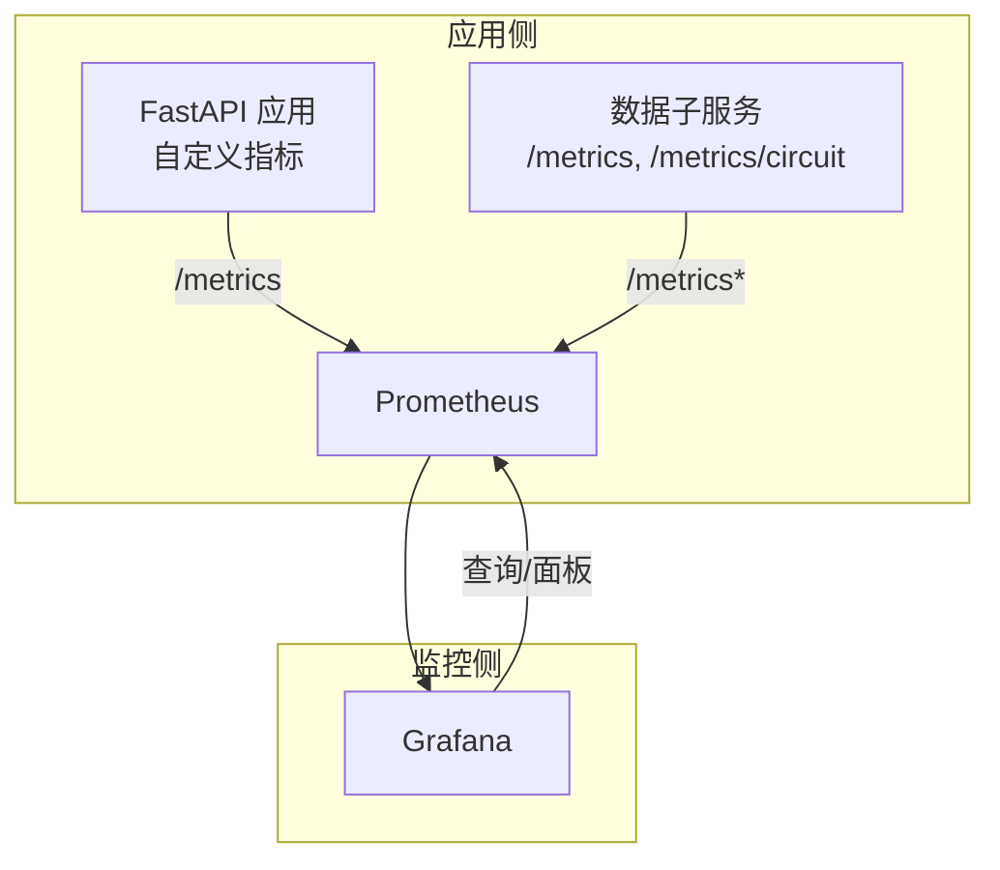
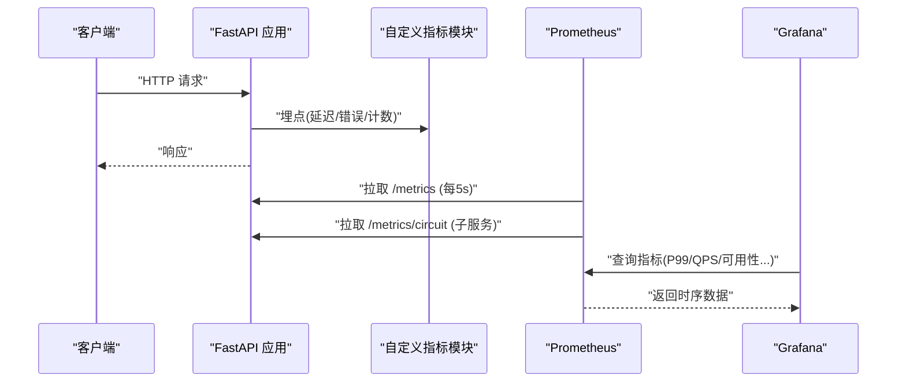
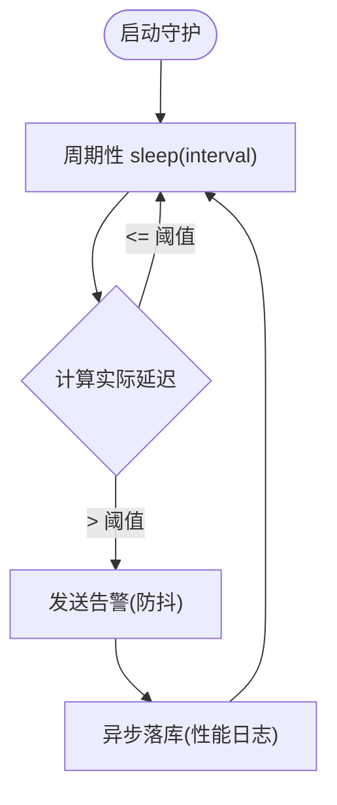
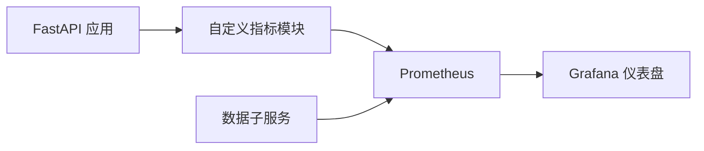

# 性能监控

<cite>
**本文引用的文件**
- [backend/core/metrics.py](file://backend/core/metrics.py)
- [backend/workers/monitor/system_monitor.py](file://backend/workers/monitor/system_monitor.py)
- [prometheus.yml](file://prometheus.yml)
- [grafana/provisioning/datasources/prometheus.yml](file://grafana/provisioning/datasources/prometheus.yml)
- [grafana/provisioning/dashboards/quant-agent-dashboard.json](file://grafana/provisioning/dashboards/quant-agent-dashboard.json)
- [config/prometheus_rules.yml](file://config/prometheus_rules.yml)
- [backend/domain/performance.py](file://backend/domain/performance.py)
</cite>

## 目录
1. [简介](#简介)
2. [项目结构](#项目结构)
3. [核心组件](#核心组件)
4. [架构总览](#架构总览)
5. [详细组件分析](#详细组件分析)
6. [依赖关系分析](#依赖关系分析)
7. [性能考量](#性能考量)
8. [故障排查指南](#故障排查指南)
9. [结论](#结论)
10. [附录](#附录)

## 简介
本文件为 Quant Agent 的性能监控方案提供系统化说明，覆盖 API 响应时间、数据库查询、内存与 CPU 使用率等关键指标；给出慢查询、内存泄漏、线程池等瓶颈识别方法；并提供 Prometheus/Grafana 使用指南、优化最佳实践以及压测与基准测试建议。目标是帮助团队持续发现并改进系统性能问题。

## 项目结构
Quant Agent 在“采集—存储—可视化”三层实现性能监控：
- 采集层：后端通过自定义指标模块暴露 Prometheus 指标；系统监控守护进程捕获事件循环阻塞并落盘；数据子服务暴露独立指标端点。
- 存储层：Prometheus 按 job 抓取主服务与子服务指标，支持记录规则（预留）。
- 可视化层：Grafana 预置数据源与仪表盘，展示 QPS、P99 延迟、数据源健康、缓存命中等视图。

图表来源
- [prometheus.yml:16-43](file://prometheus.yml#L16-L43)
- [grafana/provisioning/datasources/prometheus.yml:1-10](file://grafana/provisioning/datasources/prometheus.yml#L1-L10)

章节来源
- [prometheus.yml:1-43](file://prometheus.yml#L1-L43)
- [grafana/provisioning/datasources/prometheus.yml:1-10](file://grafana/provisioning/datasources/prometheus.yml#L1-L10)

## 核心组件
- 自定义指标定义：集中定义行情、WebSocket、Redis、熔断器、数据源、Agent/LLM、K线缓存、数据质量、分布式节点、FMP 业务编排、进程线程水位、网页抓取等指标类型与标签维度。
- 系统监控守护：后台高频探针检测事件循环阻塞，触发告警并异步落库。
- Prometheus 抓取配置：定义 fastapi-app、data-subservice、data-subservice-metrics 三个 job，分别抓取主服务与子服务指标。
- Grafana 数据源与仪表盘：预置 Prometheus 数据源与量化代理仪表盘，包含 QPS、P99 延迟等面板。

章节来源
- [backend/core/metrics.py:18-641](file://backend/core/metrics.py#L18-L641)
- [backend/workers/monitor/system_monitor.py:10-79](file://backend/workers/monitor/system_monitor.py#L10-L79)
- [prometheus.yml:16-43](file://prometheus.yml#L16-L43)
- [grafana/provisioning/datasources/prometheus.yml:1-10](file://grafana/provisioning/datasources/prometheus.yml#L1-L10)
- [grafana/provisioning/dashboards/quant-agent-dashboard.json:1-200](file://grafana/provisioning/dashboards/quant-agent-dashboard.json#L1-L200)

## 架构总览
下图展示了从请求进入 FastAPI 到指标上报、Prometheus 抓取、Grafana 可视化的完整链路，同时体现数据子服务的独立指标暴露。

图表来源
- [backend/core/metrics.py:18-641](file://backend/core/metrics.py#L18-L641)
- [prometheus.yml:16-43](file://prometheus.yml#L16-L43)
- [grafana/provisioning/dashboards/quant-agent-dashboard.json:89-195](file://grafana/provisioning/dashboards/quant-agent-dashboard.json#L89-L195)

## 详细组件分析

### 指标体系与埋点规范
- 指标类型选择
  - Summary/Histogram：用于延迟分布（如行情快照、K线获取、Redis 操作、LLM 请求、重连耗时、K线缓存查询），便于计算分位数。
  - Gauge：用于瞬时状态（连接数、队列深度、可用性、线程数、退避剩余秒数、最新快照年龄等）。
  - Counter：用于累计计数（消息发送、错误总数、限流次数、拨测次数、Token 消耗、缓存命中/未命中等）。
- 标签设计原则
  - 区分来源与对象：source/symbol/model/action/tier/node_id 等，确保可下钻分析。
  - 控制基数：避免高基数字段导致指标爆炸。
- 关键指标分组
  - 行情与 K 线：延迟、陈旧度、总量、缓存命中与查询延迟。
  - WebSocket：活跃连接、消息发送/丢弃、订阅数。
  - Redis：队列深度、操作延迟、错误计数。
  - 熔断器：状态与转换次数。
  - 数据源：延迟直方图、错误、限流、可用性、主动拨测成功率/延迟/失败原因。
  - Facade 聚合：融合调用次数、报价偏差告警。
  - Agent/LLM：请求延迟、Token 用量、工具调用统计。
  - Futu 连接：连接状态、重连次数与耗时。
  - 数据质量：脏数据率、完整率、异常计数、字段缺失、价格异常、过期、平均延迟、质量等级、校验次数。
  - 分布式节点：心跳、状态、存活数、YF/AKShare 降级计数。
  - Finnhub WS 实时价：tick 缓存命中/未命中与命中率。
  - FMP 业务编排：批次执行、标的缓存写入、失败原因、批次耗时、最后完成时间、watchlist 大小与空池告警、子服务不可达。
  - 进程线程水位：当前线程数与告警阈值。
  - WebScrape：抓取尝试与失败原因。

章节来源
- [backend/core/metrics.py:18-641](file://backend/core/metrics.py#L18-L641)

### 系统监控守护（事件循环阻塞检测）
- 功能要点
  - 高频心跳探针测量 asyncio 事件循环的阻塞时长。
  - 超过阈值的阻塞会触发通知并异步落库，避免阻塞主循环。
  - 具备防抖机制，降低告警风暴。
- 适用场景
  - 定位同步代码阻塞导致的整体延迟飙升。
  - 结合日志与指标进行根因定位。

图表来源
- [backend/workers/monitor/system_monitor.py:40-75](file://backend/workers/monitor/system_monitor.py#L40-L75)

章节来源
- [backend/workers/monitor/system_monitor.py:10-79](file://backend/workers/monitor/system_monitor.py#L10-L79)

### Prometheus 抓取配置
- Job 划分
  - fastapi-app：主服务指标，5 秒抓取间隔，basic_auth 保护。
  - data-subservice：子服务熔断面板专用端点 /metrics/circuit。
  - data-subservice-metrics：子服务业务指标 /metrics（FMP_* 系列）。
- 目标管理
  - 兼容容器与宿主机地址，支持多节点 Tailscale 域名。
- 扩展点
  - 预留 recording rules 挂载点，未来可统一计算复杂表达式。

章节来源
- [prometheus.yml:1-43](file://prometheus.yml#L1-L43)
- [config/prometheus_rules.yml:1-200](file://config/prometheus_rules.yml#L1-L200)

### Grafana 数据源与仪表盘
- 数据源
  - 预置 Prometheus 数据源，访问模式为 proxy。
- 仪表盘
  - 已包含 API QPS、P99 延迟等面板，基于 FastAPI 内置指标。
  - 可通过新增面板接入自定义指标（行情、Redis、数据源、FMP 等）。

章节来源
- [grafana/provisioning/datasources/prometheus.yml:1-10](file://grafana/provisioning/datasources/prometheus.yml#L1-L10)
- [grafana/provisioning/dashboards/quant-agent-dashboard.json:89-195](file://grafana/provisioning/dashboards/quant-agent-dashboard.json#L89-L195)

## 依赖关系分析
- 指标定义与应用解耦：指标模块仅负责声明与更新，业务逻辑通过埋点调用，便于复用与测试。
- 监控与业务低耦合：Prometheus 通过 HTTP 拉取，不侵入业务主流程。
- 可视化与指标稳定：Grafana 面板基于标准指标命名约定，便于迁移与扩展。

图表来源
- [backend/core/metrics.py:18-641](file://backend/core/metrics.py#L18-L641)
- [prometheus.yml:16-43](file://prometheus.yml#L16-L43)
- [grafana/provisioning/dashboards/quant-agent-dashboard.json:89-195](file://grafana/provisioning/dashboards/quant-agent-dashboard.json#L89-L195)

## 性能考量
- 指标粒度与开销
  - 优先使用 Histogram/Summary 表达延迟分布，减少客户端计算成本。
  - 控制标签基数，避免高基数导致存储与查询压力。
- 采集频率
  - 主服务 5 秒抓取，子服务 15 秒，平衡实时性与负载。
- 告警与防抖
  - 事件循环阻塞告警具备防抖，避免告警风暴。
- 数据质量与可用性
  - 通过数据质量指标（脏数据率、完整率、异常计数）与数据源可用性指标联动，保障下游决策可靠性。
- 缓存与降级
  - K 线缓存命中与查询延迟指标可指导缓存策略优化；WS 消息丢弃指标反映背压情况。

[本节为通用指导，无需具体文件引用]

## 故障排查指南
- 事件循环阻塞
  - 现象：P99 延迟突增、QPS 下降。
  - 排查：查看系统监控守护记录的 event_loop_block 日志；检查是否有同步阻塞代码。
  - 参考：事件循环阻塞检测与落盘流程。
- 数据源不稳定
  - 现象：可用性下降、错误/限流上升、拨测失败增多。
  - 排查：观察 DATASOURCE_AVAILABILITY、DATASOURCE_ERRORS、DATASOURCE_RATE_LIMITS、DATASOURCE_PROBE_* 指标；结合错误类型下钻。
- 缓存命中率低
  - 现象：K 线查询延迟升高。
  - 排查：关注 KLINE_CACHE_HIT 与 KLINE_CACHE_QUERY_LATENCY，评估缓存策略与 TTL。
- WebSocket 背压
  - 现象：WS_MESSAGES_DROPPED 上升。
  - 排查：检查订阅量与消费者处理速度，必要时限流或扩容。
- 数据质量劣化
  - 现象：脏数据率、价格异常、字段缺失上升。
  - 排查：结合 DATA_QUALITY_* 指标与数据源维度定位异常源。

章节来源
- [backend/workers/monitor/system_monitor.py:40-75](file://backend/workers/monitor/system_monitor.py#L40-L75)
- [backend/core/metrics.py:150-641](file://backend/core/metrics.py#L150-L641)

## 结论
Quant Agent 通过标准化的指标体系、稳定的采集链路和直观的可视化能力，形成了闭环的性能监控体系。借助系统监控守护与数据源拨测，能够快速发现事件循环阻塞与外部依赖异常；通过多维度指标下钻，可精准定位瓶颈并进行针对性优化。配合合理的缓存、索引与网络优化策略，以及持续的压测与基准测试，可持续提升系统性能与稳定性。

## 附录

### 常用 Prometheus 查询示例
- API QPS（按端点）
  - sum(rate(fastapi_requests_total[5m])) by (endpoint)
- API P99 延迟（按端点）
  - histogram_quantile(0.99, sum(rate(fastapi_request_duration_seconds_bucket[5m])) by (le, endpoint))
- 数据源可用性
  - quant_datasource_availability{source="..."}
- 数据源错误率
  - sum(rate(quant_datasource_errors_total[5m])) by (source,error_type)
- K 线缓存命中率
  - sum(rate(quant_kline_cache_hit_total{tier="redis"}[5m])) / (sum(rate(quant_kline_cache_hit_total[5m])))
- 进程线程数
  - quant_process_thread_count

[本节为概念性内容，无需具体文件引用]

### 性能优化最佳实践
- 缓存策略优化
  - 利用 K 线缓存命中与查询延迟指标，调整 TTL 与分层缓存（Redis/Parquet）。
- 数据库索引优化
  - 结合慢查询日志与查询延迟指标，针对热点查询添加合适索引，减少全表扫描。
- 网络请求优化
  - 对数据源请求增加重试与退避，结合限流与熔断指标，避免雪崩。
- 线程与并发
  - 监控进程线程数与事件循环阻塞，避免同步阻塞代码；合理设置 worker 数量与连接池大小。

[本节为通用指导，无需具体文件引用]

### 基准测试与压测方案
- 压测工具
  - 可使用 Locust 等工具模拟高并发请求，观察 QPS、P99、错误率与资源使用。
- 基准指标
  - 以 P95/P99 延迟、吞吐、错误率为核心指标，建立基线与回归阈值。
- 压测环境
  - 隔离环境与生产一致的配置与数据规模，确保结果可信。
- 持续集成
  - 将压测纳入 CI，版本发布前自动验证性能是否退化。

[本节为通用指导，无需具体文件引用]

### 回测与绩效指标
- 共享绩效函数
  - Sharpe、最大回撤、年化收益、波动率、胜率、跟踪误差、超额收益序列、累计收益率、信号一致率等，可用于策略评估与报告生成。

章节来源
- [backend/domain/performance.py:14-177](file://backend/domain/performance.py#L14-L177)
