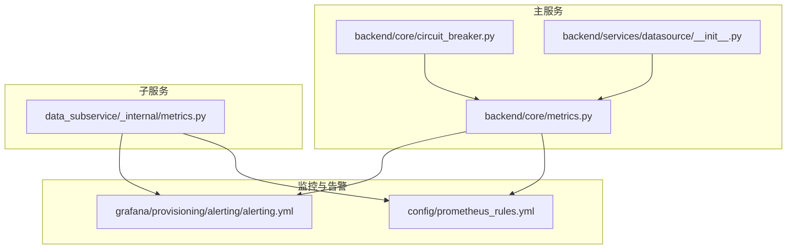
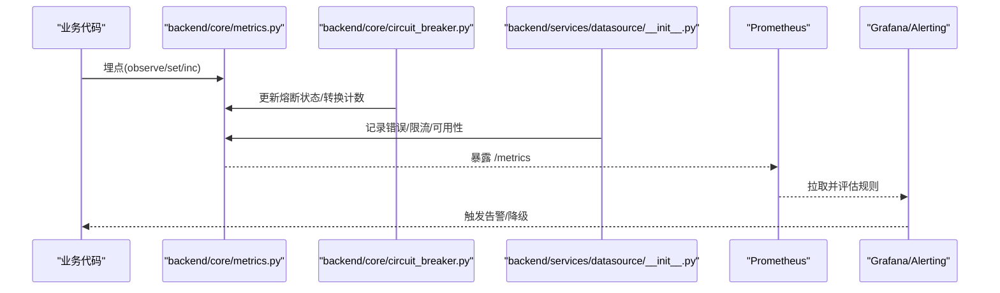
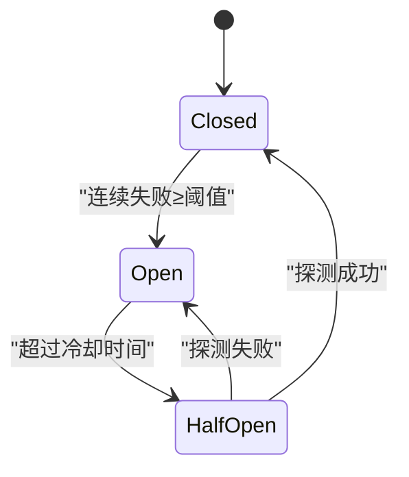

# 业务指标定义

<cite>
**本文引用的文件**
- [backend/core/metrics.py](file://backend/core/metrics.py)
- [data_subservice/_internal/metrics.py](file://data_subservice/_internal/metrics.py)
- [backend/core/circuit_breaker.py](file://backend/core/circuit_breaker.py)
- [config/prometheus_rules.yml](file://config/prometheus_rules.yml)
- [grafana/provisioning/alerting/alerting.yml](file://grafana/provisioning/alerting/alerting.yml)
- [backend/services/datasource/__init__.py](file://backend/services/datasource/__init__.py)
</cite>

## 目录
1. [简介](#简介)
2. [项目结构](#项目结构)
3. [核心组件](#核心组件)
4. [架构总览](#架构总览)
5. [详细组件分析](#详细组件分析)
6. [依赖关系分析](#依赖关系分析)
7. [性能考量](#性能考量)
8. [故障排查指南](#故障排查指南)
9. [结论](#结论)
10. [附录](#附录)

## 简介
本文件为 Quant Agent 的业务指标体系提供权威定义与使用规范，覆盖行情延迟、K线获取延迟、数据源可用性、熔断器状态等关键指标。文档明确命名规范、标签设计、取值范围，并给出在业务代码中埋点上报的最佳实践（Counter/Gauge/Histogram/Summary 的选择原则），以及指标与监控告警的关联方式，帮助通过指标快速定位和评估系统健康状态。

## 项目结构
Quant Agent 的指标体系由两部分组成：
- 主服务指标：位于 backend/core/metrics.py，集中定义所有业务与系统级指标，供后端各模块埋点使用。
- 子服务指标：位于 data_subservice/_internal/metrics.py，独立 registry，暴露 /metrics 供主服务 scrape，聚焦 FMP 数据源连接层指标。

图表来源
- [backend/core/metrics.py:1-641](file://backend/core/metrics.py#L1-L641)
- [data_subservice/_internal/metrics.py:1-69](file://data_subservice/_internal/metrics.py#L1-L69)
- [backend/core/circuit_breaker.py:1-379](file://backend/core/circuit_breaker.py#L1-L379)
- [config/prometheus_rules.yml:1-95](file://config/prometheus_rules.yml#L1-L95)
- [grafana/provisioning/alerting/alerting.yml:1-463](file://grafana/provisioning/alerting/alerting.yml#L1-L463)

章节来源
- [backend/core/metrics.py:1-641](file://backend/core/metrics.py#L1-L641)
- [data_subservice/_internal/metrics.py:1-69](file://data_subservice/_internal/metrics.py#L1-L69)

## 核心组件
本节聚焦四类核心业务指标的定义、用途与使用要点。

- 行情延迟指标 MARKET_QUOTE_LATENCY
  - 类型：Summary
  - 名称：quant_market_quote_latency_seconds
  - 标签：source, symbol
  - 含义：从数据源到 Redis 写入的全链路耗时（秒）
  - 用途：观测实时报价端到端延迟分布，支撑 P95/P99 告警与容量规划
  - 取值范围：非负秒数；建议按 source/symbol 维度分桶观察

- K线获取延迟 MARKET_KLINE_FETCH_LATENCY
  - 类型：Histogram
  - 名称：quant_market_kline_fetch_seconds
  - 标签：source, period
  - 含义：K线数据获取延迟（含三级缓存命中路径）
  - 用途：评估缓存命中率与后端读取性能，优化查询路径
  - 取值范围：非负秒数；内置多档桶以覆盖毫秒至秒级

- 数据源可用性 DATASOURCE_AVAILABILITY
  - 类型：Gauge
  - 名称：quant_datasource_availability
  - 标签：source
  - 含义：数据源可用性状态（1=可用，0=不可用）
  - 用途：快速识别数据源宕机或异常，联动降级策略
  - 取值范围：{0, 1}

- 熔断器状态 CIRCUIT_BREAKER_STATE
  - 类型：Gauge
  - 名称：quant_circuit_breaker_state
  - 标签：service
  - 含义：熔断器当前状态（0=closed, 1=half_open, 2=open）
  - 用途：反映外部依赖健康度，触发告警与降级
  - 取值范围：{0, 1, 2}

章节来源
- [backend/core/metrics.py:24-47](file://backend/core/metrics.py#L24-L47)
- [backend/core/metrics.py:178-182](file://backend/core/metrics.py#L178-L182)
- [backend/core/metrics.py:100-110](file://backend/core/metrics.py#L100-L110)

## 架构总览
指标采集、聚合与告警的整体流程如下：

图表来源
- [backend/core/metrics.py:1-641](file://backend/core/metrics.py#L1-L641)
- [backend/core/circuit_breaker.py:1-379](file://backend/core/circuit_breaker.py#L1-L379)
- [backend/services/datasource/__init__.py:1-200](file://backend/services/datasource/__init__.py#L1-L200)
- [grafana/provisioning/alerting/alerting.yml:1-463](file://grafana/provisioning/alerting/alerting.yml#L1-L463)

## 详细组件分析

### 指标类型选择原则与最佳实践
- Counter（计数器）
  - 适用场景：累计事件次数，如错误总数、请求总量、工具调用次数
  - 优点：单调递增，便于 rate/increase 计算
  - 示例：DATASOURCE_ERRORS、WS_MESSAGES_SENT、AGENT_TOOL_CALLS
- Gauge（仪表盘）
  - 适用场景：瞬时值或可上下波动的量，如可用性、队列深度、线程数
  - 优点：支持 set() 直接设置当前值
  - 示例：DATASOURCE_AVAILABILITY、REDIS_QUEUE_DEPTH、PROCESS_THREAD_COUNT
- Histogram（直方图）
  - 适用场景：需要统计分布的分位数，如延迟、大小
  - 优点：内置桶，可直接计算 p50/p90/p99
  - 示例：MARKET_KLINE_FETCH_LATENCY、DATASOURCE_LATENCY、LLM_REQUEST_LATENCY
- Summary（摘要）
  - 适用场景：客户端侧计算分位数更合适时（避免服务端高基数分位计算）
  - 注意：Summary 会保留原始样本，内存占用高于 Histogram
  - 示例：MARKET_QUOTE_LATENCY、REDIS_OPERATION_LATENCY

最佳实践
- 控制标签基数：避免将高频变化的字段作为标签（如 symbol 仅在必要维度使用）
- 合理设置桶：根据业务 SLA 设定 Histogram 桶，确保覆盖关键阈值
- 统一命名：指标名采用“领域_对象_度量_单位”风格，见下文命名规范
- 错误分类：使用结构化标签区分错误类型，便于聚合与告警

章节来源
- [backend/core/metrics.py:18-149](file://backend/core/metrics.py#L18-L149)
- [backend/core/metrics.py:155-217](file://backend/core/metrics.py#L155-L217)

### 命名规范与标签设计
- 命名规范
  - 前缀：quant_（主服务）、fmp_（FMP 子服务）
  - 结构：领域_对象_度量_单位（例如 quant_market_quote_latency_seconds）
  - 单位：时间类指标显式标注 _seconds/_milliseconds
- 标签设计
  - 通用维度：source（数据源/服务名）、symbol（标的）、period（周期）
  - 错误维度：error_type、category（限流/配额/IP封禁/数据不可用）
  - 状态维度：state（closed/half_open/open）、result（success/error/timeout）
- 取值范围
  - 可用性：{0, 1}
  - 熔断状态：{0, 1, 2}
  - 延迟：非负数值（秒/毫秒）
  - 计数：非负整数

章节来源
- [backend/core/metrics.py:24-47](file://backend/core/metrics.py#L24-L47)
- [backend/core/metrics.py:100-110](file://backend/core/metrics.py#L100-L110)
- [backend/core/metrics.py:155-217](file://backend/core/metrics.py#L155-L217)
- [data_subservice/_internal/metrics.py:13-48](file://data_subservice/_internal/metrics.py#L13-L48)

### 埋点与上报示例（代码片段路径）
- 行情延迟埋点（Summary.observe）
  - 参考路径：[backend/core/metrics.py:24-28](file://backend/core/metrics.py#L24-L28)
  - 用法示意：在获取报价并写入 Redis 后，记录全链路耗时
- K线获取延迟埋点（Histogram.observe）
  - 参考路径：[backend/core/metrics.py:42-47](file://backend/core/metrics.py#L42-L47)
  - 用法示意：在缓存路由与后端读取完成后记录延迟
- 数据源可用性（Gauge.set）
  - 参考路径：[backend/core/metrics.py:178-182](file://backend/core/metrics.py#L178-L182)
  - 用法示意：探测成功 set(1)，失败 set(0)
- 熔断器状态（Gauge.set + Counter.inc）
  - 参考路径：
    - 状态更新：[backend/core/circuit_breaker.py:94-96](file://backend/core/circuit_breaker.py#L94-L96)、[backend/core/circuit_breaker.py:192-195](file://backend/core/circuit_breaker.py#L192-L195)、[backend/core/circuit_breaker.py:212-214](file://backend/core/circuit_breaker.py#L212-L214)
    - 转换计数：[backend/core/metrics.py:106-110](file://backend/core/metrics.py#L106-L110)
- 子服务 FMP 指标（独立 registry）
  - 参考路径：[data_subservice/_internal/metrics.py:13-48](file://data_subservice/_internal/metrics.py#L13-L48)
  - 用法示意：请求/成功/失败/限流/credit/延迟/健康等

章节来源
- [backend/core/metrics.py:24-47](file://backend/core/metrics.py#L24-L47)
- [backend/core/metrics.py:100-110](file://backend/core/metrics.py#L100-L110)
- [backend/core/metrics.py:178-182](file://backend/core/metrics.py#L178-L182)
- [backend/core/circuit_breaker.py:94-96](file://backend/core/circuit_breaker.py#L94-L96)
- [backend/core/circuit_breaker.py:192-195](file://backend/core/circuit_breaker.py#L192-L195)
- [backend/core/circuit_breaker.py:212-214](file://backend/core/circuit_breaker.py#L212-L214)
- [data_subservice/_internal/metrics.py:13-48](file://data_subservice/_internal/metrics.py#L13-L48)

### 熔断器状态机与指标联动

图表来源
- [backend/core/circuit_breaker.py:6-10](file://backend/core/circuit_breaker.py#L6-L10)
- [backend/core/circuit_breaker.py:88-97](file://backend/core/circuit_breaker.py#L88-L97)
- [backend/core/circuit_breaker.py:181-215](file://backend/core/circuit_breaker.py#L181-L215)

章节来源
- [backend/core/circuit_breaker.py:6-10](file://backend/core/circuit_breaker.py#L6-L10)
- [backend/core/circuit_breaker.py:88-97](file://backend/core/circuit_breaker.py#L88-L97)
- [backend/core/circuit_breaker.py:181-215](file://backend/core/circuit_breaker.py#L181-L215)
- [backend/core/metrics.py:100-110](file://backend/core/metrics.py#L100-L110)

### 数据源错误分类与退避
- 错误分类
  - normal：普通错误，计入熔断器失败计数
  - rate_limit/quota_exhausted/ip_blocked：限流类错误，不计入熔断器，触发独立退避
- 指标联动
  - 限流计数：ds_rate_limit_total
  - 退避时长：ds_rate_limit_throttled_seconds
  - 估算/有效 RPM：ds_rate_limit_estimated_rpm / ds_rate_limit_effective_rpm
  - 退避策略状态：ds_backoff_state

章节来源
- [backend/services/datasource/__init__.py:23-47](file://backend/services/datasource/__init__.py#L23-L47)
- [backend/core/metrics.py:326-354](file://backend/core/metrics.py#L326-L354)

### 数据质量与分布式节点指标
- 数据质量
  - 脏数据率、完整率、异常计数、缺失字段、价格异常、过期时间戳、平均延迟、质量等级、校验次数
  - 参考路径：[backend/core/metrics.py:386-444](file://backend/core/metrics.py#L386-L444)
- 分布式节点
  - 心跳时间戳、节点状态、存活数量、YF/AKShare 降级计数
  - 参考路径：[backend/core/metrics.py:450-490](file://backend/core/metrics.py#L450-L490)

章节来源
- [backend/core/metrics.py:386-490](file://backend/core/metrics.py#L386-L490)

## 依赖关系分析
- 熔断器对指标的依赖
  - 状态更新：CIRCUIT_BREAKER_STATE
  - 状态转换计数：CIRCUIT_BREAKER_TRANSITIONS
  - 参考路径：[backend/core/circuit_breaker.py:34-36](file://backend/core/circuit_breaker.py#L34-L36)
- 数据源框架对错误分类的依赖
  - ErrorCategory 决定是否计入熔断器与是否触发退避
  - 参考路径：[backend/services/datasource/__init__.py:23-47](file://backend/services/datasource/__init__.py#L23-L47)
- 子服务与主服务的指标边界
  - 主服务：业务编排层指标（FMP collector 批次、watchlist 等）
  - 子服务：数据源连接层指标（请求量、限流、credit、延迟、健康）
  - 参考路径：
    - 主服务：[backend/core/metrics.py:512-587](file://backend/core/metrics.py#L512-L587)
    - 子服务：[data_subservice/_internal/metrics.py:13-48](file://data_subservice/_internal/metrics.py#L13-L48)

章节来源
- [backend/core/circuit_breaker.py:34-36](file://backend/core/circuit_breaker.py#L34-L36)
- [backend/services/datasource/__init__.py:23-47](file://backend/services/datasource/__init__.py#L23-L47)
- [backend/core/metrics.py:512-587](file://backend/core/metrics.py#L512-L587)
- [data_subservice/_internal/metrics.py:13-48](file://data_subservice/_internal/metrics.py#L13-L48)

## 性能考量
- 指标开销
  - Summary 会保留样本，适合客户端侧分位计算；Histogram 在服务端更高效
  - 控制标签基数，避免高基数导致存储与查询压力
- 桶与窗口
  - 为延迟类指标设置合理的桶，覆盖 SLA 关键阈值
  - 告警窗口与评估间隔需与业务节奏匹配（如 5m/1m）
- 并发与锁
  - 熔断器内部使用异步锁保护状态变更，避免竞态
  - 进程线程水位指标用于发现线程耗尽风险

章节来源
- [backend/core/metrics.py:24-47](file://backend/core/metrics.py#L24-L47)
- [backend/core/circuit_breaker.py:51-62](file://backend/core/circuit_breaker.py#L51-L62)
- [backend/core/metrics.py:601-619](file://backend/core/metrics.py#L601-L619)

## 故障排查指南
- 熔断器打开
  - 现象：CIRCUIT_BREAKER_STATE=2，服务降级
  - 排查：查看错误分类（rate_limit/quota_exhausted/ip_blocked），检查数据源配额与限流
  - 参考路径：
    - 熔断状态：[backend/core/circuit_breaker.py:181-215](file://backend/core/circuit_breaker.py#L181-L215)
    - 错误分类：[backend/services/datasource/__init__.py:23-47](file://backend/services/datasource/__init__.py#L23-L47)
- 数据源限流飙升
  - 现象：ds_rate_limit_total 速率突增
  - 排查：降低请求频率、扩容配额、切换备用数据源
  - 参考路径：[grafana/provisioning/alerting/alerting.yml:180-207](file://grafana/provisioning/alerting/alerting.yml#L180-L207)
- 长时间退避
  - 现象：ds_rate_limit_throttled_seconds > 120s
  - 排查：确认 IP 是否被封禁、配额是否耗尽
  - 参考路径：[grafana/provisioning/alerting/alerting.yml:208-235](file://grafana/provisioning/alerting/alerting.yml#L208-L235)
- 数据质量异常
  - 现象：脏数据率超阈值
  - 排查：检查字段完整性、价格跳变、时间戳新鲜度
  - 参考路径：[grafana/provisioning/alerting/alerting.yml:292-319](file://grafana/provisioning/alerting/alerting.yml#L292-L319)
- 分布式节点异常
  - 现象：节点心跳超时、存活节点不足、STALE 降级频繁
  - 排查：检查节点网络、子服务健康、缓存策略
  - 参考路径：[grafana/provisioning/alerting/alerting.yml:324-463](file://grafana/provisioning/alerting/alerting.yml#L324-L463)

章节来源
- [backend/core/circuit_breaker.py:181-215](file://backend/core/circuit_breaker.py#L181-L215)
- [backend/services/datasource/__init__.py:23-47](file://backend/services/datasource/__init__.py#L23-L47)
- [grafana/provisioning/alerting/alerting.yml:180-463](file://grafana/provisioning/alerting/alerting.yml#L180-L463)

## 结论
Quant Agent 的指标体系围绕“可观测、可告警、可治理”的目标构建：
- 通过 Summary/Histogram/Counter/Gauge 的组合，全面刻画延迟、可用性、错误与资源水位
- 熔断器与数据源错误分类解耦限流与普通错误，提升系统韧性
- 指标与 Prometheus/Grafana 规则紧密联动，实现自动化告警与可视化诊断
- 遵循命名与标签规范，保障指标的可维护性与可扩展性

## 附录
- 常用 PromQL 示例（基于现有指标）
  - 数据源可用性：quant_datasource_availability{source="yfinance"}
  - 熔断器状态：quant_circuit_breaker_state{service="futu_api"}
  - 限流速率：sum by (source)(rate(ds_rate_limit_total[5m]))
  - 延迟分位：histogram_quantile(0.95, sum(rate(quant_market_kline_fetch_seconds_bucket[5m])) by (le))
- Recording Rules（服务器端预计算）
  - watchlist 突变检测与比率：[config/prometheus_rules.yml:53-95](file://config/prometheus_rules.yml#L53-L95)

章节来源
- [config/prometheus_rules.yml:53-95](file://config/prometheus_rules.yml#L53-L95)