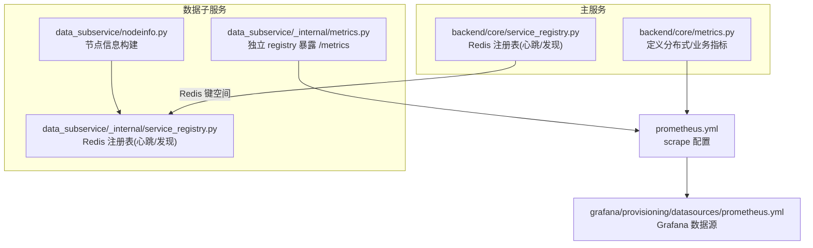
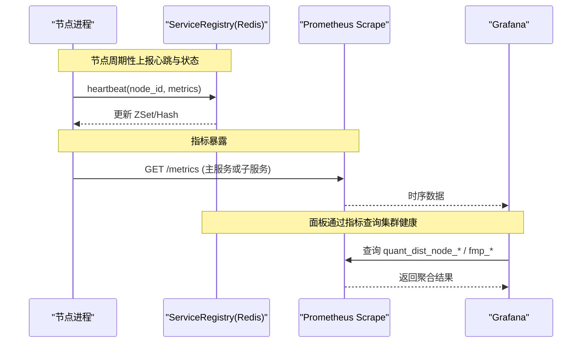
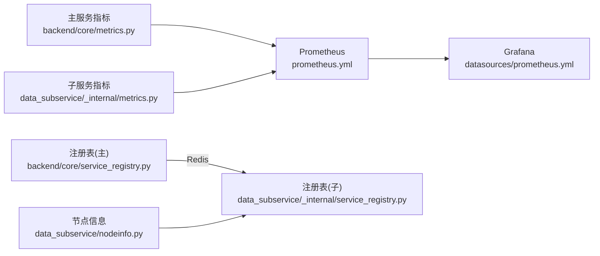

# 分布式指标聚合

<cite>
**本文引用的文件**
- [backend/core/metrics.py](file://backend/core/metrics.py)
- [data_subservice/_internal/metrics.py](file://data_subservice/_internal/metrics.py)
- [backend/core/service_registry.py](file://backend/core/service_registry.py)
- [data_subservice/_internal/service_registry.py](file://data_subservice/_internal/service_registry.py)
- [data_subservice/nodeinfo.py](file://data_subservice/nodeinfo.py)
- [prometheus.yml](file://prometheus.yml)
- [grafana/provisioning/datasources/prometheus.yml](file://grafana/provisioning/datasources/prometheus.yml)
</cite>

## 目录
1. [简介](#简介)
2. [项目结构](#项目结构)
3. [核心组件](#核心组件)
4. [架构总览](#架构总览)
5. [详细组件分析](#详细组件分析)
6. [依赖关系分析](#依赖关系分析)
7. [性能考量](#性能考量)
8. [故障排查指南](#故障排查指南)
9. [结论](#结论)
10. [附录：部署与配置示例](#附录部署与配置示例)

## 简介
本文件面向 Quant Agent 在分布式环境下的指标采集、聚合与展示方案，重点覆盖节点心跳（DIST_NODE_HEARTBEAT）、节点状态监控（DIST_NODE_STATUS）、负载均衡与路由相关指标等。文档说明多节点环境下的指标去重、时间对齐与聚合计算策略，给出 Prometheus 抓取与聚合的部署配置要点，并阐述一致性保障机制（时钟同步、数据分片、容错）以及监控最佳实践（节点发现、故障转移、容量规划）。

## 项目结构
Quant Agent 的分布式可观测性由“主服务 + 数据子服务”双端暴露指标，Prometheus 统一抓取，Grafana 进行可视化。关键位置如下：
- 主服务指标定义：backend/core/metrics.py
- 数据子服务独立指标与注册表：data_subservice/_internal/metrics.py、data_subservice/_internal/service_registry.py
- 节点信息构建：data_subservice/nodeinfo.py
- Prometheus 抓取配置：prometheus.yml
- Grafana 数据源配置：grafana/provisioning/datasources/prometheus.yml

图表来源
- [backend/core/metrics.py:447-490](file://backend/core/metrics.py#L447-L490)
- [data_subservice/_internal/metrics.py:1-69](file://data_subservice/_internal/metrics.py#L1-L69)
- [backend/core/service_registry.py:1-417](file://backend/core/service_registry.py#L1-L417)
- [data_subservice/_internal/service_registry.py:1-320](file://data_subservice/_internal/service_registry.py#L1-L320)
- [data_subservice/nodeinfo.py:1-46](file://data_subservice/nodeinfo.py#L1-L46)
- [prometheus.yml:1-43](file://prometheus.yml#L1-L43)
- [grafana/provisioning/datasources/prometheus.yml:1-10](file://grafana/provisioning/datasources/prometheus.yml#L1-L10)

章节来源
- [backend/core/metrics.py:447-490](file://backend/core/metrics.py#L447-L490)
- [data_subservice/_internal/metrics.py:1-69](file://data_subservice/_internal/metrics.py#L1-L69)
- [backend/core/service_registry.py:1-417](file://backend/core/service_registry.py#L1-L417)
- [data_subservice/_internal/service_registry.py:1-320](file://data_subservice/_internal/service_registry.py#L1-L320)
- [data_subservice/nodeinfo.py:1-46](file://data_subservice/nodeinfo.py#L1-L46)
- [prometheus.yml:1-43](file://prometheus.yml#L1-L43)
- [grafana/provisioning/datasources/prometheus.yml:1-10](file://grafana/provisioning/datasources/prometheus.yml#L1-L10)

## 核心组件
- 分布式节点指标（主服务）
  - 节点心跳时间戳：quant_dist_node_heartbeat_timestamp（标签：node_id, region）
  - 节点状态：quant_dist_node_status（标签：node_id, region；0=dead, 1=draining, 2=active）
  - 存活节点计数：quant_dist_node_alive_count（标签：capability）
  - YF 路由 failover/429/STALE 降级计数：quant_dist_yf_*
  - AKShare STALE 降级计数：quant_dist_ak_stale_fallback_total
- 数据子服务指标（独立 registry）
  - 请求/成功/失败/限流/credit/延迟/熔断/缓存命中/批量拉取/可用性/线程水位等
- 服务注册表（Redis）
  - 使用 Hash/ZSet/Set 维护节点信息、心跳时间、优雅下线集合与统计
  - 提供注册、注销、心跳、发现、清理死节点、集群总览等能力
- 节点信息构建
  - 从环境变量与网络接口获取 node_id、IP、端口、能力集、权重等

章节来源
- [backend/core/metrics.py:447-490](file://backend/core/metrics.py#L447-L490)
- [data_subservice/_internal/metrics.py:1-69](file://data_subservice/_internal/metrics.py#L1-L69)
- [backend/core/service_registry.py:1-417](file://backend/core/service_registry.py#L1-L417)
- [data_subservice/_internal/service_registry.py:1-320](file://data_subservice/_internal/service_registry.py#L1-L320)
- [data_subservice/nodeinfo.py:1-46](file://data_subservice/nodeinfo.py#L1-L46)

## 架构总览
下图展示了分布式指标从采集到可视化的端到端流程，包括主服务与数据子服务的指标暴露、Prometheus 抓取、Grafana 展示，以及 Redis 注册表对节点心跳与发现的支撑。

图表来源
- [backend/core/service_registry.py:145-182](file://backend/core/service_registry.py#L145-L182)
- [data_subservice/_internal/service_registry.py:129-152](file://data_subservice/_internal/service_registry.py#L129-L152)
- [prometheus.yml:16-43](file://prometheus.yml#L16-L43)
- [grafana/provisioning/datasources/prometheus.yml:1-10](file://grafana/provisioning/datasources/prometheus.yml#L1-L10)

## 详细组件分析

### 分布式节点指标设计（DIST 系列）
- 心跳与状态
  - quant_dist_node_heartbeat_timestamp：记录节点最后心跳时间戳（Unix epoch），用于判断存活与超时
  - quant_dist_node_status：节点状态（dead/draining/active），便于快速识别下线中节点
  - quant_dist_node_alive_count：按 capability 维度统计活跃节点数，辅助容量与负载评估
- 路由与降级
  - quant_dist_yf_failover_total：YF 路由器 failover 事件计数（from_node/to_node/reason）
  - quant_dist_yf_429_total：YF 节点 429 限流响应总数（node_id）
  - quant_dist_yf_stale_fallback_total / quant_dist_ak_stale_fallback_total：STALE 缓存降级次数（cache_key/action）
- 指标用途
  - 节点发现与健康：结合 ServiceRegistry 的心跳 TTL 判定
  - 负载均衡：基于节点权重与能力过滤选择目标节点
  - 降级与容错：通过 429/STALE 计数评估链路健康度与回退策略有效性

章节来源
- [backend/core/metrics.py:447-490](file://backend/core/metrics.py#L447-L490)

### 数据子服务指标（独立 Registry）
- 指标范围
  - 请求量、成功/失败、429 限流、credit 预算、延迟分布、自愈探测 P99、退避时长、熔断状态、缓存命中、批量拉取标的数、数据源可用性、进程线程水位
- 设计要点
  - 独立 CollectorRegistry，避免污染主服务默认 registry
  - 通过 /metrics 暴露，供 Prometheus job “data-subservice-metrics” 抓取
  - 与主服务面板区分“业务层”和“数据源层”，便于问题归因

章节来源
- [data_subservice/_internal/metrics.py:1-69](file://data_subservice/_internal/metrics.py#L1-L69)

### 服务注册表（Redis）与节点发现
- 键空间
  - Hash quant:registry:nodes：节点信息 JSON
  - ZSet quant:registry:heartbeats：{node_id: last_heartbeat_ts}
  - Set quant:registry:draining：优雅下线中的节点
  - Hash quant:registry:stats:{node_id}：节点统计（success/error/avg_latency_ms 等）
- 核心能力
  - register/deregister：注册与注销节点
  - heartbeat：更新心跳与可选统计
  - discover：按 capability/region 过滤并排序（权重降序）
  - cleanup_dead_nodes：定时清理超时节点
  - get_cluster_overview：集群总览（active/drain/dead、区域分布）
- 与指标联动
  - 心跳 TTL 决定 dead 判定阈值
  - draining 标记影响 discover 结果，配合 quant_dist_node_status 实现可视化告警

章节来源
- [backend/core/service_registry.py:1-417](file://backend/core/service_registry.py#L1-L417)
- [data_subservice/_internal/service_registry.py:1-320](file://data_subservice/_internal/service_registry.py#L1-L320)

### 节点信息构建（data_subservice/nodeinfo.py）
- 从环境变量与网络接口构造 NodeInfo
  - NODE_ID、DATASOURCE_PORT、DS_CAPABILITIES/NODE_CAPABILITIES、NODE_WEIGHT
  - 自动探测本地 IP，生成节点 URL
- 作用
  - 为 ServiceRegistry 提供注册元数据
  - 为路由与负载均衡提供能力与权重信息

章节来源
- [data_subservice/nodeinfo.py:1-46](file://data_subservice/nodeinfo.py#L1-L46)

### 多节点指标去重、时间对齐与聚合策略
- 去重
  - 以 node_id 作为唯一标识，Prometheus 侧按 label 维度聚合时确保不重复计数
  - 对于 Counter 类指标（如 failover、429、STALE），使用 increase() 计算增量，避免跨周期重复
- 时间对齐
  - 心跳采用 Unix epoch 时间戳，Prometheus 抓取间隔（默认 15s，FastAPI 5s）保证时间粒度一致
  - 使用 Summary/Histogram 类型指标（如延迟）在 exporter 侧完成分桶统计，降低聚合开销
- 聚合计算
  - 使用 recording rules 或 PromQL 将多节点指标按 region/capability 聚合，得到全局视图
  - 针对 STALE/429 等事件型指标，用 rate/increase 计算单位时间内的发生频率，便于阈值告警

[本节为概念性说明，无需代码来源]

### 负载均衡与路由指标
- 节点权重与能力
  - NodeInfo.weight 与 capabilities 参与 discover 排序与过滤，实现按能力与权重的负载均衡
- 路由事件
  - quant_dist_yf_failover_total：记录 failover 事件，便于定位热点与异常节点
  - quant_dist_yf_429_total：按 node_id 统计限流，指导动态降载或切换
- 降级路径
  - quant_dist_yf_stale_fallback_total / quant_dist_ak_stale_fallback_total：衡量缓存降级效果与必要性

章节来源
- [backend/core/metrics.py:447-490](file://backend/core/metrics.py#L447-L490)
- [backend/core/service_registry.py:188-229](file://backend/core/service_registry.py#L188-L229)

### 一致性保障机制
- 时钟同步
  - 心跳使用 Unix epoch，建议节点间启用 NTP/Chrony 保持时钟一致，避免误判 dead
- 数据分片
  - Redis 键空间按 node_id 分片（stats 前缀），天然支持水平扩展与隔离
- 容错处理
  - 心跳 TTL 控制 dead 判定；draining 支持优雅下线；cleanup_dead_nodes 定期回收
  - 子服务指标包含熔断状态与自愈探测，增强链路韧性

章节来源
- [backend/core/service_registry.py:320-353](file://backend/core/service_registry.py#L320-L353)
- [data_subservice/_internal/metrics.py:30-48](file://data_subservice/_internal/metrics.py#L30-L48)

## 依赖关系分析
- 组件耦合
  - 主服务与子服务均依赖 Redis 注册表进行心跳与发现
  - Prometheus 抓取主服务与子服务指标，形成统一观测面
- 外部依赖
  - Redis：共享状态存储（节点信息、心跳、统计）
  - Prometheus/Grafana：指标抓取与可视化
- 潜在循环依赖
  - 无直接循环；指标定义与注册表逻辑解耦，职责清晰

图表来源
- [backend/core/metrics.py:447-490](file://backend/core/metrics.py#L447-L490)
- [data_subservice/_internal/metrics.py:1-69](file://data_subservice/_internal/metrics.py#L1-L69)
- [backend/core/service_registry.py:1-417](file://backend/core/service_registry.py#L1-L417)
- [data_subservice/_internal/service_registry.py:1-320](file://data_subservice/_internal/service_registry.py#L1-L320)
- [data_subservice/nodeinfo.py:1-46](file://data_subservice/nodeinfo.py#L1-L46)
- [prometheus.yml:16-43](file://prometheus.yml#L16-L43)
- [grafana/provisioning/datasources/prometheus.yml:1-10](file://grafana/provisioning/datasources/prometheus.yml#L1-L10)

章节来源
- [prometheus.yml:16-43](file://prometheus.yml#L16-L43)
- [backend/core/service_registry.py:1-417](file://backend/core/service_registry.py#L1-L417)
- [data_subservice/_internal/service_registry.py:1-320](file://data_subservice/_internal/service_registry.py#L1-L320)

## 性能考量
- 指标类型选择
  - 延迟与耗时使用 Histogram/Summary，减少服务端聚合成本
  - 计数器使用 Counter，Prometheus 侧通过 rate/increase 计算速率
- 抓取频率
  - FastAPI 应用设置更短 scrape_interval（5s）提升实时性；其他任务保持 15s
- 内存与 CPU
  - 子服务独立 registry，避免指标膨胀与锁竞争
  - 注册表操作使用 pipeline 原子化，降低 RTT 与锁开销
- 容量规划
  - 通过 quant_dist_node_alive_count 与 fmp_credit_remaining 等指标评估扩容需求
  - 关注 process_threads 与 ds_backoff_state，预防资源耗尽与过度退避

[本节为通用性能建议，无需代码来源]

## 故障排查指南
- 节点失联
  - 检查 quant_dist_node_heartbeat_timestamp 是否持续不变，确认心跳是否上报
  - 查看 ServiceRegistry 的 cleanup_dead_nodes 日志，确认是否被清理
- 路由异常
  - 观察 quant_dist_yf_failover_total 与 quant_dist_yf_429_total，定位频繁切换或限流节点
  - 结合 quant_dist_yf_stale_fallback_total / quant_dist_ak_stale_fallback_total 判断降级是否生效
- 子服务不可达
  - 检查 data-subservice-metrics job 是否能抓取 /metrics
  - 查看 fmp_up、fmp_circuit_state、fmp_heal_p99_seconds 等指标判断健康与自愈状态
- 线程水位
  - 主/子服务 process_threads 与 warn threshold 对比，及时扩容或优化并发

章节来源
- [backend/core/service_registry.py:320-353](file://backend/core/service_registry.py#L320-L353)
- [data_subservice/_internal/metrics.py:30-48](file://data_subservice/_internal/metrics.py#L30-L48)
- [prometheus.yml:27-43](file://prometheus.yml#L27-L43)

## 结论
Quant Agent 的分布式指标体系以 Redis 注册表为核心，结合主/子服务指标暴露与 Prometheus 抓取，实现了节点心跳、状态、负载均衡与降级路径的全景监控。通过合理的时间对齐、去重与聚合策略，以及 NTP 时钟同步、数据分片与容错机制，系统具备高可用与可观测性。建议在多副本与跨区域场景下，结合 recording rules 与告警规则，进一步完善自动化运维能力。

[本节为总结性内容，无需代码来源]

## 附录：部署与配置示例
- Prometheus 抓取配置要点
  - fastapi-app：每 5 秒抓取主服务指标（兼容容器与宿主机地址）
  - data-subservice：抓取子服务熔断面板 /metrics/circuit
  - data-subservice-metrics：抓取子服务业务指标 /metrics（独立 registry）
- Grafana 数据源
  - 指向 Prometheus 服务地址，作为默认数据源
- 节点与环境变量
  - NODE_ID、DATASOURCE_PORT、DS_CAPABILITIES/NODE_CAPABILITIES、NODE_WEIGHT 等用于节点注册与能力声明
- 一致性建议
  - 启用 NTP/Chrony 保证各节点时钟一致
  - 合理设置心跳 TTL 与抓取间隔，平衡实时性与资源消耗

章节来源
- [prometheus.yml:16-43](file://prometheus.yml#L16-L43)
- [grafana/provisioning/datasources/prometheus.yml:1-10](file://grafana/provisioning/datasources/prometheus.yml#L1-L10)
- [data_subservice/nodeinfo.py:10-34](file://data_subservice/nodeinfo.py#L10-L34)
