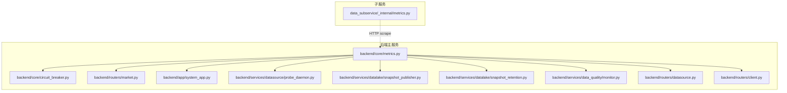
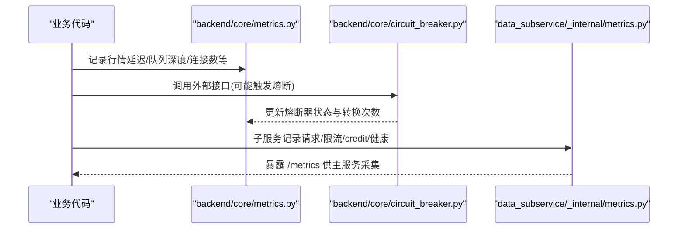
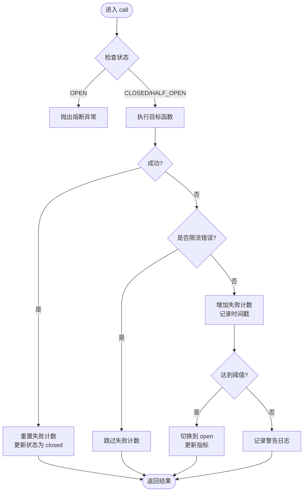
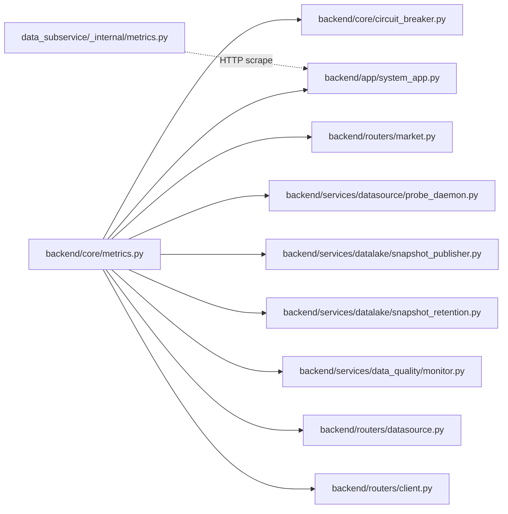

# 指标收集方案

<cite>
**本文引用的文件**
- [backend/core/metrics.py](file://backend/core/metrics.py)
- [backend/core/circuit_breaker.py](file://backend/core/circuit_breaker.py)
- [data_subservice/_internal/metrics.py](file://data_subservice/_internal/metrics.py)
- [backend/tests/test_metrics.py](file://backend/tests/test_metrics.py)
- [backend/routers/market.py](file://backend/routers/market.py)
- [backend/app/system_app.py](file://backend/app/system_app.py)
- [backend/services/datasource/probe_daemon.py](file://backend/services/datasource/probe_daemon.py)
- [backend/services/datalake/snapshot_publisher.py](file://backend/services/datalake/snapshot_publisher.py)
- [backend/services/datalake/snapshot_retention.py](file://backend/services/datalake/snapshot_retention.py)
- [backend/services/data_quality/monitor.py](file://backend/services/data_quality/monitor.py)
- [backend/routers/datasource.py](file://backend/routers/datasource.py)
- [backend/routers/client.py](file://backend/routers/client.py)
- [backend/routers/system_health.py](file://backend/routers/system_health.py)
</cite>

## 目录
1. [简介](#简介)
2. [项目结构](#项目结构)
3. [核心组件](#核心组件)
4. [架构总览](#架构总览)
5. [详细组件分析](#详细组件分析)
6. [依赖关系分析](#依赖关系分析)
7. [性能考虑](#性能考虑)
8. [故障排查指南](#故障排查指南)
9. [结论](#结论)
10. [附录](#附录)

## 简介
本方案围绕 Quant Agent 的指标采集与上报，统一在 backend/core/metrics.py 中定义 Prometheus 指标，并在业务代码、数据源层、子服务侧进行埋点。覆盖行情延迟、WebSocket 连接数、Redis 队列深度、熔断器状态、数据源可用性、分布式节点心跳等关键指标；同时给出 Counter/Gauge/Histogram/Summary 的使用场景与最佳实践，并提供分布式环境下的聚合策略与性能优化建议。

## 项目结构
- 指标定义集中位于 backend/core/metrics.py，按领域分组：行情、WebSocket、Redis、熔断器、客户端 APM、数据源（含主动拨测）、Facade 聚合、Agent/LLM、Futu OpenD、K线缓存、数据质量、限流、数据湖快照、分布式节点、Finnhub WS 实时价命中、FMP collector、进程线程水位、WebScrape 抓取成功率等。
- 子服务 data_subservice/_internal/metrics.py 提供独立 CollectorRegistry，暴露 /metrics，用于主服务 scrape FMP 配额与健康状况。
- 业务侧通过 routers、services、workers 等模块导入并调用指标；测试用例验证指标类型与注册情况。

图表来源
- [backend/core/metrics.py:1-641](file://backend/core/metrics.py#L1-L641)
- [backend/core/circuit_breaker.py:1-379](file://backend/core/circuit_breaker.py#L1-L379)
- [data_subservice/_internal/metrics.py:1-69](file://data_subservice/_internal/metrics.py#L1-L69)

章节来源
- [backend/core/metrics.py:1-641](file://backend/core/metrics.py#L1-L641)
- [data_subservice/_internal/metrics.py:1-69](file://data_subservice/_internal/metrics.py#L1-L69)

## 核心组件
- 指标中心：backend/core/metrics.py 集中定义所有业务指标，使用 prometheus_client 的 Counter、Gauge、Histogram、Summary。
- 熔断器集成：backend/core/circuit_breaker.py 在状态转换时更新 CIRCUIT_BREAKER_STATE 与 CIRCUIT_BREAKER_TRANSITIONS。
- 子服务指标：data_subservice/_internal/metrics.py 维护独立 registry，暴露 FMP 请求量、限流、credit、延迟、健康等指标。
- 业务埋点：routers/services/workers 在关键路径上调用指标，如 WebSocket 消息发送、数据源拨测、数据湖快照创建、数据质量监控等。

章节来源
- [backend/core/metrics.py:1-641](file://backend/core/metrics.py#L1-L641)
- [backend/core/circuit_breaker.py:1-379](file://backend/core/circuit_breaker.py#L1-L379)
- [data_subservice/_internal/metrics.py:1-69](file://data_subservice/_internal/metrics.py#L1-L69)
- [backend/routers/market.py:1-200](file://backend/routers/market.py#L1-L200)
- [backend/services/datasource/probe_daemon.py:1-200](file://backend/services/datasource/probe_daemon.py#L1-L200)
- [backend/services/datalake/snapshot_publisher.py:1-300](file://backend/services/datalake/snapshot_publisher.py#L1-L300)
- [backend/services/datalake/snapshot_retention.py:1-120](file://backend/services/datalake/snapshot_retention.py#L1-L120)
- [backend/services/data_quality/monitor.py:1-400](file://backend/services/data_quality/monitor.py#L1-L400)

## 架构总览
指标采集遵循“定义集中、埋点分散、子服务隔离”的原则：
- 定义集中：所有指标在 backend/core/metrics.py 声明，便于统一命名、标签规范与可观测性面板对接。
- 埋点分散：业务逻辑在合适的位置记录指标，如 WebSocket 推送、数据源调用、熔断器状态切换、数据湖快照、数据质量校验等。
- 子服务隔离：data_subservice 使用独立 CollectorRegistry，避免污染主服务全局 registry，并通过 HTTP 暴露 /metrics 供主服务 scrape。

图表来源
- [backend/core/metrics.py:1-641](file://backend/core/metrics.py#L1-L641)
- [backend/core/circuit_breaker.py:1-379](file://backend/core/circuit_breaker.py#L1-L379)
- [data_subservice/_internal/metrics.py:1-69](file://data_subservice/_internal/metrics.py#L1-L69)

## 详细组件分析

### 指标类型与使用场景
- Counter（计数器）：适用于不可逆累计事件，如错误总数、消息发送总量、Token 消耗、重试次数、探针失败次数等。示例：WS_MESSAGES_SENT、DATASOURCE_ERRORS、AGENT_TOOL_CALLS。
- Gauge（仪表盘）：适用于可升可降的瞬时值，如连接数、队列深度、熔断器状态、节点心跳时间戳、数据源可用性等。示例：WS_ACTIVE_CONNECTIONS、REDIS_QUEUE_DEPTH、CIRCUIT_BREAKER_STATE、DIST_NODE_HEARTBEAT_TIMESTAMP。
- Histogram（直方图）：适用于分布统计，如延迟、吞吐、命中率等。示例：MARKET_KLINE_FETCH_LATENCY、DATASOURCE_LATENCY、CLIENT_WEB_VITAL_*。
- Summary（摘要）：适用于需要分位数统计的延迟或耗时，如行情快照获取延迟、Redis 操作延迟。示例：MARKET_QUOTE_LATENCY、REDIS_OPERATION_LATENCY。

最佳实践
- 标签维度要可控且有限：避免高基数标签（如用户 ID、随机 trace_id），优先使用 source、symbol、action、region、node_id 等业务稳定维度。
- 单位明确：延迟统一用秒或毫秒，并在指标名体现；计数类指标保持无单位。
- 合理设置桶：Histogram buckets 根据业务 P95/P99 目标调整，避免过多桶导致内存压力。
- 采样策略：对高频指标采用 Summary 或带 bucket 的 Histogram，必要时结合应用层采样（如仅记录部分样本）。

章节来源
- [backend/core/metrics.py:1-641](file://backend/core/metrics.py#L1-L641)
- [backend/tests/test_metrics.py:1-244](file://backend/tests/test_metrics.py#L1-L244)

### 行情延迟指标（Summary）
- 指标：MARKET_QUOTE_LATENCY（Summary），标签 source、symbol，记录从数据源到 Redis 写入的全链路耗时。
- 用途：评估行情链路端到端延迟，定位慢源或慢标的。
- 埋点位置：行情处理链路（例如 WebSocket 推送、数据源拉取后落库前）。
- 查询建议：按 source/symbol 计算 p95/p99，对比不同数据源表现。

章节来源
- [backend/core/metrics.py:24-28](file://backend/core/metrics.py#L24-L28)
- [backend/routers/market.py:1-200](file://backend/routers/market.py#L1-L200)

### WebSocket 连接数（Gauge）
- 指标：WS_ACTIVE_CONNECTIONS（Gauge），记录当前活跃连接数；WS_SUBSCRIPTIONS（Gauge）记录订阅总数；WS_MESSAGES_SENT（Counter）按 type 分类统计发送量；WS_MESSAGES_DROPPED（Counter）统计背压丢弃。
- 用途：监控连接规模、消息吞吐与背压情况，辅助容量规划与告警。
- 埋点位置：连接建立/断开、消息发送/丢弃处。

章节来源
- [backend/core/metrics.py:53-72](file://backend/core/metrics.py#L53-L72)
- [backend/routers/market.py:1-200](file://backend/routers/market.py#L1-L200)

### Redis 队列深度（Gauge）
- 指标：REDIS_QUEUE_DEPTH（Gauge），标签 queue，记录 Stream/List 积压数量。
- 用途：发现消费滞后、背压风险，指导扩容或优化消费速率。
- 埋点位置：消费者循环中定期读取队列长度并 set。

章节来源
- [backend/core/metrics.py:78-82](file://backend/core/metrics.py#L78-L82)

### 熔断器状态（Gauge + Counter）
- 指标：CIRCUIT_BREAKER_STATE（Gauge，0=closed,1=half_open,2=open），CIRCUIT_BREAKER_TRANSITIONS（Counter，from_state→to_state）。
- 用途：观察各服务熔断状态与转换频率，快速识别不稳定依赖。
- 埋点位置：circuit_breaker 状态机转换处自动更新。

图表来源
- [backend/core/circuit_breaker.py:147-218](file://backend/core/circuit_breaker.py#L147-L218)
- [backend/core/circuit_breaker.py:220-325](file://backend/core/circuit_breaker.py#L220-L325)

章节来源
- [backend/core/circuit_breaker.py:1-379](file://backend/core/circuit_breaker.py#L1-L379)
- [backend/core/metrics.py:100-110](file://backend/core/metrics.py#L100-L110)

### 客户端 APM 心跳（Counter）
- 指标：CLIENT_HEARTBEAT_TOTAL（Counter，platform），统计客户端心跳接收总数。
- 用途：评估在线客户端规模与平台分布。
- 埋点位置：客户端心跳上报入口。

章节来源
- [backend/core/metrics.py:116-120](file://backend/core/metrics.py#L116-L120)
- [backend/routers/client.py:1-200](file://backend/routers/client.py#L1-L200)

### 数据源主动拨测（Histogram + Counter + Gauge）
- 指标：DATASOURCE_PROBE_SUCCESS（Gauge，最近一次成败）、DATASOURCE_PROBE_LATENCY（Histogram，毫秒）、DATASOURCE_PROBE_TOTAL（Counter，按 status）、DATASOURCE_PROBE_FAILURES（Counter，按 error_type）。
- 用途：即使无业务流量也能反映数据源真实存活与延迟分布。
- 埋点位置：probe_daemon 周期拨测逻辑。

章节来源
- [backend/core/metrics.py:190-217](file://backend/core/metrics.py#L190-L217)
- [backend/services/datasource/probe_daemon.py:1-200](file://backend/services/datasource/probe_daemon.py#L1-L200)

### 数据湖快照（Counter + Gauge）
- 指标：DATALAKE_SNAPSHOT_CREATED（Counter，status）、DATALAKE_SNAPSHOT_READ（Counter，result）、DATALAKE_RETENTION_RUNS（Counter）、DATALAKE_LATEST_AGE_DAYS（Gauge）。
- 用途：监控快照创建与读取、保留任务执行、最新快照时效性。
- 埋点位置：snapshot_publisher、snapshot_retention。

章节来源
- [backend/core/metrics.py:360-380](file://backend/core/metrics.py#L360-L380)
- [backend/services/datalake/snapshot_publisher.py:1-300](file://backend/services/datalake/snapshot_publisher.py#L1-L300)
- [backend/services/datalake/snapshot_retention.py:1-120](file://backend/services/datalake/snapshot_retention.py#L1-L120)

### 数据质量（Gauge + Counter）
- 指标：DATA_QUALITY_DIRTY_RATE、COMPLETENESS、TOTAL_RECORDS、ANOMALY_COUNT、MISSING_FIELDS、PRICE_ANOMALY、STALE_COUNT、LATENCY_MS、LEVEL、CHECKS。
- 用途：量化数据源质量，支持告警与降级决策。
- 埋点位置：data_quality monitor。

章节来源
- [backend/core/metrics.py:386-444](file://backend/core/metrics.py#L386-L444)
- [backend/services/data_quality/monitor.py:1-400](file://backend/services/data_quality/monitor.py#L1-L400)

### 分布式节点指标（Gauge + Counter）
- 指标：DIST_NODE_HEARTBEAT_TIMESTAMP、DIST_NODE_STATUS、DIST_NODE_ALIVE_COUNT、DIST_YF_FAILOVER_TOTAL、DIST_YF_429_TOTAL、DIST_YF_STALE_TOTAL、DIST_AK_STALE_TOTAL。
- 用途：节点心跳、状态、存活数、failover 事件、限流与降级统计。
- 用途场景：负载均衡、故障转移、区域能力感知。

章节来源
- [backend/core/metrics.py:450-490](file://backend/core/metrics.py#L450-L490)

### 子服务指标（独立 Registry）
- 指标：fmp_requests_total、fmp_error_total、fmp_rate_limit_total、fmp_credit_spent_total、fmp_credit_remaining、fmp_credit_limit、fmp_request_latency_seconds、fmp_heal_p99_seconds、fmp_backoff_seconds、fmp_circuit_state、fmp_cache_hit_total、fmp_batch_symbols_total、fmp_up、process_threads、process_thread_warn_threshold。
- 用途：子服务自包含指标，主服务通过 HTTP scrape 观测 FMP 配额与健康状况。
- 注意：子服务使用独立 CollectorRegistry，避免与主服务全局 registry 冲突。

章节来源
- [data_subservice/_internal/metrics.py:1-69](file://data_subservice/_internal/metrics.py#L1-L69)

## 依赖关系分析
- backend/core/metrics.py 被多个模块引用：熔断器、市场路由、系统应用、数据源拨测、数据湖、数据质量、客户端路由等。
- 熔断器在状态转换时更新指标，确保状态可见性与可追溯性。
- 子服务 metrics 通过独立 registry 暴露 /metrics，主服务 system_app 负责构建指标快照与聚合展示。

图表来源
- [backend/core/metrics.py:1-641](file://backend/core/metrics.py#L1-L641)
- [backend/core/circuit_breaker.py:1-379](file://backend/core/circuit_breaker.py#L1-L379)
- [data_subservice/_internal/metrics.py:1-69](file://data_subservice/_internal/metrics.py#L1-L69)

章节来源
- [backend/core/metrics.py:1-641](file://backend/core/metrics.py#L1-L641)
- [backend/app/system_app.py:1-300](file://backend/app/system_app.py#L1-L300)

## 性能考虑
- 采样策略
  - 对高频 Summary/Histogram 使用合适的 buckets，避免过细导致内存膨胀。
  - 对极端高频事件可采用应用层采样（如每 N 次记录一次），但需保证统计代表性。
- 标签管理
  - 控制标签基数：source、symbol、action、region、node_id 等稳定维度；避免用户 ID、trace_id 等高基数标签。
  - 对 symbol 等维度较大的标签，建议在查询时做聚合或限制范围。
- 内存使用控制
  - Summary/Histogram 内部维护桶与分位数缓冲区，需评估内存占用。
  - 子服务使用独立 registry，避免与主服务共享内存空间。
- 上报与采集
  - 主服务通过 Prometheus 抓取 /metrics；子服务独立暴露 /metrics，减少耦合。
  - 合理配置抓取间隔，避免频繁采集造成额外负载。

[本节为通用性能建议，不直接分析具体文件]

## 故障排查指南
- 熔断器异常
  - 现象：CIRCUIT_BREAKER_STATE 持续为 open，CIRCUIT_BREAKER_TRANSITIONS 频繁转换。
  - 排查：检查对应服务的错误日志、限流与网络状况；确认 error_classifier 是否正确过滤限流错误。
- WebSocket 背压
  - 现象：WS_MESSAGES_DROPPED 上升，WS_ACTIVE_CONNECTIONS 增长缓慢。
  - 排查：检查消费者处理能力、订阅模型与带宽；适当降低推送频率或启用背压策略。
- Redis 队列积压
  - 现象：REDIS_QUEUE_DEPTH 持续增长。
  - 排查：检查消费者实例数与处理耗时；优化批量处理与并发度。
- 数据源拨测失败
  - 现象：DATASOURCE_PROBE_FAILURES 上升，DATASOURCE_PROBE_LATENCY 升高。
  - 排查：检查网络连通性、认证与限流；确认拨测参数与超时配置。
- 数据湖快照过期
  - 现象：DATALAKE_LATEST_AGE_DAYS 增大。
  - 排查：检查快照任务调度与存储写入；确认保留策略与磁盘空间。

章节来源
- [backend/core/circuit_breaker.py:147-325](file://backend/core/circuit_breaker.py#L147-L325)
- [backend/core/metrics.py:53-82](file://backend/core/metrics.py#L53-L82)
- [backend/core/metrics.py:190-217](file://backend/core/metrics.py#L190-L217)
- [backend/core/metrics.py:360-380](file://backend/core/metrics.py#L360-L380)

## 结论
本方案通过集中式指标定义与分散式埋点，覆盖了行情、WebSocket、Redis、熔断器、数据源、数据湖、数据质量、分布式节点等关键领域；子服务独立 registry 保障了解耦与可观测性。配合合理的采样、标签管理与采集策略，可在大规模分布式环境下实现稳定、低开销的指标采集与分析。

[本节为总结性内容，不直接分析具体文件]

## 附录

### 指标命名约定
- 前缀：quant_（主服务）、fmp_（子服务）、ds_（数据源限流相关）、datalake_（数据湖）。
- 后缀：_total（Counter）、_seconds/_milliseconds（延迟）、_rate（比率）、_count（计数）。
- 标签：source、symbol、action、region、node_id、platform、tier、status、error_type、category 等。

章节来源
- [backend/core/metrics.py:1-641](file://backend/core/metrics.py#L1-L641)
- [data_subservice/_internal/metrics.py:1-69](file://data_subservice/_internal/metrics.py#L1-L69)

### 埋点示例（以路径代替代码）
- 行情延迟埋点：参考 [backend/core/metrics.py:24-28](file://backend/core/metrics.py#L24-L28) 中的 MARKET_QUOTE_LATENCY 用法。
- WebSocket 消息发送：参考 [backend/routers/market.py:1-200](file://backend/routers/market.py#L1-L200) 中对 WS_MESSAGES_SENT 的使用。
- Redis 队列深度：参考 [backend/core/metrics.py:78-82](file://backend/core/metrics.py#L78-L82) 中的 REDIS_QUEUE_DEPTH 用法。
- 熔断器状态更新：参考 [backend/core/circuit_breaker.py:147-218](file://backend/core/circuit_breaker.py#L147-L218) 与 [backend/core/circuit_breaker.py:220-325](file://backend/core/circuit_breaker.py#L220-L325)。
- 数据源拨测：参考 [backend/services/datasource/probe_daemon.py:1-200](file://backend/services/datasource/probe_daemon.py#L1-L200)。
- 数据湖快照：参考 [backend/services/datalake/snapshot_publisher.py:1-300](file://backend/services/datalake/snapshot_publisher.py#L1-L300) 与 [backend/services/datalake/snapshot_retention.py:1-120](file://backend/services/datalake/snapshot_retention.py#L1-L120)。
- 数据质量：参考 [backend/services/data_quality/monitor.py:1-400](file://backend/services/data_quality/monitor.py#L1-L400)。
- 客户端心跳：参考 [backend/routers/client.py:1-200](file://backend/routers/client.py#L1-L200)。
- 子服务指标：参考 [data_subservice/_internal/metrics.py:1-69](file://data_subservice/_internal/metrics.py#L1-L69)。

章节来源
- [backend/core/metrics.py:1-641](file://backend/core/metrics.py#L1-L641)
- [backend/core/circuit_breaker.py:1-379](file://backend/core/circuit_breaker.py#L1-L379)
- [backend/routers/market.py:1-200](file://backend/routers/market.py#L1-L200)
- [backend/services/datasource/probe_daemon.py:1-200](file://backend/services/datasource/probe_daemon.py#L1-L200)
- [backend/services/datalake/snapshot_publisher.py:1-300](file://backend/services/datalake/snapshot_publisher.py#L1-L300)
- [backend/services/datalake/snapshot_retention.py:1-120](file://backend/services/datalake/snapshot_retention.py#L1-L120)
- [backend/services/data_quality/monitor.py:1-400](file://backend/services/data_quality/monitor.py#L1-L400)
- [backend/routers/client.py:1-200](file://backend/routers/client.py#L1-L200)
- [data_subservice/_internal/metrics.py:1-69](file://data_subservice/_internal/metrics.py#L1-L69)
