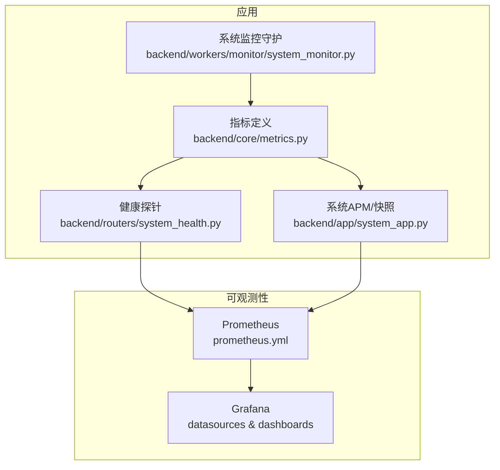
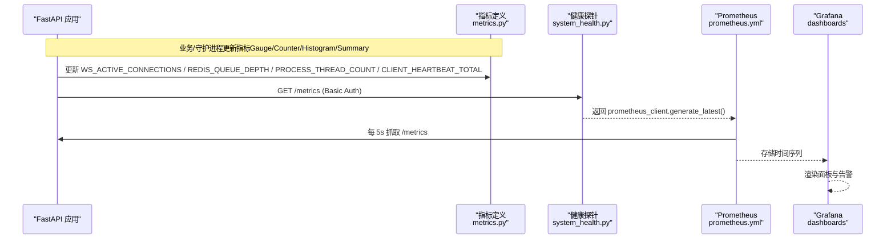
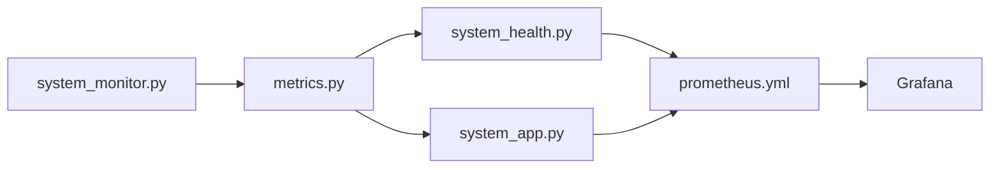

# 系统指标监控

<cite>
**本文引用的文件**
- [backend/core/metrics.py](file://backend/core/metrics.py)
- [backend/routers/system_health.py](file://backend/routers/system_health.py)
- [backend/app/system_app.py](file://backend/app/system_app.py)
- [backend/workers/monitor/system_monitor.py](file://backend/workers/monitor/system_monitor.py)
- [prometheus.yml](file://prometheus.yml)
- [grafana/provisioning/datasources/prometheus.yml](file://grafana/provisioning/datasources/prometheus.yml)
- [grafana/provisioning/dashboards/quant-agent-dashboard.json](file://grafana/provisioning/dashboards/quant-agent-dashboard.json)
- [config/prometheus_rules.yml](file://config/prometheus_rules.yml)
</cite>

## 目录
1. [简介](#简介)
2. [项目结构](#项目结构)
3. [核心组件](#核心组件)
4. [架构总览](#架构总览)
5. [详细组件分析](#详细组件分析)
6. [依赖关系分析](#依赖关系分析)
7. [性能与采集策略](#性能与采集策略)
8. [故障排查指南](#故障排查指南)
9. [结论](#结论)
10. [附录：面板与告警配置示例](#附录面板与告警配置示例)

## 简介
本文件面向 Quant Agent 的系统级指标监控，聚焦以下关键指标的采集、存储、可视化与诊断：
- WebSocket 活跃连接数（WS_ACTIVE_CONNECTIONS）
- Redis 队列深度（REDIS_QUEUE_DEPTH）
- 进程线程水位（PROCESS_THREAD_COUNT）
- 客户端 APM 心跳（CLIENT_HEARTBEAT_TOTAL）
并给出在 Prometheus/Grafana 中的监控面板构建方法、阈值建议、采集频率与存储策略、查询优化以及常见问题的定位思路。

## 项目结构
Quant Agent 的指标体系由“指标定义 + 采集埋点 + 健康探针 + 抓取配置 + 可视化”五部分构成：
- 指标定义：集中声明所有 Prometheus 指标（Gauge/Counter/Histogram/Summary），位于后端核心模块。
- 采集埋点：业务逻辑中按事件更新指标；进程级线程水位通过定时任务刷新。
- 健康探针：提供 /health、/health/ready、/health/deep 等端点，聚合组件状态与指标快照。
- 抓取配置：Prometheus 定期拉取 FastAPI 暴露的 /metrics。
- 可视化：Grafana 预置数据源与仪表盘 JSON，便于快速搭建看板。

图表来源
- [backend/core/metrics.py:1-641](file://backend/core/metrics.py#L1-L641)
- [backend/routers/system_health.py:1-421](file://backend/routers/system_health.py#L1-L421)
- [backend/app/system_app.py:1-200](file://backend/app/system_app.py#L1-L200)
- [backend/workers/monitor/system_monitor.py:1-80](file://backend/workers/monitor/system_monitor.py#L1-L80)
- [prometheus.yml:1-43](file://prometheus.yml#L1-L43)
- [grafana/provisioning/datasources/prometheus.yml:1-10](file://grafana/provisioning/datasources/prometheus.yml#L1-L10)

章节来源
- [backend/core/metrics.py:1-641](file://backend/core/metrics.py#L1-L641)
- [backend/routers/system_health.py:1-421](file://backend/routers/system_health.py#L1-L421)
- [backend/app/system_app.py:1-200](file://backend/app/system_app.py#L1-L200)
- [backend/workers/monitor/system_monitor.py:1-80](file://backend/workers/monitor/system_monitor.py#L1-L80)
- [prometheus.yml:1-43](file://prometheus.yml#L1-L43)
- [grafana/provisioning/datasources/prometheus.yml:1-10](file://grafana/provisioning/datasources/prometheus.yml#L1-L10)

## 核心组件
- 指标定义中心：统一声明 WS_ACTIVE_CONNECTIONS、REDIS_QUEUE_DEPTH、PROCESS_THREAD_COUNT、CLIENT_HEARTBEAT_TOTAL 等指标类型、标签与描述。
- 健康探针：/metrics 暴露 Prometheus 格式指标；/health、/health/ready、/health/deep 提供进程存活、就绪与全链路诊断信息。
- 系统 APM：build_metrics_snapshot 将关键 Gauge/Counter 值聚合成字典，供 /health/deep 展示。
- 系统监控守护：后台高频探测事件循环阻塞，记录慢请求与卡顿日志，必要时发送通知。
- 抓取与可视化：Prometheus 每 5s 抓取 FastAPI 指标；Grafana 预置数据源与仪表盘。

章节来源
- [backend/core/metrics.py:1-641](file://backend/core/metrics.py#L1-L641)
- [backend/routers/system_health.py:1-421](file://backend/routers/system_health.py#L1-L421)
- [backend/app/system_app.py:1-200](file://backend/app/system_app.py#L1-L200)
- [backend/workers/monitor/system_monitor.py:1-80](file://backend/workers/monitor/system_monitor.py#L1-L80)
- [prometheus.yml:1-43](file://prometheus.yml#L1-L43)
- [grafana/provisioning/datasources/prometheus.yml:1-10](file://grafana/provisioning/datasources/prometheus.yml#L1-L10)

## 架构总览
下图展示了从指标埋点到 Grafana 展示的完整链路，包括采集频率、认证与多 job 抓取。

图表来源
- [backend/core/metrics.py:1-641](file://backend/core/metrics.py#L1-L641)
- [backend/routers/system_health.py:1-421](file://backend/routers/system_health.py#L1-L421)
- [prometheus.yml:1-43](file://prometheus.yml#L1-L43)
- [grafana/provisioning/datasources/prometheus.yml:1-10](file://grafana/provisioning/datasources/prometheus.yml#L1-L10)

## 详细组件分析

### 指标定义与使用（backend/core/metrics.py）
- 指标类型与用途
  - WS_ACTIVE_CONNECTIONS：当前活跃的行情 WebSocket 连接数（Gauge）。
  - REDIS_QUEUE_DEPTH：Redis Stream/List 队列深度（Gauge，带 queue 标签）。
  - PROCESS_THREAD_COUNT：当前进程 OS 线程数（Gauge）。
  - CLIENT_HEARTBEAT_TOTAL：客户端 APM 心跳接收总数（Counter，带 platform 标签）。
  - 其他：熔断器状态、Web Vitals、数据源延迟/错误/可用性、K线缓存命中、数据质量、分布式节点心跳等。
- 进程线程水位刷新
  - 提供 update_process_thread_metrics()，读取 active_count 并设置阈值（环境变量 MAIN_THREAD_WARN 默认 800）。
- 复杂度与影响
  - Gauge/Counter 为 O(1) 更新；Histogram/Summary 会维护桶或分位数统计，注意标签基数控制以避免高基维导致内存增长。
- 最佳实践
  - 对高基维度（如 symbol、source）谨慎打标签，必要时采样或聚合。
  - 对 Summary/Histogram 合理设置 buckets，避免过细导致存储膨胀。

章节来源
- [backend/core/metrics.py:1-641](file://backend/core/metrics.py#L1-L641)

### 健康探针与指标暴露（backend/routers/system_health.py）
- /metrics：Basic Auth 保护，返回 Prometheus 最新指标。
- /health：liveness，仅验证进程存活。
- /health/ready：readiness，检查 Redis、Postgres、至少一个数据源连通。
- /health/deep：全链路诊断，聚合组件健康、数据源就绪、采集器心跳、WebSocket 连接数、消息发送/丢弃、订阅数、Redis 队列深度、熔断器状态、事件循环 lag、线程池使用情况等。
- 安全：METRICS_USER/METRICS_PASS 环境变量控制访问。

章节来源
- [backend/routers/system_health.py:1-421](file://backend/routers/system_health.py#L1-L421)

### 系统 APM 与指标快照（backend/app/system_app.py）
- build_health_snapshot：汇总 Redis、Futu、线程池等信息。
- build_cluster_snapshot：收集数据源健康与采集器清单。
- build_metrics_snapshot：从 Prometheus 指标对象中读取关键 Gauge/Counter 值，形成 ws_connections、ws_messages_sent/dropped、ws_subscriptions、redis_queue_depth、circuit_breaker_states 等快照，供 /health/deep 使用。

章节来源
- [backend/app/system_app.py:1-200](file://backend/app/system_app.py#L1-L200)

### 系统监控守护（backend/workers/monitor/system_monitor.py）
- 事件循环阻塞检测：以 0.1s 间隔探测 asyncio.sleep 实际耗时，超过阈值（默认 400ms）视为严重阻塞。
- 报警防抖：同一告警 60s 内不重复推送。
- 落盘：将 event_loop_block 写入数据库，用于后续分析。
- 通知：通过通知服务发送告警。

章节来源
- [backend/workers/monitor/system_monitor.py:1-80](file://backend/workers/monitor/system_monitor.py#L1-L80)

### 抓取与可视化（prometheus.yml、Grafana）
- Prometheus 抓取
  - fastapi-app：每 5s 抓取主服务 /metrics（Basic Auth admin/admin）。
  - data-subservice：抓取子服务 /metrics/circuit。
  - data-subservice-metrics：抓取子服务 /metrics（FMP_* 等业务指标）。
- Grafana 数据源
  - 预置 Prometheus 数据源，指向 http://prometheus:9090。
- 仪表盘
  - quant-agent-dashboard.json 提供 API QPS、P99 延迟等面板示例，可作为扩展基础。

章节来源
- [prometheus.yml:1-43](file://prometheus.yml#L1-L43)
- [grafana/provisioning/datasources/prometheus.yml:1-10](file://grafana/provisioning/datasources/prometheus.yml#L1-L10)
- [grafana/provisioning/dashboards/quant-agent-dashboard.json:1-200](file://grafana/provisioning/dashboards/quant-agent-dashboard.json#L1-L200)

## 依赖关系分析
- 指标到探针：/health/deep 依赖 build_metrics_snapshot 读取 metrics.py 中的指标对象。
- 探针到抓取：/metrics 暴露给 Prometheus，受 Basic Auth 保护。
- 抓取到可视化：Prometheus 存储后，Grafana 基于数据源渲染面板。
- 守护到指标：system_monitor.py 负责事件循环阻塞检测与通知，间接辅助定位性能问题。

图表来源
- [backend/core/metrics.py:1-641](file://backend/core/metrics.py#L1-L641)
- [backend/routers/system_health.py:1-421](file://backend/routers/system_health.py#L1-L421)
- [backend/app/system_app.py:1-200](file://backend/app/system_app.py#L1-L200)
- [backend/workers/monitor/system_monitor.py:1-80](file://backend/workers/monitor/system_monitor.py#L1-L80)
- [prometheus.yml:1-43](file://prometheus.yml#L1-L43)

## 性能与采集策略
- 采集频率
  - 全局 15s，FastAPI 应用 5s，兼顾实时性与负载。
- 存储策略
  - 使用 Prometheus 原生 TSDB；对高基维度（symbol/source）谨慎打标，必要时采样或聚合。
  - Histogram/Summary 的 buckets 需根据业务分布设定，避免过多桶造成存储压力。
- 查询优化
  - 优先使用 rate/increase 计算速率，减少瞬时波动。
  - 使用 by(...) 进行必要聚合，避免全量高基查询。
  - 利用 recording rules（如 config/prometheus_rules.yml）预计算复杂表达式，降低查询成本。
- 环境差异与阈值
  - 进程线程告警阈值通过环境变量 MAIN_THREAD_WARN 控制（默认 800）。
  - 不同环境可按资源规模调整 Prometheus scrape_interval 与 Grafana 面板阈值。

章节来源
- [prometheus.yml:1-43](file://prometheus.yml#L1-L43)
- [config/prometheus_rules.yml:1-95](file://config/prometheus_rules.yml#L1-L95)
- [backend/core/metrics.py:595-619](file://backend/core/metrics.py#L595-L619)

## 故障排查指南
- 内存泄漏检测
  - 观察 Summary/Histogram 的样本数量与标签基数是否异常增长。
  - 结合 /health/deep 的事件循环 lag 与线程池占用情况，判断是否存在同步阻塞导致的内存堆积。
- 线程池耗尽
  - 关注 PROCESS_THREAD_COUNT 与 PROCESS_THREAD_WARN_THRESHOLD 的关系。
  - 检查 /health/deep 中的 asyncio/fastapi 线程池占用与 pending tasks。
  - 若事件循环阻塞频繁，查看 system_monitor.py 记录的 event_loop_block 日志。
- 网络连接异常
  - 通过 WS_ACTIVE_CONNECTIONS、WS_MESSAGES_DROPPED、WS_SUBSCRIPTIONS 观察连接与背压情况。
  - 通过 REDIS_QUEUE_DEPTH 观察消息积压；结合 REDIS_OPERATION_LATENCY、REDIS_ERRORS 定位 Redis 侧问题。
  - 数据源可用性与错误率可通过 DATASOURCE_AVAILABILITY、DATASOURCE_ERRORS、DATASOURCE_RATE_LIMITS 等指标评估。
- 客户端 APM 心跳
  - CLIENT_HEARTBEAT_TOTAL 突降可能表示客户端大规模断连或上报失败，结合平台维度（platform）定位。
- 熔断与降级
  - CIRCUIT_BREAKER_STATE 与 TRANSITIONS 帮助识别服务间调用异常与恢复过程。
  - 结合 /health/deep 的熔断器状态快照进行快速定位。

章节来源
- [backend/core/metrics.py:1-641](file://backend/core/metrics.py#L1-L641)
- [backend/routers/system_health.py:1-421](file://backend/routers/system_health.py#L1-L421)
- [backend/workers/monitor/system_monitor.py:1-80](file://backend/workers/monitor/system_monitor.py#L1-L80)

## 结论
Quant Agent 通过统一的指标定义、健壮的健康探针、后台监控守护与标准化的抓取/可视化流程，构建了覆盖 WebSocket 连接、Redis 队列、进程线程、客户端心跳等关键系统指标的监控体系。配合 Prometheus 与 Grafana，可实现从采集、存储到可视化的闭环，并为故障定位与容量规划提供可靠依据。建议在多副本与高并发场景下，持续优化标签基数、采集频率与查询表达式，确保监控系统的可扩展性与稳定性。

## 附录：面板与告警配置示例
- 数据源配置
  - Grafana 数据源已预置 Prometheus，URL 为 http://prometheus:9090。
- 抓取配置
  - FastAPI 应用每 5s 抓取 /metrics，Basic Auth 用户名密码为 admin/admin（可在部署时替换）。
  - 子服务分别抓取 /metrics/circuit 与 /metrics。
- 仪表盘
  - 参考 quant-agent-dashboard.json 中的面板示例，扩展新增系统指标面板。
- Recording Rules
  - config/prometheus_rules.yml 提供 FMP watchlist 突变检测规则，可用于未来多副本场景下的统一判定与告警。

章节来源
- [grafana/provisioning/datasources/prometheus.yml:1-10](file://grafana/provisioning/datasources/prometheus.yml#L1-L10)
- [prometheus.yml:1-43](file://prometheus.yml#L1-L43)
- [grafana/provisioning/dashboards/quant-agent-dashboard.json:1-200](file://grafana/provisioning/dashboards/quant-agent-dashboard.json#L1-L200)
- [config/prometheus_rules.yml:1-95](file://config/prometheus_rules.yml#L1-L95)