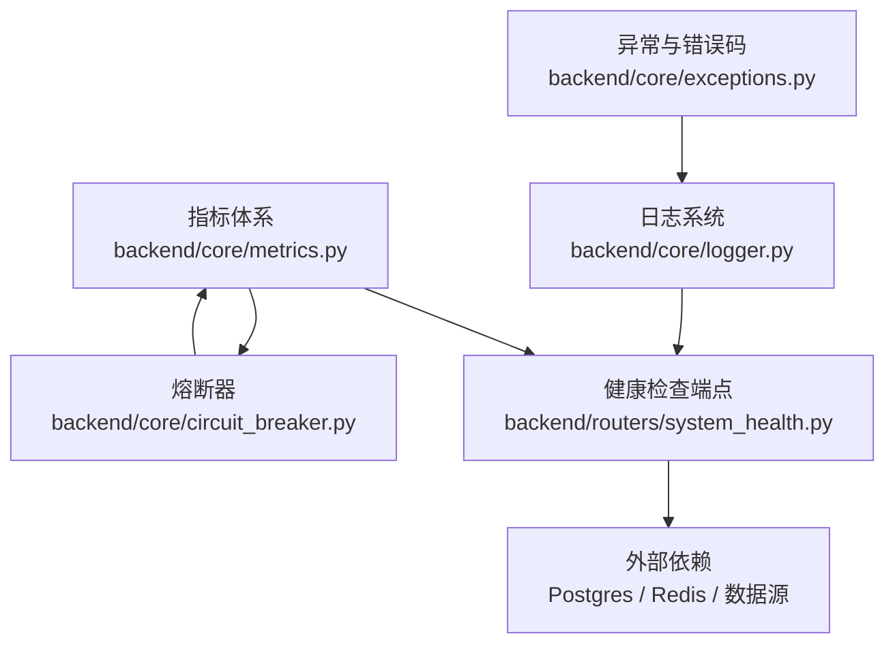
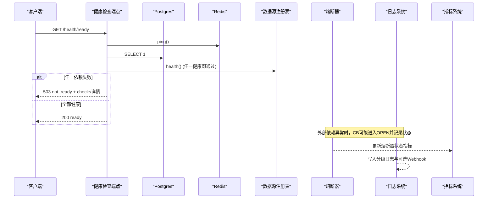
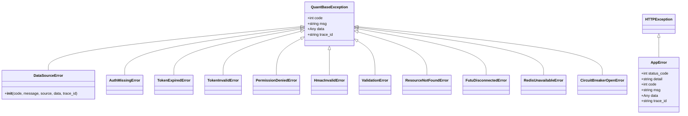
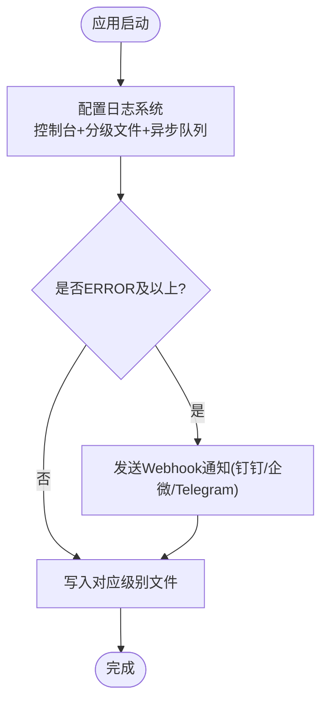
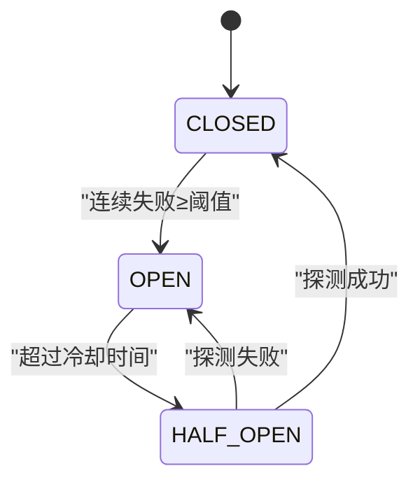
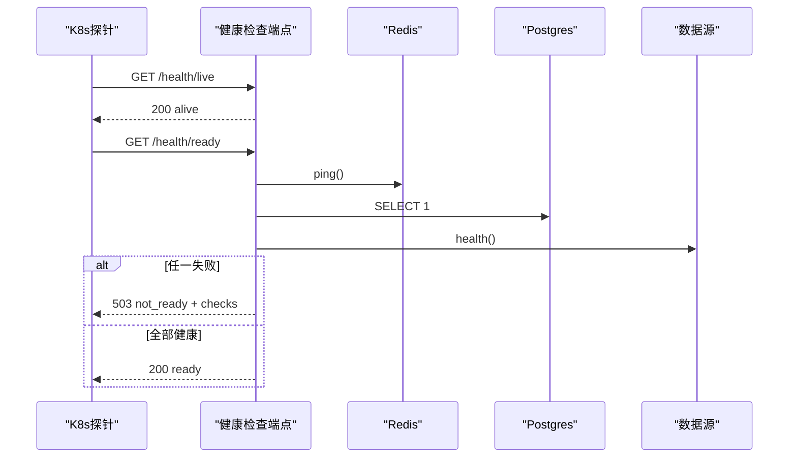
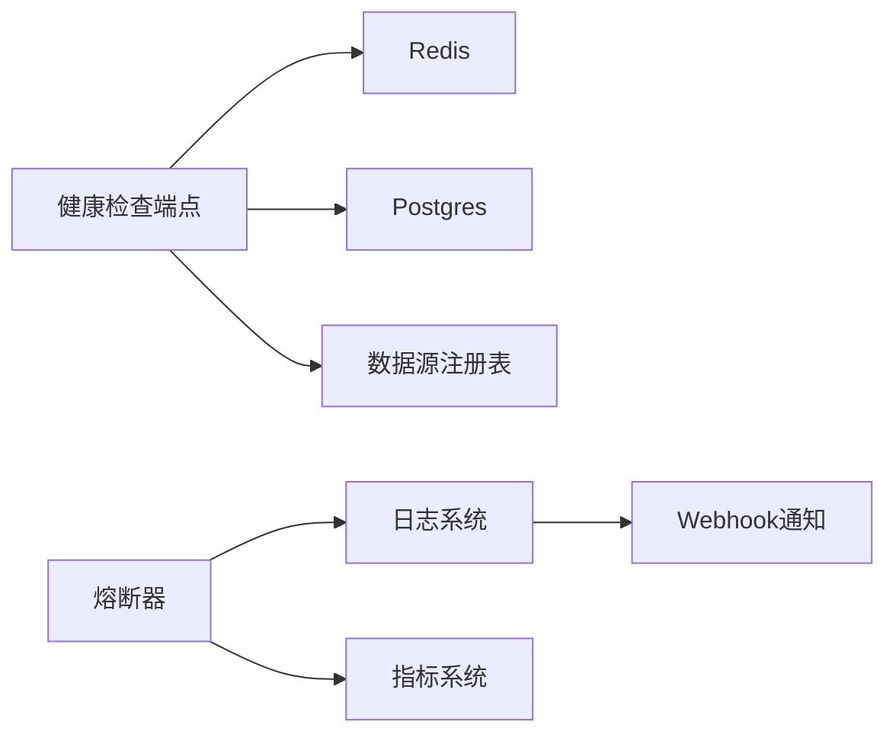

# 故障排查指南

<cite>
**本文引用的文件**
- [backend/core/exceptions.py](file://backend/core/exceptions.py)
- [backend/core/error_codes.py](file://backend/core/error_codes.py)
- [backend/core/logger.py](file://backend/core/logger.py)
- [backend/core/metrics.py](file://backend/core/metrics.py)
- [backend/core/circuit_breaker.py](file://backend/core/circuit_breaker.py)
- [backend/routers/system_health.py](file://backend/routers/system_health.py)
</cite>

## 目录
1. [引言](#引言)
2. [项目结构](#项目结构)
3. [核心组件](#核心组件)
4. [架构总览](#架构总览)
5. [详细组件分析](#详细组件分析)
6. [依赖关系分析](#依赖关系分析)
7. [性能与稳定性考量](#性能与稳定性考量)
8. [故障排查手册](#故障排查手册)
9. [监控告警系统排查](#监控告警系统排查)
10. [生产应急处理流程](#生产应急处理流程)
11. [故障复盘与持续改进](#故障复盘与持续改进)
12. [结论](#结论)

## 引言
本指南面向Quant Agent在生产环境中的故障定位与恢复，覆盖数据源连接失败、行情延迟过高、内存/线程资源耗尽、服务不可用等典型问题；提供日志分析、异常堆栈追踪、调用链观测的方法论；给出从问题发现、信息收集、根因分析到解决方案制定的标准流程；并涵盖监控告警系统自身的问题诊断与生产应急策略。

## 项目结构
围绕可观测性与稳定性保障，后端关键能力集中在以下模块：
- 异常与错误码：统一异常类型与HTTP状态映射，便于上层快速识别问题域
- 日志系统：结构化输出、分级落盘、异步队列、严重错误Webhook报警
- 指标体系：Prometheus指标定义（行情延迟、Redis队列、熔断器状态、节点心跳等）
- 熔断器：保护外部依赖，避免雪崩，支持半开探测与限流错误过滤
- 健康检查：liveness/readiness/deep探针，聚合PG、Redis、数据源、采集器心跳等

**图表来源**
- [backend/core/exceptions.py:14-144](file://backend/core/exceptions.py#L14-L144)
- [backend/core/logger.py:129-211](file://backend/core/logger.py#L129-L211)
- [backend/core/metrics.py:24-217](file://backend/core/metrics.py#L24-L217)
- [backend/core/circuit_breaker.py:64-359](file://backend/core/circuit_breaker.py#L64-L359)
- [backend/routers/system_health.py:173-355](file://backend/routers/system_health.py#L173-L355)

**章节来源**
- [backend/core/exceptions.py:14-144](file://backend/core/exceptions.py#L14-L144)
- [backend/core/logger.py:129-211](file://backend/core/logger.py#L129-L211)
- [backend/core/metrics.py:24-217](file://backend/core/metrics.py#L24-L217)
- [backend/core/circuit_breaker.py:64-359](file://backend/core/circuit_breaker.py#L64-L359)
- [backend/routers/system_health.py:173-355](file://backend/routers/system_health.py#L173-L355)

## 核心组件
- 异常与错误码
  - 统一基类与业务异常族，携带code/msg/data/trace_id，便于全局处理器标准化返回
  - 错误码枚举与HTTP状态映射，确保API层一致的错误语义
- 日志系统
  - 控制台高亮、分级文件落盘、异步队列分发、按天切割与清理
  - 严重错误Webhook通知（钉钉/企微/Telegram等），不阻塞主流程
- 指标体系
  - 行情延迟、WebSocket连接数、Redis队列深度、熔断器状态、数据源可用性、数据质量、分布式节点心跳等
- 熔断器
  - CLOSED/OPEN/HALF_OPEN三态机，支持限流错误过滤、手动记录成功/失败、状态快照
- 健康检查
  - liveness/readiness/deep三类探针，聚合PG连通性、数据源就绪、采集器心跳、事件循环延迟、线程池使用率等

**章节来源**
- [backend/core/exceptions.py:14-144](file://backend/core/exceptions.py#L14-L144)
- [backend/core/error_codes.py:15-54](file://backend/core/error_codes.py#L15-L54)
- [backend/core/logger.py:129-211](file://backend/core/logger.py#L129-L211)
- [backend/core/metrics.py:24-217](file://backend/core/metrics.py#L24-L217)
- [backend/core/circuit_breaker.py:64-359](file://backend/core/circuit_breaker.py#L64-L359)
- [backend/routers/system_health.py:173-355](file://backend/routers/system_health.py#L173-L355)

## 架构总览
下图展示“请求→健康检查→外部依赖”的故障定位路径，以及日志、指标、熔断器的协同作用。

**图表来源**
- [backend/routers/system_health.py:197-246](file://backend/routers/system_health.py#L197-L246)
- [backend/core/circuit_breaker.py:147-218](file://backend/core/circuit_breaker.py#L147-L218)
- [backend/core/logger.py:129-211](file://backend/core/logger.py#L129-L211)
- [backend/core/metrics.py:100-110](file://backend/core/metrics.py#L100-L110)

## 详细组件分析

### 异常与错误码
- 设计要点
  - 所有业务异常继承统一基类，携带code/msg/data/trace_id，便于统一响应格式与追踪
  - DataSourceError兼容历史message/source字段，便于迁移期兼容
  - 错误码枚举集中管理，并提供HTTP状态映射，保证API一致性
- 常见场景
  - 认证鉴权失败（Token缺失/过期/无效、权限不足、HMAC校验失败）
  - 请求参数或资源问题（校验失败、资源不存在）
  - 基础设施异常（Futu断开、Redis不可用、熔断器打开）

**图表来源**
- [backend/core/exceptions.py:14-144](file://backend/core/exceptions.py#L14-L144)

**章节来源**
- [backend/core/exceptions.py:14-144](file://backend/core/exceptions.py#L14-L144)
- [backend/core/error_codes.py:15-54](file://backend/core/error_codes.py#L15-L54)

### 日志系统
- 设计要点
  - 控制台高亮显示，分级文件持久化（debug/info/warning/error），按天切割并保留30天
  - 异步队列分发，避免I/O阻塞主流程
  - 严重错误自动发送Webhook通知，且具备降级兜底，防止报警链路影响主流程
- 使用建议
  - 通过统一logger实例记录结构化日志，结合trace_id进行跨组件追踪
  - 利用分级文件快速定位问题阶段（如error.log聚焦异常）

**图表来源**
- [backend/core/logger.py:129-211](file://backend/core/logger.py#L129-L211)

**章节来源**
- [backend/core/logger.py:129-211](file://backend/core/logger.py#L129-L211)

### 指标体系
- 关键指标
  - 行情延迟Summary、K线获取延迟Histogram、WebSocket连接数/消息数/丢弃数
  - Redis队列深度/操作延迟/错误计数
  - 熔断器状态与转换次数
  - 数据源可用性、主动拨测成功率/延迟/失败原因
  - 数据质量脏数据率、完整率、异常计数、平均延迟、等级
  - 分布式节点心跳、存活数量、YF/AKShare降级统计
  - 进程线程水位（主服务视角）
- 使用建议
  - 在关键路径埋点（数据源调用、缓存命中、WS推送、LLM调用等）
  - 配合Grafana面板与Prometheus规则实现阈值告警

**章节来源**
- [backend/core/metrics.py:24-217](file://backend/core/metrics.py#L24-L217)
- [backend/core/metrics.py:446-619](file://backend/core/metrics.py#L446-L619)

### 熔断器
- 状态机
  - CLOSED → OPEN：连续失败达到阈值
  - OPEN → HALF_OPEN：超过冷却时间后尝试探测
  - HALF_OPEN → CLOSED：探测成功；HALF_OPEN → OPEN：探测失败
- 特性
  - 支持限流错误过滤（不计入失败计数）
  - 暴露状态快照与手动重置接口，便于运维干预
  - 与指标系统联动，记录状态转换与当前状态

**图表来源**
- [backend/core/circuit_breaker.py:64-359](file://backend/core/circuit_breaker.py#L64-L359)

**章节来源**
- [backend/core/circuit_breaker.py:64-359](file://backend/core/circuit_breaker.py#L64-L359)

### 健康检查端点
- 三类探针
  - liveness：仅验证进程存活
  - readiness：验证Redis/PG/至少一个数据源连通
  - deep：全链路诊断，包含组件健康、数据源就绪、采集器心跳、WS连接、线程池、事件循环延迟、熔断器状态等
- 使用建议
  - K8s livenessProbe指向/live，readinessProbe指向/ready
  - 故障时优先查看/deep返回的checks与metrics快照

**图表来源**
- [backend/routers/system_health.py:173-246](file://backend/routers/system_health.py#L173-L246)

**章节来源**
- [backend/routers/system_health.py:173-355](file://backend/routers/system_health.py#L173-L355)

## 依赖关系分析
- 耦合关系
  - 健康检查端点依赖Redis、Postgres、数据源注册表
  - 熔断器依赖日志与指标系统，用于状态记录与告警
  - 日志系统独立于业务逻辑，通过异步队列降低对主流程的影响
- 潜在风险
  - 健康检查中若某依赖初始化失败，需确保探针具备降级与超时控制
  - 熔断器状态与指标需保持一致，避免误判

**图表来源**
- [backend/routers/system_health.py:197-246](file://backend/routers/system_health.py#L197-L246)
- [backend/core/circuit_breaker.py:147-218](file://backend/core/circuit_breaker.py#L147-L218)
- [backend/core/logger.py:129-211](file://backend/core/logger.py#L129-L211)

**章节来源**
- [backend/routers/system_health.py:197-246](file://backend/routers/system_health.py#L197-L246)
- [backend/core/circuit_breaker.py:147-218](file://backend/core/circuit_breaker.py#L147-L218)
- [backend/core/logger.py:129-211](file://backend/core/logger.py#L129-L211)

## 性能与稳定性考量
- 日志异步化：通过QueueListener将日志写入与网络请求放入后台线程，避免阻塞主事件循环
- 指标采样：使用Summary/Histogram/Gauge/Counter组合，兼顾精度与开销
- 熔断保护：对外部依赖进行快速失败与退避，防止级联故障
- 健康探针：分层检查，liveness轻量、readiness严格、deep详尽，适配不同场景

[本节为通用指导，无需特定文件引用]

## 故障排查手册

### 数据源连接失败
- 现象
  - 健康检查readiness返回not_ready，data_sources_detail显示具体源状态
  - 熔断器状态可能进入OPEN，指标DATASOURCE_AVAILABILITY=0
- 步骤
  1. 查看/deep的data_source_detail与collectors心跳
  2. 检查对应数据源的health()结果与错误信息
  3. 观察熔断器状态与转换指标，确认是否触发熔断
  4. 核对日志中DataSourceError与错误码，定位具体源与错误类型
  5. 必要时手动重置熔断器或调整冷却时间
- 参考
  - 健康检查数据源探测与readiness判定
  - 熔断器状态与限流错误过滤
  - 错误码与异常类型映射

**章节来源**
- [backend/routers/system_health.py:82-123](file://backend/routers/system_health.py#L82-L123)
- [backend/routers/system_health.py:197-246](file://backend/routers/system_health.py#L197-L246)
- [backend/core/circuit_breaker.py:147-218](file://backend/core/circuit_breaker.py#L147-L218)
- [backend/core/exceptions.py:32-51](file://backend/core/exceptions.py#L32-L51)
- [backend/core/error_codes.py:30-37](file://backend/core/error_codes.py#L30-L37)

### 行情延迟过高
- 现象
  - 行情延迟Summary分位数上升，WS消息丢弃计数器增加
  - 数据源延迟直方图右移，Redis队列深度升高
- 步骤
  1. 查看MARKET_QUOTE_LATENCY与MARKET_KLINE_FETCH_LATENCY分布
  2. 检查WS_SUBSCRIPTIONS与WS_MESSAGES_DROPPED，判断是否为背压导致
  3. 检查REDIS_QUEUE_DEPTH与REDIS_OPERATION_LATENCY，评估Redis瓶颈
  4. 核对数据源可用性指标与主动拨测延迟，定位慢源
  5. 结合日志与熔断器状态，判断是否触发熔断或限流
- 参考
  - 行情延迟与K线延迟指标定义
  - WebSocket指标与Redis指标
  - 数据源可用性与拨测指标

**章节来源**
- [backend/core/metrics.py:24-94](file://backend/core/metrics.py#L24-L94)
- [backend/core/metrics.py:156-217](file://backend/core/metrics.py#L156-L217)

### 内存溢出或线程耗尽
- 现象
  - 进程线程数接近或超过阈值，事件循环延迟升高
  - 日志中出现大量异常或GC频繁，服务响应变慢
- 步骤
  1. 查看PROCESS_THREAD_COUNT与MAIN_THREAD_WARN阈值
  2. 检查事件循环延迟_event_loop_lag_seconds_，评估拥塞程度
  3. 审查长时间运行的任务与未释放的资源（如WS连接、数据库连接）
  4. 结合日志定位异常热点，必要时重启或扩容
- 参考
  - 进程线程水位指标与刷新函数
  - 健康检查中的事件循环延迟测量

**章节来源**
- [backend/core/metrics.py:601-619](file://backend/core/metrics.py#L601-L619)
- [backend/routers/system_health.py:126-131](file://backend/routers/system_health.py#L126-L131)

### 服务不可用
- 现象
  - /health/ready返回503，checks中某依赖disconnected
  - 熔断器处于OPEN，指标CIRCUIT_BREAKER_STATE=2
- 步骤
  1. 查看/deep的components与data_source_detail
  2. 检查Redis/PG连通性与数据源健康
  3. 确认熔断器状态，必要时手动reset
  4. 核对日志中的异常堆栈与错误码，定位根因
- 参考
  - 健康检查readiness与deep
  - 熔断器状态与手动重置

**章节来源**
- [backend/routers/system_health.py:197-355](file://backend/routers/system_health.py#L197-L355)
- [backend/core/circuit_breaker.py:326-359](file://backend/core/circuit_breaker.py#L326-L359)

### 日志分析与异常追踪
- 结构化日志查询
  - 使用分级文件快速定位问题阶段（error.log聚焦异常）
  - 结合trace_id跨组件追踪调用链
- 异常堆栈分析
  - 关注DataSourceError、RedisUnavailableError、CircuitBreakerOpenError等
  - 对照错误码确定问题域（认证/请求/基础设施）
- 调用链追踪
  - 通过健康检查/deep与指标快照还原调用路径
  - 结合熔断器状态与转换指标判断保护机制是否生效

**章节来源**
- [backend/core/logger.py:129-211](file://backend/core/logger.py#L129-L211)
- [backend/core/exceptions.py:14-144](file://backend/core/exceptions.py#L14-L144)
- [backend/core/error_codes.py:15-54](file://backend/core/error_codes.py#L15-L54)

## 监控告警系统排查

### 指标缺失
- 可能原因
  - 埋点未执行或模块未加载
  - Prometheus抓取配置不正确
  - Basic Auth认证失败导致/metrics不可访问
- 步骤
  1. 确认/metrics端点可访问（Basic Auth凭据正确）
  2. 检查对应模块是否已导入并执行埋点
  3. 核对Prometheus job配置与目标地址
- 参考
  - metrics端点与Basic Auth验证

**章节来源**
- [backend/routers/system_health.py:31-56](file://backend/routers/system_health.py#L31-L56)

### 告警失效
- 可能原因
  - Prometheus规则未加载或表达式错误
  - 指标值未更新（无流量或埋点未触发）
  - 阈值设置不合理
- 步骤
  1. 检查Prometheus rules文件是否挂载并生效
  2. 在Grafana中验证指标是否存在且数值合理
  3. 调整阈值或补充埋点，确保告警条件可达
- 参考
  - 指标定义与用途（行情延迟、数据源可用性、熔断器状态等）

**章节来源**
- [backend/core/metrics.py:24-217](file://backend/core/metrics.py#L24-L217)

### 通知失败
- 可能原因
  - Webhook URL配置错误或网络不通
  - 通知平台限流或鉴权失败
  - 日志Webhook处理器异常被吞掉（降级兜底）
- 步骤
  1. 检查ALERT_WEBHOOK_URL环境变量与网络连通性
  2. 查看error.log中是否有Webhook发送失败的痕迹
  3. 临时关闭Webhook，改用其他通道（邮件/短信）
- 参考
  - WebhookAlertHandler实现与降级逻辑

**章节来源**
- [backend/core/logger.py:89-127](file://backend/core/logger.py#L89-L127)

## 生产应急处理流程

### 快速恢复
- 优先恢复服务可用性
  - 重启卡死进程或扩容副本
  - 重置熔断器以恢复对外部依赖的调用
  - 切换备用数据源或降级至缓存
- 参考
  - 熔断器手动重置与健康检查探针

**章节来源**
- [backend/core/circuit_breaker.py:326-359](file://backend/core/circuit_breaker.py#L326-L359)
- [backend/routers/system_health.py:173-246](file://backend/routers/system_health.py#L173-L246)

### 降级策略
- 数据源降级
  - 多源融合时选择新鲜度最高的源作为主源
  - 当主源不可用时，回退至STALE缓存或次优源
- 实时价降级
  - WS未命中时走REST快照，提升可用性
- 参考
  - 数据源可用性指标与主动拨测指标
  - 健康检查中的数据源探测逻辑

**章节来源**
- [backend/core/metrics.py:156-217](file://backend/core/metrics.py#L156-L217)
- [backend/routers/system_health.py:82-123](file://backend/routers/system_health.py#L82-L123)

### 数据补偿
- 补采与回放
  - 针对丢失的行情或K线，使用历史数据源进行补采
  - 通过数据湖快照版本化进行回滚与对比
- 参考
  - 数据湖快照指标与保留策略

**章节来源**
- [backend/core/metrics.py:360-380](file://backend/core/metrics.py#L360-L380)

## 故障复盘与持续改进
- 复盘要素
  - 问题时间线与影响范围
  - 根因分析与证据链（日志、指标、健康检查）
  - 应急措施有效性评估
  - 改进项与责任人
- 持续改进
  - 完善埋点与告警规则
  - 优化熔断参数与冷却时间
  - 加强健康检查覆盖度与探针粒度
  - 定期演练应急预案

[本节为通用方法论，无需特定文件引用]

## 结论
通过统一的异常与错误码、结构化日志、丰富的指标体系、熔断保护与健康检查，Quant Agent构建了完整的故障定位与恢复能力。生产环境中应充分利用健康探针与指标面板快速发现问题，结合日志与熔断器状态精准定位根因，并依据降级与补偿策略快速恢复服务。持续复盘与改进将进一步提升系统稳定性与可维护性。
