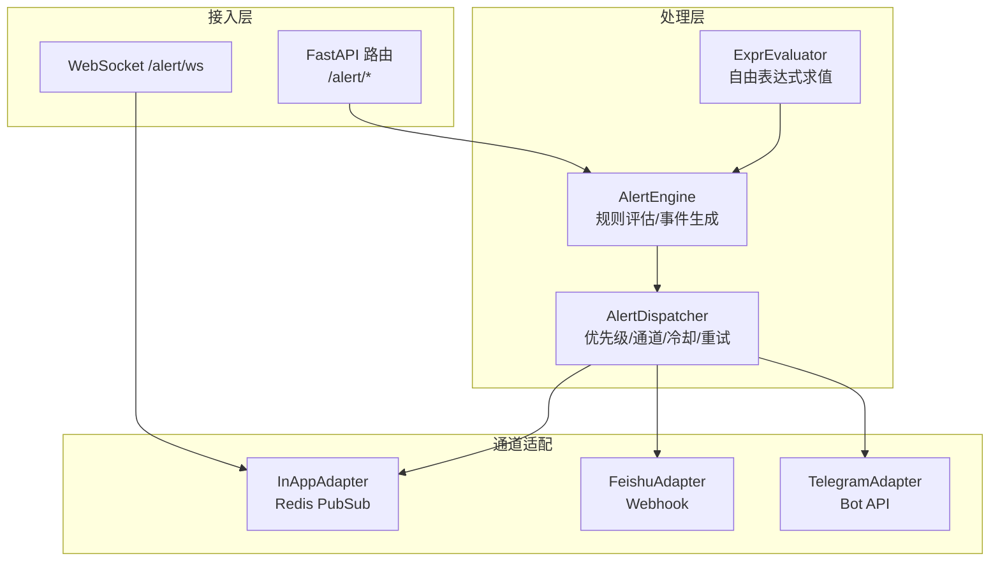
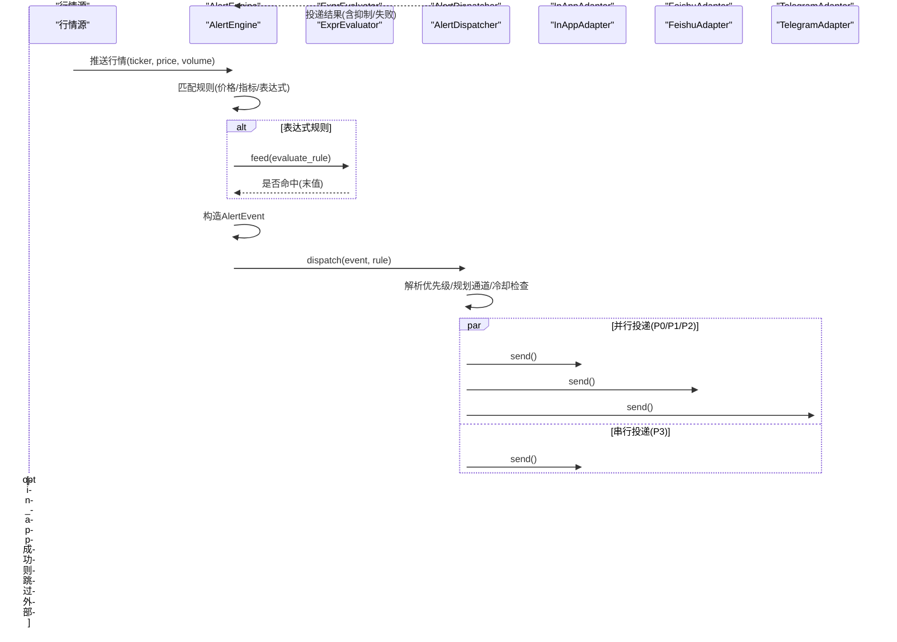
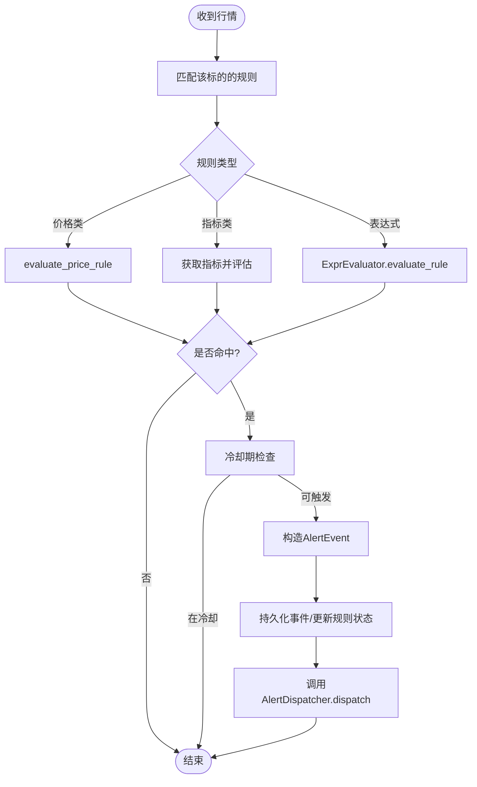
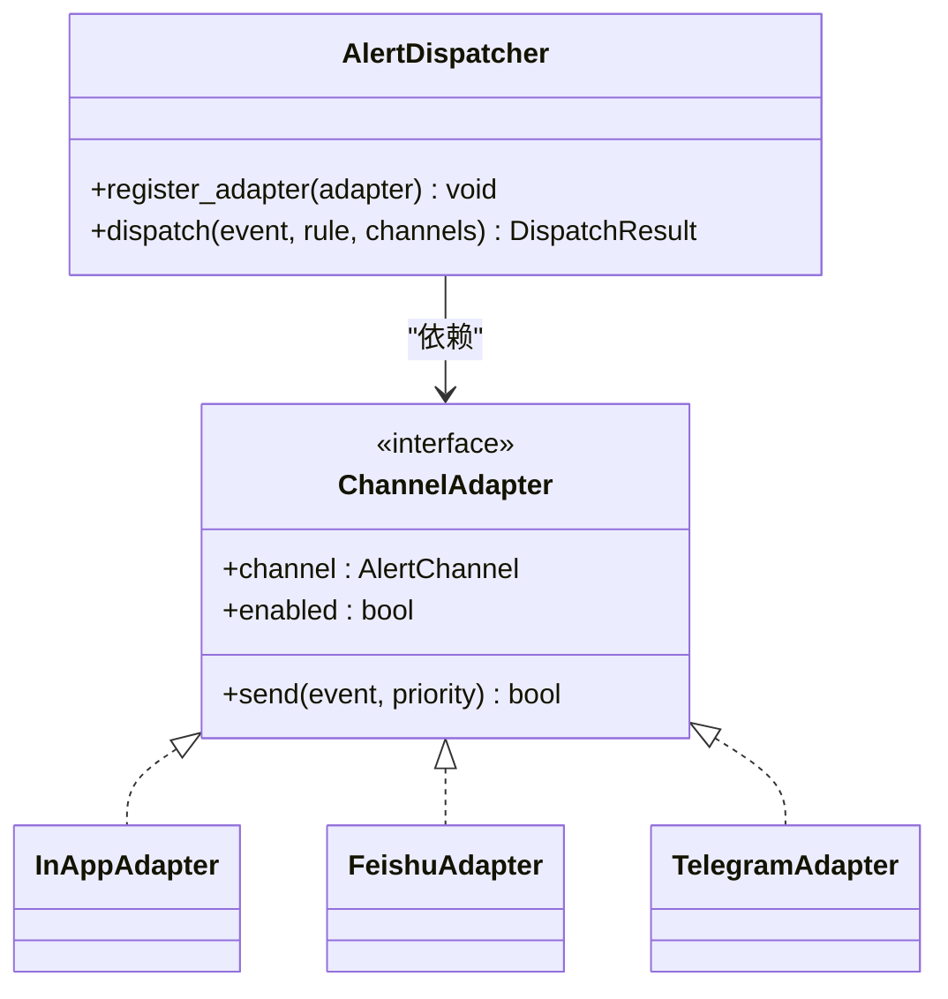
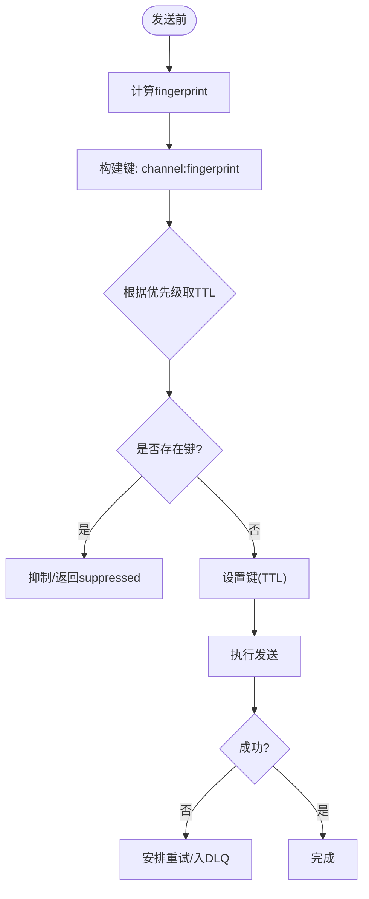
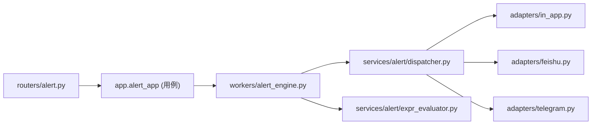

# 告警管理

<cite>
**本文引用的文件**
- [backend/routers/alert.py](file://backend/routers/alert.py)
- [backend/services/alert/dispatcher.py](file://backend/services/alert/dispatcher.py)
- [backend/services/alert/notification.py](file://backend/services/alert/notification.py)
- [backend/services/alert/expr_evaluator.py](file://backend/services/alert/expr_evaluator.py)
- [backend/core/alert_models.py](file://backend/core/alert_models.py)
- [backend/workers/alert_engine.py](file://backend/workers/alert_engine.py)
- [backend/services/alert_adapters/feishu.py](file://backend/services/alert_adapters/feishu.py)
- [backend/services/alert_adapters/telegram.py](file://backend/services/alert_adapters/telegram.py)
- [backend/services/alert_adapters/in_app.py](file://backend/services/alert_adapters/in_app.py)
</cite>

## 目录
1. [简介](#简介)
2. [项目结构](#项目结构)
3. [核心组件](#核心组件)
4. [架构总览](#架构总览)
5. [详细组件分析](#详细组件分析)
6. [依赖关系分析](#依赖关系分析)
7. [性能与扩展性](#性能与扩展性)
8. [故障排查指南](#故障排查指南)
9. [结论](#结论)
10. [附录：配置与使用示例](#附录配置与使用示例)

## 简介
本文件为 Quant Agent 数据质量告警管理系统的技术文档，聚焦告警触发机制、规则评估、多通道推送、消息模板、去重与限流、历史查询与管理界面、以及扩展与第三方集成方案。系统通过统一的 AlertDispatcher 作为通知唯一出口，结合 Redis 实现实时推送、冷却去重与重试，并支持飞书、Telegram 等外部渠道。

## 项目结构
后端告警子系统由“路由层 + 引擎 + 表达式求值 + 调度器 + 适配器”构成：
- 路由层：提供 REST API 与 WebSocket 实时推送入口
- 引擎：订阅行情流，评估价格/指标/自由表达式规则，生成事件
- 表达式求值：与前端一致的布尔表达式引擎，用于复杂条件组合
- 调度器：优先级解析、通道规划、冷却门控、重试与投递记录
- 适配器：应用内（Redis PubSub）、飞书、Telegram 等推送通道

图表来源
- [backend/routers/alert.py:57-132](file://backend/routers/alert.py#L57-L132)
- [backend/workers/alert_engine.py:53-83](file://backend/workers/alert_engine.py#L53-L83)
- [backend/services/alert/dispatcher.py:357-461](file://backend/services/alert/dispatcher.py#L357-L461)
- [backend/services/alert/expr_evaluator.py:659-733](file://backend/services/alert/expr_evaluator.py#L659-L733)
- [backend/services/alert_adapters/in_app.py:27-78](file://backend/services/alert_adapters/in_app.py#L27-L78)
- [backend/services/alert_adapters/feishu.py:27-133](file://backend/services/alert_adapters/feishu.py#L27-L133)
- [backend/services/alert_adapters/telegram.py:25-101](file://backend/services/alert_adapters/telegram.py#L25-L101)

章节来源
- [backend/routers/alert.py:57-132](file://backend/routers/alert.py#L57-L132)
- [backend/workers/alert_engine.py:53-83](file://backend/workers/alert_engine.py#L53-L83)

## 核心组件
- 规则与事件模型：定义规则类型、严重程度、通知优先级、推送通道及事件字段
- 告警引擎：加载规则、订阅行情、评估规则、生成事件、持久化与推送
- 表达式求值器：与前端对齐的自由布尔表达式求值，支持常用技术指标函数
- 统一调度器：优先级解析、通道计划、冷却去重、重试队列、投递记录
- 通知服务：向后兼容的薄包装，将系统通知转为事件经调度器派发
- 通道适配器：InApp（Redis PubSub）、飞书 Webhook、Telegram Bot

章节来源
- [backend/core/alert_models.py:28-142](file://backend/core/alert_models.py#L28-L142)
- [backend/workers/alert_engine.py:89-247](file://backend/workers/alert_engine.py#L89-L247)
- [backend/services/alert/expr_evaluator.py:436-733](file://backend/services/alert/expr_evaluator.py#L436-L733)
- [backend/services/alert/dispatcher.py:66-157](file://backend/services/alert/dispatcher.py#L66-L157)
- [backend/services/alert/notification.py:19-73](file://backend/services/alert/notification.py#L19-L73)
- [backend/services/alert_adapters/in_app.py:27-78](file://backend/services/alert_adapters/in_app.py#L27-L78)
- [backend/services/alert_adapters/feishu.py:27-133](file://backend/services/alert_adapters/feishu.py#L27-L133)
- [backend/services/alert_adapters/telegram.py:25-101](file://backend/services/alert_adapters/telegram.py#L25-L101)

## 架构总览
下图展示从行情到达至多渠道推送的完整流程，包括规则评估、事件生成、优先级与通道决策、冷却与重试、以及投递记录。

图表来源
- [backend/workers/alert_engine.py:137-247](file://backend/workers/alert_engine.py#L137-L247)
- [backend/services/alert/expr_evaluator.py:698-733](file://backend/services/alert/expr_evaluator.py#L698-L733)
- [backend/services/alert/dispatcher.py:396-461](file://backend/services/alert/dispatcher.py#L396-L461)
- [backend/services/alert_adapters/in_app.py:41-66](file://backend/services/alert_adapters/in_app.py#L41-L66)
- [backend/services/alert_adapters/feishu.py:46-96](file://backend/services/alert_adapters/feishu.py#L46-L96)
- [backend/services/alert_adapters/telegram.py:44-83](file://backend/services/alert_adapters/telegram.py#L44-L83)

## 详细组件分析

### 告警触发机制与规则评估
- 价格类规则：上穿/下穿、高于/低于阈值、涨跌幅、成交量突增
- 指标类规则：RSI 超买/超卖、MACD 金叉/死叉、均线穿越
- 自由表达式规则：基于前端一致语义的布尔表达式，支持 MA/EMA/RSI/MACD/KDJ/BOLL 等函数与比较/逻辑运算
- 评估流程：按 ticker 匹配规则 → 冷却期检查 → 计算指标或表达式 → 命中则生成事件 → 写入事件列表 → 调用调度器推送

图表来源
- [backend/workers/alert_engine.py:137-247](file://backend/workers/alert_engine.py#L137-L247)
- [backend/core/alert_models.py:149-278](file://backend/core/alert_models.py#L149-L278)
- [backend/services/alert/expr_evaluator.py:698-733](file://backend/services/alert/expr_evaluator.py#L698-L733)

章节来源
- [backend/workers/alert_engine.py:137-247](file://backend/workers/alert_engine.py#L137-L247)
- [backend/core/alert_models.py:149-278](file://backend/core/alert_models.py#L149-L278)
- [backend/services/alert/expr_evaluator.py:698-733](file://backend/services/alert/expr_evaluator.py#L698-L733)

### set_alert_callback 设计与集成外部渠道
- 设计模式：AlertEngine 暴露 register_push(channel, callback) 以注册通道回调；ALERT-03 后统一走 AlertDispatcher，旧回调作为降级路径
- 外部渠道集成：通过实现 ChannelAdapter 协议（channel、enabled、send）并注册到 AlertDispatcher，即可接入新渠道
- 现有适配器：InApp（Redis PubSub）、Feishu（Webhook）、Telegram（Bot API），均遵循同一接口

图表来源
- [backend/services/alert/dispatcher.py:47-58](file://backend/services/alert/dispatcher.py#L47-L58)
- [backend/services/alert/dispatcher.py:380-383](file://backend/services/alert/dispatcher.py#L380-L383)
- [backend/services/alert_adapters/in_app.py:27-78](file://backend/services/alert_adapters/in_app.py#L27-L78)
- [backend/services/alert_adapters/feishu.py:27-133](file://backend/services/alert_adapters/feishu.py#L27-L133)
- [backend/services/alert_adapters/telegram.py:25-101](file://backend/services/alert_adapters/telegram.py#L25-L101)
- [backend/workers/alert_engine.py:129-132](file://backend/workers/alert_engine.py#L129-L132)

章节来源
- [backend/workers/alert_engine.py:129-132](file://backend/workers/alert_engine.py#L129-L132)
- [backend/services/alert/dispatcher.py:47-58](file://backend/services/alert/dispatcher.py#L47-L58)
- [backend/services/alert/dispatcher.py:380-383](file://backend/services/alert/dispatcher.py#L380-L383)

### 告警消息格式与模板
- 事件字段：event_id、rule_id、ticker、rule_type、severity、message、trigger_value、threshold、channels、triggered_at、acknowledged、metadata、source、priority、ui_hint
- InApp 消息：包含 type、event_id、priority、severity、message、ticker、triggered_at、ui_hint、rule_id、source、ack_required
- 飞书消息：P0/P1 使用卡片消息（interactive），P2/P3 使用纯文本；支持签名校验
- Telegram 消息：HTML 格式，P3 静默推送

章节来源
- [backend/core/alert_models.py:112-142](file://backend/core/alert_models.py#L112-L142)
- [backend/services/alert_adapters/in_app.py:41-78](file://backend/services/alert_adapters/in_app.py#L41-L78)
- [backend/services/alert_adapters/feishu.py:98-133](file://backend/services/alert_adapters/feishu.py#L98-L133)
- [backend/services/alert_adapters/telegram.py:85-101](file://backend/services/alert_adapters/telegram.py#L85-L101)

### 告警去重与频率控制
- 通道级冷却：基于 fingerprint（source + rule_id + ticker + severity）+ channel 维度，不同优先级对应不同 TTL
- 优先级与冷却：P0 60s、P1/P2 300s、P3 900s；in_app 不受冷却限制
- 规则级冷却：last_triggered_at + cooldown_seconds 防止频繁触发
- 重试与死信：按优先级退避重试，超过上限进入 DLQ（Redis List）

图表来源
- [backend/services/alert/dispatcher.py:164-219](file://backend/services/alert/dispatcher.py#L164-L219)
- [backend/services/alert/dispatcher.py:267-345](file://backend/services/alert/dispatcher.py#L267-L345)
- [backend/workers/alert_engine.py:186-205](file://backend/workers/alert_engine.py#L186-L205)

章节来源
- [backend/services/alert/dispatcher.py:164-219](file://backend/services/alert/dispatcher.py#L164-L219)
- [backend/services/alert/dispatcher.py:267-345](file://backend/services/alert/dispatcher.py#L267-L345)
- [backend/workers/alert_engine.py:186-205](file://backend/workers/alert_engine.py#L186-L205)

### 告警历史查询与管理界面
- REST API：创建/查询/更新/删除规则；查询事件历史（支持 ticker、severity、since 分页补拉）；确认事件；查询事件投递记录；查询引擎状态
- WebSocket：/alert/ws 实时推送，支持鉴权与心跳；断连后可用 since 参数补拉历史事件
- 存储：事件最近 1000 条存储在 Redis List；规则状态持久化在 Redis Hash

章节来源
- [backend/routers/alert.py:57-132](file://backend/routers/alert.py#L57-L132)
- [backend/routers/alert.py:148-211](file://backend/routers/alert.py#L148-L211)
- [backend/workers/alert_engine.py:47-51](file://backend/workers/alert_engine.py#L47-L51)
- [backend/workers/alert_engine.py:207-210](file://backend/workers/alert_engine.py#L207-L210)

### 自定义告警逻辑与数据质量告警
- 自由表达式：通过 EXPR 规则类型，使用与前端一致的表达式语法，支持复杂条件组合
- 指标规则：RSI/MACD/MA 穿越等，通过 IndicatorEvaluator 获取指标并评估
- 数据质量告警：可在业务侧构造 AlertEvent 并通过 NotificationService.send_alert 或 AlertDispatcher.dispatch 统一派发，便于复用冷却、优先级与通道能力

章节来源
- [backend/services/alert/expr_evaluator.py:436-733](file://backend/services/alert/expr_evaluator.py#L436-L733)
- [backend/workers/alert_engine.py:220-302](file://backend/workers/alert_engine.py#L220-L302)
- [backend/services/alert/notification.py:37-73](file://backend/services/alert/notification.py#L37-L73)

## 依赖关系分析
- 路由层依赖 app.alert_app 中的用例函数（路由仅做请求校验与映射）
- 引擎依赖 AlertDispatcher、IndicatorEvaluator、ExprEvaluator
- 调度器依赖各 ChannelAdapter 实现
- 适配器依赖 httpx/redis 等外部库

图表来源
- [backend/routers/alert.py:20-40](file://backend/routers/alert.py#L20-L40)
- [backend/workers/alert_engine.py:42-43](file://backend/workers/alert_engine.py#L42-L43)
- [backend/services/alert/dispatcher.py:357-383](file://backend/services/alert/dispatcher.py#L357-L383)

章节来源
- [backend/routers/alert.py:20-40](file://backend/routers/alert.py#L20-L40)
- [backend/workers/alert_engine.py:42-43](file://backend/workers/alert_engine.py#L42-L43)
- [backend/services/alert/dispatcher.py:357-383](file://backend/services/alert/dispatcher.py#L357-L383)

## 性能与扩展性
- 性能特性
  - 表达式求值采用矢量化 numpy 计算，避免 Python 级循环
  - 高优先级通道并行投递，低优先级串行并在 in_app 成功后跳过外部通道
  - 冷却门控基于 Redis 键空间，跨进程共享，避免重复推送
  - 重试采用指数退避，超限进入 DLQ，降低瞬时压力
- 扩展性设计
  - 新增通道：实现 ChannelAdapter 协议并注册到 AlertDispatcher
  - 新增规则类型：在引擎中增加评估分支，或通过 EXPR 表达式覆盖复杂场景
  - 通知服务：NotificationService 作为薄包装，便于系统级通知统一派发

章节来源
- [backend/services/alert/expr_evaluator.py:436-651](file://backend/services/alert/expr_evaluator.py#L436-L651)
- [backend/services/alert/dispatcher.py:417-454](file://backend/services/alert/dispatcher.py#L417-L454)
- [backend/services/alert/dispatcher.py:267-345](file://backend/services/alert/dispatcher.py#L267-L345)
- [backend/services/alert/notification.py:19-73](file://backend/services/alert/notification.py#L19-L73)

## 故障排查指南
- WebSocket 连接失败
  - 检查 token 是否携带且有效；服务端会关闭无效或过期 token 的连接
  - 若 Redis 订阅失败，连接保持但无推送，可通过 GET /events?since= 补拉
- 飞书/Telegram 推送失败
  - 检查 webhook URL/Bot Token/Chat ID 配置是否正确
  - 关注速率限制（如 429/11232）与超时错误，系统会标记可重试
- 事件未触发
  - 检查规则是否启用、冷却期是否生效、指标/表达式是否满足条件
  - 查看事件列表与投递记录定位问题
- 投递记录查询
  - 通过 /alert/events/{event_id}/deliveries 查看各通道投递状态与错误信息

章节来源
- [backend/routers/alert.py:148-211](file://backend/routers/alert.py#L148-L211)
- [backend/services/alert_adapters/feishu.py:46-96](file://backend/services/alert_adapters/feishu.py#L46-L96)
- [backend/services/alert_adapters/telegram.py:44-83](file://backend/services/alert_adapters/telegram.py#L44-L83)
- [backend/services/alert/dispatcher.py:529-556](file://backend/services/alert/dispatcher.py#L529-L556)

## 结论
本系统以统一调度为核心，实现了灵活可扩展的告警机制：支持价格/指标/表达式多种规则类型，具备优先级路由、通道级冷却与重试、投递记录可观测等能力。通过适配器模式轻松集成飞书、Telegram 等外部渠道，并提供完善的 REST/WS 接口用于规则管理与事件查询。对于数据质量告警，可直接复用该体系进行快速落地。

## 附录：配置与使用示例
- 创建价格类规则（示例字段）
  - rule_type: price_above/price_below/price_cross/pct_change/volume_surge
  - threshold: 阈值（百分比或倍数依类型而定）
  - channels: [in_app, feishu, telegram]
  - cooldown_seconds: 冷却时间
- 创建指标类规则（示例字段）
  - rule_type: rsi_threshold/macd_cross/ma_cross
  - metadata: direction、short_period/long_period 等
- 创建表达式规则（示例字段）
  - rule_type: expr
  - metadata.expr: 布尔表达式字符串
  - metadata.expr_params: 参数名到数值的映射
- 发送系统通知（示例）
  - 使用 NotificationService.send_alert(message, priority, source) 统一派发
- 查询与确认
  - GET /alert/rules、GET /alert/events、POST /alert/events/{id}/ack
  - GET /alert/engine/status、GET /alert/events/{id}/deliveries

章节来源
- [backend/core/alert_models.py:28-142](file://backend/core/alert_models.py#L28-L142)
- [backend/routers/alert.py:57-132](file://backend/routers/alert.py#L57-L132)
- [backend/services/alert/notification.py:37-73](file://backend/services/alert/notification.py#L37-L73)