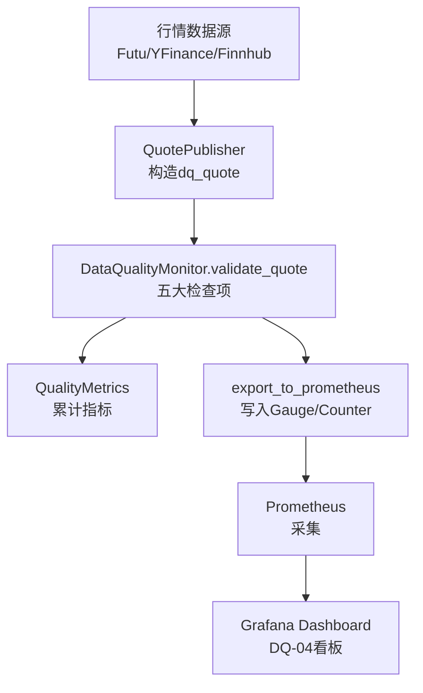
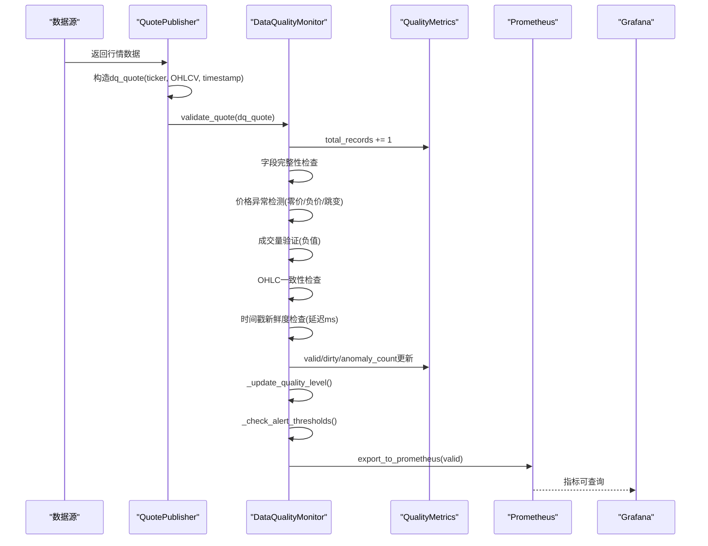
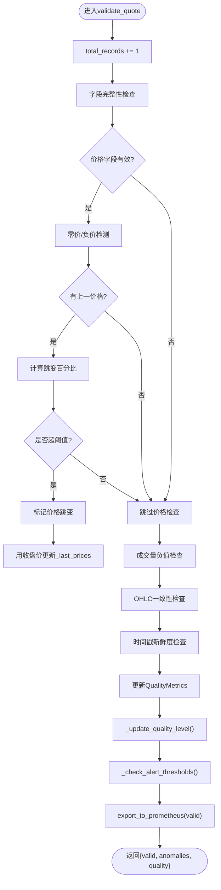
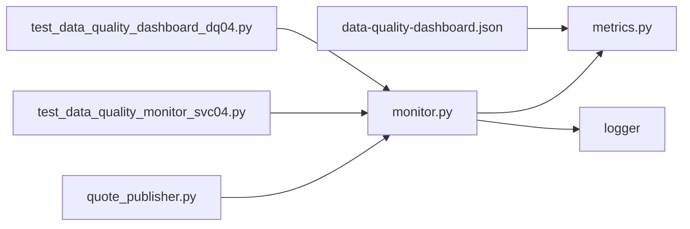

# 实时监控机制

<cite>
**本文引用的文件**
- [monitor.py](file://backend/services/data_quality/monitor.py)
- [metrics.py](file://backend/core/metrics.py)
- [quote_publisher.py](file://backend/workers/quote_publisher.py)
- [test_data_quality_monitor_svc04.py](file://backend/tests/test_data_quality_monitor_svc04.py)
- [test_data_quality_dashboard_dq04.py](file://backend/tests/test_data_quality_dashboard_dq04.py)
- [data-quality-dashboard.json](file://grafana/provisioning/dashboards/data-quality-dashboard.json)
</cite>

## 目录
1. [简介](#简介)
2. [项目结构](#项目结构)
3. [核心组件](#核心组件)
4. [架构总览](#架构总览)
5. [详细组件分析](#详细组件分析)
6. [依赖关系分析](#依赖关系分析)
7. [性能考量](#性能考量)
8. [故障排查指南](#故障排查指南)
9. [结论](#结论)
10. [附录：API与集成示例](#附录api与集成示例)

## 简介
本文件面向Quant Agent的实时数据质量监控机制，聚焦DataQualityMonitor类的设计、工作流程与五大核心检查项（字段完整性、价格异常检测、成交量验证、OHLC一致性、时间戳新鲜度），并说明状态管理（_last_prices、_consecutive_stale）与Prometheus指标导出机制。同时提供在数据管道中嵌入质量监控的完整调用示例与最佳实践建议。

## 项目结构
- 数据质量监控核心实现位于后端服务层：backend/services/data_quality/monitor.py
- Prometheus指标定义位于后端核心模块：backend/core/metrics.py
- 实时行情生产者将质量校验嵌入数据流：backend/workers/quote_publisher.py
- 单元测试覆盖校验逻辑与指标导出：backend/tests/test_data_quality_monitor_svc04.py、backend/tests/test_data_quality_dashboard_dq04.py
- Grafana看板配置用于可视化监控指标：grafana/provisioning/dashboards/data-quality-dashboard.json

图表来源
- [quote_publisher.py:107-131](file://backend/workers/quote_publisher.py#L107-L131)
- [monitor.py:112-256](file://backend/services/data_quality/monitor.py#L112-L256)
- [metrics.py:386-444](file://backend/core/metrics.py#L386-L444)
- [data-quality-dashboard.json:1-253](file://grafana/provisioning/dashboards/data-quality-dashboard.json#L1-L253)

章节来源
- [monitor.py:1-408](file://backend/services/data_quality/monitor.py#L1-L408)
- [metrics.py:386-444](file://backend/core/metrics.py#L386-L444)
- [quote_publisher.py:107-131](file://backend/workers/quote_publisher.py#L107-L131)
- [data-quality-dashboard.json:1-253](file://grafana/provisioning/dashboards/data-quality-dashboard.json#L1-L253)

## 核心组件
- DataQualityMonitor：单条行情数据的实时质量校验器，维护按数据源维度的质量指标与状态，并在每次校验后导出到Prometheus。
- QualityMetrics：聚合指标容器，包含脏数据率、完整率、延迟统计、异常计数等。
- AnomalyType/QualityLevel：枚举类型，描述异常类别与质量等级。
- get_quality_monitor/quality_overview：全局注册表与汇总接口，便于多数据源统一管理。

章节来源
- [monitor.py:26-99](file://backend/services/data_quality/monitor.py#L26-L99)
- [monitor.py:101-111](file://backend/services/data_quality/monitor.py#L101-L111)
- [monitor.py:384-408](file://backend/services/data_quality/monitor.py#L384-L408)

## 架构总览
DataQualityMonitor在实时数据流中的位置如下：
- QuotePublisher从数据源拉取行情，构造最小化的dq_quote（包含ticker、OHLCV、timestamp）。
- 调用get_quality_monitor(source).validate_quote(dq_quote)进行质量校验。
- validate_quote执行五大检查项，更新QualityMetrics，计算质量等级，必要时触发告警回调。
- 每次校验后调用export_to_prometheus将指标写入Prometheus，供Grafana展示。

图表来源
- [quote_publisher.py:107-131](file://backend/workers/quote_publisher.py#L107-L131)
- [monitor.py:112-256](file://backend/services/data_quality/monitor.py#L112-L256)
- [metrics.py:386-444](file://backend/core/metrics.py#L386-L444)

## 详细组件分析

### DataQualityMonitor设计与工作流程
- 初始化：记录source，创建QualityMetrics实例，维护_last_prices字典（用于价格跳变检测）、_consecutive_stale计数器（连续过期统计）、可选_alert_callback。
- validate_quote流程：
  1) 字段完整性检查：REQUIRED_FIELDS为["open","high","low","close","volume"]，缺失或None视为缺失。
  2) 价格异常检测：对open/high/low/close逐一检查零价/负价；若存在上一价格且当前价格相对变化超过阈值（MAX_PRICE_JUMP_PCT=0.5），则标记价格跳变。
  3) 成交量验证：volume为负数时标记异常。
  4) OHLC一致性检查：当所有OHLC为正时，若high < low则标记不一致。
  5) 时间戳新鲜度检查：解析timestamp/ts，计算延迟毫秒，更新平均/最大延迟；超过STALE_THRESHOLD_SECONDS（60秒）标记过期，并递增_consecutive_stale。
- 指标更新：valid/dirty/anomaly_count/missing_field_count/price_anomaly_count/stale_count/avg_latency_ms/max_latency_ms/last_check_at。
- 质量等级：根据dirty_rate与stale_count动态更新GOOD/DEGRADED/POOR/UNUSABLE。
- 告警：当脏数据率超阈值或连续过期达到ALERT_STALE_COUNT_THRESHOLD（10）时，通过_alert_callback推送告警。
- Prometheus导出：每次校验后调用export_to_prometheus，写入多个Gauge/Counter指标。

图表来源
- [monitor.py:112-256](file://backend/services/data_quality/monitor.py#L112-L256)

章节来源
- [monitor.py:84-89](file://backend/services/data_quality/monitor.py#L84-L89)
- [monitor.py:112-256](file://backend/services/data_quality/monitor.py#L112-L256)
- [monitor.py:258-295](file://backend/services/data_quality/monitor.py#L258-L295)

### 五大核心检查项详解
- 字段完整性检查：
  - 必填字段：open、high、low、close、volume。
  - 缺失或None计入missing_field_count，并生成MISSING_FIELD异常。
- 价格异常检测：
  - 零价/负价直接标记ZERO_PRICE/NEGATIVE_PRICE。
  - 价格跳变：基于_last_prices[ticker]计算相对变化，超过MAX_PRICE_JUMP_PCT（50%）标记PRICE_JUMP。
- 成交量验证：
  - volume为负数标记NEGATIVE_VOLUME。
- OHLC一致性检查：
  - 当所有OHLC为正时，若high < low标记OHLC_INCONSISTENCY。
- 时间戳新鲜度检查：
  - 支持timestamp或ts字段，计算延迟毫秒，更新avg/max延迟。
  - 超过STALE_THRESHOLD_SECONDS（60秒）标记STALE_TIMESTAMP，并增加_consecutive_stale。

章节来源
- [monitor.py:126-231](file://backend/services/data_quality/monitor.py#L126-L231)

### 状态管理机制
- _last_prices字典：
  - 键为ticker，值为最近一次的有效收盘价。
  - 用于价格跳变检测，避免误报正常波动。
- _consecutive_stale计数器：
  - 连续过期数据计数，达到ALERT_STALE_COUNT_THRESHOLD（10）触发告警。
  - 非过期时重置为0。
- 重置机制：
  - reset方法会清空_metrics、_last_prices、_consecutive_stale，并导出一次prometheus指标。

章节来源
- [monitor.py:104-106](file://backend/services/data_quality/monitor.py#L104-L106)
- [monitor.py:227-229](file://backend/services/data_quality/monitor.py#L227-L229)
- [monitor.py:282-284](file://backend/services/data_quality/monitor.py#L282-L284)
- [monitor.py:372-378](file://backend/services/data_quality/monitor.py#L372-L378)

### Prometheus指标导出机制
- export_to_prometheus方法：
  - 导入backend.core.metrics中的DATA_QUALITY_*指标。
  - 设置Gauge：dirty_rate、completeness、total_records、anomaly_count、missing_fields、price_anomaly、stale_count、avg_latency_ms、quality_level。
  - 增加Counter：checks_total（result="ok"或"anomaly"）。
- 指标维度：
  - 以source为标签区分不同数据源（如futu/yfinance/finnhub）。
- Grafana看板：
  - data-quality-dashboard.json定义了脏数据率、完整率、质量等级、异常分类、延迟、校验吞吐等面板。

章节来源
- [monitor.py:315-350](file://backend/services/data_quality/monitor.py#L315-L350)
- [metrics.py:386-444](file://backend/core/metrics.py#L386-L444)
- [data-quality-dashboard.json:1-253](file://grafana/provisioning/dashboards/data-quality-dashboard.json#L1-L253)

## 依赖关系分析
- DataQualityMonitor依赖：
  - backend.core.logger：日志记录。
  - backend.core.metrics：Prometheus指标对象。
- 引用关系：
  - quote_publisher在数据流中调用get_quality_monitor().validate_quote()。
  - 测试用例验证校验逻辑与指标导出。

图表来源
- [quote_publisher.py:107-131](file://backend/workers/quote_publisher.py#L107-L131)
- [monitor.py:112-256](file://backend/services/data_quality/monitor.py#L112-L256)
- [metrics.py:386-444](file://backend/core/metrics.py#L386-L444)
- [test_data_quality_monitor_svc04.py:1-311](file://backend/tests/test_data_quality_monitor_svc04.py#L1-L311)
- [test_data_quality_dashboard_dq04.py:1-137](file://backend/tests/test_data_quality_dashboard_dq04.py#L1-L137)
- [data-quality-dashboard.json:1-253](file://grafana/provisioning/dashboards/data-quality-dashboard.json#L1-L253)

章节来源
- [quote_publisher.py:107-131](file://backend/workers/quote_publisher.py#L107-L131)
- [monitor.py:112-256](file://backend/services/data_quality/monitor.py#L112-L256)
- [metrics.py:386-444](file://backend/core/metrics.py#L386-L444)

## 性能考量
- 校验开销：
  - 每条数据仅进行固定次数的字段检查与数值比较，时间复杂度O(1)。
  - 价格跳变检测使用_last_prices字典，查找O(1)。
- 指标导出：
  - export_to_prometheus仅在内存中设置Gauge/Counter，无网络IO，开销极低。
- 并发与限流：
  - QuotePublisher使用信号量限制并发拉取，避免外部API限流。
- 建议：
  - 在高吞吐场景下，确保validate_quote调用路径无阻塞。
  - 定期reset指标以避免长期累积导致内存增长（如需周期性清零）。
  - 调整阈值（如MAX_PRICE_JUMP_PCT、STALE_THRESHOLD_SECONDS）以适应不同数据源特性。

[本节为通用性能指导，不直接分析具体文件]

## 故障排查指南
- 常见异常类型：
  - MISSING_FIELD：检查数据源是否返回完整OHLCV字段。
  - ZERO_PRICE/NEGATIVE_PRICE：检查数据源价格字段合法性。
  - PRICE_JUMP：确认是否为真实跳价或数据错误。
  - NEGATIVE_VOLUME：检查成交量字段格式。
  - OHLC_INCONSISTENCY：确认high/low逻辑正确性。
  - STALE_TIMESTAMP：检查时间戳是否及时更新。
- 告警触发：
  - 脏数据率超过ALERT_DIRTY_RATE_THRESHOLD（5%）或连续过期达到ALERT_STALE_COUNT_THRESHOLD（10）时触发告警。
- 调试步骤：
  - 使用get_metrics()获取当前指标快照。
  - 检查to_public_dict()输出recent_anomalies定位问题。
  - 查看Prometheus指标quant_data_quality_checks_total与quant_data_quality_dirty_rate趋势。

章节来源
- [monitor.py:258-295](file://backend/services/data_quality/monitor.py#L258-L295)
- [monitor.py:352-370](file://backend/services/data_quality/monitor.py#L352-L370)
- [test_data_quality_monitor_svc04.py:241-263](file://backend/tests/test_data_quality_monitor_svc04.py#L241-L263)

## 结论
DataQualityMonitor提供了轻量、高效的实时数据质量校验能力，覆盖五大核心检查项，并通过Prometheus指标与Grafana看板实现可视化监控。其状态管理（_last_prices、_consecutive_stale）确保了价格跳变与连续过期的准确检测。在数据管道中嵌入该监控器仅需少量代码，即可显著提升数据质量的可观测性与可靠性。

[本节为总结性内容，不直接分析具体文件]

## 附录：API与集成示例

### 基本用法
- 创建监控器：
  - monitor = DataQualityMonitor("futu")
- 校验单条行情：
  - result = monitor.validate_quote({"ticker": "AAPL", "open": 150.0, "high": 155.0, "low": 149.0, "close": 153.0, "volume": 1000000, "timestamp": time.time()})
- 获取指标：
  - metrics = monitor.get_metrics()
  - public_dict = monitor.to_public_dict()

章节来源
- [monitor.py:95-99](file://backend/services/data_quality/monitor.py#L95-L99)
- [monitor.py:112-256](file://backend/services/data_quality/monitor.py#L112-L256)
- [monitor.py:296-370](file://backend/services/data_quality/monitor.py#L296-L370)

### 在数据管道中嵌入
- QuotePublisher示例：
  - 构造dq_quote（包含ticker、OHLCV、timestamp）。
  - 调用get_quality_monitor(data.get("source", "futu")).validate_quote(dq_quote)。
  - 异常捕获确保主流程不受影响。

章节来源
- [quote_publisher.py:107-131](file://backend/workers/quote_publisher.py#L107-L131)

### 告警回调集成
- 设置回调函数：
  - monitor.set_alert_callback(alert_fn)
- 触发条件：
  - 脏数据率超阈值或连续过期达到阈值。

章节来源
- [monitor.py:108-110](file://backend/services/data_quality/monitor.py#L108-L110)
- [monitor.py:270-295](file://backend/services/data_quality/monitor.py#L270-L295)

### Prometheus指标查询
- 关键指标：
  - quant_data_quality_dirty_rate（脏数据率）
  - quant_data_quality_completeness_rate（完整率）
  - quant_data_quality_level（质量等级）
  - quant_data_quality_price_anomaly_count（价格异常计数）
  - quant_data_quality_stale_count（过期计数）
  - quant_data_quality_avg_latency_ms（平均延迟）
  - quant_data_quality_checks_total（校验次数）

章节来源
- [metrics.py:386-444](file://backend/core/metrics.py#L386-L444)
- [data-quality-dashboard.json:1-253](file://grafana/provisioning/dashboards/data-quality-dashboard.json#L1-L253)

### 单元测试参考
- 字段完整性、价格异常、OHLC一致性、时间戳新鲜度、质量等级、告警回调、Prometheus指标导出均有覆盖。

章节来源
- [test_data_quality_monitor_svc04.py:1-311](file://backend/tests/test_data_quality_monitor_svc04.py#L1-L311)
- [test_data_quality_dashboard_dq04.py:1-137](file://backend/tests/test_data_quality_dashboard_dq04.py#L1-L137)
