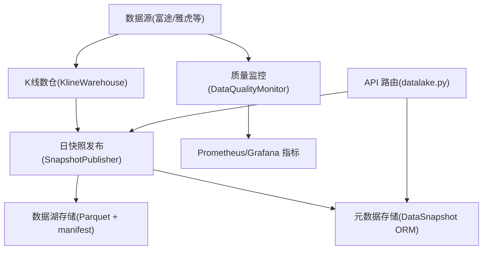
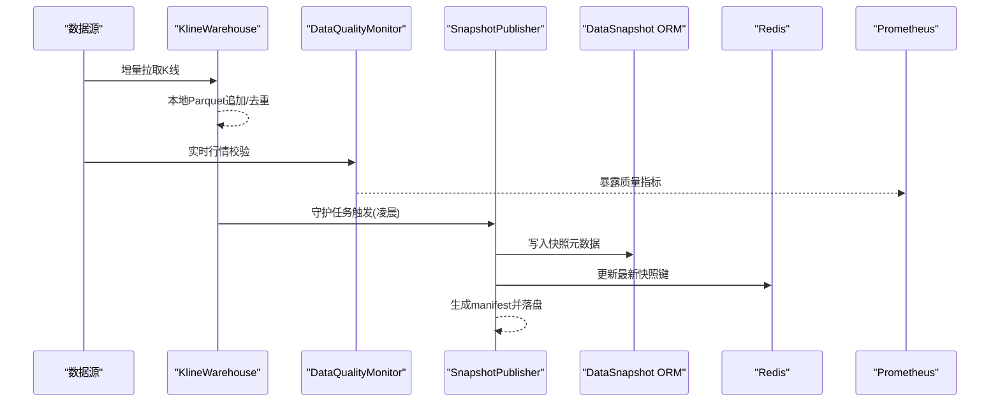
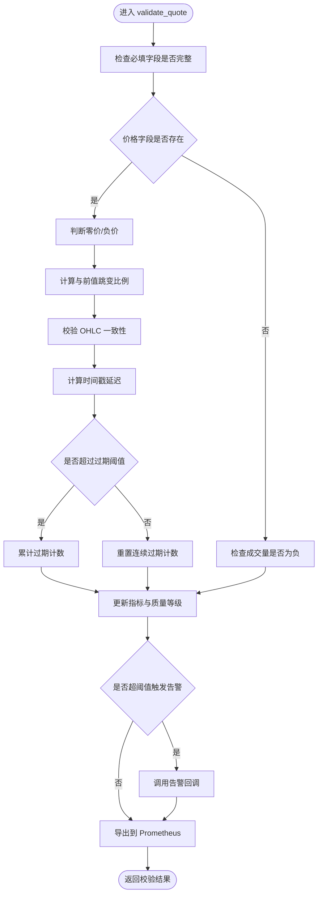
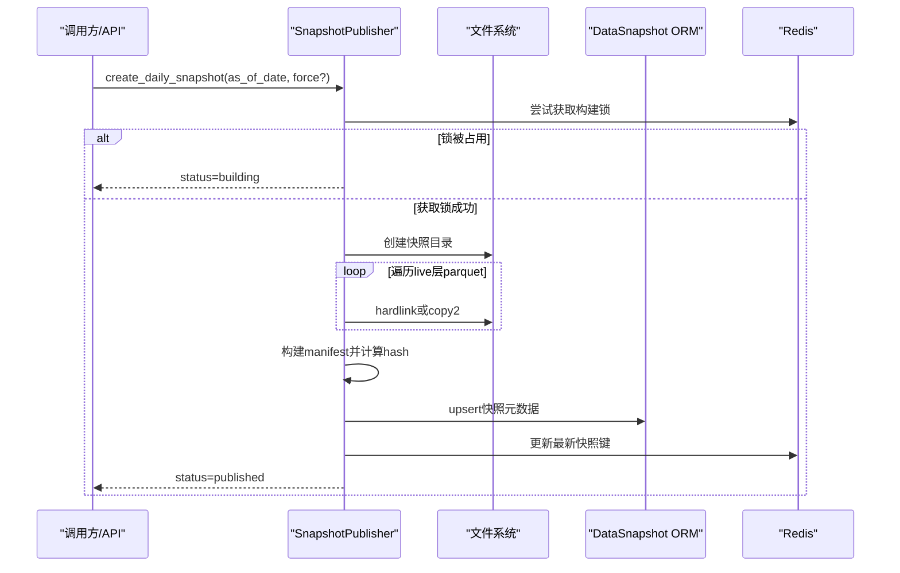
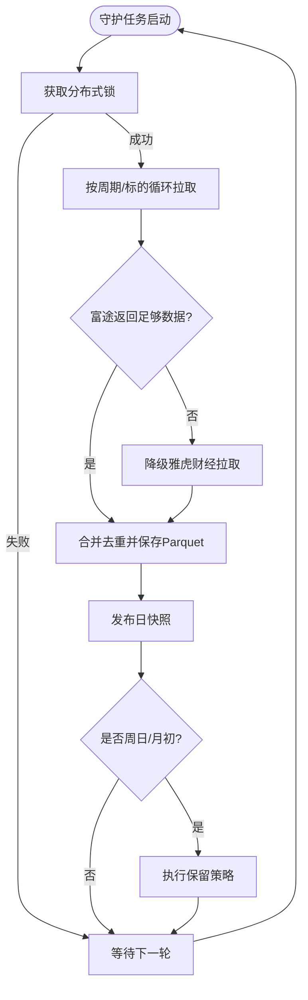
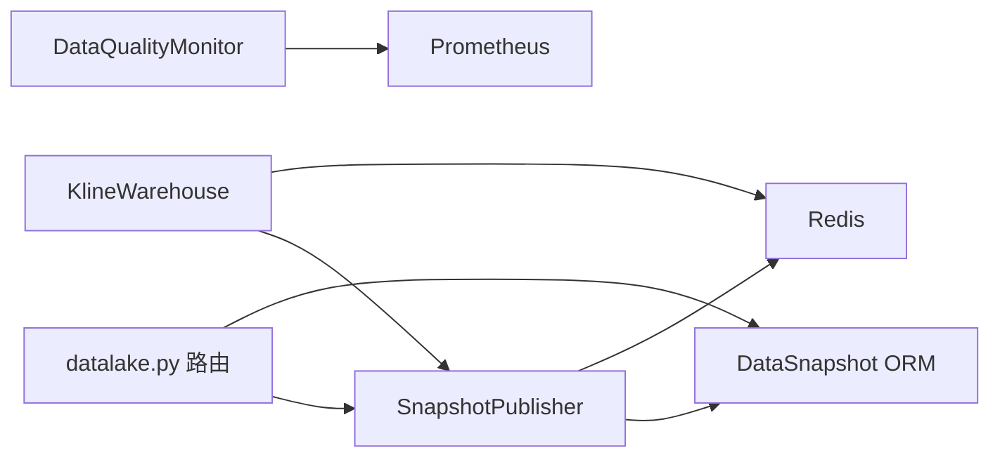

# 数据质量治理

<cite>
**本文引用的文件**
- [monitor.py](file://backend/services/data_quality/monitor.py)
- [snapshot_publisher.py](file://backend/services/datalake/snapshot_publisher.py)
- [kline_warehouse.py](file://backend/services/datalake/kline_warehouse.py)
- [datalake_models.py](file://backend/core/datalake_models.py)
- [datalake.py](file://backend/routers/datalake.py)
- [data-quality-dashboard.json](file://grafana/provisioning/dashboards/data-quality-dashboard.json)
</cite>

## 目录
1. [引言](#引言)
2. [项目结构](#项目结构)
3. [核心组件](#核心组件)
4. [架构总览](#架构总览)
5. [详细组件分析](#详细组件分析)
6. [依赖关系分析](#依赖关系分析)
7. [性能考虑](#性能考虑)
8. [故障排查指南](#故障排查指南)
9. [结论](#结论)
10. [附录](#附录)

## 引言
本文件面向 Quant Agent 的数据质量治理体系，系统性说明“自动发现与修复策略”“异常标记、修正与回滚”“与数据湖的集成（snapshot_publisher 与 kline_warehouse）”“自动化流程（定期检查、报告生成、修复建议）”“质量标准制定与维护（阈值、规则引擎、策略管理）”“最佳实践与常见问题”“效果评估与持续改进”。文档以代码为依据，提供可追溯的章节来源与图示来源。

## 项目结构
围绕数据质量治理的关键路径包括：
- 实时质量监控与指标暴露：DataQualityMonitor
- 日快照发布与版本化：SnapshotPublisher + DataSnapshot ORM
- K 线数仓与增量同步：KlineWarehouse
- 数据湖 API：Datalake Router
- 可视化看板：Grafana 数据质量仪表板

**图示来源**
- [kline_warehouse.py:16-258](file://backend/services/datalake/kline_warehouse.py#L16-L258)
- [snapshot_publisher.py:91-250](file://backend/services/datalake/snapshot_publisher.py#L91-L250)
- [datalake_models.py:31-50](file://backend/core/datalake_models.py#L31-L50)
- [datalake.py:61-138](file://backend/routers/datalake.py#L61-L138)
- [monitor.py:91-378](file://backend/services/data_quality/monitor.py#L91-L378)

**章节来源**
- [kline_warehouse.py:16-258](file://backend/services/datalake/kline_warehouse.py#L16-L258)
- [snapshot_publisher.py:91-250](file://backend/services/datalake/snapshot_publisher.py#L91-L250)
- [datalake_models.py:31-50](file://backend/core/datalake_models.py#L31-L50)
- [datalake.py:61-138](file://backend/routers/datalake.py#L61-L138)
- [monitor.py:91-378](file://backend/services/data_quality/monitor.py#L91-L378)

## 核心组件
- 数据质量监控器：按数据源维度统计脏数据率、完整率、延迟、异常计数，并输出到 Prometheus；支持告警回调。
- 日快照发布器：将 live 层 Parquet 通过硬链接/复制归档为快照，生成 manifest，写入数据库，更新 Redis 最新快照键。
- K 线数仓：本地 Parquet 增量同步，优先富途，不足时降级雅虎；守护进程定时拉取并在成功后触发快照发布与保留策略。
- 数据湖模型：DataSnapshot 记录快照元数据与指纹，支撑版本管理与可复现性。
- 数据湖 API：提供快照列表、最新快照、重建、保留策略执行等能力。

**章节来源**
- [monitor.py:26-88](file://backend/services/data_quality/monitor.py#L26-L88)
- [monitor.py:91-378](file://backend/services/data_quality/monitor.py#L91-L378)
- [snapshot_publisher.py:91-250](file://backend/services/datalake/snapshot_publisher.py#L91-L250)
- [kline_warehouse.py:16-258](file://backend/services/datalake/kline_warehouse.py#L16-L258)
- [datalake_models.py:31-50](file://backend/core/datalake_models.py#L31-L50)
- [datalake.py:61-138](file://backend/routers/datalake.py#L61-L138)

## 架构总览
数据质量治理贯穿“采集—校验—归档—版本化—可视化”全链路：
- 采集阶段：KlineWarehouse 从多数据源增量获取 K 线，落盘为 Parquet。
- 校验阶段：DataQualityMonitor 对行情进行字段完整性、价格异常、时间戳新鲜度等检查，计算质量等级并暴露指标。
- 归档阶段：SnapshotPublisher 在每日凌晨任务完成后创建快照，生成 manifest 并持久化至 DB。
- 版本化：DataSnapshot 作为不可变快照元数据，配合 manifest_hash 实现数据指纹与回溯。
- 可视化：Prometheus 指标由 Grafana 仪表板消费，形成数据质量看板。

**图示来源**
- [kline_warehouse.py:175-258](file://backend/services/datalake/kline_warehouse.py#L175-L258)
- [monitor.py:112-256](file://backend/services/data_quality/monitor.py#L112-L256)
- [snapshot_publisher.py:119-250](file://backend/services/datalake/snapshot_publisher.py#L119-L250)
- [datalake_models.py:31-50](file://backend/core/datalake_models.py#L31-L50)

## 详细组件分析

### 数据质量监控器（DataQualityMonitor）
- 功能要点
  - 字段完整性检查：OHLCV 必填字段非空。
  - 价格异常检测：零价、负价、价格跳变（百分比阈值）。
  - 时间戳新鲜度：计算延迟毫秒数，超过阈值计为过期。
  - OHLC 一致性：high < low 视为逻辑错误。
  - 成交量检查：负成交量异常。
  - 质量等级：good/degraded/poor/unusable 动态判定。
  - 指标暴露：导出到 Prometheus，供 Grafana 展示。
  - 告警回调：支持接入飞书/Telegram 等通知通道。
- 关键数据结构
  - QualityMetrics：聚合 total_records、valid_records、dirty_records、anomaly_count、missing_field_count、price_anomaly_count、stale_count、avg/max latency、quality_level 等。
  - AnomalyType：定义缺失字段、零价、负价、跳变、负量、过期、不一致、重复时间戳等异常类型。
- 复杂度与性能
  - 单条校验 O(1)，指标更新 O(1)。
  - 内存中维护 last_prices 与最近异常列表，控制大小避免增长。
- 错误处理
  - 时间戳解析失败忽略；Prometheus 导出失败仅记录调试日志。
- 配置与阈值
  - 必填字段集合、价格跳变阈值、过期阈值、脏数据率告警阈值、连续过期告警阈值。

**图示来源**
- [monitor.py:112-256](file://backend/services/data_quality/monitor.py#L112-L256)
- [monitor.py:258-378](file://backend/services/data_quality/monitor.py#L258-L378)

**章节来源**
- [monitor.py:26-88](file://backend/services/data_quality/monitor.py#L26-L88)
- [monitor.py:91-378](file://backend/services/data_quality/monitor.py#L91-L378)

### 日快照发布器（SnapshotPublisher）
- 功能要点
  - 幂等创建：已 published 且未强制则跳过。
  - 分布式锁：基于 Redis 防止并发重复构建。
  - 质量门禁：可注入 quality_gate_fn，默认放行但可替换为真实质量检查。
  - 文件归档：遍历 live 层 Parquet，采用 hardlink/copy2/mixed 方式复制到 snapshots。
  - Manifest 生成：包含文件元信息、sidecars（如 universe）、质量门禁结果、创建时间等，并计算 manifest_hash。
  - 只读保护：尽力设置文件只读。
  - 元数据持久化：写入 DataSnapshot，更新 Redis 最新快照键，暴露指标。
- 数据流
  - 输入：as_of_date、可选 force。
  - 输出：PublishResult（snapshot_id、status、manifest_hash、message、copy_mode）。

**图示来源**
- [snapshot_publisher.py:119-250](file://backend/services/datalake/snapshot_publisher.py#L119-L250)
- [datalake_models.py:31-50](file://backend/core/datalake_models.py#L31-L50)

**章节来源**
- [snapshot_publisher.py:91-250](file://backend/services/datalake/snapshot_publisher.py#L91-L250)
- [datalake_models.py:31-50](file://backend/core/datalake_models.py#L31-L50)

### K 线数仓（KlineWarehouse）
- 功能要点
  - 增量同步：优先富途历史接口，若返回不足则降级雅虎财经兜底。
  - 本地存储：按 ticker 与 ktype 组织 Parquet 文件，按 time 去重并排序保存。
  - 守护进程：每天凌晨 3 点执行，使用分布式锁避免集群重复拉取；循环不同周期与标的，错峰防限流。
  - 联动快照：同步成功后调用 SnapshotPublisher 发布日快照；周日或月初执行保留策略。
- 复杂度与性能
  - 读取/写入走线程池避免阻塞事件循环；Parquet 列式存储提升 IO 效率。
  - 增量算法根据最后日期计算拉取数量，减少不必要请求。

**图示来源**
- [kline_warehouse.py:175-258](file://backend/services/datalake/kline_warehouse.py#L175-L258)
- [kline_warehouse.py:55-173](file://backend/services/datalake/kline_warehouse.py#L55-L173)

**章节来源**
- [kline_warehouse.py:16-258](file://backend/services/datalake/kline_warehouse.py#L16-L258)

### 数据湖 API（datalake.py）
- 能力清单
  - 列出快照：支持按状态与存储层级过滤。
  - 获取最新快照：返回 age_days 与 stale_warning。
  - 查询指定快照：附带 manifest。
  - 重建快照：支持 force 参数。
  - 执行保留策略：手动触发。
- 与组件集成
  - 依赖 SnapshotPublisher、SnapshotReader、SnapshotRetention 与 DataSnapshot ORM。

**章节来源**
- [datalake.py:61-138](file://backend/routers/datalake.py#L61-L138)

## 依赖关系分析
- 模块耦合
  - KlineWarehouse 依赖数据源路由（富途/雅虎），并在守护任务中调用 SnapshotPublisher。
  - SnapshotPublisher 依赖 DataSnapshot ORM、manifest 工具、paths 常量与 Redis。
  - DataQualityMonitor 依赖 metrics 模块暴露指标，并可注入告警回调。
  - datalake.py 路由组合上述服务，对外暴露统一 API。
- 外部依赖
  - Redis：分布式锁、最新快照键。
  - Prometheus：质量指标与数据湖指标。
  - Grafana：消费指标与仪表盘。

**图示来源**
- [kline_warehouse.py:175-258](file://backend/services/datalake/kline_warehouse.py#L175-L258)
- [snapshot_publisher.py:119-250](file://backend/services/datalake/snapshot_publisher.py#L119-L250)
- [datalake_models.py:31-50](file://backend/core/datalake_models.py#L31-L50)
- [datalake.py:61-138](file://backend/routers/datalake.py#L61-L138)
- [monitor.py:315-350](file://backend/services/data_quality/monitor.py#L315-L350)

**章节来源**
- [kline_warehouse.py:175-258](file://backend/services/datalake/kline_warehouse.py#L175-L258)
- [snapshot_publisher.py:119-250](file://backend/services/datalake/snapshot_publisher.py#L119-L250)
- [datalake_models.py:31-50](file://backend/core/datalake_models.py#L31-L50)
- [datalake.py:61-138](file://backend/routers/datalake.py#L61-L138)
- [monitor.py:315-350](file://backend/services/data_quality/monitor.py#L315-L350)

## 性能考虑
- 读取优化：KlineWarehouse 使用 pyarrow 引擎并行读取 Parquet，并通过线程池避免阻塞事件循环。
- 写入优化：增量合并后按 time 去重并排序，减少冗余与乱序。
- 快照归档：优先硬链接，失败回退 copy2，降低磁盘占用与 I/O。
- 指标开销：DataQualityMonitor 每次校验后导出指标，注意在高吞吐场景下确保 Prometheus 客户端可用。
- 调度错峰：守护任务每标的事务间 sleep，避免打爆上游接口限流。

[本节为通用性能讨论，不直接分析具体文件]

## 故障排查指南
- 快照构建失败
  - 现象：status=failed，message=quality_gate。
  - 排查：检查质量门禁函数返回值与阈值；查看 Redis 构建锁是否残留。
  - 参考：[snapshot_publisher.py:119-157](file://backend/services/datalake/snapshot_publisher.py#L119-L157)
- 数据源切换与降级
  - 现象：富途返回数据不足，自动降级雅虎。
  - 排查：确认数据源路由返回结构与字段映射；关注降级日志。
  - 参考：[kline_warehouse.py:86-149](file://backend/services/datalake/kline_warehouse.py#L86-L149)
- 数据质量告警
  - 现象：脏数据率或连续过期超阈值触发告警。
  - 排查：查看 monitor 指标与最近异常；调整阈值或修复上游数据问题。
  - 参考：[monitor.py:270-295](file://backend/services/data_quality/monitor.py#L270-L295)
- 指标未上报
  - 现象：Grafana 无数据。
  - 排查：确认 Prometheus 客户端导入与指标注册；检查网络与权限。
  - 参考：[monitor.py:315-350](file://backend/services/data_quality/monitor.py#L315-L350)
- 保留策略未执行
  - 现象：旧快照未清理。
  - 排查：确认守护任务是否在周日/月初触发；检查保留策略执行日志。
  - 参考：[kline_warehouse.py:231-247](file://backend/services/datalake/kline_warehouse.py#L231-L247)

**章节来源**
- [snapshot_publisher.py:119-157](file://backend/services/datalake/snapshot_publisher.py#L119-L157)
- [kline_warehouse.py:86-149](file://backend/services/datalake/kline_warehouse.py#L86-L149)
- [monitor.py:270-295](file://backend/services/data_quality/monitor.py#L270-L295)
- [monitor.py:315-350](file://backend/services/data_quality/monitor.py#L315-L350)
- [kline_warehouse.py:231-247](file://backend/services/datalake/kline_warehouse.py#L231-L247)

## 结论
该数据质量治理体系以“实时监控 + 日快照版本化”为核心，结合 K 线数仓的稳健增量同步与数据湖的不可变元数据管理，实现了从采集到归档的全链路质量保障。通过阈值化规则、告警回调与可视化看板，能够快速定位与处置异常；借助 manifest 与 DataSnapshot，支持回测可复现与数据回溯。后续可在质量门禁、修复策略与自动化闭环方面进一步增强。

[本节为总结性内容，不直接分析具体文件]

## 附录

### 质量标准制定与维护机制
- 阈值配置
  - 必填字段集合、价格跳变阈值、过期阈值、脏数据率告警阈值、连续过期告警阈值。
  - 参考：[monitor.py:84-88](file://backend/services/data_quality/monitor.py#L84-L88)
- 规则引擎
  - 字段完整性、价格异常、时间戳新鲜度、OHLC 一致性、成交量异常、重复时间戳。
  - 参考：[monitor.py:35-46](file://backend/services/data_quality/monitor.py#L35-L46)
- 策略管理
  - 质量等级判定与告警阈值联动；可通过注入 quality_gate_fn 扩展质量门禁策略。
  - 参考：[snapshot_publisher.py:109-117](file://backend/services/datalake/snapshot_publisher.py#L109-L117)

**章节来源**
- [monitor.py:35-88](file://backend/services/data_quality/monitor.py#L35-L88)
- [snapshot_publisher.py:109-117](file://backend/services/datalake/snapshot_publisher.py#L109-L117)

### 自动化流程
- 定期质量检查
  - 实时校验每条行情，累计指标并暴露到 Prometheus。
  - 参考：[monitor.py:112-256](file://backend/services/data_quality/monitor.py#L112-L256)
- 问题报告生成
  - 最近异常条目保留与公开字典输出，便于 API/看板消费。
  - 参考：[monitor.py:352-370](file://backend/services/data_quality/monitor.py#L352-L370)
- 修复建议推荐
  - 基于异常类型与严重级别，结合阈值触发告警，提示上游修复。
  - 参考：[monitor.py:270-295](file://backend/services/data_quality/monitor.py#L270-L295)

**章节来源**
- [monitor.py:112-256](file://backend/services/data_quality/monitor.py#L112-L256)
- [monitor.py:352-370](file://backend/services/data_quality/monitor.py#L352-L370)
- [monitor.py:270-295](file://backend/services/data_quality/monitor.py#L270-L295)

### 与数据湖的集成方案
- snapshot_publisher
  - 负责将 live 层 Parquet 归档为快照，生成 manifest 并持久化元数据。
  - 参考：[snapshot_publisher.py:119-250](file://backend/services/datalake/snapshot_publisher.py#L119-L250)
- kline_warehouse
  - 负责增量同步与本地存储，并在成功后触发快照发布与保留策略。
  - 参考：[kline_warehouse.py:175-258](file://backend/services/datalake/kline_warehouse.py#L175-L258)
- 版本管理
  - DataSnapshot 记录快照 ID、日期、状态、manifest_hash 等，支撑版本回溯。
  - 参考：[datalake_models.py:31-50](file://backend/core/datalake_models.py#L31-L50)

**章节来源**
- [snapshot_publisher.py:119-250](file://backend/services/datalake/snapshot_publisher.py#L119-L250)
- [kline_warehouse.py:175-258](file://backend/services/datalake/kline_warehouse.py#L175-L258)
- [datalake_models.py:31-50](file://backend/core/datalake_models.py#L31-L50)

### 最佳实践与常见问题解决方案
- 数据源切换
  - 富途额度耗尽或返回不足时自动降级雅虎，保证长跨度数据可用性。
  - 参考：[kline_warehouse.py:86-149](file://backend/services/datalake/kline_warehouse.py#L86-L149)
- 故障恢复
  - 使用 Redis 分布式锁避免重复构建；失败时记录状态并允许重建。
  - 参考：[snapshot_publisher.py:136-157](file://backend/services/datalake/snapshot_publisher.py#L136-L157)
- 性能优化
  - 线程池异步读取 Parquet；增量合并去重；快照归档优先硬链接。
  - 参考：[kline_warehouse.py:40-51](file://backend/services/datalake/kline_warehouse.py#L40-L51)
  - 参考：[snapshot_publisher.py:55-64](file://backend/services/datalake/snapshot_publisher.py#L55-L64)

**章节来源**
- [kline_warehouse.py:86-149](file://backend/services/datalake/kline_warehouse.py#L86-L149)
- [snapshot_publisher.py:136-157](file://backend/services/datalake/snapshot_publisher.py#L136-L157)
- [kline_warehouse.py:40-51](file://backend/services/datalake/kline_warehouse.py#L40-L51)
- [snapshot_publisher.py:55-64](file://backend/services/datalake/snapshot_publisher.py#L55-L64)

### 质量治理效果评估与持续改进
- 评估方法
  - 基于脏数据率、完整率、延迟、异常计数等指标，结合 Grafana 数据质量仪表板进行趋势分析。
  - 参考：[monitor.py:300-350](file://backend/services/data_quality/monitor.py#L300-L350)
  - 参考：[data-quality-dashboard.json](file://grafana/provisioning/dashboards/data-quality-dashboard.json)
- 持续改进
  - 动态调整阈值与规则；增强质量门禁；完善告警渠道；定期执行保留策略以控制存储成本。
  - 参考：[monitor.py:258-295](file://backend/services/data_quality/monitor.py#L258-L295)
  - 参考：[kline_warehouse.py:231-247](file://backend/services/datalake/kline_warehouse.py#L231-L247)

**章节来源**
- [monitor.py:300-350](file://backend/services/data_quality/monitor.py#L300-L350)
- [data-quality-dashboard.json](file://grafana/provisioning/dashboards/data-quality-dashboard.json)
- [monitor.py:258-295](file://backend/services/data_quality/monitor.py#L258-L295)
- [kline_warehouse.py:231-247](file://backend/services/datalake/kline_warehouse.py#L231-L247)
