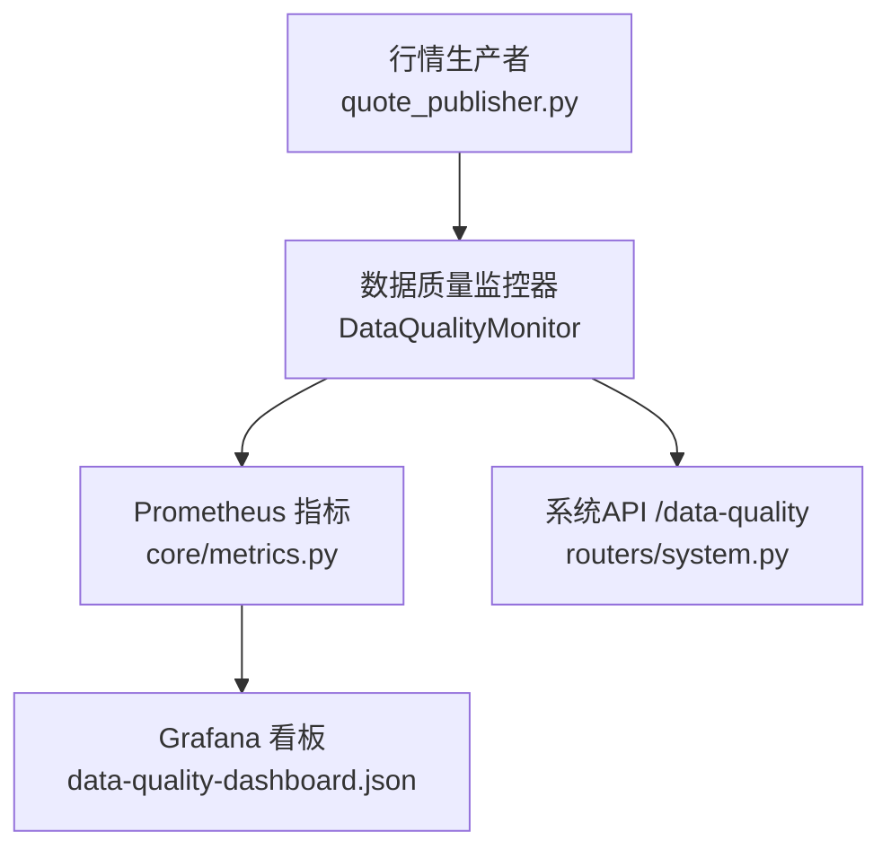
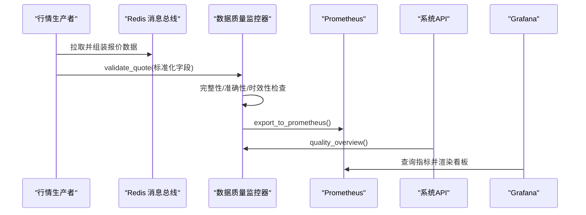
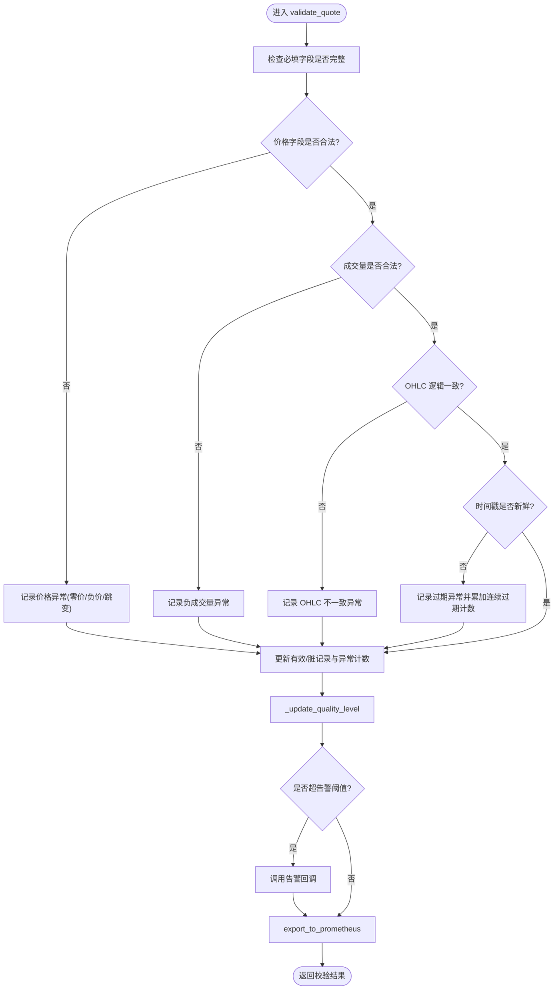
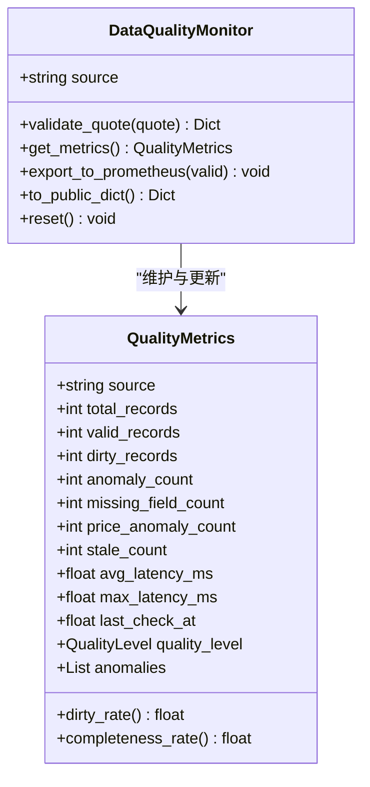
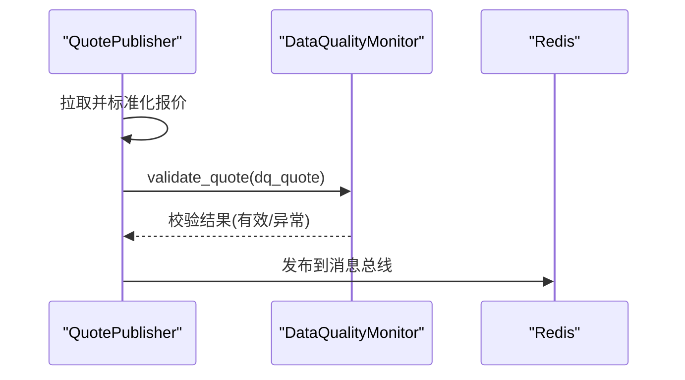
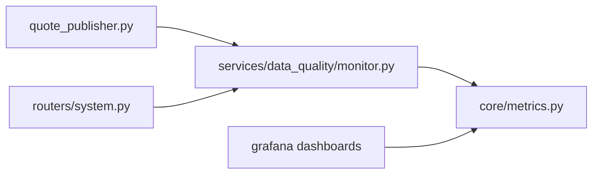

# 数据质量监控

<cite>
**本文引用的文件**
- [monitor.py](file://backend/services/data_quality/monitor.py)
- [metrics.py](file://backend/core/metrics.py)
- [system.py](file://backend/routers/system.py)
- [data-quality-dashboard.json](file://grafana/provisioning/dashboards/data-quality-dashboard.json)
- [quote_publisher.py](file://backend/workers/quote_publisher.py)
- [test_data_quality_monitor_svc04.py](file://backend/tests/test_data_quality_monitor_svc04.py)
- [test_data_quality_dirtyrate_fix.py](file://backend/tests/test_data_quality_dirtyrate_fix.py)
- [test_data_quality_dashboard_dq04.py](file://backend/tests/test_data_quality_dashboard_dq04.py)
</cite>

## 目录
1. [简介](#简介)
2. [项目结构](#项目结构)
3. [核心组件](#核心组件)
4. [架构总览](#架构总览)
5. [详细组件分析](#详细组件分析)
6. [依赖关系分析](#依赖关系分析)
7. [性能考量](#性能考量)
8. [故障排查指南](#故障排查指南)
9. [结论](#结论)
10. [附录](#附录)

## 简介
本文件面向 Quant Agent 的数据质量监控体系，系统性说明其设计目标、指标定义、实现方案与可视化展示。该体系覆盖实时数据流的质量检查、批量数据校验、历史回溯分析能力；提供异常自动发现与告警机制；并通过 Prometheus + Grafana 形成可观测闭环，帮助分析师快速掌握数据健康状况。

## 项目结构
数据质量监控的核心位于后端服务层，围绕“按数据源维度”的监控器展开，结合指标暴露、API 汇总与 Grafana 看板，形成端到端的质量治理链路：
- 监控引擎：按数据源维护指标、检测异常、计算质量等级并导出指标。
- 指标层：Prometheus Gauge/Counter 暴露脏数据率、完整率、延迟、异常计数等。
- 接入点：行情生产者对每条推送数据进行质量校验。
- 对外接口：系统路由提供数据质量概览 API。
- 可视化：Grafana 面板聚合多指标，支持阈值与趋势观察。

**图表来源**
- [quote_publisher.py:90-131](file://backend/workers/quote_publisher.py#L90-L131)
- [monitor.py:91-377](file://backend/services/data_quality/monitor.py#L91-L377)
- [metrics.py:382-444](file://backend/core/metrics.py#L382-L444)
- [system.py:138-161](file://backend/routers/system.py#L138-L161)
- [data-quality-dashboard.json:1-253](file://grafana/provisioning/dashboards/data-quality-dashboard.json#L1-L253)

**章节来源**
- [monitor.py:1-408](file://backend/services/data_quality/monitor.py#L1-L408)
- [metrics.py:382-444](file://backend/core/metrics.py#L382-L444)
- [system.py:138-161](file://backend/routers/system.py#L138-L161)
- [data-quality-dashboard.json:1-253](file://grafana/provisioning/dashboards/data-quality-dashboard.json#L1-L253)
- [quote_publisher.py:90-131](file://backend/workers/quote_publisher.py#L90-L131)

## 核心组件
- 数据质量监控器 DataQualityMonitor：负责单条数据校验、指标累积、质量等级判定、告警触发与指标导出。
- 质量指标 QualityMetrics：记录总量、有效量、脏数据量、异常条目数、缺失字段次数、价格异常次数、过期次数、平均/最大延迟、最后检查时间、最近异常列表等。
- 异常类型 AnomalyType：字段缺失、零价、负价、价格跳变、负成交量、时间戳过期、OHLC 不一致、重复时间戳等。
- 质量等级 QualityLevel：good/degraded/poor/unusable，基于脏数据率与连续过期次数动态评估。
- Prometheus 指标集合：脏数据率、完整率、总记录数、异常计数、缺失字段、价格异常、过期计数、平均延迟、质量等级、校验次数等。
- 系统 API：/api/v1/system/data-quality 返回各数据源质量概览。
- Grafana 看板：展示脏数据率趋势、完整率、质量等级、异常分类、延迟与校验吞吐。

**章节来源**
- [monitor.py:26-88](file://backend/services/data_quality/monitor.py#L26-L88)
- [monitor.py:48-79](file://backend/services/data_quality/monitor.py#L48-L79)
- [monitor.py:91-377](file://backend/services/data_quality/monitor.py#L91-L377)
- [metrics.py:382-444](file://backend/core/metrics.py#L382-L444)
- [system.py:138-161](file://backend/routers/system.py#L138-L161)
- [data-quality-dashboard.json:1-253](file://grafana/provisioning/dashboards/data-quality-dashboard.json#L1-L253)

## 架构总览
数据从行情生产者进入，经质量监控器进行完整性、准确性、时效性检查，指标写入 Prometheus，系统 API 汇总各数据源状态，Grafana 面板可视化呈现。

**图表来源**
- [quote_publisher.py:90-131](file://backend/workers/quote_publisher.py#L90-L131)
- [monitor.py:112-377](file://backend/services/data_quality/monitor.py#L112-L377)
- [metrics.py:382-444](file://backend/core/metrics.py#L382-L444)
- [system.py:138-161](file://backend/routers/system.py#L138-L161)
- [data-quality-dashboard.json:1-253](file://grafana/provisioning/dashboards/data-quality-dashboard.json#L1-L253)

## 详细组件分析

### 数据质量监控器（DataQualityMonitor）
- 职责：逐条校验 OHLCV 字段完整性、价格合理性、OHLC 逻辑一致性、时间戳新鲜度；累计指标并更新质量等级；触发告警；导出 Prometheus 指标。
- 关键方法：
  - validate_quote：执行五类检查并更新指标。
  - _update_quality_level：根据脏数据率与连续过期次数判定质量等级。
  - _check_alert_thresholds：当脏数据率或连续过期超阈值时调用回调告警。
  - export_to_prometheus：将当前指标写入 prometheus_client。
  - to_public_dict：供 API 与看板使用的摘要。
  - reset：重置指标与缓存。
- 配置常量：
  - REQUIRED_FIELDS：必填字段集合。
  - MAX_PRICE_JUMP_PCT：单次价格跳变阈值。
  - STALE_THRESHOLD_SECONDS：数据过期阈值。
  - ALERT_DIRTY_RATE_THRESHOLD：脏数据率告警阈值。

**图表来源**
- [monitor.py:112-377](file://backend/services/data_quality/monitor.py#L112-L377)

**章节来源**
- [monitor.py:84-88](file://backend/services/data_quality/monitor.py#L84-L88)
- [monitor.py:112-377](file://backend/services/data_quality/monitor.py#L112-L377)

### 指标定义与计算方法
- 脏数据率 dirty_rate：含异常的记录数 / 总记录数，语义上恒 ≤ 1.0。
- 字段完整率 completeness_rate：有效记录数 / 总记录数。
- 价格异常：零价、负价、价格跳变（相对上次收盘价超过阈值）。
- 时间戳过期：当前时间与数据时间戳差值超过阈值。
- 其他指标：缺失字段次数、负成交量次数、OHLC 不一致次数、平均/最大延迟、质量等级数值化、校验次数（ok/anomaly）。

**图表来源**
- [monitor.py:48-79](file://backend/services/data_quality/monitor.py#L48-L79)
- [monitor.py:91-377](file://backend/services/data_quality/monitor.py#L91-L377)

**章节来源**
- [monitor.py:48-79](file://backend/services/data_quality/monitor.py#L48-L79)
- [metrics.py:382-444](file://backend/core/metrics.py#L382-L444)

### 实时数据流质量检查
- 集成点：行情生产者在推送前对标准化后的 OHLCV 数据调用质量监控器。
- 流程：构造包含 ticker、open/high/low/close/volume、timestamp 的结构，调用 validate_quote，随后继续推送到 Redis 消息总线。
- 容错：若质量检查抛出异常，仅记录调试日志，不影响主流程推送。

**图表来源**
- [quote_publisher.py:90-131](file://backend/workers/quote_publisher.py#L90-L131)
- [monitor.py:112-377](file://backend/services/data_quality/monitor.py#L112-L377)

**章节来源**
- [quote_publisher.py:90-131](file://backend/workers/quote_publisher.py#L90-L131)
- [monitor.py:112-377](file://backend/services/data_quality/monitor.py#L112-L377)

### 批量数据质量校验与历史回溯
- 批量校验：可通过循环对历史快照或离线数据集逐条调用 validate_quote，累计指标后导出至 Prometheus，便于批处理窗口内的质量评估。
- 历史回溯：利用 to_public_dict 输出最近异常列表与指标快照，配合外部存储（如数据库或对象存储）保存批次结果，用于后续分析与审计。
- 建议实践：在批处理任务中定期 reset 监控器以避免跨批次污染；对每个数据源独立实例化监控器以隔离指标。

[本节为概念性指导，不直接分析具体文件]

### 异常自动发现与修复机制
- 自动发现：通过脏数据率与连续过期次数阈值触发告警回调，便于接入飞书/Telegram 等通知渠道。
- 标记策略：异常记录会被记录到最近异常列表，便于定位问题标的与字段。
- 修正与回滚：当前实现未内置自动修正与回滚；建议在数据管道上游增加清洗规则（如剔除零价/负价、插值或替换），并在批处理阶段对已入库数据进行修复与版本回滚。

**章节来源**
- [monitor.py:270-295](file://backend/services/data_quality/monitor.py#L270-L295)
- [monitor.py:352-370](file://backend/services/data_quality/monitor.py#L352-L370)

### 数据质量报告与可视化
- 系统 API：/api/v1/system/data-quality 返回各数据源质量概览，包括脏数据率、完整率、异常计数、延迟等。
- Grafana 看板：展示脏数据率趋势、完整率、质量等级、异常分类（价格/过期/缺失）、延迟与校验吞吐，支持阈值与多数据源对比。
- 指标命名：quant_data_quality_dirty_rate、quant_data_quality_completeness_rate、quant_data_quality_price_anomaly_count、quant_data_quality_stale_count、quant_data_quality_avg_latency_ms、quant_data_quality_checks_total 等。

**章节来源**
- [system.py:138-161](file://backend/routers/system.py#L138-L161)
- [data-quality-dashboard.json:1-253](file://grafana/provisioning/dashboards/data-quality-dashboard.json#L1-L253)
- [metrics.py:382-444](file://backend/core/metrics.py#L382-L444)

## 依赖关系分析
- 模块耦合：
  - quote_publisher 依赖 data_quality monitor 进行实时校验。
  - monitor 依赖 core metrics 暴露 Prometheus 指标。
  - system router 依赖 monitor 的 quality_overview 提供 API。
  - Grafana 看板依赖 Prometheus 指标名称与标签。
- 外部依赖：
  - prometheus_client 用于指标导出。
  - Redis 作为消息总线承载行情数据。
- 潜在风险：
  - 若 Prometheus 不可达，export_to_prometheus 会捕获异常并跳过，不影响主流程。
  - 告警回调失败会记录错误日志，避免阻塞校验流程。

**图表来源**
- [quote_publisher.py:90-131](file://backend/workers/quote_publisher.py#L90-L131)
- [monitor.py:91-377](file://backend/services/data_quality/monitor.py#L91-L377)
- [metrics.py:382-444](file://backend/core/metrics.py#L382-L444)
- [system.py:138-161](file://backend/routers/system.py#L138-L161)
- [data-quality-dashboard.json:1-253](file://grafana/provisioning/dashboards/data-quality-dashboard.json#L1-L253)

**章节来源**
- [quote_publisher.py:90-131](file://backend/workers/quote_publisher.py#L90-L131)
- [monitor.py:91-377](file://backend/services/data_quality/monitor.py#L91-L377)
- [metrics.py:382-444](file://backend/core/metrics.py#L382-L444)
- [system.py:138-161](file://backend/routers/system.py#L138-L161)
- [data-quality-dashboard.json:1-253](file://grafana/provisioning/dashboards/data-quality-dashboard.json#L1-L253)

## 性能考量
- 低开销校验：validate_quote 仅做必要字段检查与简单数学运算，适合高频实时场景。
- 指标导出：每次校验均尝试导出 Prometheus 指标，但内部捕获异常避免阻塞。
- 并发控制：行情生产者使用信号量限制并发，防止打满数据源连接池。
- 建议优化：
  - 对极高吞吐场景可考虑异步导出指标或使用缓冲队列。
  - 调整阈值参数（价格跳变、过期阈值）以适应不同市场与数据源特性。

[本节提供通用指导，不直接分析具体文件]

## 故障排查指南
- 脏数据率异常升高：
  - 检查数据源字段映射是否正确，确认 open/high/low/close/volume 是否齐全。
  - 核查价格跳变阈值与数据源波动特性是否匹配。
  - 查看最近异常列表定位问题标的与字段。
- 时间戳过期频繁：
  - 检查数据源采集延迟与网络状况。
  - 调整 STALE_THRESHOLD_SECONDS 以适配实际延迟分布。
- 告警未触发：
  - 确认已设置 alert_callback 且回调函数可用。
  - 检查脏数据率与连续过期计数是否达到阈值。
- Prometheus 指标缺失：
  - 确认 export_to_prometheus 未被异常中断。
  - 验证指标名称与标签是否与 Grafana 查询一致。

**章节来源**
- [monitor.py:270-295](file://backend/services/data_quality/monitor.py#L270-L295)
- [monitor.py:315-350](file://backend/services/data_quality/monitor.py#L315-L350)
- [test_data_quality_monitor_svc04.py:241-263](file://backend/tests/test_data_quality_monitor_svc04.py#L241-L263)

## 结论
Quant Agent 的数据质量监控体系以轻量、可扩展的方式实现了实时数据流的完整性、准确性与时效性检查，并通过 Prometheus 与 Grafana 形成完整的可观测闭环。脏数据率与字段完整率提供了直观的健康度量，异常分类与延迟统计有助于快速定位问题。建议在生产环境中结合上游清洗与批处理修复策略，完善自动修正与回滚能力，进一步提升数据治理水平。

[本节总结性内容，不直接分析具体文件]

## 附录
- 测试用例参考：
  - 字段完整性、价格异常、OHLC 一致性、时间戳新鲜度、质量等级、告警回调、Prometheus 指标输出等。
  - 脏数据率语义修复回归测试，确保 dirty_rate 恒 ≤ 1.0。
  - 看板埋点测试，验证指标导出与 overview API 契约。

**章节来源**
- [test_data_quality_monitor_svc04.py:1-311](file://backend/tests/test_data_quality_monitor_svc04.py#L1-L311)
- [test_data_quality_dirtyrate_fix.py:1-57](file://backend/tests/test_data_quality_dirtyrate_fix.py#L1-L57)
- [test_data_quality_dashboard_dq04.py:1-137](file://backend/tests/test_data_quality_dashboard_dq04.py#L1-L137)