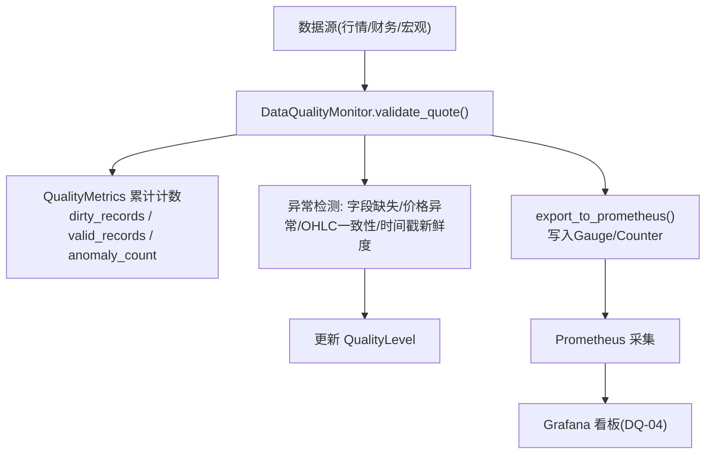
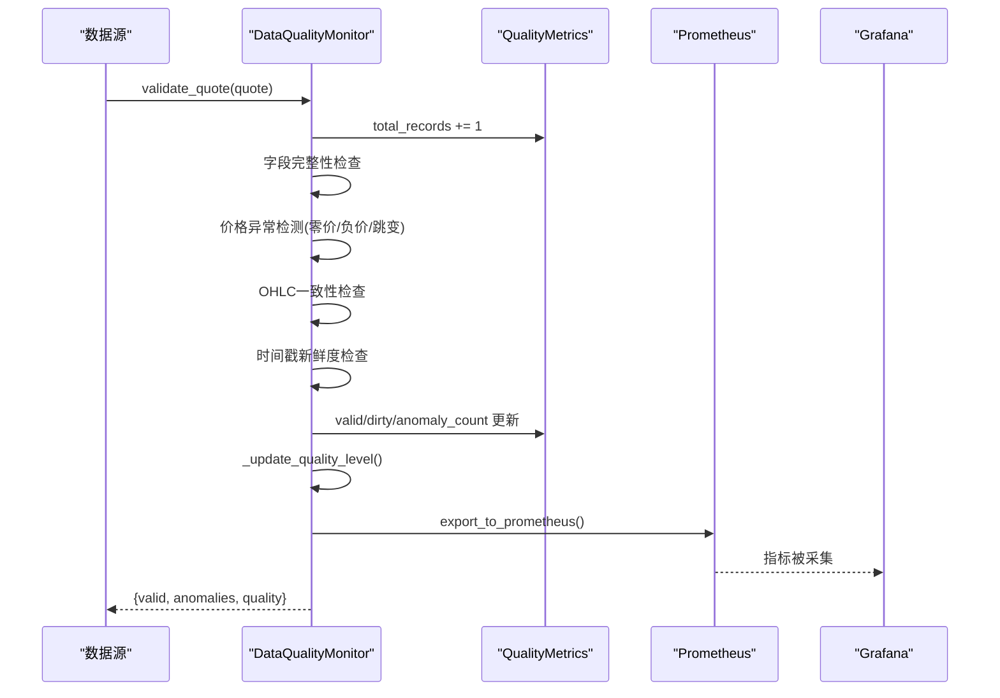
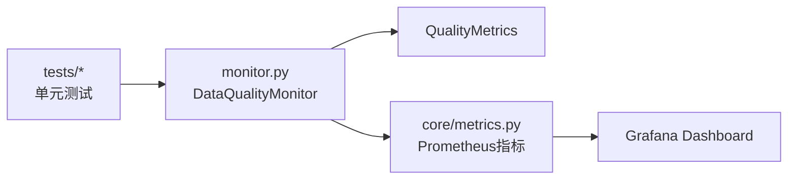

# 质量指标定义

<cite>
**本文引用的文件**
- [backend/services/data_quality/monitor.py](file://backend/services/data_quality/monitor.py)
- [backend/core/metrics.py](file://backend/core/metrics.py)
- [grafana/provisioning/dashboards/data-quality-dashboard.json](file://grafana/provisioning/dashboards/data-quality-dashboard.json)
- [backend/tests/test_data_quality_monitor_svc04.py](file://backend/tests/test_data_quality_monitor_svc04.py)
- [backend/tests/test_data_quality_dirtyrate_fix.py](file://backend/tests/test_data_quality_dirtyrate_fix.py)
- [backend/tests/test_data_quality_dashboard_dq04.py](file://backend/tests/test_data_quality_dashboard_dq04.py)
</cite>

## 目录
1. [简介](#简介)
2. [项目结构](#项目结构)
3. [核心组件](#核心组件)
4. [架构总览](#架构总览)
5. [详细组件分析](#详细组件分析)
6. [依赖关系分析](#依赖关系分析)
7. [性能考量](#性能考量)
8. [故障排查指南](#故障排查指南)
9. [结论](#结论)
10. [附录：计算公式与示例](#附录计算公式与示例)

## 简介
本文件系统化阐述 Quant Agent 的数据质量指标体系，覆盖脏数据率、字段完整率、价格异常检测、时间戳新鲜度等核心指标的定义、计算口径与业务含义。文档围绕 QualityMetrics 数据结构、AnomalyType 异常类型、QualityLevel 质量等级判定规则展开，并结合 Prometheus 指标与 Grafana 看板说明监控落地方式，帮助开发者准确理解统计口径并正确扩展或调整阈值。

## 项目结构
数据质量监控的核心实现位于后端服务模块中，包含：
- 质量监控器与指标聚合（DataQualityMonitor、QualityMetrics）
- 异常类型枚举（AnomalyType）
- 质量等级枚举（QualityLevel）
- Prometheus 指标定义与导出
- Grafana 仪表板配置
- 单元测试覆盖关键逻辑与边界条件

图表来源
- [backend/services/data_quality/monitor.py:112-256](file://backend/services/data_quality/monitor.py#L112-L256)
- [backend/core/metrics.py:386-444](file://backend/core/metrics.py#L386-L444)
- [grafana/provisioning/dashboards/data-quality-dashboard.json:42-53](file://grafana/provisioning/dashboards/data-quality-dashboard.json#L42-L53)

章节来源
- [backend/services/data_quality/monitor.py:1-408](file://backend/services/data_quality/monitor.py#L1-L408)
- [backend/core/metrics.py:386-444](file://backend/core/metrics.py#L386-L444)
- [grafana/provisioning/dashboards/data-quality-dashboard.json:1-253](file://grafana/provisioning/dashboards/data-quality-dashboard.json#L1-L253)

## 核心组件
- DataQualityMonitor：按数据源维度对单条行情数据进行质量校验，累计指标、更新质量等级、触发告警、导出 Prometheus 指标。
- QualityMetrics：记录 total_records、valid_records、dirty_records、anomaly_count 等指标，并提供 dirty_rate、completeness_rate 两个派生属性。
- AnomalyType：定义缺失字段、零价、负价、价格跳变、负成交量、时间戳过期、OHLC不一致、重复时间戳等异常类型。
- QualityLevel：GOOD、DEGRADED、POOR、UNUSABLE 四级质量等级，依据脏数据率与连续过期次数动态判定。

章节来源
- [backend/services/data_quality/monitor.py:26-64](file://backend/services/data_quality/monitor.py#L26-L64)
- [backend/services/data_quality/monitor.py:91-110](file://backend/services/data_quality/monitor.py#L91-L110)

## 架构总览
数据从各数据源进入后，由 DataQualityMonitor.validate_quote 进行逐条校验，内部执行以下检查：
- 字段完整性：必填字段 open/high/low/close/volume 非空
- 价格异常：零价、负价、价格跳变（相对上次收盘价超过阈值）
- OHLC 一致性：high < low 视为逻辑错误
- 时间戳新鲜度：根据 timestamp/ts 计算延迟，超过阈值标记为过期
- 指标更新与等级判定：累计异常数、脏数据率、完整率，更新质量等级
- 告警与导出：当脏数据率或连续过期达到阈值时触发告警；同时导出到 Prometheus

图表来源
- [backend/services/data_quality/monitor.py:112-256](file://backend/services/data_quality/monitor.py#L112-L256)
- [backend/core/metrics.py:386-444](file://backend/core/metrics.py#L386-L444)

## 详细组件分析

### QualityMetrics 数据结构与计算逻辑
- total_records：累计接收的行情记录总数
- valid_records：通过全部校验的有效记录数
- dirty_records：含至少一条异常的记录数（用于脏数据率分母口径）
- anomaly_count：累计异常条目数（单条记录可产生多条异常）
- missing_field_count：字段缺失累计次数
- price_anomaly_count：价格异常累计次数（零价/负价/跳变/负量/OHLC不一致）
- stale_count：时间戳过期累计次数
- avg_latency_ms/max_latency_ms：平均与最大延迟（毫秒）
- last_check_at：最后检查时间戳
- quality_level：当前质量等级（GOOD/DEGRADED/POOR/UNUSABLE）
- anomalies：最近异常列表（保留最近若干条）

派生指标：
- dirty_rate = dirty_records / total_records（语义口径，恒 ≤ 1.0）
- completeness_rate = valid_records / total_records

章节来源
- [backend/services/data_quality/monitor.py:48-79](file://backend/services/data_quality/monitor.py#L48-L79)

### AnomalyType 异常类型与判断标准
- MISSING_FIELD：必填字段缺失或为 None（open/high/low/close/volume）
- ZERO_PRICE：价格为 0
- NEGATIVE_PRICE：价格小于 0
- PRICE_JUMP：相对上次收盘价变化幅度超过阈值（默认 50%）
- NEGATIVE_VOLUME：成交量为负
- STALE_TIMESTAMP：数据时间戳延迟超过阈值（默认 60 秒）
- OHLC_INCONSISTENCY：high < low 逻辑错误
- DUPLICATE_TIMESTAMP：重复时间戳（定义存在，当前校验流程未显式计数）

严重性分级：
- critical：零价、负价、负成交量、OHLC不一致
- warning：字段缺失、价格跳变、时间戳过期

章节来源
- [backend/services/data_quality/monitor.py:35-45](file://backend/services/data_quality/monitor.py#L35-L45)
- [backend/services/data_quality/monitor.py:126-203](file://backend/services/data_quality/monitor.py#L126-L203)
- [backend/services/data_quality/monitor.py:205-231](file://backend/services/data_quality/monitor.py#L205-L231)

### QualityLevel 质量等级判定规则
- GOOD：脏数据率未超告警阈值且无严重连续过期
- DEGRADED：脏数据率超过告警阈值（默认 5%）
- POOR：脏数据率超过 10%
- UNUSABLE：脏数据率超过 20% 或连续过期次数超过阈值的两倍（默认 10×2=20）

注意：等级判定在每次校验后调用 _update_quality_level 更新。

章节来源
- [backend/services/data_quality/monitor.py:258-268](file://backend/services/data_quality/monitor.py#L258-L268)

### 校验流程与阈值
- REQUIRED_FIELDS：["open", "high", "low", "close", "volume"]
- MAX_PRICE_JUMP_PCT：单次价格跳变阈值 50%
- STALE_THRESHOLD_SECONDS：数据过期阈值 60 秒
- ALERT_DIRTY_RATE_THRESHOLD：脏数据率告警阈值 5%
- ALERT_STALE_COUNT_THRESHOLD：连续过期数据告警阈值 10

章节来源
- [backend/services/data_quality/monitor.py:84-88](file://backend/services/data_quality/monitor.py#L84-L88)

### Prometheus 指标与 Grafana 看板
- 指标名称与标签：
  - quant_data_quality_dirty_rate[source]
  - quant_data_quality_completeness_rate[source]
  - quant_data_quality_total_records[source]
  - quant_data_quality_anomaly_count[source]
  - quant_data_quality_missing_field_count[source]
  - quant_data_quality_price_anomaly_count[source]
  - quant_data_quality_stale_count[source]
  - quant_data_quality_avg_latency_ms[source]
  - quant_data_quality_level[source]
  - quant_data_quality_checks_total[source,result]
- Grafana 面板：
  - 脏数据率趋势（按数据源）
  - 字段完整率（按数据源）
  - 质量等级（0=GOOD … 3=UNUSABLE）
  - 异常分类：价格跳变/时间戳过期/字段缺失
  - 数据延迟（时间戳新鲜度）
  - 校验吞吐（ok vs anomaly · rate 5m）

章节来源
- [backend/core/metrics.py:386-444](file://backend/core/metrics.py#L386-L444)
- [grafana/provisioning/dashboards/data-quality-dashboard.json:42-53](file://grafana/provisioning/dashboards/data-quality-dashboard.json#L42-L53)
- [grafana/provisioning/dashboards/data-quality-dashboard.json:56-89](file://grafana/provisioning/dashboards/data-quality-dashboard.json#L56-L89)
- [grafana/provisioning/dashboards/data-quality-dashboard.json:92-135](file://grafana/provisioning/dashboards/data-quality-dashboard.json#L92-L135)
- [grafana/provisioning/dashboards/data-quality-dashboard.json:137-180](file://grafana/provisioning/dashboards/data-quality-dashboard.json#L137-L180)
- [grafana/provisioning/dashboards/data-quality-dashboard.json:182-209](file://grafana/provisioning/dashboards/data-quality-dashboard.json#L182-L209)
- [grafana/provisioning/dashboards/data-quality-dashboard.json:211-238](file://grafana/provisioning/dashboards/data-quality-dashboard.json#L211-L238)

## 依赖关系分析
- DataQualityMonitor 依赖 QualityMetrics 进行指标累计与派生计算
- DataQualityMonitor 依赖 core.metrics 中的 Prometheus Gauge/Counter 进行指标导出
- Grafana 通过 Prometheus 抓取上述指标进行可视化展示
- 单元测试验证了字段完整性、价格异常、OHLC一致性、时间戳新鲜度、质量等级、告警回调与 Prometheus 指标输出

图表来源
- [backend/services/data_quality/monitor.py:315-350](file://backend/services/data_quality/monitor.py#L315-L350)
- [backend/core/metrics.py:386-444](file://backend/core/metrics.py#L386-L444)
- [backend/tests/test_data_quality_monitor_svc04.py:270-291](file://backend/tests/test_data_quality_monitor_svc04.py#L270-L291)

章节来源
- [backend/services/data_quality/monitor.py:315-350](file://backend/services/data_quality/monitor.py#L315-L350)
- [backend/core/metrics.py:386-444](file://backend/core/metrics.py#L386-L444)
- [backend/tests/test_data_quality_monitor_svc04.py:270-291](file://backend/tests/test_data_quality_monitor_svc04.py#L270-L291)

## 性能考量
- 单条校验复杂度：O(1)，仅涉及固定字段检查与简单数值比较
- 指标累计与延迟计算：增量更新，避免全量扫描
- 异常列表保留：限制最近若干条，控制内存占用
- Prometheus 导出：仅在每次校验后设置 Gauge/Counter，开销较低
- 建议：在高吞吐场景下，合理设置阈值与采样频率，避免频繁告警风暴

[本节为通用指导，不直接分析具体文件]

## 故障排查指南
- 脏数据率异常升高：
  - 检查是否存在大量字段缺失或价格异常（零价/负价/跳变）
  - 确认数据源是否返回有效时间戳，避免连续过期导致等级降级
- 价格异常频发：
  - 核对上游数据源报价逻辑与单位换算
  - 检查历史价格缓存是否正确更新（以收盘价为准）
- 时间戳过期过多：
  - 检查网络延迟与数据源推送频率
  - 调整 STALE_THRESHOLD_SECONDS 以适应实际环境
- 告警未触发：
  - 确认已设置 alert_callback
  - 检查脏数据率与连续过期是否达到阈值

章节来源
- [backend/services/data_quality/monitor.py:270-295](file://backend/services/data_quality/monitor.py#L270-L295)
- [backend/tests/test_data_quality_monitor_svc04.py:241-263](file://backend/tests/test_data_quality_monitor_svc04.py#L241-L263)

## 结论
Quant Agent 的数据质量指标体系通过明确的异常类型、严格的质量等级判定与完善的 Prometheus/Grafana 监控，形成了端到端的数据质量保障闭环。QualityMetrics 提供清晰的统计口径，AnomalyType 覆盖常见数据质量问题，QualityLevel 将复杂状态简化为直观等级。结合测试用例与看板，开发者可快速定位问题、调整阈值并持续优化数据质量。

[本节为总结，不直接分析具体文件]

## 附录：计算公式与示例

### 脏数据率（dirty_rate）
- 公式：dirty_rate = dirty_records / total_records
- 语义：含异常记录数占总记录数的比例，恒 ≤ 1.0
- 示例：
  - 输入：2 条记录，其中 1 条含多条异常
  - 结果：dirty_records=1，total_records=2，dirty_rate=0.5

章节来源
- [backend/services/data_quality/monitor.py:66-71](file://backend/services/data_quality/monitor.py#L66-L71)
- [backend/tests/test_data_quality_dirtyrate_fix.py:31-39](file://backend/tests/test_data_quality_dirtyrate_fix.py#L31-L39)

### 字段完整率（completeness_rate）
- 公式：completeness_rate = valid_records / total_records
- 语义：完全通过校验的记录占比
- 示例：
  - 输入：5 条记录，全部正常
  - 结果：valid_records=5，total_records=5，completeness_rate=1.0

章节来源
- [backend/services/data_quality/monitor.py:73-79](file://backend/services/data_quality/monitor.py#L73-L79)
- [backend/tests/test_data_quality_monitor_svc04.py:225-233](file://backend/tests/test_data_quality_monitor_svc04.py#L225-L233)

### 价格异常检测
- 零价/负价：price <= 0 或 price < 0
- 价格跳变：|price - last_close| / last_close > MAX_PRICE_JUMP_PCT（默认 50%）
- 负成交量：volume < 0
- OHLC不一致：high < low
- 示例：
  - 上一条 close=100，当前 close=168 → jump_pct≈68%，触发 PRICE_JUMP

章节来源
- [backend/services/data_quality/monitor.py:139-176](file://backend/services/data_quality/monitor.py#L139-L176)
- [backend/tests/test_data_quality_monitor_svc04.py:117-144](file://backend/tests/test_data_quality_monitor_svc04.py#L117-L144)

### 时间戳新鲜度
- 延迟计算：latency_ms = (now - timestamp) × 1000
- 过期阈值：STALE_THRESHOLD_SECONDS（默认 60 秒）
- 示例：
  - timestamp 为 2 分钟前 → latency_ms≈120000ms > 60000ms → STALE_TIMESTAMP

章节来源
- [backend/services/data_quality/monitor.py:205-231](file://backend/services/data_quality/monitor.py#L205-L231)
- [backend/tests/test_data_quality_monitor_svc04.py:187-199](file://backend/tests/test_data_quality_monitor_svc04.py#L187-L199)

### 质量等级判定
- GOOD：dirty_rate ≤ 5% 且无严重连续过期
- DEGRADED：dirty_rate > 5%
- POOR：dirty_rate > 10%
- UNUSABLE：dirty_rate > 20% 或连续过期 ≥ 20
- 示例：
  - 制造大量缺失字段记录 → dirty_rate 上升 → 等级降级至 DEGRADED/POOR/UNUSABLE

章节来源
- [backend/services/data_quality/monitor.py:258-268](file://backend/services/data_quality/monitor.py#L258-L268)
- [backend/tests/test_data_quality_monitor_svc04.py:215-223](file://backend/tests/test_data_quality_monitor_svc04.py#L215-L223)

### Prometheus 指标映射
- quant_data_quality_dirty_rate：脏数据率
- quant_data_quality_completeness_rate：字段完整率
- quant_data_quality_total_records：累计记录数
- quant_data_quality_anomaly_count：累计异常条目数
- quant_data_quality_missing_field_count：字段缺失次数
- quant_data_quality_price_anomaly_count：价格异常次数
- quant_data_quality_stale_count：时间戳过期次数
- quant_data_quality_avg_latency_ms：平均延迟（毫秒）
- quant_data_quality_level：质量等级（0/1/2/3）
- quant_data_quality_checks_total：校验次数（result=ok/anomaly）

章节来源
- [backend/core/metrics.py:386-444](file://backend/core/metrics.py#L386-L444)
- [backend/tests/test_data_quality_dashboard_dq04.py:30-71](file://backend/tests/test_data_quality_dashboard_dq04.py#L30-L71)