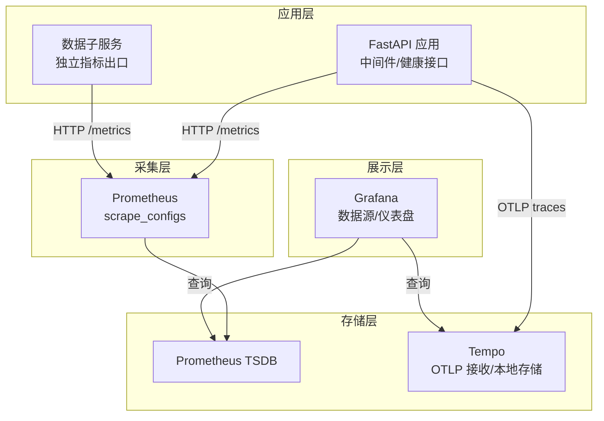
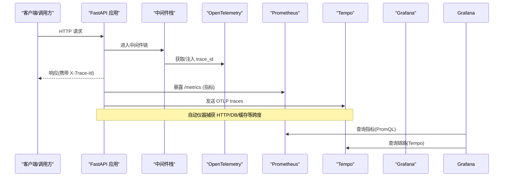
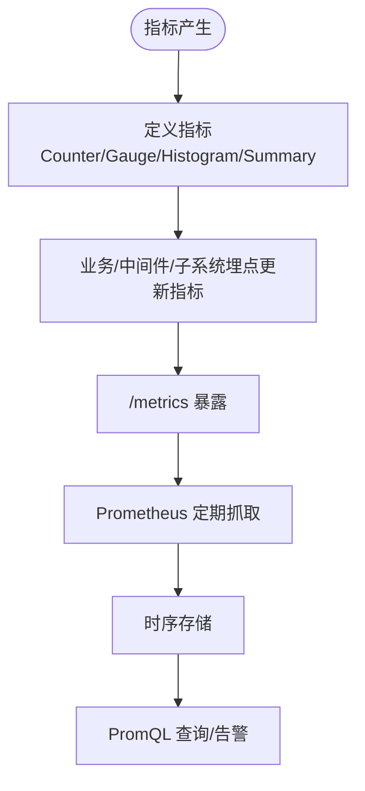
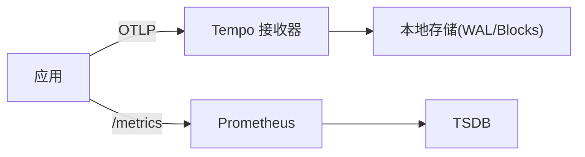
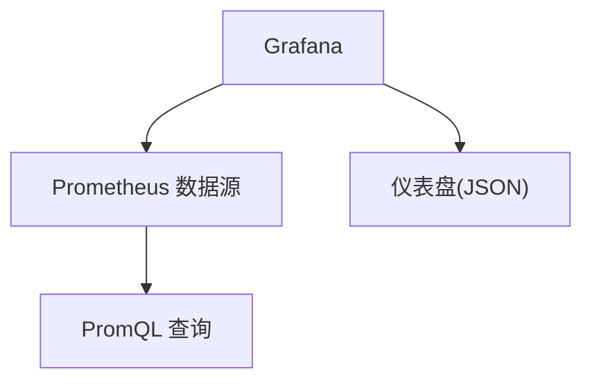
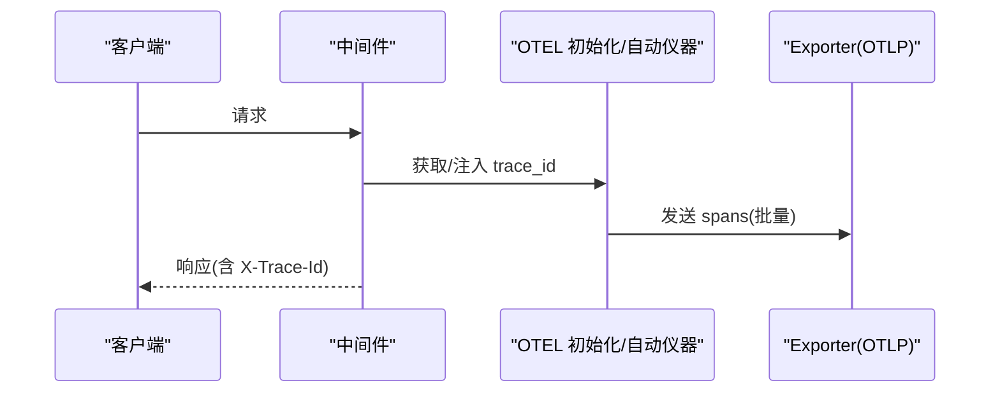
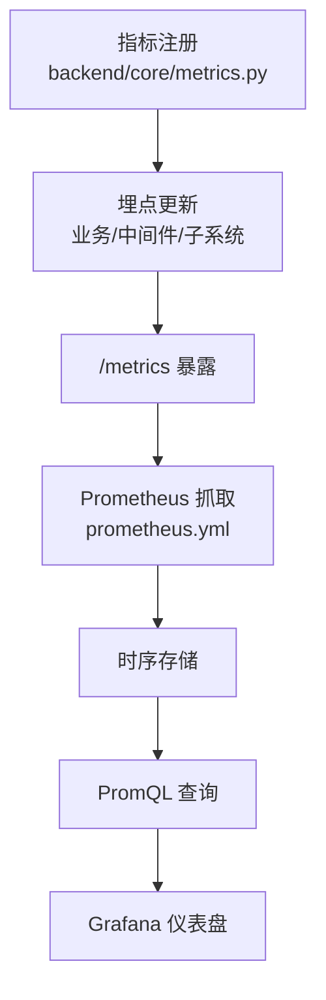
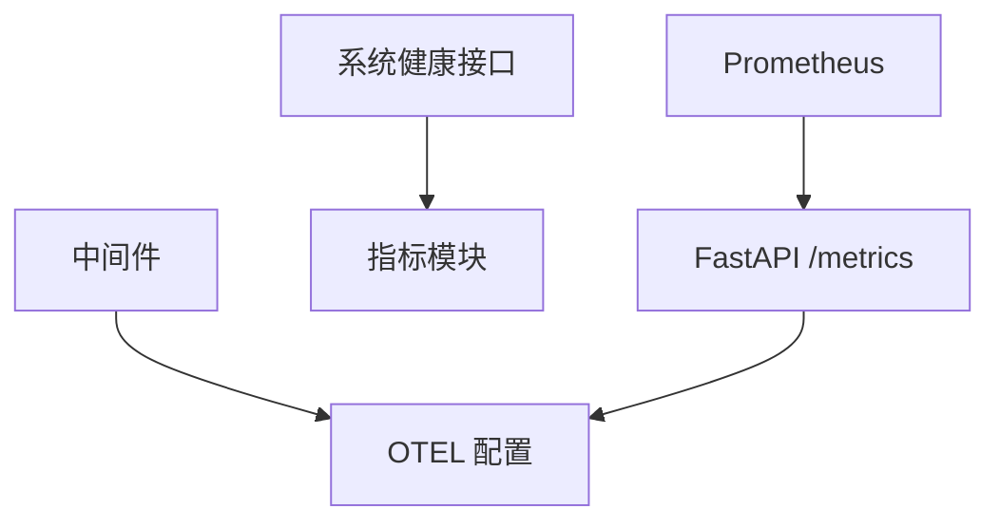
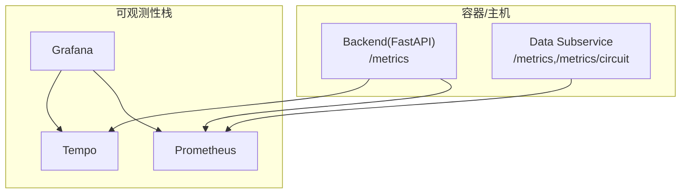

# 监控系统架构

<cite>
**本文引用的文件**
- [backend/core/metrics.py](file://backend/core/metrics.py)
- [backend/core/otel_config.py](file://backend/core/otel_config.py)
- [prometheus.yml](file://prometheus.yml)
- [grafana/provisioning/datasources/prometheus.yml](file://grafana/provisioning/datasources/prometheus.yml)
- [tempo/tempo.yaml](file://tempo/tempo.yaml)
- [config/prometheus_rules.yml](file://config/prometheus_rules.yml)
- [backend/middleware/stack.py](file://backend/middleware/stack.py)
- [backend/app/system_app.py](file://backend/app/system_app.py)
- [grafana/provisioning/dashboards/quant-agent-dashboard.json](file://grafana/provisioning/dashboards/quant-agent-dashboard.json)
</cite>

## 目录
1. [简介](#简介)
2. [项目结构](#项目结构)
3. [核心组件](#核心组件)
4. [架构总览](#架构总览)
5. [详细组件分析](#详细组件分析)
6. [依赖关系分析](#依赖关系分析)
7. [性能考量](#性能考量)
8. [故障排查指南](#故障排查指南)
9. [结论](#结论)
10. [附录](#附录)

## 简介
本文件面向 Quant Agent 的可观测性基础设施，系统性说明监控指标、链路追踪与可视化展示的整体架构与实现细节。重点覆盖：
- Prometheus 指标采集层：自定义指标定义、中间件埋点、子服务指标暴露与抓取配置
- 存储层：Prometheus 时序存储、Tempo 链路存储
- 展示层：Grafana 数据源与仪表盘
- OpenTelemetry 链路追踪：自动埋点、Trace ID 注入与传播、采样与导出
- 数据生命周期：从业务代码埋点到最终可视化的完整链路
- 部署与配置：关键配置文件与集成方式

## 项目结构
Quant Agent 的监控体系由“应用侧埋点 + 采集器 + 存储 + 可视化”四层构成：
- 应用侧埋点：在 FastAPI 中间件、系统健康接口、业务模块中埋入指标与链路上下文
- 采集器：Prometheus 按 job 抓取主服务与数据子服务的 /metrics 端点
- 存储：Prometheus 存储指标；Tempo 接收 OTLP 链路数据并本地持久化
- 展示：Grafana 通过预置数据源与仪表盘呈现指标与面板

图表来源
- [prometheus.yml:16-43](file://prometheus.yml#L16-L43)
- [backend/core/otel_config.py:220-302](file://backend/core/otel_config.py#L220-L302)
- [tempo/tempo.yaml:1-25](file://tempo/tempo.yaml#L1-L25)
- [grafana/provisioning/datasources/prometheus.yml:1-10](file://grafana/provisioning/datasources/prometheus.yml#L1-L10)

章节来源
- [prometheus.yml:16-43](file://prometheus.yml#L16-L43)
- [backend/core/otel_config.py:220-302](file://backend/core/otel_config.py#L220-L302)
- [tempo/tempo.yaml:1-25](file://tempo/tempo.yaml#L1-L25)
- [grafana/provisioning/datasources/prometheus.yml:1-10](file://grafana/provisioning/datasources/prometheus.yml#L1-L10)

## 核心组件
- 指标定义与采集（Prometheus）
  - 统一指标定义位于后端核心模块，涵盖行情延迟、WebSocket 连接、Redis 队列、熔断器状态、客户端 Web Vitals、数据源可用性、分布式节点心跳等
  - 中间件为每个请求注入 trace_id，并记录慢请求；系统健康接口聚合当前 Prometheus 指标快照供前端或外部系统消费
  - Prometheus 抓取配置包含主服务与数据子服务的多个 job，支持不同 metrics_path 与目标集合
- 链路追踪（OpenTelemetry）
  - 初始化 TracerProvider、采样策略、自动仪器（FastAPI、Redis、Requests/HTTPX、SQLAlchemy），支持 OTLP 导出到 Tempo 或 Console
  - 中间件将 trace_id 写入响应头，便于端到端追踪
- 可视化（Grafana）
  - 预配 Prometheus 数据源与仪表盘，提供 API QPS、P99 延迟等常用面板
- 规则与告警（Prometheus Recording Rules）
  - 提供 FMP watchlist 突变检测等预计算规则，用于多副本场景下的稳定判定

章节来源
- [backend/core/metrics.py:1-641](file://backend/core/metrics.py#L1-L641)
- [backend/middleware/stack.py:128-147](file://backend/middleware/stack.py#L128-L147)
- [backend/app/system_app.py:91-150](file://backend/app/system_app.py#L91-L150)
- [prometheus.yml:16-43](file://prometheus.yml#L16-L43)
- [backend/core/otel_config.py:220-302](file://backend/core/otel_config.py#L220-L302)
- [grafana/provisioning/dashboards/quant-agent-dashboard.json:1-200](file://grafana/provisioning/dashboards/quant-agent-dashboard.json#L1-L200)
- [config/prometheus_rules.yml:1-95](file://config/prometheus_rules.yml#L1-L95)

## 架构总览
下图展示了从业务代码到可视化的完整数据流：

图表来源
- [backend/middleware/stack.py:128-147](file://backend/middleware/stack.py#L128-L147)
- [backend/core/otel_config.py:220-302](file://backend/core/otel_config.py#L220-L302)
- [prometheus.yml:16-43](file://prometheus.yml#L16-L43)
- [tempo/tempo.yaml:1-25](file://tempo/tempo.yaml#L1-L25)
- [grafana/provisioning/datasources/prometheus.yml:1-10](file://grafana/provisioning/datasources/prometheus.yml#L1-L10)

## 详细组件分析

### 指标采集层（Prometheus）
- 指标定义
  - 集中式指标注册：行情延迟、WebSocket 连接数、Redis 队列深度、熔断器状态、客户端 Web Vitals、数据源可用性与限流、分布式节点心跳、K线缓存命中、数据质量、FMP collector 业务编排指标等
  - 指标类型选择合理：Counter/Gauge/Histogram/Summary 分别用于计数、瞬时值、分布与时序分位
- 采集与暴露
  - 主服务默认暴露 /metrics；数据子服务以独立 registry 暴露 /metrics 与 /metrics/circuit
  - Prometheus 配置了 fastapi-app、data-subservice、data-subservice-metrics 三个 job，分别抓取不同端口与路径
- 规则与预计算
  - 提供 recording rules 对 watchlist 变更进行服务端统一计算，避免多副本重复计数问题

图表来源
- [backend/core/metrics.py:1-641](file://backend/core/metrics.py#L1-L641)
- [prometheus.yml:16-43](file://prometheus.yml#L16-L43)
- [config/prometheus_rules.yml:53-95](file://config/prometheus_rules.yml#L53-L95)

章节来源
- [backend/core/metrics.py:1-641](file://backend/core/metrics.py#L1-L641)
- [prometheus.yml:16-43](file://prometheus.yml#L16-L43)
- [config/prometheus_rules.yml:1-95](file://config/prometheus_rules.yml#L1-L95)

### 存储层（Prometheus 与 Tempo）
- Prometheus
  - 全局抓取间隔与任务级间隔配置，针对 FastAPI 应用缩短抓取周期提升实时性
  - 多 job 覆盖主服务与数据子服务，支持不同 metrics_path
- Tempo
  - 启用 OTLP HTTP/gRPC 接收器
  - 本地 WAL 与块存储，保留窗口可配置
  - 与 OTEL 导出端点对齐，支持控制台输出或远程导出

图表来源
- [prometheus.yml:1-43](file://prometheus.yml#L1-L43)
- [tempo/tempo.yaml:1-25](file://tempo/tempo.yaml#L1-L25)

章节来源
- [prometheus.yml:1-43](file://prometheus.yml#L1-L43)
- [tempo/tempo.yaml:1-25](file://tempo/tempo.yaml#L1-L25)

### 展示层（Grafana）
- 数据源
  - 预置 Prometheus 数据源，指向集群内 Prometheus 地址
- 仪表盘
  - 提供 API QPS、P99 延迟等面板，基于 PromQL 直接查询
- 扩展
  - 可接入 Tempo 作为链路数据源，结合 Trace ID 进行跨层诊断

图表来源
- [grafana/provisioning/datasources/prometheus.yml:1-10](file://grafana/provisioning/datasources/prometheus.yml#L1-L10)
- [grafana/provisioning/dashboards/quant-agent-dashboard.json:1-200](file://grafana/provisioning/dashboards/quant-agent-dashboard.json#L1-L200)

章节来源
- [grafana/provisioning/datasources/prometheus.yml:1-10](file://grafana/provisioning/datasources/prometheus.yml#L1-L10)
- [grafana/provisioning/dashboards/quant-agent-dashboard.json:1-200](file://grafana/provisioning/dashboards/quant-agent-dashboard.json#L1-L200)

### 链路追踪（OpenTelemetry）
- 初始化与自动埋点
  - 根据环境变量启用/禁用 OTEL，设置服务名、版本与环境标签
  - 配置采样率，批量处理器导出至 OTLP 或 Console
  - 自动仪器覆盖 FastAPI、Redis、Requests/HTTPX、SQLAlchemy
- 上下文传播
  - 中间件读取/生成 trace_id，写入响应头 X-Trace-Id，并与日志上下文关联
  - 支持上游网关透传 W3C Trace Context

图表来源
- [backend/core/otel_config.py:111-118](file://backend/core/otel_config.py#L111-L118)
- [backend/core/otel_config.py:220-302](file://backend/core/otel_config.py#L220-L302)
- [backend/middleware/stack.py:128-147](file://backend/middleware/stack.py#L128-L147)

章节来源
- [backend/core/otel_config.py:111-118](file://backend/core/otel_config.py#L111-L118)
- [backend/core/otel_config.py:220-302](file://backend/core/otel_config.py#L220-L302)
- [backend/middleware/stack.py:128-147](file://backend/middleware/stack.py#L128-L147)

### 指标注册、采集、存储、查询、展示的完整生命周期

图表来源
- [backend/core/metrics.py:1-641](file://backend/core/metrics.py#L1-L641)
- [prometheus.yml:16-43](file://prometheus.yml#L16-L43)
- [grafana/provisioning/dashboards/quant-agent-dashboard.json:1-200](file://grafana/provisioning/dashboards/quant-agent-dashboard.json#L1-L200)

章节来源
- [backend/core/metrics.py:1-641](file://backend/core/metrics.py#L1-L641)
- [prometheus.yml:16-43](file://prometheus.yml#L16-L43)
- [grafana/provisioning/dashboards/quant-agent-dashboard.json:1-200](file://grafana/provisioning/dashboards/quant-agent-dashboard.json#L1-L200)

## 依赖关系分析
- 组件耦合
  - 中间件依赖 OTEL 能力以注入 trace_id；若不可用则回退为 no-op
  - 系统健康接口动态读取 Prometheus 指标样本，形成运行时快照
  - Prometheus 抓取配置与目标服务端口/路径强相关，需保持一致
- 外部依赖
  - OTEL SDK/Instrumentors 可选安装，缺失时降级为无操作
  - Tempo 仅接收 OTLP，不反向影响应用
- 潜在循环依赖
  - 通过模块化导入与懒加载避免启动期循环依赖

图表来源
- [backend/middleware/stack.py:128-147](file://backend/middleware/stack.py#L128-L147)
- [backend/app/system_app.py:91-150](file://backend/app/system_app.py#L91-L150)
- [backend/core/otel_config.py:220-302](file://backend/core/otel_config.py#L220-L302)
- [prometheus.yml:16-43](file://prometheus.yml#L16-L43)

章节来源
- [backend/middleware/stack.py:128-147](file://backend/middleware/stack.py#L128-L147)
- [backend/app/system_app.py:91-150](file://backend/app/system_app.py#L91-L150)
- [backend/core/otel_config.py:220-302](file://backend/core/otel_config.py#L220-L302)
- [prometheus.yml:16-43](file://prometheus.yml#L16-L43)

## 性能考量
- 抓取频率
  - FastAPI 应用抓取间隔缩短至 5s，提高实时性；其他 job 保持 15s
- 指标粒度
  - 使用 Histogram/Summary 刻画延迟分布，注意桶/分位设计对存储与查询的影响
- 采样策略
  - OTEL 采样率可调，生产环境建议按需降低以减少开销
- 中间件开销
  - 响应信封与慢请求记录仅在必要时生效；限流中间件在 Redis 异常时具备降级策略

[本节为通用指导，无需特定文件引用]

## 故障排查指南
- 无法抓取指标
  - 检查 prometheus.yml 中 targets 与 metrics_path 是否与实际服务一致
  - 确认主服务与数据子服务端口可达，鉴权信息正确
- 链路未上报
  - 检查 OTEL_ENABLED、OTEL_EXPORTER_OTLP_ENDPOINT 是否正确
  - 确认自动仪器已启用且无报错日志
- 仪表盘无数据
  - 验证 Grafana 数据源 URL 与访问模式
  - 使用 Explore 执行基础 PromQL 验证数据存在
- 慢请求过多
  - 关注中间件的慢请求记录与系统健康接口的性能统计

章节来源
- [prometheus.yml:16-43](file://prometheus.yml#L16-L43)
- [backend/core/otel_config.py:220-302](file://backend/core/otel_config.py#L220-L302)
- [grafana/provisioning/datasources/prometheus.yml:1-10](file://grafana/provisioning/datasources/prometheus.yml#L1-L10)
- [backend/middleware/stack.py:222-239](file://backend/middleware/stack.py#L222-L239)
- [backend/app/system_app.py:153-200](file://backend/app/system_app.py#L153-L200)

## 结论
Quant Agent 的可观测性体系以 Prometheus 为核心指标平台，结合 OpenTelemetry 实现全链路追踪，并通过 Grafana 完成可视化。该方案具备以下优势：
- 分层清晰：采集、存储、展示职责明确，易于扩展与维护
- 灵活可控：指标定义集中、抓取策略可配、采样率可调
- 可观测性强：指标+日志+链路三位一体，支撑快速定位问题
- 工程友好：中间件与自动仪器减少侵入式埋点成本

[本节为总结性内容，无需特定文件引用]

## 附录
- 部署架构图（概念图）

[此图为概念示意，不直接映射具体源码，故无图表来源]

- 关键配置要点
  - Prometheus scrape_configs：job_name、scrape_interval、metrics_path、targets
  - OTEL 环境变量：OTEL_ENABLED、OTEL_SERVICE_NAME、OTEL_EXPORTER_OTLP_ENDPOINT、OTEL_SAMPLING_RATE
  - Tempo 存储：WAL 与 blocks 路径、保留时间
  - Grafana 数据源：type、url、access

章节来源
- [prometheus.yml:16-43](file://prometheus.yml#L16-L43)
- [backend/core/otel_config.py:111-118](file://backend/core/otel_config.py#L111-L118)
- [tempo/tempo.yaml:1-25](file://tempo/tempo.yaml#L1-L25)
- [grafana/provisioning/datasources/prometheus.yml:1-10](file://grafana/provisioning/datasources/prometheus.yml#L1-L10)