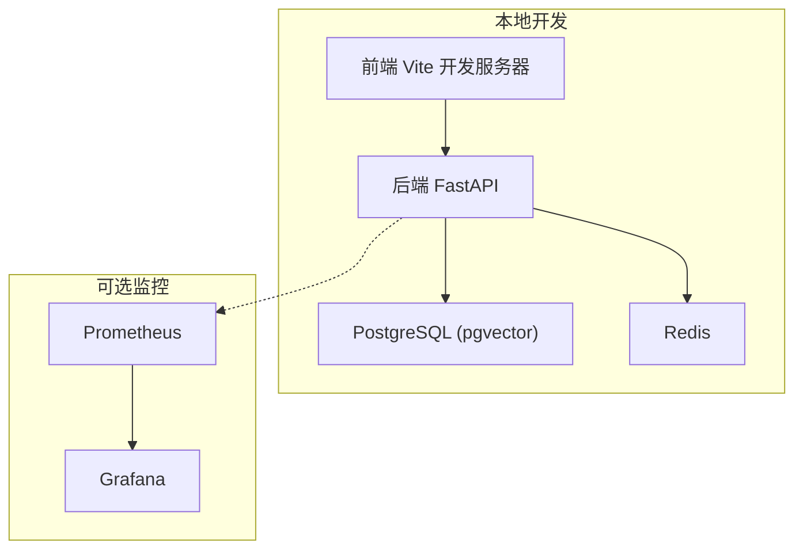
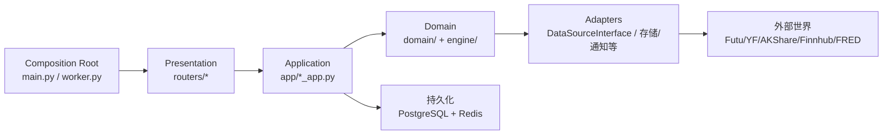
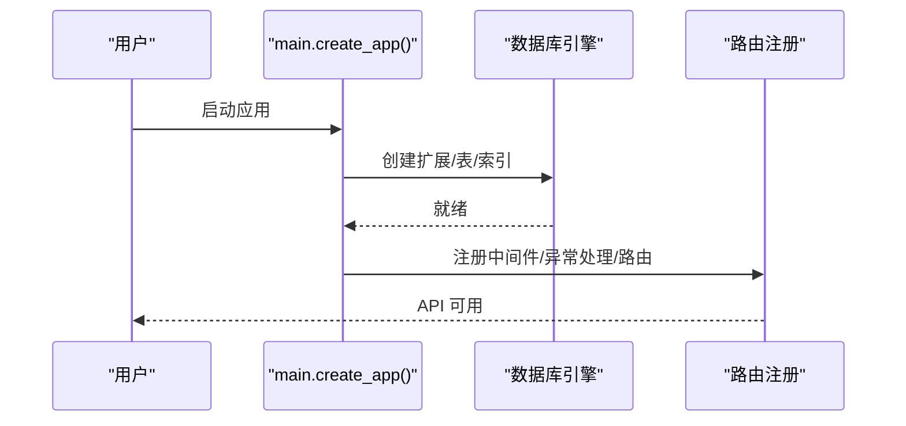
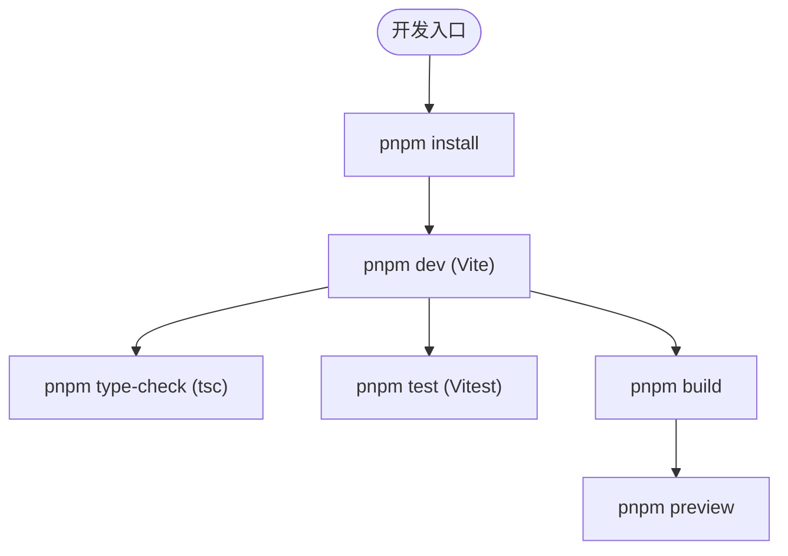
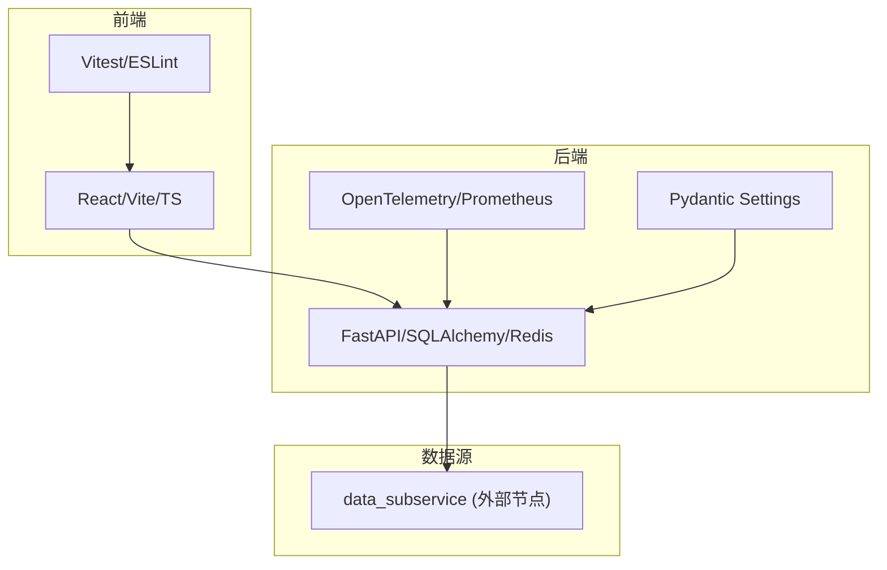

# 开发者指南

<cite>
**本文引用的文件**
- [README.md](file://README.md)
- [pyproject.toml](file://pyproject.toml)
- [Makefile](file://Makefile)
- [docker-compose.master.yml](file://docker-compose.master.yml)
- [backend/main.py](file://backend/main.py)
- [backend/core/config.py](file://backend/core/config.py)
- [backend/core/database.py](file://backend/core/database.py)
- [frontend/package.json](file://frontend/package.json)
- [frontend/tsconfig.json](file://frontend/tsconfig.json)
- [client/flutter_app/pubspec.yaml](file://client/flutter_app/pubspec.yaml)
- [.pre-commit-config.yaml](file://.pre-commit-config.yaml)
- [docs/03. 后端架构与执行引擎.md](file://docs/03. 后端架构与执行引擎.md)
- [docs/前端目录结构规范.md](file://docs/前端目录结构规范.md)
</cite>

## 目录
1. [简介](#简介)
2. [项目结构](#项目结构)
3. [核心组件](#核心组件)
4. [架构总览](#架构总览)
5. [详细组件分析](#详细组件分析)
6. [依赖关系分析](#依赖关系分析)
7. [性能考量](#性能考量)
8. [故障排查指南](#故障排查指南)
9. [结论](#结论)
10. [附录](#附录)

## 简介
本指南面向Quant Agent项目的开发者，覆盖开发环境搭建、代码规范、提交流程、工具链、项目结构与贡献流程。目标是让新加入的开发者快速上手，并在团队协作中保持一致的工程标准。

## 项目结构
仓库采用前后端分离与多服务编排：
- 后端（Python/FastAPI）：提供REST/WebSocket/SSE接口，集成数据库、缓存、可观测性与业务路由。
- 前端（React/Vite）：SPA应用，统一HTTP客户端与状态管理。
- Flutter薄客户端：移动端入口（Android/iOS/HarmonyOS）。
- 数据子服务（data_subservice）：独立部署的数据源采集与处理节点，主服务通过HTTP路由访问。
- 基础设施：Redis、PostgreSQL（含pgvector扩展）、Prometheus/Grafana监控可选启用。

**图表来源**
- [docker-compose.master.yml:17-75](file://docker-compose.master.yml#L17-L75)
- [docker-compose.master.yml:197-251](file://docker-compose.master.yml#L197-L251)
- [backend/main.py:125-218](file://backend/main.py#L125-L218)

**章节来源**
- [README.md:22-56](file://README.md#L22-L56)
- [docker-compose.master.yml:17-75](file://docker-compose.master.yml#L17-L75)
- [docker-compose.master.yml:197-251](file://docker-compose.master.yml#L197-L251)

## 核心组件
- 应用工厂与路由装配：FastAPI 应用创建、中间件注册、OpenAPI 定制、路由挂载与静态资源服务。
- 配置中心：基于 Pydantic Settings 的环境变量校验与默认值管理，强制关键配置存在。
- 数据库层：同步/异步引擎、连接池参数、模型初始化与扩展安装。
- 前端工程：Vite + TypeScript + ESLint + Vitest，统一类型检查与测试脚本。
- 质量门禁：Pre-commit 钩子统一 Python/前端 Lint、类型检查与单测。

**章节来源**
- [backend/main.py:125-218](file://backend/main.py#L125-L218)
- [backend/core/config.py:20-134](file://backend/core/config.py#L20-L134)
- [backend/core/database.py:1-67](file://backend/core/database.py#L1-L67)
- [frontend/package.json:6-15](file://frontend/package.json#L6-L15)
- [.pre-commit-config.yaml:1-72](file://.pre-commit-config.yaml#L1-L72)

## 架构总览
后端遵循整洁架构分层：Composition Root（main/worker）→ Presentation（routers）→ Application（用例编排）→ Domain（领域模型与Port）→ Adapters（外部数据源/存储）。生产环境数据源以 external 模式运行在独立子服务节点，主服务仅通过 HTTP 路由调用，避免在主进程加载重型数据源 SDK。

**图表来源**
- [docs/03. 后端架构与执行引擎.md:61-107](file://docs/03. 后端架构与执行引擎.md#L61-L107)
- [backend/main.py:125-218](file://backend/main.py#L125-L218)

**章节来源**
- [docs/03. 后端架构与执行引擎.md:61-107](file://docs/03. 后端架构与执行引擎.md#L61-L107)

## 详细组件分析

### 后端启动与数据库初始化
- 启动流程：加载环境变量 → 设置全局超时 → 导入模型并初始化数据库（创建扩展与索引）→ 组装中间件与异常处理器 → 挂载所有路由 → 返回应用实例。
- 数据库：支持 SQLite 与 PostgreSQL；PostgreSQL 自动启用 pgvector 与 pg_trgm 扩展，并创建全文检索相关索引。
- 配置：通过 pydantic-settings 集中读取 .env，缺失必填项时 fail-fast。

**图表来源**
- [backend/main.py:32-57](file://backend/main.py#L32-L57)
- [backend/main.py:125-218](file://backend/main.py#L125-L218)
- [backend/core/database.py:1-67](file://backend/core/database.py#L1-L67)

**章节来源**
- [backend/main.py:32-57](file://backend/main.py#L32-L57)
- [backend/main.py:125-218](file://backend/main.py#L125-L218)
- [backend/core/database.py:1-67](file://backend/core/database.py#L1-L67)
- [backend/core/config.py:20-134](file://backend/core/config.py#L20-L134)

### 前端工程与类型系统
- 构建与脚本：dev/build/type-check/test/coverage 等命令统一封装于 package.json。
- 类型与模块：TypeScript 严格模式、ESNext 目标、路径别名 @/* 指向 src。
- 目录规范：按 features 划分业务域，统一布局壳与 HTTP 客户端入口。

**图表来源**
- [frontend/package.json:6-15](file://frontend/package.json#L6-L15)
- [frontend/tsconfig.json:1-42](file://frontend/tsconfig.json#L1-L42)
- [docs/前端目录结构规范.md:7-51](file://docs/前端目录结构规范.md#L7-L51)

**章节来源**
- [frontend/package.json:6-15](file://frontend/package.json#L6-L15)
- [frontend/tsconfig.json:1-42](file://frontend/tsconfig.json#L1-L42)
- [docs/前端目录结构规范.md:7-51](file://docs/前端目录结构规范.md#L7-L51)

### Flutter 薄客户端
- 依赖与SDK：Flutter SDK 3.12+，使用 Riverpod、Go Router、Dio、WebSocket 通道等。
- 用途：作为移动端轻量入口，对接后端 API 与实时通道。

**章节来源**
- [client/flutter_app/pubspec.yaml:1-29](file://client/flutter_app/pubspec.yaml#L1-L29)

## 依赖关系分析
- 后端依赖：FastAPI、SQLAlchemy、Redis、OpenTelemetry、Pydantic Settings、WebSockets、Prometheus 客户端等。
- 数据源隔离：主服务不直接引入第三方数据源 SDK，数据源能力由 data_subservice 提供并通过 HTTP 路由访问。
- 前端依赖：React生态、图表库、状态管理与测试框架。
- 质量工具：Ruff、mypy、pytest、Vitest、ESLint、Playwright。

**图表来源**
- [pyproject.toml:1-95](file://pyproject.toml#L1-L95)
- [docs/03. 后端架构与执行引擎.md:113-137](file://docs/03. 后端架构与执行引擎.md#L113-L137)
- [frontend/package.json:17-112](file://frontend/package.json#L17-L112)

**章节来源**
- [pyproject.toml:1-95](file://pyproject.toml#L1-L95)
- [docs/03. 后端架构与执行引擎.md:113-137](file://docs/03. 后端架构与执行引擎.md#L113-L137)
- [frontend/package.json:17-112](file://frontend/package.json#L17-L112)

## 性能考量
- 并发与内存：主服务容器限制并发请求数与最大请求数，防止堆增长；合理设置连接池大小与回收策略。
- 数据库：PostgreSQL 启用向量与模糊检索扩展，配合合适索引提升查询性能。
- 前端：使用轻量图表库与 Web Worker 计算，减少主线程压力。
- 监控：Prometheus/Grafana 可视化指标，便于定位瓶颈。

[本节为通用指导，无需特定文件引用]

## 故障排查指南
- 启动失败：检查 .env 是否包含 DATABASE_URL、EMBEDDING_API_KEY 等必填项；确认 Redis/PG 健康。
- 数据库错误：确认 pgvector/pg_trgm 扩展已启用；检查连接字符串与权限。
- 前端类型/测试失败：确保 pnpm 版本一致，执行 type-check 与 test 定位问题。
- 质量门禁拦截：修复 ruff/mypy/eslint/vitest 报错后再提交。

**章节来源**
- [backend/core/config.py:94-119](file://backend/core/config.py#L94-L119)
- [backend/main.py:32-57](file://backend/main.py#L32-L57)
- [.pre-commit-config.yaml:1-72](file://.pre-commit-config.yaml#L1-L72)

## 结论
本指南提供了从环境搭建到代码规范、提交流程与工具的完整说明。建议新成员优先完成本地开发环境一键启动，熟悉前后端脚本与质量门禁，再逐步深入各子系统文档与实现细节。

[本节为总结性内容，无需特定文件引用]

## 附录

### 开发环境搭建（IDE、依赖、数据库、服务启动）
- IDE 建议
  - 后端：VS Code + Python 插件，启用 Ruff 与 mypy；或使用支持 uv 的 IDE。
  - 前端：VS Code + TypeScript/ESLint/Vitest 插件。
  - Flutter：Android Studio/VS Code + Flutter 插件。
- 依赖安装
  - 后端：使用 Makefile 提供的 install 或 uv sync --all-extras；安装 pre-commit 钩子。
  - 前端：cd frontend && pnpm install。
  - Flutter：flutter pub get。
- 数据库初始化
  - 启动 PostgreSQL（含 pgvector）与 Redis；应用启动时会自动创建扩展与索引。
- 服务启动
  - 一键全栈：make dev（启动 infra + backend + worker + frontend）。
  - 单独启动：make dev-api / make dev-worker / make dev-frontend / make dev-infra。
  - Docker 主节点：docker-compose -f docker-compose.master.yml up -d（含监控 profile 可选）。

**章节来源**
- [Makefile:31-105](file://Makefile#L31-L105)
- [docker-compose.master.yml:17-75](file://docker-compose.master.yml#L17-L75)
- [docker-compose.master.yml:76-165](file://docker-compose.master.yml#L76-L165)
- [backend/main.py:32-57](file://backend/main.py#L32-L57)

### 代码规范标准
- Python
  - 格式与检查：Ruff（行宽120，忽略E501），mypy 类型检查。
  - 测试：pytest + pytest-cov，覆盖率门槛≥80%。
  - 依赖分组：dev 依赖通过 dependency-groups 管理。
- TypeScript/前端
  - 严格类型：tsconfig strict=true，路径别名 @/*。
  - 质量：ESLint + Vitest；单测与类型检查纳入 pre-commit。
- Git 工作流
  - Pre-commit：提交前自动执行 ruff/mypy/frontend lint/tests 等。
  - 提交信息：遵循 Conventional Commits（见 README）。

**章节来源**
- [pyproject.toml:104-165](file://pyproject.toml#L104-L165)
- [pyproject.toml:212-231](file://pyproject.toml#L212-L231)
- [frontend/tsconfig.json:1-42](file://frontend/tsconfig.json#L1-L42)
- [.pre-commit-config.yaml:1-72](file://.pre-commit-config.yaml#L1-L72)
- [README.md:107-115](file://README.md#L107-L115)

### 提交流程指南（分支、提交信息、代码审查）
- 分支策略
  - 功能分支：feature/* 对应需求或任务。
  - 修复分支：fix/* 用于缺陷修复。
  - 发布分支：release/* 用于版本打包与回归。
- 提交信息规范
  - 使用 Conventional Commits（如 feat/fix/docs/chore 等）。
- 代码审查
  - 提交 PR 后触发 CI（后端/前端/安全扫描）。
  - 要求：测试通过、Lint 通过、覆盖率达标、无新增违规 import。

**章节来源**
- [README.md:79-115](file://README.md#L79-L115)
- [.pre-commit-config.yaml:1-72](file://.pre-commit-config.yaml#L1-L72)

### 开发工具推荐
- 调试
  - 后端：uvicorn --reload；结构化日志（structlog）；OpenTelemetry 链路追踪。
  - 前端：浏览器开发者工具；MSW 模拟网络；Vitest 断点调试。
- 性能分析
  - 后端：Prometheus 指标；内存/CPU 监控；连接池与并发参数调优。
  - 前端：Lighthouse 基线；浏览器性能面板。
- 测试
  - 后端：pytest + xdist 并行；vcrpy 录制回放。
  - 前端：Vitest + Playwright E2E。

**章节来源**
- [pyproject.toml:125-165](file://pyproject.toml#L125-L165)
- [pyproject.toml:212-231](file://pyproject.toml#L212-L231)
- [frontend/package.json:6-15](file://frontend/package.json#L6-L15)
- [docker-compose.master.yml:197-251](file://docker-compose.master.yml#L197-L251)

### 项目结构规范（文件组织、命名、模块划分）
- 后端
  - 分层：routers（展示层）→ services/app（应用层）→ domain/engine（领域与引擎）→ adapters（适配器）。
  - 禁止矩阵：跨层禁止随意 import，保持依赖向内。
- 前端
  - 目录：components/ui、features/*、hooks/stores/lib/services/types/workers/styles/locales。
  - 约束：唯一布局壳、唯一 HTTP 客户端、单文件行数限制、图表库选择。
- Flutter
  - 薄客户端：聚焦 UI 与通信，复用后端 API。

**章节来源**
- [docs/03. 后端架构与执行引擎.md:61-107](file://docs/03. 后端架构与执行引擎.md#L61-L107)
- [docs/前端目录结构规范.md:7-51](file://docs/前端目录结构规范.md#L7-L51)
- [client/flutter_app/pubspec.yaml:1-29](file://client/flutter_app/pubspec.yaml#L1-L29)

### 贡献指南（Issue、PR、问题报告模板）
- Issue
  - 描述：背景、复现步骤、期望行为、实际行为、环境与日志。
  - 分类：bug/enhancement/question 等。
- Pull Request
  - 关联 Issue；变更范围清晰；附带必要测试与文档更新。
  - CI 必须通过；符合代码规范与提交信息约定。
- 问题报告模板
  - 环境信息（OS、Python/Node/Flutter 版本）。
  - 依赖与配置（.env 关键项脱敏）。
  - 日志与截图（必要时附最小复现代码片段路径）。

[本节为通用流程说明，无需特定文件引用]