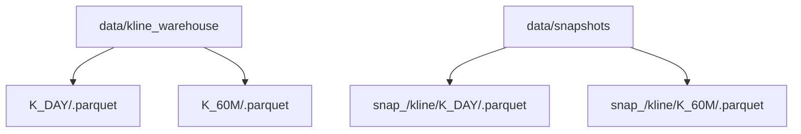
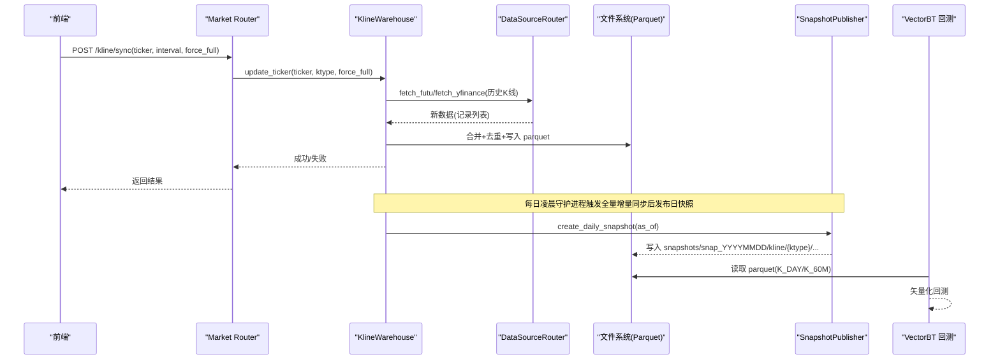
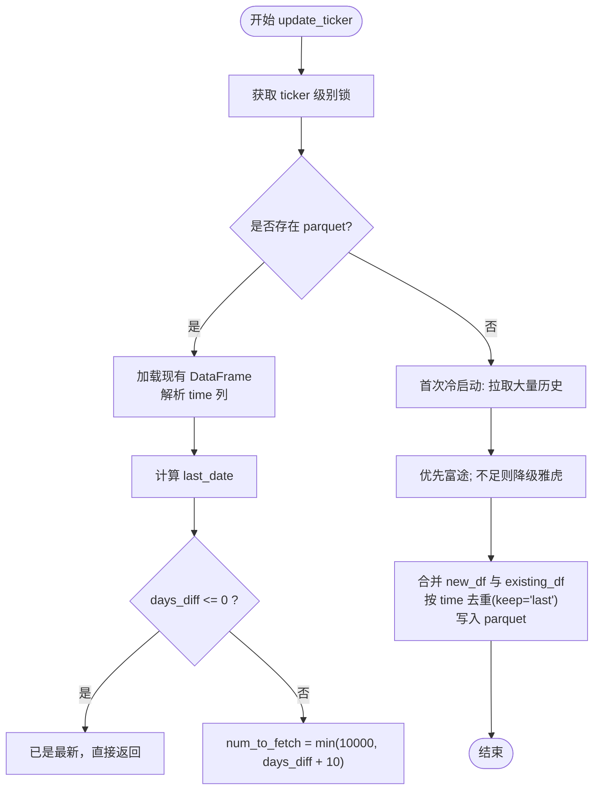
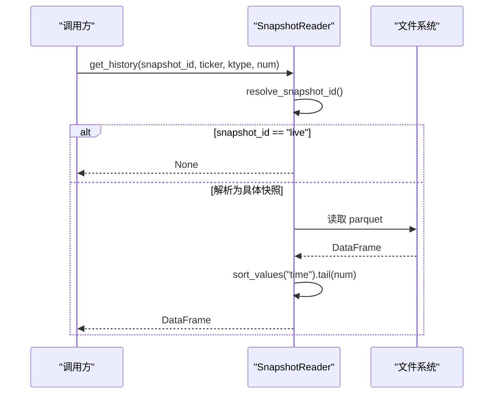
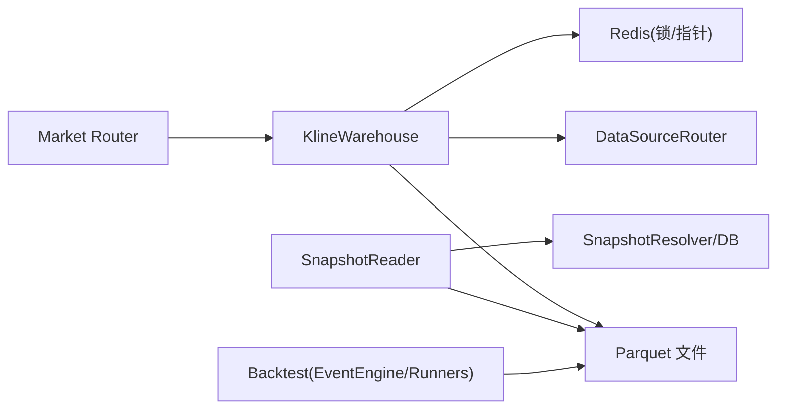

# Parquet存储架构

<cite>
**本文引用的文件**
- [kline_warehouse.py](file://backend/services/datalake/kline_warehouse.py)
- [paths.py](file://backend/services/datalake/paths.py)
- [snapshot_reader.py](file://backend/services/datalake/snapshot_reader.py)
- [market.py](file://backend/routers/market.py)
- [event_engine.py](file://backend/backtest/event_engine.py)
- [runners.py](file://backend/backtest/runners.py)
- [benchmark_kline_pipeline.py](file://backend/scripts/benchmark_kline_pipeline.py)
</cite>

## 目录
1. [简介](#简介)
2. [项目结构](#项目结构)
3. [核心组件](#核心组件)
4. [架构总览](#架构总览)
5. [详细组件分析](#详细组件分析)
6. [依赖关系分析](#依赖关系分析)
7. [性能考量](#性能考量)
8. [故障排查指南](#故障排查指南)
9. [结论](#结论)
10. [附录](#附录)

## 简介
本文件系统化阐述 Quant Agent 的 K 线仓库与 Parquet 数据湖存储架构，重点覆盖：
- K 线仓库设计原理：按周期分目录、文件命名规范、路径结构设计。
- Parquet 格式优势：列式存储、压缩效率、查询性能。
- 增量更新机制：时间戳判断、去重策略、合并写入。
- 高效读写实践：异步线程池、错误处理、快照只读访问。
- 与 VectorBT 回测引擎集成：纳秒级极速读取与矢量化回测链路。
- 性能基准与最佳实践：端到端压测方法与优化建议。

## 项目结构
K 线仓库位于 data/kline_warehouse，按 K 线周期划分子目录（如 K_DAY、K_60M），每个标的生成一个 parquet 文件；快照目录位于 data/snapshots，按 snapshot_id 组织，内部包含 kline/{ktype}/{ticker}.parquet 等结构。

**图示来源**
- [kline_warehouse.py:27-32](file://backend/services/datalake/kline_warehouse.py#L27-L32)
- [paths.py:10-13](file://backend/services/datalake/paths.py#L10-L13)
- [snapshot_reader.py:79-102](file://backend/services/datalake/snapshot_reader.py#L79-L102)

**章节来源**
- [kline_warehouse.py:11-32](file://backend/services/datalake/kline_warehouse.py#L11-L32)
- [paths.py:10-13](file://backend/services/datalake/paths.py#L10-L13)

## 核心组件
- KlineWarehouse：本地 K 线数仓服务，提供历史读取与增量更新，面向 VectorBT 回测提供极速读取。
- SnapshotReader：快照只读访问器，解析 latest_published 并读取指定快照的 K 线 parquet 文件。
- paths：统一路径约定与文件名转换工具。
- Market Router：暴露手动触发同步接口，驱动 K 线仓库增量更新。
- Backtest 引擎：通过事件引擎与 runners 使用 VectorBT 进行矢量化回测。
- Benchmark：端到端压测脚本，用于评估延迟与吞吐。

**章节来源**
- [kline_warehouse.py:16-21](file://backend/services/datalake/kline_warehouse.py#L16-L21)
- [snapshot_reader.py:30-40](file://backend/services/datalake/snapshot_reader.py#L30-L40)
- [paths.py:32-42](file://backend/services/datalake/paths.py#L32-L42)
- [market.py:463-489](file://backend/routers/market.py#L463-L489)
- [event_engine.py:14](file://backend/backtest/event_engine.py#L14)
- [runners.py:14](file://backend/backtest/runners.py#L14)
- [benchmark_kline_pipeline.py:1-27](file://backend/scripts/benchmark_kline_pipeline.py#L1-L27)

## 架构总览
下图展示从前端触发到本地数仓增量更新，再到快照发布与回测读取的整体流程。

**图示来源**
- [market.py:463-489](file://backend/routers/market.py#L463-L489)
- [kline_warehouse.py:55-173](file://backend/services/datalake/kline_warehouse.py#L55-L173)
- [kline_warehouse.py:175-248](file://backend/services/datalake/kline_warehouse.py#L175-L248)
- [snapshot_reader.py:79-102](file://backend/services/datalake/snapshot_reader.py#L79-L102)
- [event_engine.py:14](file://backend/backtest/event_engine.py#L14)
- [runners.py:14](file://backend/backtest/runners.py#L14)

## 详细组件分析

### K 线仓库（KlineWarehouse）
- 存储策略：按 K 线周期分目录（K_DAY、K_60M），每个标的生成安全命名的 parquet 文件。
- 快速读取：get_history 使用 pyarrow 引擎读取并按 time 排序，取尾部 num 条；通过 asyncio.to_thread 避免阻塞事件循环。
- 增量更新：update_ticker 基于 last_date 计算拉取数量，优先富途高质量前复权数据，不足时降级雅虎财经；合并时按 time 去重且 keep='last'，确保最新复权覆盖旧值。
- 守护进程：daemon_sync_task 每天凌晨执行分布式锁控制的增量同步，并在成功后发布日快照与保留策略。

**图示来源**
- [kline_warehouse.py:55-173](file://backend/services/datalake/kline_warehouse.py#L55-L173)

**章节来源**
- [kline_warehouse.py:27-53](file://backend/services/datalake/kline_warehouse.py#L27-L53)
- [kline_warehouse.py:55-173](file://backend/services/datalake/kline_warehouse.py#L55-L173)
- [kline_warehouse.py:175-248](file://backend/services/datalake/kline_warehouse.py#L175-L248)

### 快照只读访问（SnapshotReader）
- 路径解析：支持 latest_published 解析为具体 snapshot_id，或 live 模式。
- 读取逻辑：get_history_sync 定位 snapshots/snap_{id}/kline/{ktype}/{ticker}.parquet，读取后按 time 排序并取尾部 num 条；异步封装避免阻塞。
- 清单读取：get_manifest 支持从文件或数据库读取快照元信息。

**图示来源**
- [snapshot_reader.py:42-64](file://backend/services/datalake/snapshot_reader.py#L42-L64)
- [snapshot_reader.py:79-114](file://backend/services/datalake/snapshot_reader.py#L79-L114)

**章节来源**
- [snapshot_reader.py:30-40](file://backend/services/datalake/snapshot_reader.py#L30-L40)
- [snapshot_reader.py:42-64](file://backend/services/datalake/snapshot_reader.py#L42-L64)
- [snapshot_reader.py:79-114](file://backend/services/datalake/snapshot_reader.py#L79-L114)

### 路径与命名约定（paths）
- LIVE_ROOT/SNAPSHOTS_ROOT：环境变量可覆盖默认路径，便于部署隔离。
- ticker_to_filename/filename_to_ticker：将带点/斜杠的 ticker 转换为安全的下划线文件名，并支持反向解析。

**章节来源**
- [paths.py:10-13](file://backend/services/datalake/paths.py#L10-L13)
- [paths.py:32-42](file://backend/services/datalake/paths.py#L32-L42)

### 市场路由（Market Router）
- /kline/sync：接收前端请求，映射 interval 到 ktype，调用 KlineWarehouse.update_ticker 执行增量同步。
- 错误处理：异常时返回 HTTP 500，提示额度耗尽或标的退市等可能原因。

**章节来源**
- [market.py:463-489](file://backend/routers/market.py#L463-L489)

### 与 VectorBT 回测引擎集成
- 事件引擎与 runners 导入 vectorbt，使用矢量化撮合与批量回测能力。
- 回测数据源：可从本地 parquet 或快照目录读取 K 线，结合事件引擎完成信号匹配与绩效统计。

**章节来源**
- [event_engine.py:14](file://backend/backtest/event_engine.py#L14)
- [event_engine.py:349](file://backend/backtest/event_engine.py#L349)
- [event_engine.py:406-450](file://backend/backtest/event_engine.py#L406-L450)
- [runners.py:14](file://backend/backtest/runners.py#L14)
- [runners.py:133](file://backend/backtest/runners.py#L133)
- [runners.py:446](file://backend/backtest/runners.py#L446)
- [runners.py:558](file://backend/backtest/runners.py#L558)

## 依赖关系分析
- KlineWarehouse 依赖 DataSourceRouter 获取富途/雅虎数据，依赖 Redis 实现分布式锁与守护进程调度。
- SnapshotReader 依赖 paths 与 Redis/PG 解析 latest_published，依赖文件系统读取 parquet。
- Market Router 依赖 KlineWarehouse 与数据源路由。
- Backtest 模块依赖 VectorBT 与事件引擎，消费 parquet 数据进行矢量化回测。

**图示来源**
- [kline_warehouse.py:55-173](file://backend/services/datalake/kline_warehouse.py#L55-L173)
- [snapshot_reader.py:42-64](file://backend/services/datalake/snapshot_reader.py#L42-L64)
- [market.py:463-489](file://backend/routers/market.py#L463-L489)
- [event_engine.py:14](file://backend/backtest/event_engine.py#L14)
- [runners.py:14](file://backend/backtest/runners.py#L14)

**章节来源**
- [kline_warehouse.py:55-173](file://backend/services/datalake/kline_warehouse.py#L55-L173)
- [snapshot_reader.py:42-64](file://backend/services/datalake/snapshot_reader.py#L42-L64)
- [market.py:463-489](file://backend/routers/market.py#L463-L489)
- [event_engine.py:14](file://backend/backtest/event_engine.py#L14)
- [runners.py:14](file://backend/backtest/runners.py#L14)

## 性能考量
- Parquet 优势：列式存储、高压缩比、选择性列读取；pyarrow 引擎在 C 层释放 GIL，配合 to_thread 与事件循环解耦，提升并发读取性能。
- 增量合并策略：按 time 去重且 keep='last'，保证最新复权覆盖旧值，减少重复写入与脏数据。
- 异步与线程池：所有 I/O 密集操作（读取/写入 parquet）均放入线程池，避免阻塞异步事件循环。
- 快照只读：SnapshotReader 提供稳定只读视图，适合回测与报表场景，降低写放大。
- 压测工具：benchmark_kline_pipeline 提供 Redis Stream、行情获取、写入与端到端延迟测量，目标 P99 < 50ms。

**章节来源**
- [kline_warehouse.py:34-53](file://backend/services/datalake/kline_warehouse.py#L34-L53)
- [kline_warehouse.py:151-173](file://backend/services/datalake/kline_warehouse.py#L151-L173)
- [snapshot_reader.py:79-114](file://backend/services/datalake/snapshot_reader.py#L79-L114)
- [benchmark_kline_pipeline.py:73-91](file://backend/scripts/benchmark_kline_pipeline.py#L73-L91)
- [benchmark_kline_pipeline.py:222-254](file://backend/scripts/benchmark_kline_pipeline.py#L222-L254)

## 故障排查指南
- 读取失败：检查 parquet 文件是否存在、time 列是否可解析；查看日志中的警告信息。
- 增量更新失败：确认数据源配额与网络状态；若富途返回数据不足，将自动降级至雅虎财经；若仍失败，检查 ticker 有效性。
- 守护进程异常：检查 Redis 锁键与定时任务；确认 daily snapshot 发布与保留策略是否成功。
- 快照解析失败：验证 latest_published 指针与 manifest.json；必要时回退到具体 snapshot_id。

**章节来源**
- [kline_warehouse.py:51-53](file://backend/services/datalake/kline_warehouse.py#L51-L53)
- [kline_warehouse.py:147-173](file://backend/services/datalake/kline_warehouse.py#L147-L173)
- [kline_warehouse.py:210-248](file://backend/services/datalake/kline_warehouse.py#L210-L248)
- [snapshot_reader.py:42-64](file://backend/services/datalake/snapshot_reader.py#L42-L64)
- [snapshot_reader.py:66-77](file://backend/services/datalake/snapshot_reader.py#L66-L77)

## 结论
该 Parquet 存储架构以 K 线仓库为核心，结合快照只读访问与 VectorBT 回测引擎，实现了高效、稳定、可扩展的本地数据湖方案。通过增量更新、去重合并、异步 I/O 与压测工具，系统在数据质量、性能与可维护性方面达到工程化标准。建议在生产环境中持续监控数据源配额、快照一致性以及回测吞吐指标，并结合压测结果优化参数与资源分配。

## 附录
- 代码示例路径（不直接展示代码内容）：
  - 读取历史 K 线：[kline_warehouse.py:34-53](file://backend/services/datalake/kline_warehouse.py#L34-L53)
  - 增量更新与合并写入：[kline_warehouse.py:55-173](file://backend/services/datalake/kline_warehouse.py#L55-L173)
  - 快照只读读取：[snapshot_reader.py:79-114](file://backend/services/datalake/snapshot_reader.py#L79-L114)
  - 手动触发同步接口：[market.py:463-489](file://backend/routers/market.py#L463-L489)
  - VectorBT 集成入口：[event_engine.py:14](file://backend/backtest/event_engine.py#L14)、[runners.py:14](file://backend/backtest/runners.py#L14)
  - 端到端压测脚本：[benchmark_kline_pipeline.py:1-27](file://backend/scripts/benchmark_kline_pipeline.py#L1-L27)
