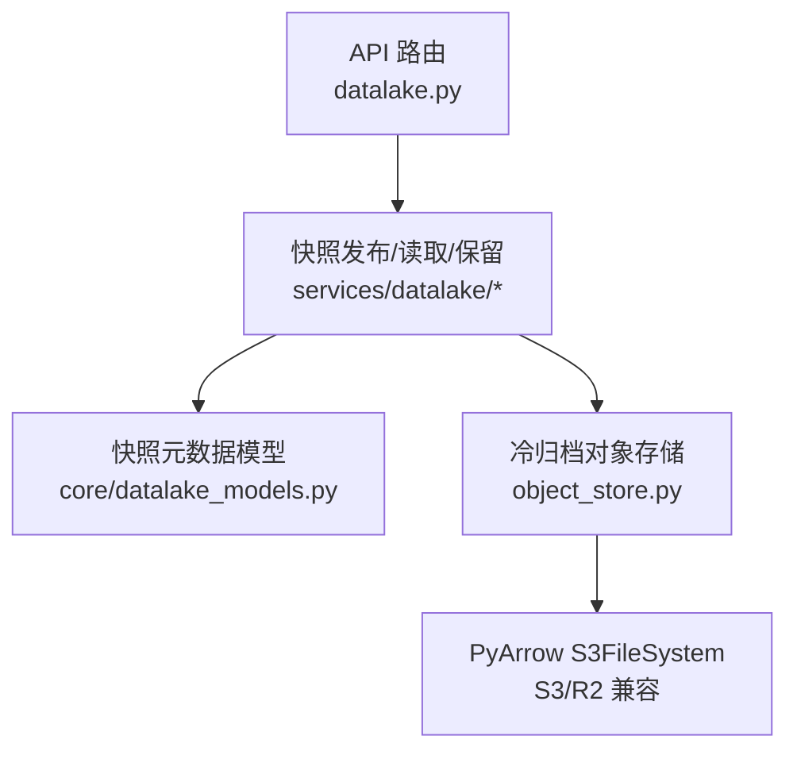
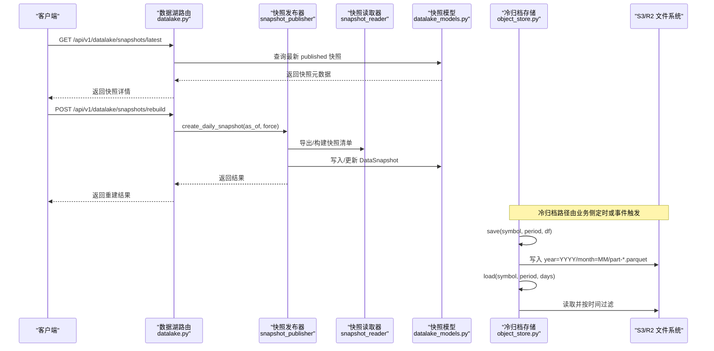
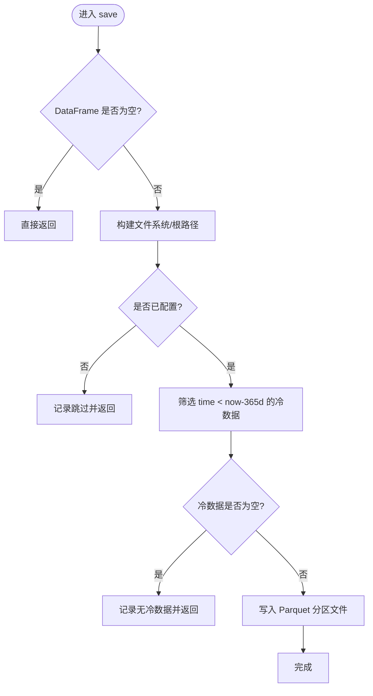
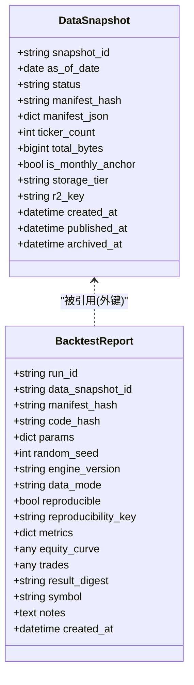
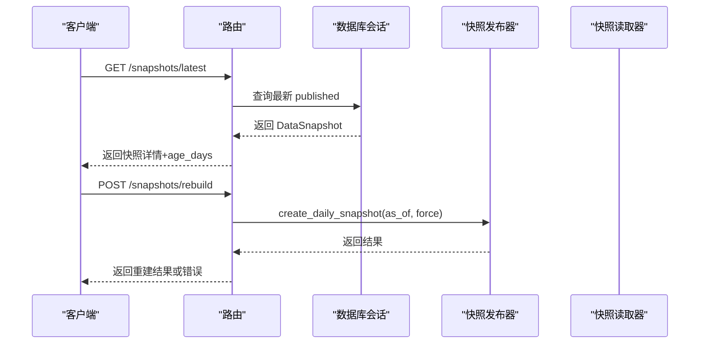
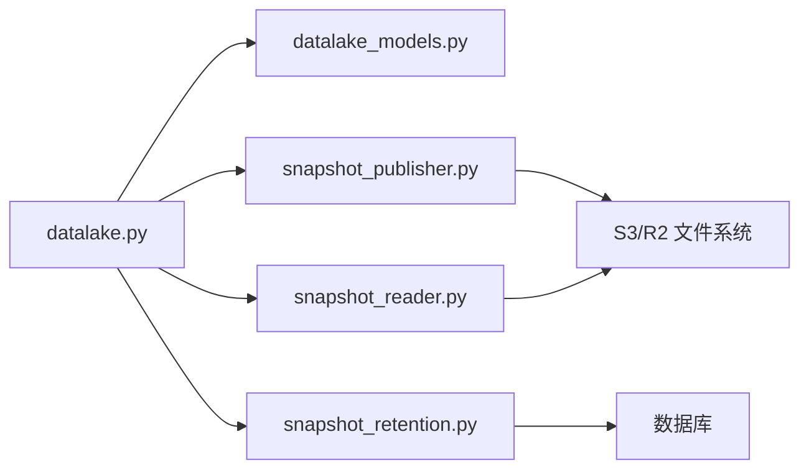

# 对象存储方案

<cite>
**本文引用的文件**
- [backend/services/datalake/object_store.py](file://backend/services/datalake/object_store.py)
- [backend/core/datalake_models.py](file://backend/core/datalake_models.py)
- [backend/routers/datalake.py](file://backend/routers/datalake.py)
- [backend/tests/test_object_store.py](file://backend/tests/test_object_store.py)
</cite>

## 目录
1. [简介](#简介)
2. [项目结构](#项目结构)
3. [核心组件](#核心组件)
4. [架构总览](#架构总览)
5. [详细组件分析](#详细组件分析)
6. [依赖关系分析](#依赖关系分析)
7. [性能考量](#性能考量)
8. [故障排查指南](#故障排查指南)
9. [结论](#结论)
10. [附录：配置与集成示例](#附录配置与集成示例)

## 简介
本方案为 Quant Agent 的数据湖提供“冷归档”对象存储能力，统一通过 PyArrow 的 S3 兼容文件系统对接云对象存储（如 Cloudflare R2、AWS S3），并以 Hive 风格分区将历史 K 线数据以 Parquet 列式格式落盘。该实现遵循“未配置即无操作”的优雅降级策略，确保在缺少凭证或端点时不中断主流程。同时，系统通过快照元数据模型与 API 暴露数据湖版本管理能力，便于与回测、备份恢复等上层能力集成。

## 项目结构
围绕对象存储与数据湖的核心代码主要分布在以下位置：
- 对象存储后端：backend/services/datalake/object_store.py
- 数据湖快照模型：backend/core/datalake_models.py
- 数据湖快照管理 API：backend/routers/datalake.py
- 对象存储单测：backend/tests/test_object_store.py

**图示来源**
- [backend/routers/datalake.py:1-138](file://backend/routers/datalake.py#L1-L138)
- [backend/core/datalake_models.py:1-82](file://backend/core/datalake_models.py#L1-L82)
- [backend/services/datalake/object_store.py:1-177](file://backend/services/datalake/object_store.py#L1-L177)

**章节来源**
- [backend/routers/datalake.py:1-138](file://backend/routers/datalake.py#L1-L138)
- [backend/core/datalake_models.py:1-82](file://backend/core/datalake_models.py#L1-L82)
- [backend/services/datalake/object_store.py:1-177](file://backend/services/datalake/object_store.py#L1-L177)

## 核心组件
- 冷归档对象存储后端（S3ObjectStore）
  - 职责：按标的与周期组织 Hive 分区目录，将超过一年阈值的“冷数据”写入远端对象存储；支持按天数范围读回并过滤。
  - 关键特性：
    - 环境变量驱动配置，未配置时所有方法为空操作，不抛异常。
    - 使用 PyArrow 的 S3FileSystem 直写 Parquet，避免中间格式转换。
    - 异步执行 I/O，降低阻塞风险。
- 数据湖快照模型（DataSnapshot、BacktestReport）
  - 职责：持久化快照元数据（含 manifest_hash、存储分层、发布时间等）以及回测报告的可复现性绑定信息。
- 数据湖快照管理 API
  - 职责：提供查询最新/指定快照、重建快照、触发保留策略清理等能力。

**章节来源**
- [backend/services/datalake/object_store.py:32-177](file://backend/services/datalake/object_store.py#L32-L177)
- [backend/core/datalake_models.py:31-82](file://backend/core/datalake_models.py#L31-L82)
- [backend/routers/datalake.py:61-138](file://backend/routers/datalake.py#L61-L138)

## 架构总览
下图展示了从 API 到对象存储的端到端调用链，包括快照管理与冷归档路径。

**图示来源**
- [backend/routers/datalake.py:61-138](file://backend/routers/datalake.py#L61-L138)
- [backend/core/datalake_models.py:31-82](file://backend/core/datalake_models.py#L31-L82)
- [backend/services/datalake/object_store.py:83-165](file://backend/services/datalake/object_store.py#L83-L165)

## 详细组件分析

### 冷归档对象存储（S3ObjectStore）
- 设计要点
  - 配置门控：仅当 bucket 与 endpoint/access_key 任一存在时才启用；否则 save/load 均为 no-op。
  - 分区布局：Hive 风格 {prefix}/{period}/{symbol_safe}/year=YYYY/month=MM/part-*.parquet。
  - 冷热分层：仅归档 time 早于当前时间减去 365 天的数据，避免重复写入热层。
  - 读写语义：save 幂等覆盖；load 按 days 过滤并排序返回。
  - 并发与健壮性：I/O 通过线程池异步执行；捕获异常并记录日志，保证调用方不受影响。
- 复杂度与性能
  - 写入：基于 PyArrow 的列式直写，时间复杂度近似 O(N)，空间复杂度取决于 DataFrame 内存占用。
  - 读取：基于 Hive 分区扫描，时间复杂度近似 O(M)（M 为匹配分区内的行数）。
- 优化建议
  - 合理设置分块大小与并行度（由 PyArrow 内部决定），结合数据量调优。
  - 对频繁读取的热点周期可考虑缓存最近分区表头或索引。

**图示来源**
- [backend/services/datalake/object_store.py:83-134](file://backend/services/datalake/object_store.py#L83-L134)

**章节来源**
- [backend/services/datalake/object_store.py:32-177](file://backend/services/datalake/object_store.py#L32-L177)
- [backend/tests/test_object_store.py:1-112](file://backend/tests/test_object_store.py#L1-L112)

### 数据湖快照模型（DataSnapshot、BacktestReport）
- DataSnapshot
  - 关键字段：snapshot_id、as_of_date、status、manifest_hash、storage_tier、r2_key、published_at、archived_at 等。
  - 用途：描述一次不可变快照的元信息与生命周期状态。
- BacktestReport
  - 关键字段：run_id、data_snapshot_id、manifest_hash、code_hash、params、reproducible、metrics 等。
  - 用途：绑定回测运行与数据快照，保障可复现性与指标持久化。

**图示来源**
- [backend/core/datalake_models.py:31-82](file://backend/core/datalake_models.py#L31-L82)

**章节来源**
- [backend/core/datalake_models.py:31-82](file://backend/core/datalake_models.py#L31-L82)

### 数据湖快照管理 API
- 能力概览
  - 列表/查询快照：支持按状态、存储分层过滤，限制返回条数。
  - 获取最新快照：返回最新 published 快照及其年龄与陈旧告警。
  - 重建快照：按日期重建并可选强制覆盖。
  - 触发保留策略：执行快照清理策略。
- 错误处理
  - 找不到快照或无 published 快照时返回 404。
  - 重建失败返回 422 并附带失败原因。

**图示来源**
- [backend/routers/datalake.py:61-138](file://backend/routers/datalake.py#L61-L138)

**章节来源**
- [backend/routers/datalake.py:61-138](file://backend/routers/datalake.py#L61-L138)

## 依赖关系分析
- 模块耦合
  - datalake.py 依赖 datalake_models.py 进行元数据存取，依赖 services/datalake 下的发布/读取/保留组件。
  - object_store.py 依赖 PyArrow 的 S3FileSystem 与 Parquet 写入能力。
- 外部依赖
  - 云对象存储（S3/R2）通过环境变量配置，未配置时自动降级。
- 潜在循环依赖
  - 当前结构清晰，未见循环导入迹象。

**图示来源**
- [backend/routers/datalake.py:1-138](file://backend/routers/datalake.py#L1-L138)
- [backend/core/datalake_models.py:1-82](file://backend/core/datalake_models.py#L1-L82)
- [backend/services/datalake/object_store.py:1-177](file://backend/services/datalake/object_store.py#L1-L177)

**章节来源**
- [backend/routers/datalake.py:1-138](file://backend/routers/datalake.py#L1-L138)
- [backend/core/datalake_models.py:1-82](file://backend/core/datalake_models.py#L1-L82)
- [backend/services/datalake/object_store.py:1-177](file://backend/services/datalake/object_store.py#L1-L177)

## 性能考量
- 写入性能
  - 使用 PyArrow 列式直写，减少序列化开销；建议批量聚合后再写入，充分利用分区裁剪。
  - 冷数据阈值设为 365 天，避免热数据重复落盘，降低 I/O 压力。
- 读取性能
  - 基于 Hive 分区读取，天然支持分区裁剪；建议按天/月粒度查询，减少全表扫描。
- 内存与 CPU
  - 写入前复制 DataFrame 并进行时间类型转换，注意大表内存占用；必要时分片写入。
  - 异步 I/O 避免阻塞事件循环，提升吞吐。
- 压缩与编码
  - 当前实现依赖 PyArrow 默认 Parquet 参数；可根据数据类型调整压缩算法与页大小以获得更好压缩比与 IO 平衡（见附录配置建议）。

[本节为通用性能指导，不直接分析具体文件]

## 故障排查指南
- 未配置对象存储
  - 现象：save/load 均无效果且不报错。
  - 排查：检查环境变量是否包含 bucket 与 endpoint/access_key；确认 configured 属性为 True。
- 写入失败
  - 现象：日志中出现写入失败错误。
  - 排查：核对凭证、端点、区域、前缀；检查网络连通性与权限；查看异常堆栈定位具体问题。
- 读取为空
  - 现象：load 返回 None。
  - 排查：确认 days 过滤条件是否过严；检查分区目录是否存在；验证时间字段类型与范围。
- 快照相关
  - 现象：latest 返回 404 或重建失败。
  - 排查：确认数据库中是否存在 published 快照；检查重建请求参数与权限；查看发布器日志。

**章节来源**
- [backend/services/datalake/object_store.py:50-165](file://backend/services/datalake/object_store.py#L50-L165)
- [backend/routers/datalake.py:77-138](file://backend/routers/datalake.py#L77-L138)
- [backend/tests/test_object_store.py:41-112](file://backend/tests/test_object_store.py#L41-L112)

## 结论
本方案以最小侵入的方式为 Quant Agent 提供了可扩展的对象存储冷归档能力，并通过快照模型与 API 实现了数据湖的版本化管理。其“未配置即无操作”的设计保证了系统的鲁棒性；Hive 分区与列式存储提升了读写效率；结合异步 I/O 与异常保护，满足生产环境的稳定性要求。后续可在压缩策略、缓存层、多租户隔离与审计方面进一步增强。

[本节为总结性内容，不直接分析具体文件]

## 附录：配置与集成示例

### 存储后端配置（环境变量）
- 关键变量
  - KLINE_L3_ENDPOINT_URL：S3/R2 端点地址
  - KLINE_L3_BUCKET：桶名
  - KLINE_L3_ACCESS_KEY：访问密钥（留空则走默认凭证链）
  - KLINE_L3_SECRET_KEY：密钥
  - KLINE_L3_REGION：区域（默认 auto）
  - KLINE_L3_PREFIX：对象键前缀（默认 kline）
- 行为说明
  - 未配置时，save/load 为 no-op，不影响主流程。
  - 配置齐全后，按 Hive 分区写入/读取 Parquet。

**章节来源**
- [backend/services/datalake/object_store.py:40-76](file://backend/services/datalake/object_store.py#L40-L76)

### 分片策略与规则
- 分区维度
  - 周期（period）、标的安全名称（symbol_safe）、年（year）、月（month）。
- 文件大小与分片
  - 当前实现由 PyArrow 控制分片；建议根据数据规模调整批次大小，避免单次写入过大导致内存峰值。
- 冷热分层
  - 仅归档 time 早于 now-365 天的数据，避免热数据重复落盘。
- 并行读写优化
  - 写入采用异步线程执行；读取利用分区裁剪减少扫描范围。

**章节来源**
- [backend/services/datalake/object_store.py:78-134](file://backend/services/datalake/object_store.py#L78-L134)
- [backend/services/datalake/object_store.py:135-165](file://backend/services/datalake/object_store.py#L135-L165)

### 压缩算法与性能调优建议
- 压缩选择
  - 数值型数据：优先尝试 Snappy 或 ZSTD 以平衡压缩比与 CPU 开销。
  - 文本/字符串：可考虑 Gzip 或 ZSTD，视查询频率权衡。
- 内存与 CPU 平衡
  - 增大 Parquet 页大小可减少元数据开销但增加随机读成本；需结合查询模式调优。
  - 对高频读取的热点分区，可考虑在应用层缓存表头或索引。
- 注意事项
  - 当前实现使用默认参数；如需精细控制，可在写入处传入 PyArrow 的 ParquetWriter 参数（例如 compression、write_statistics 等）。

[本节为通用调优建议，不直接分析具体文件]

### 访问权限控制与审计
- 访问控制
  - 对象存储层面：通过云厂商的 IAM/桶策略控制读写权限。
  - 应用层面：可通过网关/鉴权中间件对快照 API 进行访问控制（本项目未在此文件中实现）。
- 租户隔离
  - 可通过 prefix 或 bucket 维度隔离不同租户数据（例如在不同 prefix 下组织数据）。
- 审计日志
  - 建议在网关层或中间件层记录访问日志；对象存储本身可提供访问审计（依云厂商能力）。

[本节为通用治理建议，不直接分析具体文件]

### 与数据湖其他组件的集成
- 快照系统
  - 通过 API 创建/查询快照，DataSnapshot 记录 manifest_hash 与生命周期状态。
- 版本控制
  - 每次快照生成新的 snapshot_id 与 manifest_hash，支持回溯与对比。
- 备份恢复
  - 可将快照清单与对应 Parquet 分区纳入备份策略；恢复时依据 manifest 重建数据集。

**章节来源**
- [backend/core/datalake_models.py:31-82](file://backend/core/datalake_models.py#L31-L82)
- [backend/routers/datalake.py:61-138](file://backend/routers/datalake.py#L61-L138)

### 故障转移与高可用配置指南
- 对象存储高可用
  - 选择具备多副本/跨区容灾能力的云存储；配置合理的超时与重试策略（在调用方或服务层实现）。
- 服务高可用
  - 多实例部署 API 与服务，配合负载均衡；数据库与缓存层采用高可用拓扑。
- 降级策略
  - 对象存储不可用时，API 仍可返回快照元数据；冷归档路径自动降级为 no-op，不影响核心功能。

[本节为通用运维建议，不直接分析具体文件]
