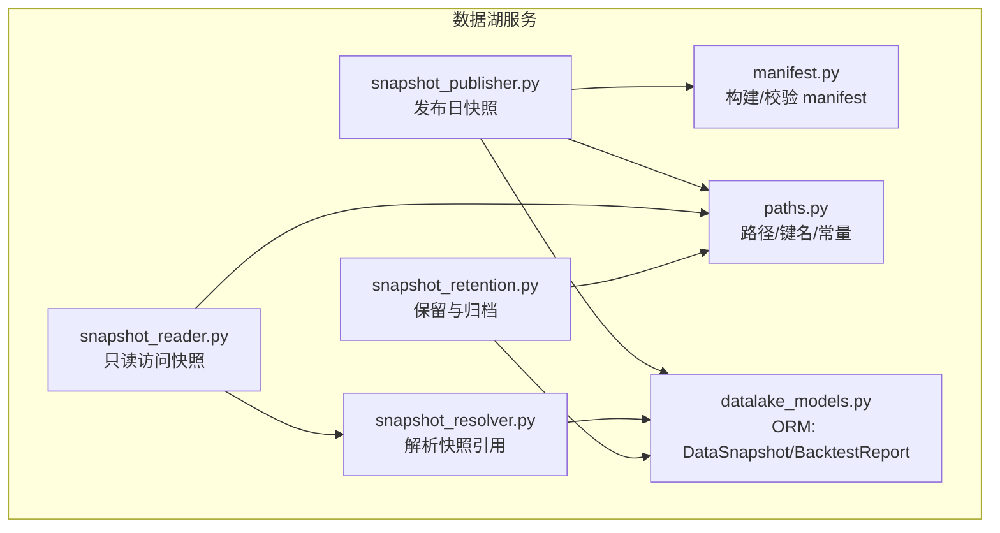
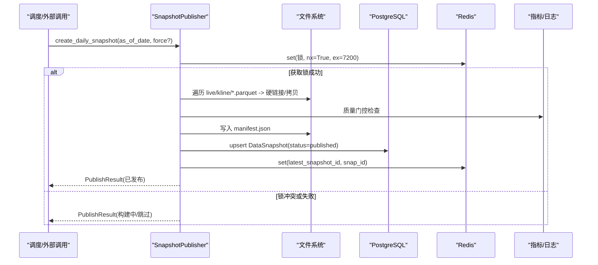
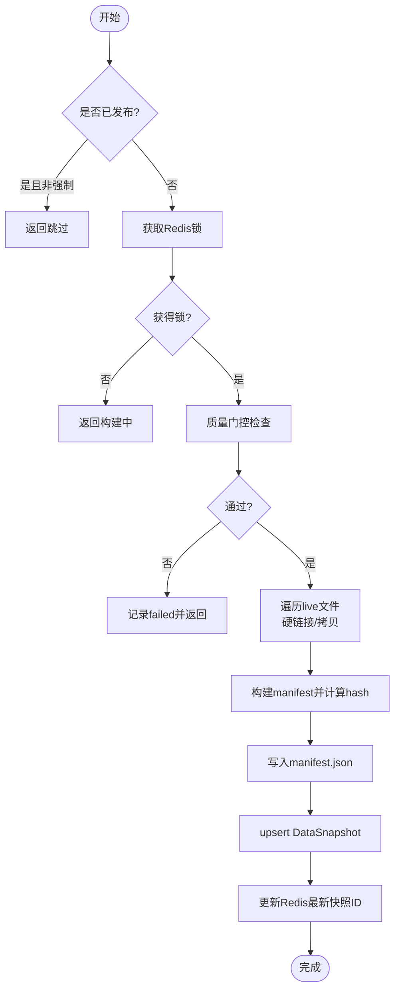
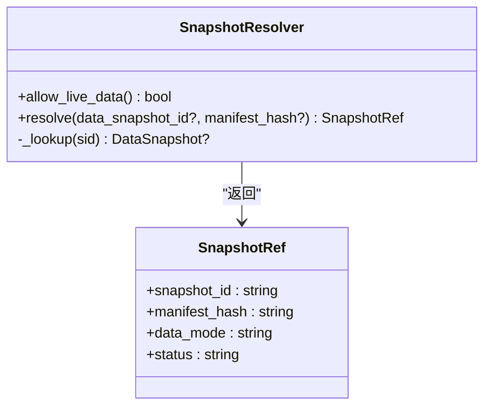
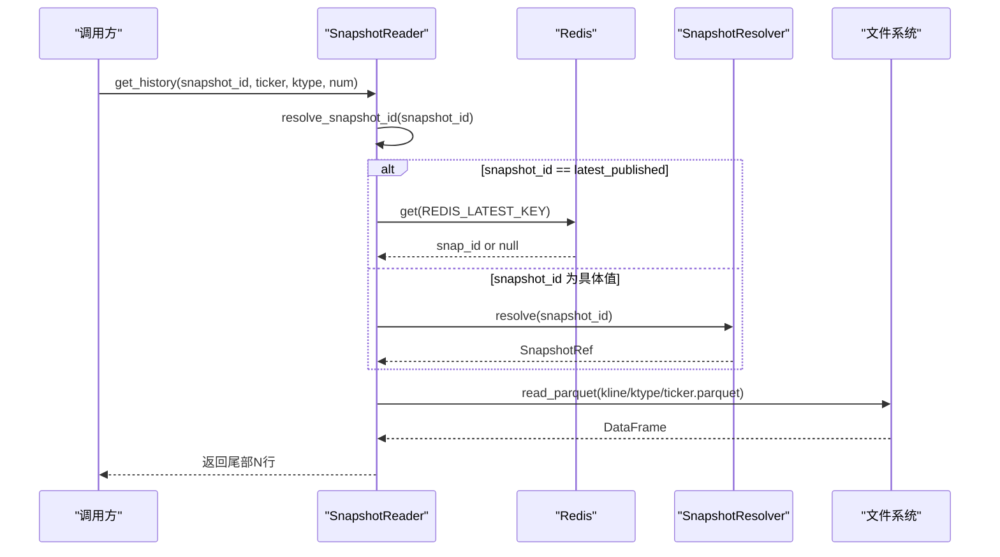
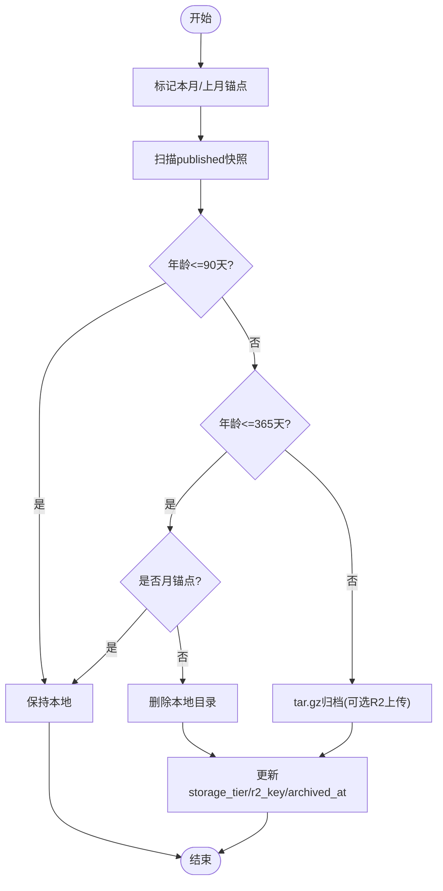

# 快照管理机制

<cite>
**本文引用的文件**
- [backend/services/datalake/snapshot_publisher.py](file://backend/services/datalake/snapshot_publisher.py)
- [backend/services/datalake/snapshot_reader.py](file://backend/services/datalake/snapshot_reader.py)
- [backend/services/datalake/snapshot_resolver.py](file://backend/services/datalake/snapshot_resolver.py)
- [backend/services/datalake/snapshot_retention.py](file://backend/services/datalake/snapshot_retention.py)
- [backend/services/datalake/manifest.py](file://backend/services/datalake/manifest.py)
- [backend/core/datalake_models.py](file://backend/core/datalake_models.py)
- [backend/services/datalake/paths.py](file://backend/services/datalake/paths.py)
- [backend/app/backtest_app.py](file://backend/app/backtest_app.py)
- [backend/app/backtest/report_service.py](file://backend/app/backtest/report_service.py)
</cite>

## 目录
1. [简介](#简介)
2. [项目结构](#项目结构)
3. [核心组件](#核心组件)
4. [架构总览](#架构总览)
5. [详细组件分析](#详细组件分析)
6. [依赖关系分析](#依赖关系分析)
7. [性能考量](#性能考量)
8. [故障排查指南](#故障排查指南)
9. [结论](#结论)
10. [附录：操作示例与配置项](#附录：操作示例与配置项)

## 简介
本文件系统性说明 Quant Agent 的快照管理系统，覆盖以下主题：
- 快照发布机制：增量/全量快照创建流程、触发条件、并发控制
- 快照解析器：快照定位、数据加载、版本选择策略
- 快照读取器：缓存机制、批量读取、流式处理
- 生命周期管理：保留策略、清理规则、存储配额管理
- 集成与调度：定时任务、错误重试、监控告警
- 应用场景：回测、分析、报表中的快照使用模式
- 操作示例：自定义快照、查询状态、恢复快照

## 项目结构
快照系统位于后端 services/datalake 目录下，围绕“发布—解析—读取—保留”的主线组织。关键路径与常量集中定义在 paths.py；元数据模型集中在 datalake_models.py；manifest 构建与校验为纯函数模块。

图表来源
- [backend/services/datalake/snapshot_publisher.py:91-250](file://backend/services/datalake/snapshot_publisher.py#L91-L250)
- [backend/services/datalake/snapshot_reader.py:30-121](file://backend/services/datalake/snapshot_reader.py#L30-L121)
- [backend/services/datalake/snapshot_resolver.py:31-103](file://backend/services/datalake/snapshot_resolver.py#L31-L103)
- [backend/services/datalake/snapshot_retention.py:29-143](file://backend/services/datalake/snapshot_retention.py#L29-L143)
- [backend/services/datalake/manifest.py:16-78](file://backend/services/datalake/manifest.py#L16-L78)
- [backend/services/datalake/paths.py:1-43](file://backend/services/datalake/paths.py#L1-L43)
- [backend/core/datalake_models.py:31-82](file://backend/core/datalake_models.py#L31-L82)

章节来源
- [backend/services/datalake/paths.py:1-43](file://backend/services/datalake/paths.py#L1-L43)
- [backend/core/datalake_models.py:31-82](file://backend/core/datalake_models.py#L31-L82)

## 核心组件
- 快照发布器（SnapshotPublisher）：从 live 层复制/硬链接 K 线到 snapshots，生成 manifest 并落库，更新 Redis 最新指针，度量指标上报。
- 快照解析器（SnapshotResolver）：将 latest_published/live/具体 snap_id 解析为可绑定的 SnapshotRef，支持无 DB 时的 unbound 模式。
- 快照读取器（SnapshotReader）：基于 snapshot_id 定位 manifest 与 parquet，提供同步/异步读取接口，支持 ticker 列表枚举。
- 保留策略（SnapshotRetention）：T1/T2/T3 分层保留，月锚点标记，本地删除与 tar.gz 归档，可选 R2 上传。
- Manifest 工具（manifest.py）：确定性 JSON 序列化、计算 manifest_hash、构建/校验 manifest。
- 路径与常量（paths.py）：live/snapshots 根路径、Redis 键、K 线类型、文件名编解码。
- ORM 模型（datalake_models.py）：DataSnapshot 记录快照元数据与状态；BacktestReport 绑定回测与数据指纹。

章节来源
- [backend/services/datalake/snapshot_publisher.py:91-250](file://backend/services/datalake/snapshot_publisher.py#L91-L250)
- [backend/services/datalake/snapshot_resolver.py:31-103](file://backend/services/datalake/snapshot_resolver.py#L31-L103)
- [backend/services/datalake/snapshot_reader.py:30-121](file://backend/services/datalake/snapshot_reader.py#L30-L121)
- [backend/services/datalake/snapshot_retention.py:29-143](file://backend/services/datalake/snapshot_retention.py#L29-L143)
- [backend/services/datalake/manifest.py:16-78](file://backend/services/datalake/manifest.py#L16-L78)
- [backend/services/datalake/paths.py:1-43](file://backend/services/datalake/paths.py#L1-L43)
- [backend/core/datalake_models.py:31-82](file://backend/core/datalake_models.py#L31-L82)

## 架构总览
快照系统以“发布—解析—读取—保留”为主线，配合 Redis 做并发控制与最新指针，PostgreSQL 持久化元数据，Parquet 作为不可变数据载体。

图表来源
- [backend/services/datalake/snapshot_publisher.py:119-250](file://backend/services/datalake/snapshot_publisher.py#L119-L250)
- [backend/services/datalake/paths.py:15-18](file://backend/services/datalake/paths.py#L15-L18)

章节来源
- [backend/services/datalake/snapshot_publisher.py:119-250](file://backend/services/datalake/snapshot_publisher.py#L119-L250)

## 详细组件分析

### 快照发布器（SnapshotPublisher）
- 功能要点
  - 幂等发布：若同日期已 published 且非强制，直接返回跳过。
  - 并发控制：通过 Redis 分布式锁防止重复构建；设置“构建中”键。
  - 质量门控：可注入 quality_gate_fn，未通过则记录 failed 并返回。
  - 文件复制：优先硬链接，失败回退 copy2；记录 copy_mode（hardlink/copy2/mixed）。
  - Manifest 构建：统计文件数、字节数、ticker 数量，写入 sidecars（如 universe），计算 manifest_hash。
  - 元数据落库：upsert DataSnapshot，记录 status、manifest_hash、published_at 等。
  - 最新指针：成功后更新 Redis 最新快照 ID，清理构建中键。
  - 观测性：上报 DATALAKE_SNAPSHOT_CREATED 指标。

- 复杂度与性能
  - I/O 为主：按 ktype 遍历 parquet 文件，逐个硬链接/拷贝；时间复杂度 O(N)。
  - 哈希与元数据：对每个文件计算 sha256 与行数/时间范围，I/O 密集。
  - 并发安全：Redis 锁 + 幂等判断，避免重复构建。

- 错误处理
  - Redis 不可用：记录警告并继续（降级）。
  - 质量门控失败：记录 failed 并返回。
  - 文件系统异常：尽力而为设置只读权限，忽略失败。

图表来源
- [backend/services/datalake/snapshot_publisher.py:119-250](file://backend/services/datalake/snapshot_publisher.py#L119-L250)
- [backend/services/datalake/manifest.py:34-66](file://backend/services/datalake/manifest.py#L34-L66)

章节来源
- [backend/services/datalake/snapshot_publisher.py:119-250](file://backend/services/datalake/snapshot_publisher.py#L119-L250)
- [backend/services/datalake/manifest.py:34-66](file://backend/services/datalake/manifest.py#L34-L66)

### 快照解析器（SnapshotResolver）
- 功能要点
  - 解析策略：latest_published → 最近 published；live → 仅开发环境；具体 snap_id → 精确匹配；无 DB 时允许 manifest_hash 构造 unbound。
  - 安全限制：默认禁止 live 数据用于回测，需显式环境变量开启。
  - 输出：SnapshotRef（snapshot_id、manifest_hash、data_mode、status）。

- 复杂度与性能
  - 数据库查询：O(1) 或 O(logN)（取决于索引），仅一次查找。
  - 无 DB 场景：直接构造 unbound 引用，零开销。

- 错误处理
  - live 数据在非开发环境抛出解析错误。
  - 指定快照不存在或未发布抛出解析错误。

图表来源
- [backend/services/datalake/snapshot_resolver.py:31-103](file://backend/services/datalake/snapshot_resolver.py#L31-L103)

章节来源
- [backend/services/datalake/snapshot_resolver.py:31-103](file://backend/services/datalake/snapshot_resolver.py#L31-L103)

### 快照读取器（SnapshotReader）
- 功能要点
  - 解析快照 ID：支持 live/unbound/latest_published，优先 Redis 指针，否则走解析器。
  - 获取 manifest：优先读取本地 manifest.json，回退到数据库行。
  - 历史数据读取：get_history_sync/get_history 支持同步/异步，读取 parquet 并按 time 排序后取尾部 N 行。
  - ticker 列表：列出某快照下某 ktype 的所有 ticker。

- 缓存机制
  - 当前实现为按需读取 parquet，无内置内存缓存；可通过上层应用引入 LRU 缓存提升热点读取性能。

- 批量与流式
  - 当前为整表读取后切片 tail(num)，适合中小规模；大数据场景建议后续扩展流式读取（如 pyarrow 流式）。

图表来源
- [backend/services/datalake/snapshot_reader.py:42-114](file://backend/services/datalake/snapshot_reader.py#L42-L114)
- [backend/services/datalake/snapshot_resolver.py:44-95](file://backend/services/datalake/snapshot_resolver.py#L44-L95)
- [backend/services/datalake/paths.py:15-18](file://backend/services/datalake/paths.py#L15-L18)

章节来源
- [backend/services/datalake/snapshot_reader.py:42-114](file://backend/services/datalake/snapshot_reader.py#L42-L114)

### 保留策略（SnapshotRetention）
- 功能要点
  - 分层保留：T1（0–90天）全保留；T2（91–365天）仅保留月锚点；T3（>365天）归档为 tar.gz，可选上传 R2。
  - 月锚点标记：每月最后一个 published 快照标记为 is_monthly_anchor。
  - 本地清理：T2 非锚点删除本地目录；T3 归档后删除本地目录。
  - 元数据更新：storage_tier 更新为 deleted/r2，记录 r2_key/archived_at。

- 复杂度与性能
  - 扫描 published 快照：O(N)；归档为 I/O 密集型。
  - 并发控制：Redis 锁确保单次运行互斥。

图表来源
- [backend/services/datalake/snapshot_retention.py:41-129](file://backend/services/datalake/snapshot_retention.py#L41-L129)

章节来源
- [backend/services/datalake/snapshot_retention.py:41-129](file://backend/services/datalake/snapshot_retention.py#L41-L129)

### Manifest 工具（manifest.py）
- 功能要点
  - 确定性 JSON：sort_keys 与紧凑分隔符，保证 hash 稳定。
  - compute_manifest_hash：排除自身字段后计算 sha256。
  - build_manifest：聚合 files/sidecars/ktypes/quality_gate 等信息，填充 ticker_count/total_bytes，写入 manifest_hash。
  - validate_manifest：校验 manifest_hash 一致性，兼容带前缀格式。

- 复杂度与性能
  - 哈希计算为 O(M)（M 为 manifest 大小），轻量级。

章节来源
- [backend/services/datalake/manifest.py:16-78](file://backend/services/datalake/manifest.py#L16-L78)

### ORM 模型（datalake_models.py）
- DataSnapshot：记录快照 id、as_of_date、status、manifest_hash、manifest_json、ticker_count、total_bytes、is_monthly_anchor、storage_tier、r2_key、时间戳等。
- BacktestReport：绑定 data_snapshot_id、manifest_hash、代码哈希、参数、随机种子、引擎版本、可复现性等。

章节来源
- [backend/core/datalake_models.py:31-82](file://backend/core/datalake_models.py#L31-L82)

## 依赖关系分析
- 组件耦合
  - Publisher 依赖 paths（路径/键）、manifest（构建/哈希）、models（落库）、redis_client（锁/指针）、metrics（指标）。
  - Reader 依赖 resolver、paths、models（回退 manifest）。
  - Resolver 依赖 models（查询 published）。
  - Retention 依赖 models（查询/更新）、paths（根路径/锁键）、可选 r2_uploader。
- 外部依赖
  - Redis：分布式锁与最新指针。
  - PostgreSQL：元数据持久化。
  - 文件系统：Parquet 不可变存储。

```mermaid
graph LR
Pub["Publisher"] --> Paths["paths.py"]
Pub --> Manifest["manifest.py"]
Pub --> Models["datalake_models.py"]
Pub --> Redis["redis_client"]
Pub --> Metrics["metrics"]
Reader["Reader"] --> Resolver["resolver.py"]
Reader --> Paths
Reader --> Models
Resolver --> Models
Ret["Retention"] --> Models
Ret --> Paths
Ret --> |可选| R2["r2_uploader"]
```

图表来源
- [backend/services/datalake/snapshot_publisher.py:91-250](file://backend/services/datalake/snapshot_publisher.py#L91-L250)
- [backend/services/datalake/snapshot_reader.py:30-121](file://backend/services/datalake/snapshot_reader.py#L30-L121)
- [backend/services/datalake/snapshot_resolver.py:31-103](file://backend/services/datalake/snapshot_resolver.py#L31-L103)
- [backend/services/datalake/snapshot_retention.py:29-143](file://backend/services/datalake/snapshot_retention.py#L29-L143)
- [backend/services/datalake/paths.py:1-43](file://backend/services/datalake/paths.py#L1-L43)
- [backend/core/datalake_models.py:31-82](file://backend/core/datalake_models.py#L31-L82)

章节来源
- [backend/services/datalake/snapshot_publisher.py:91-250](file://backend/services/datalake/snapshot_publisher.py#L91-L250)
- [backend/services/datalake/snapshot_reader.py:30-121](file://backend/services/datalake/snapshot_reader.py#L30-L121)
- [backend/services/datalake/snapshot_resolver.py:31-103](file://backend/services/datalake/snapshot_resolver.py#L31-L103)
- [backend/services/datalake/snapshot_retention.py:29-143](file://backend/services/datalake/snapshot_retention.py#L29-L143)
- [backend/services/datalake/paths.py:1-43](file://backend/services/datalake/paths.py#L1-L43)
- [backend/core/datalake_models.py:31-82](file://backend/core/datalake_models.py#L31-L82)

## 性能考量
- I/O 优化
  - 优先硬链接减少磁盘占用与复制时间；跨盘时自动回退 copy2。
  - 批量处理 parquet 文件，尽量顺序访问以提升吞吐。
- 并发控制
  - Redis 锁避免重复构建；保留任务也加锁互斥。
- 读取优化
  - 当前读取为整表加载后切片；热点 ticker 可在上层引入内存缓存（LRU）以减少重复 IO。
  - 未来可扩展流式读取（pyarrow）以降低峰值内存。
- 存储优化
  - T2/T3 策略及时释放空间；归档压缩降低长期存储成本。

[本节为通用指导，不直接分析具体文件]

## 故障排查指南
- 常见问题
  - 发布被跳过：检查是否已有 published 且非强制；查看 Redis 锁是否被持有。
  - 质量门控失败：检查 dirty_rate_max 阈值与实际脏率；确认数据源健康。
  - 解析失败：确认 ENGINE_ALLOW_LIVE_DATA 开关；检查 latest_published 是否为空。
  - 读取为空：确认 parquet 文件是否存在；核对 ticker 文件名编码转换。
  - 保留任务未执行：检查 Redis 锁是否被其他实例占用。
- 诊断要点
  - 查看日志关键字：snapshot_lock_redis_unavailable、universe_sidecar_failed、snapshot_file_missing、snapshot_local_deleted、r2_upload_failed。
  - 检查 Redis 键：quant:datalake:snapshot_building、quant:datalake:latest_snapshot_id、quant:lock:snapshot_create:*、quant:lock:snapshot_retention。
  - 检查数据库：DataSnapshot.status 与 manifest_hash 一致性。

章节来源
- [backend/services/datalake/snapshot_publisher.py:136-146](file://backend/services/datalake/snapshot_publisher.py#L136-L146)
- [backend/services/datalake/snapshot_reader.py:90-97](file://backend/services/datalake/snapshot_reader.py#L90-L97)
- [backend/services/datalake/snapshot_retention.py:132-143](file://backend/services/datalake/snapshot_retention.py#L132-L143)

## 结论
Quant Agent 快照系统通过“发布—解析—读取—保留”的清晰分层，结合 Redis 并发控制与 PostgreSQL 元数据持久化，实现了高效、可靠、可追溯的数据快照能力。其设计兼顾了性能（硬链接、分层保留）、可观测性（指标/日志）与可维护性（模块化、纯函数 manifest）。在生产环境中，建议配合定时任务与监控告警，确保快照持续可用与存储成本可控。

[本节为总结，不直接分析具体文件]

## 附录：操作示例与配置项

### 操作示例
- 创建自定义快照
  - 调用发布器方法：create_daily_snapshot(as_of_date, force=False/True)
  - 适用场景：补发缺失日期、强制重建以修复不一致
  - 参考路径：[backend/services/datalake/snapshot_publisher.py:119-134](file://backend/services/datalake/snapshot_publisher.py#L119-L134)

- 查询快照状态
  - 通过解析器 resolve(data_snapshot_id=None, manifest_hash=None) 获取 SnapshotRef
  - 通过读取器 get_manifest(snapshot_id) 获取 manifest 详情
  - 参考路径：
    - [backend/services/datalake/snapshot_resolver.py:44-95](file://backend/services/datalake/snapshot_resolver.py#L44-L95)
    - [backend/services/datalake/snapshot_reader.py:66-77](file://backend/services/datalake/snapshot_reader.py#L66-L77)

- 执行快照恢复（回测使用）
  - 在回测应用中传入 data_snapshot_id（可为 latest_published 或具体 snap_id）
  - 读取器会解析并读取对应快照数据
  - 参考路径：
    - [backend/app/backtest_app.py:65-95](file://backend/app/backtest_app.py#L65-L95)
    - [backend/app/backtest/report_service.py:55-110](file://backend/app/backtest/report_service.py#L55-L110)

### 配置选项
- 路径与环境变量
  - DATALAKE_LIVE_ROOT：live 数据根目录
  - DATALAKE_SNAPSHOTS_ROOT：快照根目录
  - DATALAKE_DIRTY_RATE_MAX：质量门控脏率阈值
  - ENGINE_ALLOW_LIVE_DATA：是否允许 live 数据用于回测
  - 参考路径：[backend/services/datalake/paths.py:10-20](file://backend/services/datalake/paths.py#L10-L20)

- 保留策略
  - T1（0–90天）：全保留
  - T2（91–365天）：仅月锚点
  - T3（>365天）：归档 tar.gz，可选 R2 上传
  - 参考路径：[backend/services/datalake/snapshot_retention.py:25-27](file://backend/services/datalake/snapshot_retention.py#L25-L27)

- 并发与锁
  - Redis 键：quant:lock:snapshot_create:*、quant:datalake:snapshot_building、quant:datalake:latest_snapshot_id、quant:lock:snapshot_retention
  - 参考路径：[backend/services/datalake/paths.py:15-18](file://backend/services/datalake/paths.py#L15-L18)

- 指标与日志
  - 指标：DATALAKE_SNAPSHOT_CREATED、DATALAKE_RETENTION_RUNS
  - 日志关键字：snapshot_published、snapshot_lock_redis_unavailable、snapshot_file_missing、snapshot_local_deleted、r2_upload_failed
  - 参考路径：
    - [backend/services/datalake/snapshot_publisher.py:225-238](file://backend/services/datalake/snapshot_publisher.py#L225-L238)
    - [backend/services/datalake/snapshot_retention.py:88-93](file://backend/services/datalake/snapshot_retention.py#L88-L93)

章节来源
- [backend/services/datalake/snapshot_publisher.py:119-250](file://backend/services/datalake/snapshot_publisher.py#L119-L250)
- [backend/services/datalake/snapshot_reader.py:42-121](file://backend/services/datalake/snapshot_reader.py#L42-L121)
- [backend/services/datalake/snapshot_resolver.py:44-95](file://backend/services/datalake/snapshot_resolver.py#L44-L95)
- [backend/services/datalake/snapshot_retention.py:61-143](file://backend/services/datalake/snapshot_retention.py#L61-L143)
- [backend/services/datalake/paths.py:10-20](file://backend/services/datalake/paths.py#L10-L20)
- [backend/app/backtest_app.py:65-95](file://backend/app/backtest_app.py#L65-L95)
- [backend/app/backtest/report_service.py:55-110](file://backend/app/backtest/report_service.py#L55-L110)
