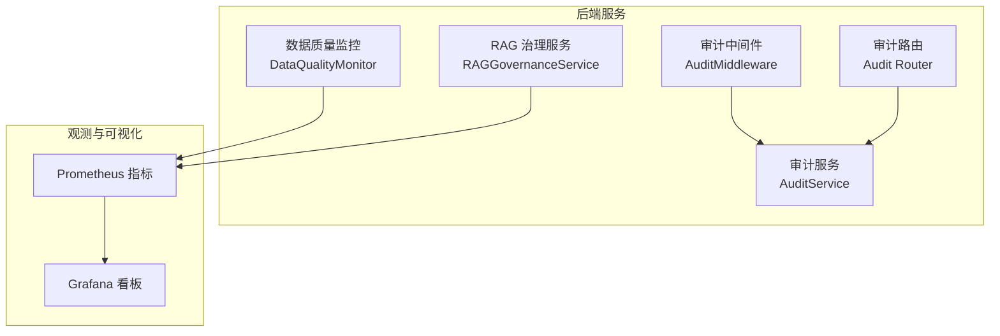
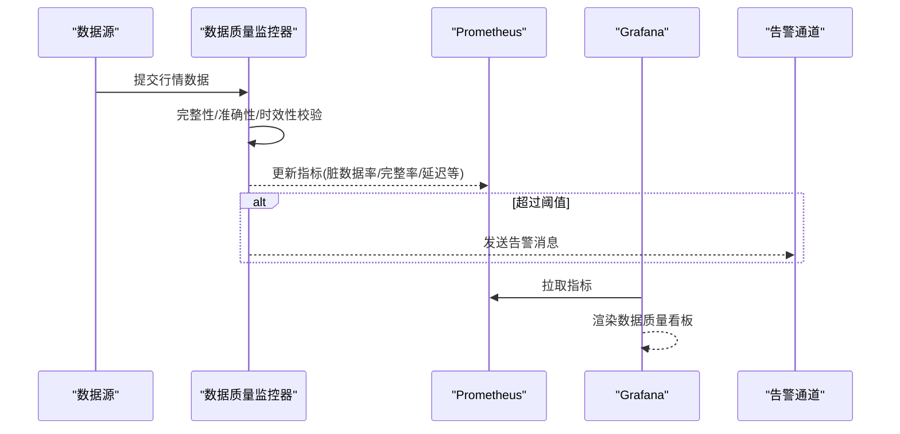
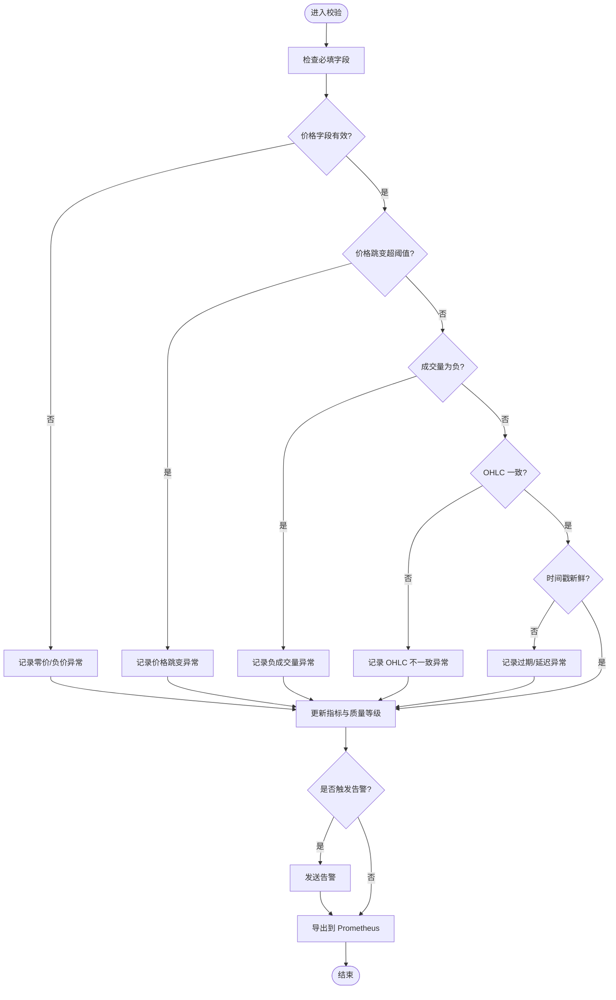
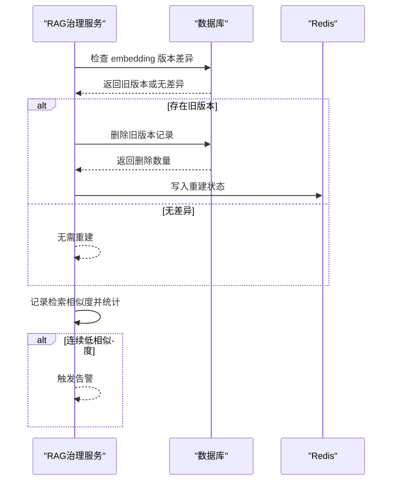
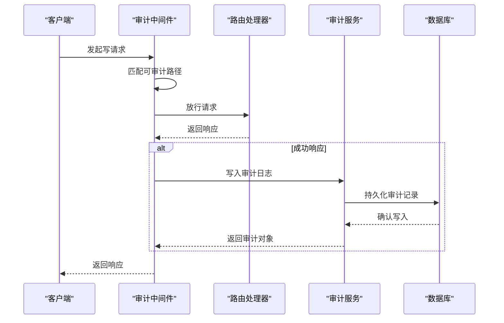
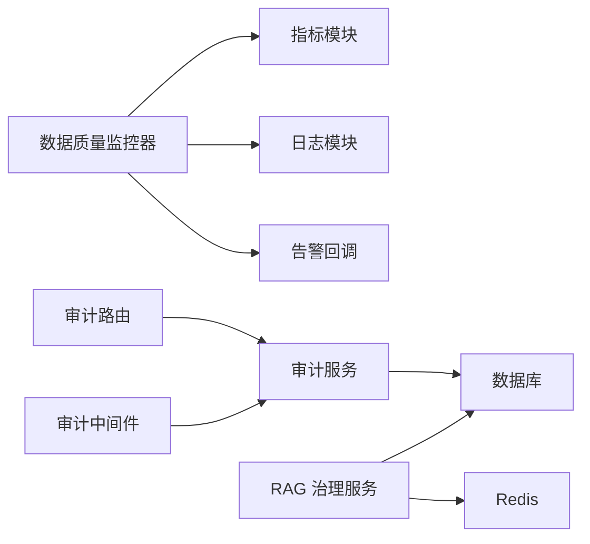

# 数据治理规范

<cite>
**本文引用的文件**
- [backend/services/data_quality/monitor.py](file://backend/services/data_quality/monitor.py)
- [backend/app/rag/governance.py](file://backend/app/rag/governance.py)
- [backend/services/audit_service.py](file://backend/services/audit_service.py)
- [backend/middleware/audit_middleware.py](file://backend/middleware/audit_middleware.py)
- [backend/routers/audit.py](file://backend/routers/audit.py)
- [grafana/provisioning/dashboards/data-quality-dashboard.json](file://grafana/provisioning/dashboards/data-quality-dashboard.json)
</cite>

## 目录
1. [简介](#简介)
2. [项目结构](#项目结构)
3. [核心组件](#核心组件)
4. [架构总览](#架构总览)
5. [详细组件分析](#详细组件分析)
6. [依赖关系分析](#依赖关系分析)
7. [性能考虑](#性能考虑)
8. [故障排查指南](#故障排查指南)
9. [结论](#结论)
10. [附录](#附录)

## 简介
本规范面向 Quant Agent 的数据治理体系，聚焦以下目标：
- 建立数据质量监控体系：覆盖完整性、准确性、时效性三大维度。
- 强化财务数据治理：涵盖财务报表数据清洗、异常检测与合规校验流程。
- 构建数据血缘追踪机制：记录数据来源、转换过程与影响分析。
- 推进数据标准化管理：统一字段规范、数据类型定义与业务规则约束。
- 提供可操作的监控指标配置：包括阈值设置、告警规则与质量报告生成。
- 将数据治理融入业务流程：实现数据准入审核、变更审批与审计追溯。
- 沉淀最佳实践与常见问题解决方案。

## 项目结构
围绕数据治理的关键代码集中在后端服务层与中间件层：
- 数据质量监控：按数据源维度实时校验行情数据，暴露指标并触发告警。
- RAG 知识库治理：embedding 版本管理与检索质量监控。
- 审计日志：自动记录关键操作，支持查询与追溯。
- Grafana 看板：可视化展示数据质量指标。

图表来源
- [backend/services/data_quality/monitor.py:91-350](file://backend/services/data_quality/monitor.py#L91-L350)
- [backend/app/rag/governance.py:19-164](file://backend/app/rag/governance.py#L19-L164)
- [backend/services/audit_service.py:43-112](file://backend/services/audit_service.py#L43-L112)
- [backend/middleware/audit_middleware.py:14-77](file://backend/middleware/audit_middleware.py#L14-L77)
- [backend/routers/audit.py:22-56](file://backend/routers/audit.py#L22-L56)
- [grafana/provisioning/dashboards/data-quality-dashboard.json](file://grafana/provisioning/dashboards/data-quality-dashboard.json)

章节来源
- [backend/services/data_quality/monitor.py:91-350](file://backend/services/data_quality/monitor.py#L91-L350)
- [backend/app/rag/governance.py:19-164](file://backend/app/rag/governance.py#L19-L164)
- [backend/services/audit_service.py:43-112](file://backend/services/audit_service.py#L43-L112)
- [backend/middleware/audit_middleware.py:14-77](file://backend/middleware/audit_middleware.py#L14-L77)
- [backend/routers/audit.py:22-56](file://backend/routers/audit.py#L22-L56)
- [grafana/provisioning/dashboards/data-quality-dashboard.json](file://grafana/provisioning/dashboards/data-quality-dashboard.json)

## 核心组件
- 数据质量监控器（DataQualityMonitor）
  - 负责单条行情数据的完整性、准确性、时效性校验；聚合脏数据率、完整率、延迟等指标；按数据源维度暴露 Prometheus 指标并支持告警回调。
- RAG 治理服务（RAGGovernanceService）
  - 管理 embedding 模型版本一致性，支持旧版本清理与重建；统计检索相似度并触发低质量告警。
- 审计服务与中间件
  - 中间件拦截关键写操作，调用审计服务写入审计日志；提供查询接口用于审计追溯。

章节来源
- [backend/services/data_quality/monitor.py:91-350](file://backend/services/data_quality/monitor.py#L91-L350)
- [backend/app/rag/governance.py:19-164](file://backend/app/rag/governance.py#L19-L164)
- [backend/services/audit_service.py:43-112](file://backend/services/audit_service.py#L43-L112)
- [backend/middleware/audit_middleware.py:14-77](file://backend/middleware/audit_middleware.py#L14-L77)
- [backend/routers/audit.py:22-56](file://backend/routers/audit.py#L22-L56)

## 架构总览
数据质量监控在采集链路中嵌入，对每条数据进行多维度校验，并将结果以指标形式上报至 Prometheus，最终通过 Grafana 看板呈现。RAG 治理服务保障向量检索质量，审计系统贯穿关键操作的可追溯性。

图表来源
- [backend/services/data_quality/monitor.py:112-256](file://backend/services/data_quality/monitor.py#L112-L256)
- [backend/services/data_quality/monitor.py:315-350](file://backend/services/data_quality/monitor.py#L315-L350)
- [grafana/provisioning/dashboards/data-quality-dashboard.json](file://grafana/provisioning/dashboards/data-quality-dashboard.json)

## 详细组件分析

### 数据质量监控器（DataQualityMonitor）
- 职责
  - 完整性检查：必填字段缺失检测。
  - 准确性验证：零价/负价、价格跳变、成交量为负、OHLC 逻辑不一致。
  - 时效性监控：时间戳新鲜度与延迟统计。
  - 指标与告警：脏数据率、完整率、延迟、异常计数；支持告警回调。
  - 指标导出：向 Prometheus 暴露多维指标。
- 关键流程
  - 单条校验：累计指标、识别异常、更新质量等级、触发告警、导出指标。
  - 质量等级：根据脏数据率与过期次数动态评估 GOOD/DEGRADED/POOR/UNUSABLE。
  - 阈值与告警：脏数据率阈值、连续过期阈值。

图表来源
- [backend/services/data_quality/monitor.py:112-256](file://backend/services/data_quality/monitor.py#L112-L256)
- [backend/services/data_quality/monitor.py:258-295](file://backend/services/data_quality/monitor.py#L258-L295)
- [backend/services/data_quality/monitor.py:315-350](file://backend/services/data_quality/monitor.py#L315-L350)

章节来源
- [backend/services/data_quality/monitor.py:26-89](file://backend/services/data_quality/monitor.py#L26-L89)
- [backend/services/data_quality/monitor.py:112-256](file://backend/services/data_quality/monitor.py#L112-L256)
- [backend/services/data_quality/monitor.py:258-295](file://backend/services/data_quality/monitor.py#L258-L295)
- [backend/services/data_quality/monitor.py:315-350](file://backend/services/data_quality/monitor.py#L315-L350)

### RAG 知识库治理服务（RAGGovernanceService）
- 职责
  - 版本管理：启动时检测 embedding 模型版本不一致，必要时触发全量重建。
  - 检索质量监控：记录每次检索的最高相似度，连续低于阈值时触发告警。
- 关键流程
  - 版本检查：查询数据库是否存在不同版本的 embedding 记录。
  - 重建触发：删除旧版本向量并记录状态，便于后续重新 embedding。
  - 质量统计：计算低相似度比例与当前连续次数。

图表来源
- [backend/app/rag/governance.py:27-125](file://backend/app/rag/governance.py#L27-L125)
- [backend/app/rag/governance.py:127-164](file://backend/app/rag/governance.py#L127-L164)

章节来源
- [backend/app/rag/governance.py:19-164](file://backend/app/rag/governance.py#L19-L164)

### 审计服务与中间件（AuditService & AuditMiddleware）
- 职责
  - 中间件：拦截关键写操作（POST/PUT/DELETE），匹配可审计路径后执行审计记录。
  - 服务层：封装审计日志写入与查询，提取客户端 IP、生成追踪 ID。
  - 路由：提供审计日志查询接口，支持按操作类型与用户过滤。
- 关键流程
  - 请求进入中间件：判断方法是否为写操作，匹配可审计路径。
  - 执行请求：成功后调用审计服务写入日志。
  - 查询接口：分页返回审计日志列表。

图表来源
- [backend/middleware/audit_middleware.py:14-77](file://backend/middleware/audit_middleware.py#L14-L77)
- [backend/services/audit_service.py:43-112](file://backend/services/audit_service.py#L43-L112)
- [backend/routers/audit.py:22-56](file://backend/routers/audit.py#L22-L56)

章节来源
- [backend/middleware/audit_middleware.py:14-77](file://backend/middleware/audit_middleware.py#L14-L77)
- [backend/services/audit_service.py:43-112](file://backend/services/audit_service.py#L43-L112)
- [backend/routers/audit.py:22-56](file://backend/routers/audit.py#L22-L56)

## 依赖关系分析
- 数据质量监控器依赖：
  - 指标模块：导出脏数据率、完整率、异常计数、延迟等指标。
  - 日志模块：记录告警信息。
  - 可选告警回调：对接飞书/Telegram 等推送渠道。
- RAG 治理服务依赖：
  - 数据库：检查与清理 embedding 版本。
  - Redis：存储重建状态。
- 审计系统依赖：
  - 数据库会话：写入与查询审计日志。
  - FastAPI Request：提取客户端 IP。

图表来源
- [backend/services/data_quality/monitor.py:315-350](file://backend/services/data_quality/monitor.py#L315-L350)
- [backend/app/rag/governance.py:27-125](file://backend/app/rag/governance.py#L27-L125)
- [backend/services/audit_service.py:43-112](file://backend/services/audit_service.py#L43-L112)
- [backend/middleware/audit_middleware.py:14-77](file://backend/middleware/audit_middleware.py#L14-L77)
- [backend/routers/audit.py:22-56](file://backend/routers/audit.py#L22-L56)

章节来源
- [backend/services/data_quality/monitor.py:315-350](file://backend/services/data_quality/monitor.py#L315-L350)
- [backend/app/rag/governance.py:27-125](file://backend/app/rag/governance.py#L27-L125)
- [backend/services/audit_service.py:43-112](file://backend/services/audit_service.py#L43-L112)
- [backend/middleware/audit_middleware.py:14-77](file://backend/middleware/audit_middleware.py#L14-L77)
- [backend/routers/audit.py:22-56](file://backend/routers/audit.py#L22-L56)

## 性能考虑
- 指标导出开销：每次校验均导出指标，需确保指标写入路径稳定且轻量。
- 告警频率控制：避免频繁告警导致通道拥塞，建议结合阈值与冷却策略。
- 审计日志写入：仅对成功响应进行审计，减少无效写入；批量写入可进一步优化吞吐。
- 数据库查询：RAG 版本检查与审计查询应加索引与分页限制，避免慢查询。

[本节为通用指导，不直接分析具体文件]

## 故障排查指南
- 数据质量监控
  - 脏数据率持续偏高：检查必填字段映射与数据源格式；核对价格跳变阈值与 OHLC 一致性规则。
  - 延迟超标：核查数据源时间戳精度与处理链路耗时；关注连续过期次数。
  - 告警未触发：确认告警回调已注册且可用；检查阈值配置与质量等级判定逻辑。
- RAG 治理
  - 检索相似度持续偏低：检查 embedding 版本是否一致；必要时触发重建流程。
  - 重建失败：查看数据库连接与权限；确认 Redis 状态写入是否成功。
- 审计系统
  - 审计日志缺失：确认中间件是否正确匹配路径与方法；检查数据库会话与写入异常。
  - 查询接口超时：优化分页参数与索引；限制最大返回条数。

章节来源
- [backend/services/data_quality/monitor.py:258-295](file://backend/services/data_quality/monitor.py#L258-L295)
- [backend/app/rag/governance.py:127-164](file://backend/app/rag/governance.py#L127-L164)
- [backend/services/audit_service.py:83-112](file://backend/services/audit_service.py#L83-L112)
- [backend/middleware/audit_middleware.py:30-77](file://backend/middleware/audit_middleware.py#L30-L77)

## 结论
Quant Agent 的数据治理体系以数据质量监控为核心，辅以 RAG 治理与审计追溯，形成“采集即治理”的闭环。通过明确的完整性、准确性、时效性检查，以及标准化的指标与告警机制，能够有效保障数据可信与可追溯。建议在生产环境中持续优化阈值与告警策略，并结合业务流程实现准入审核与变更审批，进一步提升数据治理的落地效果。

[本节为总结性内容，不直接分析具体文件]

## 附录

### 数据质量监控指标与阈值配置
- 指标项
  - 脏数据率：含异常记录数 / 总记录数。
  - 完整率：有效记录数 / 总记录数。
  - 异常计数：异常条目累计数。
  - 缺失字段次数：必填字段缺失次数。
  - 价格异常次数：零价/负价/跳变/成交量为负等。
  - 过期次数：时间戳过期累计。
  - 平均/最大延迟：毫秒级延迟统计。
  - 质量等级：GOOD/DEGRADED/POOR/UNUSABLE。
- 阈值与告警
  - 脏数据率阈值：超过设定值触发告警。
  - 连续过期阈值：达到设定次数触发告警。
  - 价格跳变阈值：单次跳变百分比超过阈值标记异常。
  - 时间戳过期阈值：延迟超过设定秒数标记过期。
- 报告生成
  - 通过 Prometheus 指标与 Grafana 看板汇总各数据源质量情况。
  - 定期导出质量摘要，包含最近异常明细与趋势图。

章节来源
- [backend/services/data_quality/monitor.py:48-89](file://backend/services/data_quality/monitor.py#L48-L89)
- [backend/services/data_quality/monitor.py:258-295](file://backend/services/data_quality/monitor.py#L258-L295)
- [backend/services/data_quality/monitor.py:315-350](file://backend/services/data_quality/monitor.py#L315-L350)
- [grafana/provisioning/dashboards/data-quality-dashboard.json](file://grafana/provisioning/dashboards/data-quality-dashboard.json)

### 财务数据治理要点
- 数据清洗
  - 统一字段命名与类型；补全缺失值；剔除重复与无效记录。
- 异常检测
  - 基于历史分布与业务规则识别异常值；对极端波动进行二次校验。
- 合规校验
  - 对照会计准则与披露要求，校验报表勾稽关系与口径一致性。
- 血缘与影响分析
  - 记录数据来源与转换步骤；评估变更对下游指标与报表的影响。

[本节为通用指导，不直接分析具体文件]

### 数据血缘追踪机制
- 数据来源记录：在采集入口标注数据源、时间戳与批次号。
- 转换过程追踪：在 ETL 各环节记录输入输出 schema 与规则版本。
- 影响分析：维护字段级血缘图谱，支持变更影响范围评估。

[本节为通用指导，不直接分析具体文件]

### 数据标准化管理
- 字段规范：统一字段名、描述、示例与取值范围。
- 数据类型定义：明确数值、字符串、日期时间等类型及精度。
- 业务规则约束：定义必填、唯一、范围、关联等约束条件。

[本节为通用指导，不直接分析具体文件]

### 数据治理与业务流程集成
- 数据准入审核：新增数据源或字段需经过评审与测试。
- 变更审批：涉及字段或规则的变更需走审批流程并留痕。
- 审计追溯：关键操作写入审计日志，支持问题定位与责任追溯。

章节来源
- [backend/middleware/audit_middleware.py:14-77](file://backend/middleware/audit_middleware.py#L14-L77)
- [backend/services/audit_service.py:43-112](file://backend/services/audit_service.py#L43-L112)
- [backend/routers/audit.py:22-56](file://backend/routers/audit.py#L22-L56)

### 最佳实践与常见问题
- 最佳实践
  - 在采集链路尽早校验，降低污染扩散风险。
  - 指标与告警分层设计，区分警告与严重级别。
  - 定期复盘阈值与规则，结合业务变化动态调整。
- 常见问题
  - 指标抖动：增加平滑窗口或滑动统计。
  - 告警风暴：引入冷却时间与聚合策略。
  - 审计丢失：增强重试与幂等写入机制。

[本节为通用指导，不直接分析具体文件]